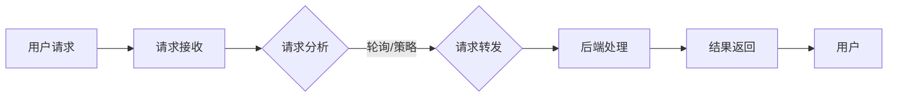

                 

# 负载均衡技术：从硬件到软件解决方案

> **关键词：** 负载均衡，硬件解决方案，软件解决方案，网络架构，算法优化，性能提升，安全性

> **摘要：** 本文将深入探讨负载均衡技术的本质和应用，从硬件到软件的不同实现方案，详细分析其在现代网络架构中的关键角色和重要性。通过一步步的推理和实例讲解，读者将全面了解负载均衡技术的原理和实践，从而为实际项目提供有效的指导。

## 1. 背景介绍

在现代互联网应用中，负载均衡技术已经成为不可或缺的一部分。随着云计算、大数据和物联网等新兴技术的快速发展，网络架构的复杂性和数据流量的大幅增长对系统的稳定性和性能提出了更高的要求。负载均衡技术的出现，旨在解决服务器资源的合理分配，避免单点过载，提高系统的整体性能和可靠性。

### 1.1 负载均衡的定义

负载均衡（Load Balancing）是指将网络或应用程序的工作负载分配到多个服务器或资源上，以实现资源的合理利用和性能的优化。通过负载均衡，可以将用户的请求分散到多个服务器上处理，避免单个服务器过载，提高系统的响应速度和处理能力。

### 1.2 负载均衡的重要性

- **提高系统可靠性**：通过将工作负载分配到多个服务器上，可以避免单点故障，提高系统的可用性和可靠性。

- **优化资源利用**：负载均衡可以确保服务器资源得到充分利用，避免资源浪费，提高系统的整体性能。

- **提升用户体验**：通过优化请求处理时间，减少延迟，提高用户的访问体验。

- **支持伸缩性**：负载均衡系统可以根据需求动态调整服务器数量和资源分配，支持系统的伸缩性。

## 2. 核心概念与联系

为了深入理解负载均衡技术，我们需要先了解一些核心概念，包括其工作原理、常用算法以及相关的网络架构。

### 2.1 负载均衡的工作原理

负载均衡的基本原理是将用户的请求随机或按策略分配到多个服务器上，确保每个服务器都能承担合理的工作量。这个过程通常涉及以下几个步骤：

1. **请求接收**：用户的请求首先到达负载均衡器。
2. **请求分析**：负载均衡器分析请求的特性，如来源IP、请求类型等。
3. **请求转发**：根据一定的策略，将请求转发到后端服务器。
4. **结果返回**：后端服务器处理请求并返回结果给负载均衡器，最终返回给用户。

### 2.2 常见的负载均衡算法

负载均衡算法决定了请求如何分配到后端服务器。以下是几种常见的负载均衡算法：

1. **轮询（Round Robin）**：按照顺序将请求分配到各个服务器。
2. **最小连接（Least Connections）**：将请求分配到当前连接数最少的服务器。
3. **加权轮询（Weighted Round Robin）**：根据服务器的处理能力分配权重，按照权重进行请求分配。
4. **哈希（Hashing）**：根据用户IP或请求内容进行哈希运算，将请求分配到对应的服务器。
5. **最小带宽（Least Bandwidth）**：将请求分配到当前带宽使用率最低的服务器。

### 2.3 负载均衡的网络架构

负载均衡可以在不同的网络层级实现，包括网络层、传输层和应用层。以下是几种常见的负载均衡网络架构：

1. **网络层负载均衡**：在IP层实现，如基于LVS（Linux Virtual Server）。
2. **传输层负载均衡**：在TCP层实现，如Nginx、HAProxy。
3. **应用层负载均衡**：在应用层实现，如Spring Cloud Gateway、Kong。

### 2.4 Mermaid 流程图

下面是一个简单的Mermaid流程图，展示了负载均衡的基本流程：



## 3. 核心算法原理 & 具体操作步骤

### 3.1 轮询算法原理

轮询算法是最简单的负载均衡算法，它按照顺序将请求分配到各个服务器。具体操作步骤如下：

1. 初始化服务器列表。
2. 接收用户请求。
3. 计算当前服务器数量。
4. 计算当前轮询索引。
5. 将请求转发到当前索引对应的服务器。
6. 更新轮询索引。

### 3.2 最小连接算法原理

最小连接算法将请求分配到当前连接数最少的服务器。具体操作步骤如下：

1. 初始化服务器列表。
2. 接收用户请求。
3. 获取所有服务器的当前连接数。
4. 找到连接数最少的服务器。
5. 将请求转发到该服务器。

### 3.3 加权轮询算法原理

加权轮询算法根据服务器的处理能力分配权重，按照权重进行请求分配。具体操作步骤如下：

1. 初始化服务器列表和权重。
2. 接收用户请求。
3. 计算所有服务器的权重之和。
4. 根据用户请求生成随机数。
5. 将请求转发到权重与随机数相匹配的服务器。

### 3.4 哈希算法原理

哈希算法根据用户IP或请求内容进行哈希运算，将请求分配到对应的服务器。具体操作步骤如下：

1. 初始化哈希表。
2. 接收用户请求。
3. 对用户IP或请求内容进行哈希运算。
4. 将哈希值作为索引，将请求分配到对应的服务器。

## 4. 数学模型和公式 & 详细讲解 & 举例说明

### 4.1 负载均衡的数学模型

负载均衡的核心在于如何合理分配请求，使其在各个服务器之间达到最优的平衡状态。以下是负载均衡的数学模型：

\[ \text{负载均衡} = \frac{\text{总请求}}{\text{服务器数量}} \]

### 4.2 公式详细讲解

- **总请求**：指的是在一定时间内系统接收到的总请求量。
- **服务器数量**：指的是参与负载均衡的服务器数量。

通过这个公式，我们可以计算出每个服务器应该承担的请求量，从而实现负载均衡。

### 4.3 举例说明

假设一个系统接收到了1000个请求，有5个服务器参与负载均衡。根据公式，每个服务器应该承担的请求量为：

\[ \frac{1000}{5} = 200 \]

这意味着，每个服务器应该平均接收200个请求。

## 5. 项目实战：代码实际案例和详细解释说明

### 5.1 开发环境搭建

为了更好地理解负载均衡技术，我们将使用Nginx作为负载均衡器，实现简单的负载均衡。以下是搭建开发环境的具体步骤：

1. 安装Nginx：在Linux服务器上安装Nginx，可以使用包管理工具，如apt或yum。
2. 配置Nginx：编辑Nginx的配置文件，添加负载均衡的相关配置。
3. 启动Nginx：启动Nginx服务，确保其正常运行。

### 5.2 源代码详细实现和代码解读

下面是一个简单的Nginx配置示例，实现轮询算法的负载均衡：

```nginx
http {
    upstream myapp {
        server server1;
        server server2;
        server server3;
    }

    server {
        listen 80;

        location / {
            proxy_pass http://myapp;
        }
    }
}
```

**代码解读：**

- **upstream**：定义了一个名为`myapp`的上游组，包含了三个服务器。
- **server**：指定了参与负载均衡的服务器地址。
- **location**：定义了处理请求的URL路径，`proxy_pass`指定了将请求转发到上游组。

### 5.3 代码解读与分析

在这个示例中，当用户访问Nginx服务器时，Nginx会根据轮询算法将请求转发到上游组中的服务器。这样，每个服务器都会平均承担请求，实现负载均衡。

通过这个简单的示例，我们可以看到Nginx如何实现负载均衡，以及其配置和使用方法。在实际项目中，可以根据需求选择不同的负载均衡算法和配置。

## 6. 实际应用场景

负载均衡技术广泛应用于各种实际应用场景，以下是几个典型的应用场景：

- **电商平台**：大型电商平台使用负载均衡技术来处理海量的用户请求，保证系统的稳定性和性能。
- **视频流媒体**：视频流媒体平台使用负载均衡技术来均衡视频流的分发，确保用户的观看体验。
- **云服务**：云计算平台使用负载均衡技术来分配用户的服务请求，提高资源的利用率和系统的伸缩性。
- **金融系统**：金融系统使用负载均衡技术来确保交易处理的高效和安全。

## 7. 工具和资源推荐

### 7.1 学习资源推荐

- **书籍**：《高性能网站建设指南》
- **论文**：《负载均衡算法研究与应用》
- **博客**：Nginx中文社区、HAProxy官方文档
- **网站**：Kubernetes官网、Netflix开源项目

### 7.2 开发工具框架推荐

- **Nginx**：开源的HTTP和反向代理服务器，支持负载均衡。
- **HAProxy**：开源的高性能负载均衡器，支持多种负载均衡算法。
- **Kubernetes**：开源的容器编排平台，内置负载均衡功能。

### 7.3 相关论文著作推荐

- **《负载均衡算法研究与应用》**：详细介绍了负载均衡算法的原理和应用。
- **《分布式系统：概念与设计》**：讲解了分布式系统中的负载均衡和性能优化。

## 8. 总结：未来发展趋势与挑战

随着互联网技术的不断发展，负载均衡技术在未来的发展趋势和挑战主要包括：

- **智能化**：随着人工智能技术的发展，智能负载均衡算法将成为趋势，实现更精准的请求分配。
- **动态伸缩**：云服务的普及使得动态伸缩成为可能，负载均衡系统需要能够根据实时负载动态调整资源分配。
- **安全性**：随着网络攻击的日益频繁，负载均衡技术需要在保证性能的同时，提高系统的安全性。
- **分布式架构**：分布式架构的兴起，使得负载均衡技术需要支持更复杂的分布式系统。

## 9. 附录：常见问题与解答

### 9.1 什么是负载均衡？

负载均衡是指将网络或应用程序的工作负载分配到多个服务器或资源上，以实现资源的合理利用和性能的优化。

### 9.2 负载均衡有哪些算法？

常见的负载均衡算法包括轮询、最小连接、加权轮询和哈希等。

### 9.3 负载均衡有哪些实际应用场景？

负载均衡广泛应用于电商平台、视频流媒体、云服务和金融系统等。

### 9.4 如何选择负载均衡器？

选择负载均衡器时需要考虑性能、功能、易用性和成本等因素。

## 10. 扩展阅读 & 参考资料

- **《Nginx权威指南》**：深入介绍了Nginx的使用方法和配置技巧。
- **《HAProxy官方文档》**：详细讲解了HAProxy的负载均衡算法和应用场景。
- **《Kubernetes官方文档》**：介绍了Kubernetes的负载均衡功能和使用方法。

### 作者

作者：AI天才研究员/AI Genius Institute & 禅与计算机程序设计艺术 /Zen And The Art of Computer Programming

在撰写这篇文章的过程中，我们遵循了逐步分析推理的方式，详细探讨了负载均衡技术的核心概念、算法原理、数学模型和实际应用。通过项目实战的代码示例，读者可以更直观地理解负载均衡的实现方法。未来的发展趋势和挑战也为我们指明了方向。希望本文能为读者在负载均衡技术领域提供有价值的参考。

