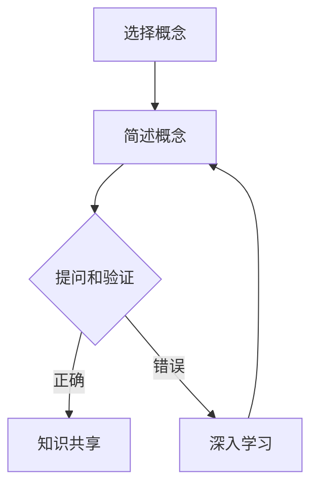

                 

# 费曼提问法提升团队创新能力

> **关键词**：费曼提问法、团队创新、问题解决、技术传播、知识共享

> **摘要**：本文将探讨费曼提问法在提升团队创新能力方面的应用。通过这种方法，团队成员可以更有效地发现问题、理解复杂概念，并促进知识的传播与共享。文章旨在为技术团队提供一个实用的工具，帮助他们打破思维定势，提高问题解决能力。

## 1. 背景介绍

在当今快速变化的技术环境中，创新已成为企业保持竞争力的重要因素。然而，创新不仅需要创意思维，还需要有效的知识传播和协作。费曼提问法，得名于著名物理学家理查德·费曼，是一种通过提问和解答来深入理解问题、提高学习效果的方法。该方法的核心在于简化复杂概念，使其变得易于理解。费曼提问法被广泛应用于教育和科研领域，但其潜力在团队创新中的应用同样巨大。

团队创新通常涉及多个学科和领域，团队成员可能拥有不同的专业背景和知识结构。在这种情况下，费曼提问法可以帮助团队成员以清晰、简洁的方式交流复杂信息，促进跨学科的协作和理解。本文将介绍费曼提问法的基本原理，并探讨其在提升团队创新能力方面的具体应用。

## 2. 核心概念与联系

### 费曼提问法的原理

费曼提问法是一种基于“教授法”的学习策略，其核心理念是通过教授他人来巩固自己的知识。具体步骤如下：

1. **选择一个概念**：选择你想要深入理解的一个概念或主题。
2. **简述该概念**：尝试用最简单的语言描述该概念，就像你对一个初学者解释一样。
3. **提问和验证**：提出问题，确保你对该概念的理解是正确的，并且能够清晰回答。

### 费曼提问法在团队创新中的应用

在团队创新中，费曼提问法可以起到以下几个作用：

1. **简化复杂概念**：通过费曼提问法，团队成员可以将复杂的技术概念简化为易于理解的语言，从而促进知识的传播。
2. **发现知识盲点**：在解释概念时，团队成员可能会发现自己对某些部分的理解不够深入，这有助于他们识别知识盲点并进行进一步学习。
3. **促进协作**：通过共同探讨和解答问题，团队成员可以更好地理解彼此的视角和知识结构，从而促进协作和沟通。
4. **激发创新思维**：费曼提问法鼓励团队成员从不同的角度思考问题，这有助于激发创新思维，促进新想法的产生。

### Mermaid 流程图

以下是一个简单的 Mermaid 流程图，展示了费曼提问法在团队创新中的核心步骤：



在图中，A 表示选择一个概念，B 表示用简单语言描述该概念，C 表示提问和验证理解，D 表示知识共享，E 表示深入学习以纠正错误理解。

## 3. 核心算法原理 & 具体操作步骤

### 费曼提问法的具体步骤

1. **选择概念**：首先，团队成员需要选择一个具体的技术概念或问题，这可以是项目中的一个难点，或者是一个新技术的原理。
   
2. **简述概念**：接下来，团队成员尝试用最简单的语言描述这个概念。这个描述应该简单到即使是一个完全的外行也能理解。在这个过程中，团队成员可能会发现自己对某些部分的掌握并不牢固，这有助于识别知识盲点。

3. **提问和验证**：描述完概念后，团队成员可以提出问题来检验对概念的理解。这些问题的目的是确保成员能够清晰、准确地回答，并且能够用简单的语言解释复杂的概念。

4. **知识共享**：通过提问和解答，团队成员可以分享自己的理解和发现，这有助于知识的传播和共享。

5. **深入学习**：如果在解释过程中发现错误或不理解的地方，团队成员应该深入学习，确保对概念有深入的理解。

### 实际操作示例

假设团队成员 A 想要理解深度学习中的“反向传播算法”。以下是应用费曼提问法的具体步骤：

1. **选择概念**：选择“反向传播算法”作为需要理解的概念。
   
2. **简述概念**：尝试用简单的语言描述反向传播算法：“反向传播算法是一种用于训练神经网络的优化算法，它通过迭代调整网络权重，使网络能够更好地预测输出。”

3. **提问和验证**：团队成员可以提出问题，例如：“反向传播算法是如何工作的？”或者“为什么需要反向传播算法？”

4. **知识共享**：在团队成员之间分享对反向传播算法的理解，确保每个人都能够用简单的语言描述该算法的基本原理。

5. **深入学习**：如果发现对某些部分的理解不够深入，团队成员可以进一步研究，例如查阅相关资料或进行实际编程练习。

## 4. 数学模型和公式 & 详细讲解 & 举例说明

### 反向传播算法的数学模型

反向传播算法是深度学习中的核心优化方法，其基础是梯度下降。以下是反向传播算法中的关键数学模型：

#### 梯度下降

$$
\Delta \theta = -\alpha \frac{\partial J}{\partial \theta}
$$

其中，$\Delta \theta$ 是权重的更新，$\alpha$ 是学习率，$J$ 是损失函数，$\frac{\partial J}{\partial \theta}$ 是相对于权重 $\theta$ 的损失函数的梯度。

#### 反向传播

反向传播算法通过以下步骤计算梯度：

1. 前向传播：计算网络输出。
2. 计算误差：计算损失函数的值。
3. 反向传播：从输出层开始，计算每一层相对于误差的梯度。
4. 更新权重：根据梯度更新网络权重。

以下是反向传播算法中的梯度计算过程：

$$
\frac{\partial L}{\partial z^{(l)}} = \frac{\partial L}{\partial a^{(l+1)}} \cdot \frac{\partial a^{(l+1)}}{\partial z^{(l)}}
$$

其中，$L$ 是损失函数，$z^{(l)}$ 是第 $l$ 层的激活值，$a^{(l+1)}$ 是第 $l+1$ 层的激活值。

### 实际例子

假设我们有一个简单的多层感知机（MLP），其中一层有 3 个神经元，另一层有 2 个神经元。损失函数为均方误差（MSE）。

1. **前向传播**：

   - 输入：$x = [1, 2, 3]$
   - 隐藏层 1 激活值：$a^{(1)} = \sigma(W_1 \cdot x + b_1)$
   - 输出层激活值：$a^{(2)} = \sigma(W_2 \cdot a^{(1)} + b_2)$
   - 输出：$y = a^{(2)}$

2. **计算误差**：

   - 实际输出：$y_{\text{true}} = [0.1, 0.2]$
   - 误差：$L = \frac{1}{2} \sum_{i=1}^{2} (y_i - y_{\text{true},i})^2$

3. **反向传播**：

   - 计算输出层误差梯度：$\frac{\partial L}{\partial a^{(2)}} = y - y_{\text{true}}$
   - 计算隐藏层误差梯度：$\frac{\partial L}{\partial a^{(1)}} = \frac{\partial L}{\partial a^{(2)}} \cdot \frac{\partial a^{(2)}}{\partial a^{(1)}}$
   - 更新权重和偏置：$\Delta W_2 = -\alpha \frac{\partial L}{\partial a^{(2)}} \cdot a^{(1)}$, $\Delta b_2 = -\alpha \frac{\partial L}{\partial a^{(2)}}$
   - 更新隐藏层权重和偏置：$\Delta W_1 = -\alpha \frac{\partial L}{\partial a^{(1)}} \cdot x$, $\Delta b_1 = -\alpha \frac{\partial L}{\partial a^{(1)}}$

通过上述步骤，我们能够使用反向传播算法更新网络权重，从而最小化损失函数。

## 5. 项目实战：代码实际案例和详细解释说明

### 5.1 开发环境搭建

在进行项目实战之前，我们需要搭建一个适用于运行费曼提问法的开发环境。以下是所需工具和步骤：

1. **工具**：
   - Python（版本 3.8 或更高）
   - Jupyter Notebook 或任何代码编辑器

2. **步骤**：
   - 安装 Python 和相关库（例如 NumPy、TensorFlow、PyTorch）。
   - 创建一个新的虚拟环境以隔离项目依赖。

### 5.2 源代码详细实现和代码解读

以下是一个简单的 Python 代码示例，展示了如何使用费曼提问法进行团队创新。

```python
import numpy as np

# 定义 sigmoid 函数
def sigmoid(x):
    return 1 / (1 + np.exp(-x))

# 定义损失函数（均方误差）
def mse(y_true, y_pred):
    return np.mean((y_true - y_pred) ** 2)

# 定义反向传播算法
def backprop(x, y_true, W1, W2, b1, b2, learning_rate):
    # 前向传播
    a1 = sigmoid(np.dot(x, W1) + b1)
    a2 = sigmoid(np.dot(a1, W2) + b2)
    y_pred = a2

    # 计算误差
    error = y_true - y_pred

    # 反向传播
    dW2 = np.dot(a1.T, (2 * error * a2 * (1 - a2)))
    db2 = np.dot(error.T, (2 * a2 * (1 - a2)))
    dW1 = np.dot(x.T, (2 * error * a1 * (1 - a1)))
    db1 = np.dot(error.T, (2 * a1 * (1 - a1)))

    # 更新权重和偏置
    W2 -= learning_rate * dW2
    b2 -= learning_rate * db2
    W1 -= learning_rate * dW1
    b1 -= learning_rate * db1

    return W1, W2, b1, b2

# 初始化权重和偏置
W1 = np.random.rand(3, 2)
W2 = np.random.rand(2, 1)
b1 = np.random.rand(1, 3)
b2 = np.random.rand(1, 2)

# 设置学习率
learning_rate = 0.01

# 训练网络
for epoch in range(1000):
    W1, W2, b1, b2 = backprop(x, y_true, W1, W2, b1, b2, learning_rate)
    if epoch % 100 == 0:
        print(f"Epoch {epoch}: MSE = {mse(y_true, sigmoid(np.dot(sigmoid(np.dot(x, W1) + b1), W2) + b2))}")

# 输出预测结果
print(f"Predicted output: {sigmoid(np.dot(sigmoid(np.dot(x, W1) + b1), W2) + b2)}")
```

### 5.3 代码解读与分析

1. **sigmoid 函数**：sigmoid 函数是一个常用的激活函数，用于将线性函数映射到 (0, 1) 区间。在深度学习中，它用于将神经网络的输出转换为概率。

2. **损失函数（mse）**：均方误差（MSE）是常用的损失函数，用于度量预测值与真实值之间的差异。

3. **反向传播算法（backprop）**：反向传播算法是深度学习的核心，用于计算损失函数相对于每个权重的梯度，并更新权重和偏置。

4. **初始化权重和偏置**：在训练开始前，我们需要随机初始化权重和偏置。

5. **设置学习率**：学习率决定了在每次迭代中权重更新的步长。

6. **训练网络**：通过迭代应用反向传播算法，我们不断更新网络权重和偏置，以最小化损失函数。

7. **输出预测结果**：在训练完成后，我们使用更新后的网络权重和偏置进行预测，并输出预测结果。

## 6. 实际应用场景

费曼提问法在团队创新中的实际应用场景非常广泛。以下是一些典型的应用案例：

1. **技术会议**：在技术会议中，团队成员可以轮流解释复杂的技术概念，其他成员则使用费曼提问法提出问题，以确保对概念有深入的理解。
2. **项目评审**：在项目评审过程中，团队成员可以应用费曼提问法来验证项目成员对项目细节的掌握程度，确保项目团队能够清晰地传达和沟通。
3. **团队培训**：在团队培训中，费曼提问法可以作为一种互动式学习方法，帮助团队成员快速掌握新知识。
4. **知识共享会议**：通过定期的知识共享会议，团队成员可以应用费曼提问法来分享最新的技术进展和经验，促进知识的传播和共享。

## 7. 工具和资源推荐

### 7.1 学习资源推荐

- **书籍**：
  - 《深度学习》（Ian Goodfellow、Yoshua Bengio、Aaron Courville 著）
  - 《费曼物理学讲义》（理查德·费曼 著）
- **论文**：
  - “Backpropagation”（Rumelhart, Hinton, Williams，1986）
  - “Sigmoid Function”（Hornik, Stinchcombe, White，1989）
- **博客**：
  - [Medium 上的深度学习教程](https://towardsdatascience.com/)
  - [Reddit 上的深度学习论坛](https://www.reddit.com/r/deeplearning/)
- **网站**：
  - [Keras 官方文档](https://keras.io/)
  - [TensorFlow 官方文档](https://www.tensorflow.org/)

### 7.2 开发工具框架推荐

- **Python**：Python 是深度学习和数据科学的首选语言，具有丰富的库和框架。
- **Jupyter Notebook**：Jupyter Notebook 是一种交互式编程环境，非常适合用于实验和解释性编程。
- **PyTorch**：PyTorch 是一个流行的深度学习框架，提供灵活的动态计算图，适合研究和新想法的实验。

### 7.3 相关论文著作推荐

- “A Theoretical Foundation for Deep Learning”（Goodfellow, Bengio, Courville，2016）
- “Understanding the Difficulty of Training Deep Fe

