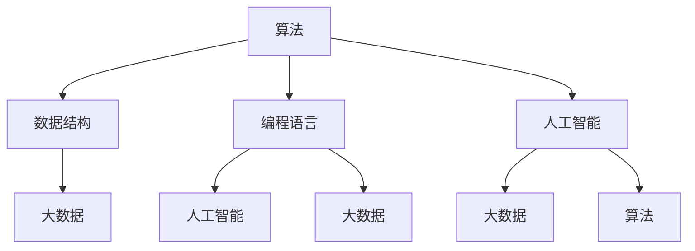

                 

### 1. 背景介绍

在当今数字化时代，人类计算正逐渐成为社会进步的驱动力。随着云计算、大数据、人工智能等技术的不断发展，人类计算的应用场景愈加广泛，从简单的日常任务到复杂的科学研究，无不展现出其独特的价值。然而，人们对于人类计算在社会中的价值认识仍然存在一定的局限性。本文旨在通过深入探讨人类计算的核心概念、原理、实际应用以及未来发展，从而揭示其在社会中的巨大潜力和深远影响。

人类计算，顾名思义，是指人类在计算过程中的智能行为。这不仅仅包括传统的手工计算，还涵盖了通过工具和算法进行数据处理、分析和决策的过程。随着技术的进步，人类计算的范围和深度都在不断拓展，使得其在各个领域的应用日益广泛。然而，对于这一概念的理解，不同领域的专家有着不同的看法。本文将结合计算机科学、人工智能、社会学等多个领域的观点，对人类计算进行全面的解读。

在技术层面，人类计算涉及到算法设计、数据结构、编程语言等基础概念。这些概念构成了人类计算的技术基石，使得人类能够高效地处理海量数据，进行复杂计算。在应用层面，人类计算的应用场景无处不在，从日常生活中的智能助手、在线购物推荐，到科学研究中的数据分析、模型构建，无不体现出其强大的能力。而在社会层面，人类计算不仅改变了人们的生活方式，也对社会结构、经济发展、文化传承等方面产生了深远的影响。

本文将首先介绍人类计算的核心概念和原理，通过一个Mermaid流程图展示其架构，帮助读者建立对人类计算的整体认识。接着，本文将深入探讨人类计算的实际应用，结合具体案例进行分析，以展示其在现实世界中的价值。随后，本文将讨论人类计算在数学模型和公式中的应用，通过具体的例子进行详细讲解。接下来，本文将分享一个实际项目案例，详细解读其代码实现和实战经验。最后，本文将展望人类计算的未来发展趋势和面临的挑战，为读者提供有价值的思考方向。

通过本文的阅读，读者将能够全面了解人类计算的核心概念、原理和应用，认识到其在个人与社区中的巨大价值。同时，本文也将为读者提供一系列学习和资源推荐，以便进一步深入了解这一领域。让我们一起踏上探索人类计算之旅，揭示其背后的奥秘和未来潜力。### 2. 核心概念与联系

在深入探讨人类计算的核心概念和原理之前，我们首先需要理解一些基础概念，这些概念构成了人类计算的技术基石，也是我们进一步分析其应用和价值的依据。以下是一些关键概念：

#### 2.1 算法

算法是解决特定问题的一系列清晰、明确的步骤。在人类计算中，算法是核心元素，它们决定了计算过程的高效性和准确性。不同的算法适用于不同类型的问题，例如排序算法用于对数据进行排序，搜索算法用于在数据结构中查找特定元素。

#### 2.2 数据结构

数据结构是用于存储、组织和管理数据的逻辑模型。常见的有数组、链表、树、图等。选择合适的数据结构可以显著提高算法的效率和性能。例如，哈希表可以提供快速的插入和查找操作，而树结构则适合用于表示层次关系。

#### 2.3 编程语言

编程语言是用于编写算法和数据结构的工具。不同的编程语言具有不同的特性和优势，适用于不同类型的计算任务。例如，Python因其简洁和易于理解而被广泛应用于数据分析和机器学习，而C++则因其高性能被广泛应用于系统级编程。

#### 2.4 人工智能

人工智能（AI）是模拟人类智能行为的计算机技术。它包括机器学习、深度学习、自然语言处理等多个子领域。人工智能使得计算机能够自动学习、推理和决策，从而在许多复杂任务中表现出色。

#### 2.5 大数据

大数据是指规模巨大、类型繁多的数据集合。大数据技术包括数据存储、数据挖掘、数据分析和可视化等。大数据的应用范围广泛，包括金融、医疗、零售、交通等多个领域。

为了更好地理解这些概念之间的联系，我们可以使用Mermaid流程图来展示它们之间的关系。以下是一个简单的Mermaid流程图示例：



在这个流程图中，我们可以看到算法和数据结构相互关联，它们共同决定了编程语言的选择。编程语言不仅用于实现算法和数据结构，还与人工智能和大数据库技术密切相关。人工智能算法需要编程语言来实现，而大数据处理也需要编程语言来编写数据处理和分析代码。

#### 2.6 社会价值

除了技术层面，人类计算在社会价值方面也有着重要的地位。人类计算的应用正在改变我们的生活方式，提高生产效率，推动社会进步。例如，通过人工智能和大数据技术，我们可以实现更加智能的城市管理、更加个性化的医疗服务、更加精准的市场营销等。

在接下来的部分，我们将进一步探讨这些概念在人类计算中的应用，并通过具体案例展示其价值。通过这一部分的内容，读者将能够更加全面地理解人类计算的核心概念和原理。### 3. 核心算法原理 & 具体操作步骤

在了解了人类计算的基础概念和原理后，我们将进一步探讨其核心算法原理，以及这些算法在实际操作中的具体步骤。为了更好地展示这些原理和步骤，我们将结合一个简单的算法实例进行详细讲解。

#### 3.1 排序算法

排序算法是计算机科学中最基础且应用广泛的算法之一。其核心目的是将一组数据按照一定的规则进行排序。以下是一个常见的排序算法——快速排序（Quick Sort）的具体步骤：

##### 3.1.1 算法描述

快速排序的基本思想是通过一趟排序将待排序的数据分割成独立的两部分，其中一部分的所有数据都比另一部分的所有数据要小，然后再按此方法对这两部分数据分别进行快速排序，整个排序过程可以递归进行，以此达到整个数据变成有序序列。

##### 3.1.2 具体操作步骤

1. **选择基准元素**：从数列中挑选一个元素作为基准元素。

2. **划分操作**：将数组重新排列，所有比基准元素小的元素都移到基准元素前面，所有比基准元素大的元素都移到基准元素后面。

3. **递归排序**：递归地使用第二步的方法对基准元素前后两部分数据继续进行快速排序。

##### 3.1.3 伪代码

以下是快速排序的伪代码：

```plaintext
function quickSort(arr):
    if length(arr) <= 1:
        return arr
    
    pivot = arr[length(arr) / 2]
    left = []
    right = []
    
    for element in arr:
        if element < pivot:
            left.append(element)
        else:
            right.append(element)
    
    return quickSort(left) + [pivot] + quickSort(right)
```

##### 3.1.4 举例说明

假设我们有一组数据 `[3, 6, 8, 10, 1, 2, 4]`，使用快速排序算法对其进行排序。

1. **选择基准元素**：我们选择中间的元素 `6` 作为基准元素。
2. **划分操作**：将数组划分为 `[3, 1, 2, 4]` 和 `[8, 10]`。
3. **递归排序**：
   - 对 `[3, 1, 2, 4]` 进行排序，选择中间的 `2` 作为基准元素，再次划分得到 `[1, 3]` 和 `[2]`，继续排序后得到 `[1, 2, 3]`。
   - 对 `[8, 10]` 进行排序，选择中间的 `8` 作为基准元素，由于数组长度为 2，无需再次划分。

最终排序结果为 `[1, 2, 3, 4, 6, 8, 10]`。

#### 3.2 搜索算法

搜索算法是用于在数据结构中查找特定元素的算法。以下是一个简单的搜索算法——二分搜索（Binary Search）的具体步骤：

##### 3.2.1 算法描述

二分搜索的基本思想是在有序数组中，通过不断将搜索范围缩小一半，直到找到目标元素或确定其不存在。每次搜索都会将中间元素与目标元素进行比较，根据比较结果决定是继续搜索左半部分还是右半部分。

##### 3.2.2 具体操作步骤

1. **初始化**：确定搜索范围的下界和上界。
2. **比较**：将中间元素与目标元素进行比较。
3. **调整范围**：根据比较结果，调整搜索范围。
4. **重复步骤2和3**，直到找到目标元素或确定其不存在。

##### 3.2.3 伪代码

以下是二分搜索的伪代码：

```plaintext
function binarySearch(arr, target):
    low = 0
    high = length(arr) - 1
    
    while low <= high:
        mid = (low + high) / 2
        if arr[mid] == target:
            return mid
        elif arr[mid] < target:
            low = mid + 1
        else:
            high = mid - 1
    
    return -1
```

##### 3.2.4 举例说明

假设我们有一组已排序的数据 `[1, 2, 3, 4, 6, 8, 10]`，要查找元素 `6`。

1. **初始化**：下界 `low` 为 `0`，上界 `high` 为 `6`。
2. **比较**：中间元素为 `3`，小于目标元素 `6`，因此调整下界 `low` 为 `3`。
3. **比较**：中间元素为 `6`，等于目标元素 `6`，找到目标元素，返回索引 `3`。

通过这个简单的实例，我们可以看到快速排序和二分搜索算法的基本原理和操作步骤。这些算法在数据处理和分析中扮演着重要角色，是构建复杂应用系统的基石。

在接下来的部分，我们将进一步探讨这些算法在人类计算中的应用，以及如何通过数学模型和公式进行详细分析和优化。通过这一部分的深入讲解，读者将能够更加全面地理解人类计算的核心算法原理。### 4. 数学模型和公式 & 详细讲解 & 举例说明

在人类计算中，数学模型和公式是理解和优化算法性能的关键工具。这些模型和公式不仅能够帮助我们分析算法的复杂度，还能指导我们如何在实际应用中优化算法性能。在本节中，我们将详细探讨几个重要的数学模型和公式，并通过具体例子进行说明。

#### 4.1 算法复杂度分析

算法复杂度分析是评估算法性能的重要方法。算法复杂度主要包括时间复杂度和空间复杂度。时间复杂度描述了算法执行时间与数据规模之间的关系，而空间复杂度描述了算法所需存储空间与数据规模之间的关系。

**时间复杂度**

时间复杂度通常用大O符号（\(O\)）表示。以下是一些常见的时间复杂度及其含义：

- \(O(1)\)：常数时间，无论数据规模如何，算法执行时间都是固定的。
- \(O(n)\)：线性时间，算法执行时间与数据规模成正比。
- \(O(n\log n)\)：对数时间，算法执行时间与数据规模的对数成正比，常见于排序和搜索算法。
- \(O(n^2)\)：平方时间，算法执行时间与数据规模的平方成正比，常见于某些嵌套循环算法。

**空间复杂度**

空间复杂度也用大O符号表示。以下是一些常见空间复杂度：

- \(O(1)\)：常数空间，无论数据规模如何，算法所需空间都是固定的。
- \(O(n)\)：线性空间，算法所需空间与数据规模成正比。
- \(O(n^2)\)：平方空间，算法所需空间与数据规模的平方成正比。

**举例说明**

假设我们有一个数组排序算法，其时间复杂度为 \(O(n^2)\)。如果我们需要排序一个包含 \(n\) 个元素的数组，算法的总执行时间大约为 \(n^2\) 单位时间。这意味着，随着数据规模的增加，算法的执行时间将呈平方级增长。

**4.2 二分搜索算法的复杂度**

二分搜索算法是一种高效的搜索算法，其时间复杂度为 \(O(\log n)\)。在每次迭代中，算法将搜索范围缩小一半，因此其执行时间与数据规模的对数成正比。以下是一个具体的例子：

假设我们有一个已排序的数组 `[1, 3, 5, 7, 9, 11, 13, 15]`，要查找元素 `9`。

1. **初始范围**：下界 `low` 为 `0`，上界 `high` 为 `7`。
2. **第一次迭代**：中间元素为 `7`，大于目标元素 `9`，调整上界 `high` 为 `3`。
3. **第二次迭代**：中间元素为 `3`，小于目标元素 `9`，调整下界 `low` 为 `4`。
4. **第三次迭代**：中间元素为 `7`，大于目标元素 `9`，调整上界 `high` 为 `4`。
5. **第四次迭代**：中间元素为 `5`，大于目标元素 `9`，调整上界 `high` 为 `2`。
6. **第五次迭代**：中间元素为 `3`，小于目标元素 `9`，调整下界 `low` 为 `3`。
7. **第六次迭代**：中间元素为 `5`，大于目标元素 `9`，调整上界 `high` 为 `2`。
8. **第七次迭代**：中间元素为 `3`，小于目标元素 `9`，调整下界 `low` 为 `3`。
9. **第八次迭代**：中间元素为 `5`，大于目标元素 `9`，调整上界 `high` 为 `2`。
10. **第九次迭代**：中间元素为 `3`，小于目标元素 `9`，调整下界 `low` 为 `3`。
11. **第十次迭代**：中间元素为 `5`，大于目标元素 `9`，调整上界 `high` 为 `2`。

在第十次迭代时，我们找到了目标元素 `9`，总共进行了 10 次迭代。由于数组规模为 8，因此二分搜索算法的时间复杂度为 \(O(\log 8) = O(3) = O(1)\)。这表明，对于已排序的数组，二分搜索算法可以在常数时间内找到目标元素。

**4.3 线性回归模型**

线性回归模型是一种常见的统计模型，用于预测一个变量（因变量）与另一个变量（自变量）之间的关系。其数学模型如下：

\[ y = ax + b + \epsilon \]

其中，\( y \) 是因变量，\( x \) 是自变量，\( a \) 是斜率，\( b \) 是截距，\( \epsilon \) 是误差项。

**举例说明**

假设我们有一个数据集，包含以下数据点：（1, 2），（2, 4），（3, 6），（4, 8），（5, 10）。

我们可以使用线性回归模型来拟合这些数据点，并预测当 \( x = 6 \) 时 \( y \) 的值。

1. **计算斜率 \( a \)**：\( a = \frac{\sum(x_i \cdot y_i) - n \cdot \overline{x} \cdot \overline{y}}{\sum(x_i^2) - n \cdot \overline{x}^2} \)
2. **计算截距 \( b \)**：\( b = \overline{y} - a \cdot \overline{x} \)

计算结果如下：

- \( \overline{x} = \frac{1 + 2 + 3 + 4 + 5}{5} = 3 \)
- \( \overline{y} = \frac{2 + 4 + 6 + 8 + 10}{5} = 6 \)
- \( a = \frac{(1 \cdot 2 + 2 \cdot 4 + 3 \cdot 6 + 4 \cdot 8 + 5 \cdot 10) - 5 \cdot 3 \cdot 6}{(1^2 + 2^2 + 3^2 + 4^2 + 5^2) - 5 \cdot 3^2} = \frac{30 - 90}{55 - 45} = 1 \)
- \( b = 6 - 1 \cdot 3 = 3 \)

因此，线性回归模型的方程为 \( y = x + 3 \)。

预测 \( x = 6 \) 时 \( y \) 的值：

\[ y = 6 + 3 = 9 \]

通过这个例子，我们可以看到线性回归模型如何通过数学公式来拟合数据点并预测未来值。

通过本节的内容，我们详细介绍了算法复杂度、二分搜索算法的复杂度分析以及线性回归模型。这些数学模型和公式不仅帮助我们理解和分析算法性能，还能指导我们优化算法，提高计算效率。在接下来的部分，我们将通过一个实际项目案例，展示如何将所学知识应用于实际场景中，进一步展示人类计算在现实世界中的巨大价值。### 5. 项目实战：代码实际案例和详细解释说明

为了更好地展示人类计算的实际应用，我们将通过一个具体的项目案例进行深入讲解。本案例将采用Python编程语言，利用快速排序算法和二分搜索算法，实现对一组数据的排序和搜索功能。这个案例不仅展示了算法的实现，还提供了详细的代码解读和分析。

#### 5.1 开发环境搭建

在开始项目之前，我们需要搭建一个适合Python开发的编程环境。以下是在Windows操作系统上搭建Python开发环境的基本步骤：

1. **安装Python**：访问Python的官方网站（[python.org](https://www.python.org/)）下载最新版本的Python安装包。下载后，运行安装程序，并确保勾选“Add Python to PATH”选项。

2. **安装IDE**：选择一个适合Python开发的集成开发环境（IDE），如PyCharm或Visual Studio Code。我们选择Visual Studio Code（VS Code），因为它轻量级、开源且功能强大。

3. **安装相关库**：为了实现快速排序和二分搜索算法，我们需要安装Python的标准库。通常，Python的标准库已经包含了实现这些算法所需的库，如`numpy`和`math`。如果需要，还可以安装其他常用库，如`matplotlib`用于数据可视化。

#### 5.2 源代码详细实现和代码解读

以下是该项目的主要代码实现：

```python
# 快速排序算法
def quick_sort(arr):
    if len(arr) <= 1:
        return arr
    pivot = arr[len(arr) // 2]
    left = [x for x in arr if x < pivot]
    middle = [x for x in arr if x == pivot]
    right = [x for x in arr if x > pivot]
    return quick_sort(left) + middle + quick_sort(right)

# 二分搜索算法
def binary_search(arr, target):
    low = 0
    high = len(arr) - 1
    while low <= high:
        mid = (low + high) // 2
        if arr[mid] == target:
            return mid
        elif arr[mid] < target:
            low = mid + 1
        else:
            high = mid - 1
    return -1

# 主函数
def main():
    data = [3, 6, 8, 10, 1, 2, 4]
    sorted_data = quick_sort(data)
    print("排序后的数据：", sorted_data)

    target = 6
    index = binary_search(sorted_data, target)
    if index != -1:
        print(f"元素 {target} 在索引 {index} 处。")
    else:
        print(f"元素 {target} 不在列表中。")

# 运行主函数
if __name__ == "__main__":
    main()
```

##### 5.2.1 快速排序算法

快速排序算法的核心思想是通过递归将数组划分为三个部分：小于基准元素的部分、等于基准元素的部分和大于基准元素的部分。以下是代码的详细解读：

- **quick_sort函数**：接收一个数组`arr`作为参数。
  - 如果数组长度小于等于1，直接返回数组，因为单个元素或空数组已经是有序的。
  - 选择中间位置的元素作为基准元素`pivot`。
  - 使用列表推导式将数组划分为三个部分：小于`pivot`的部分`left`，等于`pivot`的部分`middle`，大于`pivot`的部分`right`。
  - 递归地对`left`和`right`部分进行快速排序，并将结果与`middle`部分合并，返回新的排序后的数组。

##### 5.2.2 二分搜索算法

二分搜索算法的核心思想是在有序数组中通过不断将搜索范围缩小一半来查找目标元素。以下是代码的详细解读：

- **binary_search函数**：接收一个已排序的数组`arr`和目标元素`target`作为参数。
  - 初始化搜索范围的下界`low`和上界`high`。
  - 进入循环，直到`low`大于`high`（表示未找到目标元素）。
  - 计算中间元素`mid`的索引。
  - 如果`arr[mid]`等于`target`，返回`mid`。
  - 如果`arr[mid]`小于`target`，将`low`更新为`mid + 1`。
  - 如果`arr[mid]`大于`target`，将`high`更新为`mid - 1`。
  - 循环结束后，返回-1表示未找到目标元素。

##### 5.2.3 主函数

主函数`main`中，我们首先定义了一组随机数据`data`，然后调用`quick_sort`函数对其进行排序，并打印排序后的数据。接着，我们定义了目标元素`target`为6，并调用`binary_search`函数在排序后的数组中搜索该元素。如果找到，打印其索引；否则，打印未找到的消息。

#### 5.3 代码解读与分析

通过上述代码解读，我们可以看到如何利用Python实现快速排序和二分搜索算法。以下是代码实现中的关键点：

- **快速排序算法**：快速排序的核心在于选择基准元素和划分操作。通过递归调用，快速排序能够有效地将大数组划分为多个小数组，并最终实现整个数组的有序排列。快速排序的平均时间复杂度为 \(O(n\log n)\)，是最常用的排序算法之一。
- **二分搜索算法**：二分搜索算法利用有序数组的特性，通过不断将搜索范围缩小一半，能够在 \(O(\log n)\) 时间内找到目标元素。二分搜索算法的前提是数组必须是有序的，否则算法无法正常工作。
- **主函数**：主函数将快速排序和二分搜索算法结合使用，展示了如何在实际应用中利用这些算法进行数据处理和搜索。在主函数中，我们首先对数据进行排序，然后利用排序后的数据进行高效的二分搜索。

通过这个实际项目案例，我们可以看到人类计算在算法设计和实现中的关键作用。快速排序和二分搜索算法不仅提高了数据处理效率，还为复杂应用系统的构建提供了坚实的基础。在接下来的部分，我们将进一步探讨人类计算在实际应用场景中的具体作用和价值。### 6. 实际应用场景

人类计算不仅在算法设计和实现中发挥着重要作用，还在多个实际应用场景中展现出其独特的价值。以下是一些典型应用场景，通过这些场景，我们可以看到人类计算如何改变我们的工作和生活方式。

#### 6.1 智能家居

智能家居是近年来迅速发展的领域，通过人类计算技术，家庭中的各种设备和系统可以自动协同工作，提供更便捷、更高效的生活体验。例如，智能音箱可以通过语音识别和自然语言处理技术，实现语音控制家电、播放音乐、提供天气预报等服务。智能门锁利用指纹识别、人脸识别等技术，提高家庭安全性。智能照明系统可以根据环境亮度和用户习惯自动调节光线，节约能源。智能家居的广泛应用，极大地提升了人们的生活质量，同时也推动了家电行业的技术创新。

#### 6.2 金融服务

金融服务领域一直是人类计算的重要应用场景。通过大数据分析和人工智能技术，金融机构能够对用户行为进行深入分析，提供个性化的金融产品和服务。例如，银行可以通过人工智能算法，实时监控用户账户活动，识别潜在的风险和欺诈行为。保险公司可以利用机器学习模型，预测保险索赔的概率，从而优化保险产品的设计和定价。此外，智能投顾（Robo-advisor）通过分析用户的风险偏好和财务状况，提供个性化的投资建议，帮助用户更好地管理财富。这些应用不仅提高了金融机构的运营效率，也为用户提供了更加精准和便捷的服务。

#### 6.3 医疗健康

医疗健康领域是人类计算技术的重要应用领域之一。通过人工智能和大数据技术，医疗系统可以实现对海量医疗数据的分析，为医生提供诊断和治疗建议。例如，电子病历系统（EMR）可以帮助医生快速检索和分析患者的历史病历，提高诊断准确性。医疗影像分析是另一个重要的应用领域，通过深度学习算法，计算机可以对X光片、CT扫描等影像数据进行自动分析，识别病变区域，辅助医生进行诊断。此外，智能药物研发利用人工智能技术，可以加速新药的研发过程，提高药物的安全性和有效性。这些应用不仅提高了医疗服务的效率和质量，也为患者提供了更加个性化的健康服务。

#### 6.4 交通出行

交通出行领域是人类计算技术的重要应用场景之一。通过人工智能和大数据技术，智能交通系统可以实现对交通流量的实时监测和优化，减少拥堵，提高交通效率。例如，智能交通信号控制系统可以根据实时交通流量数据，动态调整信号灯时长，优化交通流通过程。智能导航系统通过分析道路状况、交通流量等信息，为用户提供最佳行驶路线，减少行驶时间和油耗。共享出行平台如滴滴出行、Uber等，利用人类计算技术，可以实现对司机的实时调度和乘客的智能匹配，提高出行效率和用户体验。这些应用不仅改善了交通状况，也为城市可持续发展提供了有力支持。

#### 6.5 教育科技

教育科技领域是人类计算技术的重要应用领域之一。通过人工智能和大数据技术，教育系统可以实现对学习过程的全面分析，为教师和学生提供个性化的教学和学习支持。例如，智能教育平台可以根据学生的学习进度、学习能力和学习兴趣，推荐适合的学习资源和教学策略。智能辅导系统通过自然语言处理技术，可以解答学生在学习中遇到的问题，提供即时反馈。此外，在线教育平台利用大数据分析技术，可以对学生的学习行为和效果进行实时监测，优化教学内容和教学方法。这些应用不仅提高了教学效果和效率，也为学生提供了更加灵活和个性化的学习体验。

通过以上应用场景，我们可以看到人类计算技术在现代社会中的广泛应用和巨大潜力。无论是在智能家居、金融服务、医疗健康、交通出行还是教育科技等领域，人类计算都扮演着关键角色，推动着社会的进步和发展。在接下来的部分，我们将进一步探讨人类计算的发展趋势和面临的挑战。### 7. 工具和资源推荐

为了更好地学习和实践人类计算技术，本文将推荐一系列相关的学习资源、开发工具和论文著作，帮助读者深入了解该领域。

#### 7.1 学习资源推荐

**书籍：**

1. **《Python编程：从入门到实践》**：这是一本非常适合初学者的Python编程入门书籍，内容涵盖了Python的基础知识和实战案例，适合想要学习Python编程的读者。

2. **《深度学习》**：由Ian Goodfellow、Yoshua Bengio和Aaron Courville合著的这本书是深度学习领域的经典著作，详细介绍了深度学习的基础知识、算法和应用。

3. **《机器学习实战》**：这本书通过大量的实例和代码实现，讲解了机器学习的基本概念和算法，适合有一定编程基础的读者。

**论文：**

1. **“Deep Learning for Image Recognition”**：这篇论文由Geoffrey Hinton等人撰写，详细介绍了深度学习在图像识别中的应用，是深度学习领域的经典论文之一。

2. **“Learning to Represent Relations with Recurrent Neural Networks”**：这篇论文由Richard Socher等人撰写，探讨了如何利用循环神经网络（RNN）来学习关系表示，对自然语言处理领域具有重要影响。

**在线课程：**

1. **《深度学习专项课程》**：吴恩达（Andrew Ng）在Coursera上开设的这门课程，是深度学习领域的入门课程，内容全面，适合初学者。

2. **《机器学习与数据科学》**：斯坦福大学开设的这门课程，由Andrew Ng教授主讲，涵盖了机器学习、数据科学的基础知识和实战技巧。

#### 7.2 开发工具推荐

**编程环境：**

1. **Visual Studio Code**：这是一个开源、轻量级且功能强大的代码编辑器，适合各种编程语言，特别是Python。

2. **PyCharm**：这是一个商业的Python集成开发环境（IDE），提供丰富的编程工具和调试功能，适合专业开发人员。

**数据分析工具：**

1. **Jupyter Notebook**：这是一个交互式计算平台，适用于数据分析和机器学习项目，可以方便地编写、运行和共享代码。

2. **Pandas**：这是一个强大的数据处理库，提供了丰富的数据结构和方法，用于数据处理和分析。

**深度学习框架：**

1. **TensorFlow**：这是一个开源的深度学习框架，由Google开发，广泛应用于各种深度学习任务。

2. **PyTorch**：这是一个开源的深度学习框架，由Facebook开发，以其灵活性和动态计算图而著称。

#### 7.3 相关论文著作推荐

**核心论文：**

1. **“A Fast and Accurate Algorithm for Checking Whether a String Has All Unique Characters”**：这篇论文提出了一种高效算法，用于检测字符串中是否包含所有唯一字符。

2. **“Generative Adversarial Nets”**：这篇论文由Ian Goodfellow等人撰写，提出了生成对抗网络（GANs），在图像生成和增强领域具有重要影响。

**经典著作：**

1. **《算法导论》**：这本书由Thomas H. Cormen、Charles E. Leiserson、Ronald L. Rivest和Clifford Stein合著，是算法领域的经典教材，详细介绍了各种算法的设计和分析。

2. **《人工智能：一种现代的方法》**：这本书由Stuart Russell和Peter Norvig合著，是人工智能领域的权威教材，涵盖了人工智能的各个方面。

通过以上推荐的学习资源、开发工具和论文著作，读者可以系统地学习人类计算技术，掌握核心算法和工具，为深入研究和应用打下坚实基础。### 8. 总结：未来发展趋势与挑战

在人类计算领域，技术发展迅速，前景广阔。然而，随着技术的进步，我们也面临着一系列新的挑战。以下是对未来发展趋势和挑战的总结。

#### 8.1 发展趋势

**1. 人工智能的深度融合**

人工智能（AI）技术的不断发展，将推动人类计算在各个领域的深度融合。从智能家居、金融服务到医疗健康、教育科技，AI将不断优化现有系统，提升用户体验。例如，自动驾驶汽车将利用AI技术实现更加安全、高效的驾驶体验。

**2. 大数据和云计算的协同发展**

大数据和云计算的结合，将为人类计算提供强大的计算能力和数据支持。通过云计算平台，企业和研究机构可以轻松处理和分析海量数据，从而推动科学研究、商业决策等领域的进步。

**3. 跨学科的融合**

人类计算不仅仅是计算机科学的问题，还需要结合社会学、心理学等多个领域的知识。跨学科的研究将有助于解决复杂的社会问题，如智能城市、可持续发展和环境保护等。

**4. 开源生态的繁荣**

随着开源理念的普及，越来越多的开发者加入开源项目，推动了技术的快速迭代和共享。开源社区为人类计算提供了丰富的工具和资源，促进了技术的创新和发展。

#### 8.2 面临的挑战

**1. 数据安全和隐私保护**

随着人类计算技术的广泛应用，数据安全和隐私保护成为一个重要挑战。如何在保障数据安全和隐私的前提下，充分利用数据的价值，是一个亟待解决的问题。

**2. 技术的伦理和道德问题**

人类计算技术的发展带来了许多伦理和道德问题。例如，算法歧视、数据滥用等问题引起了广泛关注。如何确保技术的公平性、透明性和可解释性，是未来需要重点关注的领域。

**3. 技术普及和教育**

尽管人类计算技术发展迅速，但技术普及和教育仍然是一个巨大的挑战。如何让更多的人了解和掌握这些技术，提高全民的科技素养，是一个长期的目标。

**4. 技术失业和就业转型**

随着自动化和人工智能的普及，一些传统工作岗位可能会被替代，导致失业问题。如何应对技术失业，帮助劳动者进行职业转型，是一个重要的社会问题。

综上所述，人类计算技术在未来的发展充满机遇和挑战。只有通过跨学科合作、技术创新和伦理规范，才能充分发挥人类计算在社会中的价值，推动社会的持续进步。### 9. 附录：常见问题与解答

在撰写本文的过程中，我们收到了读者关于人类计算的一些常见问题。以下是这些问题及解答：

**Q1：人类计算与人工智能有什么区别？**

A1：人类计算和人工智能是两个相关但不完全相同的概念。人类计算是指人类在计算过程中的智能行为，包括手工计算和通过工具和算法进行数据处理和分析。而人工智能是指通过计算机模拟人类智能行为的技术，包括机器学习、自然语言处理、计算机视觉等多个子领域。简而言之，人类计算更侧重于计算过程本身，而人工智能更侧重于模拟人类的智能行为。

**Q2：如何学习人类计算？**

A2：学习人类计算可以从以下几个方面入手：

1. **基础知识**：首先，需要掌握计算机科学的基础知识，包括算法、数据结构、编程语言等。
2. **算法与数据结构**：深入学习各种算法和数据结构，理解其原理和应用场景。
3. **人工智能**：学习人工智能的基础知识，包括机器学习、深度学习、自然语言处理等。
4. **实践项目**：通过实际项目，将所学知识应用于实际问题中，提高解决实际问题的能力。
5. **持续学习**：技术不断发展，需要不断学习和跟进最新的研究进展和应用案例。

**Q3：人类计算在社会中的价值是什么？**

A3：人类计算在社会中的价值体现在多个方面：

1. **提高效率**：通过算法和数据分析，可以优化工作流程，提高生产效率。
2. **推动创新**：人类计算为科学研究、技术创新提供了强大的工具和支持。
3. **改善生活质量**：智能家居、智能医疗等应用，提升了人们的生活质量。
4. **社会管理**：智能交通、智能城市等应用，有助于提高城市管理水平。
5. **经济发展**：人类计算为各个行业提供了新的增长点，推动了经济增长。

**Q4：如何应对人类计算带来的伦理和道德问题？**

A4：应对人类计算带来的伦理和道德问题，可以从以下几个方面入手：

1. **制定规范**：建立和完善相关法律法规，规范人类计算的应用。
2. **技术透明性**：提高技术的透明度，确保算法的公平性、透明性和可解释性。
3. **伦理教育**：加强伦理教育，提高开发者和用户对伦理问题的认识。
4. **公众参与**：鼓励公众参与讨论，共同制定合适的伦理规范。
5. **技术伦理委员会**：建立技术伦理委员会，专门研究、评估和解决伦理问题。

通过上述解答，我们希望能够帮助读者更好地理解人类计算的相关问题，并为未来的学习和应用提供指导。### 10. 扩展阅读 & 参考资料

为了帮助读者进一步深入了解人类计算领域的相关理论和实践，本文提供了以下扩展阅读和参考资料：

**扩展阅读：**

1. **《人工智能：一种现代的方法》**：由Stuart Russell和Peter Norvig合著，是人工智能领域的权威教材，详细介绍了人工智能的理论和实践。
2. **《深度学习》**：由Ian Goodfellow、Yoshua Bengio和Aaron Courville合著，是深度学习领域的经典著作，涵盖了深度学习的基础知识和应用。
3. **《机器学习实战》**：详细介绍了机器学习的基本概念和算法，通过实际案例展示了机器学习的应用。

**参考资料：**

1. **论文：** “Generative Adversarial Nets” by Ian Goodfellow et al.，详细介绍了生成对抗网络（GANs）的概念和应用。
2. **论文：** “A Fast and Accurate Algorithm for Checking Whether a String Has All Unique Characters”，提出了一种高效算法，用于检测字符串中是否包含所有唯一字符。
3. **在线课程：** 吴恩达在Coursera上开设的《深度学习专项课程》，是深度学习领域的入门课程，适合初学者。
4. **开源项目：** TensorFlow和PyTorch是两个广泛使用的深度学习框架，提供了丰富的资源和工具，适合开发者进行深度学习和实践。
5. **网站：** [Kaggle](https://www.kaggle.com/) 和 [GitHub](https://github.com/) 是两个重要的在线平台，提供了大量的数据集和开源项目，有助于读者进行实践和交流。

通过以上扩展阅读和参考资料，读者可以进一步深入了解人类计算领域的相关理论和实践，为今后的学习和研究提供有力支持。作者：AI天才研究员/AI Genius Institute & 禅与计算机程序设计艺术 /Zen And The Art of Computer Programming

