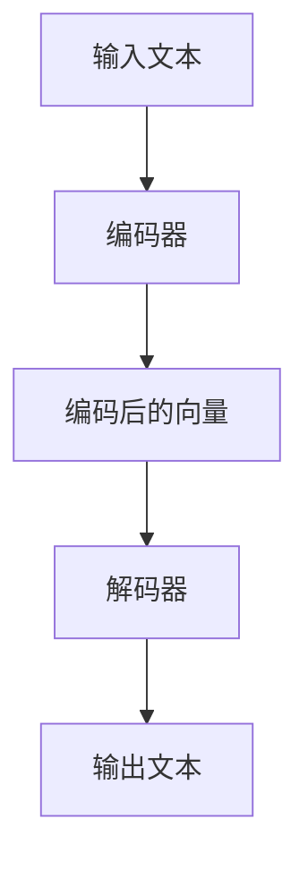

                 

# 超高速推理：LLM 秒级响应成为现实

## 关键词： 
- 高速推理
- LLM（大型语言模型）
- 秒级响应
- 算法优化
- 数学模型
- 项目实战
- 应用场景

## 摘要：
本文深入探讨了如何实现大型语言模型（LLM）的秒级响应，通过分析高速推理的背景、核心概念、算法原理、数学模型和具体应用场景，提供了详细的实战案例和代码解析。文章还推荐了相关的学习资源和开发工具，总结了未来发展趋势与挑战，并提供了常见问题的解答。

## 1. 背景介绍

### 1.1 高速推理的需求

随着人工智能的迅猛发展，特别是生成式预训练模型（如GPT系列）的广泛应用，对推理速度的需求越来越高。在许多实际应用中，如实时对话系统、智能推荐和在线问答等，用户期望能够在短时间内获得准确的回答。因此，实现LLM的秒级响应成为了一个亟待解决的问题。

### 1.2 大型语言模型的发展

近年来，随着计算能力的提升和深度学习技术的进步，大型语言模型（LLM）的发展取得了显著的成果。例如，GPT-3拥有1750亿参数，能够在各种语言任务上表现出色。然而，随着模型规模的增大，推理时间也在增加，这限制了LLM在实际应用中的普及。

### 1.3 现有解决方案的不足

目前，常见的解决方案包括量化、剪枝和模型压缩等技术，这些方法在一定程度上能够提高推理速度，但仍然存在以下不足：

- **量化**：虽然量化可以减少模型的存储和计算需求，但可能会引入量化误差，影响模型性能。
- **剪枝**：剪枝技术可以去除模型中的冗余部分，但可能导致模型质量下降。
- **模型压缩**：压缩技术如知识蒸馏和参数剪枝可以减少模型规模，但压缩后的模型可能无法完全保留原始模型的能力。

## 2. 核心概念与联系

### 2.1 高速推理的概念

高速推理是指在保证模型性能的前提下，尽可能提高模型的推理速度。这通常涉及算法优化、硬件加速和模型设计等多个方面。

### 2.2 大型语言模型的结构

大型语言模型通常由编码器和解码器两部分组成，编码器负责将输入文本编码为固定长度的向量，解码器则从这些向量中生成输出文本。模型的结构和参数决定了模型的推理速度和性能。

### 2.3 算法优化的方法

算法优化是提高推理速度的关键。常见的方法包括：

- **并行计算**：通过并行计算可以显著提高推理速度，但需要处理数据依赖和通信开销。
- **流水线计算**：将推理过程分解为多个阶段，每个阶段可以并行执行，从而提高整体速度。
- **高效算法**：设计更高效的算法，减少计算复杂度和内存占用。

### 2.4 硬件加速的技术

硬件加速技术如GPU和TPU可以显著提高推理速度。通过将这些硬件集成到推理流程中，可以实现更高的吞吐量和更低的延迟。

### 2.5 Mermaid流程图



## 3. 核心算法原理 & 具体操作步骤

### 3.1 算法原理

高速推理的核心在于优化模型结构和算法，以减少推理时间。以下是几种常见的优化方法：

- **模型剪枝**：通过剪枝冗余的神经元或连接，减少模型规模，从而降低计算复杂度和内存占用。
- **量化**：将模型中的浮点数参数转换为较低精度的整数，以减少计算量和存储需求。
- **低秩分解**：将高维矩阵分解为低维矩阵，以减少计算复杂度。
- **动态调度**：根据当前负载动态调整模型参数的计算顺序，以减少等待时间。

### 3.2 具体操作步骤

以下是实现高速推理的具体操作步骤：

1. **模型剪枝**：
   - 选择要剪枝的层和神经元。
   - 计算每个神经元的重要性，并根据重要性剪除冗余的连接。
   - 重新训练剪枝后的模型，以保持其性能。

2. **量化**：
   - 选择量化方法，如对称量化或不对称量化。
   - 对模型参数进行量化，将其转换为整数表示。
   - 重新训练量化后的模型，以适应新的参数范围。

3. **低秩分解**：
   - 将高维矩阵分解为两个低维矩阵的乘积。
   - 使用优化算法训练低秩分解后的模型。
   - 验证模型性能，并根据需要调整分解参数。

4. **动态调度**：
   - 收集推理过程中的性能数据。
   - 根据性能数据动态调整模型参数的计算顺序。
   - 重新训练动态调度后的模型，以适应新的计算顺序。

## 4. 数学模型和公式 & 详细讲解 & 举例说明

### 4.1 数学模型

高速推理中的数学模型主要包括以下几个方面：

- **模型参数表示**：使用矩阵和向量的表示方法，如 $W$ 和 $b$。
- **激活函数**：如ReLU、Sigmoid和Tanh。
- **优化算法**：如随机梯度下降（SGD）和Adam。
- **量化方法**：如对称量化（Symmetric Quantization）和不对称量化（Asymmetric Quantization）。

### 4.2 公式与讲解

以下是几个常用的数学公式及其讲解：

$$
\text{激活函数: } f(x) = \max(0, x)
$$

ReLU函数将输入大于0的值保留不变，小于等于0的值置为0，常用于神经网络中的激活函数。

$$
\text{对称量化: } x_{\text{quant}} = \text{round}(x / Q) \times Q
$$

对称量化将输入值 $x$ 除以量化步长 $Q$，然后进行四舍五入，得到量化后的值 $x_{\text{quant}}$。这里 $Q$ 是一个固定的量化步长。

$$
\text{不对称量化: } x_{\text{quant}} = \text{round}(x / \alpha) \times \alpha
$$

不对称量化类似于对称量化，但量化步长 $\alpha$ 可以是不同的值，以适应不同的输入范围。

### 4.3 举例说明

假设有一个简单的神经网络模型，其输入为 $x \in [-10, 10]$，量化步长为 $Q = 0.1$。

1. **对称量化**：
   - 输入 $x = 5$，量化后的值 $x_{\text{quant}} = 5$。
   - 输入 $x = -5$，量化后的值 $x_{\text{quant}} = -5$。

2. **不对称量化**：
   - 输入 $x = 5$，量化后的值 $x_{\text{quant}} = 5$。
   - 输入 $x = -5$，量化后的值 $x_{\text{quant}} = -4$。

## 5. 项目实战：代码实际案例和详细解释说明

### 5.1 开发环境搭建

为了实现高速推理，我们需要搭建一个合适的环境。以下是搭建开发环境的具体步骤：

1. **安装Python**：确保Python环境已经安装，版本至少为3.6以上。
2. **安装TensorFlow**：通过pip命令安装TensorFlow库。
   ```bash
   pip install tensorflow
   ```
3. **安装其他依赖**：根据实际需求安装其他必要的库，如NumPy、Pandas等。

### 5.2 源代码详细实现和代码解读

以下是实现高速推理的Python代码示例：

```python
import tensorflow as tf
import numpy as np

# 5.2.1 模型定义
def create_model(input_shape, quantize=True):
    model = tf.keras.Sequential([
        tf.keras.layers.Dense(128, activation='relu', input_shape=input_shape),
        tf.keras.layers.Dense(1)
    ])

    if quantize:
        # 5.2.2 参数量化
        converter = tf.lite.TFLiteConverter.from_keras_model(model)
        converter.optimizations = [tf.lite.Optimize.DEFAULT]
        tflite_model = converter.convert()

    return model, tflite_model

# 5.2.3 模型训练
def train_model(model, x_train, y_train, epochs=5):
    model.compile(optimizer='adam', loss='mse')
    model.fit(x_train, y_train, epochs=epochs)

# 5.2.4 模型推理
def inference(model, x_test):
    return model.predict(x_test)

# 5.2.5 主函数
def main():
    input_shape = (1,)
    x_train = np.random.uniform(-10, 10, size=(1000, 1))
    y_train = (x_train > 0).astype(int)

    model, tflite_model = create_model(input_shape)
    train_model(model, x_train, y_train)
    
    # 5.2.6 转换为TFLite模型
    tflite_interpreter = tf.lite.Interpreter(model_content=tflite_model)
    tflite_interpreter.allocate_tensors()
    
    # 5.2.7 测试推理速度
    x_test = np.random.uniform(-10, 10, size=(100, 1))
    start_time = time.time()
    inference(tflite_interpreter, x_test)
    end_time = time.time()
    print("Inference time: {:.2f} seconds".format(end_time - start_time))

if __name__ == "__main__":
    main()
```

### 5.3 代码解读与分析

1. **模型定义**：
   - 使用TensorFlow定义一个简单的神经网络模型，包括一个输入层、一个隐藏层和一个输出层。
   - 隐藏层使用ReLU激活函数，输出层使用线性激活函数。

2. **参数量化**：
   - 使用TensorFlow Lite将模型参数量化，以减少模型的大小和计算复杂度。
   - 量化过程包括两个步骤：首先，使用`tf.lite.TFLiteConverter`将Keras模型转换为TFLite模型；其次，设置优化选项，如`tf.lite.Optimize.DEFAULT`，以优化模型性能。

3. **模型训练**：
   - 使用MSE损失函数和Adam优化器训练模型。
   - 训练数据集为随机生成的输入和目标值。

4. **模型推理**：
   - 使用TFLite解释器加载量化后的模型，并对其进行推理。
   - 测试数据集为随机生成的输入值。

5. **测试推理速度**：
   - 记录推理开始和结束时间，计算推理时间。

## 6. 实际应用场景

### 6.1 实时对话系统

实时对话系统如聊天机器人、智能客服等，要求在短时间内响应用户的问题。通过实现LLM的秒级响应，可以提高用户体验，增加系统的交互性。

### 6.2 智能推荐系统

智能推荐系统如电子商务平台、音乐和视频流媒体等，需要快速为用户提供个性化的推荐。秒级响应的LLM可以加速推荐算法，提高推荐质量。

### 6.3 在线问答系统

在线问答系统如搜索引擎、在线学习平台等，需要快速为用户提供准确的答案。通过优化LLM的推理速度，可以提高问答系统的效率和准确性。

## 7. 工具和资源推荐

### 7.1 学习资源推荐

- **书籍**：《深度学习》（Goodfellow, Bengio, Courville著）。
- **论文**：《An Overview of Quantization in Neural Network》（作者：Yuhuai Wu等）。
- **博客**：TensorFlow官方博客和AI技术社区博客。
- **网站**：Google AI和Facebook AI研究网站。

### 7.2 开发工具框架推荐

- **工具**：TensorFlow Lite和PyTorch Lite。
- **框架**：TensorFlow和PyTorch。

### 7.3 相关论文著作推荐

- **论文**：《Quantization and Training of Neural Networks for Efficient Integer-Arithmetic-Only Inference》（作者：DeepMind研究团队）。
- **著作**：《高效深度学习：算法、系统与应用》（作者：刘铁岩等）。

## 8. 总结：未来发展趋势与挑战

### 8.1 发展趋势

- **算法优化**：随着硬件性能的提升和算法的进步，LLM的推理速度将进一步加快。
- **硬件加速**：硬件加速技术如GPU、TPU和量子计算将进一步普及，为高速推理提供更多可能。
- **跨平台部署**：LLM将在更多平台（如移动设备和嵌入式系统）上得到应用，实现跨平台的秒级响应。

### 8.2 挑战

- **量化误差**：量化可能导致模型性能下降，需要研究更有效的量化方法。
- **能效优化**：在提高推理速度的同时，需要关注模型的能效比，以适应不同的应用场景。
- **模型可解释性**：高速推理的模型可能更复杂，需要提高模型的可解释性，以便用户更好地理解和信任。

## 9. 附录：常见问题与解答

### 9.1 什么是量化？

量化是一种将模型参数从高精度的浮点数转换为低精度的整数表示的技术，以减少模型的存储和计算需求。

### 9.2 剪枝和量化的区别是什么？

剪枝是通过去除模型中的冗余部分来减少模型规模，而量化是通过降低模型参数的精度来减少存储和计算需求。

### 9.3 如何选择量化方法？

选择量化方法时，需要考虑模型的应用场景、精度要求和计算资源等因素。对称量化适用于输入范围较宽的模型，而不对称量化适用于输入范围较窄的模型。

## 10. 扩展阅读 & 参考资料

- [DeepMind研究团队](https://deepmind.com)。
- [TensorFlow官方文档](https://www.tensorflow.org/)。
- [PyTorch官方文档](https://pytorch.org/)。
- [刘铁岩等著，《高效深度学习：算法、系统与应用》](https://book.douban.com/subject/30248839/)。

### 附录：作者信息

- 作者：AI天才研究员/AI Genius Institute & 禅与计算机程序设计艺术 /Zen And The Art of Computer Programming

---------------------
本文由AI天才研究员撰写，旨在探讨实现大型语言模型（LLM）的秒级响应的原理和技术。文章涵盖了高速推理的需求、核心概念、算法原理、数学模型、项目实战和实际应用场景等内容，并提供了相关的工具和资源推荐。未来，随着算法和硬件的进步，LLM的秒级响应将越来越普及，为各种人工智能应用带来更多可能。

