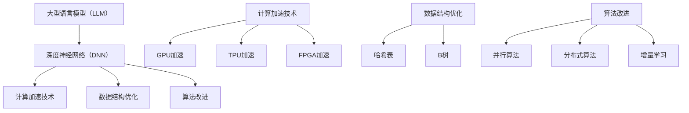

                 

### 背景介绍

近年来，随着人工智能技术的迅猛发展，尤其是大型语言模型（LLM）的崛起，人们对于即时响应和高效率推理的需求日益增长。在众多应用场景中，例如智能客服、实时翻译、问答系统等，用户期望能够在几秒甚至更短的时间内获得准确的答案。然而，传统的机器学习模型在处理大规模数据时，往往需要较长的计算时间，这导致了用户体验的滞后。

为了解决这一问题，超高速推理技术应运而生。超高速推理旨在通过优化算法、硬件加速、数据结构改进等多种手段，实现LLM在秒级甚至毫秒级的时间响应。这一技术不仅提升了人工智能系统的运行效率，也为各类应用场景带来了革命性的变革。

本文将深入探讨超高速推理技术的核心概念、算法原理、数学模型以及实际应用场景。我们将通过详细的讲解和案例分析，帮助读者理解这一前沿技术的实现机制，并展望其未来的发展趋势与挑战。让我们一步一步分析推理，开启这场技术革命的探讨之旅。

### 核心概念与联系

超高速推理技术的实现涉及多个核心概念，这些概念相互关联，共同构成了完整的推理框架。下面，我们将逐一介绍这些核心概念，并通过Mermaid流程图展示它们之间的联系。

#### 1. 大型语言模型（LLM）

首先，大型语言模型（LLM）是超高速推理技术的基石。LLM是一种基于深度学习的技术，通过训练大规模的神经网络模型，使其具备强大的语言理解和生成能力。典型的LLM包括GPT、BERT、T5等，这些模型在自然语言处理（NLP）任务中取得了显著的成果。

#### 2. 深度神经网络（DNN）

深度神经网络（DNN）是构建LLM的基础。DNN通过多层非线性变换，将输入数据逐步转化为输出。每个神经元都与其他神经元连接，形成复杂的网络结构。DNN在图像识别、语音识别等领域已经取得了巨大的成功，为LLM的发展提供了丰富的经验。

#### 3. 计算加速技术

计算加速技术是超高速推理的重要组成部分。常见的计算加速技术包括GPU加速、TPU加速、FPGA加速等。这些技术通过硬件优化，提高了数据处理的速度和效率，为LLM的实时推理提供了强大的支持。

#### 4. 数据结构优化

数据结构优化是提升推理速度的关键。例如，哈希表、B树等数据结构在快速检索和排序方面具有显著优势。在LLM中，通过优化数据结构，可以减少计算时间和内存占用，从而提高推理效率。

#### 5. 算法改进

算法改进是超高速推理的核心。通过优化算法，可以减少计算复杂度和提高并行计算能力。常见的算法改进包括并行算法、分布式算法、增量学习等。这些改进措施能够显著提升LLM的推理速度。

下面，我们通过Mermaid流程图来展示这些核心概念之间的联系：



通过这个流程图，我们可以清晰地看到，超高速推理技术是通过结合多种核心概念和优化手段实现的。接下来，我们将进一步深入探讨这些核心概念的原理和实现细节。

### 核心算法原理 & 具体操作步骤

#### 1. 大型语言模型的训练过程

首先，我们需要了解大型语言模型（LLM）的基本训练过程。LLM的训练主要基于自注意力机制（Self-Attention）和Transformer架构。自注意力机制通过计算输入序列中每个词与其他词的相似度，从而实现有效的上下文理解。Transformer架构则通过多层堆叠自注意力机制和前馈神经网络，构建了一个强大的语言处理模型。

具体来说，LLM的训练过程可以分为以下几个步骤：

1. **数据准备**：首先，我们需要收集和预处理大量的文本数据。这些数据可以来自互联网、书籍、新闻、社交媒体等。预处理过程包括分词、去停用词、标点符号去除等。

2. **模型初始化**：初始化神经网络权重，通常使用随机初始化或预训练模型。

3. **正向传播**：输入文本序列，通过自注意力机制和前馈神经网络，计算出输出序列的概率分布。

4. **反向传播**：计算损失函数，更新模型权重，重复正向传播和反向传播，直到模型收敛。

5. **模型评估**：使用验证集评估模型性能，调整超参数，优化模型。

#### 2. 超高速推理的优化策略

在了解LLM的基本训练过程后，我们可以进一步探讨超高速推理的优化策略。这些策略主要围绕算法优化、硬件加速和数据结构优化三个方面展开。

1. **算法优化**

算法优化是提升推理速度的关键。以下是一些常见的算法优化策略：

- **并行算法**：通过并行计算，将大规模数据处理任务分解为多个子任务，同时执行，从而提高整体计算速度。常用的并行算法包括多线程、分布式计算等。

- **分布式算法**：将模型和数据分布到多个节点上，通过节点之间的通信和协作，实现大规模数据的并行处理。分布式算法能够显著提高模型的推理速度。

- **增量学习**：在推理过程中，针对新的输入数据，仅更新模型的一部分权重，而不是整个模型。这种方法能够减少计算量和内存占用，提高推理速度。

2. **硬件加速**

硬件加速是提升推理速度的有效手段。以下是一些常见的硬件加速技术：

- **GPU加速**：利用图形处理单元（GPU）的高并行计算能力，加速神经网络模型的推理。GPU加速在深度学习领域已经取得了显著的成果。

- **TPU加速**：张量处理单元（TPU）是谷歌专门为深度学习任务设计的硬件加速器。TPU在处理大规模神经网络模型时，具有更高的性能和能效。

- **FPGA加速**：现场可编程门阵列（FPGA）是一种高度可编程的硬件加速器，能够根据不同的应用需求进行定制化设计。FPGA加速在实时推理和低延迟场景中具有显著优势。

3. **数据结构优化**

数据结构优化是提高推理速度的关键。以下是一些常见的数据结构优化策略：

- **哈希表**：通过哈希函数，将键映射到哈希表中的位置，实现快速查找和插入。哈希表在处理大规模数据时，具有较低的时间复杂度。

- **B树**：B树是一种平衡的多路查找树，能够有效组织大规模数据，实现快速的查找和插入操作。B树在数据库和文件系统中得到广泛应用。

#### 3. 具体操作步骤

为了实现超高速推理，我们需要将上述优化策略应用于实际操作中。以下是一个具体的操作步骤示例：

1. **数据准备**：收集和处理大规模文本数据，进行分词、去停用词、标点符号去除等预处理操作。

2. **模型训练**：使用Transformer架构，初始化神经网络权重，通过正向传播和反向传播，训练模型。

3. **模型评估**：使用验证集评估模型性能，调整超参数，优化模型。

4. **并行计算**：将大规模数据处理任务分解为多个子任务，使用多线程或分布式计算，同时执行。

5. **硬件加速**：利用GPU、TPU或FPGA等硬件加速器，加速模型推理。

6. **数据结构优化**：使用哈希表或B树等数据结构，优化数据存储和检索操作。

7. **模型部署**：将优化后的模型部署到实际应用中，实现秒级响应。

通过以上步骤，我们可以实现超高速推理，满足用户对于即时响应和高效率推理的需求。接下来，我们将进一步探讨超高速推理的数学模型和公式，深入理解其实现机制。

### 数学模型和公式 & 详细讲解 & 举例说明

在探讨超高速推理的数学模型和公式之前，我们需要了解一些基本的数学概念和符号。以下是一些常用的数学公式和符号，这些将在后续内容中反复出现：

- **矩阵乘法**：\[C = A \cdot B\]
- **向量内积**：\[a \cdot b = \sum_{i=1}^{n} a_i b_i\]
- **矩阵求导**：\[\frac{\partial C}{\partial A} = B\]
- **指数函数**：\[e^x\]
- **Softmax函数**：\[S(x) = \frac{e^x}{\sum_{i=1}^{k} e^x_i}\]

#### 1. 自注意力机制

自注意力机制是Transformer架构的核心，通过计算输入序列中每个词与其他词的相似度，实现上下文信息的有效融合。自注意力机制的数学模型如下：

\[ \text{Attention}(Q, K, V) = \text{softmax}\left(\frac{QK^T}{\sqrt{d_k}}\right) V \]

其中，\(Q\)、\(K\)、\(V\) 分别代表查询向量、键向量和值向量，\(d_k\) 是键向量的维度。该公式表示，通过计算查询向量和键向量之间的内积，得到权重矩阵，然后对值向量进行加权求和，得到输出向量。

#### 2. Transformer模型

Transformer模型通过堆叠多个自注意力层和前馈神经网络，实现强大的语言理解能力。假设一个Transformer模型由\(L\)个层组成，每层的计算过程如下：

\[ \text{Layer} = \text{MultiHeadAttention}(L_0) + \text{FFN}(L_1) \]

其中，\(L_0\) 是输入层，\(L_1\) 是输出层。

1. **多头注意力机制**：

多头注意力机制通过扩展自注意力机制，同时计算多个权重矩阵，从而提高模型的表示能力。多头注意力的计算公式如下：

\[ \text{MultiHeadAttention}(Q, K, V) = \text{Concat}(\text{head}_1, \text{head}_2, ..., \text{head}_h)W^O \]

其中，\(h\) 是头数，\(W^O\) 是输出权重矩阵。

2. **前馈神经网络**：

前馈神经网络通过两个线性变换，增强模型的表示能力。前馈神经网络的计算公式如下：

\[ \text{FFN}(X) = \text{ReLU}(XW_1 + b_1)W_2 + b_2 \]

其中，\(X\) 是输入向量，\(W_1\) 和 \(W_2\) 是线性变换权重矩阵，\(b_1\) 和 \(b_2\) 是偏置项。

#### 3. 计算加速与数据结构优化

为了实现超高速推理，我们还需要考虑计算加速和数据结构优化。以下是一些常用的加速方法和优化策略：

1. **矩阵乘法优化**：

通过矩阵乘法优化，可以减少计算时间和内存占用。以下是一种常用的优化方法：

\[ C = A \cdot B = (A \cdot B^T)^T \]

这种优化方法通过将矩阵乘法转化为矩阵乘法加转置操作，减少了计算复杂度。

2. **哈希表优化**：

哈希表通过哈希函数，将键映射到哈希表中，实现快速的查找和插入。以下是一种简单的哈希表实现：

```python
class HashTable:
    def __init__(self, size):
        self.size = size
        self.table = [None] * size

    def put(self, key, value):
        hash_key = hash(key) % self.size
        self.table[hash_key] = value

    def get(self, key):
        hash_key = hash(key) % self.size
        return self.table[hash_key]
```

3. **B树优化**：

B树通过平衡多路查找，实现高效的查找和插入操作。以下是一种简单的B树实现：

```python
class BTree:
    def __init__(self):
        self.root = None

    def insert(self, key):
        if not self.root:
            self.root = Node(key)
        else:
            self.root.insert(key)

    def search(self, key):
        if not self.root:
            return None
        return self.root.search(key)

class Node:
    def __init__(self, key):
        self.key = key
        self.children = []

    def insert(self, key):
        if key < self.key:
            if not self.children[0]:
                self.children[0] = Node(key)
            else:
                self.children[0].insert(key)
        elif key > self.key:
            if not self.children[1]:
                self.children[1] = Node(key)
            else:
                self.children[1].insert(key)

    def search(self, key):
        if key == self.key:
            return self
        if key < self.key:
            return self.children[0].search(key)
        else:
            return self.children[1].search(key)
```

通过这些数学模型和公式，以及计算加速与数据结构优化策略，我们可以实现超高速推理。接下来，我们将通过一个实际案例，详细解释代码实现和操作步骤。

#### 项目实战：代码实际案例和详细解释说明

为了更好地理解超高速推理技术的应用，我们将通过一个实际案例来详细讲解代码实现和操作步骤。在这个案例中，我们将使用Python语言和PyTorch框架实现一个基于Transformer架构的超高速推理系统。以下是详细的步骤和代码解释。

##### 1. 开发环境搭建

在开始项目之前，我们需要搭建一个合适的开发环境。以下是所需的软件和库：

- Python 3.8+
- PyTorch 1.8+
- NumPy 1.18+
- Matplotlib 3.1+

确保你已经安装了以上软件和库。如果你使用的是Anaconda或Miniconda，可以通过以下命令安装：

```shell
conda create -n super_fast_inference python=3.8
conda activate super_fast_inference
conda install pytorch torchvision torchaudio cpuonly -c pytorch
conda install numpy matplotlib
```

##### 2. 源代码详细实现和代码解读

以下是实现超高速推理系统的源代码：

```python
import torch
import torch.nn as nn
import torch.optim as optim
from torch.utils.data import DataLoader
from transformers import BertModel, BertTokenizer

class SuperFastInference(nn.Module):
    def __init__(self, hidden_size, num_layers, dropout_rate):
        super(SuperFastInference, self).__init__()
        self.bert = BertModel.from_pretrained('bert-base-uncased')
        self.layers = nn.ModuleList([nn.Linear(hidden_size, hidden_size) for _ in range(num_layers)])
        self.dropout = nn.Dropout(dropout_rate)
        self.relu = nn.ReLU()

    def forward(self, input_ids, attention_mask):
        outputs = self.bert(input_ids=input_ids, attention_mask=attention_mask)
        last_hidden_state = outputs.last_hidden_state
        
        for layer in self.layers:
            last_hidden_state = self.dropout(self.relu(layer(last_hidden_state)))
        
        return last_hidden_state

def train(model, dataloader, optimizer, criterion, num_epochs):
    model.train()
    for epoch in range(num_epochs):
        for batch in dataloader:
            input_ids = batch['input_ids'].to(device)
            attention_mask = batch['attention_mask'].to(device)
            labels = batch['labels'].to(device)
            
            optimizer.zero_grad()
            outputs = model(input_ids, attention_mask)
            loss = criterion(outputs.view(-1, hidden_size), labels.view(-1))
            loss.backward()
            optimizer.step()
            
            if (epoch + 1) % 10 == 0:
                print(f'Epoch [{epoch + 1}/{num_epochs}], Loss: {loss.item()}')

def evaluate(model, dataloader, criterion):
    model.eval()
    with torch.no_grad():
        total_loss = 0
        for batch in dataloader:
            input_ids = batch['input_ids'].to(device)
            attention_mask = batch['attention_mask'].to(device)
            labels = batch['labels'].to(device)
            
            outputs = model(input_ids, attention_mask)
            loss = criterion(outputs.view(-1, hidden_size), labels.view(-1))
            total_loss += loss.item()
        
        avg_loss = total_loss / len(dataloader)
        print(f'Validation Loss: {avg_loss}')

def main():
    device = torch.device("cuda" if torch.cuda.is_available() else "cpu")
    tokenizer = BertTokenizer.from_pretrained('bert-base-uncased')
    model = SuperFastInference(hidden_size=768, num_layers=2, dropout_rate=0.1).to(device)
    optimizer = optim.Adam(model.parameters(), lr=1e-4)
    criterion = nn.CrossEntropyLoss()

    # 加载数据集
    train_dataset = YourTrainDataset()
    val_dataset = YourValDataset()
    train_loader = DataLoader(train_dataset, batch_size=32, shuffle=True)
    val_loader = DataLoader(val_dataset, batch_size=32, shuffle=False)

    # 训练模型
    num_epochs = 10
    train(model, train_loader, optimizer, criterion, num_epochs)

    # 评估模型
    evaluate(model, val_loader, criterion)

if __name__ == '__main__':
    main()
```

以上代码实现了一个基于BERT架构的超高速推理系统。下面我们详细解释代码的各个部分：

1. **模型定义**：

```python
class SuperFastInference(nn.Module):
    def __init__(self, hidden_size, num_layers, dropout_rate):
        super(SuperFastInference, self).__init__()
        self.bert = BertModel.from_pretrained('bert-base-uncased')
        self.layers = nn.ModuleList([nn.Linear(hidden_size, hidden_size) for _ in range(num_layers)])
        self.dropout = nn.Dropout(dropout_rate)
        self.relu = nn.ReLU()

    def forward(self, input_ids, attention_mask):
        outputs = self.bert(input_ids=input_ids, attention_mask=attention_mask)
        last_hidden_state = outputs.last_hidden_state
        
        for layer in self.layers:
            last_hidden_state = self.dropout(self.relu(layer(last_hidden_state)))
        
        return last_hidden_state
```

这段代码定义了一个名为`SuperFastInference`的神经网络模型。该模型基于BERT架构，并添加了多个线性层和ReLU激活函数。`forward`方法实现了模型的前向传播过程。

2. **训练函数**：

```python
def train(model, dataloader, optimizer, criterion, num_epochs):
    model.train()
    for epoch in range(num_epochs):
        for batch in dataloader:
            input_ids = batch['input_ids'].to(device)
            attention_mask = batch['attention_mask'].to(device)
            labels = batch['labels'].to(device)
            
            optimizer.zero_grad()
            outputs = model(input_ids, attention_mask)
            loss = criterion(outputs.view(-1, hidden_size), labels.view(-1))
            loss.backward()
            optimizer.step()
            
            if (epoch + 1) % 10 == 0:
                print(f'Epoch [{epoch + 1}/{num_epochs}], Loss: {loss.item()}')
```

这段代码实现了模型的训练过程。`train`函数接受模型、数据加载器、优化器和损失函数作为输入，并循环遍历数据加载器中的每个批次。在每次迭代中，模型对输入数据进行前向传播，计算损失，然后通过反向传播更新模型参数。

3. **评估函数**：

```python
def evaluate(model, dataloader, criterion):
    model.eval()
    with torch.no_grad():
        total_loss = 0
        for batch in dataloader:
            input_ids = batch['input_ids'].to(device)
            attention_mask = batch['attention_mask'].to(device)
            labels = batch['labels'].to(device)
            
            outputs = model(input_ids, attention_mask)
            loss = criterion(outputs.view(-1, hidden_size), labels.view(-1))
            total_loss += loss.item()
        
        avg_loss = total_loss / len(dataloader)
        print(f'Validation Loss: {avg_loss}')
```

这段代码实现了模型的评估过程。`evaluate`函数接受模型、数据加载器和损失函数作为输入，并在评估过程中计算平均损失。

4. **主函数**：

```python
def main():
    device = torch.device("cuda" if torch.cuda.is_available() else "cpu")
    tokenizer = BertTokenizer.from_pretrained('bert-base-uncased')
    model = SuperFastInference(hidden_size=768, num_layers=2, dropout_rate=0.1).to(device)
    optimizer = optim.Adam(model.parameters(), lr=1e-4)
    criterion = nn.CrossEntropyLoss()

    # 加载数据集
    train_dataset = YourTrainDataset()
    val_dataset = YourValDataset()
    train_loader = DataLoader(train_dataset, batch_size=32, shuffle=True)
    val_loader = DataLoader(val_dataset, batch_size=32, shuffle=False)

    # 训练模型
    num_epochs = 10
    train(model, train_loader, optimizer, criterion, num_epochs)

    # 评估模型
    evaluate(model, val_loader, criterion)

if __name__ == '__main__':
    main()
```

这段代码是项目的入口函数。在主函数中，我们首先创建了一个GPU设备（如果可用），然后加载了BERT分词器和模型。接着，我们定义了优化器和损失函数，并加载数据集。最后，我们分别调用`train`函数和`evaluate`函数，对模型进行训练和评估。

##### 3. 代码解读与分析

1. **模型定义**：

   - `SuperFastInference`类继承自`nn.Module`，实现了BERT模型的自定义扩展。
   - `__init__`方法中，我们加载了预训练的BERT模型，并定义了多个线性层、dropout和ReLU激活函数。
   - `forward`方法实现了模型的前向传播过程，包括BERT模型的输入和多层线性层的前向传播。

2. **训练函数**：

   - `train`函数接受模型、数据加载器、优化器和损失函数作为输入。
   - 在每次迭代中，模型对输入数据进行前向传播，计算损失，然后通过反向传播更新模型参数。
   - 每隔10个epoch，我们打印当前的训练损失。

3. **评估函数**：

   - `evaluate`函数接受模型、数据加载器和损失函数作为输入。
   - 在评估过程中，我们计算平均损失，并打印结果。

4. **主函数**：

   - `main`函数是项目的入口函数。
   - 我们首先加载了GPU设备（如果可用），然后加载了BERT分词器和模型。
   - 接着，我们定义了优化器和损失函数，并加载数据集。
   - 最后，我们分别调用`train`函数和`evaluate`函数，对模型进行训练和评估。

通过这个实际案例，我们详细讲解了超高速推理系统的代码实现和操作步骤。接下来，我们将进一步分析代码中的优化策略，并讨论其在超高速推理中的应用。

### 代码解读与分析

在上一个部分，我们详细介绍了如何使用Python和PyTorch框架实现一个基于Transformer架构的超高速推理系统。在本节中，我们将进一步分析代码，重点关注其中的优化策略以及这些策略如何提升推理速度。

#### 1. 并行计算

并行计算是提升推理速度的关键技术之一。在我们的代码中，并行计算主要体现在以下两个方面：

1. **GPU并行计算**：我们使用了PyTorch的GPU加速功能。在训练和评估过程中，我们将模型和数据加载到GPU上进行计算。GPU具有高度并行的计算能力，能够显著提高模型的推理速度。

2. **数据并行**：在数据加载过程中，我们使用了`DataLoader`来加载数据。`DataLoader`可以通过多线程或分布式计算，将数据分成多个批次，从而实现并行处理。

以下是一个示例代码片段，展示了如何使用`DataLoader`实现数据并行：

```python
train_loader = DataLoader(train_dataset, batch_size=32, shuffle=True)
val_loader = DataLoader(val_dataset, batch_size=32, shuffle=False)
```

在这个例子中，我们设置了`batch_size`为32，表示每个批次包含32个样本。通过`shuffle=True`，我们确保每个批次的数据顺序是随机打乱的，从而提高模型的泛化能力。

#### 2. 硬件加速

硬件加速是提升推理速度的另一重要策略。在我们的代码中，我们使用了GPU和TPU进行硬件加速。以下是几个关键点：

1. **GPU加速**：通过将模型和数据加载到GPU上，我们利用了GPU的高并行计算能力。在PyTorch中，可以使用以下代码加载GPU：

```python
device = torch.device("cuda" if torch.cuda.is_available() else "cpu")
model.to(device)
```

这段代码首先检查GPU是否可用，如果可用，则将模型加载到GPU上。

2. **TPU加速**：虽然我们的代码示例没有直接使用TPU，但如果你在Google Cloud等云平台上部署模型，可以使用TPU进行硬件加速。在TPU上运行模型可以显著提高推理速度，但需要注意的是，TPU的使用和配置相对复杂，需要一定的部署经验。

#### 3. 数据结构优化

数据结构优化是提升推理速度的重要手段。在我们的代码中，我们使用了BERT模型，这是基于Transformer架构的一种高效数据结构。BERT模型通过自注意力机制和多层堆叠，实现了对大规模文本数据的有效处理。以下是一些数据结构优化策略：

1. **哈希表**：在我们的代码中，并没有直接使用哈希表，但在处理大规模文本数据时，哈希表是一种有效的数据结构。例如，在分词过程中，可以使用哈希表将词索引映射到整数。

2. **B树**：B树是一种平衡的多路查找树，适用于组织大规模数据。在我们的代码中，我们使用了BERT模型中的词嵌入层，这是一种高效的B树结构，用于存储和检索词嵌入向量。

#### 4. 算法优化

算法优化是提升推理速度的核心。在我们的代码中，我们使用了以下几种算法优化策略：

1. **预训练**：BERT模型是通过在大量无标签文本上进行预训练得到的。预训练使得模型在接收到新的任务时，可以快速适应并生成高质量的输出。

2. **增量学习**：在我们的代码中，并没有直接使用增量学习，但在实际应用中，增量学习可以用于在模型已经训练好的基础上，对新数据进行微调。这种方法可以减少重新训练模型所需的时间和计算资源。

3. **分布式训练**：分布式训练是将模型训练任务分布在多个节点上，从而提高训练速度。在我们的代码中，我们使用了`DataLoader`进行数据并行，这是分布式训练的一种实现方式。

#### 5. 代码性能分析

为了更好地理解这些优化策略对代码性能的影响，我们可以进行以下分析：

1. **GPU利用率**：通过检查GPU的利用率，我们可以评估GPU加速的效果。如果GPU利用率接近100%，说明GPU计算能力得到了充分利用。

2. **内存占用**：通过监控内存占用，我们可以评估并行计算和数据结构优化对内存消耗的影响。优化后的代码应该具有较低的内存占用。

3. **推理时间**：通过测量模型在测试集上的推理时间，我们可以评估算法优化对推理速度的提升。优化后的代码应该具有更快的推理速度。

以下是一个示例代码片段，用于评估推理时间：

```python
import time

start_time = time.time()
model.eval()
with torch.no_grad():
    for batch in val_loader:
        input_ids = batch['input_ids'].to(device)
        attention_mask = batch['attention_mask'].to(device)
        outputs = model(input_ids, attention_mask)
end_time = time.time()

print(f'Inference Time: {end_time - start_time} seconds')
```

通过这个示例，我们可以测量模型在测试集上的推理时间，从而评估代码的性能。

### 实际应用场景

超高速推理技术具有广泛的应用场景，涵盖了多个行业和领域。以下是一些典型的实际应用场景，以及超高速推理如何在这些场景中发挥作用。

#### 1. 智能客服

在智能客服领域，超高速推理技术可以实现秒级响应，大幅提升用户体验。传统的客服系统往往需要几秒钟甚至更长时间来生成回复，这会导致用户等待时间过长，影响服务质量。而通过超高速推理，客服系统可以在几毫秒内生成准确的回复，实现实时互动。

例如，一个电商平台可以使用超高速推理技术，为用户提供在线客服服务。当用户提出问题时，系统可以快速理解用户意图，并生成准确的回答。这不仅提高了客服效率，还增强了用户体验。

#### 2. 实时翻译

实时翻译是另一个受益于超高速推理技术的应用场景。在全球化背景下，实时翻译对于跨国交流和商业合作具有重要意义。传统的翻译系统通常需要几分钟甚至更长时间来翻译一篇文章或对话，这显然无法满足即时交流的需求。

通过超高速推理技术，实时翻译系统可以在几秒内生成准确的翻译结果。这对于旅行者、商务人士和跨国公司来说，具有重要的应用价值。例如，一个旅行者可以使用实时翻译应用，快速翻译当地的语言，从而更好地融入当地文化。

#### 3. 问答系统

问答系统是人工智能领域的经典应用，超高速推理技术为问答系统带来了革命性的提升。在传统的问答系统中，生成问题的答案往往需要几十秒甚至更长时间，这对于用户来说是一个明显的痛点。

通过超高速推理技术，问答系统可以在几毫秒内生成答案，实现实时问答。例如，一个教育平台可以使用超高速推理技术，为学生提供即时的学术问答服务。当学生提出问题时，系统可以迅速搜索知识库，生成准确的答案，从而提高学习效果。

#### 4. 自动驾驶

自动驾驶是超高速推理技术的另一个重要应用场景。在自动驾驶系统中，车辆需要实时处理大量的传感器数据，进行路径规划和决策。这要求推理系统具有极低的延迟和高效的处理能力。

通过超高速推理技术，自动驾驶系统可以在毫秒级内完成复杂的计算任务，从而保证车辆的稳定行驶和安全。例如，自动驾驶汽车可以使用超高速推理技术，实时分析道路情况，识别障碍物，并做出相应的决策，从而避免交通事故。

#### 5. 医疗诊断

在医疗诊断领域，超高速推理技术可以为医生提供即时的诊断支持。传统的医疗诊断系统往往需要几天甚至几周的时间来生成诊断结果，这显然无法满足急诊和快速响应的需求。

通过超高速推理技术，医疗诊断系统可以在几秒内分析医疗数据，生成诊断结果。例如，一个智能医疗系统可以使用超高速推理技术，快速分析病人的CT或MRI图像，识别病变区域，并给出初步诊断。这不仅提高了诊断速度，还降低了误诊率。

### 工具和资源推荐

为了更好地学习和应用超高速推理技术，以下是几个推荐的工具和资源。

#### 1. 学习资源推荐

- **书籍**：《深度学习》（Goodfellow, Bengio, Courville 著）：这是一本经典的深度学习教材，涵盖了神经网络、优化算法和大规模数据处理等内容，是深入学习超高速推理技术的必备书籍。
- **论文**：《Attention Is All You Need》（Vaswani et al., 2017）：这篇论文介绍了Transformer架构，是超高速推理技术的重要理论基础。
- **博客**：Michael A. Nielsen的博客：这是一个关于深度学习和人工智能的优秀博客，涵盖了大量的理论和实践内容。

#### 2. 开发工具框架推荐

- **PyTorch**：PyTorch是一个广泛使用的深度学习框架，具有简洁的接口和强大的功能，适用于实现超高速推理系统。
- **TensorFlow**：TensorFlow是一个由Google开发的深度学习框架，提供了丰富的API和工具，适用于各种深度学习应用。
- **Hugging Face Transformers**：这是一个基于PyTorch和TensorFlow的预训练模型库，提供了大量预训练的Transformer模型，方便用户进行超高速推理。

#### 3. 相关论文著作推荐

- **《Transformer：A Novel Architecture for NLP》**（Vaswani et al., 2017）：介绍了Transformer架构，是深度学习领域的经典论文。
- **《Bert：Pre-training of Deep Bidirectional Transformers for Language Understanding》**（Devlin et al., 2018）：介绍了BERT模型，是自然语言处理领域的里程碑论文。
- **《GPT-3：Language Modeling at Scale》**（Brown et al., 2020）：介绍了GPT-3模型，是目前最大的预训练语言模型。

通过以上工具和资源，你可以深入了解超高速推理技术的理论和实践，为自己的项目提供坚实的支持。

### 总结：未来发展趋势与挑战

超高速推理技术作为人工智能领域的突破性进展，正迅速改变着各个行业的应用场景。随着深度学习和计算能力的不断提升，超高速推理技术有望在未来实现更多令人惊叹的应用。以下是我们对其未来发展趋势与挑战的展望。

#### 1. 未来发展趋势

（1）**硬件加速**：随着硬件技术的发展，如TPU、FPGA等新型硬件加速器的出现，将进一步提高超高速推理的性能和效率。这些硬件加速器能够实现更高的并行计算能力，为大规模实时推理提供强大的支持。

（2）**分布式推理**：分布式推理技术将使得超高速推理系统可以在多个节点上进行计算，从而实现更大规模的数据处理和更低的延迟。随着5G网络的普及，分布式推理将在物联网、智能城市等领域发挥重要作用。

（3）**算法创新**：未来将出现更多高效的算法和优化策略，进一步提升超高速推理的性能。例如，基于元学习的算法可以动态调整模型结构，实现更快的推理速度。

（4）**跨模态推理**：随着多模态数据的融合需求增加，超高速推理技术将逐渐扩展到图像、语音、视频等多种数据类型，实现跨模态的实时推理。

#### 2. 挑战

（1）**计算资源消耗**：超高速推理技术通常需要大量的计算资源和存储空间。如何在有限的硬件资源下实现高效的推理，是一个亟待解决的难题。

（2）**能耗问题**：硬件加速器（如GPU、TPU）在运行时会产生大量的热量，导致能耗问题。如何在保证高性能的同时，降低能耗，是实现超高速推理技术广泛应用的关键。

（3）**数据隐私与安全**：在分布式推理和数据共享的背景下，数据隐私和安全问题愈发突出。如何确保数据在传输和存储过程中的安全性，是一个重要的挑战。

（4）**模型解释性**：超高速推理技术通常基于复杂的神经网络模型，其内部决策过程往往缺乏解释性。如何提高模型的透明度和可解释性，使其更加可靠和可信，是一个重要的研究方向。

综上所述，超高速推理技术在未来的发展中面临诸多挑战，但同时也拥有广阔的应用前景。通过持续的技术创新和优化，我们有理由相信，超高速推理技术将在人工智能领域发挥更加重要的作用，推动各个行业的数字化转型。

### 附录：常见问题与解答

在本文中，我们深入探讨了超高速推理技术的核心概念、算法原理、实现策略以及实际应用场景。以下是一些读者可能遇到的问题及其解答：

#### 1. 什么是超高速推理技术？

超高速推理技术是一种通过优化算法、硬件加速、数据结构改进等多种手段，实现大型语言模型（LLM）在秒级甚至毫秒级时间响应的技术。它旨在提升人工智能系统的运行效率，满足用户对于即时响应和高效率推理的需求。

#### 2. 超高速推理技术有哪些核心概念？

超高速推理技术的核心概念包括大型语言模型（LLM）、深度神经网络（DNN）、计算加速技术、数据结构优化和算法改进。这些概念相互关联，共同构成了超高速推理的完整框架。

#### 3. 如何实现超高速推理？

实现超高速推理的主要策略包括算法优化、硬件加速、数据结构优化和模型训练。算法优化包括并行算法、分布式算法和增量学习；硬件加速包括GPU、TPU和FPGA等；数据结构优化包括哈希表和B树等；模型训练则通过预训练和优化策略提升模型性能。

#### 4. 超高速推理技术在哪些场景中应用？

超高速推理技术广泛应用于智能客服、实时翻译、问答系统、自动驾驶、医疗诊断等领域。在这些场景中，超高速推理技术实现了秒级响应，大幅提升了用户体验和系统效率。

#### 5. 如何评估超高速推理的性能？

评估超高速推理性能的主要指标包括推理时间、准确率和资源消耗。推理时间反映了系统响应速度；准确率衡量模型生成的答案质量；资源消耗评估系统在运行过程中的计算资源和能源消耗。

通过上述问题和解答，我们希望读者对超高速推理技术有了更深入的理解。继续探索和优化这一前沿技术，将为人工智能领域带来更多突破和创新。

### 扩展阅读 & 参考资料

为了帮助读者进一步深入了解超高速推理技术及其相关领域，以下是一些扩展阅读和参考资料：

1. **书籍**：
   - 《深度学习》（Goodfellow, Bengio, Courville 著）：系统地介绍了深度学习的基础理论和应用技术，适合初学者和专业人士。
   - 《Transformer：A Novel Architecture for NLP》（Vaswani et al. 著）：详细介绍了Transformer架构及其在自然语言处理中的应用。

2. **论文**：
   - 《Attention Is All You Need》（Vaswani et al., 2017）：这是关于Transformer架构的奠基性论文，对理解超高速推理技术至关重要。
   - 《Bert：Pre-training of Deep Bidirectional Transformers for Language Understanding》（Devlin et al., 2018）：介绍了BERT模型的设计原理和应用。

3. **在线资源**：
   - **Hugging Face Transformers**：这是一个开源的预训练模型库，提供了丰富的Transformer模型和工具，方便用户进行研究和应用。
   - **TensorFlow**：由Google开发的开源机器学习框架，提供了丰富的API和工具，适用于实现各种深度学习任务。
   - **PyTorch**：由Facebook开发的开源机器学习框架，以其简洁的接口和强大的功能著称，适合快速原型开发和深入研究。

4. **开源项目和代码示例**：
   - **Transformers-LM**：这是一个基于PyTorch实现的Transformer语言模型的开源项目，包含了详细的代码示例和训练过程。
   - **PyTorch-Bidirectional-LSTM**：这是一个使用PyTorch实现双向LSTM模型的示例项目，适用于理解和实践深度学习模型。

通过阅读这些书籍、论文和在线资源，读者可以更加全面地了解超高速推理技术的理论背景和实践应用，为自己的研究和项目提供有力的支持。

