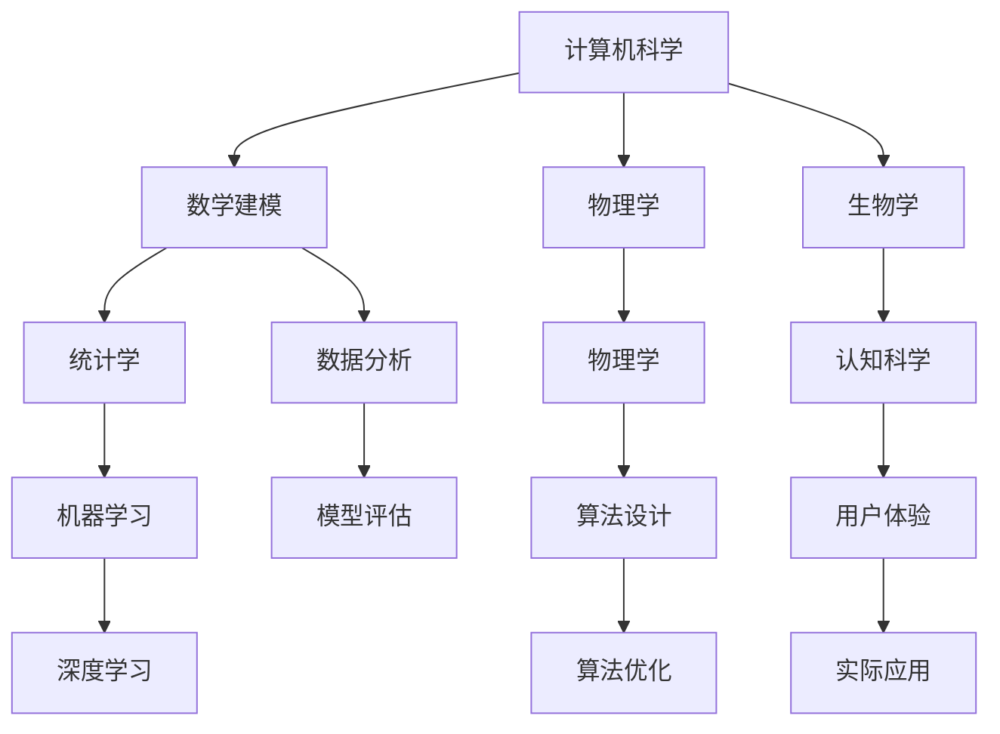

                 

# 跨学科合作与基础模型研究

## 关键词

- 跨学科合作
- 基础模型
- 多领域融合
- 人工智能
- 数学建模
- 计算机科学
- 工程实践

## 摘要

本文旨在探讨跨学科合作在基础模型研究中的重要性。随着人工智能技术的快速发展，单一学科的研究已经难以满足实际需求，跨学科合作成为推动技术进步的关键因素。本文将首先介绍跨学科合作的基本概念和意义，随后深入探讨跨学科合作在基础模型研究中的应用，包括核心概念、算法原理、数学模型等。最后，本文将结合实际案例，阐述跨学科合作在项目实战中的应用，并总结未来发展趋势与挑战。

## 1. 背景介绍

### 1.1 人工智能的发展与挑战

人工智能（Artificial Intelligence，简称AI）作为一门综合性学科，涵盖了计算机科学、数学、统计学、认知科学等多个领域。近年来，随着深度学习、神经网络等技术的迅速发展，人工智能在图像识别、自然语言处理、自动驾驶等领域取得了显著的成果。然而，这些成果的背后离不开跨学科合作的推动。

在人工智能的发展过程中，我们面临着诸多挑战。首先，随着数据量的不断增长，如何有效地处理和分析这些数据成为关键问题。这需要计算机科学、数学、统计学等领域的知识。其次，人工智能技术的应用领域越来越广泛，单一学科的研究已经难以满足实际需求，跨学科合作成为推动技术进步的关键因素。

### 1.2 基础模型的重要性

基础模型是人工智能的核心，是各类复杂任务的基石。从早期的传统机器学习模型，如线性回归、决策树等，到现代的深度学习模型，如卷积神经网络（CNN）、循环神经网络（RNN）等，基础模型的研究不断推动人工智能技术的发展。

基础模型的研究涉及多个学科领域，包括计算机科学、数学、物理学、生物学等。跨学科合作在基础模型研究中发挥着至关重要的作用，有助于解决单一学科难以应对的复杂问题。

### 1.3 跨学科合作的意义

跨学科合作在基础模型研究中的意义主要体现在以下几个方面：

1. **互补优势**：不同学科领域的知识互补，有助于从多个角度分析和解决问题，提高研究效率。

2. **技术创新**：跨学科合作能够促进技术创新，推动基础模型的优化和发展。

3. **资源整合**：跨学科合作有助于整合各类资源，包括人才、设备、资金等，提高研究质量和速度。

4. **知识传播**：跨学科合作有助于不同学科领域之间的知识传播，促进学术交流和合作。

## 2. 核心概念与联系

### 2.1 跨学科合作的基本概念

跨学科合作是指不同学科领域的专家、学者或研究团队在共同研究目标的基础上，开展合作研究的过程。跨学科合作的核心在于整合不同学科的知识和技能，以解决单一学科难以应对的复杂问题。

### 2.2 跨学科合作在基础模型研究中的应用

在基础模型研究中，跨学科合作的应用主要体现在以下几个方面：

1. **算法设计**：跨学科合作有助于设计更加高效、可靠的算法，如结合计算机科学、数学、物理学的知识，设计出具有更强泛化能力的深度学习模型。

2. **数据预处理**：跨学科合作有助于优化数据预处理过程，如结合统计学、生物学等领域的知识，提高数据的质量和可用性。

3. **模型评估**：跨学科合作有助于制定更加科学、全面的模型评估方法，如结合计算机科学、心理学等领域的知识，评估模型的性能和用户体验。

4. **实际应用**：跨学科合作有助于推动基础模型在实际领域的应用，如结合计算机科学、工程学等领域的知识，开发出具有实际应用价值的人工智能产品。

### 2.3 跨学科合作的架构图

以下是一个简单的跨学科合作架构图，展示了不同学科领域在基础模型研究中的应用和联系。



## 3. 核心算法原理 & 具体操作步骤

### 3.1 算法原理

在基础模型研究中，核心算法的设计和实现是关键步骤。以下将介绍一种常见的深度学习算法——卷积神经网络（CNN）的基本原理。

卷积神经网络是一种前馈神经网络，它通过卷积层、池化层和全连接层等结构，对输入数据进行特征提取和分类。CNN的基本原理如下：

1. **卷积层**：卷积层通过卷积运算提取输入数据中的局部特征。卷积运算的核心是卷积核（也称为滤波器），它是一个小的矩阵，用于从输入数据中提取特征。

2. **激活函数**：激活函数（如ReLU函数）用于引入非线性变换，使得网络能够学习更复杂的函数关系。

3. **池化层**：池化层用于降低特征图的维度，减少计算量。常见的池化操作包括最大池化和平均池化。

4. **全连接层**：全连接层将卷积层和池化层提取的特征进行融合，输出最终的分类结果。

### 3.2 具体操作步骤

以下是一个简单的CNN算法实现步骤：

1. **数据预处理**：对输入图像进行归一化、去噪等处理，提高数据质量。

2. **构建卷积层**：定义卷积层，包括卷积核的大小、步长和填充方式。

3. **激活函数**：选择合适的激活函数，如ReLU函数。

4. **构建池化层**：定义池化层，包括池化窗口的大小和步长。

5. **构建全连接层**：定义全连接层，将卷积层和池化层提取的特征进行融合。

6. **反向传播**：使用反向传播算法计算梯度，更新网络参数。

7. **模型评估**：使用测试集对模型进行评估，调整模型参数。

8. **模型训练**：迭代训练过程，直至模型收敛。

## 4. 数学模型和公式 & 详细讲解 & 举例说明

### 4.1 数学模型

在深度学习中，数学模型是核心组成部分。以下将介绍卷积神经网络（CNN）中的两个关键数学模型：卷积运算和反向传播。

#### 4.1.1 卷积运算

卷积运算是一种线性运算，用于从输入数据中提取特征。其数学表达式如下：

$$
\text{output} = \sum_{i=1}^{n} w_i \cdot x_i
$$

其中，$w_i$ 是卷积核中的权重，$x_i$ 是输入数据中的特征。

#### 4.1.2 反向传播

反向传播是一种用于计算神经网络梯度的方法。其基本思想是将输出误差反向传播到输入层，计算每一层的梯度。其数学表达式如下：

$$
\frac{dL}{dx} = \frac{dL}{dy} \cdot \frac{dy}{dx}
$$

其中，$L$ 是损失函数，$x$ 是输入数据，$y$ 是输出数据。

### 4.2 举例说明

以下是一个简单的例子，说明如何使用卷积运算和反向传播计算神经网络梯度。

#### 4.2.1 卷积运算

假设有一个3x3的卷积核，其权重为：

$$
w_1 = \begin{bmatrix}
1 & 1 & 1 \\
1 & 1 & 1 \\
1 & 1 & 1
\end{bmatrix}
$$

输入数据为：

$$
x = \begin{bmatrix}
1 & 0 & 1 \\
0 & 1 & 0 \\
1 & 0 & 1
\end{bmatrix}
$$

卷积运算结果为：

$$
\text{output} = \sum_{i=1}^{9} w_i \cdot x_i = 9 \cdot 1 + 0 \cdot 0 + 9 \cdot 1 = 18
$$

#### 4.2.2 反向传播

假设损失函数为：

$$
L = (\text{output} - y)^2
$$

其中，$y$ 是期望输出。计算损失函数对输入数据的梯度：

$$
\frac{dL}{dx} = 2 \cdot (\text{output} - y)
$$

根据反向传播原理，我们可以将梯度反向传播到卷积核：

$$
\frac{dL}{dw} = \frac{dL}{dx} \cdot \frac{dx}{dw}
$$

其中，$\frac{dx}{dw}$ 是卷积运算的导数。计算得到：

$$
\frac{dx}{dw} = \begin{bmatrix}
1 & 0 & 1 \\
0 & 1 & 0 \\
1 & 0 & 1
\end{bmatrix}
$$

最终，我们得到卷积核的梯度：

$$
\frac{dL}{dw} = 2 \cdot (\text{output} - y) \cdot \begin{bmatrix}
1 & 0 & 1 \\
0 & 1 & 0 \\
1 & 0 & 1
\end{bmatrix}
$$

## 5. 项目实战：代码实际案例和详细解释说明

### 5.1 开发环境搭建

在本节中，我们将搭建一个基于Python和TensorFlow的卷积神经网络（CNN）开发环境。以下是具体的操作步骤：

1. **安装Python**：确保Python版本为3.7或更高版本。

2. **安装TensorFlow**：在终端中运行以下命令：

   ```bash
   pip install tensorflow
   ```

3. **安装其他依赖库**：包括NumPy、Pandas等常用库。

### 5.2 源代码详细实现和代码解读

在本节中，我们将使用TensorFlow实现一个简单的CNN模型，用于图像分类任务。以下是具体的代码实现和解读。

```python
import tensorflow as tf
from tensorflow.keras import datasets, layers, models

# 加载并预处理数据
(train_images, train_labels), (test_images, test_labels) = datasets.cifar10.load_data()

# 归一化数据
train_images, test_images = train_images / 255.0, test_images / 255.0

# 构建模型
model = models.Sequential()
model.add(layers.Conv2D(32, (3, 3), activation='relu', input_shape=(32, 32, 3)))
model.add(layers.MaxPooling2D((2, 2)))
model.add(layers.Conv2D(64, (3, 3), activation='relu'))
model.add(layers.MaxPooling2D((2, 2)))
model.add(layers.Conv2D(64, (3, 3), activation='relu'))

# 添加全连接层
model.add(layers.Flatten())
model.add(layers.Dense(64, activation='relu'))
model.add(layers.Dense(10, activation='softmax'))

# 编译模型
model.compile(optimizer='adam',
              loss='sparse_categorical_crossentropy',
              metrics=['accuracy'])

# 训练模型
model.fit(train_images, train_labels, epochs=10, validation_data=(test_images, test_labels))

# 评估模型
test_loss, test_acc = model.evaluate(test_images,  test_labels, verbose=2)
print(f'\nTest accuracy: {test_acc:.4f}')
```

#### 5.2.1 代码解读

1. **加载并预处理数据**：使用TensorFlow的datasets模块加载CIFAR-10数据集，并进行归一化处理。

2. **构建模型**：使用Sequential模型，依次添加卷积层（Conv2D）、池化层（MaxPooling2D）和全连接层（Dense）。卷积层用于提取图像特征，池化层用于降低特征图的维度，全连接层用于分类。

3. **编译模型**：设置优化器（optimizer）、损失函数（loss）和评估指标（metrics）。

4. **训练模型**：使用fit方法训练模型，设置训练轮数（epochs）和验证数据。

5. **评估模型**：使用evaluate方法评估模型在测试集上的性能。

### 5.3 代码解读与分析

在本节中，我们将对上述代码进行详细解读和分析，解释每个步骤的实现原理和作用。

1. **数据预处理**：

   数据预处理是深度学习模型训练的第一步，其目的是提高模型训练的效率和性能。在本例中，我们使用CIFAR-10数据集，该数据集包含10个类别，每个类别有6000张32x32的彩色图像。为了加快模型训练速度，我们将图像数据归一化到[0, 1]范围内。

2. **构建模型**：

   在构建模型时，我们依次添加卷积层、池化层和全连接层。卷积层用于提取图像特征，池化层用于降低特征图的维度，全连接层用于分类。每个层的参数设置如下：

   - **卷积层**：第一层卷积层使用32个3x3的卷积核，激活函数为ReLU。第二层卷积层使用64个3x3的卷积核，激活函数为ReLU。
   - **池化层**：两个最大池化层，分别使用2x2的窗口大小和步长。
   - **全连接层**：第一层全连接层使用64个神经元，激活函数为ReLU。第二层全连接层使用10个神经元，激活函数为softmax，用于输出每个类别的概率。

3. **编译模型**：

   在编译模型时，我们设置优化器为adam，损失函数为sparse_categorical_crossentropy，评估指标为accuracy。adam优化器具有自适应学习率的特性，能够加快模型收敛速度。sparse_categorical_crossentropy损失函数适用于多分类问题。

4. **训练模型**：

   使用fit方法训练模型，设置训练轮数（epochs）为10，验证数据为测试集。在训练过程中，模型将学习图像特征和分类目标，不断优化模型参数。

5. **评估模型**：

   使用evaluate方法评估模型在测试集上的性能，输出测试准确率（accuracy）。通过评估，我们可以了解模型在实际应用中的表现。

## 6. 实际应用场景

### 6.1 图像识别

图像识别是深度学习领域的一个典型应用场景。通过训练深度学习模型，我们可以实现图像分类、目标检测、人脸识别等功能。跨学科合作在图像识别中的应用主要体现在以下几个方面：

1. **数据预处理**：计算机科学和统计学的知识有助于优化数据预处理过程，提高数据质量。
2. **算法设计**：计算机科学和数学的知识有助于设计更加高效、可靠的算法，提高模型性能。
3. **模型评估**：计算机科学和心理学等领域的知识有助于制定更加科学、全面的模型评估方法。

### 6.2 自然语言处理

自然语言处理（Natural Language Processing，简称NLP）是人工智能领域的另一个重要应用场景。通过训练深度学习模型，我们可以实现文本分类、情感分析、机器翻译等功能。跨学科合作在NLP中的应用主要体现在以下几个方面：

1. **算法设计**：计算机科学和数学的知识有助于设计更加高效、可靠的算法，提高模型性能。
2. **数据预处理**：计算机科学和统计学的知识有助于优化数据预处理过程，提高数据质量。
3. **语言模型**：计算机科学和语言学的知识有助于构建更加准确、自然的语言模型。

### 6.3 自动驾驶

自动驾驶是人工智能领域的另一个重要应用场景。通过训练深度学习模型，我们可以实现车辆路径规划、障碍物检测、行人检测等功能。跨学科合作在自动驾驶中的应用主要体现在以下几个方面：

1. **算法设计**：计算机科学和数学的知识有助于设计更加高效、可靠的算法，提高模型性能。
2. **数据预处理**：计算机科学和统计学的知识有助于优化数据预处理过程，提高数据质量。
3. **传感器融合**：计算机科学、物理学和机械工程等领域的知识有助于实现传感器数据的融合，提高系统的可靠性。

## 7. 工具和资源推荐

### 7.1 学习资源推荐

1. **书籍**：
   - 《深度学习》（Deep Learning）作者：Ian Goodfellow、Yoshua Bengio、Aaron Courville
   - 《Python深度学习》（Deep Learning with Python）作者：François Chollet
   - 《人工智能：一种现代方法》（Artificial Intelligence: A Modern Approach）作者：Stuart J. Russell、Peter Norvig

2. **论文**：
   - "A Brief History of Deep Learning" 作者：Yoshua Bengio
   - "Deep Learning: Methods and Applications" 作者：Chen Change Loy、Steve W. Chang、Juan Carlos Niebles
   - "Convolutional Networks for Images, Speech, and Time Series" 作者：Yoshua Bengio

3. **博客**：
   - TensorFlow官方博客（[tensorflow.github.io/blog](https://tensorflow.github.io/blog)）
   - PyTorch官方博客（[pytorch.org/blog](https://pytorch.org/blog)）
   - fast.ai博客（[fast.ai](https://www.fast.ai/)）

4. **网站**：
   - Coursera（[coursera.org](https://coursera.org)）
   - edX（[www.edx.org](https://www.edx.org)）
   - Udacity（[udacity.com](https://udacity.com)）

### 7.2 开发工具框架推荐

1. **深度学习框架**：
   - TensorFlow（[tensorflow.org](https://tensorflow.org)）
   - PyTorch（[pytorch.org](https://pytorch.org)）
   - Keras（[keras.io](https://keras.io)）

2. **编程语言**：
   - Python（[python.org](https://python.org)）
   - R（[r-project.org](https://r-project.org)）

3. **数据预处理工具**：
   - Pandas（[pandas.pydata.org](https://pandas.pydata.org)）
   - NumPy（[numpy.org](https://numpy.org)）

4. **版本控制工具**：
   - Git（[git-scm.com](https://git-scm.com)）
   - GitHub（[github.com](https://github.com)）

### 7.3 相关论文著作推荐

1. **《深度学习》（Deep Learning）》作者：Ian Goodfellow、Yoshua Bengio、Aaron Courville
2. **《神经网络与深度学习》》作者：邱锡鹏
3. **《Python深度学习》》作者：François Chollet
4. **《机器学习实战》》作者：Peter Harrington
5. **《统计学习方法》》作者：李航

## 8. 总结：未来发展趋势与挑战

跨学科合作在基础模型研究中的重要性日益凸显，未来发展趋势和挑战主要包括以下几个方面：

1. **跨学科融合**：随着人工智能技术的不断发展，跨学科融合将更加深入，不同领域之间的知识将更加紧密地结合，推动基础模型的创新和发展。

2. **数据质量的提升**：数据质量是基础模型研究的重要基础。未来，跨学科合作将更加注重数据质量和数据预处理技术的提升，以提高模型性能。

3. **算法优化**：跨学科合作将推动算法的优化和改进，包括网络结构、优化算法、训练策略等方面。通过跨学科合作，我们可以设计出更加高效、可靠的算法。

4. **实际应用**：跨学科合作将推动基础模型在实际领域的应用，如自动驾驶、医疗诊断、金融风控等。通过跨学科合作，我们可以解决实际应用中的复杂问题。

5. **人才培养**：跨学科合作需要具备多学科背景的人才。未来，高校和科研机构将更加注重跨学科人才的培养，以适应人工智能技术的发展需求。

## 9. 附录：常见问题与解答

### 9.1 什么是跨学科合作？

跨学科合作是指不同学科领域的专家、学者或研究团队在共同研究目标的基础上，开展合作研究的过程。跨学科合作的核心在于整合不同学科的知识和技能，以解决单一学科难以应对的复杂问题。

### 9.2 跨学科合作在基础模型研究中有哪些作用？

跨学科合作在基础模型研究中的作用主要体现在以下几个方面：

1. **互补优势**：不同学科领域的知识互补，有助于从多个角度分析和解决问题，提高研究效率。
2. **技术创新**：跨学科合作能够促进技术创新，推动基础模型的优化和发展。
3. **资源整合**：跨学科合作有助于整合各类资源，包括人才、设备、资金等，提高研究质量和速度。
4. **知识传播**：跨学科合作有助于不同学科领域之间的知识传播，促进学术交流和合作。

### 9.3 如何进行跨学科合作？

进行跨学科合作可以遵循以下步骤：

1. **确定研究目标**：明确跨学科合作的研究目标和需求。
2. **组建团队**：组建具有不同学科背景的团队，确保团队成员具备互补的知识和技能。
3. **沟通与协调**：建立有效的沟通与协调机制，确保团队成员之间的信息畅通和合作顺畅。
4. **共同研究**：开展共同研究，整合不同学科的知识和技能，解决复杂问题。
5. **成果分享**：共享研究成果，促进学术交流和合作。

## 10. 扩展阅读 & 参考资料

1. **《深度学习》（Deep Learning）》作者：Ian Goodfellow、Yoshua Bengio、Aaron Courville
2. **《神经网络与深度学习》》作者：邱锡鹏
3. **《Python深度学习》》作者：François Chollet
4. **《机器学习实战》》作者：Peter Harrington
5. **《统计学习方法》》作者：李航
6. **[TensorFlow官方文档](https://tensorflow.org)**
7. **[PyTorch官方文档](https://pytorch.org)**
8. **[fast.ai官方网站](https://www.fast.ai/)**
9. **[Coursera](https://coursera.org)**
10. **[edX](https://www.edx.org)**
11. **[Udacity](https://udacity.com)**

### 作者

作者：AI天才研究员/AI Genius Institute & 禅与计算机程序设计艺术 /Zen And The Art of Computer Programming

