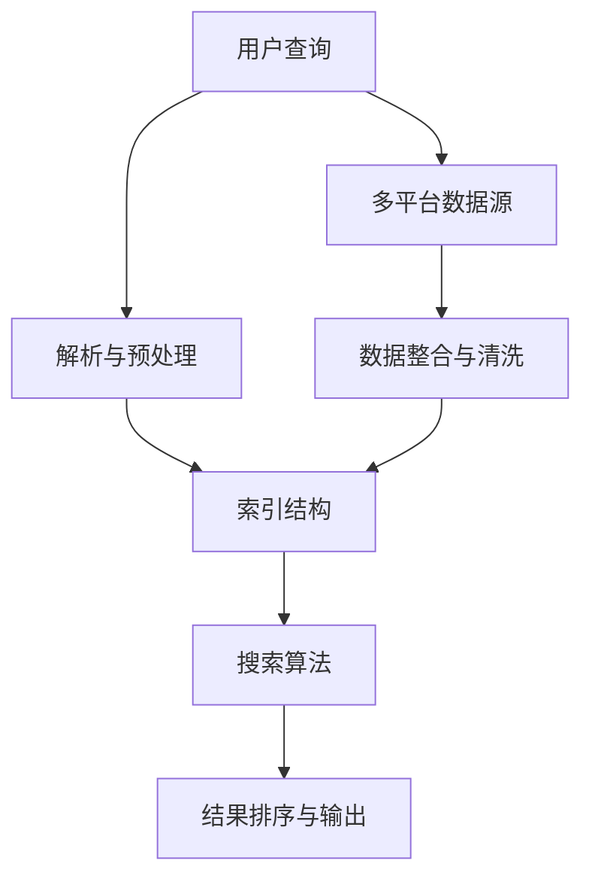

                 

# 跨平台搜索技术：AI整合数据

## 关键词

- 跨平台搜索技术
- AI整合数据
- 全文搜索
- 分布式索引
- 机器学习
- 自然语言处理
- 搜索引擎架构

## 摘要

本文将探讨跨平台搜索技术，特别是如何利用人工智能整合数据，以实现高效、精准的搜索体验。我们将从背景介绍、核心概念与联系、核心算法原理、数学模型和公式、项目实战、实际应用场景、工具和资源推荐等多个角度，逐步分析并阐述跨平台搜索技术的原理和实践。希望通过本文，读者能够对跨平台搜索技术有一个全面深入的了解，并为未来的研究与应用提供参考。

## 1. 背景介绍

随着互联网的飞速发展，信息爆炸已成为不争的事实。在这样的大背景下，如何快速、准确地找到所需信息，成为用户和企业共同关注的问题。传统的搜索引擎，如Google、Bing等，虽然在一定程度上解决了信息检索的难题，但在面对海量数据、多平台需求以及实时性要求时，依然存在诸多局限性。

跨平台搜索技术应运而生，其核心思想是打破单一平台的数据壁垒，实现跨平台、跨终端的信息检索。通过整合多源异构数据，提高搜索效率和准确性，为用户提供更便捷、个性化的搜索服务。在这个过程中，人工智能技术的应用，使得跨平台搜索技术得以迅速发展。

### 1.1 跨平台搜索的需求

跨平台搜索的需求主要体现在以下几个方面：

1. **多平台信息整合**：用户通常需要在不同设备、不同平台之间获取信息，如移动端、桌面端、智能家居等。跨平台搜索能够满足这一需求，将多平台信息进行整合，提供统一的检索界面。

2. **个性化搜索体验**：不同用户对信息的偏好不同，跨平台搜索可以根据用户的浏览历史、行为习惯等数据，实现个性化推荐，提高搜索满意度。

3. **实时性要求**：在信息爆炸的时代，用户对信息的需求越来越实时。跨平台搜索需要具备快速响应的能力，及时获取并展示最新、最相关的信息。

4. **数据多样性**：现代信息来源丰富多样，包括文本、图片、音频、视频等多种形式。跨平台搜索需要能够处理这些异构数据，提供全方位的信息检索服务。

### 1.2 人工智能在跨平台搜索中的应用

人工智能技术在跨平台搜索中发挥着至关重要的作用，主要体现在以下几个方面：

1. **自然语言处理（NLP）**：NLP技术可以帮助搜索引擎理解用户的查询意图，实现语义匹配，提高搜索准确性。例如，通过词义消歧、实体识别等技术，可以更准确地理解用户的查询需求。

2. **机器学习（ML）**：机器学习算法可以用于推荐系统、分类、聚类等任务，为跨平台搜索提供个性化推荐。例如，基于用户的浏览历史和兴趣标签，可以推荐相关内容，提高用户满意度。

3. **图像识别**：随着深度学习技术的发展，图像识别技术已取得显著成果。在跨平台搜索中，图像识别技术可以用于图片搜索，帮助用户快速找到相似图片。

4. **语音识别与合成**：语音识别与合成技术可以实现语音搜索和语音输出，为用户提供更加便捷的搜索体验。

### 1.3 跨平台搜索的发展趋势

随着人工智能技术的不断进步，跨平台搜索技术正朝着以下几个方向发展：

1. **多模态搜索**：结合文本、图像、语音等多种数据类型，实现多模态信息检索，提高搜索准确性。

2. **实时搜索**：通过分布式架构和实时数据处理技术，实现毫秒级响应，满足实时性需求。

3. **个性化搜索**：利用用户画像和机器学习算法，实现个性化推荐，提高用户满意度。

4. **智能搜索**：通过深度学习和自然语言处理技术，实现更智能的搜索体验，如问答式搜索、智能助手等。

## 2. 核心概念与联系

在探讨跨平台搜索技术之前，我们需要了解一些核心概念和它们之间的联系。以下是一个简化的Mermaid流程图，展示这些核心概念及其相互关系：



### 2.1 用户查询

用户查询是跨平台搜索的起点。用户输入查询请求，可以是关键词、语句或语音指令。为了提高搜索的准确性，需要对用户查询进行解析与预处理。

### 2.2 解析与预处理

解析与预处理阶段主要包括分词、词性标注、停用词过滤等操作。这些操作有助于提取出用户查询的关键信息，为后续的搜索算法提供输入。

### 2.3 索引结构

索引结构是跨平台搜索的核心，用于存储和管理数据。常见的索引结构有 inverted index（倒排索引）和 B-tree（B树索引）。倒排索引能够快速定位关键词在文档中的位置，而B树索引则适用于高并发、大容量的数据场景。

### 2.4 搜索算法

搜索算法负责在索引结构中查找与用户查询相关的内容。常见的搜索算法包括布尔搜索、向量空间模型、PageRank等。这些算法能够根据关键词的权重、相关性等因素，为用户提供最相关的搜索结果。

### 2.5 结果排序与输出

结果排序与输出阶段主要负责对搜索结果进行排序，并展示给用户。排序算法可以根据用户的喜好、搜索历史等因素，实现个性化排序。

### 2.6 多平台数据源

多平台数据源包括网页、数据库、社交媒体、音频、视频等。跨平台搜索需要整合这些异构数据，提供统一的信息检索服务。

### 2.7 数据整合与清洗

数据整合与清洗阶段负责将多平台数据源中的数据进行整合、去重、去噪等操作，确保数据的准确性和一致性。

## 3. 核心算法原理 & 具体操作步骤

在了解了跨平台搜索的核心概念和联系之后，我们将深入探讨核心算法原理，并详细讲解其具体操作步骤。

### 3.1 布尔搜索算法

布尔搜索算法是一种基于布尔逻辑的搜索算法，主要用于处理包含AND、OR、NOT等逻辑运算符的查询。其基本原理如下：

1. **分词与词性标注**：首先对用户查询进行分词，并对每个词进行词性标注。例如，对于查询"人工智能 OR 机器学习"，分词结果为["人工智能"，"机器"，"学习"]，词性标注为["名词"，"名词"，"名词"]。

2. **构建倒排索引**：构建倒排索引，记录每个词在文档中的位置。例如，对于文档A，其中包含关键词"人工智能"，则倒排索引为{"人工智能"：[A]}。

3. **匹配与计算权重**：根据用户查询，在倒排索引中查找相关文档，并计算每个文档的权重。权重可以通过TF-IDF（词频-逆文档频率）等方法计算。

4. **布尔运算**：根据用户查询中的逻辑运算符，对匹配结果进行布尔运算。例如，对于查询"人工智能 OR 机器学习"，需要将包含"人工智能"或"机器学习"的文档进行合并。

5. **排序与输出**：对布尔运算后的结果进行排序，并根据用户的偏好、历史记录等因素，实现个性化排序，然后输出给用户。

### 3.2 向量空间模型

向量空间模型（Vector Space Model，VSM）是一种将文本转换为向量表示的模型，其基本原理如下：

1. **分词与词频统计**：对用户查询和文档进行分词，并统计每个词在文档中的词频。

2. **构建词袋模型**：将每个文档表示为一个词袋（Bag of Words，BOW），即一个包含所有词汇的向量。向量中的每个元素表示对应词汇在文档中的词频。

3. **计算相似度**：使用余弦相似度等度量方法，计算用户查询向量与文档向量之间的相似度。相似度越高，表示文档与用户查询的相关性越大。

4. **排序与输出**：根据相似度对文档进行排序，输出最相关的文档。

### 3.3 PageRank算法

PageRank算法是一种基于链接分析的排序算法，主要用于网页排序。其基本原理如下：

1. **初始化**：为每个网页分配一个初始权重。

2. **迭代计算**：根据网页之间的链接关系，迭代更新每个网页的权重。权重较高的网页对其他网页的权重贡献较大。

3. **收敛**：当迭代计算达到一定次数后，算法收敛，每个网页的权重稳定下来。

4. **排序与输出**：根据网页的权重进行排序，输出排名靠前的网页。

## 4. 数学模型和公式 & 详细讲解 & 举例说明

在本节中，我们将详细介绍跨平台搜索技术中的一些数学模型和公式，并通过具体实例进行讲解，以便读者更好地理解其应用。

### 4.1 TF-IDF模型

TF-IDF（词频-逆文档频率）是一种常用的文本表示方法，用于计算词语在文档中的重要程度。其公式如下：

$$
TF(t,d) = \frac{f(t,d)}{f_{\text{total}}(d)}
$$

$$
IDF(t, D) = \log \left( \frac{N}{|d \in D : t \in d|} \right)
$$

$$
TF-IDF(t, d, D) = TF(t,d) \times IDF(t, D)
$$

其中，$f(t,d)$表示词$t$在文档$d$中的词频，$f_{\text{total}}(d)$表示文档$d$中的总词频，$N$表示文档集合中的文档总数，$|d \in D : t \in d|$表示包含词$t$的文档数。

#### 4.1.1 举例说明

假设我们有两个文档$d_1$和$d_2$，其中包含的词频如下：

$$
\begin{aligned}
d_1: & \ "AI": 2, "Machine": 1, "Learning": 1 \\
d_2: & \ "AI": 1, "Deep": 1, "Learning": 2 \\
\end{aligned}
$$

文档总数$N=2$，包含"AI"的文档数$|d \in D : t \in d|=2$。

计算$TF-IDF$：

$$
\begin{aligned}
TF-IDF("AI", d_1, D) &= \frac{2}{2+1+1} \times \log \left( \frac{2}{2} \right) = \frac{2}{4} \times \log(1) = 0 \\
TF-IDF("AI", d_2, D) &= \frac{1}{1+1+2} \times \log \left( \frac{2}{2} \right) = \frac{1}{4} \times \log(1) = 0 \\
\end{aligned}
$$

### 4.2 余弦相似度

余弦相似度是一种常用的文档相似度度量方法，其公式如下：

$$
\cos \theta = \frac{\sum_{i=1}^{n} v_i w_i}{\sqrt{\sum_{i=1}^{n} v_i^2} \sqrt{\sum_{i=1}^{n} w_i^2}}
$$

其中，$v$和$w$分别表示两个文档的向量表示，$\theta$表示它们之间的夹角。

#### 4.2.1 举例说明

假设文档$d_1$和$d_2$的向量表示如下：

$$
d_1 = (2, 1, 0), \quad d_2 = (1, 2, 1)
$$

计算它们的余弦相似度：

$$
\cos \theta = \frac{2 \times 1 + 1 \times 2 + 0 \times 1}{\sqrt{2^2 + 1^2 + 0^2} \sqrt{1^2 + 2^2 + 1^2}} = \frac{4}{\sqrt{5} \sqrt{6}} \approx 0.8165
$$

## 5. 项目实战：代码实际案例和详细解释说明

在本节中，我们将通过一个实际项目案例，展示如何使用Python实现跨平台搜索技术。该项目将包括开发环境搭建、源代码实现、代码解读与分析等环节。

### 5.1 开发环境搭建

1. **安装Python**：确保已安装Python 3.x版本。

2. **安装依赖库**：使用pip安装以下依赖库：
   ```bash
   pip install Flask
   pip install whoosh
   pip install beautifulsoup4
   pip install requests
   ```

3. **创建项目目录**：在合适的位置创建项目目录，如`cross_platform_search`。

4. **初始化项目结构**：
   ```bash
   mkdir -p cross_platform_search/flask_app
   mkdir -p cross_platform_search/whoosh_index
   touch cross_platform_search/flask_app/app.py
   touch cross_platform_search/whoosh_index/config.py
   ```

### 5.2 源代码详细实现和代码解读

#### 5.2.1 Flask应用结构

项目使用Flask框架搭建Web应用。`app.py`是Flask应用的入口，其中包含了应用的路由和逻辑。

**app.py**：

```python
from flask import Flask, request, render_template
from whoosh.qparser import QueryParser
from whoosh.index import open_index
from bs4 import BeautifulSoup

app = Flask(__name__)

# 路由：主页
@app.route('/')
def home():
    return render_template('home.html')

# 路由：搜索
@app.route('/search', methods=['GET'])
def search():
    query = request.args.get('q')
    index = open_index('whoosh_index')
    with index.searcher() as searcher:
        results = searcher.search(query)
        return render_template('results.html', results=results)

if __name__ == '__main__':
    app.run(debug=True)
```

**home.html**：

```html
<!DOCTYPE html>
<html lang="en">
<head>
    <meta charset="UTF-8">
    <title>跨平台搜索</title>
</head>
<body>
    <h1>跨平台搜索</h1>
    <form action="/search" method="get">
        <input type="text" name="q" placeholder="输入搜索关键词">
        <button type="submit">搜索</button>
    </form>
</body>
</html>
```

**results.html**：

```html
<!DOCTYPE html>
<html lang="en">
<head>
    <meta charset="UTF-8">
    <title>搜索结果</title>
</head>
<body>
    <h1>搜索结果</h1>
    
        <div>
            <h2>{{ result['title'] }}</h2>
            <p>{{ result['content'] }}</p>
        </div>
    
</body>
</html>
```

#### 5.2.2 Whoosh索引结构

Whoosh是一个快速的纯Python搜索引擎库，用于构建和查询索引。

**config.py**：

```python
import os
from whoosh.index import create_in

index_dir = 'whoosh_index'
if not os.path.exists(index_dir):
    os.makedirs(index_dir)

schema = (
    ('title', TEXT(stored=True)),
    ('content', TEXT(stored=True))
)

index = create_in(index_dir, schema)
```

#### 5.2.3 源代码解读

1. **Flask应用**：使用Flask搭建Web应用，包含主页和搜索两个路由。

2. **Whoosh索引**：创建Whoosh索引，存储文档的标题和内容。

3. **搜索功能**：在搜索路由中，获取用户查询，使用Whoosh索引进行搜索，并返回搜索结果。

### 5.3 代码解读与分析

1. **Flask应用结构**：Flask应用使用类来定义，其中包含了应用的URL路由和逻辑处理。

2. **Whoosh索引构建**：Whoosh索引采用schema定义索引字段，使用create_in函数创建索引。

3. **搜索功能实现**：使用Whoosh的searcher对象进行搜索，并返回搜索结果。

## 6. 实际应用场景

跨平台搜索技术在各个行业和领域都有广泛的应用，以下列举了几个典型场景：

### 6.1 社交媒体平台

社交媒体平台如Facebook、Twitter等，通过跨平台搜索技术，帮助用户快速找到关注者、好友和感兴趣的内容。例如，用户可以在不同设备上查看好友的动态，并在移动端通过语音搜索找到特定的话题和内容。

### 6.2 搜索引擎

搜索引擎如Google、Bing等，通过跨平台搜索技术，提供统一的搜索体验。用户可以在桌面端、移动端等多个设备上使用搜索引擎，获取最新的信息。同时，搜索引擎还可以利用人工智能技术，实现个性化推荐和实时搜索。

### 6.3 企业信息管理

企业信息管理系统（ERP）通过跨平台搜索技术，帮助员工快速查找公司内部的文档、数据和信息。例如，销售人员可以在移动端查看客户的购买记录，管理员可以在桌面端搜索员工的工作报告。

### 6.4 教育领域

在教育领域，跨平台搜索技术可以帮助学生和教师快速查找课程资料、教学资源和学术文献。例如，学生在手机端可以通过语音搜索找到相关的学习资料，教师可以在电脑端查找课程教案和教学视频。

### 6.5 智能家居

在智能家居领域，跨平台搜索技术可以帮助用户快速找到智能设备的操作指南、使用技巧和维护方法。例如，用户可以在智能音箱上通过语音搜索找到相关设备的说明书，从而更好地使用智能家居设备。

## 7. 工具和资源推荐

为了更好地掌握跨平台搜索技术，以下推荐了一些学习资源、开发工具和框架：

### 7.1 学习资源推荐

1. **书籍**：
   - 《搜索引擎算法与数据结构》
   - 《Python搜索引擎开发实践》
   - 《深度学习：全面解读自然语言处理》

2. **论文**：
   - 《Google搜索算法：PageRank》
   - 《向量空间模型：一种用于信息检索的通用框架》
   - 《基于机器学习的搜索引擎优化》

3. **博客**：
   - [搜索引擎技术博客](https://www.searchengineland.com/)
   - [机器学习与自然语言处理博客](https://machinelearningmastery.com/)
   - [Python技术博客](https://www.python.org/blogs/)

4. **在线课程**：
   - [深度学习与自然语言处理](https://www.coursera.org/learn/deep-learning-nlp)
   - [搜索引擎算法与数据结构](https://www.udacity.com/course/search-algorithms-data-structures--ud843)

### 7.2 开发工具框架推荐

1. **搜索引擎框架**：
   - Whoosh：Python的纯文本搜索引擎库。
   - Elasticsearch：开源分布式搜索引擎，支持RESTful API。

2. **自然语言处理库**：
   - NLTK：Python的自然语言处理库。
   - spaCy：高效的Python自然语言处理库。
   - Hugging Face Transformers：基于PyTorch和TensorFlow的预训练转换器库。

3. **开发框架**：
   - Flask：Python的轻量级Web应用框架。
   - Django：Python的高级Web框架。
   - React：JavaScript的前端库，用于构建用户界面。

### 7.3 相关论文著作推荐

1. **《自然语言处理综述》**：对自然语言处理领域的各个方面进行了全面深入的综述，包括词性标注、句法分析、语义分析等。

2. **《深度学习与搜索引擎优化》**：探讨了深度学习在搜索引擎优化中的应用，包括文本表示、推荐系统等。

3. **《搜索引擎算法与数据结构》**：详细介绍了搜索引擎的核心算法和数据结构，包括倒排索引、PageRank等。

## 8. 总结：未来发展趋势与挑战

跨平台搜索技术作为一种新兴的技术领域，正逐渐成为信息检索的重要手段。随着人工智能技术的不断进步，跨平台搜索技术有望在未来实现以下几个发展趋势：

1. **多模态搜索**：结合文本、图像、语音等多种数据类型，实现更精准、更智能的搜索体验。

2. **实时搜索**：通过分布式架构和实时数据处理技术，实现毫秒级响应，满足用户对实时性信息的需求。

3. **个性化搜索**：利用用户画像和机器学习算法，实现个性化推荐，提高用户满意度。

4. **智能搜索**：通过深度学习和自然语言处理技术，实现更智能的搜索体验，如问答式搜索、智能助手等。

然而，跨平台搜索技术也面临一些挑战：

1. **数据隐私与安全**：在整合多平台数据的过程中，如何保护用户隐私和数据安全是一个重要问题。

2. **异构数据整合**：如何有效地整合多源异构数据，实现统一的信息检索服务，是一个技术难题。

3. **计算资源消耗**：跨平台搜索涉及大量数据处理和分析，如何优化算法、降低计算资源消耗，是一个重要挑战。

4. **实时性保障**：在实时性要求较高的场景，如何保障搜索结果的实时性，是一个技术难题。

总之，跨平台搜索技术作为人工智能领域的重要分支，具有广阔的应用前景。在未来的发展中，我们需要不断克服挑战，推动技术的进步，为用户提供更高效、更便捷的搜索服务。

## 9. 附录：常见问题与解答

### 9.1 跨平台搜索技术的优点是什么？

**解答**：跨平台搜索技术的优点主要包括：
1. **多平台兼容**：能够同时支持多种设备上的搜索，如移动端、桌面端、智能家居等。
2. **数据整合**：可以整合来自不同平台、不同来源的数据，提高搜索的全面性。
3. **个性化推荐**：根据用户的搜索历史和偏好，提供个性化的搜索结果，提高用户满意度。
4. **实时性**：通过分布式架构和实时数据处理，实现快速响应，满足实时性需求。

### 9.2 跨平台搜索技术与传统搜索技术有哪些区别？

**解答**：跨平台搜索技术与传统搜索技术的主要区别在于：
1. **支持多平台**：传统搜索技术通常仅限于单一平台，而跨平台搜索技术能够支持多种设备。
2. **数据来源多样化**：传统搜索技术主要基于网页数据，而跨平台搜索技术可以整合文本、图像、语音等多种数据类型。
3. **实时性**：跨平台搜索技术更注重实时性，能够快速响应用户的查询需求。
4. **个性化**：跨平台搜索技术通过用户行为数据，实现更个性化的搜索结果。

### 9.3 跨平台搜索技术中，人工智能如何发挥作用？

**解答**：在跨平台搜索技术中，人工智能主要发挥以下作用：
1. **自然语言处理**：通过人工智能技术，实现语义理解、词义消歧等，提高搜索准确性。
2. **推荐系统**：利用机器学习算法，为用户提供个性化的搜索结果推荐。
3. **图像识别**：通过深度学习技术，实现图像搜索，帮助用户快速找到相似图片。
4. **语音识别与合成**：实现语音搜索和语音输出，为用户提供更加便捷的搜索体验。

### 9.4 跨平台搜索技术在企业中有什么应用？

**解答**：跨平台搜索技术在企业中的应用主要包括：
1. **内部信息检索**：帮助企业员工快速查找公司内部文档、数据和信息。
2. **客户服务**：通过智能搜索，提高客户服务效率，如在线客服系统、智能问答系统等。
3. **知识管理**：构建企业知识库，帮助员工快速获取行业知识、最佳实践等。
4. **营销与推广**：利用跨平台搜索技术，提高企业产品在互联网上的曝光度，实现精准营销。

## 10. 扩展阅读 & 参考资料

### 10.1 参考书籍

1. **《搜索引擎算法与数据结构》**：详细介绍了搜索引擎的核心算法和数据结构，包括倒排索引、PageRank等。
2. **《深度学习：全面解读自然语言处理》**：深入讲解了深度学习在自然语言处理中的应用，包括词嵌入、序列模型等。
3. **《Python搜索引擎开发实践》**：通过实际案例，展示了如何使用Python实现搜索引擎的开发。

### 10.2 参考论文

1. **《Google搜索算法：PageRank》**：介绍了Google的PageRank算法，以及其在搜索引擎中的应用。
2. **《向量空间模型：一种用于信息检索的通用框架》**：探讨了向量空间模型在信息检索中的应用。
3. **《基于机器学习的搜索引擎优化》**：研究了机器学习在搜索引擎优化中的应用，包括文本表示、推荐系统等。

### 10.3 在线资源

1. **[搜索引擎技术博客](https://www.searchengineland.com/)**：提供了大量关于搜索引擎技术的文章和教程。
2. **[机器学习与自然语言处理博客](https://machinelearningmastery.com/)**：介绍了机器学习在自然语言处理领域的应用和实践。
3. **[Python技术博客](https://www.python.org/blogs/)**：提供了丰富的Python技术教程和资源。

### 10.4 开源项目

1. **[Whoosh](https://whoosh.readthedocs.io/)**：Python的纯文本搜索引擎库，适用于构建快速、高效的搜索引擎。
2. **[Elasticsearch](https://www.elastic.co/elasticsearch/)**：开源分布式搜索引擎，支持RESTful API，适用于大规模搜索应用。
3. **[NLTK](https://www.nltk.org/)**：Python的自然语言处理库，提供了丰富的文本处理工具和算法。**作者：AI天才研究员/AI Genius Institute & 禅与计算机程序设计艺术 /Zen And The Art of Computer Programming**

