                 

# 跨平台搜索：AI如何整合多渠道数据，提供最优选择

## 摘要

本文将探讨跨平台搜索的技术实现和AI在其中的关键作用。在数字化的今天，用户的需求越来越多样化，他们希望通过一个统一的接口访问不同平台的数据。本文首先介绍了跨平台搜索的背景和重要性，随后深入探讨了AI整合多渠道数据的技术原理和方法，包括核心算法、数学模型、具体操作步骤等。通过实际项目案例，本文展示了如何搭建开发环境，实现代码的详细解析，并分析了跨平台搜索的实际应用场景。最后，本文对相关工具和资源进行了推荐，总结了未来的发展趋势与挑战，并为读者提供了进一步的学习和参考资源。

## 1. 背景介绍

随着互联网的迅猛发展，人们的生活越来越依赖于各种在线平台。从社交媒体到电子商务，从在线娱乐到金融服务，几乎所有的行业都在向线上迁移。这种变化不仅改变了人们的生活方式，也大大增加了用户对于数据获取的期望。用户不再满足于单一平台的信息，他们希望能在多个平台上快速、准确地找到所需内容。

这种需求催生了跨平台搜索的出现。跨平台搜索的目标是提供一个统一的搜索接口，用户可以通过这个接口搜索到不同平台上的信息，而不需要分别访问各个平台。这样的搜索方式极大地提高了用户的效率，也满足了他们对多样化、个性化信息的需求。

### 跨平台搜索的需求和挑战

跨平台搜索的需求主要来源于以下几个方面：

1. **信息多样性**：用户希望在不同平台上获取不同类型的信息，例如社交媒体上的新闻、电子商务平台上的产品信息、在线地图中的地理位置等。
2. **高效性**：用户希望在短时间内找到所需信息，而不是在不同平台之间进行繁琐的切换和搜索。
3. **个性化**：用户希望搜索结果能够根据其个人兴趣和需求进行个性化推荐。

然而，跨平台搜索也面临着一系列挑战：

1. **数据格式差异**：不同平台的数据格式和结构可能存在较大差异，这给数据整合和统一搜索带来了困难。
2. **数据质量**：不同平台的数据质量和完整性参差不齐，如何确保搜索结果的准确性和可靠性是一个重要问题。
3. **性能优化**：跨平台搜索需要处理大量的数据，如何优化搜索算法和性能是一个关键问题。

### 跨平台搜索的背景和重要性

跨平台搜索的背景源于互联网的多样化和用户需求的提升。随着各种在线平台的兴起，用户不再局限于单一平台，他们希望在多个平台上进行信息交流和获取。例如，一个用户可能在社交媒体上关注新闻，在电子商务平台上购买产品，在在线地图上查找地理位置。这种多样化的信息需求促使平台之间进行数据共享和整合，从而提供跨平台的搜索服务。

跨平台搜索的重要性体现在以下几个方面：

1. **提升用户体验**：通过跨平台搜索，用户可以方便地获取到不同平台上的信息，提高了信息获取的效率和满意度。
2. **增加平台粘性**：提供高质量的跨平台搜索服务可以增加用户对平台的依赖和忠诚度，从而提高平台的竞争力。
3. **数据整合和分析**：跨平台搜索有助于将分散在不同平台上的数据进行整合，为平台提供更全面、深入的数据分析，进而优化服务内容和营销策略。

总之，跨平台搜索已经成为现代互联网环境下的一个重要需求，其背景和重要性不容忽视。在接下来的部分中，我们将深入探讨AI在跨平台搜索中的作用和关键技术。

## 2. 核心概念与联系

### 2.1 AI在跨平台搜索中的作用

AI在跨平台搜索中扮演着至关重要的角色。其主要作用包括数据整合、智能推荐、搜索结果优化等。以下是对这些核心概念的具体解释：

#### 数据整合

数据整合是跨平台搜索的关键步骤，它涉及到从多个来源获取数据，并将其转换为统一的格式。AI通过自然语言处理（NLP）、数据挖掘和机器学习等技术，能够自动识别和解析不同平台的数据格式，将其整合为一个统一的索引。这一过程不仅提高了数据的一致性，还为后续的智能搜索提供了基础。

#### 智能推荐

智能推荐是AI在跨平台搜索中的另一重要应用。通过分析用户的搜索历史、行为偏好和社交关系，AI能够为用户推荐相关的搜索结果。这种推荐不仅基于用户的历史行为，还结合了实时数据，使得搜索结果更加准确和个性化。

#### 搜索结果优化

搜索结果优化是AI提升跨平台搜索质量的关键环节。通过使用机器学习算法，AI可以分析和预测用户的搜索意图，并提供最相关的搜索结果。此外，AI还可以利用用户反馈不断优化搜索算法，提高搜索结果的准确性和用户满意度。

### 2.2 跨平台搜索的关键技术

为了实现高效的跨平台搜索，需要依赖一系列关键技术。以下是其中几个重要的技术：

#### 搜索引擎

搜索引擎是跨平台搜索的核心组件，它负责接收用户的查询请求，并从多个数据源中检索相关信息。现代搜索引擎通常采用分布式架构，以提高搜索效率和扩展性。

#### 分布式索引

分布式索引是将大量数据分散存储在多个节点上，以提高数据检索的速度和系统的可靠性。通过分布式索引，跨平台搜索可以在短时间内处理海量数据，并提供快速的查询响应。

#### 异构数据集成

异构数据集成是处理不同平台数据格式差异的关键技术。它通过数据转换和映射，将不同源的数据统一到一个公共格式，从而实现跨平台的数据整合。

#### 智能排序算法

智能排序算法是决定搜索结果质量的重要因素。通过机器学习算法，可以分析和预测用户的搜索意图，并提供最相关的搜索结果。常用的智能排序算法包括协同过滤、矩阵分解、文本相似度计算等。

### 2.3 Mermaid 流程图

以下是一个简化的跨平台搜索流程图，展示了AI在其中的关键作用：

```mermaid
graph TD
    A[用户查询] --> B[查询解析]
    B --> C{数据源识别}
    C -->|社交媒体| D[社交媒体数据]
    C -->|电子商务| E[电商数据]
    C -->|地理位置| F[地理位置数据]
    D --> G[数据转换]
    E --> G
    F --> G
    G --> H[数据整合]
    H --> I[智能推荐]
    I --> J[搜索结果]
```



在这个流程图中，用户查询首先经过查询解析，然后识别不同的数据源，并从各个数据源中提取数据。这些数据经过转换和整合，最终生成统一的搜索结果，并返回给用户。

通过这个流程图，我们可以更清晰地理解AI在跨平台搜索中的各个环节，以及各个技术组件之间的联系和作用。

## 3. 核心算法原理 & 具体操作步骤

### 3.1 AI在跨平台搜索中的核心算法原理

跨平台搜索的实现离不开AI技术的支持，其中核心算法主要包括数据整合算法、智能推荐算法和搜索结果优化算法。以下是对这些算法原理的详细解释：

#### 数据整合算法

数据整合算法主要负责将来自不同平台的数据转换为统一的格式，以便进行后续处理。其原理是基于自然语言处理（NLP）和数据挖掘技术，通过以下步骤实现：

1. **数据提取**：从各个数据源中提取原始数据，如文本、图片、音频等。
2. **数据清洗**：对提取的数据进行清洗，去除重复、错误或不完整的信息。
3. **特征提取**：使用NLP技术，将文本数据转换为可处理的特征向量。对于非文本数据，如图片和音频，可以使用深度学习模型进行特征提取。
4. **数据融合**：将不同类型的数据特征进行融合，生成一个统一的特征表示。

#### 智能推荐算法

智能推荐算法负责根据用户的搜索历史、行为偏好和社交关系，为用户推荐相关的搜索结果。其主要原理包括：

1. **协同过滤**：基于用户的相似度计算，推荐与目标用户偏好相似的搜索结果。协同过滤分为基于用户的协同过滤和基于项目的协同过滤两种。
2. **矩阵分解**：通过矩阵分解技术，将用户-项目评分矩阵分解为用户特征矩阵和项目特征矩阵，从而预测用户对未评分项目的评分。
3. **内容推荐**：根据搜索内容的文本特征，使用文本相似度计算方法，为用户推荐与其搜索内容相关的搜索结果。

#### 搜索结果优化算法

搜索结果优化算法旨在提高搜索结果的准确性和用户满意度，其原理包括：

1. **意图识别**：通过分析用户的查询语句，识别用户的真实意图，从而提供更准确的搜索结果。
2. **排序算法**：使用机器学习算法，根据用户的历史行为和搜索意图，对搜索结果进行排序，提高相关性的排名。
3. **反馈机制**：根据用户的反馈，不断调整和优化搜索算法，提高搜索结果的准确性和用户满意度。

### 3.2 数据整合算法的具体操作步骤

以下是一个简化的数据整合算法的具体操作步骤：

1. **数据提取**：从社交媒体、电子商务和地理位置等数据源中提取原始数据。例如，从社交媒体平台提取用户发表的文本和图片，从电子商务平台提取产品信息，从地理位置平台提取地理位置数据。
2. **数据清洗**：对提取的数据进行清洗，去除重复、错误或不完整的信息。例如，去除社交媒体平台上的垃圾信息，修正电子商务平台上的错误产品信息。
3. **特征提取**：使用NLP技术，将文本数据转换为可处理的特征向量。对于非文本数据，如图片和音频，可以使用深度学习模型进行特征提取。例如，使用词向量模型（如Word2Vec、BERT）将文本数据转换为向量表示，使用卷积神经网络（CNN）将图片数据转换为特征向量。
4. **数据融合**：将不同类型的数据特征进行融合，生成一个统一的特征表示。例如，使用融合算法（如加权平均、融合神经网络）将文本、图片和地理位置等特征融合为一个统一的向量表示。

### 3.3 智能推荐算法的具体操作步骤

以下是一个简化的智能推荐算法的具体操作步骤：

1. **用户行为数据收集**：收集用户的搜索历史、浏览记录、点击行为等数据，用于构建用户行为模型。
2. **社交关系数据收集**：收集用户在社交媒体上的关注关系、评论互动等数据，用于构建社交关系模型。
3. **协同过滤**：计算用户之间的相似度，为用户推荐与目标用户偏好相似的搜索结果。例如，使用余弦相似度计算用户之间的相似度。
4. **矩阵分解**：通过矩阵分解技术，将用户-项目评分矩阵分解为用户特征矩阵和项目特征矩阵，从而预测用户对未评分项目的评分。例如，使用矩阵分解算法（如Singular Value Decomposition, SVD）进行矩阵分解。
5. **内容推荐**：根据搜索内容的文本特征，使用文本相似度计算方法，为用户推荐与其搜索内容相关的搜索结果。例如，使用余弦相似度或Jaccard相似度计算文本之间的相似度。

### 3.4 搜索结果优化算法的具体操作步骤

以下是一个简化的搜索结果优化算法的具体操作步骤：

1. **意图识别**：通过分析用户的查询语句，识别用户的真实意图。例如，使用自然语言处理技术（如命名实体识别、语义角色标注）进行意图识别。
2. **排序算法**：使用机器学习算法，根据用户的历史行为和搜索意图，对搜索结果进行排序。例如，使用基于模型的排序算法（如RankSVM、LambdaMART）进行排序。
3. **反馈机制**：根据用户的反馈，如点击、收藏、评分等，不断调整和优化搜索算法。例如，使用在线学习算法（如梯度下降、随机梯度下降）进行实时调整。

通过以上核心算法的具体操作步骤，我们可以更好地理解跨平台搜索的实现原理和流程，为后续的项目实战打下基础。

## 4. 数学模型和公式 & 详细讲解 & 举例说明

### 4.1 数学模型在数据整合算法中的应用

在跨平台搜索中，数据整合算法是关键步骤之一。为了实现有效的数据整合，我们需要引入一些数学模型和公式，以便将来自不同平台的数据转换为统一的格式。以下是一些常用的数学模型和公式：

#### 1. 特征提取模型

特征提取是数据整合的重要环节，常用的模型包括词向量模型、卷积神经网络（CNN）和循环神经网络（RNN）等。

- **词向量模型**：如Word2Vec模型，通过计算词的共现矩阵，将文本数据转换为高维向量表示。公式如下：

  $$ \textbf{v}_i = \text{Word2Vec}(\text{corpus}) $$

  其中，$\textbf{v}_i$表示词向量，$\text{corpus}$表示语料库。

- **卷积神经网络（CNN）**：用于处理图像数据，通过卷积操作提取图像特征。公式如下：

  $$ \textbf{h}_{\text{CNN}} = \text{Conv}(\textbf{I}; \textbf{W}, \textbf{b}) $$

  其中，$\textbf{h}_{\text{CNN}}$表示卷积特征图，$\textbf{I}$表示输入图像，$\textbf{W}$表示卷积核，$\textbf{b}$表示偏置。

- **循环神经网络（RNN）**：用于处理序列数据，如文本数据。公式如下：

  $$ \textbf{h}_t = \text{RNN}(\textbf{h}_{t-1}, \textbf{x}_t) $$

  其中，$\textbf{h}_t$表示第$t$时刻的隐藏状态，$\textbf{h}_{t-1}$表示上一时刻的隐藏状态，$\textbf{x}_t$表示输入序列。

#### 2. 数据融合模型

数据融合是将不同类型的数据特征进行整合，以生成一个统一的特征表示。常用的模型包括加权平均模型和神经网络融合模型。

- **加权平均模型**：根据不同类型数据的权重，对特征进行加权平均。公式如下：

  $$ \textbf{z} = w_1\textbf{x}_1 + w_2\textbf{x}_2 + \ldots + w_n\textbf{x}_n $$

  其中，$\textbf{z}$表示融合后的特征向量，$w_1, w_2, \ldots, w_n$表示不同类型数据的权重。

- **神经网络融合模型**：通过神经网络结构，将不同类型的数据特征进行融合。公式如下：

  $$ \textbf{h}_{\text{fusion}} = \text{FusionNeuralNet}(\textbf{x}_1, \textbf{x}_2, \ldots, \textbf{x}_n) $$

  其中，$\textbf{h}_{\text{fusion}}$表示融合后的特征向量，$\text{FusionNeuralNet}$表示融合神经网络。

### 4.2 数学模型在智能推荐算法中的应用

智能推荐算法是跨平台搜索的重要组成部分，其核心在于根据用户的兴趣和行为，为用户推荐相关的搜索结果。以下是一些常用的数学模型和公式：

#### 1. 协同过滤模型

协同过滤是智能推荐算法的一种常见方法，主要包括基于用户的协同过滤和基于项目的协同过滤。

- **基于用户的协同过滤**：通过计算用户之间的相似度，为用户推荐与其相似的搜索结果。公式如下：

  $$ \text{similarity}(\text{user}_i, \text{user}_j) = \frac{\text{dot}(\textbf{r}_i, \textbf{r}_j)}{\|\textbf{r}_i\|\|\textbf{r}_j\|} $$

  其中，$\text{similarity}(\text{user}_i, \text{user}_j)$表示用户$i$和用户$j$之间的相似度，$\textbf{r}_i$和$\textbf{r}_j$分别表示用户$i$和用户$j$的评分向量。

- **基于项目的协同过滤**：通过计算项目之间的相似度，为用户推荐与其喜欢的项目相似的项目。公式如下：

  $$ \text{similarity}(\text{item}_i, \text{item}_j) = \frac{\text{dot}(\textbf{r}_i, \textbf{r}_j)}{\|\textbf{r}_i\|\|\textbf{r}_j\|} $$

  其中，$\text{similarity}(\text{item}_i, \text{item}_j)$表示项目$i$和项目$j$之间的相似度，$\textbf{r}_i$和$\textbf{r}_j$分别表示项目$i$和项目$j$的评分向量。

#### 2. 矩阵分解模型

矩阵分解是协同过滤算法的一种扩展，通过将用户-项目评分矩阵分解为用户特征矩阵和项目特征矩阵，预测用户对未评分项目的评分。公式如下：

$$ \textbf{R} = \textbf{U}\textbf{V}^T $$

其中，$\textbf{R}$表示用户-项目评分矩阵，$\textbf{U}$表示用户特征矩阵，$\textbf{V}$表示项目特征矩阵。

#### 3. 内容推荐模型

内容推荐是另一种常见的推荐方法，通过计算搜索内容与候选结果之间的相似度，为用户推荐相关的内容。公式如下：

$$ \text{similarity}(\text{query}, \text{item}) = \frac{\text{dot}(\textbf{q}, \textbf{i})}{\|\textbf{q}\|\|\textbf{i}\|} $$

其中，$\text{similarity}(\text{query}, \text{item})$表示查询与项目之间的相似度，$\textbf{q}$和$\textbf{i}$分别表示查询向量和项目向量。

### 4.3 数学模型在搜索结果优化算法中的应用

搜索结果优化算法的核心是提高搜索结果的准确性和用户满意度，常用的数学模型包括意图识别模型和排序算法。

#### 1. 意图识别模型

意图识别是分析用户的查询语句，识别用户的真实意图。常用的模型包括条件随机场（CRF）和长短期记忆网络（LSTM）。

- **条件随机场（CRF）**：用于标注查询语句中的实体和关系。公式如下：

  $$ P(\text{y}|\text{x}) = \frac{1}{Z} \exp(\sum_{i} \theta_i y_i + \sum_{i,j} \theta_{ij} y_i y_j) $$

  其中，$P(\text{y}|\text{x})$表示在给定查询$x$的情况下，意图$y$的概率，$\theta_i$和$\theta_{ij}$分别表示模型参数。

- **长短期记忆网络（LSTM）**：用于捕捉查询语句中的长期依赖关系。公式如下：

  $$ \textbf{h}_t = \text{LSTM}(\textbf{h}_{t-1}, \textbf{x}_t) $$

  其中，$\textbf{h}_t$表示第$t$时刻的隐藏状态，$\textbf{h}_{t-1}$表示上一时刻的隐藏状态，$\textbf{x}_t$表示输入序列。

#### 2. 排序算法

排序算法是决定搜索结果质量的关键环节，常用的算法包括基于模型的排序算法和基于样本的排序算法。

- **基于模型的排序算法**：如RankSVM和LambdaMART，通过训练一个分类器，将搜索结果进行排序。公式如下：

  $$ \textbf{w} = \arg\min_{\textbf{w}} \frac{1}{n} \sum_{i=1}^{n} -y_i \textbf{w}^T \textbf{x}_i $$

  其中，$\textbf{w}$表示模型参数，$y_i$表示第$i$个样本的标签，$\textbf{x}_i$表示第$i$个样本的特征向量。

- **基于样本的排序算法**：如NDCG（归一化折扣累积增益），通过计算搜索结果的增益，进行排序。公式如下：

  $$ \text{NDCG}(r) = \frac{1}{\log_2(n+1)} \sum_{i=1}^{n} \frac{r_i}{\log_2(i+1)} $$

  其中，$r_i$表示第$i$个搜索结果的排名，$n$表示搜索结果的总数。

### 4.4 举例说明

以下是一个简化的例子，说明如何在跨平台搜索中应用上述数学模型：

#### 数据整合

假设我们有来自三个不同平台的数据：

- **社交媒体**：用户发表的文章，每篇文章包含标题和内容。
- **电子商务**：产品信息，包括产品名称、描述和类别。
- **地理位置**：地点信息，包括地点名称和坐标。

我们需要将这些数据进行整合，生成一个统一的特征向量。

1. **特征提取**：使用Word2Vec模型将文本数据转换为向量表示，使用卷积神经网络（CNN）提取图片数据的特征，使用嵌入层提取地点名称的特征。
2. **数据融合**：使用加权平均模型将不同类型的数据特征进行融合，生成一个统一的特征向量。

#### 智能推荐

假设用户在社交媒体上搜索“巴黎旅行攻略”，我们需要为其推荐相关的文章、产品和地点。

1. **协同过滤**：计算用户之间的相似度，为用户推荐与其相似的用户喜欢的文章、产品和地点。
2. **矩阵分解**：预测用户对未评分的文章、产品和地点的评分，为用户推荐评分较高的内容。
3. **内容推荐**：计算用户搜索内容与候选结果的相似度，为用户推荐与其搜索内容相关的文章、产品和地点。

#### 搜索结果优化

假设用户在搜索“巴黎旅行攻略”时，我们需要对其搜索意图进行识别，并对搜索结果进行排序。

1. **意图识别**：使用CRF模型识别用户查询中的实体和关系，如“巴黎”是地点，“旅行攻略”是意图。
2. **排序算法**：使用RankSVM模型对搜索结果进行排序，根据用户的意图和搜索历史，提高相关性的排名。

通过以上数学模型和公式的应用，我们可以实现高效的跨平台搜索，为用户提供优质的搜索体验。

## 5. 项目实战：代码实际案例和详细解释说明

### 5.1 开发环境搭建

在进行跨平台搜索项目开发前，我们需要搭建一个合适的技术环境。以下是一个基于Python的跨平台搜索项目的开发环境搭建步骤：

1. **安装Python**：确保已安装Python 3.7或更高版本。可以从[Python官方网站](https://www.python.org/)下载并安装。

2. **安装依赖库**：在Python中，我们可以使用pip来安装所需的库。以下是一些常用的库：

   ```bash
   pip install numpy pandas scikit-learn tensorflow matplotlib
   ```

3. **安装IDE**：推荐使用PyCharm、VS Code等集成开发环境（IDE），以提高开发效率。

4. **配置虚拟环境**：为了管理项目依赖，我们建议使用虚拟环境。以下是如何创建和激活虚拟环境的步骤：

   ```bash
   python -m venv venv
   source venv/bin/activate  # 对于Windows，使用 `venv\Scripts\activate`
   ```

### 5.2 源代码详细实现和代码解读

以下是该项目的一个简化版本，包含了数据提取、特征提取、数据融合和智能推荐的关键步骤。

```python
# 导入所需库
import numpy as np
import pandas as pd
from sklearn.feature_extraction.text import TfidfVectorizer
from sklearn.decomposition import TruncatedSVD
from sklearn.preprocessing import normalize
from sklearn.metrics.pairwise import cosine_similarity
import tensorflow as tf

# 数据提取
def extract_data(source):
    # 假设source是一个包含文本、图片和地理位置的数据源
    texts = source['text']
    images = source['image']
    locations = source['location']
    return texts, images, locations

# 特征提取
def extract_features(texts, images, locations):
    # 文本特征提取
    vectorizer = TfidfVectorizer()
    tfidf_matrix = vectorizer.fit_transform(texts)

    # 图片特征提取
    image_features = extract_image_features(images)  # 假设这是一个自定义函数，用于提取图片特征

    # 地理位置特征提取
    location_features = encode_locations(locations)  # 假设这是一个自定义函数，用于编码地理位置

    return tfidf_matrix, image_features, location_features

# 数据融合
def merge_features(tfidf_matrix, image_features, location_features):
    # 合并特征
    merged_features = np.hstack((tfidf_matrix.toarray(), image_features, location_features))
    normalized_features = normalize(merged_features, axis=1)
    return normalized_features

# 智能推荐
def recommend(data, user_query, top_n=10):
    # 提取用户查询特征
    user_query_vector = extract_query_features(user_query)

    # 计算相似度
    similarity_scores = cosine_similarity([user_query_vector], data)

    # 排序并获取最相似的索引
    sorted_indices = np.argsort(similarity_scores)[0][-top_n:]

    return sorted_indices

# 辅助函数
def extract_image_features(images):
    # 假设这是使用卷积神经网络提取图片特征的过程
    # ...
    return image_features

def encode_locations(locations):
    # 假设这是将地理位置编码为向量表示的过程
    # ...
    return location_features

def extract_query_features(query):
    # 假设这是使用TF-IDF向量提取查询特征的过程
    # ...
    return query_vector

# 主程序
if __name__ == "__main__":
    # 加载数据
    data = load_data()  # 假设这是一个自定义函数，用于加载数据

    # 提取数据
    texts, images, locations = extract_data(data)

    # 提取特征
    tfidf_matrix, image_features, location_features = extract_features(texts, images, locations)

    # 融合特征
    merged_features = merge_features(tfidf_matrix, image_features, location_features)

    # 用户查询
    user_query = "巴黎旅行攻略"

    # 智能推荐
    recommended_indices = recommend(merged_features, user_query)

    # 输出推荐结果
    print("推荐结果：")
    for index in recommended_indices:
        print(f"ID: {index}, Title: {data['title'][index]}")
```

### 5.3 代码解读与分析

上述代码实现了跨平台搜索的基本功能，下面是对各个部分代码的详细解读和分析：

1. **数据提取（extract_data）**：
   - 这个函数接收一个数据源`source`，并从中提取文本、图片和地理位置数据。在实际应用中，这些数据可能来自不同的API或者数据库。

2. **特征提取（extract_features）**：
   - 文本特征提取使用TF-IDF向量器，将文本数据转换为向量表示。
   - 图片特征提取需要使用卷积神经网络（例如，使用TensorFlow或PyTorch），提取图片特征。这里使用了假设的自定义函数`extract_image_features`。
   - 地理位置特征提取将地理位置编码为向量表示，如使用坐标作为特征。这里使用了假设的自定义函数`encode_locations`。

3. **数据融合（merge_features）**：
   - 将提取的文本、图片和地理位置特征进行合并，并归一化处理，以适应后续的相似度计算。

4. **智能推荐（recommend）**：
   - 提取用户查询的特征，这里假设使用TF-IDF向量表示。
   - 使用余弦相似度计算用户查询与所有数据特征的相似度。
   - 根据相似度分数排序，并返回前`top_n`个最相似的数据索引。

5. **主程序（if __name__ == "__main__"）**：
   - 加载数据，提取特征，融合特征，提取用户查询特征，进行智能推荐，并输出推荐结果。

### 5.4 优化建议

虽然上述代码实现了一个基本的跨平台搜索功能，但在实际应用中，我们还可以进行以下优化：

1. **性能优化**：使用更高效的算法和模型，如使用深度学习模型进行特征提取和融合。
2. **可扩展性**：采用分布式计算和存储方案，以提高系统的处理能力和扩展性。
3. **用户体验**：添加前端界面，使用户可以更直观地与系统进行交互。
4. **实时更新**：实现数据实时更新机制，以保持搜索结果的准确性和时效性。

通过以上优化，我们可以进一步提高跨平台搜索的性能和用户体验。

## 6. 实际应用场景

### 6.1 社交媒体平台的跨平台搜索

社交媒体平台如Facebook、Twitter、Instagram等，拥有海量用户生成内容。通过跨平台搜索，用户可以在这些平台上查找朋友分享的动态、话题讨论和热点新闻。例如，用户在Facebook上搜索某个特定话题，系统会整合来自Facebook、Instagram和Twitter的相关信息，提供全面的搜索结果。这样的跨平台搜索不仅提高了用户查找信息的效率，还增强了平台的用户体验和用户粘性。

### 6.2 电子商务平台的跨平台搜索

电子商务平台如Amazon、eBay、淘宝等，用户通常需要查找商品信息、用户评价和卖家信息。通过跨平台搜索，用户可以在不同电子商务平台上查找同一商品，比较价格和评价，从而做出更明智的购物决策。例如，用户在Amazon上搜索某款电子产品，系统会整合来自Amazon、eBay和淘宝的相同或类似商品信息，展示给用户。这样的跨平台搜索有助于用户发现更多优惠信息和更好的购物选择。

### 6.3 地理位置平台的跨平台搜索

地理位置平台如Google Maps、百度地图、高德地图等，提供地图查询、导航和位置服务。通过跨平台搜索，用户可以在这些平台上查找特定地点的信息，如餐馆、酒店和景点。例如，用户在Google Maps上搜索某个城市的热门景点，系统会整合来自Google Maps、百度地图和高德地图的相关信息，提供详细的景点介绍、位置和导航服务。这样的跨平台搜索极大地提升了用户的出行体验和便利性。

### 6.4 信息聚合平台的跨平台搜索

信息聚合平台如百度搜索、Bing搜索、Sogou搜索等，用户通常需要查找各种类型的信息，如新闻、百科、论坛等。通过跨平台搜索，这些平台可以整合来自不同网站和平台的内容，提供全面的搜索结果。例如，用户在百度搜索某个关键词，系统会整合来自百度百科、新浪新闻、知乎论坛等平台的相关信息，展示给用户。这样的跨平台搜索不仅提高了信息获取的效率，还增强了平台的竞争力。

通过以上实际应用场景，我们可以看到跨平台搜索在提升用户体验、增强平台功能和提高数据利用效率方面的重要性。随着技术的发展，跨平台搜索的应用场景将进一步扩展，为用户带来更加丰富和便捷的搜索体验。

## 7. 工具和资源推荐

### 7.1 学习资源推荐

为了深入理解和掌握跨平台搜索技术，以下是几本推荐的书籍、论文和博客：

1. **书籍**：
   - 《自然语言处理原理与应用》
   - 《机器学习实战》
   - 《深度学习》
   - 《搜索引擎：设计与实现》

2. **论文**：
   - "Learning to Rank for Information Retrieval"（信息检索中的学习排名）
   - "Latent Semantic Analysis for Information Retrieval"（用于信息检索的潜在语义分析）
   - "Deep Learning for Text Classification"（文本分类的深度学习）

3. **博客**：
   - [机器之心](https://www.jiqizhixin.com/)
   - [CS traning](https://www.cst.ai/)
   - [搜索引擎技术博客](https://www.searchengineguide.com/)

### 7.2 开发工具框架推荐

在跨平台搜索开发中，以下工具和框架可以提供有力的支持：

1. **搜索引擎**：
   - Elasticsearch：强大的开源搜索引擎，支持全文搜索和实时分析。
   - Solr：Apache开源搜索引擎，支持高级搜索功能和丰富的插件生态系统。

2. **自然语言处理库**：
   - NLTK：Python自然语言处理库，提供了丰富的文本处理功能。
   - spaCy：高效的Python自然语言处理库，支持多种语言的文本处理。

3. **深度学习框架**：
   - TensorFlow：由Google开发的开源深度学习框架，支持多种深度学习模型和算法。
   - PyTorch：由Facebook开发的开源深度学习框架，提供灵活的动态计算图支持。

4. **数据集成工具**：
   - Apache NiFi：开源的数据集成平台，支持数据流处理和自动化。
   - Apache Kafka：开源的消息队列系统，支持大规模数据流处理。

### 7.3 相关论文著作推荐

1. **书籍**：
   - 《大规模搜索引擎系统》
   - 《深度学习进阶》
   - 《自然语言处理工具与应用》

2. **论文**：
   - "Elasticsearch: The Definitive Guide"（Elasticsearch：权威指南）
   - "Scalable Video-on-Demand Content Delivery"（可扩展的视频点播内容分发）

通过这些工具和资源的推荐，读者可以更系统地学习和实践跨平台搜索技术，为未来的开发和研究奠定坚实基础。

## 8. 总结：未来发展趋势与挑战

跨平台搜索技术正迅速发展，未来的趋势和挑战如下：

### 发展趋势

1. **人工智能与大数据的结合**：随着人工智能技术的不断进步，跨平台搜索将更加智能化，能够提供更精准的个性化推荐和更好的用户体验。
2. **云计算和边缘计算的融合**：云计算提供了强大的计算和存储资源，而边缘计算则能提高数据处理的实时性和效率。二者的融合将使得跨平台搜索系统更加高效和灵活。
3. **隐私保护和数据安全**：随着用户对隐私和数据安全的关注日益增加，跨平台搜索系统将需要更加注重数据安全和隐私保护，采用先进的加密技术和访问控制策略。
4. **多模态搜索**：未来的跨平台搜索将不仅仅限于文本，还将包含图像、音频和视频等多模态数据的整合，提供更丰富的搜索体验。

### 挑战

1. **数据整合的复杂性**：不同平台的数据格式和结构差异较大，如何高效地整合这些数据仍然是一个挑战。
2. **搜索性能优化**：跨平台搜索需要处理海量数据，如何在保证准确性的同时优化搜索性能是一个关键问题。
3. **用户隐私保护**：在跨平台搜索中，如何保护用户的隐私数据，避免数据泄露，是一个重要的挑战。
4. **实时性和动态性**：跨平台搜索需要具备实时性，能够快速响应用户的需求，同时系统还需要具备动态调整能力，以适应不断变化的数据环境和用户需求。

总之，跨平台搜索技术的发展前景广阔，但也面临着诸多挑战。通过不断的技术创新和优化，我们有信心克服这些挑战，为用户提供更加智能、高效和安全的搜索服务。

## 9. 附录：常见问题与解答

### 9.1 跨平台搜索的数据整合难题如何解决？

数据整合是跨平台搜索的一个关键挑战。解决这个问题的方法主要包括以下几点：

1. **标准化数据格式**：建立统一的数据格式标准，使得不同平台的数据能够方便地进行转换和整合。
2. **数据映射与转换**：使用数据映射技术，将不同平台的数据映射到统一格式，并进行转换，以消除数据格式差异。
3. **分布式计算**：采用分布式计算框架，如Hadoop和Spark，处理大规模数据，提高数据整合效率。
4. **数据清洗和预处理**：在数据整合前，对数据进行清洗和预处理，去除重复、错误和不完整的信息，以提高数据质量。

### 9.2 跨平台搜索中的实时性如何保障？

保障跨平台搜索的实时性主要依赖于以下几点：

1. **高性能计算**：采用高性能计算框架，如Apache Kafka和Flink，处理实时数据流，提高数据处理速度。
2. **缓存技术**：使用缓存技术，如Redis和Memcached，存储频繁访问的数据，减少访问延迟。
3. **索引优化**：采用高效的索引技术，如Elasticsearch和Solr，提高数据检索速度。
4. **异步处理**：采用异步处理技术，将数据处理和存储任务分离，提高系统并发能力和响应速度。

### 9.3 跨平台搜索中如何确保数据的安全性？

确保跨平台搜索中数据的安全性可以从以下几个方面入手：

1. **数据加密**：对传输和存储的数据进行加密，采用SSL/TLS等加密协议，防止数据泄露。
2. **访问控制**：使用访问控制机制，如角色访问控制（RBAC）和属性访问控制（ABAC），限制对数据的访问权限。
3. **数据备份与恢复**：定期进行数据备份，并配置灾难恢复计划，以应对数据丢失或损坏。
4. **安全审计与监控**：实施安全审计和监控机制，及时发现和响应安全事件。

### 9.4 跨平台搜索如何实现个性化推荐？

实现跨平台搜索中的个性化推荐，可以采取以下方法：

1. **用户行为分析**：收集和分析用户的搜索历史、浏览记录、点击行为等数据，了解用户偏好。
2. **协同过滤**：基于用户和项目的相似度，为用户推荐与自身兴趣相似的内容。
3. **内容推荐**：根据搜索内容的文本特征，为用户推荐相关的内容。
4. **深度学习**：使用深度学习模型，如神经网络和强化学习，预测用户的偏好和兴趣，提供个性化推荐。

## 10. 扩展阅读 & 参考资料

1. **书籍**：
   - 《大规模搜索引擎系统》：详细介绍了搜索引擎的架构和关键技术。
   - 《深度学习》：全面讲解了深度学习的基础理论和应用实践。
   - 《自然语言处理原理与应用》：深入探讨了自然语言处理的基本概念和算法。

2. **论文**：
   - "Learning to Rank for Information Retrieval"：介绍了一种基于机器学习的排序算法。
   - "Latent Semantic Analysis for Information Retrieval"：探讨了潜在语义分析在信息检索中的应用。
   - "Deep Learning for Text Classification"：介绍了深度学习在文本分类中的最新进展。

3. **在线资源**：
   - [机器之心](https://www.jiqizhixin.com/)：提供丰富的深度学习和人工智能相关资讯。
   - [CS traning](https://www.cst.ai/)：分享计算机科学和机器学习领域的知识和经验。
   - [搜索引擎技术博客](https://www.searchengineguide.com/)：介绍搜索引擎技术和最佳实践。

通过这些扩展阅读和参考资料，读者可以更深入地了解跨平台搜索技术的理论和实践，为未来的研究和开发提供指导。

