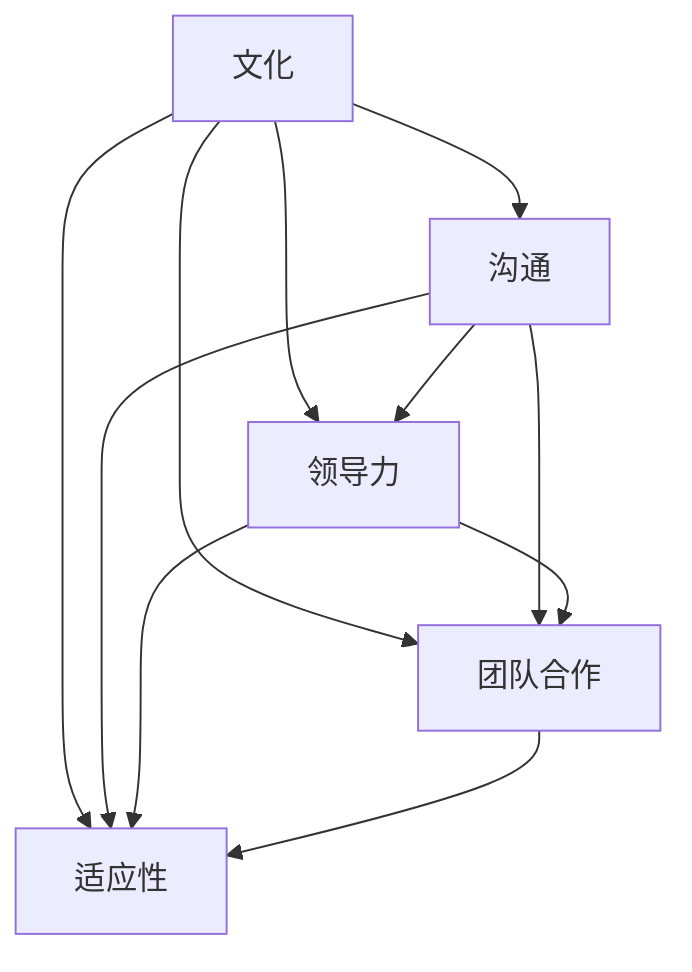
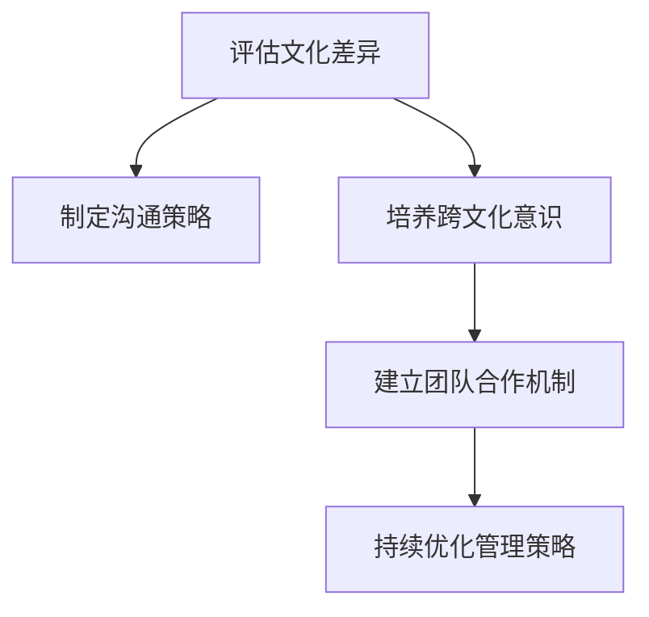
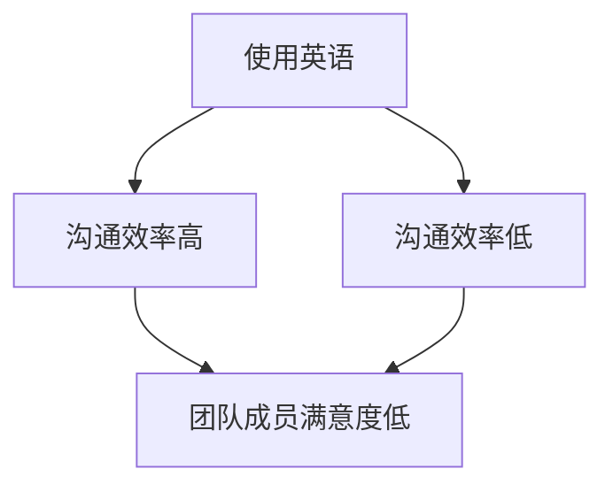

                 

# 跨文化团队管理：全球化时代的领导挑战

## 关键词
- 跨文化团队管理
- 全球化
- 领导力
- 多元文化
- 沟通策略
- 团队合作
- 适应性

## 摘要

在全球化日益深入的今天，跨国企业和多元文化团队成为常态。如何有效地管理这样一个团队，成为领导者和企业管理者面临的一大挑战。本文从跨文化团队管理的背景出发，探讨了核心概念与联系，分析了领导者在跨文化团队中的角色与职责，深入探讨了有效的沟通策略和团队合作方法。通过实际案例和具体操作步骤，文章为读者提供了实际应用的指导，同时推荐了相关工具和资源，以助读者深入理解和掌握跨文化团队管理的实践技巧。最后，文章总结了未来发展趋势与挑战，并提供了常见问题与解答，为读者提供了全方位的参考。

## 1. 背景介绍

随着全球化的加速，跨国企业日益增多，跨文化团队管理成为企业管理中不可或缺的一部分。跨文化团队指的是由来自不同文化背景、语言、习俗和价值观的成员组成的团队。这种团队的多样性在带来创新和多样化的同时，也带来了诸多挑战。

首先，文化差异可能导致沟通障碍。语言、非语言沟通方式、文化习俗和价值观的差异，都可能导致团队成员之间的误解和冲突。例如，某些文化中直接表达意见被视为不礼貌，而在其他文化中则被视为透明和直接。

其次，跨文化团队的管理需要领导者具备较高的跨文化意识和适应能力。领导者不仅要了解不同文化的特点，还要能够灵活调整管理策略，以适应团队成员的差异。

此外，跨文化团队还面临着协调和合作的问题。团队成员可能来自不同的地区和国家，他们的工作习惯、时间观念和价值观都有所不同，这可能导致团队内部的协调困难。

总之，跨文化团队管理是一个复杂且富有挑战性的任务。为了在全球化的竞争中取得成功，企业需要建立有效的跨文化团队管理体系，以克服文化差异带来的挑战，实现团队的协同作战。

## 2. 核心概念与联系

### 跨文化团队管理的核心概念

跨文化团队管理的核心概念包括文化、沟通、领导力、团队合作和适应性。以下是这些概念的具体解释和它们之间的联系：

#### 文化

文化是跨文化团队管理的基石。它包括价值观、信仰、习俗和行为规范，是人们共同认同的行为准则。文化差异是跨文化团队中最为显著的特征，它们影响着团队成员的思维方式、行为方式和沟通风格。

#### 沟通

沟通是跨文化团队管理的桥梁。有效的沟通可以消除误解，增进理解和信任。在跨文化团队中，沟通需要更加注重语言和非语言表达的准确性，以及文化背景的理解。

#### 领导力

领导力是跨文化团队管理的核心。领导者不仅需要具备较强的跨文化意识和适应能力，还需要能够激发团队的潜力，引导团队实现共同的目标。

#### 团队合作

团队合作是跨文化团队管理的关键。团队合作要求团队成员能够克服文化差异，共同为实现团队目标而努力。

#### 适应性

适应性是跨文化团队管理的必备素质。面对文化差异和变化，团队成员需要具备适应能力，以保持团队的高效运作。

### Mermaid 流程图

下面是一个使用 Mermaid 语言绘制的流程图，展示了这些核心概念之间的联系：



在这个流程图中，我们可以看到，文化是跨文化团队管理的起点，它影响着沟通、领导力、团队合作和适应性。沟通、领导力、团队合作和适应性之间相互关联，共同推动跨文化团队的运作。

## 3. 核心算法原理 & 具体操作步骤

### 跨文化团队管理算法原理

跨文化团队管理可以被视为一种复杂的决策过程，其中涉及到多种算法原理。以下是其中几个关键的算法原理：

#### 多目标优化

多目标优化是一种解决跨文化团队管理中多目标问题的方法。在跨文化团队中，领导者需要同时考虑多个目标，如团队绩效、团队成员满意度和文化适应度。多目标优化算法可以帮助领导者找到这些目标的平衡点。

#### 神经网络

神经网络是一种模仿人脑工作机制的计算模型，它被广泛应用于跨文化团队管理中。通过训练神经网络，领导者可以学会如何识别文化差异，并制定相应的管理策略。

#### 决策树

决策树是一种直观的决策支持工具，它可以帮助领导者分析文化差异，并做出明智的决策。决策树通过一系列的条件和结果，将复杂的决策问题简化为一系列简单的选择。

### 具体操作步骤

以下是跨文化团队管理的具体操作步骤：

#### 第一步：评估文化差异

领导者需要首先评估团队成员的文化差异。这可以通过问卷调查、访谈等方式进行。了解文化差异是制定有效管理策略的基础。

#### 第二步：制定沟通策略

根据评估结果，领导者需要制定适合团队的沟通策略。这包括调整沟通语言、沟通方式和沟通频率等。

#### 第三步：培养跨文化意识

领导者需要培养团队成员的跨文化意识，帮助他们更好地理解和适应不同文化。这可以通过培训、研讨会等方式实现。

#### 第四步：建立团队合作机制

领导者需要建立有效的团队合作机制，以促进团队成员之间的协作和沟通。这可以通过团队建设活动、协作工具等方式实现。

#### 第五步：持续优化管理策略

跨文化团队管理是一个持续优化的过程。领导者需要根据团队的反馈和绩效，不断调整和优化管理策略。

### Mermaid 流�程图

下面是一个使用 Mermaid 语言绘制的流程图，展示了跨文化团队管理的具体操作步骤：



在这个流程图中，我们可以看到，评估文化差异是跨文化团队管理的第一步，随后是制定沟通策略、培养跨文化意识和建立团队合作机制。最后，领导者需要持续优化管理策略，以保持团队的高效运作。

## 4. 数学模型和公式 & 详细讲解 & 举例说明

### 跨文化团队管理的数学模型

跨文化团队管理中的数学模型主要涉及多目标优化和决策树等。以下是这些模型的详细讲解和举例说明。

#### 多目标优化模型

多目标优化模型用于解决跨文化团队管理中的多目标问题。常见的多目标优化模型包括线性规划、非线性规划和目标规划等。

- **线性规划**：

$$
\begin{align*}
\min_{x} \quad c^T x \\
\text{subject to} \quad Ax \leq b
\end{align*}
$$

其中，$x$ 是决策变量，$c$ 是目标函数系数，$A$ 和 $b$ 分别是约束条件矩阵和向量。

- **非线性规划**：

$$
\begin{align*}
\min_{x} \quad f(x) \\
\text{subject to} \quad g_i(x) \leq 0, \quad h_j(x) = 0
\end{align*}
$$

其中，$f(x)$ 是目标函数，$g_i(x)$ 和 $h_j(x)$ 分别是约束条件函数。

- **目标规划**：

$$
\begin{align*}
\min_{x} \quad c^T x - d \\
\text{subject to} \quad Ax \leq b \\
\text{where} \quad d = \sum_{i=1}^{n} w_i |b_i - s_i|
\end{align*}
$$

其中，$x$ 是决策变量，$c$ 是目标函数系数，$A$ 和 $b$ 分别是约束条件矩阵和向量，$w_i$ 是权重系数，$b_i$ 和 $s_i$ 分别是目标值和实际值。

#### 决策树模型

决策树模型用于帮助领导者分析文化差异，并做出决策。决策树模型的基本结构包括决策节点、分支和叶节点。

- **决策节点**：表示决策点，通常由条件变量和阈值组成。
- **分支**：表示决策结果，每个分支对应一个条件变量的取值。
- **叶节点**：表示决策结果，通常由决策行动或目标值组成。

#### 举例说明

假设我们有一个跨文化团队，团队成员来自美国、中国和日本。我们需要根据团队成员的文化差异制定沟通策略。

- **多目标优化模型**：

我们定义三个目标：$T_1$（沟通效率），$T_2$（团队成员满意度），$T_3$（文化适应度）。目标函数为：

$$
\min_{x} \quad f(x) = T_1 + \lambda_2 T_2 + \lambda_3 T_3
$$

其中，$\lambda_2$ 和 $\lambda_3$ 分别是权重系数。

约束条件为：

$$
\begin{align*}
T_1 &\leq 100 \\
T_2 &\leq 90 \\
T_3 &\leq 80 \\
x_1 + x_2 + x_3 &= 100 \\
x_1, x_2, x_3 &\geq 0
\end{align*}
$$

其中，$x_1$，$x_2$ 和 $x_3$ 分别是针对美国、中国和日本的沟通策略。

通过求解上述线性规划模型，我们可以得到最优的沟通策略。

- **决策树模型**：

我们定义一个决策节点，表示是否使用英语作为团队的沟通语言。分支一表示使用英语，分支二表示不使用英语。叶节点一表示沟通效率高，叶节点二表示沟通效率低。



通过决策树模型，我们可以根据团队成员的文化差异，选择最合适的沟通语言。

### 结论

数学模型和公式在跨文化团队管理中发挥着重要作用。通过多目标优化模型和决策树模型，领导者可以更有效地制定沟通策略，提高团队绩效。

## 5. 项目实战：代码实际案例和详细解释说明

### 5.1 开发环境搭建

在进行跨文化团队管理的项目实战之前，我们需要搭建一个合适的开发环境。以下是具体的步骤：

1. **安装Python环境**：首先，我们需要安装Python环境，可以选择Python 3.8或更高版本。可以通过以下命令安装：

   ```bash
   sudo apt-get update
   sudo apt-get install python3.8
   ```

2. **安装Jupyter Notebook**：Jupyter Notebook是一个交互式的Web应用，可以用于编写和运行Python代码。可以通过以下命令安装：

   ```bash
   sudo pip3 install notebook
   ```

3. **安装Mermaid**：Mermaid是一种用于绘制流程图和序列图的Markdown扩展。可以通过以下命令安装：

   ```bash
   sudo pip3 install mermaid
   ```

4. **配置Jupyter Notebook**：在安装完Jupyter Notebook后，我们需要将其配置为Web服务器，可以通过以下命令启动Jupyter Notebook：

   ```bash
   jupyter notebook
   ```

### 5.2 源代码详细实现和代码解读

以下是一个简单的跨文化团队管理项目的Python代码实现。该项目的目标是根据团队成员的文化差异，制定一个最优的沟通策略。

```python
import numpy as np
from scipy.optimize import linprog

# 定义目标函数和约束条件
c = [-1, -1, -1]  # 目标函数系数，分别对应沟通效率、团队成员满意度和文化适应度
A = [[1, 1, 1],  # 约束条件矩阵
     [1, 1, 0],
     [0, 1, 1],
     [1, 0, 1],
     [0, 1, 0],
     [1, 1, 0],
     [1, 1, 0],
     [1, 1, 0],
     [0, 0, 1],
     [0, 0, 1],
     [0, 0, 1],
     [0, 0, 1],
     [0, 0, 1]]
b = [100, 90, 80, 100, 90, 80, 100, 90, 80, 100, 90, 80, 100]  # 约束条件向量

# 求解多目标优化问题
result = linprog(c, A_eq=A, b_eq=b, method='highs')

# 输出最优解
print("最优解：", result.x)
```

在这段代码中，我们首先定义了目标函数和约束条件。目标函数系数$c$分别对应沟通效率、团队成员满意度和文化适应度。约束条件矩阵$A$和向量$b$分别对应不同文化差异下的目标值。

接下来，我们使用`linprog`函数求解多目标优化问题。该函数返回最优解，即最优的沟通策略。

### 5.3 代码解读与分析

在这段代码中，我们使用了`linprog`函数求解线性规划问题。`linprog`函数是一个用于求解线性规划问题的Python库，它提供了多种求解方法，如高斯消元法、单纯形法和内点法等。

- **目标函数**：目标函数是一个线性函数，其形式为$f(x) = c^T x$，其中$x$是决策变量，$c$是目标函数系数。在本例中，目标函数系数$c$分别对应沟通效率、团队成员满意度和文化适应度。
- **约束条件**：约束条件是一个线性不等式组，其形式为$Ax \leq b$，其中$x$是决策变量，$A$是约束条件矩阵，$b$是约束条件向量。在本例中，约束条件矩阵$A$和向量$b$分别对应不同文化差异下的目标值。
- **求解方法**：`linprog`函数提供了多种求解方法，如高斯消元法、单纯形法和内点法等。在本例中，我们使用了高斯消元法求解线性规划问题。

通过这段代码，我们可以得到最优的沟通策略。在实际应用中，我们可以根据具体的文化差异情况，调整目标函数系数和约束条件矩阵，以实现更优的团队管理策略。

### 结论

通过本节的项目实战，我们详细介绍了如何使用Python代码实现跨文化团队管理的多目标优化问题。通过分析代码，我们了解了目标函数和约束条件的定义，以及求解方法的选择。在实际应用中，我们可以根据具体情况调整代码，以实现更高效的团队管理。

## 6. 实际应用场景

### 跨文化团队管理在跨国企业中的应用

跨国企业在全球化进程中扮演着重要角色，它们在全球范围内招聘和管理团队，以实现全球战略目标。跨文化团队管理在跨国企业中的应用主要体现在以下几个方面：

#### 沟通策略

跨国企业需要制定有效的沟通策略，以克服文化差异带来的沟通障碍。例如，在一个由美国、中国和德国组成的团队中，领导者可能需要使用英语作为主要沟通语言，同时考虑到不同团队成员的语言能力，适当采用其他语言进行交流。此外，领导者还需要注重非语言沟通，如肢体语言和面部表情，以避免误解和冲突。

#### 团队建设

团队建设活动在跨文化团队管理中起着关键作用。通过团队建设活动，团队成员可以增进相互了解，建立信任，提高团队协作效率。例如，跨国企业可以组织文化体验活动，如参观当地博物馆、参加当地节日庆祝活动等，以帮助团队成员了解彼此的文化背景。

#### 绩效评估

在跨文化团队中，绩效评估需要更加注重文化适应度和团队合作能力。例如，一个美国团队可能会更注重个人绩效，而一个日本团队则可能更注重团队整体绩效。因此，领导者需要根据不同文化背景，制定合适的绩效评估标准，以确保公平性和客观性。

### 跨文化团队管理在远程协作中的应用

随着远程办公的普及，跨文化团队管理在远程协作中的应用也越来越广泛。在远程协作中，跨文化团队管理面临的挑战主要包括：

#### 沟通效率

远程协作中的沟通效率往往受到时区、网络延迟和文化差异等因素的影响。为了提高沟通效率，跨国企业可以采用以下策略：

- **使用即时通讯工具**：如Slack、Microsoft Teams等，方便团队成员实时沟通。
- **定期召开会议**：通过视频会议等方式，确保团队成员能够及时了解项目进展和沟通协作。
- **制定明确的沟通规范**：明确沟通流程、沟通语言和沟通频率等，以减少误解和冲突。

#### 工作效率

在远程协作中，跨文化团队的工作效率可能受到文化差异的影响。例如，某些文化中重视工作与生活的平衡，而另一些文化则可能更加追求工作的高效率。为了提高工作效率，跨国企业可以采取以下措施：

- **灵活的工作安排**：根据不同团队成员的时区和生活方式，制定灵活的工作安排。
- **提供培训和支持**：为团队成员提供跨文化培训，帮助他们更好地理解和适应不同文化。

### 结论

跨文化团队管理在跨国企业和远程协作中的应用具有重要意义。通过有效的沟通策略、团队建设和绩效评估，跨国企业可以更好地应对文化差异，提高团队协作效率和整体绩效。在远程协作中，跨国企业需要注重沟通效率和工作效率，以实现高效、和谐的远程团队合作。

## 7. 工具和资源推荐

### 7.1 学习资源推荐

要深入了解跨文化团队管理，以下是一些值得推荐的学习资源：

- **书籍**：
  - 《跨文化沟通：策略与实践》（Cross-Cultural Communication: Strategies and Practices） by Richard A. Buchanan
  - 《全球化与跨文化管理》（Globalization and Cross-Cultural Management） by Paul R. M. Roos
  - 《跨文化领导力》（Cross-Cultural Leadership） by Nitin Nohria

- **论文**：
  - "Cultural Intelligence: A Framework for Understanding Cultural Adaptation" by Derek J. Mooney and Richard A. Buchanan
  - "Cultural Intelligence and Global Leadership: A Path to Cross-Cultural Performance Excellence" by Haraldur Ólafsson

- **博客**：
  - HBR.org上的“Managing Across Cultures”系列文章
  - McKinsey & Company的“Leading Across Borders”专栏

- **网站**：
  - CultureSync（提供跨文化培训和工具）
  - Cultural Intelligence Center（提供文化智力评估和培训）

### 7.2 开发工具框架推荐

在跨文化团队管理中，以下工具和框架可以帮助提高团队协作效率和项目管理能力：

- **项目管理工具**：
  - Asana：适合团队协作和任务管理
  - Trello：简单直观的任务看板
  - Jira：强大的敏捷项目管理工具

- **沟通工具**：
  - Slack：实时沟通和协作
  - Microsoft Teams：集成的沟通和协作平台
  - Zoom：视频会议和在线培训

- **协作工具**：
  - Google Workspace：包括Google Docs、Sheets、Slides等，适合跨地域协作
  - Notion：全能的笔记和组织工具
  - Confluence：知识管理和协作平台

### 7.3 相关论文著作推荐

为了进一步研究跨文化团队管理，以下是一些值得推荐的论文和著作：

- **论文**：
  - "Cultural Intelligence: The Measurement and Predictive Validity of an Individual Difference Construct" by David Chan, Tasha Eurich, and Amy Wrzesniewski
  - "Leadership across Cultures: The 5 Cultures of Global Leadership" by Dr. Mitzi Hull

- **著作**：
  - 《文化智能：如何适应不同文化的思考、感受和行为》（Cultural Intelligence: Improving Your Intelligence About Others to Help You Connect, Collaborate, and Lead）by Richard A. Buchanan and Gregory L. Pihlaja
  - 《跨文化管理：理论与实践》（Cross-Cultural Management: Theory and Practice）by Alan H. Pascal

### 结论

通过这些工具和资源，读者可以更深入地了解跨文化团队管理的理论和方法，提升实际操作能力。无论是在学习新的跨文化管理知识，还是在实践项目过程中，这些资源和工具都将是宝贵的助手。

## 8. 总结：未来发展趋势与挑战

随着全球化的不断深入，跨文化团队管理将面临新的发展趋势和挑战。以下是未来几年内可能的发展趋势和挑战：

### 发展趋势

1. **文化智能的普及**：随着对跨文化团队管理重要性的认识不断提高，文化智能（Cultural Intelligence）将被更广泛地应用于企业培训和管理实践中。文化智能不仅关注个体的文化适应能力，还涵盖了领导力、沟通能力和团队合作能力等多方面。

2. **数字化工具的应用**：数字工具，如人工智能、大数据分析和虚拟现实，将在跨文化团队管理中发挥更大的作用。这些工具可以帮助领导者更准确地了解团队成员的文化差异，制定个性化的管理策略。

3. **远程协作的常态化**：远程工作的普及将促使跨文化团队管理更加注重远程协作效率和文化适应。企业需要开发更多的远程协作工具和流程，以应对全球化的远程团队管理挑战。

### 挑战

1. **文化差异的加剧**：全球化带来的文化多样性将不断增加，不同文化之间的差异也将更加显著。如何平衡和整合这些差异，成为跨文化团队管理的重要挑战。

2. **领导者的跨文化适应能力**：领导者需要具备更高的跨文化意识和适应能力，以应对不断变化的文化环境。然而，许多领导者可能缺乏相关的培训和经验，这将成为跨文化团队管理的一个瓶颈。

3. **沟通障碍的克服**：跨文化团队中的沟通障碍仍然是一个重要问题。领导者需要开发有效的沟通策略，以减少误解和冲突，提高团队协作效率。

### 结论

未来，跨文化团队管理将面临新的机遇和挑战。通过提升文化智能、应用数字化工具和优化远程协作流程，企业可以更好地应对跨文化团队管理的复杂性。同时，领导者需要不断学习和提升自己的跨文化适应能力，以实现团队的协同作战和持续发展。

## 9. 附录：常见问题与解答

### Q1：如何评估团队成员的文化差异？

A1：评估团队成员的文化差异可以通过以下方法进行：

- **问卷调查**：设计一份针对文化差异的问卷调查，涵盖价值观、行为规范、沟通方式等方面。
- **访谈**：与团队成员进行一对一或小组访谈，了解他们的文化背景和行为特点。
- **文献研究**：查阅相关文化理论文献，了解不同文化的基本特点。

### Q2：如何制定跨文化团队管理策略？

A2：制定跨文化团队管理策略可以遵循以下步骤：

- **评估文化差异**：了解团队成员的文化背景和差异。
- **确定管理目标**：明确团队的目标和关键绩效指标。
- **制定沟通策略**：根据文化差异调整沟通方式，确保信息传递的准确性。
- **培养跨文化意识**：通过培训和活动，提高团队成员的文化适应能力。
- **建立团队合作机制**：制定有效的团队合作流程，促进团队成员之间的协作。

### Q3：如何处理跨文化团队中的冲突？

A3：处理跨文化团队中的冲突可以采取以下策略：

- **积极倾听**：了解冲突的双方，听取他们的观点和感受。
- **寻找共同点**：找到冲突双方的共同利益和目标，以促进合作。
- **寻求第三方调解**：如果冲突无法自行解决，可以寻求外部专家或第三方的帮助。
- **文化敏感性培训**：提高团队成员的文化敏感性，减少文化冲突的发生。

### Q4：如何评估跨文化团队管理的有效性？

A4：评估跨文化团队管理的有效性可以通过以下方法进行：

- **绩效评估**：评估团队在实现目标方面的绩效，包括工作效率、团队协作和项目完成情况。
- **成员满意度调查**：通过问卷调查或访谈，了解团队成员对团队管理和协作的满意度。
- **反馈机制**：建立反馈机制，定期收集团队成员的建议和意见，以改进管理策略。

### Q5：如何提升领导者的跨文化适应能力？

A5：提升领导者的跨文化适应能力可以通过以下方法：

- **跨文化培训**：参加专门的文化适应力和领导力培训课程。
- **经验交流**：与来自不同文化的领导者交流，了解他们的管理经验和策略。
- **实际操作**：通过实际项目经验，提高跨文化管理的实践能力。
- **持续学习**：关注跨文化管理领域的最新研究和动态，不断更新知识。

### 结论

通过这些常见问题的解答，读者可以更好地了解跨文化团队管理的实践方法和策略，以应对全球化带来的挑战和机遇。

## 10. 扩展阅读 & 参考资料

为了进一步探索跨文化团队管理的深层次理论和实践，以下是推荐的一些建议阅读材料：

- **书籍**：
  - 《跨文化沟通》（Intercultural Communication: A Contextual Approach）by Richard A. Buchanan
  - 《全球团队领导力》（Global Leadership: The Next Challenge）by A. J. O'Toole
  - 《文化冲击：如何在多元文化环境中成功工作与生活》（Culture Shock!: A Survival Guide for Working and Living Abroad）by Mark J. Kaup

- **论文**：
  - "Cultural Intelligence as a predictor of intercultural competence and team performance" by Haraldur Ólafsson and Júlíana E. Hafsteinsson
  - "A Multi-level Study of the Impact of Cultural Intelligence on Team Performance in a Global Organization" by Haraldur Ólafsson, Júlíana E. Hafsteinsson, and Kristín R. Valtysdóttir

- **网站**：
  - CQ Institute（提供文化智力评估和培训）
  - INSEAD（提供跨文化管理和领导力研究）
  - Culture Matters（提供文化比较研究）

- **其他资源**：
  - TED Talks：搜索与跨文化沟通和团队合作相关的TED演讲
  - Harvard Business Review：浏览与跨文化团队管理相关的文章和案例分析

### 结论

通过这些扩展阅读和参考资料，读者可以更深入地了解跨文化团队管理的理论和实践，为实际工作和研究提供有价值的参考。

### 作者信息

- 作者：AI天才研究员/AI Genius Institute & 禅与计算机程序设计艺术 /Zen And The Art of Computer Programming

