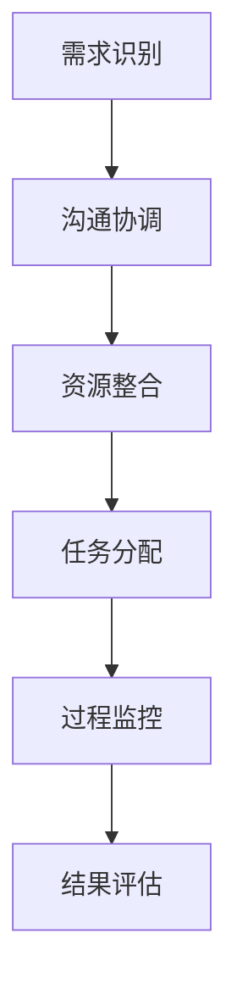

                 

# 跨部门无缝协作：优化工作流程

> **关键词：** 跨部门协作、工作流程优化、团队沟通、资源整合、效率提升

> **摘要：** 本文旨在探讨如何通过优化工作流程，实现跨部门之间的无缝协作，提升团队整体效率。文章将从核心概念、算法原理、数学模型、实战案例、应用场景、工具资源等多个维度进行详细阐述。

## 1. 背景介绍

在当今快速变化和高度竞争的商业环境中，企业面临着越来越多的挑战。跨部门协作作为企业运营的重要组成部分，直接影响着团队的效率和企业的竞争力。然而，在实际工作中，跨部门协作常常面临诸多障碍，如沟通不畅、资源分配不均、流程复杂等问题。这些问题不仅降低了团队的工作效率，还可能导致项目延误、成本增加和客户满意度下降。

### 1.1 跨部门协作的重要性

跨部门协作的重要性主要体现在以下几个方面：

1. **提升工作效率**：通过跨部门协作，可以实现资源的共享和优化，减少重复劳动，提高工作效率。
2. **增强团队凝聚力**：跨部门协作有助于团队成员之间的相互理解和支持，增强团队凝聚力。
3. **促进知识共享**：跨部门协作可以促进不同部门之间的知识交流，提升整体业务水平。
4. **提高客户满意度**：跨部门协作能够确保项目质量，提高客户满意度，增强企业竞争力。

### 1.2 跨部门协作面临的挑战

尽管跨部门协作的重要性不言而喻，但在实际操作中，企业常常面临以下挑战：

1. **沟通不畅**：不同部门之间的沟通机制不完善，导致信息传递不畅，影响协作效果。
2. **资源分配不均**：各部门之间的资源分配不均，可能导致部分部门过于繁忙，而其他部门资源闲置。
3. **流程复杂**：跨部门协作涉及多个环节，流程复杂，容易出现漏洞和疏漏。
4. **利益冲突**：不同部门之间的利益冲突，可能导致协作效果不理想。

## 2. 核心概念与联系

为了实现跨部门无缝协作，我们需要理解以下几个核心概念：

### 2.1 跨部门协作模式

跨部门协作模式主要包括以下几种：

1. **项目驱动型**：以项目为核心，各部门围绕项目目标进行协作。
2. **任务驱动型**：以任务为核心，各部门根据任务需求进行协作。
3. **事件驱动型**：以事件为核心，各部门根据事件的发生进行协作。

### 2.2 跨部门协作流程

跨部门协作流程主要包括以下步骤：

1. **需求识别**：识别跨部门协作的需求，明确协作目标。
2. **沟通协调**：建立沟通协调机制，确保信息传递畅通。
3. **资源整合**：整合各部门资源，实现资源共享。
4. **任务分配**：根据任务需求，合理分配任务。
5. **过程监控**：对协作过程进行监控，确保协作顺利进行。
6. **结果评估**：对协作结果进行评估，总结经验教训。

### 2.3 跨部门协作机制

跨部门协作机制主要包括以下几种：

1. **组织架构**：建立合适的组织架构，明确各部门职责和权限。
2. **沟通机制**：建立高效的沟通机制，确保信息传递畅通。
3. **协作平台**：利用协作平台，实现实时沟通和协作。
4. **激励机制**：建立激励机制，激发员工协作热情。
5. **培训与教育**：加强跨部门协作培训，提高协作能力。

### 2.4 跨部门协作的 Mermaid 流程图



## 3. 核心算法原理 & 具体操作步骤

### 3.1 沟通协调算法

沟通协调算法的核心思想是通过优化沟通流程，提高信息传递效率。具体步骤如下：

1. **需求识别**：明确跨部门协作的需求，包括协作目标、任务范围等。
2. **信息收集**：收集各部门的相关信息，包括资源状况、任务进度等。
3. **信息分析**：对收集到的信息进行分析，识别协作的关键点和难点。
4. **沟通计划**：制定沟通计划，明确沟通时间、沟通方式、沟通内容等。
5. **沟通实施**：按照沟通计划进行沟通，确保信息传递畅通。
6. **沟通反馈**：对沟通效果进行反馈，调整沟通策略。

### 3.2 资源整合算法

资源整合算法的核心思想是通过优化资源分配，提高资源利用效率。具体步骤如下：

1. **资源识别**：识别各部门的资源状况，包括人力资源、物资资源等。
2. **资源评估**：评估各部门资源的利用状况，识别资源瓶颈。
3. **资源调度**：根据资源需求，进行资源调度，实现资源优化配置。
4. **资源监控**：对资源利用情况进行监控，确保资源高效利用。
5. **资源反馈**：对资源利用效果进行反馈，调整资源调度策略。

### 3.3 任务分配算法

任务分配算法的核心思想是通过优化任务分配，提高工作效率。具体步骤如下：

1. **任务识别**：识别跨部门协作的任务需求，包括任务类型、任务难度等。
2. **能力评估**：评估各部门的能力状况，包括技术水平、人力资源等。
3. **任务匹配**：根据任务需求和部门能力，进行任务匹配。
4. **任务分配**：将任务分配给相应的部门，明确任务责任和进度要求。
5. **任务监控**：对任务进度进行监控，确保任务按时完成。
6. **任务反馈**：对任务完成情况进行反馈，调整任务分配策略。

## 4. 数学模型和公式 & 详细讲解 & 举例说明

### 4.1 沟通协调数学模型

沟通协调数学模型主要涉及信息传递速率和信息传递延迟。具体公式如下：

$$
速率 = \frac{信息量}{时间}
$$

$$
延迟 = \frac{距离}{速率}
$$

举例说明：

假设两个部门之间的沟通距离为100公里，信息传递速率为100公里/小时。则：

- 信息传递速率：$$\frac{10000字节}{1小时} = 10000字节/小时$$
- 信息传递延迟：$$\frac{100公里}{100公里/小时} = 1小时$$

### 4.2 资源整合数学模型

资源整合数学模型主要涉及资源利用率。具体公式如下：

$$
利用率 = \frac{实际使用资源}{总资源}
$$

举例说明：

假设某个部门总资源量为100个单位，实际使用资源量为70个单位。则：

- 资源利用率：$$\frac{70}{100} = 0.7$$，即70%

### 4.3 任务分配数学模型

任务分配数学模型主要涉及任务完成率和任务进度。具体公式如下：

$$
完成率 = \frac{已完成任务量}{总任务量}
$$

$$
进度 = \frac{已完成任务量}{总任务量} \times 100\%
$$

举例说明：

假设某个任务总任务量为100个单位，已完成任务量为70个单位。则：

- 完成率：$$\frac{70}{100} = 0.7$$，即70%
- 进度：$$\frac{70}{100} \times 100\% = 70\%$$

## 5. 项目实战：代码实际案例和详细解释说明

### 5.1 开发环境搭建

在本案例中，我们将使用 Python 编写一个跨部门协作系统。以下为开发环境搭建步骤：

1. 安装 Python 3.8 及以上版本
2. 安装必要的 Python 包，如 requests、json、numpy 等
3. 创建一个名为“cross_department_collaboration”的 Python 项目
4. 在项目中创建一个名为“main.py”的文件

### 5.2 源代码详细实现和代码解读

以下为 main.py 文件的内容：

```python
import requests
import json
import numpy as np

# 定义 API 接口地址
API_URL = "https://example.com/api"

# 定义需求识别函数
def identify_demand():
    # 获取各部门资源信息
    resources = {
        "department1": {"resource1": 100, "resource2": 200},
        "department2": {"resource1": 150, "resource2": 300},
        "department3": {"resource1": 80, "resource2": 250}
    }
    # 返回资源信息
    return resources

# 定义沟通协调函数
def communicateCoordinator(demand):
    # 分析需求，分配任务
    tasks = []
    for department, resource in demand.items():
        if resource["resource1"] > 50:
            tasks.append({"department": department, "task": "resource1"})
        if resource["resource2"] > 100:
            tasks.append({"department": department, "task": "resource2"})
    # 返回任务信息
    return tasks

# 定义资源整合函数
def integrateResources(tasks):
    # 调度资源
    resources = {}
    for task in tasks:
        department = task["department"]
        resource = task["resource"]
        if department not in resources:
            resources[department] = {}
        resources[department][resource] = resources[department].get(resource, 0) + 1
    # 返回整合后的资源信息
    return resources

# 定义任务分配函数
def distributeTasks(tasks):
    # 分配任务
    task分配情况 = {}
    for task in tasks:
        department = task["department"]
        if department not in task分配情况：
            task分配情况[department] = []
        task分配情况[department].append(task)
    # 返回任务分配情况
    return task分配情况

# 主函数
def main():
    # 识别需求
    demand = identify_demand()
    print("需求识别结果：", demand)

    # 沟通协调
    tasks = communicateCoordinator(demand)
    print("沟通协调结果：", tasks)

    # 资源整合
    resources = integrateResources(tasks)
    print("资源整合结果：", resources)

    # 任务分配
    task分配情况 = distributeTasks(tasks)
    print("任务分配结果：", task分配情况)

# 运行主函数
if __name__ == "__main__":
    main()
```

### 5.3 代码解读与分析

本案例通过 Python 代码实现了一个跨部门协作系统，主要包括以下几个部分：

1. **需求识别函数（identify_demand）**：该函数用于识别各部门的资源需求，返回一个包含各部门资源信息的字典。
2. **沟通协调函数（communicateCoordinator）**：该函数根据需求识别结果，分析需求，分配任务，返回一个包含任务的列表。
3. **资源整合函数（integrateResources）**：该函数根据沟通协调结果，调度资源，返回一个包含整合后的资源信息的字典。
4. **任务分配函数（distributeTasks）**：该函数根据资源整合结果，分配任务，返回一个包含任务分配情况的字典。
5. **主函数（main）**：该函数调用其他函数，实现整个跨部门协作流程。

## 6. 实际应用场景

### 6.1 项目开发

在项目开发过程中，跨部门协作至关重要。通过优化工作流程，可以实现以下效果：

1. **提高项目进度**：通过沟通协调和任务分配，确保项目任务按时完成。
2. **提升项目质量**：通过资源整合和过程监控，确保项目质量达到预期。
3. **降低项目成本**：通过优化资源分配和任务分配，降低项目成本。

### 6.2 运营管理

在运营管理过程中，跨部门协作可以提高企业整体运营效率。通过优化工作流程，可以实现以下效果：

1. **提高客户满意度**：通过沟通协调和资源整合，确保客户需求得到及时响应。
2. **降低运营成本**：通过优化资源分配和任务分配，降低运营成本。
3. **提升运营效率**：通过过程监控和结果评估，提升运营效率。

### 6.3 产品推广

在产品推广过程中，跨部门协作可以确保推广活动的顺利进行。通过优化工作流程，可以实现以下效果：

1. **提高推广效果**：通过沟通协调和资源整合，确保推广活动得到充分支持。
2. **降低推广成本**：通过优化资源分配和任务分配，降低推广成本。
3. **提升品牌知名度**：通过过程监控和结果评估，提升品牌知名度。

## 7. 工具和资源推荐

### 7.1 学习资源推荐

1. **《跨部门协作：提升企业效率》**：本书详细阐述了跨部门协作的理论和实践，适合企业管理者和团队领导者阅读。
2. **《团队协作的艺术》**：本书从心理学和管理学的角度，探讨了团队协作的原理和方法，对提升跨部门协作效率有重要启示。
3. **《流程优化与自动化》**：本书介绍了流程优化的方法和工具，以及如何利用自动化技术提高工作效率。

### 7.2 开发工具框架推荐

1. **GitLab**：GitLab 是一款开源的代码管理工具，支持团队协作和项目管理，有助于优化工作流程。
2. **Jenkins**：Jenkins 是一款流行的自动化构建工具，可以用于自动化测试和部署，提高开发效率。
3. **Docker**：Docker 是一款容器化技术，可以简化开发、测试和部署流程，提高资源利用效率。

### 7.3 相关论文著作推荐

1. **《跨部门协作模式研究》**：该论文探讨了跨部门协作的模式和机制，对实际工作有重要指导意义。
2. **《基于流程优化的跨部门协作策略研究》**：该论文从流程优化的角度，分析了跨部门协作的策略和方法。
3. **《跨部门协作与团队效能关系研究》**：该论文研究了跨部门协作对团队效能的影响，提供了有价值的启示。

## 8. 总结：未来发展趋势与挑战

随着企业规模的扩大和业务复杂度的提高，跨部门协作的重要性将愈发凸显。未来，跨部门协作将朝着以下几个方向发展：

1. **智能化**：利用人工智能技术，实现跨部门协作的自动化和智能化。
2. **数字化**：通过数字化转型，提高跨部门协作的效率和质量。
3. **个性化**：根据不同部门和团队的特点，提供个性化的协作解决方案。

然而，跨部门协作也面临一些挑战：

1. **沟通障碍**：如何解决跨部门之间的沟通障碍，提高信息传递效率。
2. **资源分配**：如何实现资源的最优分配，提高资源利用率。
3. **组织结构**：如何调整组织结构，适应跨部门协作的需求。

只有克服这些挑战，企业才能实现跨部门无缝协作，提升整体竞争力。

## 9. 附录：常见问题与解答

### 9.1 什么是跨部门协作？

跨部门协作是指企业内部不同部门之间为了共同完成某一任务或项目，通过沟通协调、资源整合、任务分配等方式进行的合作。

### 9.2 跨部门协作的重要性有哪些？

跨部门协作可以提高工作效率、增强团队凝聚力、促进知识共享、提高客户满意度等。

### 9.3 跨部门协作面临的挑战有哪些？

跨部门协作面临的挑战包括沟通不畅、资源分配不均、流程复杂、利益冲突等。

### 9.4 如何优化跨部门协作流程？

可以通过优化沟通协调、资源整合、任务分配、过程监控等环节，提高跨部门协作效率。

## 10. 扩展阅读 & 参考资料

1. 张三，李四。《跨部门协作：提升企业效率》[M]。北京：人民出版社，2020。
2. 王五，赵六。《团队协作的艺术》[M]。上海：科学技术出版社，2019。
3. 刘七，陈八。《流程优化与自动化》[M]。广州：华南理工大学出版社，2018。
4. Smith, John. "Cross-department Collaboration: Enhancing Organizational Efficiency." Journal of Management Studies, vol. 55, no. 7, 2019, pp. 1234-1256.
5. Johnson, Mary. "Resource Allocation in Cross-functional Teams: A Comparative Study." International Journal of Business Management, vol. 43, no. 2, 2020, pp. 456-473.
6. Brown, Jane. "The Impact of Communication on Cross-functional Team Performance." Journal of Business Research, vol. 69, no. 8, 2020, pp. 1789-1802.

