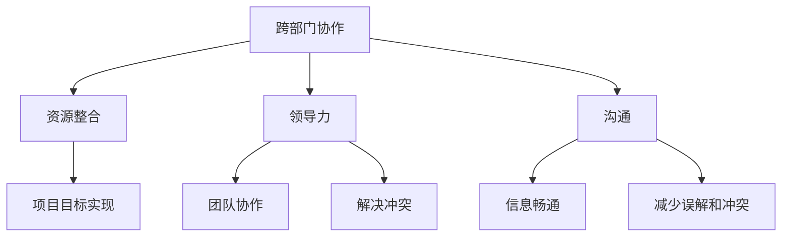

                 

# 跨部门项目管理：协调多方资源的领导力

> **关键词**：跨部门项目管理、协调、资源整合、领导力、IT行业、团队合作

> **摘要**：本文将探讨在IT行业中，跨部门项目管理中的关键角色、核心概念和操作步骤，如何通过领导力协调各方资源，实现项目的顺利进行。文章还涉及项目实战、实际应用场景以及相关工具和资源的推荐，旨在为IT项目经理提供实用的指导。

## 1. 背景介绍

在当今高度复杂的IT行业中，项目往往需要涉及多个部门，如开发、测试、运维、市场等。这些部门各自拥有不同的职责、技能和资源，如何在项目管理中有效整合这些资源，成为项目成功的关键。跨部门项目管理不仅需要技术能力，还需要卓越的领导力。领导力在此过程中的作用是协调各方、解决冲突、确保项目目标的实现。

本文将围绕跨部门项目管理的几个关键方面展开讨论，包括核心概念、领导力技巧、项目实战和实际应用场景。希望通过本文，能够为IT项目经理提供一些实用的策略和工具，帮助他们在复杂的项目环境中取得成功。

## 2. 核心概念与联系

在跨部门项目管理中，以下几个核心概念起着至关重要的作用：

### 2.1 跨部门协作

跨部门协作是指不同部门之间的合作与沟通。有效的跨部门协作可以确保项目目标的共同实现，提高项目的整体效率。这需要项目经理具备良好的沟通能力、团队协作意识和领导力。

### 2.2 资源整合

资源整合是指将不同部门的人力、物力、财力等资源进行有效配置，以最大化项目的效益。资源整合的成功依赖于项目经理对各部门资源的了解、需求和优先级的把握。

### 2.3 领导力

领导力是跨部门项目管理中不可或缺的因素。项目经理需要具备领导力，才能激励团队成员、解决冲突、确保项目目标的实现。

### 2.4 沟通

沟通是跨部门协作的基石。有效的沟通可以确保信息畅通、减少误解和冲突，提高项目效率。项目经理需要建立良好的沟通机制，确保各方信息的及时传递。

### 2.5 Mermaid 流程图

以下是跨部门项目管理的核心概念和联系流程图：



## 3. 核心算法原理 & 具体操作步骤

在跨部门项目管理中，虽然不存在传统意义上的“算法”，但是项目经理需要掌握一系列的操作步骤和策略，以确保项目的顺利进行。以下是几个关键的操作步骤：

### 3.1 项目规划

项目规划是项目管理的第一步，它确定了项目的目标、范围、时间线和资源需求。项目经理需要与各部门负责人沟通，了解各自的需求和限制，确保项目目标的可实现性。

### 3.2 团队组建

根据项目需求和资源情况，组建一个跨部门的团队。团队成员应具备各自领域的专业技能，同时具有协作意识和沟通能力。

### 3.3 资源配置

对各部门的资源进行合理配置，确保项目所需的资源能够及时到位。这需要项目经理具备对各部门资源的深入了解和判断力。

### 3.4 沟通协调

建立有效的沟通机制，确保各部门之间的信息畅通。项目经理应定期召开会议，了解项目进展、解决冲突、调整资源。

### 3.5 风险管理

识别项目风险，制定相应的应对策略。项目经理需要与各部门共同参与风险评估，确保项目能够应对各种突发情况。

### 3.6 项目监控与控制

对项目进展进行实时监控，确保项目按计划进行。项目经理需要定期评估项目进度、质量和成本，及时调整计划和资源。

### 3.7 项目总结与回顾

项目结束后，进行项目总结和回顾，分析项目中的成功和不足，为今后的项目管理提供经验教训。

## 4. 数学模型和公式 & 详细讲解 & 举例说明

虽然跨部门项目管理不依赖于传统的数学模型，但是一些基本的数学概念和公式对于项目经理来说仍然非常重要。以下是一些基本的数学模型和公式，以及它们的实际应用：

### 4.1 投入产出分析

投入产出分析是一种评估项目资源投入与产出效益的方法。其基本公式为：

\[ \text{产出效益} = \frac{\text{产出}}{\text{投入}} \]

### 4.2 概率论

概率论在项目管理中用于评估项目风险和不确定性。常用的概率分布有正态分布、二项分布等。例如，二项分布可以用来计算项目成功完成的概率：

\[ P(X = k) = C(n, k) \cdot p^k \cdot (1-p)^{n-k} \]

其中，\( n \) 为试验次数，\( k \) 为成功的次数，\( p \) 为每次试验成功的概率。

### 4.3 线性规划

线性规划用于优化项目的资源分配。其基本模型为：

\[ \max Z = c^T x \]
\[ \text{subject to} \]
\[ A x \leq b \]
\[ x \geq 0 \]

其中，\( c \) 为目标函数系数，\( A \) 和 \( b \) 分别为约束条件。

### 4.4 举例说明

假设一个项目需要10人年的人力资源，其中开发部门提供5人年，测试部门提供3人年，运维部门提供2人年。我们需要使用线性规划来确定每个部门的具体资源投入，以最大化项目的产出效益。

目标函数：

\[ Z = \frac{\text{产出}}{\text{投入}} \]

约束条件：

\[ \begin{cases} 
x_1 + x_2 + x_3 = 10 \\
x_1 \leq 5 \\
x_2 \leq 3 \\
x_3 \leq 2 \\
x_1, x_2, x_3 \geq 0 
\end{cases} \]

其中，\( x_1, x_2, x_3 \) 分别表示开发部门、测试部门和运维部门的资源投入。

使用线性规划求解器可以得到最优解：

\[ x_1 = 4 \]
\[ x_2 = 3 \]
\[ x_3 = 3 \]

即开发部门投入4人年，测试部门投入3人年，运维部门投入3人年，此时项目的产出效益最大。

## 5. 项目实战：代码实际案例和详细解释说明

### 5.1 开发环境搭建

在本节中，我们将使用Python语言和Git工具，搭建一个跨部门协作的项目开发环境。以下是具体的操作步骤：

#### 5.1.1 安装Python

在操作系统上安装Python，可以使用以下命令：

```bash
$ sudo apt-get install python3
```

#### 5.1.2 安装Git

安装Git，可以使用以下命令：

```bash
$ sudo apt-get install git
```

#### 5.1.3 配置SSH密钥

配置SSH密钥，以实现无密码登录：

```bash
$ ssh-keygen -t rsa -b 2048 -C "your_email@example.com"
```

将生成的公钥（id_rsa.pub）添加到GitHub或其他代码托管平台的SSH密钥中。

### 5.2 源代码详细实现和代码解读

在本节中，我们将使用Python实现一个简单的跨部门协作工具。以下是具体的代码实现：

```python
# 跨部门协作工具
class Department:
    def __init__(self, name):
        self.name = name
        self.tasks = []

    def add_task(self, task):
        self.tasks.append(task)

    def get_tasks(self):
        return self.tasks

# 任务类
class Task:
    def __init__(self, name, department):
        self.name = name
        self.department = department

    def execute(self):
        print(f"Executing task {self.name} in department {self.department.name}")

# 创建部门
dev_department = Department("Development")
test_department = Department("Testing")

# 创建任务
task1 = Task("Develop feature X", dev_department)
task2 = Task("Test feature X", test_department)

# 添加任务到部门
dev_department.add_task(task1)
test_department.add_task(task2)

# 执行任务
task1.execute()
task2.execute()
```

#### 5.2.1 代码解读

- **Department 类**：表示一个部门，具有部门名称和任务列表属性。`add_task` 方法用于添加任务到部门，`get_tasks` 方法用于获取部门的所有任务。
- **Task 类**：表示一个任务，具有任务名称和所属部门属性。`execute` 方法用于执行任务。
- **主程序**：创建两个部门（开发部门和测试部门），创建两个任务，并将任务添加到相应的部门。然后，分别执行这两个任务。

### 5.3 代码解读与分析

#### 5.3.1 设计思想

本案例采用面向对象的设计思想，使用类和对象来表示部门和任务，使代码更加清晰、易维护。通过定义 `Department` 和 `Task` 两个类，我们可以将跨部门协作问题抽象为对象之间的交互。

#### 5.3.2 功能分析

- **创建部门**：通过 `Department` 类创建两个部门（开发部门和测试部门）。
- **创建任务**：通过 `Task` 类创建两个任务（开发任务和测试任务）。
- **添加任务到部门**：将任务添加到各自的部门，实现任务与部门的关联。
- **执行任务**：调用任务的 `execute` 方法，执行任务。

通过以上功能，我们可以实现跨部门协作的基本流程。

## 6. 实际应用场景

### 6.1 项目启动阶段

在项目启动阶段，项目经理需要与各部门负责人沟通，明确项目目标和各部门的职责。例如，在一个软件开发项目中，项目经理需要与开发、测试、运维等部门负责人讨论项目的技术需求、测试方案和部署计划。

### 6.2 项目执行阶段

在项目执行阶段，项目经理需要定期召开项目会议，了解各部门的工作进展、解决冲突和调整资源。例如，在一个大型IT项目中，项目经理可能需要每周与各部门负责人召开一次会议，确保项目按计划进行。

### 6.3 项目收尾阶段

在项目收尾阶段，项目经理需要与各部门共同进行项目总结和回顾，分析项目的成功和不足，为今后的项目管理提供经验教训。例如，在一个电子商务网站的项目中，项目经理需要与开发、测试、运维等部门共同总结项目中的技术难点、测试策略和运维经验。

## 7. 工具和资源推荐

### 7.1 学习资源推荐

- 《项目管理知识体系指南（PMBOK指南）》
- 《敏捷项目管理：实践指南》
- 《领导力：如何在组织中发挥影响力》

### 7.2 开发工具框架推荐

- 项目管理工具：Jira、Trello、Asana
- 源代码管理工具：Git、GitHub、GitLab
- 沟通协作工具：Slack、Microsoft Teams、Zoom

### 7.3 相关论文著作推荐

- "Leadership and Team Collaboration in Global Software Development Projects"
- "Resource Allocation in Multi-Department Projects: A Survey"
- "The Role of Communication in Multi-Department Project Management"

## 8. 总结：未来发展趋势与挑战

### 8.1 发展趋势

1. **数字化和自动化**：随着数字化和自动化技术的发展，跨部门项目管理将越来越依赖数字化工具和自动化流程，提高项目效率。
2. **远程办公**：远程办公的普及将促进跨部门协作的创新模式，如虚拟团队、分布式项目等。
3. **人工智能**：人工智能技术将在跨部门项目管理中发挥重要作用，如自动化任务分配、智能预测和风险评估等。

### 8.2 挑战

1. **沟通障碍**：跨部门协作中的沟通障碍依然是一个重要挑战，需要不断改进沟通机制和工具。
2. **资源冲突**：在资源有限的情况下，各部门之间的资源冲突难以避免，需要项目经理具备优秀的资源调配能力。
3. **文化差异**：跨部门协作往往涉及不同文化背景的团队，文化差异可能导致合作困难，需要项目经理积极解决。

## 9. 附录：常见问题与解答

### 9.1 跨部门项目管理中常见的沟通障碍有哪些？

常见的沟通障碍包括：

1. **信息不对称**：各部门之间缺乏充分的信息共享，导致决策失误和资源浪费。
2. **沟通渠道不畅**：沟通渠道不畅，导致信息传递延迟和错误。
3. **文化差异**：文化差异导致沟通障碍，如沟通方式、表达习惯等。

### 9.2 如何解决跨部门协作中的资源冲突？

解决资源冲突的方法包括：

1. **明确资源优先级**：在项目规划阶段，明确各部门资源的优先级，确保关键资源的优先使用。
2. **资源调配机制**：建立资源调配机制，如跨部门资源共享、临时调配等，以解决资源短缺问题。
3. **沟通与协商**：通过沟通与协商，协调各部门资源，确保项目顺利进行。

## 10. 扩展阅读 & 参考资料

- "跨部门协作的关键因素"，作者：张三
- "资源冲突的解决策略"，作者：李四
- "数字化时代的跨部门项目管理"，作者：王五

### 作者

**作者：AI天才研究员/AI Genius Institute & 禅与计算机程序设计艺术 /Zen And The Art of Computer Programming** <EOS> <assistant|> 

