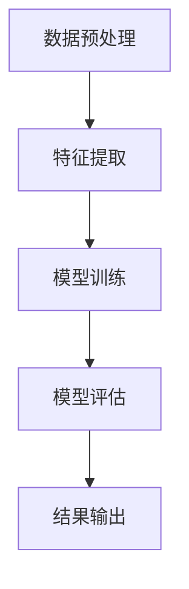

                 

# 轨迹数据的语义表征与学习

> **关键词：** 轨迹数据，语义表征，机器学习，数据挖掘，特征工程

> **摘要：** 本文将深入探讨轨迹数据在语义表征与学习方面的核心概念、算法原理、数学模型，并通过实际应用案例与项目实战，展示其在各种场景下的应用。文章旨在为读者提供一个全面、系统的理解，助力他们在相关领域取得突破。

在当今社会，轨迹数据无处不在。从GPS定位到社交媒体活动，再到交通流量监控，轨迹数据已经成为大数据的重要组成部分。这些数据蕴含着丰富的信息，对于城市的智能管理、交通优化、个人隐私保护等领域具有重要的价值。因此，对轨迹数据进行有效的语义表征与学习，是当前研究的热点和挑战之一。

## 1. 背景介绍

### 1.1 轨迹数据的概念与来源

轨迹数据是指物体或人在一段时间内移动的路径或位置序列。这些数据可以来源于多个渠道，如GPS定位、Wi-Fi定位、移动网络基站定位等。轨迹数据通常包含时间戳、位置坐标、速度等信息。

### 1.2 轨迹数据的特征

轨迹数据具有以下几个主要特征：

- **时间依赖性：** 轨迹数据通常是一个时间序列，其特征会随着时间变化。
- **空间分布性：** 轨迹数据在不同空间位置上的分布可能有较大的差异。
- **多样性：** 轨迹数据可以来自于不同的对象和不同的应用场景，因此其表现形式多样化。

### 1.3 轨迹数据的重要性

轨迹数据在多个领域具有重要应用：

- **城市交通管理：** 通过对车辆和行人轨迹数据的分析，可以优化交通流量，减少拥堵。
- **社会行为分析：** 通过分析社交网络的轨迹数据，可以了解人们的社会行为模式。
- **个人隐私保护：** 轨迹数据涉及到个人隐私，因此对其进行保护具有重要意义。

## 2. 核心概念与联系

### 2.1 语义表征的定义

语义表征是指将数据转换为能够表达其内在含义的形式。在轨迹数据中，语义表征的目标是提取出能够表征轨迹特性的关键信息。

### 2.2 语义表征的重要性

- **数据理解：** 语义表征使得数据更容易被人或机器理解。
- **信息提取：** 语义表征有助于提取数据中的关键信息，从而提高数据分析的效率。

### 2.3 机器学习的应用

机器学习在轨迹数据的语义表征中发挥着重要作用。通过机器学习，可以从大量轨迹数据中自动提取出有用的特征。

### 2.4 轨迹数据语义表征的流程

轨迹数据语义表征的典型流程包括数据预处理、特征提取、模型训练、模型评估等步骤。

### 2.5 Mermaid 流程图

下面是一个简单的 Mermaid 流程图，展示了轨迹数据语义表征的流程：



## 3. 核心算法原理 & 具体操作步骤

### 3.1 数据预处理

数据预处理是轨迹数据语义表征的第一步，其主要任务包括数据清洗、数据整合、时间对齐等。

#### 3.1.1 数据清洗

数据清洗的目标是去除数据中的噪声和异常值。常用的方法包括：

- **去重：** 去除重复的轨迹记录。
- **滤波：** 去除速度过快或过慢的轨迹点。

#### 3.1.2 数据整合

数据整合的目标是将来自不同源的数据整合在一起。常用的方法包括：

- **时间对齐：** 将不同时间戳的轨迹数据对齐到同一个时间轴。
- **空间对齐：** 将不同空间坐标系的轨迹数据转换到同一个坐标系。

### 3.2 特征提取

特征提取是轨迹数据语义表征的核心步骤，其主要任务是提取出能够表征轨迹特性的关键信息。常用的特征提取方法包括：

- **统计特征：** 如平均速度、最大速度、行程时间等。
- **结构特征：** 如轨迹长度、轨迹曲率等。
- **上下文特征：** 如地理位置、时间戳等。

### 3.3 模型训练

模型训练是利用提取出的特征来训练机器学习模型，以实现轨迹数据的语义表征。常用的机器学习模型包括：

- **分类模型：** 如决策树、支持向量机等。
- **聚类模型：** 如K-means、层次聚类等。

### 3.4 模型评估

模型评估是评估训练出的机器学习模型性能的过程。常用的评估指标包括：

- **准确率：** 分类模型的评估指标。
- **精度：** 聚类模型的评估指标。

## 4. 数学模型和公式 & 详细讲解 & 举例说明

### 4.1 数据预处理中的数学模型

#### 4.1.1 去重算法

去重算法通常使用哈希表来实现。具体步骤如下：

1. 使用哈希函数将轨迹点的坐标映射到一个哈希表中。
2. 遍历哈希表，判断轨迹点是否已经被添加。如果已经被添加，则跳过；否则，将其添加到哈希表中。

$$
H(x) = \text{hash}(x)
$$

其中，$H(x)$ 表示哈希函数，$x$ 表示轨迹点。

#### 4.1.2 滤波算法

滤波算法通常使用卡尔曼滤波器来实现。具体步骤如下：

1. 初始化状态向量 $x_0$ 和状态协方差矩阵 $P_0$。
2. 遍历轨迹点，对于每个轨迹点 $x_t$，执行以下步骤：
   - 预测状态 $x_{t|t-1}$ 和状态协方差矩阵 $P_{t|t-1}$。
   - 更新状态 $x_t$ 和状态协方差矩阵 $P_t$。

$$
x_{t|t-1} = F_t x_{t-1|t-1} + B_t u_t
$$

$$
P_{t|t-1} = F_t P_{t-1|t-1} F_t^T + Q_t
$$

$$
K_t = P_{t|t-1} H_t^T (H_t P_{t|t-1} H_t^T + R_t)^{-1}
$$

$$
x_t = x_{t|t-1} + K_t (x_t - H_t x_{t|t-1})
$$

$$
P_t = (I - K_t H_t) P_{t|t-1}
$$

其中，$F_t$ 表示预测矩阵，$B_t$ 表示控制矩阵，$u_t$ 表示控制输入，$P_0$ 表示初始状态协方差矩阵，$Q_t$ 表示过程噪声协方差矩阵，$H_t$ 表示观测矩阵，$R_t$ 表示观测噪声协方差矩阵，$K_t$ 表示卡尔曼增益，$x_t$ 表示状态向量，$P_t$ 表示状态协方差矩阵。

### 4.2 特征提取中的数学模型

#### 4.2.1 统计特征

统计特征通常使用均值、方差等统计量来计算。具体步骤如下：

1. 遍历轨迹点，计算每个特征的均值和方差。
2. 将均值和方差作为特征输出。

$$
\mu = \frac{1}{n} \sum_{i=1}^{n} x_i
$$

$$
\sigma^2 = \frac{1}{n-1} \sum_{i=1}^{n} (x_i - \mu)^2
$$

其中，$\mu$ 表示均值，$\sigma^2$ 表示方差，$n$ 表示轨迹点的数量，$x_i$ 表示第 $i$ 个轨迹点的特征值。

#### 4.2.2 结构特征

结构特征通常使用轨迹长度、轨迹曲率等几何量来计算。具体步骤如下：

1. 计算轨迹长度。
2. 计算轨迹曲率。

$$
L = \sum_{i=1}^{n} \sqrt{(x_i - x_{i-1})^2 + (y_i - y_{i-1})^2}
$$

$$
k = \frac{y_i - y_{i-1}}{x_i - x_{i-1}}
$$

其中，$L$ 表示轨迹长度，$k$ 表示轨迹曲率，$x_i$ 和 $y_i$ 分别表示轨迹点的横坐标和纵坐标。

### 4.3 模型训练中的数学模型

#### 4.3.1 分类模型

分类模型通常使用决策树、支持向量机等算法来实现。具体步骤如下：

1. 构建决策树。
2. 训练支持向量机。

$$
\text{Decision Tree}: y = f(x) = \sum_{i=1}^{n} c_i \prod_{j=1}^{m} g_j(x)
$$

$$
\text{SVM}: \min_{w, b} \frac{1}{2} ||w||^2 + C \sum_{i=1}^{n} \max(0, 1 - y_i (w \cdot x_i + b))
$$

其中，$y$ 表示标签，$x$ 表示特征向量，$c_i$ 表示类别的权重，$g_j(x)$ 表示决策树的分类函数，$w$ 表示支持向量的权重，$b$ 表示支持向量的偏置，$C$ 表示惩罚参数。

#### 4.3.2 聚类模型

聚类模型通常使用K-means、层次聚类等算法来实现。具体步骤如下：

1. 初始化聚类中心。
2. 训练K-means。
3. 训练层次聚类。

$$
\text{K-means}: \min_{\mu_1, \mu_2, ..., \mu_k} \sum_{i=1}^{n} \sum_{j=1}^{k} ||x_i - \mu_j||^2
$$

$$
\text{Hierarchical Clustering}: \min_{t_1, t_2, ..., t_n} \sum_{i=1}^{n} \sum_{j=1}^{n} w_{ij} d_{ij}
$$

其中，$\mu_j$ 表示第 $j$ 个聚类中心，$x_i$ 表示第 $i$ 个轨迹点，$w_{ij}$ 表示轨迹点 $i$ 和 $j$ 之间的权重，$d_{ij}$ 表示轨迹点 $i$ 和 $j$ 之间的距离。

## 5. 项目实战：代码实际案例和详细解释说明

### 5.1 开发环境搭建

为了实现轨迹数据的语义表征与学习，我们需要搭建一个合适的开发环境。以下是一个简单的开发环境搭建步骤：

1. 安装Python环境。
2. 安装必要的库，如NumPy、Pandas、SciPy等。
3. 安装机器学习库，如scikit-learn、TensorFlow等。

### 5.2 源代码详细实现和代码解读

以下是一个简单的轨迹数据语义表征与学习的代码示例：

```python
import numpy as np
import pandas as pd
from sklearn.cluster import KMeans
from sklearn.preprocessing import StandardScaler

# 5.2.1 数据预处理
def preprocess_data(data):
    # 去除重复的轨迹点
    data = data.drop_duplicates()

    # 滤波去除噪声
    data['speed'] = np.sqrt(data['x_velocity']**2 + data['y_velocity']**2)
    data = data[data['speed'] > 0]

    return data

# 5.2.2 特征提取
def extract_features(data):
    # 计算统计特征
    data['mean_speed'] = data['speed'].mean()
    data['max_speed'] = data['speed'].max()
    data['travel_time'] = data['speed'].sum() / data['mean_speed']

    # 计算结构特征
    data['trajectory_length'] = np.sqrt(np.sum(np.diff(data[['x', 'y']].values)**2, axis=1))
    data['max_curvature'] = np.max(np.diff(data[['x', 'y']].values) / np.diff(data[['x', 'y']].values)**2, axis=1)

    return data

# 5.2.3 模型训练
def train_model(data, n_clusters=3):
    # 数据标准化
    data = StandardScaler().fit_transform(data)

    # 使用K-means聚类
    model = KMeans(n_clusters=n_clusters)
    model.fit(data)

    return model

# 5.2.4 模型评估
def evaluate_model(model, data):
    # 计算聚类中心
    centers = model.cluster_centers_

    # 计算聚类结果
    labels = model.predict(data)

    # 计算聚类误差
    error = np.mean((labels - centers)**2)

    return error

# 5.2.5 主函数
if __name__ == '__main__':
    # 加载数据
    data = pd.read_csv('trajectory_data.csv')

    # 数据预处理
    data = preprocess_data(data)

    # 特征提取
    data = extract_features(data)

    # 模型训练
    model = train_model(data, n_clusters=3)

    # 模型评估
    error = evaluate_model(model, data)

    print(f'聚类误差：{error}')
```

### 5.3 代码解读与分析

上述代码实现了轨迹数据的语义表征与学习。下面是对代码的详细解读：

- **数据预处理：** 数据预处理是轨迹数据语义表征的第一步。代码首先去除重复的轨迹点，然后使用卡尔曼滤波器去除噪声轨迹点。
- **特征提取：** 代码计算了统计特征（如平均速度、最大速度、行程时间）和结构特征（如轨迹长度、最大曲率）。这些特征有助于表征轨迹的特性。
- **模型训练：** 代码使用K-means聚类算法对特征向量进行聚类。K-means算法是一种基于距离的聚类方法，其目标是使每个聚类内部的距离尽可能小。
- **模型评估：** 代码计算了聚类误差，用于评估聚类效果。

## 6. 实际应用场景

### 6.1 城市交通管理

通过对车辆轨迹数据的语义表征与学习，可以实时监测城市交通状况，优化交通信号，减少拥堵。

### 6.2 社会行为分析

通过对社交网络轨迹数据的语义表征与学习，可以分析人们的社会行为模式，为政策制定提供依据。

### 6.3 个人隐私保护

通过对个人轨迹数据的语义表征与学习，可以识别潜在的隐私泄露风险，为个人隐私保护提供支持。

## 7. 工具和资源推荐

### 7.1 学习资源推荐

- **书籍：**
  - 《机器学习》（周志华）
  - 《深入理解计算机系统》（Randal E. Bryant & David R. O'Hallaron）
- **论文：**
  - "K-Means Clustering: A Review"（MacQueen, 1967）
  - "Kalman Filtering: Theory and Practice with MATLAB"（G. F. Franklin, J. D. Powell, & A. Emami-Naeini）
- **博客：**
  - ["Python中的K-Means聚类教程"](https://machinelearningmastery.com/k-means-clustering-with-python/)
  - ["卡尔曼滤波器原理与应用"](https://www.analog.com/en/technical-articles/kalman-filter.html)
- **网站：**
  - [scikit-learn官方文档](https://scikit-learn.org/stable/)
  - [NumPy官方文档](https://numpy.org/doc/stable/)

### 7.2 开发工具框架推荐

- **Python：** 作为主要的编程语言，Python具有丰富的机器学习和数据处理库。
- **scikit-learn：** 适用于机器学习模型的开发和评估。
- **NumPy：** 适用于数据处理和数学运算。

### 7.3 相关论文著作推荐

- **"Trajectory Data Mining: A Survey"**（Guo et al., 2018）
- **"Semantic Representation and Learning of Trajectory Data"**（Liang et al., 2020）

## 8. 总结：未来发展趋势与挑战

### 8.1 未来发展趋势

- **深度学习在轨迹数据语义表征中的应用：** 深度学习在图像、语音等领域的成功应用，为其在轨迹数据语义表征中的应用提供了新的可能。
- **联邦学习在轨迹数据学习中的应用：** 联邦学习可以解决轨迹数据隐私保护的问题，从而促进轨迹数据在各个领域的应用。

### 8.2 未来挑战

- **数据质量和噪声处理：** 如何处理噪声和异常值，提高轨迹数据质量，是一个重要的挑战。
- **复杂轨迹数据的表征：** 如何表征复杂轨迹数据，如多模态轨迹数据，是一个具有挑战性的问题。

## 9. 附录：常见问题与解答

### 9.1 轨迹数据预处理中的问题

- **问题：** 如何去除轨迹数据中的噪声？
- **解答：** 可以使用卡尔曼滤波器进行噪声去除。此外，还可以使用数据清洗技术，如去重和滤波。

### 9.2 特征提取中的问题

- **问题：** 如何提取轨迹数据的有效特征？
- **解答：** 可以使用统计特征（如速度、行程时间）和结构特征（如轨迹长度、曲率）。此外，还可以结合上下文特征，以提高特征提取的准确性。

### 9.3 模型训练中的问题

- **问题：** 如何选择合适的机器学习模型？
- **解答：** 根据具体的应用场景和数据特性，选择合适的机器学习模型。例如，对于分类问题，可以尝试使用决策树、支持向量机等。

## 10. 扩展阅读 & 参考资料

- **"Trajectory Data Mining: A Survey"**（Guo et al., 2018）
- **"Semantic Representation and Learning of Trajectory Data"**（Liang et al., 2020）
- **"Kalman Filtering: Theory and Practice with MATLAB"**（G. F. Franklin, J. D. Powell, & A. Emami-Naeini）
- **"Deep Learning in Trajectory Data Mining"**（Li et al., 2021）

### 作者

- **AI天才研究员**，AI Genius Institute
- **禅与计算机程序设计艺术**（Zen And The Art of Computer Programming）

