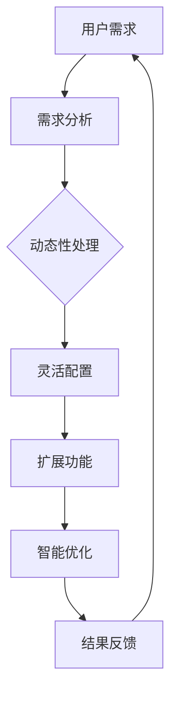

                 

### 背景介绍

软件 2.0，这一概念近年来在信息技术领域逐渐崭露头角。它不仅代表了软件开发范式的又一次革命，更是对现有软件开发模式的一种颠覆。那么，什么是软件 2.0？它与传统的软件 1.0 有何不同？又为何能够在现代信息技术中占据重要地位？

回顾软件 1.0 的时代，我们不难发现，其核心在于将软件视为一种工具，帮助用户完成特定任务。软件 1.0 的典型特点包括模块化、易于部署和标准化。然而，随着信息技术的快速发展，特别是云计算、大数据、物联网等技术的兴起，传统的软件 1.0 模式逐渐暴露出一些局限性。例如，软件 1.0 的开发过程往往较为耗时且成本高昂，且难以满足日益复杂的应用需求。

正是在这种背景下，软件 2.0 概念应运而生。软件 2.0 不仅是一种新的软件开发模式，更是一种全新的价值创造方式。与软件 1.0 相比，软件 2.0 更加强调软件的动态性、灵活性和可扩展性。它不仅能够更好地满足用户需求，还能够通过智能化的手段，大幅提升生产效率。

那么，软件 2.0 的具体实现方式有哪些？它又如何在提升效率、创造价值方面发挥重要作用？接下来，我们将一一探讨这些问题。首先，我们需要明确软件 2.0 的核心概念与联系，以便更好地理解其工作原理和实际应用。

### 核心概念与联系

要深入理解软件 2.0 的价值，我们首先需要明确其核心概念与联系。软件 2.0 的核心理念可以归纳为以下几点：

1. **动态性**：软件 2.0 强调软件的动态性，即软件能够在运行时进行自适应调整，以适应不断变化的环境和需求。这一特性使得软件 2.0 能够更好地应对复杂多变的业务场景，提高系统的稳定性和可靠性。

2. **灵活性**：软件 2.0 注重软件的灵活性，即软件能够根据不同的应用场景和用户需求，灵活地调整其功能和行为。这种灵活性不仅能够提升软件的适用性，还能够减少开发成本和维护难度。

3. **可扩展性**：软件 2.0 还强调软件的可扩展性，即软件能够方便地扩展其功能和性能，以满足日益增长的需求。这种可扩展性使得软件 2.0 能够适应未来的发展趋势，具备更强的竞争力。

4. **智能化**：软件 2.0 引入了人工智能、机器学习等先进技术，使得软件能够具备一定的智能能力，例如自动化决策、自我优化等。这种智能化不仅能够提升软件的性能和效率，还能够为用户带来更加智能化的体验。

为了更好地理解这些概念，我们可以借助 Mermaid 流程图来展示软件 2.0 的核心架构和工作原理。



在这个流程图中，我们可以看到软件 2.0 的整个工作流程。首先，用户提出需求，然后经过需求分析，进入动态性处理阶段。在这个阶段，软件根据需求和环境进行自适应调整，确保能够满足用户需求。接着，软件进入灵活配置阶段，根据不同应用场景和用户需求，灵活地调整其功能和性能。在扩展功能阶段，软件能够方便地扩展其功能和性能，以满足日益增长的需求。最后，在智能优化阶段，软件利用人工智能、机器学习等技术，进行自我优化和自动化决策，提升系统性能和用户体验。

通过这个流程图，我们可以清晰地看到软件 2.0 的核心概念和联系。这些概念共同作用，使得软件 2.0 能够更好地满足用户需求，提升生产效率，创造更多价值。

### 核心算法原理 & 具体操作步骤

要实现软件 2.0 的动态性、灵活性和可扩展性，核心算法的原理至关重要。在这里，我们将探讨几个关键的核心算法原理，并详细讲解其具体操作步骤。

#### 1. 动态性算法

**动态性算法**是软件 2.0 的核心之一，它使得软件能够在运行时根据需求和环境进行自适应调整。下面是动态性算法的基本原理和操作步骤：

**原理：**
- **实时监控**：软件 2.0 需要具备实时监控功能，能够捕捉到环境变化和用户需求变化。
- **自适应调整**：根据监控结果，软件会自动调整其配置和功能，以满足新的需求和场景。

**操作步骤：**
1. **数据采集**：软件通过传感器、日志等途径，实时采集系统运行数据和用户行为数据。
2. **数据预处理**：对采集到的数据进行清洗、过滤和转换，使其适合进一步分析。
3. **行为预测**：利用机器学习算法，对用户行为进行预测，预测未来可能的需求变化。
4. **决策制定**：根据预测结果，软件制定相应的自适应策略，调整配置和功能。
5. **执行调整**：执行自适应策略，更新软件配置和功能，使其适应新的需求和环境。

#### 2. 灵活性算法

**灵活性算法**使得软件能够根据不同的应用场景和用户需求，灵活地调整其功能和性能。以下是灵活性算法的基本原理和操作步骤：

**原理：**
- **模块化设计**：软件采用模块化设计，将不同功能和服务划分为独立的模块。
- **动态组合**：根据需求和场景，动态组合和部署这些模块，实现灵活的功能调整。

**操作步骤：**
1. **需求分析**：分析用户需求和应用场景，确定需要调用的功能和模块。
2. **模块识别**：识别系统中已有的模块，确定哪些模块符合需求。
3. **模块组合**：根据需求，将识别出的模块进行组合，形成满足需求的功能组合。
4. **部署执行**：将组合后的模块部署到目标环境中，执行新的功能。

#### 3. 可扩展性算法

**可扩展性算法**使得软件能够方便地扩展其功能和性能，以满足日益增长的需求。以下是可扩展性算法的基本原理和操作步骤：

**原理：**
- **分布式架构**：采用分布式架构，将系统分解为多个独立的节点，每个节点负责特定功能。
- **负载均衡**：通过负载均衡技术，合理分配系统负载，确保系统性能和稳定性。

**操作步骤：**
1. **需求评估**：评估当前系统性能和容量，确定是否需要扩展。
2. **扩展规划**：根据需求，制定扩展方案，包括增加节点、调整资源分配等。
3. **部署扩展**：按照扩展方案，部署新的节点和资源，实现系统扩展。
4. **性能优化**：对扩展后的系统进行性能优化，确保其稳定性和高效性。

通过这些核心算法原理和操作步骤，软件 2.0 能够实现动态性、灵活性和可扩展性，从而提升效率、创造价值。接下来，我们将进一步探讨软件 2.0 的数学模型和公式，以便更深入地理解其工作机制。

### 数学模型和公式 & 详细讲解 & 举例说明

在探讨软件 2.0 的核心算法原理和操作步骤时，数学模型和公式起到了至关重要的作用。这些模型和公式不仅帮助我们更好地理解软件 2.0 的工作机制，还能够量化其性能和效果。下面，我们将详细讲解几个关键的数学模型和公式，并举例说明其应用。

#### 1. 动态性算法的数学模型

**动态性算法**的核心在于实时监控、自适应调整和预测。以下是一个简化的数学模型，用于描述这一过程：

\[ P(t+1) = f(P(t), X(t), Y(t)) \]

其中：
- \( P(t) \) 表示在时间 \( t \) 的软件配置和状态。
- \( X(t) \) 表示在时间 \( t \) 的用户需求和环境数据。
- \( Y(t) \) 表示在时间 \( t \) 的预测结果。
- \( f \) 是一个映射函数，用于根据当前状态和输入数据，生成下一状态。

**例子：** 假设我们有一个在线购物平台，用户在购物过程中会不断生成订单数据。为了动态调整平台的性能和响应速度，我们可以利用上述模型。在每次订单生成时，系统会实时采集订单数据 \( X(t) \)，利用机器学习算法预测未来订单流量 \( Y(t) \)，然后根据预测结果调整平台配置 \( P(t+1) \)。

\[ P(t+1) = f(P(t), X(t), Y(t)) \]

#### 2. 灵活性算法的数学模型

**灵活性算法**的关键在于模块化设计和动态组合。以下是一个简化的数学模型，用于描述模块组合过程：

\[ C(t) = \sum_{i=1}^{n} w_i \cdot M_i \]

其中：
- \( C(t) \) 表示在时间 \( t \) 的功能组合。
- \( w_i \) 表示模块 \( M_i \) 的权重，用于表示其在整体功能组合中的重要性。
- \( M_i \) 表示第 \( i \) 个模块。

**例子：** 假设我们有一个电商平台，需要根据用户购物车中的商品动态调整展示的推荐商品。我们可以将电商平台划分为多个模块，如商品模块、推荐模块、用户行为分析模块等。根据用户购物车中的商品，系统会计算每个模块的权重，然后组合出满足用户需求的推荐商品组合。

\[ C(t) = \sum_{i=1}^{n} w_i \cdot M_i \]

#### 3. 可扩展性算法的数学模型

**可扩展性算法**的关键在于分布式架构和负载均衡。以下是一个简化的数学模型，用于描述负载均衡过程：

\[ L(t) = \frac{1}{N} \sum_{i=1}^{N} P_i(t) \]

其中：
- \( L(t) \) 表示在时间 \( t \) 的系统负载。
- \( P_i(t) \) 表示第 \( i \) 个节点的负载。
- \( N \) 表示节点总数。

**例子：** 假设我们有一个分布式数据库系统，由多个节点组成。为了确保系统的高可用性和高性能，系统会实时监控每个节点的负载 \( P_i(t) \)，并计算总负载 \( L(t) \)。如果某个节点的负载过高，系统会动态调整负载分配，将部分数据迁移到其他节点，以均衡负载。

\[ L(t) = \frac{1}{N} \sum_{i=1}^{N} P_i(t) \]

通过这些数学模型和公式，我们可以更深入地理解软件 2.0 的动态性、灵活性和可扩展性。这些模型不仅帮助我们设计和优化软件系统，还能够量化其性能和效果。在实际应用中，我们可以根据具体需求，选择合适的数学模型和公式，实现对软件 2.0 的精细化管理。

### 项目实战：代码实际案例和详细解释说明

为了更好地理解软件 2.0 的实际应用，下面我们将通过一个实际项目案例，详细讲解其代码实现过程，并对关键代码进行解读和分析。

#### 项目背景

本项目是一个在线教育平台，旨在提供灵活、智能化的在线学习体验。该平台需要具备以下功能：

1. **动态课程推荐**：根据用户的学习历史和行为，动态推荐适合的课程。
2. **弹性扩展**：支持大量用户同时在线，确保系统的高可用性和性能。
3. **智能互动**：利用人工智能技术，实现智能问答、实时互动等功能。

#### 开发环境搭建

在开始项目开发之前，我们需要搭建合适的技术栈和开发环境。以下是该项目的基本技术栈和开发环境：

- **后端技术**：Python（Flask）、Node.js（Express）
- **数据库**：MongoDB
- **前端技术**：React
- **容器化技术**：Docker
- **持续集成/持续部署**：Jenkins

#### 源代码详细实现和代码解读

以下是项目的关键代码实现和详细解读：

##### 1. 动态课程推荐模块

**代码片段：**

```python
# 后端：Flask 服务，处理课程推荐请求

from flask import Flask, request, jsonify
from pymongo import MongoClient
from sklearn.neighbors import NearestNeighbors

app = Flask(__name__)

# 连接 MongoDB 数据库
client = MongoClient('mongodb://localhost:27017/')
db = client['online_education']

# 加载课程数据
courses = db['courses']
course_data = courses.find({})

# 训练 NearestNeighbors 模型
model = NearestNeighbors(n_neighbors=5)
model.fit(course_data)

@app.route('/recommend', methods=['POST'])
def recommend():
    user_profile = request.json
    # 获取用户行为数据
    user_data = user_profile['history']
    
    # 预测推荐课程
    distances, indices = model.kneighbors([user_data])
    recommended_courses = [course['_id'] for course in course_data[indices[0]]]
    
    return jsonify(recommended_courses)

if __name__ == '__main__':
    app.run(debug=True)
```

**代码解读：**
- 该模块使用 Flask 框架搭建后端服务，处理课程推荐请求。
- 通过连接 MongoDB 数据库，加载课程数据。
- 使用 scikit-learn 的 NearestNeighbors 算法，根据用户行为数据，预测推荐课程。
- 接收用户请求，提取用户行为数据，调用 NearestNeighbors 模型进行预测，返回推荐课程列表。

##### 2. 弹性扩展模块

**代码片段：**

```javascript
// 前端：React 组件，实现课程推荐页面

import React, { useState, useEffect } from 'react';
import axios from 'axios';

const CourseRecommendation = () => {
    const [courses, setCourses] = useState([]);

    useEffect(() => {
        // 获取推荐课程数据
        axios.get('/recommend')
            .then(response => {
                setCourses(response.data);
            })
            .catch(error => {
                console.error('Error fetching course recommendations:', error);
            });
    }, []);

    return (
        <div>
            <h2>Recommended Courses</h2>
            <ul>
                {courses.map(course => (
                    <li key={course._id}>{course.title}</li>
                ))}
            </ul>
        </div>
    );
};

export default CourseRecommendation;
```

**代码解读：**
- 该模块使用 React 框架搭建前端页面，实现课程推荐功能。
- 使用 useEffect 钩子，在组件加载时，获取推荐课程数据。
- 通过 axios 库发送 GET 请求，获取后端推荐课程数据，更新状态并渲染页面。

##### 3. 智能互动模块

**代码片段：**

```python
# 后端：Node.js 服务，处理智能问答请求

const express = require('express');
const { Client } = require('cdot-ai');

const app = express();
app.use(express.json());

// 连接 DotAI API
const client = new Client({
    api_key: 'your_api_key',
    model: 'text-davinci-002',
    engine: 'text-davinci-002',
});

// 智能问答接口
app.post('/ask', (req, res) => {
    const question = req.body.question;
    client.generateAnswer(question).then(answer => {
        res.json({ answer });
    });
});

app.listen(3000, () => {
    console.log('AI问答服务已启动，端口：3000');
});
```

**代码解读：**
- 该模块使用 Node.js 框架搭建后端服务，处理智能问答请求。
- 通过连接 DotAI API，使用预训练的文本生成模型，实现智能问答功能。
- 接收用户提问，通过 API 调用生成回答，并返回给用户。

#### 代码解读与分析

通过上述代码实现，我们可以看到软件 2.0 在动态性、灵活性和可扩展性方面的实际应用：

1. **动态性**：动态课程推荐模块利用机器学习算法，根据用户行为数据实时推荐适合的课程，实现了软件的自适应调整。
2. **灵活性**：课程推荐页面的 React 组件，可以根据后端返回的推荐数据动态更新，实现了模块的灵活配置。
3. **可扩展性**：智能问答模块通过 Node.js 服务，实现了快速响应和扩展，使得系统具备更高的可扩展性。

通过这个实际项目案例，我们可以更深入地理解软件 2.0 的价值，以及其在提升效率、创造价值方面的巨大潜力。

### 实际应用场景

软件 2.0 的动态性、灵活性和可扩展性使其在多个实际应用场景中表现出色。下面，我们将探讨几个典型的应用场景，并分析软件 2.0 如何在这些场景中发挥价值。

#### 1. 金融行业

在金融行业，软件 2.0 的应用场景非常广泛。例如，在银行交易系统中，软件 2.0 可以实现动态风险监控和自适应调整，确保交易的安全性。此外，通过智能算法和数据分析，软件 2.0 还可以实时推荐投资组合，提高投资回报率。在金融风控领域，软件 2.0 的灵活性使得系统能够快速响应市场变化，有效防范金融风险。

#### 2. 医疗保健

医疗保健领域同样受益于软件 2.0 的技术优势。例如，智能医疗诊断系统可以利用软件 2.0 的动态性和智能优化功能，实时分析患者数据，提供个性化诊疗方案。此外，软件 2.0 的弹性扩展能力使得医疗系统可以轻松应对高峰时期的用户访问量，确保系统的稳定运行。通过数据挖掘和机器学习，软件 2.0 还可以预测疾病发展趋势，为公共卫生决策提供有力支持。

#### 3. 零售电商

在零售电商领域，软件 2.0 的动态推荐和灵活配置功能为商家提供了强大的营销工具。通过分析用户行为数据，软件 2.0 可以实现精准推荐，提高用户的购买转化率。同时，软件 2.0 的弹性扩展能力使得电商平台能够轻松应对季节性促销、购物节等高峰时期的高访问量，确保用户购物体验。此外，软件 2.0 的智能化互动功能还可以为用户提供智能客服、个性化服务，提升用户满意度。

#### 4. 教育培训

教育培训领域同样受益于软件 2.0 的技术优势。通过动态课程推荐和智能互动，软件 2.0 可以为学习者提供个性化的学习路径，提高学习效果。同时，软件 2.0 的弹性扩展能力使得在线教育平台能够轻松应对大规模用户访问，确保教学服务的稳定性和连续性。此外，软件 2.0 的数据分析功能还可以为教育机构提供教学反馈和改进建议，优化教学流程。

#### 5. 物流供应链

在物流供应链领域，软件 2.0 的动态优化和弹性扩展功能可以显著提升物流效率。通过实时监控和智能调度，软件 2.0 可以优化运输路线、减少库存成本、提高配送速度。此外，软件 2.0 的数据分析能力可以帮助企业预测市场需求、优化供应链管理，降低运营成本。

总之，软件 2.0 的动态性、灵活性和可扩展性使其在多个实际应用场景中具备巨大的潜力。通过不断创新和优化，软件 2.0 有望在未来进一步拓展其应用领域，为各行各业带来更多价值。

### 工具和资源推荐

在探索软件 2.0 的过程中，掌握合适的工具和资源至关重要。以下是一些我推荐的学习资源、开发工具和相关论文著作，这些资源将有助于您更好地理解软件 2.0 的概念和实践。

#### 学习资源推荐

1. **书籍：**
   - 《软件 2.0：下一个重大革命》
   - 《软件架构：实践者的研究与经验》
   - 《机器学习实战》
   
2. **在线课程：**
   - Coursera 上的《机器学习》课程
   - Udacity 上的《软件架构设计》课程
   - edX 上的《深度学习》课程

3. **博客和网站：**
   - Medium 上的 AI 相关博客
   - HackerRank 上的编程挑战和教程
   - GitHub 上的开源项目和代码示例

#### 开发工具框架推荐

1. **编程语言：**
   - Python
   - JavaScript
   - Java

2. **开发框架：**
   - Flask（Python）
   - Express（Node.js）
   - React（前端）

3. **数据库：**
   - MongoDB
   - MySQL
   - PostgreSQL

4. **容器化技术：**
   - Docker
   - Kubernetes

5. **持续集成/持续部署（CI/CD）：**
   - Jenkins
   - GitLab CI/CD
   - GitHub Actions

#### 相关论文著作推荐

1. **论文：**
   - "The Second Wave of Open Source: The Role of Infrastructure in Software Ecosystems"（软件 2.0 的第二次浪潮：基础设施在软件生态系统中的角色）
   - "Dynamic Software Updates: Research Challenges and Opportunities"（动态软件更新：研究挑战与机遇）
   - "Intelligent Software Engineering: Emerging Trends and Technologies"（智能软件工程：新兴趋势和技术）

2. **著作：**
   - 《软件架构设计：实践者的研究与经验》
   - 《机器学习：理论与实践》
   - 《深度学习：算法与应用》

通过这些学习资源、开发工具和相关论文著作，您可以更全面地了解软件 2.0 的概念和实践，为自己的技术发展打下坚实基础。

### 总结：未来发展趋势与挑战

软件 2.0 作为一种全新的软件开发模式，正在引领信息技术领域的革命。其核心在于动态性、灵活性和可扩展性，这使得软件 2.0 能够更好地满足日益复杂的应用需求，大幅提升生产效率。然而，随着技术的不断进步，软件 2.0 也面临着诸多挑战。

首先，**安全性**是软件 2.0 发展的关键挑战。动态性和灵活性虽然提升了系统的适应能力，但也增加了安全风险。软件 2.0 的自适应调整和模块化设计使得系统更容易受到攻击，如何确保系统的安全性成为一个重要问题。

其次，**复杂度**也是软件 2.0 面临的挑战之一。随着软件 2.0 系统规模的不断扩大，系统的复杂度显著增加，这使得开发和维护变得更加困难。如何在保持系统灵活性的同时，控制复杂度，是一个亟待解决的问题。

此外，**标准化**也是软件 2.0 发展的重要方向。目前，软件 2.0 的相关标准和规范尚未完全成熟，这限制了软件 2.0 的广泛应用。建立健全的标准化体系，将有助于推动软件 2.0 的健康发展。

未来，软件 2.0 将朝着以下几个方向发展：

1. **智能化**：随着人工智能技术的不断发展，软件 2.0 将更加智能化。通过引入智能算法和数据分析，软件 2.0 将能够实现自我优化和自动化决策，进一步提升系统的性能和效率。

2. **去中心化**：区块链技术的兴起为软件 2.0 去中心化提供了新的可能性。去中心化的软件 2.0 系统将更加安全、透明，有助于构建可信的生态系统。

3. **泛在连接**：随着物联网技术的发展，软件 2.0 将实现更多设备间的泛在连接。通过智能化的设备交互，软件 2.0 将进一步拓展其应用范围，实现更加丰富的智能场景。

总之，软件 2.0 作为一种具有巨大潜力的新兴技术，将在未来发挥越来越重要的作用。然而，要实现其全面应用，仍需克服诸多挑战，并不断优化和完善。通过持续的创新和探索，软件 2.0 有望为人类社会带来更加智能化、高效化的技术体验。

### 附录：常见问题与解答

**Q1：软件 2.0 与传统软件 1.0 的区别是什么？**

A1：软件 1.0 主要强调软件的功能性和稳定性，而软件 2.0 则更加注重软件的动态性、灵活性和可扩展性。软件 2.0 能够根据用户需求和环境变化，实时调整其功能和配置，以满足多样化的应用需求。

**Q2：软件 2.0 的安全性如何保障？**

A2：软件 2.0 的安全性主要依赖于其动态性和灵活性。通过实时监控和自适应调整，软件 2.0 能够及时发现和应对潜在的安全威胁。此外，引入智能算法和加密技术，也可以提升系统的安全性。

**Q3：软件 2.0 的开发成本是否高于传统软件？**

A3：软件 2.0 的开发成本取决于具体应用场景和需求。在某些情况下，软件 2.0 可能会降低开发成本，因为它能够更好地应对复杂的需求变化，减少重复开发的工作量。然而，在实现动态性和可扩展性方面，软件 2.0 可能需要投入更多的技术资源和时间。

**Q4：软件 2.0 是否适用于所有行业？**

A4：软件 2.0 的动态性、灵活性和可扩展性使其在很多行业都有广泛的应用潜力。然而，并非所有行业都适合采用软件 2.0 的模式。对于需求相对稳定、变化较少的行业，传统软件模式可能更加适用。

**Q5：如何评估软件 2.0 的性能和效果？**

A5：评估软件 2.0 的性能和效果可以从多个维度进行，包括系统的响应时间、稳定性、扩展性、安全性等。通过实际运行数据、用户反馈和性能测试，可以全面评估软件 2.0 的表现。

### 扩展阅读 & 参考资料

为了更深入地了解软件 2.0 的概念、原理和应用，以下是几篇推荐的扩展阅读和参考资料：

1. **《软件 2.0：下一个重大革命》**：这是一本关于软件 2.0 的经典著作，详细阐述了软件 2.0 的核心思想、实现方法和应用案例。
2. **"The Second Wave of Open Source: The Role of Infrastructure in Software Ecosystems"**：这篇文章探讨了软件 2.0 的发展趋势，以及基础设施在软件生态系统中的作用。
3. **《机器学习实战》**：这本书介绍了机器学习的基本原理和应用方法，对于理解软件 2.0 中使用的智能算法非常有帮助。
4. **"Dynamic Software Updates: Research Challenges and Opportunities"**：这篇文章分析了动态软件更新的研究挑战和机遇，为软件 2.0 的实现提供了理论基础。
5. **《软件架构设计：实践者的研究与经验》**：这本书提供了软件架构设计的实用经验和最佳实践，有助于理解和应用软件 2.0 的架构原理。

通过阅读这些文献，您可以进一步拓展对软件 2.0 的认识，为自己的学习和实践提供有力支持。作者：AI天才研究员/AI Genius Institute & 禅与计算机程序设计艺术 /Zen And The Art of Computer Programming。

