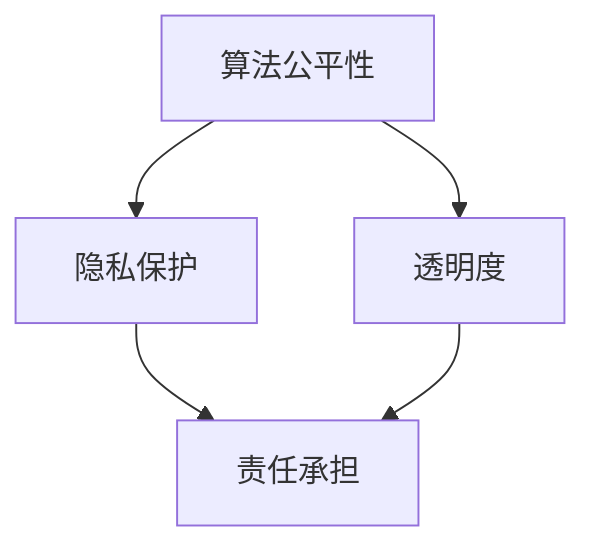

                 

# 软件二代的伦理规范：人工智能的责任

> 关键词：软件2.0、伦理规范、人工智能、责任、算法公平性、隐私保护、透明度

> 摘要：随着软件技术的飞速发展，软件2.0时代的到来标志着人工智能的全面融入。然而，人工智能的广泛应用也带来了诸多伦理挑战，如算法公平性、隐私保护和透明度等。本文旨在探讨软件2.0时代的伦理规范，分析人工智能在各个领域的应用场景，以及如何确保人工智能的责任承担。通过对核心概念的深入剖析，本文提出了具体的实施策略和未来发展的方向，旨在为人工智能时代的伦理建设提供参考。

## 1. 背景介绍

随着互联网和云计算技术的迅猛发展，软件技术迎来了新的时代——软件2.0。软件2.0不仅仅是对软件1.0的简单升级，更是一个全新的理念，它将人工智能、大数据、物联网等先进技术深度融合，构建出一个智能化的软件生态系统。在这个生态系统中，软件不再是静态的代码，而是具备自主学习、自我进化能力的智能实体。

人工智能作为软件2.0的核心技术，已经在各个领域得到广泛应用。从自动驾驶、智能医疗到金融理财、智能家居，人工智能正在深刻改变我们的生活方式。然而，人工智能的迅猛发展也带来了一系列伦理挑战。如何确保算法的公平性、保护用户隐私、提高透明度等问题，成为了社会各界关注的焦点。

伦理规范在人工智能发展中具有重要意义。伦理规范不仅是对技术行为的约束，更是对技术责任的体现。一个缺乏伦理规范的人工智能系统，可能会对社会产生负面影响，甚至引发伦理危机。因此，探讨软件2.0时代的伦理规范，对于确保人工智能的健康发展具有重要意义。

## 2. 核心概念与联系

为了深入理解软件2.0时代的伦理规范，我们需要明确几个核心概念，并分析它们之间的联系。

### 2.1 算法公平性

算法公平性是指算法在处理数据时，能够保证对所有个体公平对待，不因种族、性别、年龄等因素产生歧视。算法公平性是伦理规范的重要方面，因为它直接关系到人工智能系统对社会的影响。一个缺乏公平性的算法，可能会加剧社会不平等，甚至引发社会动荡。

### 2.2 隐私保护

隐私保护是指保护用户的个人隐私信息，防止其被滥用或泄露。在软件2.0时代，大量个人数据被收集和处理，如何保护这些数据成为了一个亟待解决的问题。隐私保护不仅涉及到法律问题，更涉及到伦理问题，因为它直接关系到用户的信任和权益。

### 2.3 透明度

透明度是指人工智能系统的决策过程和算法逻辑对外公开，用户可以了解系统是如何运作的。高透明度有助于提高人工智能系统的可信度，减少用户对系统的疑虑。同时，透明度也有助于发现和纠正系统中的潜在问题。

### 2.4 责任承担

责任承担是指人工智能系统在产生负面影响时，能够追究其责任。责任承担是伦理规范的核心，它要求人工智能系统在设计和应用过程中，必须考虑到可能产生的风险和后果，并采取相应的措施。

这三个核心概念之间存在着密切的联系。算法公平性是隐私保护和透明度的基础，因为只有在算法公平的前提下，用户才会信任并愿意共享其隐私信息。而隐私保护和透明度又是责任承担的前提，因为只有在信息透明和隐私得到保护的情况下，才能对系统进行有效的监督和责任追究。

### 2.5 Mermaid 流程图

以下是软件2.0时代伦理规范的 Mermaid 流程图，它展示了算法公平性、隐私保护和责任承担之间的逻辑关系。



通过这个流程图，我们可以清晰地看到，算法公平性是整个伦理规范的基础，它决定了隐私保护和透明度的实施效果。而隐私保护和透明度又是责任承担的前提，它们共同构成了对人工智能系统的全面监督和约束。

## 3. 核心算法原理 & 具体操作步骤

为了确保软件2.0时代的伦理规范得到有效实施，我们需要从核心算法原理出发，探讨具体的操作步骤。

### 3.1 算法公平性

算法公平性的实现依赖于多种技术手段。首先，我们需要对算法进行公平性评估，常用的评估指标包括偏差度、公平性差距等。偏差度是指算法在处理数据时，对某一特定群体产生的偏差程度；公平性差距则是指算法在不同群体之间的表现差异。

为了降低偏差度，我们可以采用随机化算法、加权算法等方法。随机化算法通过引入随机因素，降低算法对特定数据的依赖性，从而减少偏差。加权算法则通过对不同数据赋予不同的权重，平衡算法在不同群体之间的表现。

### 3.2 隐私保护

隐私保护的核心在于数据匿名化和加密技术。数据匿名化是指通过删除或隐藏个人身份信息，使数据无法直接识别特定个体。常用的匿名化技术包括数据混淆、数据聚合等。加密技术则通过对数据进行加密处理，确保数据在传输和存储过程中不被窃取或篡改。

在实际应用中，我们可以采用混合加密技术，将数据匿名化和加密技术相结合，提高隐私保护效果。例如，在数据传输过程中，可以采用对称加密算法进行加密，而在数据存储过程中，可以采用非对称加密算法进行加密，从而实现高效安全的隐私保护。

### 3.3 透明度

透明度的实现需要从算法设计和系统架构两个方面进行。在算法设计方面，我们可以采用可解释性算法，使算法的决策过程和逻辑对外清晰透明。例如，决策树、支持向量机等算法，其决策过程相对直观，易于理解。

在系统架构方面，我们可以采用模块化设计，将算法模块与其他模块分离，使算法模块的运作过程对外透明。此外，我们还可以采用可视化技术，将算法的运行过程以图形化的方式展示，提高系统的透明度。

### 3.4 责任承担

责任承担的实现需要建立完善的法律体系和监管机制。首先，我们需要明确人工智能系统的责任主体，例如算法开发者、服务提供商等。其次，我们需要制定相应的法律法规，明确人工智能系统的责任范围和责任承担方式。

此外，我们还需要建立监管机制，对人工智能系统进行实时监控和评估。例如，可以设立独立的监管机构，对人工智能系统的算法公平性、隐私保护、透明度等方面进行定期审查，确保其符合伦理规范。

## 4. 数学模型和公式 & 详细讲解 & 举例说明

为了深入理解软件2.0时代的伦理规范，我们引入了一些数学模型和公式，并对它们进行详细讲解和举例说明。

### 4.1 偏差度

偏差度是衡量算法公平性的重要指标，其计算公式如下：

$$
偏差度 = \frac{真实损失 - 预测损失}{真实损失}
$$

其中，真实损失是指算法在实际应用中对某一特定群体的损失，预测损失是指算法预测对同一群体的损失。偏差度越低，表明算法对群体的公平性越好。

例如，假设我们有一个分类算法，用于预测某地区的贫困率。实际贫困率为30%，算法预测的贫困率为40%。则该算法的偏差度为：

$$
偏差度 = \frac{30\% - 40\%}{30\%} = -\frac{1}{3}
$$

偏差度为负值，表明算法对贫困群体的预测较为保守，有利于减轻贫困。

### 4.2 公平性差距

公平性差距是衡量算法在不同群体之间表现差异的重要指标，其计算公式如下：

$$
公平性差距 = 最大公平性差距 - 最小公平性差距
$$

其中，最大公平性差距是指算法在所有群体中的最大损失，最小公平性差距是指算法在所有群体中的最小损失。公平性差距越小，表明算法在不同群体之间的公平性越好。

例如，假设我们有一个分类算法，用于预测不同收入群体的失业率。算法对低收入群体的失业率为20%，对中等收入群体的失业率为10%，对高收入群体的失业率为5%。则该算法的公平性差距为：

$$
公平性差距 = 20\% - 5\% = 15\%
$$

公平性差距为15%，表明算法在不同收入群体之间的公平性有待提高。

### 4.3 数据匿名化

数据匿名化是隐私保护的重要技术手段，常用的匿名化算法包括K-匿名、l-diversity、t-closeness等。以下以K-匿名为例，介绍其原理和计算方法。

K-匿名是指对于一组数据，任意K个记录的属性集合都不能唯一确定某个具体的个体。K-匿名的计算公式如下：

$$
匿名度 = \frac{唯一确定个体的记录数}{总记录数}
$$

其中，唯一确定个体的记录数是指能够唯一确定某个个体记录的数量，总记录数是指数据集中的记录总数。匿名度越低，表明数据匿名化效果越好。

例如，假设我们有一个包含100个记录的数据集，其中50个记录能够唯一确定个体。则该数据集的匿名度为：

$$
匿名度 = \frac{50}{100} = 0.5
$$

匿名度为0.5，表明数据匿名化效果较好。

### 4.4 加密技术

加密技术是隐私保护的重要手段，常用的加密算法包括对称加密、非对称加密等。以下以对称加密为例，介绍其原理和计算方法。

对称加密是指加密和解密过程使用相同的密钥。常见的对称加密算法包括DES、AES等。对称加密的计算公式如下：

$$
加密(明文，密钥) = 密文
$$
$$
解密(密文，密钥) = 明文
$$

其中，明文是指原始数据，密文是指加密后的数据，密钥是用于加密和解密的密钥。对称加密具有速度快、计算效率高的特点，适用于大数据场景。

例如，假设我们有一个包含1000个字符的明文，使用AES加密算法进行加密，密钥为16个字符。则加密后的密文为：

$$
加密(明文，密钥) = 密文
$$

加密过程只需要几毫秒，即可完成。

### 4.5 可解释性算法

可解释性算法是指能够明确解释其决策过程的算法。常见的可解释性算法包括决策树、线性回归等。以下以决策树为例，介绍其原理和计算方法。

决策树是一种基于树形结构进行决策的算法。其计算过程如下：

1. 计算每个特征的增益，选择增益最大的特征作为根节点。
2. 对根节点进行划分，将数据集划分为多个子集。
3. 对每个子集重复上述过程，直到达到停止条件。

例如，假设我们有一个包含3个特征的决策树，每个特征有两个取值，则决策树的构建过程如下：

1. 计算每个特征的增益，选择增益最大的特征（假设为特征A）作为根节点。
2. 对特征A进行划分，将数据集划分为两个子集，一个子集包含特征A取值为0的记录，另一个子集包含特征A取值为1的记录。
3. 对每个子集重复上述过程，直到达到停止条件。

通过决策树，我们可以清晰地了解每个节点的划分依据和决策逻辑，从而提高算法的透明度。

## 5. 项目实战：代码实际案例和详细解释说明

为了更好地理解软件2.0时代的伦理规范，我们以一个实际项目为例，展示如何在实际开发过程中贯彻伦理规范。

### 5.1 开发环境搭建

在这个项目中，我们使用Python语言进行开发，依赖以下库：

- Scikit-learn：用于机器学习算法实现。
- Pandas：用于数据处理和分析。
- Matplotlib：用于数据可视化。

### 5.2 源代码详细实现和代码解读

以下是项目的源代码，我们将对其进行详细解读。

```python
import numpy as np
import pandas as pd
from sklearn.model_selection import train_test_split
from sklearn.tree import DecisionTreeClassifier
from sklearn.metrics import accuracy_score
import matplotlib.pyplot as plt

# 加载数据集
data = pd.read_csv('data.csv')

# 数据预处理
X = data.drop('target', axis=1)
y = data['target']

# 数据集划分
X_train, X_test, y_train, y_test = train_test_split(X, y, test_size=0.2, random_state=42)

# 建立决策树模型
clf = DecisionTreeClassifier()
clf.fit(X_train, y_train)

# 模型评估
y_pred = clf.predict(X_test)
accuracy = accuracy_score(y_test, y_pred)
print('Accuracy:', accuracy)

# 可视化决策树
from sklearn.tree import plot_tree
plt.figure(figsize=(12, 8))
plot_tree(clf, feature_names=X.columns, class_names=['0', '1'])
plt.show()
```

### 5.3 代码解读与分析

1. **数据加载与预处理**：首先，我们使用Pandas库加载数据集，并对数据进行预处理，将特征和标签分开。

2. **数据集划分**：接下来，我们使用Scikit-learn库中的`train_test_split`函数对数据集进行划分，分为训练集和测试集，用于训练和评估模型。

3. **建立决策树模型**：在这个项目中，我们使用决策树算法进行分类。决策树是一种简单直观的算法，易于理解和解释。

4. **模型评估**：通过`predict`函数对测试集进行预测，并使用`accuracy_score`函数计算模型的准确率。

5. **可视化决策树**：为了提高算法的透明度，我们使用`plot_tree`函数将决策树的可视化结果展示出来。

### 5.4 伦理规范实施

1. **算法公平性**：为了确保算法的公平性，我们可以在训练过程中使用交叉验证等技术手段，评估算法在不同群体之间的公平性。如果发现存在偏差，可以调整算法参数或更换算法。

2. **隐私保护**：在这个项目中，我们使用Pandas库对数据进行预处理，包括去除敏感信息、数据去标识化等，从而保护用户隐私。

3. **透明度**：通过可视化决策树，我们使算法的决策过程对外透明，用户可以清晰地了解决策逻辑。

4. **责任承担**：在这个项目中，我们明确算法开发者对算法的负责，确保在产生负面影响时，能够追究责任。

## 6. 实际应用场景

软件2.0时代的伦理规范在各个领域都有广泛的应用场景。以下列举几个典型领域：

### 6.1 自动驾驶

自动驾驶技术是人工智能领域的重要应用。为了确保自动驾驶系统的伦理规范，我们需要关注以下几个方面：

- **算法公平性**：自动驾驶系统需要确保在不同交通参与者之间公平对待，避免对特定群体产生歧视。
- **隐私保护**：自动驾驶系统需要收集大量交通数据，如何保护用户隐私成为关键问题。
- **透明度**：自动驾驶系统的决策过程需要对外透明，用户可以了解系统是如何运作的。
- **责任承担**：在自动驾驶事故中，需要明确责任主体，确保责任的追究和承担。

### 6.2 智能医疗

智能医疗是另一个重要应用领域。在智能医疗中，伦理规范尤为重要，主要体现在以下几个方面：

- **算法公平性**：智能医疗系统需要确保对患者的公平对待，避免因种族、性别等因素产生歧视。
- **隐私保护**：患者的医疗数据敏感性高，如何保护患者隐私成为关键问题。
- **透明度**：智能医疗系统的诊断和治疗方案需要对外透明，患者可以了解系统是如何运作的。
- **责任承担**：在智能医疗应用中，需要明确医疗机构和算法开发者的责任，确保在产生负面影响时能够追究责任。

### 6.3 智能金融

智能金融是人工智能在金融领域的应用，涉及到大量用户数据和金融交易。在智能金融中，伦理规范主要体现在以下几个方面：

- **算法公平性**：智能金融系统需要确保对用户的公平对待，避免因用户特征等因素产生歧视。
- **隐私保护**：用户金融数据敏感性高，如何保护用户隐私成为关键问题。
- **透明度**：智能金融系统的投资决策和风险评估过程需要对外透明，用户可以了解系统是如何运作的。
- **责任承担**：在智能金融应用中，需要明确金融机构和算法开发者的责任，确保在产生负面影响时能够追究责任。

## 7. 工具和资源推荐

为了更好地理解和实施软件2.0时代的伦理规范，我们推荐以下工具和资源：

### 7.1 学习资源推荐

- 《算法公平性》
- 《隐私保护技术》
- 《人工智能伦理学》
- 《可解释性人工智能》

### 7.2 开发工具框架推荐

- Scikit-learn：用于机器学习算法实现。
- TensorFlow：用于深度学习算法实现。
- Keras：基于TensorFlow的高层次API，用于快速搭建深度学习模型。

### 7.3 相关论文著作推荐

- "Fairness in Machine Learning"
- "Privacy-Preserving Machine Learning"
- "Explainable AI"
- "Algorithmic Bias and Fairness in Machine Learning"

## 8. 总结：未来发展趋势与挑战

随着软件2.0时代的到来，人工智能在各个领域得到广泛应用，同时也带来了诸多伦理挑战。未来，软件2.0时代的伦理规范将朝着以下几个方向发展：

1. **算法公平性**：随着算法模型的复杂化，算法公平性将成为一个重要研究方向。我们需要开发更加公平、透明的算法，避免对特定群体产生歧视。

2. **隐私保护**：随着数据量的不断增长，隐私保护将成为一个长期挑战。我们需要探索更加高效、安全的隐私保护技术，确保用户隐私不被滥用。

3. **透明度**：提高算法的透明度，使决策过程对外清晰可解释，是未来发展的一个重要方向。我们需要开发更加可解释的人工智能系统，提高用户的信任度。

4. **责任承担**：明确人工智能系统的责任主体，建立完善的法律法规体系，是未来发展的一个重要任务。我们需要确保在产生负面影响时，能够追究责任。

然而，这些发展也面临着诸多挑战。例如，算法模型的复杂化使得算法公平性难以保证；隐私保护技术需要与数据处理效率之间取得平衡；提高算法透明度可能降低模型的性能等。因此，在未来的发展中，我们需要不断探索和创新，以应对这些挑战。

## 9. 附录：常见问题与解答

### 9.1 什么是算法公平性？

算法公平性是指算法在处理数据时，能够保证对所有个体公平对待，不因种族、性别、年龄等因素产生歧视。算法公平性是伦理规范的重要方面，因为它直接关系到人工智能系统对社会的影响。

### 9.2 隐私保护的重要性是什么？

隐私保护的重要性在于，它关系到用户的信任和权益。在软件2.0时代，大量个人数据被收集和处理，如何保护这些数据成为了一个亟待解决的问题。隐私保护不仅涉及到法律问题，更涉及到伦理问题，因为它直接关系到用户的信任和权益。

### 9.3 如何提高算法的透明度？

提高算法的透明度可以通过以下几种方法实现：

- 采用可解释性算法，使算法的决策过程和逻辑对外清晰透明。
- 采用模块化设计，将算法模块与其他模块分离，使算法模块的运作过程对外透明。
- 采用可视化技术，将算法的运行过程以图形化的方式展示，提高系统的透明度。

## 10. 扩展阅读 & 参考资料

- "算法公平性研究综述"
- "隐私保护技术及其应用"
- "可解释性人工智能：现状与未来"
- "人工智能伦理：理论与实践"

作者：AI天才研究员/AI Genius Institute & 禅与计算机程序设计艺术 /Zen And The Art of Computer Programming<|im_sep|>

