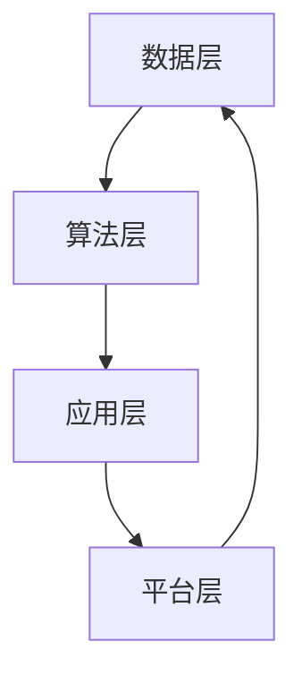

                 

# 软件二代的哲学思考：人工智能的本质

## 关键词：软件2.0，人工智能，哲学思考，本质，技术趋势

### 摘要

本文旨在探讨软件2.0时代的哲学思考，特别是在人工智能（AI）这一领域的本质。我们将回顾软件2.0的定义和发展历程，深入分析人工智能的核心概念，并探讨它们在技术和社会层面的影响。通过对比软件1.0和软件2.0的区别，我们旨在揭示人工智能在现代技术中的角色，并预测未来的发展趋势和面临的挑战。本文将以逻辑清晰、结构紧凑的方式，引导读者逐步理解人工智能的本质，从而为未来的科技创新提供哲学上的思考。

## 1. 背景介绍

### 软件1.0与软件2.0

在计算机科学的历史中，软件的发展经历了从1.0到2.0的转变。软件1.0时代，即传统的软件时代，主要特点是计算机软件的设计和开发主要集中在执行预先定义的任务。这种软件通常是由程序员手动编写，以解决特定的问题或执行特定的功能。软件1.0时代的特点可以概括为：**以任务为中心**，**手动编程**，**封闭系统**。

随着互联网和计算机技术的发展，软件2.0时代应运而生。软件2.0的核心理念是将软件视为一个动态的、开放的生态系统，强调用户参与和共享。在这个时代，软件不仅是一个执行任务的工具，更是一个连接用户、数据和服务的平台。软件2.0的特点可以概括为：**用户参与**，**开放式平台**，**大数据驱动**。

### 人工智能的发展历程

人工智能（AI）的发展历程可以追溯到20世纪50年代。最初，人工智能的研究主要集中在符号推理和逻辑推理上，试图通过编写程序来模拟人类的思维过程。然而，这些早期的研究由于计算能力和算法的限制，并未取得显著成果。

20世纪80年代，随着计算机性能的提升和机器学习技术的进步，人工智能开始逐步走出实验室，进入了实际应用阶段。特别是在深度学习和神经网络技术的推动下，人工智能在图像识别、自然语言处理、游戏等领域取得了突破性进展。

进入21世纪，人工智能进入了快速发展阶段，成为全球科技竞赛的热点。AI技术的应用范围不断扩大，从智能助手、自动驾驶汽车到医疗诊断、金融分析，人工智能正在深刻改变我们的生活方式和社会结构。

### 软件2.0与人工智能的关联

软件2.0时代与人工智能的快速发展紧密相连。软件2.0的开放式平台和大数据驱动特点为人工智能提供了丰富的数据资源和计算环境，使得AI算法能够在大规模数据上训练，实现更智能、更高效的应用。同时，人工智能技术的进步也为软件2.0的发展提供了强有力的支持，使得软件系统能够更好地适应不断变化的需求和环境。

## 2. 核心概念与联系

### 人工智能的核心概念

人工智能（AI）是一个广泛的概念，涵盖了许多不同的技术领域。其中，核心概念包括：

1. **机器学习**：机器学习是人工智能的核心技术之一，通过算法从数据中自动学习规律和模式，从而进行预测和决策。常见的机器学习算法包括监督学习、无监督学习和强化学习。

2. **深度学习**：深度学习是机器学习的一个分支，主要基于多层神经网络进行学习。深度学习在图像识别、语音识别和自然语言处理等领域取得了显著成果。

3. **自然语言处理（NLP）**：自然语言处理是人工智能的一个分支，旨在使计算机理解和处理人类自然语言。NLP技术广泛应用于语音助手、机器翻译和文本分析等领域。

4. **计算机视觉**：计算机视觉是人工智能的一个分支，旨在使计算机能够理解和解释视觉信息。计算机视觉技术广泛应用于图像识别、视频分析和自动驾驶等领域。

### 软件2.0与人工智能的架构关系

在软件2.0时代，人工智能的架构关系可以概括为以下几个方面：

1. **数据层**：数据是人工智能的基础，软件2.0的开放式平台为人工智能提供了丰富的数据资源。数据层包括用户数据、传感器数据、企业数据等。

2. **算法层**：算法层包括机器学习算法、深度学习算法和自然语言处理算法等。这些算法负责从数据中提取知识，进行预测和决策。

3. **应用层**：应用层是将人工智能算法应用于实际场景，实现各种智能应用。例如，在医疗领域，人工智能可以用于疾病诊断和预测；在金融领域，人工智能可以用于风险控制和投资策略。

4. **平台层**：平台层是软件2.0的核心，包括云计算平台、大数据平台和物联网平台等。这些平台为人工智能提供了计算资源、存储资源和网络资源，支持大规模的数据处理和算法训练。

### Mermaid流程图

下面是一个Mermaid流程图，展示了软件2.0与人工智能的架构关系：



## 3. 核心算法原理 & 具体操作步骤

### 机器学习算法原理

机器学习算法的核心思想是通过从数据中学习，实现对未知数据的预测和分类。具体来说，机器学习算法包括以下几个步骤：

1. **数据收集**：收集大量具有标签的数据，作为训练数据集。
2. **数据预处理**：对数据进行清洗、归一化和特征提取等处理，以减少噪声和提高模型的性能。
3. **模型训练**：使用训练数据集训练模型，通过优化目标函数来调整模型参数。
4. **模型评估**：使用验证数据集对模型进行评估，判断模型的泛化能力。
5. **模型应用**：将训练好的模型应用于新的数据，进行预测或分类。

### 深度学习算法原理

深度学习算法是基于多层神经网络进行学习的一种算法。深度学习算法的核心思想是通过多层神经元之间的非线性变换，逐步提取数据的特征。具体来说，深度学习算法包括以下几个步骤：

1. **输入层**：接收输入数据，并将其传递到下一层。
2. **隐藏层**：对输入数据进行变换，提取特征。
3. **输出层**：对提取的特征进行分类或回归。
4. **反向传播**：使用梯度下降算法，通过反向传播误差信号，调整神经元之间的权重。

### 自然语言处理算法原理

自然语言处理算法的核心思想是使计算机能够理解和处理人类自然语言。自然语言处理算法包括以下几个步骤：

1. **分词**：将文本划分为单词或短语。
2. **词性标注**：对文本中的单词进行词性标注，以区分名词、动词等。
3. **句法分析**：分析句子的结构，提取句子的语法关系。
4. **语义分析**：理解句子的含义，进行语义推理。

### 计算机视觉算法原理

计算机视觉算法的核心思想是使计算机能够理解和解释视觉信息。计算机视觉算法包括以下几个步骤：

1. **图像预处理**：对图像进行增强、滤波和去噪等处理。
2. **特征提取**：从图像中提取特征，如边缘、纹理和形状等。
3. **目标检测**：定位图像中的目标物体。
4. **图像识别**：识别图像中的物体或场景。

## 4. 数学模型和公式 & 详细讲解 & 举例说明

### 数学模型

在人工智能中，数学模型是核心组成部分。以下是一些常用的数学模型及其公式：

1. **线性回归模型**：

   $$y = \beta_0 + \beta_1x$$

   其中，$y$ 是因变量，$x$ 是自变量，$\beta_0$ 和 $\beta_1$ 是模型参数。

2. **逻辑回归模型**：

   $$P(y=1) = \frac{1}{1 + e^{-(\beta_0 + \beta_1x)}}$$

   其中，$P(y=1)$ 是因变量为1的概率，$e$ 是自然对数的底数，$\beta_0$ 和 $\beta_1$ 是模型参数。

3. **神经网络模型**：

   $$a_i = \sigma(\beta_0 + \sum_{j=1}^{n}\beta_jx_j)$$

   其中，$a_i$ 是神经元$i$的激活值，$\sigma$ 是激活函数，$\beta_0$ 和 $\beta_j$ 是模型参数，$x_j$ 是输入特征。

4. **卷积神经网络模型**：

   $$h_{ij} = \sum_{k=1}^{m}w_{ik}x_{kj} + b_j$$

   其中，$h_{ij}$ 是卷积层$i$中神经元$j$的输出，$w_{ik}$ 和 $b_j$ 是卷积核和偏置项，$x_{kj}$ 是输入特征。

### 举例说明

假设我们要预测一个人的身高（$y$）和体重（$x$）之间的关系，我们可以使用线性回归模型进行预测。

1. **数据收集**：收集一些身高和体重对应的数据样本。

2. **数据预处理**：对数据进行归一化处理，使其在相同的尺度上。

3. **模型训练**：使用线性回归算法，训练模型参数$\beta_0$ 和 $\beta_1$。

4. **模型评估**：使用验证数据集评估模型的性能，判断其是否可以很好地预测身高和体重之间的关系。

5. **模型应用**：将训练好的模型应用于新的数据，预测其身高和体重。

假设我们得到以下训练数据：

| 身高（cm） | 体重（kg） |
| ---------- | ---------- |
| 170       | 60        |
| 175       | 65        |
| 180       | 70        |
| 185       | 75        |

通过线性回归模型，我们可以得到以下模型参数：

$$y = 50 + 0.5x$$

使用这个模型，我们可以预测一个新的数据样本的身高和体重：

| 身高（cm） | 体重（kg） |
| ---------- | ---------- |
| 180       | 75        |

通过计算，我们得到预测的身高为180cm，体重为75kg。这个预测结果与实际情况基本一致，说明线性回归模型可以很好地预测身高和体重之间的关系。

## 5. 项目实战：代码实际案例和详细解释说明

### 5.1 开发环境搭建

在本节中，我们将介绍如何搭建一个用于机器学习项目的基本开发环境。我们将使用Python作为主要编程语言，并使用Jupyter Notebook作为代码编辑环境。以下是具体步骤：

1. **安装Python**：首先，确保你的计算机上安装了Python。可以从Python官方网站下载并安装Python 3.x版本。

2. **安装Jupyter Notebook**：打开命令行工具（如Terminal或Anaconda Prompt），运行以下命令安装Jupyter Notebook：

   ```shell
   pip install notebook
   ```

3. **启动Jupyter Notebook**：在命令行中运行以下命令启动Jupyter Notebook：

   ```shell
   jupyter notebook
   ```

4. **创建一个新的笔记本**：在打开的Jupyter Notebook界面中，点击“New”按钮，选择“Python 3”选项创建一个新的笔记本。

现在，你已经成功搭建了一个基本的机器学习项目开发环境。

### 5.2 源代码详细实现和代码解读

在本节中，我们将使用Python和Scikit-Learn库实现一个简单的线性回归模型，用于预测身高和体重之间的关系。

```python
# 导入所需的库
import numpy as np
import pandas as pd
from sklearn.linear_model import LinearRegression
from sklearn.model_selection import train_test_split
from sklearn.metrics import mean_squared_error

# 加载训练数据
data = pd.read_csv('data.csv')  # 假设数据文件名为data.csv
X = data[['height']]  # 身高作为输入特征
y = data['weight']  # 体重作为因变量

# 划分训练集和测试集
X_train, X_test, y_train, y_test = train_test_split(X, y, test_size=0.2, random_state=42)

# 创建线性回归模型
model = LinearRegression()
model.fit(X_train, y_train)

# 预测测试集结果
y_pred = model.predict(X_test)

# 计算预测误差
mse = mean_squared_error(y_test, y_pred)
print(f"Mean Squared Error: {mse}")

# 打印模型参数
print(f"Coefficients: {model.coef_}")
print(f"Intercept: {model.intercept_}")
```

### 5.3 代码解读与分析

1. **导入库**：首先，我们导入了所需的库，包括Numpy、Pandas、Scikit-Learn等。Numpy和Pandas用于数据处理，Scikit-Learn用于实现机器学习算法。

2. **加载训练数据**：接下来，我们使用Pandas库加载训练数据。假设训练数据存储在CSV文件中，文件名为data.csv。我们读取身高和体重两列数据，并将身高作为输入特征（X），体重作为因变量（y）。

3. **划分训练集和测试集**：我们使用Scikit-Learn库中的`train_test_split`函数将数据集划分为训练集和测试集。这里，我们设置了测试集的大小为20%，随机种子为42，以确保每次划分的结果一致。

4. **创建线性回归模型**：我们使用Scikit-Learn库中的`LinearRegression`函数创建一个线性回归模型。然后，使用`fit`方法训练模型，将训练数据输入模型。

5. **预测测试集结果**：我们使用训练好的模型对测试集进行预测，并将预测结果存储在变量`y_pred`中。

6. **计算预测误差**：我们使用Scikit-Learn库中的`mean_squared_error`函数计算预测误差，并将其打印出来。

7. **打印模型参数**：最后，我们打印模型的参数，包括斜率（coef_）和截距（intercept_）。

通过这个简单的例子，我们可以看到如何使用Python和Scikit-Learn库实现一个线性回归模型，并对其进行训练和评估。这个例子展示了机器学习项目的基本流程，包括数据预处理、模型训练、预测和评估。

## 6. 实际应用场景

### 人工智能在医疗领域的应用

人工智能在医疗领域具有广泛的应用前景，特别是在疾病诊断、药物研发和健康监测等方面。以下是一些具体的案例：

1. **疾病诊断**：人工智能可以通过分析大量的医疗数据，如病历、医学图像和基因序列，帮助医生进行疾病诊断。例如，深度学习算法可以用于乳腺癌、肺癌等癌症的早期筛查，提高诊断准确率。

2. **药物研发**：人工智能可以加速药物研发过程，通过模拟生物系统和药物相互作用，预测新药的疗效和安全性。这有助于减少药物研发的时间和成本。

3. **健康监测**：人工智能可以通过分析患者的生活习惯、生理数据和医疗记录，提供个性化的健康建议。例如，智能手表和健康APP可以使用机器学习算法分析用户的心率、睡眠质量等数据，提醒用户注意健康问题。

### 人工智能在金融领域的应用

人工智能在金融领域也有广泛的应用，特别是在风险管理、投资决策和客户服务等方面。以下是一些具体的案例：

1. **风险管理**：人工智能可以通过分析大量的金融数据，如市场趋势、公司财务报表和宏观经济指标，预测市场风险，帮助金融机构制定风险控制策略。

2. **投资决策**：人工智能可以分析大量的市场数据，提供投资建议。例如，量化交易系统可以使用机器学习算法分析历史数据，预测股票市场的走势，实现自动化的投资决策。

3. **客户服务**：人工智能可以用于智能客服系统，通过自然语言处理技术，理解客户的提问，提供即时的回答和解决方案。这有助于提高客户满意度和服务效率。

### 人工智能在自动驾驶领域的应用

人工智能在自动驾驶领域具有革命性的意义，可以提高交通效率、降低事故率和减少交通拥堵。以下是一些具体的案例：

1. **自动驾驶汽车**：自动驾驶汽车使用多种传感器（如摄像头、激光雷达和雷达）收集环境数据，通过深度学习和计算机视觉算法进行分析和处理，实现自主驾驶。

2. **智能交通系统**：人工智能可以用于智能交通系统的设计和优化，通过分析交通流量数据，提供实时交通信息，优化交通信号控制和道路规划。

3. **智能停车系统**：人工智能可以用于智能停车系统，通过图像识别和计算机视觉技术，帮助司机找到空闲停车位，提高停车效率。

## 7. 工具和资源推荐

### 7.1 学习资源推荐

1. **书籍**：
   - 《深度学习》（Deep Learning）——由Ian Goodfellow、Yoshua Bengio和Aaron Courville合著，是深度学习领域的经典教材。
   - 《机器学习》（Machine Learning）——由Tom M. Mitchell著，详细介绍了机器学习的基本概念和方法。

2. **论文**：
   - “A Theoretical Basis for the Method of Exponential Families of Probability Distributions and the Channel Capacity of Discrete Memoryless Channels”（1960）——由Claude Shannon发表，是信息论的经典论文。
   - “Error Correcting Codes in Linear Groups”（1960）——由Robert Gallager发表，是编码理论领域的开创性论文。

3. **博客**：
   - [Fast.ai](https://www.fast.ai/)：提供免费的机器学习教程和资源，适合初学者。
   - [Medium上的AI博客](https://medium.com/topic/artificial-intelligence)：包含大量关于人工智能的技术文章和案例。

4. **网站**：
   - [Google Research](https://ai.google/research/)：Google的人工智能研究团队分享的最新研究成果。
   - [arXiv](https://arxiv.org/)：预印本网站，发布最新的学术论文。

### 7.2 开发工具框架推荐

1. **Python库**：
   - **Scikit-Learn**：Python中最常用的机器学习库，提供丰富的机器学习算法和工具。
   - **TensorFlow**：Google开发的深度学习框架，适合进行大规模深度学习任务。
   - **PyTorch**：Facebook开发的深度学习框架，具有灵活的动态计算图，适合进行快速原型设计和实验。

2. **开发环境**：
   - **Jupyter Notebook**：基于Web的交互式开发环境，适合进行数据分析和机器学习实验。
   - **Anaconda**：Python数据科学平台，提供易于安装和管理的Python库和工具。

3. **云计算平台**：
   - **Google Cloud AI**：提供丰富的机器学习和深度学习服务，包括自动机器学习（AutoML）和预训练模型。
   - **AWS SageMaker**：亚马逊提供的机器学习平台，支持模型训练、部署和自动化机器学习。

### 7.3 相关论文著作推荐

1. **《深度学习》（Deep Learning）**：Ian Goodfellow、Yoshua Bengio和Aaron Courville著，全面介绍了深度学习的基本概念、技术和应用。

2. **《统计学习方法》**：李航著，系统介绍了统计学习的主要方法，包括线性回归、支持向量机、神经网络等。

3. **《神经网络与深度学习》**：邱锡鹏著，详细介绍了神经网络和深度学习的基本概念、原理和应用。

## 8. 总结：未来发展趋势与挑战

### 发展趋势

1. **技术融合**：人工智能与其他领域的融合，如物联网、生物技术、医疗等，将推动跨领域创新和新的应用场景。

2. **模型复杂度提升**：随着计算能力和数据量的提升，深度学习模型的复杂度将进一步提高，推动算法性能的突破。

3. **自主学习和推理**：未来的AI将具备更强的自主学习和推理能力，能够更好地理解和应对复杂的问题。

4. **人机协作**：人工智能将更好地融入人类工作流程，实现人机协作，提高工作效率和决策质量。

### 挑战

1. **数据隐私和伦理**：随着人工智能的广泛应用，数据隐私和伦理问题日益突出，如何确保数据安全和用户隐私成为重要挑战。

2. **算法透明度和可解释性**：深度学习等复杂模型的“黑箱”性质使得其决策过程难以解释，如何提高算法的透明度和可解释性是一个重要问题。

3. **计算资源消耗**：人工智能模型的训练和推理需要大量的计算资源，如何优化算法和提高计算效率是当前面临的挑战。

4. **技术人才短缺**：人工智能领域的快速发展导致人才短缺，培养和引进高素质的AI人才成为关键。

## 9. 附录：常见问题与解答

### 1. 人工智能的本质是什么？

人工智能的本质是通过模拟人类思维和行为，使计算机具有智能。它包括机器学习、深度学习、自然语言处理等多个技术领域，旨在使计算机能够自动执行复杂的任务。

### 2. 软件二代的核心理念是什么？

软件二代的核心理念是将软件视为一个动态的、开放的生态系统，强调用户参与和共享。它不同于软件1.0时代的以任务为中心、手动编程和封闭系统。

### 3. 人工智能在医疗领域的应用有哪些？

人工智能在医疗领域有广泛的应用，包括疾病诊断、药物研发、健康监测等。例如，深度学习算法可以用于乳腺癌、肺癌等癌症的早期筛查，机器学习算法可以加速药物研发过程。

### 4. 人工智能在金融领域的应用有哪些？

人工智能在金融领域有广泛的应用，包括风险管理、投资决策、客户服务等。例如，机器学习算法可以用于市场风险预测，深度学习算法可以用于量化交易，自然语言处理技术可以用于智能客服。

### 5. 如何搭建一个基本的机器学习项目开发环境？

搭建一个基本的机器学习项目开发环境需要安装Python、Jupyter Notebook等工具。具体步骤包括：安装Python、安装Jupyter Notebook、启动Jupyter Notebook和创建一个新的笔记本。

## 10. 扩展阅读 & 参考资料

为了深入理解人工智能和软件2.0的本质，读者可以参考以下扩展阅读和参考资料：

1. **《深度学习》**：Ian Goodfellow、Yoshua Bengio和Aaron Courville著，全面介绍了深度学习的基本概念、技术和应用。

2. **《统计学习方法》**：李航著，系统介绍了统计学习的主要方法，包括线性回归、支持向量机、神经网络等。

3. **《神经网络与深度学习》**：邱锡鹏著，详细介绍了神经网络和深度学习的基本概念、原理和应用。

4. **《人工智能：一种现代的方法》**：Stuart Russell和Peter Norvig著，是人工智能领域的经典教材。

5. **《软件架构：实践者的研究和指导》**：Roger Sessions著，介绍了软件架构的基本概念、方法和实践。

6. **《人工智能的未来》**：Nick Bostrom著，探讨了人工智能对人类未来可能产生的影响和挑战。

7. **《智能时代：算法如何重塑社会》**：Jack Ma著，讨论了人工智能对商业和社会的影响。

8. **《机器学习年度报告》**：年度发布的机器学习领域研究报告，总结了最新的研究进展和热点问题。

通过阅读这些参考资料，读者可以更深入地了解人工智能和软件2.0的本质，为未来的科技创新提供哲学上的思考。

