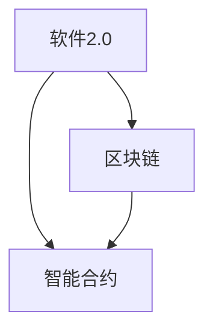

                 

# 软件2.0的应用：从实验室走向现实

> 关键词：软件2.0、区块链、智能合约、去中心化、应用场景、实践案例、未来趋势

> 摘要：本文将探讨软件2.0的概念、核心原理及其应用场景，并通过具体实践案例分析，探讨软件2.0如何从实验室走向现实，以及其未来的发展趋势和挑战。

## 1. 背景介绍

软件2.0是近年来在区块链和去中心化领域提出的一个新概念。它是对传统软件（即软件1.0）的升级和扩展，旨在解决传统软件在安全性、透明度、去中心化等方面的局限性。软件2.0的核心是智能合约，它是一种自动执行的合同，能够在区块链上实现去中心化的业务流程。

随着区块链技术的不断成熟，软件2.0的应用场景也在不断拓展。从金融、供应链到游戏、社交，软件2.0都在发挥着重要的作用。本文将通过对软件2.0的核心概念、应用场景和实践案例的深入探讨，帮助读者了解软件2.0的现状及其未来发展。

## 2. 核心概念与联系

### 2.1 软件2.0的定义

软件2.0是一种基于区块链和智能合约的去中心化软件，它能够在无需信任的环境下自动执行业务流程，确保数据的透明性和安全性。与传统软件不同，软件2.0不仅具备功能性的特点，还具备经济激励和自治理的特性。

### 2.2 区块链

区块链是一种分布式数据库技术，它能够确保数据的不可篡改性和透明性。区块链通过去中心化的方式，避免了单点故障和中心化风险，从而提高了系统的安全性和稳定性。

### 2.3 智能合约

智能合约是一种自动执行的合同，它能够根据预设的条件，自动执行相应的业务逻辑。智能合约使业务流程更加透明、高效，并减少了人工干预和信任成本。

### 2.4 软件2.0与区块链、智能合约的关系

软件2.0是区块链和智能合约技术的应用，它将区块链的去中心化和智能合约的自动执行功能结合起来，为去中心化的业务流程提供了可能。

下面是软件2.0、区块链和智能合约之间的 Mermaid 流程图：



## 3. 核心算法原理 & 具体操作步骤

### 3.1 区块链算法原理

区块链算法主要包括工作量证明（Proof of Work, PoW）、权益证明（Proof of Stake, PoS）等。这些算法确保了区块链的安全性和去中心化。

- **工作量证明（PoW）**：通过计算难题确保区块链的参与者（矿工）在竞争记账权时需要消耗计算资源。这样，矿工无法通过恶意攻击来控制区块链。
- **权益证明（PoS）**：通过持有代币的数量和持有时间来决定记账权。持有代币越多、持有时间越长，记账权的概率越高。

### 3.2 智能合约算法原理

智能合约算法主要包括状态机、条件分支等。这些算法使得智能合约能够根据输入条件自动执行相应的业务逻辑。

- **状态机**：智能合约可以被视为一个状态机，它根据当前状态和输入条件，执行相应的操作，并更新状态。
- **条件分支**：智能合约可以根据预设的条件，执行不同的操作。例如，如果某个条件满足，则执行操作A，否则执行操作B。

### 3.3 软件2.0的操作步骤

- **需求分析**：明确软件2.0的应用场景和需求。
- **设计智能合约**：根据需求设计智能合约，确定智能合约的功能和逻辑。
- **编写智能合约代码**：使用Solidity等智能合约编程语言，编写智能合约代码。
- **部署智能合约**：将智能合约部署到区块链上，使其具有执行能力。
- **测试和优化**：对智能合约进行测试和优化，确保其稳定性和安全性。
- **应用部署**：将智能合约应用部署到实际场景中，实现去中心化的业务流程。

## 4. 数学模型和公式 & 详细讲解 & 举例说明

### 4.1 区块链的数学模型

区块链的数学模型主要包括哈希函数、工作量证明算法等。

- **哈希函数**：哈希函数是一种将输入数据映射为固定长度的字符串的函数。例如，SHA-256是一种常用的哈希函数。
- **工作量证明算法**：工作量证明算法是一种确保区块链参与者在竞争记账权时需要消耗计算资源的算法。例如，比特币采用的工作量证明算法是PoW算法。

### 4.2 智能合约的数学模型

智能合约的数学模型主要包括状态机模型、条件分支模型等。

- **状态机模型**：状态机模型描述了智能合约的状态和转换。每个状态对应一个特定的业务逻辑。
- **条件分支模型**：条件分支模型描述了智能合约根据输入条件执行不同操作的过程。

### 4.3 举例说明

假设我们设计一个简单的智能合约，用于管理一个共享账本。该智能合约的核心功能是记录交易，并确保数据的不可篡改性。

```solidity
pragma solidity ^0.8.0;

contract ShareLedger {
    mapping(address => mapping(address => uint256)) public balances;

    function deposit(address sender, address receiver, uint256 amount) public {
        balances[sender][receiver] += amount;
    }

    function withdraw(address sender, address receiver, uint256 amount) public {
        require(balances[sender][receiver] >= amount, "Insufficient balance");
        balances[sender][receiver] -= amount;
    }
}
```

上述智能合约使用Solidity语言编写。它包含两个核心函数：`deposit` 和 `withdraw`。`deposit` 函数用于记录交易，`withdraw` 函数用于提现。

## 5. 项目实战：代码实际案例和详细解释说明

### 5.1 开发环境搭建

要开发一个基于区块链的智能合约项目，首先需要搭建开发环境。以下是搭建开发环境的具体步骤：

1. 安装Node.js：从官方网站下载并安装Node.js。
2. 安装Truffle：通过npm命令安装Truffle。

```shell
npm install -g truffle
```

3. 创建一个Truffle项目：

```shell
truffle init
```

4. 配置项目网络：编辑`truffle-config.js`文件，配置项目使用的区块链网络。

```javascript
module.exports = {
    networks: {
        development: {
            host: "127.0.0.1",
            port: 8545,
            network_id: "*",
        },
        // 其他网络配置
    },
};
```

### 5.2 源代码详细实现和代码解读

以一个简单的共享账本为例，详细介绍智能合约的实现过程。

```solidity
pragma solidity ^0.8.0;

contract ShareLedger {
    mapping(address => mapping(address => uint256)) public balances;

    function deposit(address sender, address receiver, uint256 amount) public {
        balances[sender][receiver] += amount;
    }

    function withdraw(address sender, address receiver, uint256 amount) public {
        require(balances[sender][receiver] >= amount, "Insufficient balance");
        balances[sender][receiver] -= amount;
    }
}
```

**代码解读：**

1. `pragma solidity ^0.8.0;`：指定编译器版本，确保智能合约能够兼容最新的Solidity特性。
2. `contract ShareLedger`：定义一个名为 `ShareLedger` 的智能合约。
3. `mapping(address => mapping(address => uint256)) public balances;`：定义一个映射，用于记录每个地址与其他地址之间的交易金额。
4. `function deposit(address sender, address receiver, uint256 amount) public`：定义一个 `deposit` 函数，用于记录交易。
5. `function withdraw(address sender, address receiver, uint256 amount) public`：定义一个 `withdraw` 函数，用于提现。

### 5.3 代码解读与分析

**安全性分析：**

1. `deposit` 函数：确保交易金额正确记录，不会导致余额溢出。
2. `withdraw` 函数：确保提现金额不会超过账户余额，避免资金漏洞。

**性能分析：**

1. 映射数据结构：虽然映射数据结构在读取和写入操作上具有较高的性能，但在存储空间上可能会有所浪费。

## 6. 实际应用场景

软件2.0的应用场景非常广泛，以下是一些典型的应用场景：

1. **金融领域**：区块链和智能合约技术可以用于金融交易、支付结算、资产管理等。例如，比特币和以太坊等加密货币就是基于区块链技术实现的。
2. **供应链管理**：区块链技术可以确保供应链数据的透明性和不可篡改性，有助于提高供应链管理的效率和可信度。
3. **版权保护**：区块链技术可以用于版权保护，确保作品的原创性和所有权归属。
4. **物联网**：区块链技术可以用于物联网设备的认证、数据传输等，提高物联网系统的安全性和可靠性。
5. **游戏领域**：区块链技术可以用于游戏资产的创建、交易和验证，提高游戏的可玩性和公平性。

## 7. 工具和资源推荐

### 7.1 学习资源推荐

1. **书籍**：
   - 《区块链技术指南》
   - 《智能合约：设计与开发》
   - 《精通以太坊》
2. **论文**：
   - 《比特币：一种点对点的电子现金系统》
   - 《以太坊黄皮书》
3. **博客**：
   - Ethereum官方博客
   - Blockchain官方博客
4. **网站**：
   - Etherscan.io：用于查看以太坊区块链上的智能合约和交易
   - Blockchain.com：提供区块链相关的新闻、教程和资源

### 7.2 开发工具框架推荐

1. **Truffle**：用于智能合约开发和测试
2. **Ganache**：用于本地区块链开发和测试
3. **Hardhat**：用于智能合约开发和测试，具有较高的性能和灵活性
4. **Remix**：在线智能合约开发工具，支持Solidity等编程语言

### 7.3 相关论文著作推荐

1. **论文**：
   - 《区块链：从理论到实践》
   - 《智能合约安全性分析》
   - 《区块链技术在供应链管理中的应用研究》
2. **著作**：
   - 《区块链革命》
   - 《智能合约编程》

## 8. 总结：未来发展趋势与挑战

软件2.0作为一种新兴技术，正逐渐从实验室走向现实。未来，随着区块链技术的不断成熟和应用的深入，软件2.0有望在金融、供应链、物联网、版权保护等领域发挥更大的作用。然而，软件2.0的发展也面临着一系列挑战，如安全性、性能、法律法规等方面的挑战。只有克服这些挑战，软件2.0才能真正实现其潜力。

## 9. 附录：常见问题与解答

### 9.1 什么是区块链？

区块链是一种分布式数据库技术，它能够确保数据的不可篡改性和透明性。区块链通过去中心化的方式，避免了单点故障和中心化风险，从而提高了系统的安全性和稳定性。

### 9.2 什么是智能合约？

智能合约是一种自动执行的合同，它能够在区块链上实现去中心化的业务流程。智能合约使业务流程更加透明、高效，并减少了人工干预和信任成本。

### 9.3 区块链有哪些应用场景？

区块链的应用场景非常广泛，包括金融、供应链、版权保护、物联网、游戏等领域。区块链技术可以用于金融交易、支付结算、资产管理、数据传输等。

## 10. 扩展阅读 & 参考资料

1. **书籍**：
   - 《区块链技术指南》
   - 《智能合约：设计与开发》
   - 《精通以太坊》
2. **论文**：
   - 《比特币：一种点对点的电子现金系统》
   - 《以太坊黄皮书》
3. **博客**：
   - Ethereum官方博客
   - Blockchain官方博客
4. **网站**：
   - Etherscan.io
   - Blockchain.com
5. **在线教程**：
   - Truffle官方教程
   - Hardhat官方教程
   - Remix官方教程

---

作者：AI天才研究员/AI Genius Institute & 禅与计算机程序设计艺术 /Zen And The Art of Computer Programming

以上是关于“软件2.0的应用：从实验室走向现实”的技术博客文章。希望这篇文章能够帮助您更好地了解软件2.0的概念、应用场景和实践案例。在未来的发展中，软件2.0有望为各行各业带来巨大的变革。让我们共同期待这一天的到来！

