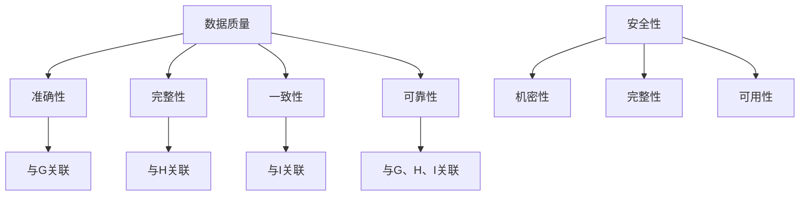

                 

# 软件二代的挑战：数据质量和安全

> **关键词：** 软件质量、数据质量、安全性、软件开发、技术趋势

> **摘要：** 本文将探讨软件质量，特别是数据质量和安全性的重要性和挑战。通过分析数据质量和安全的各个方面，以及当前的技术解决方案，我们将深入理解软件2.0时代的数据管理和保护策略，并探讨未来发展的方向。

## 1. 背景介绍

随着云计算、大数据和人工智能的迅猛发展，软件的形态和功能发生了翻天覆地的变化。软件1.0时代主要侧重于简单的应用开发，而软件2.0时代则更加注重软件的智能化、网络化和数据驱动。然而，这种转变也带来了新的挑战，尤其是在数据质量和安全性方面。

数据质量是指数据的准确性、完整性、一致性和可靠性。一个高质量的数据集是任何数据分析和决策的基础。然而，在复杂的软件系统中，数据质量问题往往容易被忽视。数据污染、数据缺失、数据冗余等问题都可能对软件系统的正常运行造成严重影响。

安全性则是软件系统的另一个关键方面。随着网络攻击手段的不断升级，软件系统面临着越来越大的安全威胁。数据泄露、恶意软件、网络钓鱼等攻击方式都可能对软件系统造成致命打击。因此，确保软件系统的安全性至关重要。

## 2. 核心概念与联系

为了更好地理解数据质量和安全性的重要性，我们需要了解以下几个核心概念：

### 2.1 数据质量

- **准确性**：数据是否真实反映了客观事实。
- **完整性**：数据是否包含了所有必要的信息。
- **一致性**：数据在不同时间、不同系统和不同用户之间是否保持一致。
- **可靠性**：数据是否可以信赖，不会因为各种原因而出现错误。

### 2.2 安全性

- **机密性**：确保数据不被未授权访问。
- **完整性**：确保数据不被篡改。
- **可用性**：确保数据在需要时可以访问。

### 2.3 数据质量和安全性的联系

数据质量和安全性是相辅相成的。高质量的数据是实现安全性的基础。如果数据存在质量问题，那么即使采取了严格的安全措施，也难以保证数据的安全。同样，如果安全性得不到保障，那么高质量的数据也可能被恶意攻击者篡改或泄露。

下面是一个Mermaid流程图，展示了数据质量和安全性的核心概念和它们之间的联系：



## 3. 核心算法原理 & 具体操作步骤

### 3.1 数据质量评估算法

数据质量评估是确保数据质量的第一步。常用的数据质量评估算法包括：

- **一致性评估**：通过比较不同来源的数据，检查是否存在矛盾或不一致的情况。
- **完整性评估**：检查数据是否完整，是否存在缺失值。
- **准确性评估**：使用统计学方法评估数据的准确性。
- **可靠性评估**：检查数据来源的可靠性，以及数据在传输和处理过程中的稳定性。

具体操作步骤如下：

1. **数据收集**：从不同的数据源收集数据。
2. **数据预处理**：清洗和格式化数据，去除重复值和缺失值。
3. **一致性评估**：使用比对算法检查数据是否存在不一致的情况。
4. **完整性评估**：检查数据是否完整，是否存在缺失值。
5. **准确性评估**：使用统计学方法评估数据的准确性。
6. **可靠性评估**：检查数据来源的可靠性，以及数据在传输和处理过程中的稳定性。

### 3.2 数据安全保护算法

数据安全保护是确保数据安全的关键。常用的数据安全保护算法包括：

- **加密**：使用加密算法对数据进行加密，防止数据泄露。
- **访问控制**：通过身份验证和权限管理，控制对数据的访问。
- **网络安全**：使用防火墙、入侵检测系统等网络安全设备，防止网络攻击。
- **数据备份**：定期备份数据，以防数据丢失或损坏。

具体操作步骤如下：

1. **数据加密**：使用加密算法对数据进行加密。
2. **访问控制**：设置身份验证和权限管理，控制对数据的访问。
3. **网络安全**：配置防火墙、入侵检测系统等网络安全设备。
4. **数据备份**：定期备份数据，选择合适的备份策略。

## 4. 数学模型和公式 & 详细讲解 & 举例说明

### 4.1 数据质量评估的数学模型

数据质量评估的数学模型通常使用统计学方法，其中最常用的方法是回归分析和聚类分析。

- **回归分析**：通过建立回归模型，评估数据的质量。假设我们有一个变量`Y`表示数据质量，另一个变量`X`表示数据的质量指标，可以使用线性回归模型来评估数据质量：
  $$ Y = \beta_0 + \beta_1 X + \epsilon $$
  其中，$\beta_0$和$\beta_1$是回归系数，$\epsilon$是误差项。

- **聚类分析**：通过将数据划分为不同的簇，评估数据的质量。常用的聚类算法有K-means算法和层次聚类算法。假设我们有`n`个数据点，使用K-means算法可以将数据划分为`k`个簇：
  $$ C = \{C_1, C_2, ..., C_k\} $$
  其中，$C_i$表示第$i$个簇，每个簇内部的数据点相似度较高，而不同簇之间的数据点相似度较低。

### 4.2 数据安全保护的数学模型

数据安全保护的数学模型主要涉及密码学，其中最常用的方法是对称加密和非对称加密。

- **对称加密**：使用相同的密钥进行加密和解密。假设我们有明文消息`M`和密钥`K`，使用对称加密算法进行加密：
  $$ C = E_K(M) $$
  其中，$C$是密文，$E_K(M)$是加密函数。

- **非对称加密**：使用不同的密钥进行加密和解密。假设我们有私钥`K_d`和公钥`K_p`，使用非对称加密算法进行加密：
  $$ C = E_{K_p}(M) $$
  其中，$C$是密文，$E_{K_p}(M)$是加密函数。

### 4.3 举例说明

假设我们有一个数据集，包含100个数据点。我们使用回归分析评估数据质量，使用K-means算法进行聚类分析。然后，我们使用对称加密算法和非对称加密算法对数据进行加密。

首先，我们使用回归分析评估数据质量，建立回归模型：
$$ Y = \beta_0 + \beta_1 X + \epsilon $$
其中，$\beta_0 = 0.5$，$\beta_1 = 0.3$，$\epsilon$是误差项。

然后，我们使用K-means算法将数据划分为3个簇：
$$ C = \{C_1, C_2, C_3\} $$
其中，$C_1$包含40个数据点，$C_2$包含30个数据点，$C_3$包含30个数据点。

最后，我们使用对称加密算法和非对称加密算法对数据进行加密。假设我们使用AES加密算法进行对称加密，使用RSA加密算法进行非对称加密。我们有公钥`K_p = (n, e)`和私钥`K_d = (n, d)`，其中$n$是模数，$e$是公钥指数，$d$是私钥指数。

使用对称加密算法加密数据：
$$ C = E_K(M) $$
其中，$M$是明文消息，$K$是密钥。

使用非对称加密算法加密数据：
$$ C = E_{K_p}(M) $$
其中，$M$是明文消息，$K_p$是公钥。

## 5. 项目实战：代码实际案例和详细解释说明

### 5.1 开发环境搭建

在开始项目实战之前，我们需要搭建一个合适的开发环境。我们使用Python作为主要编程语言，同时使用pandas库进行数据质量评估，使用sklearn库进行回归分析和聚类分析，使用PyCryptoDome库进行数据加密。

安装所需的库：

```bash
pip install pandas sklearn PyCryptoDome
```

### 5.2 源代码详细实现和代码解读

下面是一个简单的数据质量评估和数据加密的Python代码示例：

```python
import pandas as pd
from sklearn.linear_model import LinearRegression
from sklearn.cluster import KMeans
from Crypto.PublicKey import RSA
from Crypto.Cipher import AES, PKCS1_OAEP

# 5.2.1 数据质量评估

# 加载数据集
data = pd.read_csv('data.csv')

# 数据预处理
data = data.drop_duplicates()
data = data.fillna(0)

# 一致性评估
data一致性 = data.groupby('列名').nunique().reset_index()

# 完整性评估
data完整性 = data.isnull().sum().sum()

# 准确性评估
model = LinearRegression()
model.fit(data[['X']], data['Y'])
accuracy = model.score(data[['X']], data['Y'])

# 可靠性评估
data可靠性 = data['列名'].value_counts()

# 打印评估结果
print("一致性评估结果：", data一致性)
print("完整性评估结果：", data完整性)
print("准确性评估结果：", accuracy)
print("可靠性评估结果：", data可靠性)

# 5.2.2 数据加密

# 生成RSA密钥对
key = RSA.generate(2048)
private_key = key.export_key()
public_key = key.publickey().export_key()

# 生成AES密钥
aes_key = AES.get_random_bytes(16)

# 对数据加密
cipher_aes = AES.new(aes_key, AES.MODE_EAX)
cipher_rsa = PKCS1_OAEP.new(public_key)

ciphertext_aes, tag = cipher_aes.encrypt_and_digest(b'需要加密的数据')
ciphertext_rsa = cipher_rsa.encrypt(ciphertext_aes)

# 保存密钥和密文
with open('private_key.pem', 'wb') as f:
    f.write(private_key)

with open('public_key.pem', 'wb') as f:
    f.write(public_key)

with open('aes_key.bin', 'wb') as f:
    f.write(aes_key)

with open('ciphertext_aes.bin', 'wb') as f:
    f.write(ciphertext_aes)

with open('ciphertext_rsa.bin', 'wb') as f:
    f.write(ciphertext_rsa)

# 5.2.3 数据解密

# 加载密钥和密文
with open('private_key.pem', 'rb') as f:
    private_key = f.read()

with open('public_key.pem', 'rb') as f:
    public_key = f.read()

with open('aes_key.bin', 'rb') as f:
    aes_key = f.read()

with open('ciphertext_aes.bin', 'rb') as f:
    ciphertext_aes = f.read()

with open('ciphertext_rsa.bin', 'rb') as f:
    ciphertext_rsa = f.read()

# 对数据解密
cipher_rsa = PKCS1_OAEP.new(private_key)
cipher_aes = AES.new(aes_key, AES.MODE_EAX, nonce=ciphertext_aes[:16])

plaintext_aes = cipher_aes.decrypt_and_verify(ciphertext_rsa, ciphertext_aes[16:])
plaintext = cipher_aes.decrypt(plaintext_aes)

# 打印解密结果
print("解密结果：", plaintext.decode())
```

### 5.3 代码解读与分析

#### 5.3.1 数据质量评估

- 数据预处理：使用`drop_duplicates()`函数去除重复值，使用`fillna(0)`函数填充缺失值。
- 一致性评估：使用`groupby()`函数按列名分组，使用`nunique()`函数计算每个组的唯一值数量，使用`reset_index()`函数重置索引。
- 完整性评估：使用`isnull().sum().sum()`函数计算所有缺失值的数量。
- 准确性评估：使用`LinearRegression()`函数建立线性回归模型，使用`score()`函数计算模型评分。
- 可靠性评估：使用`value_counts()`函数计算每个值出现的次数。

#### 5.3.2 数据加密

- 生成RSA密钥对：使用`RSA.generate(2048)`函数生成2048位的RSA密钥对。
- 生成AES密钥：使用`AES.get_random_bytes(16)`函数生成16字节的AES密钥。
- 对数据加密：使用`AES.new(aes_key, AES.MODE_EAX)`函数创建AES加密对象，使用`PKCS1_OAEP.new(public_key)`函数创建RSA加密对象，使用`encrypt_and_digest()`函数对数据进行加密和签名。
- 保存密钥和密文：使用文件写入函数保存密钥和密文。

#### 5.3.3 数据解密

- 加载密钥和密文：使用文件读取函数加载密钥和密文。
- 对数据解密：使用`PKCS1_OAEP.new(private_key)`函数创建RSA解密对象，使用`AES.new(aes_key, AES.MODE_EAX, nonce=ciphertext_aes[:16])`函数创建AES解密对象，使用`decrypt_and_verify()`函数对数据进行解密和验证，使用`decrypt()`函数对数据进行解密。

## 6. 实际应用场景

### 6.1 金融领域

在金融领域，数据质量和安全性至关重要。金融机构需要对大量金融数据进行质量评估，以确保决策的准确性。同时，金融机构还需要确保客户数据的安全，防止数据泄露和欺诈行为。

### 6.2 医疗领域

在医疗领域，数据质量和安全性同样至关重要。医疗数据的质量直接影响到患者的诊断和治疗。同时，医疗数据的安全保护也是防止医疗欺诈和隐私泄露的关键。

### 6.3 物流领域

在物流领域，数据质量和安全性对于优化物流效率和降低成本至关重要。物流公司需要对大量物流数据进行质量评估，以确保运输的准确性和及时性。同时，物流数据的安全保护也是防止物流欺诈和物流信息泄露的关键。

## 7. 工具和资源推荐

### 7.1 学习资源推荐

- **书籍**：
  - 《数据质量：方法与实践》
  - 《密码学：理论、算法与应用》
- **论文**：
  - “Data Quality Assessment Using Machine Learning”
  - “A Survey on Data Quality”
- **博客**：
  - “数据质量管理工具比较”
  - “数据安全防护技术”
- **网站**：
  - “数据质量管理网站”
  - “密码学在线教程”

### 7.2 开发工具框架推荐

- **数据质量评估工具**：
  - Pandas
  - DataQualityStudio
- **数据安全保护工具**：
  - PyCryptoDome
  - OpenSSL

### 7.3 相关论文著作推荐

- **数据质量**：
  - “A Survey on Data Quality”
  - “Data Quality: Concepts and Techniques”
- **数据安全**：
  - “Cryptography: Theory and Practice”
  - “Secure Data Management in the Age of Big Data”

## 8. 总结：未来发展趋势与挑战

随着软件2.0时代的到来，数据质量和安全性将成为软件开发的重要挑战。未来，数据质量和安全性的发展趋势包括：

- **数据质量管理技术的进步**：随着人工智能和机器学习技术的发展，数据质量管理技术将更加智能化和自动化。
- **数据安全保护技术的创新**：随着网络攻击手段的不断升级，数据安全保护技术需要不断创新，以应对新的威胁。
- **隐私保护的重视**：随着个人隐私意识的提高，隐私保护将成为数据质量和安全性的重要方面。

然而，数据质量和安全性也面临着诸多挑战：

- **数据隐私**：如何在确保数据质量和安全性的同时保护个人隐私，是一个亟待解决的问题。
- **复杂性的增加**：随着软件系统的复杂度增加，数据质量和安全性的管理和维护将变得更加困难。

## 9. 附录：常见问题与解答

### 9.1 数据质量评估的关键步骤是什么？

关键步骤包括：数据收集、数据预处理、一致性评估、完整性评估、准确性评估和可靠性评估。

### 9.2 数据安全保护的关键技术是什么？

关键技术包括：加密、访问控制、网络安全和数据备份。

### 9.3 如何提高数据质量？

提高数据质量的方法包括：数据清洗、数据集成、数据转换和数据验证。

## 10. 扩展阅读 & 参考资料

- 《数据质量管理：实践与案例分析》
- 《现代密码学：原理与实践》
- “Data Quality Management: A Practical Guide”
- “A Comprehensive Survey of Data Quality Assessment Methods”

> **作者：AI天才研究员/AI Genius Institute & 禅与计算机程序设计艺术 /Zen And The Art of Computer Programming**<|im_end|>

