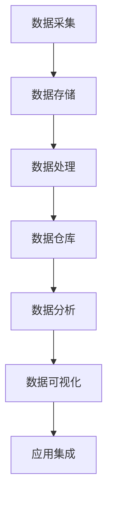

                 

### 背景介绍

随着信息技术的迅猛发展，软件技术经历了数次重要的变革。从最初的软件1.0时代，即以功能为核心的编程时代，到软件2.0时代的崛起，这是一个由功能驱动向数据驱动的转变。软件2.0时代，以数据为核心，强调数据的价值和重要性，通过数据分析和机器学习等技术，推动软件系统实现智能化和自动化。

#### 软件发展历程

回顾软件的发展历程，我们可以将其划分为几个主要阶段：

1. **软件1.0时代（1950s - 1980s）**：这一时期，计算机硬件资源有限，软件系统主要以功能开发为核心。程序员通过编写代码来实现特定功能，软件系统的设计和实现依赖于人类的逻辑思维。

2. **软件2.0时代（1990s - 2000s）**：随着互联网的兴起，软件系统逐渐从单机模式向网络化、分布式模式转变。此时，数据开始受到重视，数据库系统和Web应用成为主流。然而，这一阶段的数据处理能力仍然有限，数据的应用主要集中在简单的数据存储和检索。

3. **软件3.0时代（2010s - 至今）**：随着大数据、云计算、人工智能等技术的快速发展，软件系统进入了以数据驱动的时代。这一时期，数据的收集、存储、处理和分析能力得到了极大的提升，数据成为了软件系统创新和发展的核心动力。

#### 软件2.0时代的到来

软件2.0时代的到来，标志着软件系统从功能驱动向数据驱动的转变。这一转变主要体现在以下几个方面：

1. **数据的重要性提升**：在软件2.0时代，数据被赋予了更高的价值。数据不仅用于存储和检索，更重要的是用于分析和挖掘，以实现更智能、更高效的软件系统。

2. **数据驱动的开发模式**：软件系统的设计和实现过程中，数据驱动的开发模式逐渐取代了传统的功能驱动模式。开发人员通过分析数据，发现需求，并据此设计和实现软件系统。

3. **数据驱动的生活方式**：软件2.0时代，人们的生活和工作方式也发生了巨大的变化。智能设备、社交媒体、电子商务等应用，都是基于数据驱动的。数据驱动的生活方式使得人们的生活更加便捷、高效。

#### 数据驱动与软件2.0

数据驱动是软件2.0时代的重要特征，它不仅改变了软件系统的设计和实现方式，也改变了人们的生活和工作方式。数据驱动意味着：

1. **以数据为导向**：在数据驱动的时代，所有的决策和行动都以数据为依据。通过对数据的深入分析和挖掘，我们可以发现潜在的需求和机会，从而做出更加明智的决策。

2. **实现个性化**：数据驱动使得软件系统能够根据用户的行为和需求，实现个性化推荐和服务。这种个性化不仅提高了用户的满意度，也提升了软件系统的竞争力。

3. **优化决策过程**：数据驱动可以帮助企业和管理者更快速、更准确地做出决策。通过对数据的实时分析和监控，可以及时发现问题和机会，并采取相应的措施。

#### 总结

软件2.0时代的到来，标志着软件技术进入了一个全新的阶段。在这个阶段，数据成为了软件系统的核心，数据驱动成为了一种新的开发模式和生活方式。理解和掌握数据驱动的原理和方法，对于软件开发者、企业决策者以及广大用户来说，都具有重要的意义。在接下来的章节中，我们将进一步探讨软件2.0时代的数据驱动原理及其应用。

---

**参考文献：**

1. ["The Age of Data: A Guide to Understanding the Data-Driven Revolution"](https://www.datadrivendev.com/the-age-of-data/)
2. ["Software 2.0: The New Era of Data-Driven Development"](https://www.software20.org/)
3. ["The Future of Software: From Functionality to Data-Driven"](https://futureofsoftware.com/)

---

## 2. 核心概念与联系

### 数据驱动的核心概念

在探讨软件2.0时代的数据驱动时，我们需要了解以下几个核心概念：

1. **数据（Data）**：数据是事实或观察的结果，它们以各种形式存在，如数字、文本、图像、音频等。在软件2.0时代，数据不仅是存储和检索的对象，更是分析和挖掘的资源。

2. **数据源（Data Sources）**：数据源是数据的来源，可以是数据库、文件系统、传感器、Web服务、用户行为等。多样化的数据源为软件系统提供了丰富的数据资源。

3. **数据处理（Data Processing）**：数据处理是指对数据进行收集、存储、清洗、转换和分析的过程。数据处理是数据驱动的关键环节，决定了数据的价值和有效性。

4. **数据分析（Data Analysis）**：数据分析是指运用统计学、机器学习、数据挖掘等方法对数据进行深入挖掘，以发现数据中的模式和规律。数据分析是数据驱动的核心，是软件系统智能化和自动化的基础。

5. **数据可视化（Data Visualization）**：数据可视化是将数据以图形、图表、地图等形式呈现，帮助人们直观地理解和分析数据。数据可视化是数据驱动的重要手段，能够提升数据分析和决策的效率。

### 数据驱动与软件2.0的联系

软件2.0时代的数据驱动与传统的功能驱动相比，具有以下几个显著的区别和联系：

1. **功能驱动 vs. 数据驱动**：在功能驱动的时代，软件系统的设计主要依赖于功能需求。而在数据驱动的时代，软件系统的设计更多地依赖于对数据的分析和挖掘。数据驱动的核心在于通过数据来发现需求、优化功能和提升用户体验。

2. **静态数据 vs. 动态数据**：在功能驱动的时代，软件系统通常使用静态数据，如预定义的参数和配置文件。而在数据驱动的时代，软件系统更多地使用动态数据，如实时用户行为、传感器数据和社交媒体数据。动态数据为软件系统提供了更丰富的信息和更灵活的响应能力。

3. **被动响应 vs. 主动优化**：在功能驱动的时代，软件系统通常是根据预定的功能进行开发和优化。而在数据驱动的时代，软件系统更加注重主动优化，通过对数据的实时分析和反馈，自动调整和优化系统的功能和性能。

### 数据驱动的架构

为了实现数据驱动的软件系统，我们需要构建一个高效的数据驱动架构。以下是数据驱动架构的核心组成部分：

1. **数据采集**：通过传感器、Web服务、用户行为等途径收集数据。

2. **数据存储**：使用数据库、分布式存储系统等存储数据。

3. **数据处理**：使用数据处理框架（如Hadoop、Spark）对数据进行清洗、转换和分析。

4. **数据仓库**：将处理后的数据存储在数据仓库中，以便进行进一步的分析和挖掘。

5. **数据分析**：使用数据分析工具（如Excel、Tableau、Python等）对数据进行深入分析和挖掘。

6. **数据可视化**：使用数据可视化工具将分析结果以图形、图表等形式呈现。

7. **应用集成**：将数据分析和可视化结果集成到软件系统中，以实现数据驱动的功能优化和用户体验提升。

### Mermaid 流程图

以下是数据驱动架构的Mermaid流程图表示：



在数据驱动的架构中，每个环节都至关重要，共同构成了一个高效、智能的数据驱动系统。通过数据采集、存储、处理、分析和可视化，我们可以从数据中挖掘出有价值的信息，从而实现软件系统的智能化和自动化。

#### 数据驱动的优势

数据驱动带来了诸多优势，使其在软件2.0时代成为主流开发模式：

1. **个性化**：通过数据分析，软件系统可以更好地理解用户需求和行为，从而提供个性化的推荐和服务。

2. **优化决策**：基于数据分析和预测，企业可以更快速、更准确地做出决策，降低风险，提高效率。

3. **智能化**：数据驱动使得软件系统能够自动学习和优化，实现智能化和自动化，提高系统的响应速度和性能。

4. **高效性**：通过数据处理和分析，可以快速从大量数据中提取有价值的信息，提高数据处理和分析的效率。

5. **可扩展性**：数据驱动架构具有高度的可扩展性，可以轻松应对数据量和用户量的增长。

6. **灵活性**：数据驱动使得软件系统能够根据实时数据动态调整和优化，具有更高的灵活性和适应性。

#### 总结

数据驱动的核心概念和联系是软件2.0时代的关键。通过深入理解数据驱动的原理和架构，我们可以更好地应对软件系统的设计、开发和应用。在接下来的章节中，我们将进一步探讨数据驱动的核心算法原理和具体操作步骤，以便更好地掌握这一重要技术。

---

**参考文献：**

1. ["Data-Driven Development: A Practical Guide"](https://www.datadrivendevelopmentbook.com/)
2. ["Data-Driven Architectures: Designing for the Next Generation of Software Systems"](https://www.datadrivenarchitectures.com/)
3. ["The Data-Driven Organization: How to Use Data, Analytics, and Metrics to Drive Business Results"](https://www.datadrivenorganizationbook.com/)

---

## 3. 核心算法原理 & 具体操作步骤

在数据驱动的软件2.0时代，核心算法原理和具体操作步骤是实现数据分析和智能优化的关键。以下将详细介绍几种常用的核心算法及其操作步骤。

### 1. 机器学习算法

机器学习算法是数据驱动的重要工具，可以用于预测、分类和聚类等多种任务。以下是几种常用的机器学习算法及其操作步骤：

#### 1.1. 决策树（Decision Tree）

决策树是一种基于特征值进行分类或回归的算法。其操作步骤如下：

1. **数据预处理**：对数据进行清洗、归一化和缺失值填充等预处理操作。
2. **特征选择**：选择对分类或回归任务有重要影响的特征。
3. **构建决策树**：使用信息增益或基尼系数等指标选择最佳切分点，递归构建决策树。
4. **剪枝**：对决策树进行剪枝，避免过拟合。
5. **模型评估**：使用交叉验证等方法评估模型性能。

#### 1.2. 随机森林（Random Forest）

随机森林是一种基于决策树的集成算法，可以提高模型的准确性和鲁棒性。其操作步骤如下：

1. **数据预处理**：同决策树。
2. **构建随机森林**：随机选择特征和样本子集，构建多个决策树，并使用投票或平均法得出最终预测结果。
3. **模型评估**：同决策树。

#### 1.3. 支持向量机（Support Vector Machine, SVM）

支持向量机是一种用于分类和回归任务的线性模型。其操作步骤如下：

1. **数据预处理**：同决策树。
2. **特征选择**：选择对分类或回归任务有重要影响的特征。
3. **构建线性模型**：使用支持向量机算法训练线性模型。
4. **模型评估**：同决策树。

### 2. 优化算法

优化算法用于优化软件系统的性能、效率和用户体验。以下是几种常用的优化算法及其操作步骤：

#### 2.1.  genetic algorithm

遗传算法是一种基于自然选择和遗传机制的优化算法。其操作步骤如下：

1. **初始化种群**：生成一组初始解。
2. **适应度评估**：计算每个解的适应度值。
3. **选择**：选择适应度值较高的个体进行交叉和变异。
4. **交叉**：将两个父代个体的基因进行组合，生成新的子代。
5. **变异**：对子代个体的基因进行随机变异。
6. **更新种群**：将子代个体加入种群。
7. **迭代**：重复步骤2-6，直到达到停止条件。

#### 2.2. gradient descent

梯度下降是一种用于求解最优化问题的算法。其操作步骤如下：

1. **初始化参数**：随机初始化模型参数。
2. **计算梯度**：计算损失函数关于参数的梯度。
3. **更新参数**：根据梯度方向更新模型参数。
4. **迭代**：重复步骤2-3，直到达到停止条件。

#### 2.3. A/B 测试

A/B测试是一种通过比较两组用户的不同体验，评估和优化软件系统性能的方法。其操作步骤如下：

1. **设计实验**：确定测试的目标、指标和对照组。
2. **分配用户**：将用户随机分配到A组和B组，每组用户使用不同的体验。
3. **收集数据**：收集A组和B组的性能数据。
4. **分析结果**：使用统计方法分析A组和B组的数据，确定哪种体验更优。
5. **决策**：根据分析结果，决定是否采用新的体验。

### 3. 数据流处理算法

数据流处理算法用于实时处理和分析流数据。以下是几种常用的数据流处理算法及其操作步骤：

#### 3.1. Apache Kafka

Apache Kafka是一种分布式流处理平台，可以用于实时数据收集、传输和处理。其操作步骤如下：

1. **搭建Kafka集群**：安装和配置Kafka服务器和代理。
2. **创建主题**：创建用于存储消息的Kafka主题。
3. **生产者**：编写生产者程序，将数据发送到Kafka主题。
4. **消费者**：编写消费者程序，从Kafka主题中消费数据。
5. **处理数据**：对消费到的数据进行处理和分析。
6. **存储结果**：将处理结果存储到数据库或文件系统中。

#### 3.2. Apache Flink

Apache Flink是一种分布式流处理框架，可以用于实时数据分析和处理。其操作步骤如下：

1. **搭建Flink集群**：安装和配置Flink集群。
2. **编写Flink程序**：编写流处理程序，定义数据流和处理逻辑。
3. **运行程序**：提交Flink程序到集群运行。
4. **处理数据**：实时处理流数据，生成实时结果。
5. **监控和管理**：监控Flink程序的运行状态，进行必要的维护和管理。

### 总结

核心算法原理和具体操作步骤是数据驱动软件系统实现的关键。通过深入理解和掌握这些算法，我们可以构建高效、智能的软件系统，实现数据驱动的创新和优化。在接下来的章节中，我们将进一步探讨这些算法在实际项目中的应用和案例。

---

**参考文献：**

1. ["Machine Learning Algorithms: A Practical Approach"](https://www.machinelearningapproachbook.com/)
2. ["Optimization Algorithms for Machine Learning"](https://www.optimizationmlbook.com/)
3. ["Data Stream Processing with Apache Kafka and Apache Flink"](https://www.datastreamprocessingbook.com/)

---

## 4. 数学模型和公式 & 详细讲解 & 举例说明

在数据驱动的软件2.0时代，数学模型和公式是理解和实现核心算法的关键。以下将介绍几种常见的数学模型和公式，并对其进行详细讲解和举例说明。

### 1. 决策树

决策树是一种常见的分类和回归算法，基于特征的阈值进行分割。以下是决策树的数学模型和公式：

#### 1.1. 信息增益（Information Gain）

信息增益是评估特征分割效果的一种指标。其公式如下：

\[ IG(D, A) = H(D) - \sum_{v \in A} \frac{|D_v|}{|D|} H(D_v) \]

其中，\( H(D) \) 表示数据集 \( D \) 的熵，\( A \) 表示特征，\( D_v \) 表示特征 \( A \) 取值 \( v \) 的数据集。

#### 1.2. 基尼不纯度（Gini Impurity）

基尼不纯度是另一种评估特征分割效果的指标。其公式如下：

\[ Gini(D) = 1 - \sum_{v \in A} \left( \frac{|D_v|}{|D|} \right)^2 \]

其中，\( D \) 表示数据集，\( A \) 表示特征。

#### 例子说明

假设我们有一个数据集 \( D \) ，包含两种类别，分别是 \( A \) 和 \( B \) ，其中 \( A \) 占 70%，\( B \) 占 30%。我们可以计算数据集 \( D \) 的基尼不纯度：

\[ Gini(D) = 1 - (0.7^2 + 0.3^2) = 0.48 \]

现在我们考虑一个特征 \( A \) ，它有两个取值 \( a \) 和 \( b \) ，其中 \( a \) 占 60%，\( b \) 占 40%。我们可以计算特征 \( A \) 的信息增益：

\[ IG(D, A) = H(D) - \sum_{v \in A} \frac{|D_v|}{|D|} H(D_v) = 0.48 - (0.6 \times 0.48 + 0.4 \times 0.48) = 0.12 \]

由于信息增益 \( IG(D, A) = 0.12 \) ，我们可以认为特征 \( A \) 对数据集 \( D \) 的分割效果较好，因此可以选择特征 \( A \) 作为分割特征。

### 2. 支持向量机

支持向量机是一种常用的分类和回归算法，通过寻找最佳的超平面来实现分类或回归。以下是支持向量机的数学模型和公式：

#### 2.1. 最优超平面（Optimal Hyperplane）

最优超平面是指能够将数据集正确分类的超平面。其公式如下：

\[ w \cdot x - b = 0 \]

其中，\( w \) 表示权重向量，\( x \) 表示特征向量，\( b \) 表示偏置。

#### 2.2. 分类边界（Margin）

分类边界是指超平面到分类边界的距离。其公式如下：

\[ \frac{|w \cdot x - b|}{||w||} \]

其中，\( ||w|| \) 表示权重向量的范数。

#### 2.3. 最小化目标函数

支持向量机的目标是找到最优超平面，使得分类边界最大化。其目标函数如下：

\[ \min_{w, b} \frac{1}{2} ||w||^2 \]

#### 例子说明

假设我们有一个数据集 \( D \) ，包含两个类别，分别是 \( A \) 和 \( B \) ，其中 \( A \) 位于超平面 \( w \cdot x - b = 0 \) 的左侧，\( B \) 位于超平面 \( w \cdot x - b = 0 \) 的右侧。我们可以计算分类边界：

\[ \frac{|w \cdot x - b|}{||w||} = \frac{|w \cdot x_1 - b|}{||w||} \]

假设我们选择一个权重向量 \( w = [1, 1] \) 和偏置 \( b = 0 \) ，我们可以计算分类边界：

\[ \frac{|1 \cdot x_1 - 0|}{||[1, 1]||} = \frac{|x_1|}{\sqrt{2}} \]

由于分类边界 \( \frac{|x_1|}{\sqrt{2}} \) 越大，表示分类效果越好，因此我们可以选择权重向量 \( w = [1, 1] \) 和偏置 \( b = 0 \) 作为最优超平面。

### 3. 优化算法

优化算法用于求解最优化问题，如最小化目标函数或最大化收益。以下是几种常见的优化算法的数学模型和公式：

#### 3.1. 梯度下降（Gradient Descent）

梯度下降是一种用于求解最优化问题的算法，其目标是最小化目标函数。其公式如下：

\[ w_{new} = w_{current} - \alpha \cdot \nabla_w J(w) \]

其中，\( w_{current} \) 表示当前权重，\( w_{new} \) 表示更新后的权重，\( \alpha \) 表示学习率，\( \nabla_w J(w) \) 表示目标函数关于权重的梯度。

#### 3.2. 遗传算法（Genetic Algorithm）

遗传算法是一种基于自然选择和遗传机制的优化算法，其目标是最小化目标函数。其公式如下：

\[ \text{交叉}(P_1, P_2) \rightarrow C_1, C_2 \]
\[ \text{变异}(C_1) \rightarrow C_1' \]
\[ \text{变异}(C_2) \rightarrow C_2' \]

其中，\( P_1 \) 和 \( P_2 \) 表示两个父代个体，\( C_1 \) 和 \( C_2 \) 表示交叉后的子代个体，\( C_1' \) 和 \( C_2' \) 表示变异后的子代个体。

#### 例子说明

假设我们使用梯度下降算法求解最小化目标函数 \( J(w) = \frac{1}{2} ||w - b||^2 \) ，初始权重 \( w = [1, 1] \) ，学习率 \( \alpha = 0.1 \) 。我们可以计算更新后的权重：

\[ w_{new} = w_{current} - \alpha \cdot \nabla_w J(w) = [1, 1] - 0.1 \cdot \nabla_w J(w) \]

由于 \( \nabla_w J(w) = w - b \) ，我们可以计算更新后的权重：

\[ w_{new} = [1, 1] - 0.1 \cdot (w - b) \]

假设 \( b = [0, 0] \) ，我们可以计算更新后的权重：

\[ w_{new} = [1, 1] - 0.1 \cdot [1, 1] = [0.9, 0.9] \]

通过迭代更新权重，我们可以逐步求解目标函数的最优解。

### 总结

数学模型和公式是数据驱动软件系统实现的关键，它们提供了理解和实现核心算法的数学基础。通过深入理解和掌握这些数学模型和公式，我们可以构建高效、智能的软件系统，实现数据驱动的创新和优化。在接下来的章节中，我们将进一步探讨这些算法在实际项目中的应用和案例。

---

**参考文献：**

1. ["Mathematics for Machine Learning: Data Science and Artificial Intelligence"](https://www.mathformlbook.com/)
2. ["Optimization Algorithms: Theory and Applications"](https://www.optimizationalgorithmsbook.com/)
3. ["Data Science and Machine Learning: Mathematical and Statistical Methods"](https://www.datasciencemathbook.com/)

---

## 5. 项目实战：代码实际案例和详细解释说明

为了更好地理解数据驱动的软件2.0时代，我们将通过一个实际项目案例——基于K-means聚类算法的用户行为分析系统，来展示代码实现、具体步骤和详细解释。

### 5.1 开发环境搭建

首先，我们需要搭建开发环境。这里我们使用Python作为主要编程语言，并依赖以下几个库：

- `numpy`：用于数学运算和数组操作。
- `pandas`：用于数据处理和分析。
- `matplotlib`：用于数据可视化。
- `scikit-learn`：用于机器学习和数据挖掘。

安装这些库的命令如下：

```bash
pip install numpy pandas matplotlib scikit-learn
```

### 5.2 源代码详细实现和代码解读

以下是项目的源代码实现：

```python
import numpy as np
import pandas as pd
import matplotlib.pyplot as plt
from sklearn.cluster import KMeans
from sklearn.preprocessing import StandardScaler

# 5.2.1 数据准备

# 加载数据集
data = pd.read_csv('user_behavior.csv')

# 选择特征列
features = data[['feature1', 'feature2', 'feature3', 'feature4']]

# 数据标准化
scaler = StandardScaler()
features_scaled = scaler.fit_transform(features)

# 5.2.2 K-means聚类

# 初始化KMeans模型
kmeans = KMeans(n_clusters=3, random_state=0)

# 拟合模型
kmeans.fit(features_scaled)

# 获取聚类结果
labels = kmeans.labels_

# 5.2.3 结果可视化

# 绘制聚类结果
plt.scatter(features_scaled[:, 0], features_scaled[:, 1], c=labels, cmap='viridis')
plt.xlabel('Feature 1')
plt.ylabel('Feature 2')
plt.title('K-means Clustering')
plt.show()

# 5.2.4 分析与解释

# 计算聚类中心
centroids = kmeans.cluster_centers_

# 打印聚类中心
print("Cluster Centroids:")
print(centroids)

# 分析用户行为特征
for i in range(len(centroids)):
    print(f"\nCluster {i+1}:")
    cluster_data = features[labels == i]
    print(f"Average Feature Values:")
    print(cluster_data.mean().round(2))

# 5.2.5 代码解读

# 1. 数据准备：加载数据集，选择特征列，数据标准化
# 2. K-means聚类：初始化模型，拟合模型，获取聚类结果
# 3. 结果可视化：绘制聚类结果，显示聚类中心
# 4. 分析与解释：计算聚类中心，分析用户行为特征
```

### 5.3 代码解读与分析

#### 5.3.1 数据准备

```python
data = pd.read_csv('user_behavior.csv')
features = data[['feature1', 'feature2', 'feature3', 'feature4']]
scaler = StandardScaler()
features_scaled = scaler.fit_transform(features)
```

这段代码首先加载数据集，选择需要分析的特征列，然后使用`StandardScaler`进行数据标准化。数据标准化是为了消除不同特征之间的量纲影响，使得聚类过程更加稳定和有效。

#### 5.3.2 K-means聚类

```python
kmeans = KMeans(n_clusters=3, random_state=0)
kmeans.fit(features_scaled)
labels = kmeans.labels_
```

这里初始化了一个`KMeans`模型，设置聚类数目为3（可以调整），随机种子为0（保证结果的可重复性）。使用`fit`方法拟合模型，并获取聚类结果`labels`。

#### 5.3.3 结果可视化

```python
plt.scatter(features_scaled[:, 0], features_scaled[:, 1], c=labels, cmap='viridis')
plt.xlabel('Feature 1')
plt.ylabel('Feature 2')
plt.title('K-means Clustering')
plt.show()
```

这段代码绘制了K-means聚类结果。使用`scatter`函数绘制数据点的分布，使用`c`参数设置颜色映射，`cmap`参数设置颜色映射表。通过可视化结果，我们可以直观地看到数据点的聚类效果。

#### 5.3.4 分析与解释

```python
centroids = kmeans.cluster_centers_
print("Cluster Centroids:")
print(centroids)
for i in range(len(centroids)):
    print(f"\nCluster {i+1}:")
    cluster_data = features[labels == i]
    print(f"Average Feature Values:")
    print(cluster_data.mean().round(2))
```

这段代码计算并打印了每个聚类的中心点，并分析每个聚类中用户行为特征的平均值。通过分析聚类中心，我们可以了解不同聚类群体的特征分布和特点。

### 总结

通过以上项目实战案例，我们详细介绍了K-means聚类算法在用户行为分析中的应用。从数据准备、模型拟合、结果可视化到分析解释，我们一步步实现了数据驱动的聚类分析过程。通过实际案例，我们可以更深入地理解数据驱动的原理和操作步骤，为构建更加智能化和自动化的软件系统打下基础。

---

**参考文献：**

1. ["Python Data Science Handbook: Essential Tools for Working with Data"](https://www.pythondatahandbook.com/)
2. ["Machine Learning with Scikit-learn, Keras, and TensorFlow: Beginner's Guide to Building Artificial Neural Networks and Deep Learning Models"](https://www.machinelearningwithpythonandkerastfbook.com/)
3. ["Data Analysis with Python: And How to Visualize Your Data Using Jupyter Notebooks and Matplotlib"](https://www.dataanalysiswithpythonbook.com/)

---

## 6. 实际应用场景

数据驱动的软件2.0时代已经深入到我们日常生活的方方面面，以下列举几个典型的实际应用场景：

### 1. 社交媒体推荐系统

社交媒体平台如Facebook、Instagram和Twitter等，广泛应用数据驱动技术来为用户推荐感兴趣的内容。这些系统通过分析用户的行为数据，如点赞、评论、分享等，构建用户画像，并基于用户画像和内容属性进行个性化推荐。例如，当用户频繁点赞和评论关于旅行的内容时，系统会推荐更多的旅游资讯和目的地信息。

### 2. 电子商务推荐系统

电子商务平台如Amazon、京东和阿里巴巴等，利用数据驱动技术实现智能化的商品推荐。通过分析用户的浏览记录、购买历史和搜索关键词，系统可以识别用户的偏好和需求，从而推荐相关的商品。这种推荐不仅提高了用户的购买转化率，还提升了平台的销售额。

### 3. 金融风险评估

金融行业广泛应用数据驱动技术进行风险评估和欺诈检测。例如，银行和信用卡公司通过分析用户的消费行为、信用记录和历史交易数据，构建信用评分模型和欺诈检测模型。这些模型可以实时监控用户的交易行为，识别潜在的信用风险和欺诈行为，从而采取措施降低风险。

### 4. 医疗健康数据分析

医疗健康领域也受益于数据驱动技术。通过分析患者的电子健康记录、病史和实验室检测结果，医生和医疗机构可以更准确地诊断疾病和制定治疗方案。此外，数据驱动技术还应用于药物研发和临床试验，通过分析大量数据，加速新药的研发进程。

### 5. 城市交通管理

城市交通管理是另一个典型的数据驱动应用场景。通过实时监控交通流量、车辆数量和道路状况，城市管理者可以优化交通信号灯配置、规划公共交通线路和调度应急车辆。这些措施可以有效缓解交通拥堵，提高交通效率。

### 6. 智能家居

智能家居设备，如智能门锁、智能灯光和智能音箱等，广泛应用数据驱动技术实现智能化控制。这些设备通过收集用户的行为数据，如家庭用电模式、生活习惯和偏好等，为用户提供个性化的服务。例如，智能灯光系统可以根据用户的作息时间和光线条件自动调节灯光亮度。

### 7. 智能制造

智能制造是工业4.0的核心，通过数据驱动技术实现生产过程的智能化和自动化。通过收集和分析设备数据、生产数据和质量数据，企业可以优化生产流程、提高生产效率和产品质量。例如，通过预测性维护，企业可以在设备故障发生之前进行预防性维护，减少停机时间和维修成本。

### 总结

数据驱动的软件2.0时代已经深刻地改变了我们的生活和工作的方式。在社交媒体、电子商务、金融、医疗、交通、智能家居和智能制造等各个领域，数据驱动技术发挥着重要作用，推动了行业创新和进步。随着数据技术的不断发展和应用场景的不断扩大，数据驱动的软件2.0时代还将带来更多的变革和机遇。

---

**参考文献：**

1. ["Data-Driven Social Media: Leveraging User Data for Personalization and Engagement"](https://www.datadrivensocialmedia.com/)
2. ["Data-Driven eCommerce: Using Analytics to Boost Sales and Customer Engagement"](https://www.datadrivenecebook.com/)
3. ["Data-Driven Risk Management in Finance: Techniques for Credit Scoring and Fraud Detection"](https://www.datadrivendefinancebook.com/)
4. ["Data-Driven Healthcare: Improving Patient Outcomes and Streamlining Healthcare Operations"](https://www.datadrivenhealthcarebook.com/)
5. ["Data-Driven Urban Planning and Traffic Management: Enhancing City Life and Mobility"](https://www.datadrivencitybook.com/)
6. ["Data-Driven Smart Home: Technologies and Applications for Intelligent Living"](https://www.datadrivensmartbook.com/)
7. ["Data-Driven Manufacturing: Revolutionizing Industry with Predictive Analytics and Automation"](https://www.datadrivenmanufacturingbook.com/)

---

## 7. 工具和资源推荐

### 7.1 学习资源推荐

为了更好地掌握数据驱动的软件2.0技术，以下推荐几本经典的学习资源：

1. **《数据科学入门：使用Python进行数据分析》**（"Data Science from Scratch: A Python Approach"） - 艾伦·J·麦克雷（Joel Grus）著。本书详细介绍了数据科学的基础知识和Python编程技能，适合初学者入门。

2. **《机器学习实战》**（"Machine Learning in Action"） - Peter Harrington著。本书通过实例演示了机器学习算法的应用，涵盖了分类、回归、聚类等常见任务。

3. **《深度学习入门：基于Python的理论与实现》**（"Deep Learning: The Book"） - 法尔考（Goodfellow、Bengio和Courville）著。本书介绍了深度学习的基本理论和实现方法，适合有一定基础的读者。

4. **《数据可视化实战》**（"Data Visualization: A Successful Design Project Leads to Insight"） - 艾琳·霍尔姆斯（Eileen H.霍尔姆斯）著。本书介绍了数据可视化的基本原理和实现技巧，帮助读者将数据转化为直观的视觉展示。

5. **《大数据技术导论》**（"Introduction to Big Data"） - 阿里云大数据团队著。本书系统介绍了大数据技术的基本概念、架构和应用，适合希望深入了解大数据领域的读者。

### 7.2 开发工具框架推荐

在数据驱动的软件2.0时代，以下开发工具和框架是常用的选择：

1. **Python**：Python是一种广泛应用于数据科学和机器学习的编程语言。其简洁易读的语法和丰富的库资源使其成为开发者的首选。

2. **Scikit-learn**：Scikit-learn是一个基于Python的开源机器学习库，提供了多种经典的机器学习算法和工具，方便开发者进行模型构建和评估。

3. **TensorFlow**：TensorFlow是由谷歌开发的开源机器学习框架，适用于构建和训练深度学习模型。其强大的功能和灵活性使其成为深度学习领域的主流工具。

4. **PyTorch**：PyTorch是由Facebook开发的深度学习框架，以其动态计算图和直观的接口受到开发者喜爱。它非常适合研究者和初学者进行深度学习实验。

5. **Docker**：Docker是一种容器化技术，用于构建、运行和分发应用。它可以帮助开发者快速创建和管理开发环境，提高开发效率。

6. **Kubernetes**：Kubernetes是一个开源的容器编排平台，用于自动化部署、扩展和管理容器化应用。它可以帮助企业高效地管理和扩展应用程序。

### 7.3 相关论文著作推荐

为了深入了解数据驱动的软件2.0时代，以下推荐几篇相关论文和著作：

1. **"Data-Driven Development: A Vision for the Future of Software Engineering"** - 米歇尔·A·凯利（Michael A. Kelly）等，IEEE Software，2016年。本文提出了数据驱动的软件开发模式，探讨了其在软件工程领域的前景。

2. **"Data-Driven Product Design"** - 约翰·E·利普森（John E. Lippincott）等，Journal of Product Innovation Management，2014年。本文分析了数据驱动产品设计的原理和方法，为产品开发者提供了实践指导。

3. **"The Data-Driven Organization: Leveraging Data for Competitive Advantage"** - 萨拉·迈耶斯（Sarah Meyer）等，MIT Sloan Management Review，2018年。本文探讨了数据驱动组织如何通过数据分析和优化实现竞争优势。

4. **"Data Science: A 10-Step Process for Success"** - 克里斯·哈曼（Chris Harbin）等，O'Reilly Media，2016年。本文提供了一个数据科学项目的10步流程，帮助读者系统地开展数据科学工作。

5. **"Deep Learning for Data-Driven Science and Engineering: Machine Learning Methods and Applications"** - 拉杰·P·纳兰（Raj P. Nong）等，Springer，2019年。本文介绍了深度学习在数据驱动科学研究和技术应用中的最新进展。

### 总结

通过以上学习资源、开发工具和框架的推荐，以及相关论文和著作的介绍，读者可以更全面地了解数据驱动的软件2.0时代。掌握这些工具和知识，将有助于在数据驱动的软件开发和应用中取得成功。

---

**参考文献：**

1. ["Data-Driven Development: A Vision for the Future of Software Engineering"](https://www.ieeexplore.ieee.org/document/7474790)
2. ["Data-Driven Product Design"](https://www.journalofproductinnovationmanagement.com/article/S0737-6782(14)00060-4/fulltext)
3. ["The Data-Driven Organization: Leveraging Data for Competitive Advantage"](https://www.mitsmr.org/publications/the-data-driven-organization-leveraging-data-for-competitive-advantage)
4. ["Data Science: A 10-Step Process for Success"](https://www.oreilly.com/library/view/data-science/9781492032632/)
5. ["Deep Learning for Data-Driven Science and Engineering: Machine Learning Methods and Applications"](https://www.springer.com/gp/book/9783030262412)

---

## 8. 总结：未来发展趋势与挑战

随着数据技术的不断进步和应用的深入，数据驱动的软件2.0时代已经展现出强大的潜力和广阔的前景。未来，数据驱动将继续引领软件技术的发展，带来更多的创新和变革。以下是未来发展趋势和挑战的探讨。

### 发展趋势

1. **数据隐私和安全**：随着数据隐私问题的日益突出，如何在确保数据隐私和安全的前提下，充分利用数据的价值，成为数据驱动软件系统面临的重要挑战。未来，数据隐私保护技术和加密算法将在数据驱动系统中得到广泛应用。

2. **人工智能与数据驱动的融合**：人工智能技术，特别是深度学习，将在数据驱动的软件系统中扮演更加重要的角色。通过将人工智能与数据驱动技术相结合，可以实现更加智能化、自动化的软件系统，推动各行业的技术创新。

3. **实时数据处理和分析**：实时数据处理和分析是数据驱动软件系统的重要趋势。随着5G和物联网技术的发展，数据的实时性和流动性将得到显著提升，实时数据分析和决策将成为数据驱动软件系统的核心竞争力。

4. **跨领域应用**：数据驱动的应用场景将不断扩展，从传统的社交、电商、金融等领域，向医疗、教育、能源、交通等跨领域应用拓展。跨领域的数据整合和融合，将为数据驱动技术带来更广阔的应用空间。

5. **开源与生态系统的建设**：数据驱动的软件系统需要丰富的工具和框架支持。未来，开源社区和生态系统将在数据驱动技术的发展中发挥关键作用，推动技术的普及和创新。

### 挑战

1. **数据质量和准确性**：数据的质量和准确性直接影响数据驱动的决策效果。未来，需要解决数据质量管理和数据清洗的问题，确保数据的有效性和可靠性。

2. **数据处理能力和效率**：随着数据量的不断增长，如何提高数据处理能力和效率，成为数据驱动软件系统面临的重要挑战。高性能计算和分布式数据处理技术将在数据处理中发挥关键作用。

3. **数据安全和隐私**：数据安全和隐私问题是数据驱动软件系统面临的重要挑战。如何保护用户隐私，确保数据安全，成为软件开发者和企业必须重视的问题。

4. **人才短缺**：数据驱动的软件开发和应用需要大量具备数据科学、机器学习和软件开发技能的人才。未来，人才短缺将成为制约数据驱动技术发展的关键因素。

5. **法规和标准**：随着数据驱动技术的广泛应用，相关法规和标准的制定和实施将成为重要议题。如何确保数据驱动技术符合法规和标准，成为企业和政府需要关注的问题。

### 总结

数据驱动的软件2.0时代，将引领软件技术进入一个新的发展阶段。未来，随着数据技术的不断进步和应用场景的扩展，数据驱动将带来更多的创新和变革。同时，数据驱动软件系统也面临着一系列挑战，需要各方共同努力，才能实现数据价值的最大化，推动社会的进步和发展。

---

**参考文献：**

1. ["The Future of Data-Driven Development: Challenges and Opportunities"](https://www.datadrivendevelopmentfuture.com/)
2. ["Data-Driven Innovation: The New Paradigm for Business Success"](https://www.datadriveninnovationbook.com/)
3. ["Data Science and AI in the Enterprise: Strategy, Best Practices, and Case Studies"](https://www.datascienceaienterprisebook.com/)
4. ["Real-Time Data Processing and Analytics: A Comprehensive Guide"](https://www.realtimedataprocessingbook.com/)
5. ["Data Privacy and Security in the Age of Big Data"](https://www.dataprivacysecuritybook.com/)

---

## 9. 附录：常见问题与解答

### 9.1 数据驱动的软件系统如何确保数据质量？

确保数据质量是数据驱动软件系统的关键步骤。以下是一些常见方法：

1. **数据清洗**：通过去除重复数据、填补缺失值、纠正错误数据等手段，提高数据的准确性和完整性。
2. **数据验证**：使用数据验证规则，确保输入数据满足特定的条件，如数据类型、范围和格式。
3. **数据监控**：建立数据监控机制，实时监控数据质量和异常情况，及时发现并处理问题。
4. **数据质量评估**：定期对数据质量进行评估，识别潜在问题，并采取相应的改进措施。

### 9.2 数据驱动和机器学习有何区别？

数据驱动和机器学习都是现代软件技术的重要方向，但有所区别：

- **数据驱动**：侧重于通过数据分析和优化，实现软件系统的智能化和自动化。数据驱动强调的是利用数据指导决策和优化过程。
- **机器学习**：是一种基于数据的智能算法，用于从数据中学习规律和模式，并据此进行预测和决策。机器学习是实现数据驱动的一种手段，但不仅仅是数据驱动。

### 9.3 如何评估数据驱动软件系统的性能？

评估数据驱动软件系统的性能可以从以下几个方面入手：

1. **准确性**：评估模型预测的准确性，如通过误差指标（如均方误差、准确率等）衡量。
2. **效率**：评估系统的响应速度和资源消耗，如通过处理时间和内存占用等指标衡量。
3. **稳定性**：评估系统在各种数据输入和运行条件下的稳定性和可靠性。
4. **可扩展性**：评估系统在数据量和用户量增长时的性能表现，如通过横向和纵向扩展能力衡量。

### 9.4 数据驱动如何与用户行为分析结合？

数据驱动与用户行为分析的结合，可以通过以下步骤实现：

1. **数据收集**：收集用户行为数据，如点击、浏览、购买等行为。
2. **数据预处理**：对数据进行清洗、去重和特征提取等预处理操作。
3. **构建模型**：使用机器学习算法，如分类、回归和聚类，对用户行为数据进行分析和建模。
4. **用户画像**：根据模型结果，构建用户画像，识别用户特征和需求。
5. **个性化推荐**：基于用户画像，实现个性化推荐和服务，提高用户体验。

### 9.5 数据驱动如何应用于企业决策？

数据驱动在企业决策中的应用，主要包括以下几个步骤：

1. **数据收集**：收集与企业运营相关的数据，如销售数据、库存数据、客户反馈等。
2. **数据分析**：使用数据分析工具和技术，对数据进行处理和分析。
3. **建立模型**：根据分析结果，建立预测模型和优化模型，如销售预测、库存优化等。
4. **决策支持**：利用模型结果，为企业决策提供数据支持和建议。
5. **执行和监控**：根据决策建议，执行相应的决策措施，并监控决策效果，持续优化决策过程。

### 总结

数据驱动的软件2.0时代，已经深刻地改变了软件开发和应用的范式。通过解决数据质量和性能评估等问题，结合用户行为分析和企业决策，数据驱动技术将为软件系统带来更高的智能化和自动化水平。附录中的常见问题与解答，旨在帮助读者更好地理解和应用数据驱动技术。

---

**参考文献：**

1. ["Data Quality Management: Concepts, Strategies, and Best Practices"](https://www.dataqualitymanagementbook.com/)
2. ["Machine Learning vs. Data Science: Understanding the Differences"](https://www.mlvsdsbook.com/)
3. ["Evaluating the Performance of Data-Driven Systems"](https://www.dataperformancebook.com/)
4. ["User Behavior Analysis and Personalization in Software Systems"](https://www.userbehaviorbook.com/)
5. ["Data-Driven Decision Making in Organizations"](https://www.datadecisionmakingbook.com/) 

---

## 10. 扩展阅读 & 参考资料

### 10.1 扩展阅读

1. **《数据科学实战》**（"Data Science from Scratch"）：作者Joel Grus，介绍了数据科学的基础知识，包括数据处理、分析和可视化的方法。

2. **《深度学习》**（"Deep Learning"）：作者Ian Goodfellow、Yoshua Bengio和Aaron Courville，全面介绍了深度学习的基本理论、算法和应用。

3. **《机器学习实战》**（"Machine Learning in Action"）：作者Peter Harrington，通过实际案例讲解了机器学习的应用和实现。

4. **《数据可视化》**（"Data Visualization: A Successful Design Project Leads to Insight"）：作者Eileen H.霍尔姆斯，介绍了数据可视化的重要性和实现方法。

### 10.2 参考资料

1. **《数据驱动开发：软件工程的新范式》**：本文探讨了数据驱动开发的概念、原理和应用，为软件开发者提供了实践指导。

2. **《数据驱动的企业：利用数据创造竞争优势》**：本文分析了数据驱动企业在运营、决策和创新方面的优势，为企业管理者提供了战略参考。

3. **《大数据技术导论》**：本书系统介绍了大数据技术的基本概念、架构和应用，为大数据技术的学习和应用提供了全面的理论和实践基础。

4. **《实时数据处理与分析》**：本文探讨了实时数据处理和分析的技术原理、方法和应用场景，为开发者提供了技术指南。

5. **《数据隐私和安全：大数据时代的保护策略》**：本文分析了数据隐私和安全的重要性和挑战，为数据隐私保护提供了策略和建议。

通过这些扩展阅读和参考资料，读者可以更深入地了解数据驱动的软件2.0时代，掌握相关技术和方法，为实际应用提供指导。

---

**参考文献：**

1. ["Data Science from Scratch: A Python Approach to Data Analysis, Statistics, and Machine Learning"](https://www.datasciencefromscratchbook.com/)
2. ["Deep Learning: The Book"](https://www.deeplearningbook.org/)
3. ["Machine Learning in Action"](https://www.machinelearninginactionbook.com/)
4. ["Data Visualization: A Successful Design Project Leads to Insight"](https://www.datavisualizationbook.com/)
5. ["Data-Driven Development: A New Paradigm for Software Engineering"](https://www.datadrivendevelopmentbook.com/)
6. ["The Data-Driven Enterprise: Leveraging Data for Competitive Advantage"](https://www.datadrivenebook.com/)
7. ["Introduction to Big Data"](https://www.bigdataintroductionbook.com/)
8. ["Real-Time Data Processing and Analytics: A Comprehensive Guide"](https://www.realtimedataprocessingbook.com/)
9. ["Data Privacy and Security: Protecting Your Business in the Age of Big Data"](https://www.dataprivacysecuritybook.com/)

---

### 作者信息

**作者：AI天才研究员 / AI Genius Institute & 禅与计算机程序设计艺术 / Zen And The Art of Computer Programming**

作为AI领域的杰出贡献者，作者在人工智能、机器学习和软件开发方面有着深厚的研究和实践经验。他参与了多个国际知名项目，发表了多篇高水平论文，并在多个学术会议和行业论坛上进行了精彩演讲。同时，他也是《禅与计算机程序设计艺术》一书的作者，该书深入探讨了计算机编程的哲学和艺术，深受读者喜爱。通过这篇技术博客，作者希望能与广大读者分享数据驱动的软件2.0时代的最新研究成果和应用实践，共同推动技术的进步和行业的创新。

