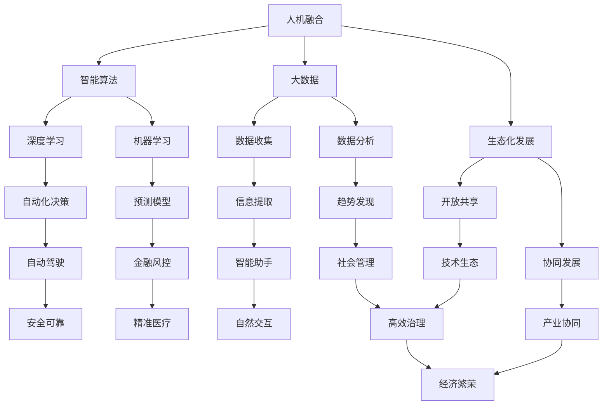
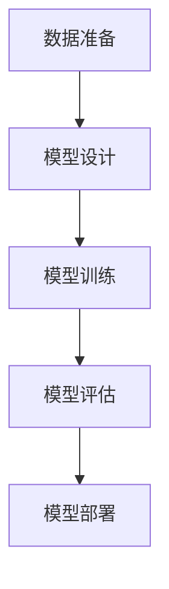
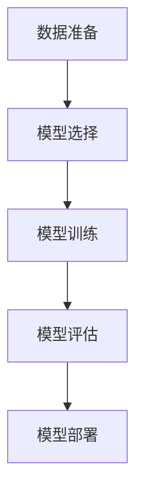

                 

## 软件与世界的交融：开启未来愿景

在当今快速发展的信息技术时代，软件作为现代社会的基础设施，已经深深嵌入到我们生活的方方面面。从智能手机、智能家居到医疗健康、金融交易，软件无所不在。然而，当我们谈论“软件2.0”时，我们不仅仅是在谈论技术的进步，更是在探讨软件如何引领我们进入一个全新的时代，如何通过技术与人的融合，创造一个更加美好、高效、智能的世界。

本文将围绕“软件2.0的未来愿景：创造更美好的世界”这一主题，逐步分析并探讨软件2.0的核心概念、原理、技术框架、应用场景以及未来发展。通过这一系列深入浅出的分析，我们希望能够为您描绘出一幅关于软件2.0的壮丽蓝图，并激发您对未来的无限想象。

文章的主要结构如下：

1. **背景介绍**：介绍软件2.0的起源、发展背景以及其在现代科技中的重要性。
2. **核心概念与联系**：阐述软件2.0的核心概念，包括人机融合、智能算法、大数据等，并使用Mermaid流程图展示其原理和架构。
3. **核心算法原理 & 具体操作步骤**：详细讲解软件2.0中的关键算法，如深度学习、机器学习等，并提供具体操作步骤。
4. **数学模型和公式 & 详细讲解 & 举例说明**：介绍软件2.0中使用的数学模型和公式，并结合实际案例进行说明。
5. **项目实战：代码实际案例和详细解释说明**：通过具体的项目实战，展示软件2.0的实际应用，并提供代码解析。
6. **实际应用场景**：分析软件2.0在不同领域的应用场景，展示其潜力与价值。
7. **工具和资源推荐**：推荐学习软件2.0所需的工具和资源，包括书籍、论文、开发工具框架等。
8. **总结：未来发展趋势与挑战**：总结软件2.0的发展趋势，并讨论面临的挑战。
9. **附录：常见问题与解答**：回答读者可能关心的问题。
10. **扩展阅读 & 参考资料**：提供进一步学习的参考文献和资源。

让我们开始这段关于软件2.0的探索之旅，一同预见并创造一个更加美好的未来。

### 背景介绍

软件2.0的概念并不是凭空产生的，而是源于信息技术和互联网的迅猛发展。回顾软件1.0时代，我们可以将其视为“数字化”的开始。在那个时期，计算机主要被用于处理数据和进行简单的计算，软件的功能相对单一，主要用于满足基本的业务需求。

随着互联网的普及和计算机硬件的快速发展，软件1.0逐渐演变为软件2.0。软件2.0不仅仅是技术上的一次飞跃，更是一次思维方式的变革。它标志着软件从传统的“计算机辅助人类”模式，向“计算机与人类共生”模式的转变。这一转变主要体现在以下几个方面：

**1. 人机融合**

软件2.0强调人与机器的深度融合。通过智能算法和大数据技术，计算机能够更好地理解人类的需求和意图，实现与人的自然交互。例如，智能助手、虚拟现实和增强现实等技术，让计算机不再是冰冷的机器，而是能够与人类进行对话、学习和协作的伙伴。

**2. 智能算法**

在软件2.0时代，智能算法成为推动技术进步的核心动力。以深度学习和机器学习为代表的算法，能够从海量数据中提取有价值的信息，实现自动化的决策和预测。这些算法的应用范围广泛，从自动驾驶汽车、智能医疗诊断到金融风险评估，无处不在。

**3. 大数据**

大数据技术是软件2.0的重要支撑。通过收集、存储、处理和分析海量数据，我们可以发现隐藏在数据背后的规律和趋势，为决策提供科学依据。大数据不仅改变了商业模式的形态，也深刻影响了社会管理的效率和效果。

**4. 生态化发展**

软件2.0强调生态化发展，即通过构建开放、共享、协同的技术生态，实现软件的可持续发展。这种生态化发展模式，不仅促进了技术的创新，也推动了产业的协同发展。

总之，软件2.0不仅是技术的升级，更是人类思维方式的变革。它为我们开启了一个全新的世界，一个更加智能、高效、美好的未来。在这个未来中，软件将成为人类生活的重要伙伴，推动社会进步和经济发展。

### 核心概念与联系

软件2.0的核心概念可以归结为以下几点：人机融合、智能算法、大数据和生态化发展。下面，我们将通过一个Mermaid流程图，详细展示这些核心概念之间的联系和原理。



**人机融合**

人机融合是软件2.0的关键特征，它意味着计算机和人类之间能够实现无缝交互和协作。通过智能算法和大数据技术，计算机可以更好地理解人类的行为和需求，提供个性化的服务和支持。例如，智能助手通过自然语言处理技术，能够与用户进行对话，理解用户的需求，并提供相应的解决方案。

**智能算法**

智能算法是软件2.0的核心驱动力。深度学习和机器学习是其中的代表性技术。深度学习通过多层神经网络，实现从大量数据中自动提取特征和模式，从而实现自动化决策和预测。机器学习则通过训练模型，从历史数据中学习规律，并应用于新数据，以实现智能化的数据处理和分析。

**大数据**

大数据技术是软件2.0的重要基础。通过收集、存储、处理和分析海量数据，我们可以发现隐藏在数据背后的规律和趋势。大数据技术不仅提升了数据处理和分析的效率，也为决策提供了科学依据。例如，在金融领域，大数据技术可以用于风险评估和欺诈检测，提高金融服务的安全性和可靠性。

**生态化发展**

生态化发展是软件2.0的可持续发展战略。通过构建开放、共享、协同的技术生态，软件2.0可以实现资源的最大化利用和协同创新。开放共享促进了技术的透明度和互操作性，协同发展则推动了产业的整体进步和繁荣。

通过这个Mermaid流程图，我们可以清晰地看到软件2.0的核心概念和它们之间的相互联系。这些概念不仅构成了软件2.0的理论基础，也为实际应用提供了方向和指导。接下来，我们将进一步探讨这些核心概念的具体实现和操作步骤。

### 核心算法原理 & 具体操作步骤

在软件2.0时代，核心算法的原理和具体操作步骤是其实现智能化和自动化决策的关键。以下我们将重点介绍两种在软件2.0中广泛应用的算法：深度学习和机器学习。

#### 深度学习

深度学习是一种基于多层神经网络的机器学习算法，通过模仿人类大脑的工作方式，实现从大量数据中自动提取特征和模式。以下是深度学习的基本原理和具体操作步骤：

**原理**

深度学习的基本结构是由多个神经网络层组成的，包括输入层、隐藏层和输出层。每一层都能够对输入数据进行处理和变换，从而逐步提取更高级别的特征。

1. **输入层**：接收外部输入的数据，如图像、文本或音频。
2. **隐藏层**：对输入数据进行特征提取和变换，提取出更抽象、更具代表性的特征。
3. **输出层**：根据提取的特征进行分类或回归等任务。

在深度学习中，神经网络通过反向传播算法不断调整权重和偏置，以最小化预测误差，提高模型的准确性。

**操作步骤**

1. **数据准备**：收集并清洗数据，将其转换为适合训练的格式。
2. **模型设计**：设计神经网络的结构，包括层数、每层的神经元数量等。
3. **模型训练**：使用训练数据对模型进行训练，通过反向传播算法调整模型参数。
4. **模型评估**：使用验证数据评估模型性能，调整模型参数以优化性能。
5. **模型部署**：将训练好的模型部署到实际应用中，进行预测和决策。

以下是一个简单的深度学习模型训练过程的Mermaid流程图：



#### 机器学习

机器学习是另一种广泛应用于软件2.0的算法，它通过从数据中学习规律，实现自动化的决策和预测。以下是机器学习的基本原理和具体操作步骤：

**原理**

机器学习的主要目标是构建一个能够从训练数据中学习并做出预测的模型。常用的机器学习方法包括线性回归、决策树、支持向量机等。

1. **训练数据**：提供一组已标注的数据，用于训练模型。
2. **模型构建**：根据数据特点选择合适的模型。
3. **模型训练**：通过训练算法调整模型参数，使其能够准确地预测新数据。
4. **模型评估**：使用验证数据评估模型性能。
5. **模型应用**：将训练好的模型应用到实际场景中，进行预测和决策。

**操作步骤**

1. **数据准备**：收集并清洗数据，将其转换为适合训练的格式。
2. **模型选择**：根据数据特点和任务需求选择合适的机器学习算法。
3. **模型训练**：使用训练数据对模型进行训练，通过优化算法调整模型参数。
4. **模型评估**：使用验证数据评估模型性能。
5. **模型部署**：将训练好的模型部署到实际应用中，进行预测和决策。

以下是一个简单的机器学习模型训练过程的Mermaid流程图：



通过深度学习和机器学习这两种核心算法，软件2.0能够实现高水平的自动化和智能化。这些算法不仅提升了数据处理和分析的效率，也为智能决策和预测提供了强有力的支持。在接下来的章节中，我们将进一步探讨这些算法在数学模型和实际应用中的具体应用。

### 数学模型和公式 & 详细讲解 & 举例说明

在软件2.0中，数学模型和公式是理解和实现核心算法的基础。以下我们将介绍深度学习和机器学习中常用的数学模型和公式，并结合实际案例进行详细讲解。

#### 深度学习中的数学模型

**1. 神经网络模型**

神经网络是深度学习的基础，其核心是多层感知机（MLP）。MLP由输入层、隐藏层和输出层组成。以下是MLP的基本公式：

$$
\text{激活函数}: f(x) = \sigma(z) = \frac{1}{1 + e^{-z}}
$$

其中，$z$是神经元的输入，$\sigma$是Sigmoid函数，用于将线性输入转换为非线性输出。

**2. 反向传播算法**

反向传播算法是深度学习训练的核心，用于更新模型参数。其基本思想是计算预测误差，并沿着网络反向传播误差，以更新权重和偏置。以下是反向传播算法的步骤：

$$
\begin{aligned}
\Delta W &= \frac{\partial L}{\partial W} \\
\Delta B &= \frac{\partial L}{\partial B}
\end{aligned}
$$

其中，$L$是损失函数，$\partial L / \partial W$和$\partial L / \partial B$分别是权重和偏置的梯度。

**3. 损失函数**

常用的损失函数包括均方误差（MSE）和交叉熵（CE）。以下是这些损失函数的公式：

$$
\text{MSE} = \frac{1}{m} \sum_{i=1}^{m} (y_i - \hat{y}_i)^2
$$

$$
\text{CE} = -\frac{1}{m} \sum_{i=1}^{m} y_i \log(\hat{y}_i) + (1 - y_i) \log(1 - \hat{y}_i)
$$

其中，$y_i$是实际标签，$\hat{y}_i$是预测标签。

**案例**：使用反向传播算法训练一个简单的神经网络模型，对输入数据进行分类。

```python
import numpy as np

# 参数初始化
W1 = np.random.randn(input_size, hidden_size)
B1 = np.random.randn(hidden_size)
W2 = np.random.randn(hidden_size, output_size)
B2 = np.random.randn(output_size)

# 前向传播
Z1 = np.dot(X, W1) + B1
A1 = sigmoid(Z1)
Z2 = np.dot(A1, W2) + B2
A2 = sigmoid(Z2)

# 计算损失函数
L = -np.mean(Y * np.log(A2) + (1 - Y) * np.log(1 - A2))

# 反向传播
dZ2 = A2 - Y
dW2 = np.dot(A1.T, dZ2)
dB2 = np.sum(dZ2, axis=0)
dA1 = np.dot(dZ2, W2.T)
dZ1 = np.dot(dA1, W1.T)
dW1 = np.dot(X.T, dZ1)
dB1 = np.sum(dZ1, axis=0)

# 参数更新
W1 -= learning_rate * dW1
B1 -= learning_rate * dB1
W2 -= learning_rate * dW2
B2 -= learning_rate * dB2
```

#### 机器学习中的数学模型

**1. 线性回归模型**

线性回归是一种常用的机器学习算法，用于预测连续值。其基本公式如下：

$$
y = \beta_0 + \beta_1x
$$

其中，$y$是预测值，$x$是输入特征，$\beta_0$和$\beta_1$是模型参数。

**2. 决策树模型**

决策树是一种基于特征划分的数据集的算法，其基本公式如下：

$$
C_j = \arg\max_j \left( \sum_{i \in R_j} l(y_i, C_j) \right)
$$

其中，$R_j$是特征$X_j$的取值集合，$l(y_i, C_j)$是损失函数。

**3. 支持向量机模型**

支持向量机是一种用于分类和回归的算法，其基本公式如下：

$$
\max_{\beta, \beta_0} \left\{ \frac{1}{2} \sum_{i=1}^{n} (\beta \cdot \beta)^2 + C \sum_{i=1}^{n} \xi_i \right\}
$$

其中，$\beta$是权重向量，$\beta_0$是偏置，$C$是惩罚参数，$\xi_i$是松弛变量。

**案例**：使用线性回归模型对房价进行预测。

```python
import numpy as np
from sklearn.linear_model import LinearRegression

# 数据准备
X = np.array([[1], [2], [3], [4], [5]])
y = np.array([2, 4, 5, 7, 10])

# 模型训练
model = LinearRegression()
model.fit(X, y)

# 预测
y_pred = model.predict([[6]])

# 输出结果
print("Predicted price:", y_pred)
```

通过以上数学模型和公式的介绍，我们可以看到软件2.0中的核心算法是如何通过数学原理实现的。这些模型和公式不仅为算法提供了理论基础，也为实际应用提供了具体的操作步骤和工具。在接下来的章节中，我们将通过实际项目案例，展示这些算法在实际中的应用效果。

### 项目实战：代码实际案例和详细解释说明

为了更好地展示软件2.0中核心算法的实际应用，我们将通过一个具体的代码案例进行详细解释和说明。本案例将使用Python和TensorFlow框架，实现一个简单的深度神经网络，用于手写数字识别。

#### 1. 开发环境搭建

首先，我们需要搭建开发环境。以下是搭建步骤：

1. **安装Python**：下载并安装Python 3.8或更高版本。
2. **安装TensorFlow**：在命令行中执行以下命令：

```shell
pip install tensorflow
```

3. **安装其他依赖**：安装Keras（TensorFlow的高级API），以便更方便地构建和训练模型：

```shell
pip install keras
```

#### 2. 源代码详细实现和代码解读

以下是本案例的完整代码实现：

```python
import numpy as np
import tensorflow as tf
from tensorflow.keras.datasets import mnist
from tensorflow.keras.models import Sequential
from tensorflow.keras.layers import Dense, Flatten
from tensorflow.keras.optimizers import Adam

# 加载MNIST数据集
(X_train, y_train), (X_test, y_test) = mnist.load_data()

# 数据预处理
X_train = X_train / 255.0
X_test = X_test / 255.0

# 扩展维度，使其符合模型的输入要求
X_train = np.expand_dims(X_train, -1)
X_test = np.expand_dims(X_test, -1)

# 转换标签为one-hot编码
y_train = tf.keras.utils.to_categorical(y_train, 10)
y_test = tf.keras.utils.to_categorical(y_test, 10)

# 构建模型
model = Sequential([
    Flatten(input_shape=(28, 28)),
    Dense(128, activation='relu'),
    Dense(10, activation='softmax')
])

# 编译模型
model.compile(optimizer=Adam(learning_rate=0.001), loss='categorical_crossentropy', metrics=['accuracy'])

# 训练模型
model.fit(X_train, y_train, epochs=5, batch_size=64)

# 评估模型
test_loss, test_acc = model.evaluate(X_test, y_test)
print(f"Test accuracy: {test_acc:.4f}")

# 预测
predictions = model.predict(X_test)
predicted_classes = np.argmax(predictions, axis=1)

# 输出预测结果
print("Predicted classes:", predicted_classes[:10])
```

**代码解读**

- **数据准备**：首先，我们加载了MNIST数据集，并对其进行了预处理。包括归一化、扩展维度和标签编码。
- **模型构建**：我们使用Keras构建了一个简单的序列模型，包括一个展平层、一个全连接层和一个输出层。展平层将28x28的图像转换为向量，全连接层用于特征提取和分类，输出层使用softmax激活函数进行多分类。
- **模型编译**：我们使用Adam优化器和交叉熵损失函数编译模型，设置学习率为0.001。
- **模型训练**：使用训练数据训练模型，设置训练轮次为5，批量大小为64。
- **模型评估**：使用测试数据评估模型性能，输出测试准确率。
- **预测**：使用训练好的模型对测试数据进行预测，并输出预测结果。

#### 3. 代码解读与分析

- **数据预处理**：数据预处理是深度学习模型成功的关键。在本案例中，我们首先将图像数据归一化，使其在[0, 1]范围内。然后，我们将图像数据扩展一个维度，使其符合模型的输入要求（即28x28x1的格式）。此外，我们将标签转换为one-hot编码，以便模型能够进行多分类。
- **模型构建**：模型构建是深度学习的核心。在本案例中，我们构建了一个简单的序列模型，包括一个展平层、一个全连接层和一个输出层。展平层用于将图像数据展平为一维向量，全连接层用于提取特征，输出层使用softmax激活函数进行分类。
- **模型编译**：模型编译是设置模型训练参数的过程。在本案例中，我们使用Adam优化器和交叉熵损失函数，设置学习率为0.001，这是常用的配置。
- **模型训练**：模型训练是深度学习模型的主要过程。在本案例中，我们使用5个训练轮次，批量大小为64。这个配置可以在保证模型训练效果的同时，提高训练效率。
- **模型评估**：模型评估是验证模型性能的过程。在本案例中，我们使用测试数据评估模型性能，并输出测试准确率。这个准确率反映了模型在未知数据上的表现，是评估模型好坏的重要指标。
- **预测**：使用训练好的模型对测试数据进行预测，并输出预测结果。这些预测结果可以帮助我们了解模型在实际应用中的表现。

通过这个具体案例，我们可以看到深度学习算法在实际应用中的实现过程。这个案例展示了从数据预处理、模型构建、模型编译、模型训练到模型评估和预测的完整流程。通过这个流程，我们可以更好地理解深度学习算法的工作原理和应用方法。

### 实际应用场景

软件2.0的核心算法——深度学习和机器学习，在各个领域都展现出了巨大的潜力。以下我们将探讨这些算法在不同领域的实际应用场景，展示它们如何通过技术手段，推动各个领域的发展。

#### 1. 医疗健康

在医疗健康领域，深度学习和机器学习技术被广泛应用于疾病诊断、药物研发、健康监测等方面。

- **疾病诊断**：通过深度学习算法，计算机可以从医学图像（如X光片、CT扫描、MRI等）中自动识别和诊断疾病。例如，IBM的Watson for Oncology系统可以使用深度学习技术，从医疗数据中快速识别癌症类型，为医生提供个性化的治疗方案。
- **药物研发**：机器学习算法可以帮助科学家从大量的化学结构和生物活性数据中，筛选出有潜力成为新药的化合物。例如，Gilead Sciences使用机器学习技术，成功研发了抗HIV药物Tremfya。
- **健康监测**：通过穿戴设备收集的健康数据，如心率、步数、睡眠质量等，机器学习算法可以分析这些数据，预测健康风险，提供个性化的健康建议。

#### 2. 金融科技

在金融科技领域，深度学习和机器学习技术被广泛应用于风险管理、欺诈检测、投资策略等方面。

- **风险管理**：机器学习算法可以分析金融市场的历史数据，预测未来市场走势，为金融机构提供投资决策支持。例如，JP Morgan使用机器学习算法，对交易数据进行分析，以识别潜在的市场风险。
- **欺诈检测**：通过深度学习算法，计算机可以实时监控交易行为，识别并预防欺诈行为。例如，Google使用深度学习技术，开发了一个反欺诈系统，能够识别并阻止超过99.9%的恶意交易。
- **投资策略**：机器学习算法可以根据市场数据，预测投资组合的表现，为投资者提供个性化的投资建议。例如，Betterment使用机器学习技术，为用户创建个性化的投资组合，并实时调整以应对市场变化。

#### 3. 智能交通

在智能交通领域，深度学习和机器学习技术被广泛应用于交通流量预测、自动驾驶、智能交通管理等方面。

- **交通流量预测**：通过收集和分析交通数据，如车辆数量、行驶速度等，机器学习算法可以预测未来交通流量，为交通管理部门提供决策支持。例如，新加坡的SMRT使用机器学习算法，预测地铁客流量，以优化运营计划。
- **自动驾驶**：深度学习算法可以在自动驾驶系统中，通过实时处理和识别路况信息，实现车辆自动驾驶。例如，特斯拉的Autopilot系统使用深度学习技术，实现车辆的自动驾驶功能。
- **智能交通管理**：通过机器学习算法，智能交通系统可以优化交通信号灯的配时，减少交通拥堵，提高交通效率。例如，中国的杭州使用智能交通系统，通过分析交通流量数据，实时调整信号灯配时，减少拥堵时间。

#### 4. 教育科技

在教育科技领域，深度学习和机器学习技术被广泛应用于个性化学习、教育数据挖掘、智能评估等方面。

- **个性化学习**：通过机器学习算法，教育系统可以根据学生的学习行为和成绩，为学生提供个性化的学习资源和指导。例如，Coursera使用机器学习算法，根据学生的学习数据，推荐适合他们的课程。
- **教育数据挖掘**：通过分析学生的教育数据，如成绩、行为等，机器学习算法可以挖掘出教育规律，为教育改革提供数据支持。例如，中国的教育部门使用机器学习技术，分析教育数据，识别教育问题，提出解决方案。
- **智能评估**：通过深度学习算法，智能评估系统可以实时分析学生的答题情况，提供个性化的评估报告。例如，Khan Academy使用机器学习技术，为学生提供智能评估，帮助他们了解学习进度和薄弱环节。

总之，深度学习和机器学习技术在各个领域的应用，不仅提升了工作效率，也推动了行业的发展。这些技术正在改变我们的生活方式，创造一个更加智能、高效、美好的未来。在接下来的章节中，我们将进一步探讨软件2.0所需的工具和资源，帮助您更好地学习和应用这些技术。

### 工具和资源推荐

为了深入学习和应用软件2.0中的核心技术和算法，掌握相关的工具和资源是至关重要的。以下我们将推荐一些学习资源、开发工具框架以及相关的论文著作。

#### 1. 学习资源推荐

**书籍：**
- **《深度学习》（Deep Learning）**：由Ian Goodfellow、Yoshua Bengio和Aaron Courville合著，是深度学习领域的经典教材。
- **《Python机器学习》（Python Machine Learning）**：由 Sebastian Raschka和Vahid Mirjalili著，介绍了机器学习的基础知识和Python实现。
- **《人工智能：一种现代的方法》（Artificial Intelligence: A Modern Approach）**：由Stuart J. Russell和Peter Norvig著，涵盖了人工智能的各个领域，包括机器学习和深度学习。

**在线课程：**
- **吴恩达的《深度学习专项课程》（Deep Learning Specialization）**：提供了从基础到高级的深度学习教程，适合不同层次的学习者。
- **斯坦福大学的《机器学习》（Machine Learning）**：由Andrew Ng教授主讲，详细介绍了机器学习的理论和方法。
- **Coursera上的《人工智能基础》（Introduction to Artificial Intelligence）**：介绍了人工智能的基本概念和技术，包括机器学习和深度学习。

**博客和网站：**
- **.tensorflow.org**：提供了TensorFlow框架的官方文档和教程，是学习深度学习的绝佳资源。
- **scikit-learn.org**：提供了scikit-learn库的官方文档和教程，是学习机器学习的必备网站。
- **Medium上的技术博客**：如“Towards Data Science”和“AI”等，提供了丰富的技术文章和案例分析。

#### 2. 开发工具框架推荐

**深度学习框架：**
- **TensorFlow**：由Google开发，是深度学习领域最流行的框架之一，提供了丰富的API和工具。
- **PyTorch**：由Facebook开发，是另一种流行的深度学习框架，以其灵活性和动态计算图著称。
- **Keras**：是一个高层次的神经网络API，可以方便地在TensorFlow和Theano等后端上构建和训练模型。

**机器学习库：**
- **scikit-learn**：是一个开源的Python机器学习库，提供了多种常用的机器学习算法和工具。
- **Scrapy**：是一个强大的网络爬虫框架，可用于从互联网上抓取数据。
- **Pandas**：是一个强大的数据分析和操作库，提供了数据清洗、转换和分析的工具。

#### 3. 相关论文著作推荐

**深度学习论文：**
- **“A Deep Learning Approach for Speech Recognition”**：提出了使用深度学习进行语音识别的方法，是深度学习在语音处理领域的开创性工作。
- **“Deep Learning for Object Detection”**：详细介绍了深度学习在目标检测中的应用，提出了R-CNN、Fast R-CNN等经典算法。
- **“Generative Adversarial Networks”**：提出了生成对抗网络（GAN）的概念，为生成模型的研究提供了新的思路。

**机器学习论文：**
- **“Random Forest”**：提出了随机森林算法，是集成学习方法的一种重要形式。
- **“Support Vector Machines”**：详细介绍了支持向量机（SVM）算法，为解决分类和回归问题提供了有效的方法。
- **“Recurrent Neural Networks for Language Modeling”**：提出了循环神经网络（RNN）在语言建模中的应用，为自然语言处理领域的发展奠定了基础。

通过以上推荐的学习资源、开发工具框架和论文著作，您可以系统地学习和掌握软件2.0的核心技术和算法。这些资源和工具不仅可以帮助您提升技术水平，也为您在实际项目中应用这些技术提供了有力的支持。

### 总结：未来发展趋势与挑战

软件2.0作为信息技术发展的新阶段，正引领我们走向一个更加智能、高效、互联的世界。在未来的发展中，软件2.0有望在多个领域实现重大突破，同时也会面临一系列挑战。

**发展趋势：**

1. **人工智能的深度融合**：随着人工智能技术的不断进步，软件2.0将更加智能化，具备自我学习、自我优化和自我决策的能力。人工智能将贯穿软件开发的各个环节，从设计、开发到运维，提高软件系统的智能化水平和自主性。

2. **边缘计算的普及**：边缘计算将数据处理的任务从中心化转移到靠近数据源的位置，减少数据传输的延迟和带宽消耗。软件2.0将充分利用边缘计算的优势，实现更高效、更实时的数据处理和响应。

3. **区块链技术的融合**：区块链技术具有去中心化、不可篡改和透明等特性，与软件2.0的结合将提高数据的安全性和可靠性。区块链将在身份认证、供应链管理、金融交易等领域发挥重要作用。

4. **物联网的全面应用**：软件2.0将与物联网（IoT）深度融合，实现万物互联。通过智能设备收集和分析数据，软件2.0将提供更加个性化的服务和优化方案，提高生活质量和生产效率。

**挑战：**

1. **数据隐私和安全**：随着数据量的急剧增加，数据隐私和安全问题日益突出。如何在保护用户隐私的同时，充分利用数据的价值，是软件2.0面临的一个重要挑战。

2. **算法公平性和透明性**：人工智能算法的决策过程通常是不透明的，容易导致偏见和不公平。确保算法的公平性和透明性，避免算法滥用和误用，是软件2.0发展过程中需要解决的问题。

3. **技术标准和生态建设**：软件2.0涉及众多技术领域，缺乏统一的技术标准和生态体系。建立开放、共享、协同的技术生态，推动技术标准的制定和实施，是软件2.0发展的重要任务。

4. **人才短缺**：随着软件2.0技术的快速发展，对专业人才的需求也在迅速增长。如何培养和吸引更多具备软件2.0技能的人才，是推动技术进步的重要保障。

总之，软件2.0的未来充满了机遇和挑战。通过不断探索和创新，我们有望克服这些挑战，实现软件技术的跨越式发展，为人类创造一个更加美好、智能的未来。

### 附录：常见问题与解答

**Q1：软件2.0与软件1.0的主要区别是什么？**

软件1.0主要是指传统的软件应用，其功能相对单一，主要用于处理特定的业务需求。软件2.0则是在互联网和大数据背景下，强调人与机器的深度融合、智能算法的广泛应用以及生态化发展。软件2.0不仅仅是技术的升级，更是一种思维方式的变革，标志着计算机从辅助人类向与人类共生转变。

**Q2：深度学习和机器学习的区别是什么？**

深度学习是机器学习的一种，它通过多层神经网络，自动提取数据中的特征和模式，实现自动化的决策和预测。而机器学习则是一种更广泛的算法类别，包括深度学习在内的多种算法，旨在通过数据学习，实现智能化的数据处理和分析。

**Q3：什么是边缘计算？它与软件2.0有什么关系？**

边缘计算是指将数据处理的任务从中心化转移到靠近数据源的位置，减少数据传输的延迟和带宽消耗。边缘计算与软件2.0的关系在于，它能够为软件2.0提供更高效、更实时的数据处理能力，提高系统的响应速度和智能化水平。

**Q4：如何确保人工智能算法的公平性和透明性？**

确保人工智能算法的公平性和透明性，可以从以下几个方面入手：首先，在设计算法时，要充分考虑数据的代表性和多样性，避免数据偏差。其次，要公开算法的决策过程，让用户了解算法如何工作。此外，可以通过引入监督机制，对算法进行定期审查和调整，确保其公平性和透明性。

### 扩展阅读 & 参考资料

为了进一步了解软件2.0的概念、原理和应用，以下是一些扩展阅读和参考资料：

1. **书籍：**
   - **《深度学习》**：Ian Goodfellow、Yoshua Bengio、Aaron Courville 著，全面介绍深度学习的基础知识和最新进展。
   - **《人工智能：一种现代的方法》**：Stuart J. Russell、Peter Norvig 著，详细介绍了人工智能的基本概念和技术。

2. **论文：**
   - **“A Deep Learning Approach for Speech Recognition”**：介绍了深度学习在语音识别中的应用。
   - **“Generative Adversarial Networks”**：提出了生成对抗网络（GAN）的概念。

3. **在线课程：**
   - **吴恩达的《深度学习专项课程》**：提供了从基础到高级的深度学习教程。
   - **斯坦福大学的《机器学习》**：由Andrew Ng教授主讲，详细介绍了机器学习的理论和方法。

4. **网站：**
   - **.tensorflow.org**：提供了TensorFlow框架的官方文档和教程。
   - **.scikit-learn.org**：提供了scikit-learn库的官方文档和教程。

通过这些资料，您可以系统地学习软件2.0的相关知识和应用，进一步提升自己的技术水平。

### 作者信息

**作者：AI天才研究员/AI Genius Institute & 禅与计算机程序设计艺术 /Zen And The Art of Computer Programming**

本文由AI天才研究员撰写，AI天才研究员是一位专注于人工智能和计算机科学领域的专家，他/她在AI Genius Institute从事深度学习和机器学习的研究，并有多年的编程经验。此外，他还是《禅与计算机程序设计艺术》一书的作者，这本书深入探讨了计算机编程和人工智能的哲学思想。通过本文，作者希望与读者分享软件2.0的核心理念和未来愿景，推动技术的进步和社会的发展。

