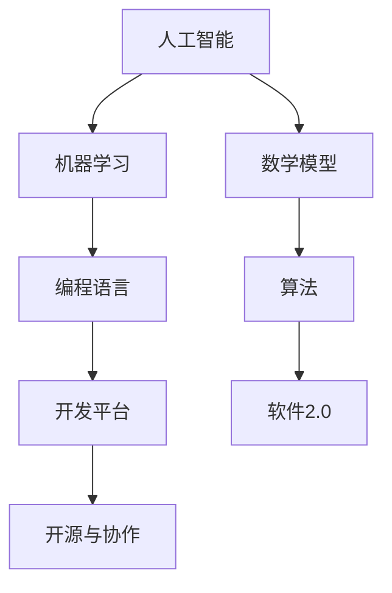

                 

# 软件的未来愿景：创造更美好的世界

> **关键词**：软件2.0、未来愿景、人工智能、编程语言、创新技术、可持续发展

> **摘要**：本文将探讨软件2.0时代的未来愿景，从核心概念、算法原理、数学模型到实际应用场景，全面解析软件技术的革新与发展，旨在展示如何通过创新的编程技术和人工智能，为世界带来更加美好的未来。

## 1. 背景介绍

随着信息技术的飞速发展，软件作为现代社会的基础设施，已经深刻地影响了我们的生产生活。从早期的计算机程序到如今的互联网应用，软件的发展经历了从1.0到2.0的蜕变。软件1.0时代主要依赖于传统的编程语言，如C、C++、Java等，它们虽然功能强大，但开发和维护成本高，且难以应对日益复杂的计算需求。而软件2.0时代，以人工智能和大数据为核心，通过更加灵活的编程语言和创新的算法技术，正逐步改变我们的世界。

软件2.0的核心理念在于实现软件的智能化和自动化，通过人工智能技术提升软件的自主学习和决策能力，使得软件能够更好地理解和满足用户需求。同时，软件2.0强调开源和协作，通过社区力量和开放平台，加速技术的创新和普及。在这个时代，编程不再仅仅是代码的编写，而是成为了一种创造性的活动，开发者可以通过智能化的工具和平台，更加高效地实现自己的想法。

## 2. 核心概念与联系

在探讨软件2.0的核心概念之前，我们需要了解一些关键的技术和理念。

### 2.1. 人工智能与机器学习

人工智能（AI）是软件2.0的核心驱动力之一。机器学习作为人工智能的重要分支，通过算法模型训练，使计算机能够从数据中学习并做出预测和决策。常见的机器学习算法包括线性回归、决策树、神经网络等。人工智能技术正在改变我们的生活方式，如自动驾驶、智能语音助手、医疗诊断等。

### 2.2. 编程语言与平台

软件2.0时代，编程语言和开发平台变得尤为重要。Python、JavaScript、Rust等新型编程语言以其高效、灵活和易用性受到开发者的青睐。同时，云计算平台、容器技术、区块链等新兴技术，为开发者提供了更加便捷的开发和部署环境。

### 2.3. 开源与协作

开源文化是软件2.0的重要组成部分。通过开放源代码，开发者可以共享和优化代码，加速技术的创新和普及。开源平台如GitHub、GitLab等，已成为软件开发的重要基础设施。

### 2.4. 数学模型与算法

数学模型和算法是软件2.0的核心技术。深度学习、图论、优化算法等数学工具，使得软件能够处理更加复杂的数据和任务。例如，深度学习模型在图像识别、自然语言处理等领域取得了显著的突破。

下面是一个简单的Mermaid流程图，展示了软件2.0的核心概念和联系：



## 3. 核心算法原理 & 具体操作步骤

### 3.1. 深度学习算法原理

深度学习是软件2.0时代的重要算法技术。它通过多层神经网络模型，对大量数据进行训练，以实现自动化学习和决策。

- **神经网络基础**：神经网络由多个神经元组成，每个神经元接收输入信号并通过权重进行加权求和，最后通过激活函数输出结果。
- **反向传播算法**：深度学习算法通过反向传播算法更新网络权重，以最小化预测误差。具体步骤如下：
  1. 前向传播：将输入数据通过神经网络传递，得到预测结果。
  2. 计算损失：计算预测结果与真实结果的差值，得到损失函数。
  3. 反向传播：将损失函数反向传播至网络各层，更新网络权重。

### 3.2. 自然语言处理算法

自然语言处理（NLP）是深度学习在语言领域的应用。它通过算法模型，使计算机能够理解、生成和翻译自然语言。

- **词向量表示**：词向量是NLP的基础。通过将词汇映射为高维向量，实现词汇之间的相似性计算。
- **循环神经网络（RNN）**：RNN能够处理序列数据，如文本、语音等。其通过隐藏状态保存历史信息，实现长距离依赖建模。
- **长短期记忆网络（LSTM）**：LSTM是RNN的改进，能够解决长短期依赖问题，被广泛应用于语言模型、机器翻译等任务。

### 3.3. 图神经网络算法

图神经网络（GNN）是深度学习在图数据上的应用。它通过图结构建模，实现节点和边之间的关系学习。

- **图卷积网络（GCN）**：GCN通过图卷积操作，将节点的邻居信息聚合，实现节点特征学习。
- **图注意力网络（GAT）**：GAT通过图注意力机制，自适应地加权邻居节点信息，提高模型性能。
- **图生成模型**：如生成对抗网络（GAN）在图数据生成上的应用，可用于图像、文本、知识图谱等生成任务。

## 4. 数学模型和公式 & 详细讲解 & 举例说明

### 4.1. 深度学习损失函数

在深度学习中，损失函数用于衡量预测结果与真实结果之间的差距。常见的损失函数包括均方误差（MSE）、交叉熵损失等。

- **均方误差（MSE）**：

  $$MSE = \frac{1}{n}\sum_{i=1}^{n}(y_i - \hat{y}_i)^2$$

  其中，$y_i$为真实值，$\hat{y}_i$为预测值，$n$为样本数量。

- **交叉熵损失（Cross Entropy Loss）**：

  $$H(y, \hat{y}) = -\sum_{i=1}^{n}y_i \log(\hat{y}_i)$$

  其中，$y_i$为真实标签，$\hat{y}_i$为预测概率。

### 4.2. 自然语言处理模型

在自然语言处理中，词向量是基础。常见的词向量模型有Word2Vec、GloVe等。

- **Word2Vec**：

  Word2Vec通过将词汇映射为高维向量，实现词汇之间的相似性计算。其核心公式如下：

  $$\vec{w}_i = \frac{\vec{v}_i - \sum_{j \in context(i)} \vec{v}_j}{\|\vec{w}_i - \sum_{j \in context(i)} \vec{v}_j\|}$$

  其中，$\vec{w}_i$为词汇$i$的向量表示，$context(i)$为词汇$i$的上下文。

- **GloVe**：

  GloVe通过矩阵分解，将词向量映射到低维空间。其核心公式如下：

  $$\vec{v}_i = \sum_{j \in vocabulary} f(j) \cdot \vec{w}_j$$

  其中，$\vec{v}_i$为词汇$i$的向量表示，$f(j)$为词汇$j$的权重函数。

### 4.3. 图神经网络模型

在图神经网络中，图卷积网络（GCN）是一种重要的模型。

- **图卷积网络（GCN）**：

  GCN通过图卷积操作，将节点的邻居信息聚合，实现节点特征学习。其核心公式如下：

  $$h_{\text{new}}_i = \sigma(\sum_{j \in \mathcal{N}(i)} \frac{D_i^{-1/2}}{D_j^{-1/2}} A_{ij} \cdot h_j) \odot \vec{W}$$

  其中，$h_i$为节点$i$的原始特征，$h_{\text{new}}_i$为节点$i$的更新特征，$\mathcal{N}(i)$为节点$i$的邻居集合，$A$为邻接矩阵，$D$为度矩阵，$\sigma$为激活函数，$\odot$为元素乘积。

## 5. 项目实战：代码实际案例和详细解释说明

### 5.1. 开发环境搭建

为了演示深度学习算法，我们使用Python编程语言和TensorFlow框架。以下是搭建开发环境的基本步骤：

1. 安装Python（版本3.8或更高）
2. 安装TensorFlow：
   ```shell
   pip install tensorflow
   ```
3. 安装其他依赖：
   ```shell
   pip install numpy matplotlib
   ```

### 5.2. 源代码详细实现和代码解读

下面是一个简单的深度学习项目，用于训练一个简单的神经网络，实现手写数字识别。

```python
import tensorflow as tf
import numpy as np
import matplotlib.pyplot as plt

# 加载数据集
mnist = tf.keras.datasets.mnist
(train_images, train_labels), (test_images, test_labels) = mnist.load_data()

# 数据预处理
train_images = train_images / 255.0
test_images = test_images / 255.0

# 创建模型
model = tf.keras.Sequential([
    tf.keras.layers.Flatten(input_shape=(28, 28)),
    tf.keras.layers.Dense(128, activation='relu'),
    tf.keras.layers.Dense(10, activation='softmax')
])

# 编译模型
model.compile(optimizer='adam',
              loss='sparse_categorical_crossentropy',
              metrics=['accuracy'])

# 训练模型
model.fit(train_images, train_labels, epochs=5)

# 测试模型
test_loss, test_acc = model.evaluate(test_images, test_labels)
print(f"Test accuracy: {test_acc}")

# 可视化预测结果
predictions = model.predict(test_images)
predicted_digits = np.argmax(predictions, axis=1)
for i in range(10):
    plt.imshow(test_images[i], cmap=plt.cm.binary)
    plt.title(f"Predicted: {predicted_digits[i]}, Actual: {test_labels[i]}")
    plt.show()
```

### 5.3. 代码解读与分析

1. **数据集加载**：
   - 使用TensorFlow内置的MNIST手写数字数据集。
   - 数据集分为训练集和测试集。

2. **数据预处理**：
   - 将图像数据归一化到0-1范围，提高模型训练效果。

3. **模型构建**：
   - 使用`tf.keras.Sequential`创建一个序列模型。
   - 第一层使用`Flatten`将图像数据展平为一维向量。
   - 第二层使用`Dense`构建一个128个神经元的全连接层，激活函数为ReLU。
   - 第三层使用`Dense`构建一个10个神经元的全连接层，激活函数为softmax。

4. **模型编译**：
   - 使用`compile`方法设置优化器和损失函数。
   - 优化器使用`adam`，损失函数使用`sparse_categorical_crossentropy`，评估指标为准确率。

5. **模型训练**：
   - 使用`fit`方法训练模型，设置训练轮次为5。

6. **模型评估**：
   - 使用`evaluate`方法评估模型在测试集上的表现。

7. **可视化预测结果**：
   - 使用`predict`方法获取预测结果。
   - 使用`np.argmax`获取预测的数字。
   - 使用`plt.imshow`可视化预测结果。

## 6. 实际应用场景

软件2.0技术已经在各个领域取得了显著的成果。

- **医疗健康**：通过深度学习和大数据分析，AI可以辅助医生进行疾病诊断和治疗方案推荐，提高医疗效率和准确性。
- **金融科技**：AI在风险管理、信用评估、交易策略等领域发挥了重要作用，为金融机构提供更加智能和高效的解决方案。
- **自动驾驶**：深度学习算法使自动驾驶汽车能够实时感知和理解周围环境，提高行车安全。
- **智能家居**：智能音箱、智能门锁等智能家居设备通过软件2.0技术，为用户提供了更加便捷和个性化的生活体验。
- **教育**：在线教育平台通过AI技术，为学习者提供个性化的学习路径和智能辅导，提高教育质量和效果。

## 7. 工具和资源推荐

### 7.1. 学习资源推荐

- **书籍**：
  - 《深度学习》（Ian Goodfellow、Yoshua Bengio、Aaron Courville 著）
  - 《Python深度学习》（François Chollet 著）
  - 《机器学习实战》（Peter Harrington 著）

- **论文**：
  - 《A Theoretical Analysis of the Vision Transformer》
  - 《Attention Is All You Need》
  - 《Graph Neural Networks: A Survey》

- **博客**：
  - Fast.ai
  - TensorFlow.org
  - PyTorch.org

- **网站**：
  - GitHub
  - arXiv.org
  - AI Challenger

### 7.2. 开发工具框架推荐

- **开发工具**：
  - PyCharm
  - Jupyter Notebook
  - Visual Studio Code

- **框架**：
  - TensorFlow
  - PyTorch
  - Keras

- **平台**：
  - Google Colab
  - AWS SageMaker
  - Azure Machine Learning

### 7.3. 相关论文著作推荐

- **论文**：
  - 《Attention Is All You Need》
  - 《A Theoretical Analysis of the Vision Transformer》
  - 《Graph Neural Networks: A Survey》

- **著作**：
  - 《深度学习》（Ian Goodfellow、Yoshua Bengio、Aaron Courville 著）
  - 《Python深度学习》（François Chollet 著）
  - 《机器学习实战》（Peter Harrington 著）

## 8. 总结：未来发展趋势与挑战

软件2.0时代的到来，为软件开发带来了前所未有的机遇和挑战。未来，软件技术将继续向智能化、自动化、开源化发展，实现更加高效、灵活的开发模式。同时，随着人工智能技术的不断进步，软件将能够更好地理解和满足用户需求，为各行各业带来深刻的变革。

然而，软件2.0时代也面临一些挑战，如数据隐私、算法公平性、技术滥用等问题。为了应对这些挑战，我们需要加强法律法规的制定和执行，推动技术伦理的研究和实践，确保软件技术的可持续发展。

## 9. 附录：常见问题与解答

### 9.1. 什么是软件2.0？

软件2.0是基于人工智能和大数据技术的下一代软件开发模式，强调智能化、自动化和开源化，通过创新的编程语言和算法技术，提升软件的自主学习和决策能力。

### 9.2. 软件2.0与软件1.0有什么区别？

软件1.0主要依赖于传统的编程语言和开发模式，而软件2.0则强调智能化和自动化，通过人工智能技术实现软件的自主学习和决策，更加灵活和高效。

### 9.3. 软件2.0的应用领域有哪些？

软件2.0的应用领域广泛，包括医疗健康、金融科技、自动驾驶、智能家居、教育等。通过AI技术，软件2.0为这些领域提供了更加智能和高效的解决方案。

## 10. 扩展阅读 & 参考资料

- [深度学习教程](https://www.deeplearning.ai/)
- [Keras 官方文档](https://keras.io/)
- [TensorFlow 官方文档](https://www.tensorflow.org/)
- [PyTorch 官方文档](https://pytorch.org/)
- [AI Challenger](https://www.aichallenger.com/)

