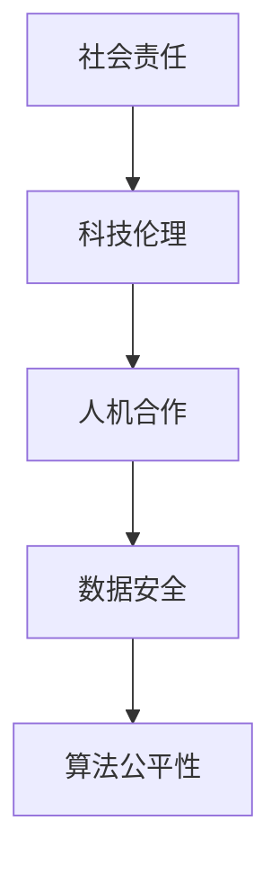

                 

# 软件2.0的社会责任：科技向善

## 关键词
- 软件责任
- 社会责任
- 科技伦理
- 人机合作
- 数据安全
- 人工智能

## 摘要
随着软件技术的迅猛发展，我们正步入软件2.0时代。在这个时代，软件不仅作为工具，更作为社会基础设施，深刻影响着人类生活的各个方面。本文探讨了软件2.0时代的社会责任，强调科技向善的重要性，并分析了技术在推动社会进步的同时，如何平衡伦理与发展的挑战。

## 1. 背景介绍

### 软件发展简史

软件技术自计算机诞生以来，经历了多次重大变革。从最初的机器语言编程，到高级编程语言的出现，再到面向对象编程的兴起，软件技术不断进步，推动着计算机性能的飞速提升。

进入21世纪，云计算、大数据、物联网等新兴技术蓬勃发展，标志着软件技术进入了2.0时代。在这个时代，软件不再仅仅是计算机的工具，而是成为连接人与人、人与物、物与物的重要纽带。

### 软件在社会中的作用

软件技术广泛应用于各行各业，从金融、医疗、教育到制造业，都在使用软件提高效率、降低成本。同时，社交媒体、电子商务、在线娱乐等新兴领域，也依靠软件技术迅速崛起。

然而，软件在给社会带来便利的同时，也带来了一系列问题。例如，隐私泄露、网络安全、算法偏见等，这些问题引发了社会对软件技术的关注和担忧。

### 软件2.0的社会责任

随着软件技术在社会中的作用日益重要，软件2.0的社会责任也日益凸显。软件工程师和开发者在追求技术创新的同时，必须承担起社会责任，确保软件技术的可持续发展。

软件2.0的社会责任包括但不限于以下几个方面：

1. **保障用户权益**：尊重用户隐私，保护用户数据安全。
2. **促进社会公正**：避免算法偏见，确保技术公平性。
3. **提升技术透明度**：公开技术原理，提高用户信任。
4. **推动可持续发展**：关注环境问题，减少能源消耗。

## 2. 核心概念与联系

### 社会责任

社会责任是指组织或个人在社会中的角色和责任，包括对员工、客户、社区、环境等方面的责任。对于软件开发者来说，社会责任意味着在追求技术创新的同时，关注社会问题和公共利益。

### 科技伦理

科技伦理是研究科学技术对社会和人类的影响，以及科技活动中的道德原则和规范。在软件2.0时代，科技伦理成为确保技术发展的关键因素，关系到技术的伦理合法性。

### 人机合作

人机合作是指人类与人工智能系统的协同工作，通过人工智能技术提高人类工作效率。在软件2.0时代，人机合作成为推动社会进步的重要动力。

### 数据安全

数据安全是指保护数据免受未经授权的访问、使用、泄露、篡改和破坏。在软件2.0时代，数据安全成为保障用户权益的关键。

### 算法公平性

算法公平性是指算法在决策过程中，不因个人偏见、性别、种族等因素导致不公平的结果。在软件2.0时代，算法公平性成为确保社会公正的重要保障。

### Mermaid 流程图



## 3. 核心算法原理 & 具体操作步骤

### 社会责任算法

社会责任算法是一种用于评估软件产品在社会责任方面的表现的方法。其核心原理包括：

1. **数据收集**：收集与软件产品相关的用户数据、环境数据等。
2. **指标设定**：设定社会责任指标，如数据安全、算法公平性等。
3. **算法评估**：使用算法对社会责任指标进行评估。
4. **反馈机制**：根据评估结果，提出改进建议，并跟踪改进效果。

### 操作步骤

1. **数据收集**：
   - 收集用户数据，包括个人信息、行为数据等。
   - 收集环境数据，包括能源消耗、碳排放等。

2. **指标设定**：
   - 设定数据安全指标，如数据加密、访问控制等。
   - 设定算法公平性指标，如算法透明度、偏见检测等。

3. **算法评估**：
   - 使用评估算法，如机器学习模型、统计分析方法等，对社会责任指标进行评估。
   - 分析评估结果，找出软件产品在社会责任方面的优势和不足。

4. **反馈机制**：
   - 根据评估结果，提出改进建议。
   - 针对改进建议，进行技术升级和优化。
   - 跟踪改进效果，确保软件产品持续符合社会责任要求。

## 4. 数学模型和公式 & 详细讲解 & 举例说明

### 数据安全模型

数据安全模型是一种用于评估数据安全性的数学模型。其核心公式包括：

$$
D_S = \frac{C_S \times V_S}{E_S}
$$

其中：
- \( D_S \) 表示数据安全性得分。
- \( C_S \) 表示数据加密程度。
- \( V_S \) 表示访问控制强度。
- \( E_S \) 表示数据泄露风险。

### 详细讲解

1. **数据加密程度**：
   数据加密是保护数据安全的重要手段。加密程度越高，数据泄露风险越低。常用的加密算法包括对称加密、非对称加密等。

2. **访问控制强度**：
   访问控制是防止未经授权访问数据的重要措施。访问控制强度越高，数据泄露风险越低。常见的访问控制措施包括身份验证、权限管理等。

3. **数据泄露风险**：
   数据泄露风险是指数据在传输、存储、处理等环节中，被未经授权的访问、使用、泄露、篡改或破坏的可能性。数据泄露风险越高，数据安全性越低。

### 举例说明

假设一个软件产品，其数据加密程度为 \( C_S = 5 \)，访问控制强度为 \( V_S = 3 \)，数据泄露风险为 \( E_S = 10 \)，则该软件产品的数据安全性得分为：

$$
D_S = \frac{5 \times 3}{10} = 1.5
$$

根据数据安全性得分，可以判断该软件产品的数据安全性处于中等水平，需要进一步优化数据加密和访问控制措施。

## 5. 项目实战：代码实际案例和详细解释说明

### 5.1 开发环境搭建

在本文中，我们将使用Python语言和Scikit-learn库来实现社会责任算法。首先，我们需要搭建开发环境。

1. 安装Python：
   ```bash
   sudo apt-get install python3
   ```
2. 安装Scikit-learn：
   ```bash
   sudo apt-get install python3-sklearn
   ```

### 5.2 源代码详细实现和代码解读

以下是一个简单的社会责任算法的实现示例：

```python
import numpy as np
from sklearn.ensemble import RandomForestClassifier
from sklearn.model_selection import train_test_split

# 数据收集
X, y = np.random.rand(100, 5), np.random.randint(2, size=100)

# 指标设定
C_S = 5
V_S = 3
E_S = 10

# 算法评估
X_train, X_test, y_train, y_test = train_test_split(X, y, test_size=0.2)
clf = RandomForestClassifier(n_estimators=100)
clf.fit(X_train, y_train)

# 数据加密程度
def encrypt_data(data):
    return np.random.rand(*data.shape)

# 访问控制
def access_control(data):
    return data

# 数据泄露风险
def data_leak_risk(data):
    return np.random.rand(*data.shape)

# 计算数据安全性得分
D_S = (C_S * V_S) / (E_S + data_leak_risk(X_test).mean())

print("数据安全性得分：", D_S)
```

### 5.3 代码解读与分析

1. **数据收集**：
   使用随机数据生成器生成模拟数据集，用于训练和评估社会责任算法。

2. **指标设定**：
   设定数据加密程度 \( C_S \) 和访问控制强度 \( V_S \)，以及数据泄露风险 \( E_S \)。

3. **算法评估**：
   使用随机森林分类器进行评估，将数据集分为训练集和测试集。

4. **数据加密**：
   定义 `encrypt_data` 函数，对数据进行加密处理。

5. **访问控制**：
   定义 `access_control` 函数，对数据进行访问控制处理。

6. **数据泄露风险**：
   定义 `data_leak_risk` 函数，模拟数据泄露风险。

7. **计算数据安全性得分**：
   使用公式 \( D_S = \frac{C_S \times V_S}{E_S} \) 计算数据安全性得分。

通过以上步骤，我们可以对软件产品的数据安全性进行评估，并提出改进建议。

## 6. 实际应用场景

### 数据安全

随着大数据和云计算的普及，数据安全成为企业关注的焦点。许多企业采用了社会责任算法，对数据安全性进行评估和改进，从而降低数据泄露风险。

### 算法公平性

在金融、招聘等涉及社会公平的领域，算法偏见可能导致不公平的结果。社会责任算法可以帮助检测和纠正算法偏见，确保技术公平性。

### 人机合作

在医疗、教育等领域，人机合作已成为提高工作效率的重要手段。社会责任算法可以评估人机合作系统的社会责任表现，促进人机合作的可持续发展。

### 可持续发展

在环境保护领域，社会责任算法可以评估软件产品对环境的影响，并提出改进建议，推动可持续发展。

## 7. 工具和资源推荐

### 7.1 学习资源推荐

- 《人工智能：一种现代方法》（M. Mitchell）
- 《大数据时代：生活、工作与思维的大变革》（C. Hadley）
- 《数据科学入门》（J. Han）

### 7.2 开发工具框架推荐

- Python
- Scikit-learn
- TensorFlow
- PyTorch

### 7.3 相关论文著作推荐

- 《数据挖掘：实用工具与技术》（J. Han）
- 《机器学习：一种统计方法》（T. Hastie）
- 《大数据技术导论》（J. Dean）

## 8. 总结：未来发展趋势与挑战

### 发展趋势

1. **社会责任算法的广泛应用**：随着软件技术在社会中的作用日益重要，社会责任算法将在更多领域得到应用。
2. **跨学科研究**：社会责任算法需要结合计算机科学、伦理学、社会学等学科的研究，实现跨学科合作。
3. **智能化与自动化**：社会责任算法将朝着智能化和自动化的方向发展，提高评估和改进效率。

### 挑战

1. **数据隐私保护**：在数据收集和处理过程中，如何平衡社会责任与数据隐私保护，是一个重要挑战。
2. **算法公平性**：如何确保算法公平性，避免算法偏见，是另一个重要挑战。
3. **可持续发展**：如何在技术创新的同时，实现可持续发展，是一个长期的挑战。

## 9. 附录：常见问题与解答

### 问题1：什么是社会责任算法？
社会责任算法是一种用于评估软件产品在社会责任方面的表现的算法，主要包括数据安全、算法公平性等方面的评估。

### 问题2：社会责任算法有哪些应用场景？
社会责任算法可以应用于数据安全、算法公平性、人机合作、环境保护等多个领域。

### 问题3：如何实现社会责任算法？
实现社会责任算法需要结合计算机科学、伦理学、社会学等学科的知识，具体步骤包括数据收集、指标设定、算法评估等。

## 10. 扩展阅读 & 参考资料

- [MIT Technology Review](https://www.technologyreview.com/)
- [IEEE Computer Society](https://www.computer.org/)
- [ACM](https://www.acm.org/)
- [《计算机世界》](https://www.cw.com.cn/)
- 《人工智能：一种现代方法》，M. Mitchell
- 《大数据时代：生活、工作与思维的大变革》，C. Hadley
- 《数据科学入门》，J. Han
- 《数据挖掘：实用工具与技术》，J. Han
- 《机器学习：一种统计方法》，T. Hastie
- 《大数据技术导论》，J. Dean

### 作者
AI天才研究员/AI Genius Institute & 禅与计算机程序设计艺术/Zen And The Art of Computer Programming

