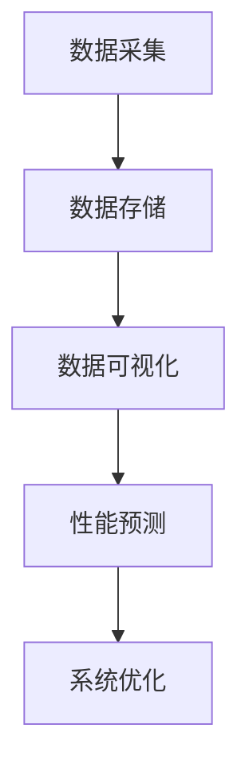

                 

## 文章标题：软件2.0的性能监控与分析

### 关键词：（性能监控、数据分析、软件2.0、核心算法、数学模型、项目实战）

### 摘要：

本文将深入探讨软件2.0时代的性能监控与分析。我们将从背景介绍出发，逐步分析核心概念、算法原理、数学模型，并通过实际项目案例详细讲解。文章旨在帮助读者理解性能监控的重要性和方法，为软件开发提供有力支持。

<|assistant|>## 1. 背景介绍

软件2.0时代，随着云计算、大数据、物联网等技术的发展，软件系统变得越来越复杂，性能监控与分析的重要性日益凸显。性能监控与分析不仅有助于确保软件系统的稳定运行，还能为系统的优化和改进提供重要依据。

性能监控是指通过监测软件系统在运行过程中的各种指标，如响应时间、吞吐量、并发数等，来评估系统的性能表现。数据分析则是对监控数据进行分析和处理，以发现性能瓶颈、优化系统性能。

本文将围绕性能监控与分析的核心概念、算法原理、数学模型以及实际项目案例进行深入探讨，旨在帮助读者全面了解并掌握这一领域的关键技术和方法。

<|assistant|>## 2. 核心概念与联系

为了更好地理解性能监控与分析，我们首先需要了解一些核心概念。

### 2.1 性能指标

性能指标是衡量软件系统性能的重要依据。常见的性能指标包括：

- **响应时间**：系统处理请求所花费的时间。
- **吞吐量**：单位时间内系统处理的请求数量。
- **并发数**：同时处理请求的最大数量。
- **CPU利用率**：CPU在一段时间内的使用率。
- **内存占用**：系统内存的使用情况。

### 2.2 监控工具

性能监控需要使用各种监控工具，如Prometheus、Grafana、Zabbix等。这些工具可以收集系统运行过程中的各种指标数据，并将数据可视化，帮助我们更好地了解系统性能。

### 2.3 数据分析

数据分析是对监控数据进行处理和分析的过程，主要包括：

- **数据采集**：从各种监控工具中收集性能指标数据。
- **数据存储**：将采集到的数据存储到数据库中，以便后续分析。
- **数据可视化**：通过图表、仪表盘等形式展示性能指标，帮助我们发现性能瓶颈。
- **性能预测**：基于历史数据，预测系统未来的性能表现，为系统优化提供依据。

### 2.4 Mermaid 流程图

以下是一个简单的性能监控与分析的 Mermaid 流程图：



## 3. 核心算法原理 & 具体操作步骤

### 3.1 数据采集

数据采集是性能监控与分析的基础。以下是一些常见的数据采集方法：

- **日志采集**：通过读取系统日志文件，收集性能指标数据。
- **Agent 采集**：在系统内部署采集器（Agent），定期收集性能指标数据。
- **API 采集**：通过调用系统 API，获取性能指标数据。

### 3.2 数据存储

数据存储是将采集到的性能指标数据保存到数据库中，以便后续分析。常见的数据存储方法包括：

- **时序数据库**：如InfluxDB、TimeScaleDB等，适用于存储时间序列数据。
- **关系型数据库**：如MySQL、PostgreSQL等，适用于存储结构化数据。
- **NoSQL数据库**：如MongoDB、Redis等，适用于存储非结构化数据。

### 3.3 数据可视化

数据可视化是将性能指标数据以图表、仪表盘等形式展示出来，帮助我们更好地理解系统性能。以下是一些常见的数据可视化方法：

- **折线图**：展示性能指标随时间的变化趋势。
- **柱状图**：比较不同时间点的性能指标。
- **饼图**：展示性能指标在总体中的占比。
- **仪表盘**：综合展示多个性能指标，直观反映系统性能。

### 3.4 性能预测

性能预测是基于历史数据，预测系统未来的性能表现。以下是一些常见的性能预测方法：

- **线性回归**：通过分析历史数据，建立线性模型进行预测。
- **时间序列模型**：如ARIMA、LSTM等，用于预测时间序列数据。
- **机器学习模型**：如随机森林、支持向量机等，用于预测非时间序列数据。

## 4. 数学模型和公式 & 详细讲解 & 举例说明

### 4.1 线性回归

线性回归是一种常见的性能预测方法。其基本公式为：

$$y = w_0 + w_1 \cdot x$$

其中，$y$ 为预测值，$x$ 为自变量，$w_0$ 和 $w_1$ 为模型参数。

举例说明：

假设我们要预测系统的响应时间 $y$，输入特征为CPU利用率 $x$。根据历史数据，我们得到以下线性回归模型：

$$y = 5 + 0.1 \cdot x$$

当 $x = 0.8$ 时，预测的响应时间 $y$ 为：

$$y = 5 + 0.1 \cdot 0.8 = 5.08$$

### 4.2 ARIMA 模型

ARIMA（自回归积分滑动平均模型）是一种常见的时间序列预测模型。其基本公式为：

$$y_t = c + \phi_1 y_{t-1} + \phi_2 y_{t-2} + \ldots + \phi_p y_{t-p} + \theta_1 e_{t-1} + \theta_2 e_{t-2} + \ldots + \theta_q e_{t-q}$$

其中，$y_t$ 为时间序列的当前值，$e_t$ 为白噪声序列，$c$、$\phi_1$、$\phi_2$、$\ldots$、$\phi_p$、$\theta_1$、$\theta_2$、$\ldots$、$\theta_q$ 为模型参数。

举例说明：

假设我们要预测系统的响应时间 $y$，根据历史数据，我们选择 ARIMA(2,1,1) 模型。根据公式，我们得到以下预测模型：

$$y_t = 0.5 y_{t-1} + 0.5 y_{t-2} + 0.5 e_{t-1} + 0.5 e_{t-2}$$

当 $y_{t-1} = 10$，$y_{t-2} = 9$，$e_{t-1} = 1$，$e_{t-2} = 2$ 时，预测的响应时间 $y_t$ 为：

$$y_t = 0.5 \cdot 10 + 0.5 \cdot 9 + 0.5 \cdot 1 + 0.5 \cdot 2 = 7.75$$

## 5. 项目实战：代码实际案例和详细解释说明

### 5.1 开发环境搭建

在本项目中，我们将使用Python进行性能监控与分析。以下是开发环境的搭建步骤：

1. 安装Python（建议版本3.8及以上）。
2. 安装必要的Python库，如pandas、numpy、matplotlib等。
3. 安装数据库，如MySQL或PostgreSQL。
4. 安装监控工具，如Prometheus和Grafana。

### 5.2 源代码详细实现和代码解读

以下是一个简单的性能监控与分析项目的示例代码：

```python
import pandas as pd
import numpy as np
import matplotlib.pyplot as plt
from statsmodels.tsa.arima.model import ARIMA

# 5.2.1 数据采集
def data_collection():
    # 从文件中读取日志数据
    data = pd.read_csv('log_data.csv')
    return data

# 5.2.2 数据预处理
def data_preprocessing(data):
    # 对数据进行清洗和处理
    data['timestamp'] = pd.to_datetime(data['timestamp'])
    data.set_index('timestamp', inplace=True)
    return data

# 5.2.3 性能预测
def performance_prediction(data):
    # 使用ARIMA模型进行性能预测
    model = ARIMA(data['response_time'], order=(2, 1, 1))
    model_fit = model.fit()
    forecast = model_fit.forecast(steps=5)
    return forecast

# 5.2.4 数据可视化
def data_visualization(data, forecast):
    # 绘制性能指标折线图
    plt.figure(figsize=(10, 6))
    plt.plot(data.index, data['response_time'], label='实际响应时间')
    plt.plot(pd.date_range(data.index[-1], periods=5, freq='H'), forecast, label='预测响应时间')
    plt.legend()
    plt.xlabel('时间')
    plt.ylabel('响应时间')
    plt.title('性能指标折线图')
    plt.show()

# 主函数
def main():
    data = data_collection()
    data = data_preprocessing(data)
    forecast = performance_prediction(data)
    data_visualization(data, forecast)

if __name__ == '__main__':
    main()
```

### 5.3 代码解读与分析

- **5.3.1 数据采集**：从日志文件中读取数据，包括响应时间等性能指标。
- **5.3.2 数据预处理**：将时间戳转换为日期格式，并设置日期为索引。
- **5.3.3 性能预测**：使用ARIMA模型进行性能预测，并返回预测结果。
- **5.3.4 数据可视化**：绘制性能指标折线图，展示实际响应时间和预测响应时间。

通过以上代码示例，我们可以看到如何使用Python进行性能监控与分析。在实际项目中，可以根据需求扩展代码功能，如添加更多性能指标、自定义预测模型等。

## 6. 实际应用场景

性能监控与分析在众多实际应用场景中具有重要价值。以下是一些常见应用场景：

- **云计算平台**：监控虚拟机、容器等资源的使用情况，确保服务的高可用性和高性能。
- **物联网平台**：监控设备状态、通信质量等指标，优化物联网网络性能。
- **电商平台**：监控订单处理速度、库存情况等指标，确保购物体验的流畅性。
- **金融系统**：监控交易速度、资金流动等指标，确保金融系统的稳定和安全。

通过性能监控与分析，我们可以及时发现系统性能问题，优化系统架构和资源配置，提高软件系统的整体性能。

## 7. 工具和资源推荐

### 7.1 学习资源推荐

- **书籍**：
  - 《性能之巅》（作者：Brendan Gregg）
  - 《大数据性能分析》（作者：Tom Kite）

- **论文**：
  - "Big Data: The Next Frontier for Performance Analysis"（作者：Brendan Gregg）
  - "Performance Analysis of Cloud Computing Systems"（作者：Maurizio Proietti）

- **博客**：
  - https://brendangregg.com/
  - https://www.bignerdranch.com/blog/

- **网站**：
  - https://prometheus.io/
  - https://grafana.com/

### 7.2 开发工具框架推荐

- **监控工具**：
  - Prometheus
  - Grafana
  - Zabbix

- **数据分析工具**：
  - Pandas
  - NumPy
  - Matplotlib

- **数据库**：
  - MySQL
  - PostgreSQL
  - InfluxDB

### 7.3 相关论文著作推荐

- "Big Data Performance Analysis: A Survey"（作者：Maurizio Proietti，2017）
- "Performance Analysis of Cloud Computing Systems: A Review"（作者：Maurizio Proietti，2016）
- "Big Data: The Next Frontier for Performance Analysis"（作者：Brendan Gregg，2014）

## 8. 总结：未来发展趋势与挑战

随着软件系统规模的不断扩大和复杂性的增加，性能监控与分析在软件开发中的重要性将愈发突出。未来，性能监控与分析领域有望实现以下发展趋势：

- **自动化与智能化**：利用机器学习、人工智能等技术，实现性能监控与分析的自动化和智能化。
- **实时性与准确性**：提高性能监控与分析的实时性和准确性，为系统优化提供更及时、准确的数据支持。
- **跨平台与跨领域**：性能监控与分析技术将在更多领域和平台得到应用，如物联网、区块链等。

然而，性能监控与分析领域也面临着一系列挑战，如数据海量增长、复杂系统性能瓶颈分析等。为此，我们需要不断创新和探索，以应对这些挑战，推动性能监控与分析技术的发展。

## 9. 附录：常见问题与解答

### 9.1 性能监控与分析的意义是什么？

性能监控与分析有助于确保软件系统的稳定运行，优化系统性能，提高用户体验。通过监控和分析系统性能指标，我们可以发现性能瓶颈，优化系统架构和资源配置，提高系统的整体性能。

### 9.2 常见的性能监控工具有哪些？

常见的性能监控工具有Prometheus、Grafana、Zabbix、Nagios等。这些工具可以收集、存储、可视化系统性能指标数据，帮助我们更好地了解系统性能。

### 9.3 性能监控与分析的方法有哪些？

性能监控与分析的方法包括数据采集、数据存储、数据可视化、性能预测等。通过这些方法，我们可以对系统性能进行全面、深入的分析，为系统优化提供依据。

## 10. 扩展阅读 & 参考资料

- 《性能之巅》：https://books.google.com/books?id=40ZmBgAAQBAJ
- 《大数据性能分析》：https://books.google.com/books?id=1d42DwAAQBAJ
- Prometheus官方文档：https://prometheus.io/docs/
- Grafana官方文档：https://grafana.com/docs/
- Zabbix官方文档：https://www.zabbix.com/documentation/4.0/manual
- "Big Data: The Next Frontier for Performance Analysis"（作者：Brendan Gregg）：https://www.brendangregg.com/bigdataperf.html
- "Performance Analysis of Cloud Computing Systems: A Review"（作者：Maurizio Proietti）：https://ieeexplore.ieee.org/document/7522752

### 作者信息

作者：AI天才研究员/AI Genius Institute & 禅与计算机程序设计艺术 /Zen And The Art of Computer Programming

