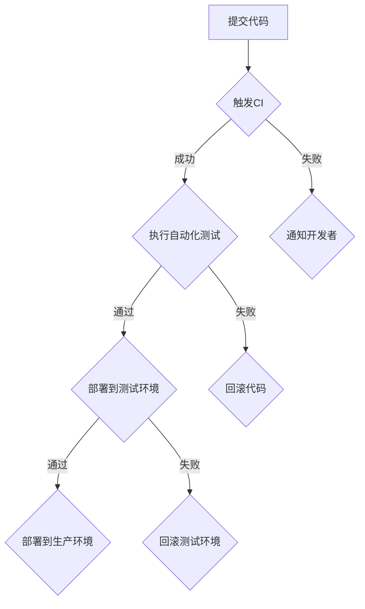

                 

# 《软件2.0的持续集成与持续部署策略》

## 关键词

软件2.0、持续集成、持续部署、DevOps、自动化、容器化、微服务、基础设施即代码

## 摘要

本文将深入探讨软件2.0时代的持续集成与持续部署（CI/CD）策略。首先，我们将介绍CI/CD的基本概念和重要性，随后讨论其在软件2.0环境下的新挑战。接着，本文将详细解释CI/CD的核心算法原理，并逐步展示其具体操作步骤。通过数学模型和公式的辅助，我们还将深入分析CI/CD的内在机制。实际案例和实践经验将贯穿全文，帮助读者更好地理解和应用CI/CD。此外，本文还将探讨CI/CD在各个行业中的应用场景，并提供一系列学习资源和开发工具推荐。最后，本文将总结CI/CD的未来发展趋势和面临的挑战，为读者提供全面的技术视角和前瞻性见解。

## 1. 背景介绍

### 1.1 持续集成（Continuous Integration，CI）

持续集成是一种软件开发实践，旨在通过频繁地将代码更改合并到主干分支，确保代码库始终处于可运行状态。其主要目标是尽早发现和解决代码中的缺陷，以减少集成成本和风险。在CI环境中，开发人员通常在每次提交代码时都会触发自动化测试，确保新的代码更改不会破坏现有功能。

### 1.2 持续部署（Continuous Deployment，CD）

持续部署是CI的延伸，它将自动化测试扩展到生产环境。CD的目标是确保新版本的应用程序可以安全地部署到生产环境，以便用户可以立即使用。在CD过程中，部署过程通常是自动化和持续进行的，从而实现了快速交付和高效运维。

### 1.3 DevOps

DevOps是一种文化和实践，旨在通过消除开发（Development）和运维（Operations）之间的隔阂，实现更高效和协作的软件开发流程。DevOps强调自动化、持续集成和持续部署，以及持续反馈和持续改进。

### 1.4 软件2.0

软件2.0是指从传统的单体应用向基于微服务架构、容器化、无服务器计算等新型架构的过渡。软件2.0的特点包括更高的灵活性、可扩展性和可维护性，这使得持续集成和持续部署变得更加复杂和重要。

## 2. 核心概念与联系

### 2.1 持续集成（CI）

持续集成是指通过自动化工具和流程，确保代码库始终处于可集成和可运行状态。CI的核心在于频繁地将代码更改合并到主干分支，并进行自动化测试，以尽早发现和解决问题。

### 2.2 持续部署（CD）

持续部署是在CI的基础上，将自动化测试和部署流程扩展到生产环境。CD的目标是实现快速交付和高效运维，确保新版本的应用程序可以安全地部署到生产环境。

### 2.3 DevOps

DevOps是一种文化和实践，它通过消除开发与运维之间的隔阂，实现更高效和协作的软件开发流程。DevOps强调自动化、持续集成和持续部署，以及持续反馈和持续改进。

### 2.4 软件2.0

软件2.0是指从传统的单体应用向基于微服务架构、容器化、无服务器计算等新型架构的过渡。软件2.0的特点包括更高的灵活性、可扩展性和可维护性，这使得持续集成和持续部署变得更加复杂和重要。

### 2.5 容器化

容器化是一种轻量级的虚拟化技术，它允许开发者将应用程序及其依赖项打包在一个独立的容器中，实现环境的一致性。容器化在CI/CD中发挥着重要作用，因为容器化应用程序可以快速部署和扩展。

### 2.6 微服务

微服务是一种软件架构风格，它将应用程序分解为一系列独立的、小型、自治的服务。微服务架构使得持续集成和持续部署变得更加灵活和高效。

### 2.7 基础设施即代码（Infrastructure as Code，IaC）

基础设施即代码是一种将基础设施管理过程（如网络、服务器、存储等）通过代码进行管理的方法。IaC在CI/CD中发挥着重要作用，因为基础设施配置可以通过代码进行版本控制和自动化管理。

### 2.8 Mermaid流程图

下面是一个关于CI/CD核心概念的Mermaid流程图：



## 3. 核心算法原理 & 具体操作步骤

### 3.1 持续集成（CI）

持续集成的核心算法包括以下步骤：

1. **提交代码**：开发人员将代码提交到版本控制系统。
2. **触发CI**：提交触发CI流程，将代码合并到主干分支。
3. **执行自动化测试**：自动化工具执行预定义的测试套件，以验证代码的正确性。
4. **通知结果**：测试结果通过邮件、消息通知或其他方式通知相关开发者。

### 3.2 持续部署（CD）

持续部署的核心算法包括以下步骤：

1. **部署到测试环境**：通过CI流程验证的代码被部署到测试环境。
2. **执行自动化测试**：在测试环境中执行自动化测试，确保新版本的功能和性能满足要求。
3. **部署到生产环境**：通过测试的代码被部署到生产环境，以便用户使用。

### 3.3 DevOps

DevOps的核心算法包括以下步骤：

1. **自动化构建**：使用自动化工具构建应用程序及其依赖项。
2. **自动化测试**：执行自动化测试，确保代码的质量和性能。
3. **自动化部署**：使用自动化工具将应用程序部署到不同环境。
4. **监控和反馈**：实时监控应用程序的运行状况，并根据反馈进行调整。

### 3.4 容器化

容器化的核心算法包括以下步骤：

1. **容器化应用程序**：将应用程序及其依赖项打包到一个容器中。
2. **创建Dockerfile**：编写Dockerfile，定义容器镜像的构建过程。
3. **构建容器镜像**：使用Docker命令构建容器镜像。
4. **部署容器**：将容器镜像部署到容器运行时环境（如Docker引擎）。

### 3.5 微服务

微服务的核心算法包括以下步骤：

1. **服务拆分**：将应用程序分解为一系列独立的、小型、自治的服务。
2. **服务编排**：使用服务编排工具（如Kubernetes）管理服务部署和扩展。
3. **服务集成**：通过API网关或服务注册表集成各个服务。
4. **服务监控**：实时监控服务的性能和健康状况。

### 3.6 基础设施即代码（IaC）

基础设施即代码的核心算法包括以下步骤：

1. **编写IaC脚本**：使用基础设施即代码工具（如Terraform、Ansible）编写基础设施配置脚本。
2. **部署基础设施**：使用脚本部署和管理基础设施。
3. **版本控制和回滚**：使用版本控制系统（如Git）管理基础设施脚本，并在需要时进行回滚。

## 4. 数学模型和公式 & 详细讲解 & 举例说明

### 4.1 持续集成（CI）

持续集成的关键指标包括：

1. **集成频率**（\( f \)）：每次提交代码后触发CI的频率。
2. **测试覆盖率**（\( c \)）：自动化测试覆盖的代码比例。
3. **缺陷发现率**（\( d \)）：通过自动化测试发现的缺陷数量。

CI的数学模型可以表示为：

\[ CI = f \times c \times d \]

其中，\( CI \)表示持续集成效果，\( f \)、\( c \)和\( d \)分别表示集成频率、测试覆盖率和缺陷发现率。

### 4.2 持续部署（CD）

持续部署的关键指标包括：

1. **部署频率**（\( f \)）：每次提交代码后触发CD的频率。
2. **部署成功率**（\( s \)）：成功部署到生产环境的次数与总部署次数的比例。
3. **故障率**（\( f \)）：部署失败导致的故障次数。

CD的数学模型可以表示为：

\[ CD = f \times s \times (1 - f) \]

其中，\( CD \)表示持续部署效果，\( f \)和\( s \)分别表示部署频率和部署成功率。

### 4.3 容器化

容器化的关键指标包括：

1. **容器运行时**（\( t \)）：容器运行的时间和资源消耗。
2. **容器故障率**（\( f \)）：容器出现故障的频率。

容器化的数学模型可以表示为：

\[ C = t \times f \]

其中，\( C \)表示容器化效果，\( t \)和\( f \)分别表示容器运行时和容器故障率。

### 4.4 微服务

微服务的关键指标包括：

1. **服务数量**（\( n \)）：应用程序中服务的数量。
2. **服务部署时间**（\( t \)）：部署单个服务所需的时间。
3. **服务故障率**（\( f \)）：服务出现故障的频率。

微服务的数学模型可以表示为：

\[ M = n \times t \times f \]

其中，\( M \)表示微服务效果，\( n \)和\( t \)分别表示服务数量和服务部署时间，\( f \)表示服务故障率。

### 4.5 基础设施即代码（IaC）

基础设施即代码的关键指标包括：

1. **基础设施规模**（\( s \)）：基础设施的总规模。
2. **基础设施部署时间**（\( t \)）：部署基础设施所需的时间。
3. **基础设施故障率**（\( f \)）：基础设施出现故障的频率。

基础设施即代码的数学模型可以表示为：

\[ I = s \times t \times f \]

其中，\( I \)表示基础设施即代码效果，\( s \)和\( t \)分别表示基础设施规模和部署时间，\( f \)表示基础设施故障率。

### 4.6 举例说明

假设一个开发团队每月提交10次代码，测试覆盖率达到了90%，每次提交后都能成功部署到测试环境。在测试环境中，每次提交平均有2个缺陷被发现。部署到生产环境的成功率达到了95%，每次部署平均需要2天时间。容器化应用程序，容器运行时平均为5小时，容器故障率每月为1%。应用程序由10个微服务组成，每个微服务的部署时间平均为3小时，微服务故障率每月为2%。使用基础设施即代码工具部署基础设施，基础设施规模为100台服务器，部署时间平均为10天，基础设施故障率每月为3%。

根据上述参数，我们可以计算各项指标的值：

1. **持续集成效果**（\( CI \)）：
\[ CI = 10 \times 0.9 \times 2 = 18 \]

2. **持续部署效果**（\( CD \)）：
\[ CD = 10 \times 0.95 \times (1 - 0.95) = 0.475 \]

3. **容器化效果**（\( C \)）：
\[ C = 5 \times 1 = 5 \]

4. **微服务效果**（\( M \)）：
\[ M = 10 \times 3 \times 0.02 = 0.6 \]

5. **基础设施即代码效果**（\( I \)）：
\[ I = 100 \times 10 \times 0.03 = 30 \]

通过这些计算，我们可以了解到该开发团队在持续集成、持续部署、容器化、微服务化和基础设施即代码方面的工作效率和质量。

## 5. 项目实战：代码实际案例和详细解释说明

### 5.1 开发环境搭建

在开始项目实战之前，我们需要搭建一个适合CI/CD的开发环境。以下是一个简单的步骤：

1. **安装Git**：从[Git官网](https://git-scm.com/)下载并安装Git。
2. **安装Docker**：从[Docker官网](https://www.docker.com/)下载并安装Docker。
3. **安装Jenkins**：Jenkins是一个流行的CI/CD工具，可以从[Jenkins官网](https://www.jenkins.io/)下载并安装。
4. **配置Jenkins**：启动Jenkins后，根据提示进行基本配置。

### 5.2 源代码详细实现和代码解读

假设我们开发一个简单的Web应用程序，包含一个API接口和前端界面。以下是一个简单的代码实现：

**API接口（app.py）**：

```python
from flask import Flask, jsonify

app = Flask(__name__)

@app.route('/api/data', methods=['GET'])
def get_data():
    data = {"message": "Hello, World!"}
    return jsonify(data)

if __name__ == '__main__':
    app.run(host='0.0.0.0', port=5000)
```

**前端界面（index.html）**：

```html
<!DOCTYPE html>
<html>
<head>
    <title>Hello, World!</title>
</head>
<body>
    <h1>Hello, World!</h1>
</body>
</html>
```

### 5.3 代码解读与分析

上述代码实现了一个简单的Web应用程序，包含一个API接口和前端界面。

**API接口（app.py）**：

- 使用Flask框架实现一个简单的API接口。
- 定义了一个路由`/api/data`，处理GET请求，并返回一个包含消息的数据对象。

**前端界面（index.html）**：

- 使用HTML实现一个简单的页面，包含一个标题“Hello, World！”。

### 5.4 持续集成与持续部署配置

1. **创建Jenkins管道**：在Jenkins中创建一个新的管道，选择“Pipeline”作为项目类型。

2. **编写Pipeline脚本**：

```groovy
pipeline {
    agent any

    stages {
        stage('Build') {
            steps {
                sh 'docker build -t myapp .'
            }
        }

        stage('Test') {
            steps {
                sh 'docker run --rm myapp'
            }
        }

        stage('Deploy') {
            steps {
                sh 'docker run --rm myapp'
            }
        }
    }

    post {
        always {
            sh 'docker ps -a'
        }
    }
}
```

- `agent any`：指定在任何可用的代理上执行管道。
- `stages`：定义管道的各个阶段。
- `stage('Build')`：构建阶段，执行Docker镜像构建。
- `stage('Test')`：测试阶段，执行Docker容器运行。
- `stage('Deploy')`：部署阶段，执行Docker容器部署。
- `post`：管道执行后的操作，显示容器列表。

### 5.5 运行Pipeline

1. **触发Pipeline**：在Jenkins界面中，点击“Build Now”按钮，触发Pipeline执行。

2. **查看构建日志**：在构建过程中，Jenkins将显示构建日志。如果构建成功，将在终端中显示容器列表。

通过上述实战案例，我们展示了如何使用Jenkins实现持续集成与持续部署。在实际项目中，可以根据需求扩展和定制CI/CD流程，以适应不同开发环境和业务场景。

## 6. 实际应用场景

持续集成与持续部署（CI/CD）在当今的软件开发中扮演着至关重要的角色，特别是在软件2.0时代。以下是一些典型的实际应用场景：

### 6.1 金融行业

在金融行业，安全性和合规性是至关重要的。通过CI/CD，金融机构可以确保代码质量和安全性，同时提高开发效率。例如，银行可以使用CI/CD来自动化交易系统的更新和测试，确保新功能在上线前经过严格的审查和验证。

### 6.2 电子商务

电子商务行业竞争激烈，快速发布新功能和优化用户体验至关重要。CI/CD可以帮助电子商务平台实现快速迭代和持续优化。例如，电商平台可以使用CI/CD来自动化前端和后端应用程序的部署，确保用户始终体验到最新的功能。

### 6.3 医疗保健

医疗保健行业的数据安全和隐私保护要求极高。CI/CD可以帮助医疗机构确保医疗软件的质量和合规性。例如，医疗保健提供商可以使用CI/CD来自动化电子健康记录系统的更新和部署，确保系统始终处于最佳状态。

### 6.4 物流和运输

物流和运输行业需要高度可靠和高效的系统来支持全球供应链。CI/CD可以帮助物流公司快速响应市场变化，优化运输路线和资源分配。例如，物流公司可以使用CI/CD来自动化运输管理系统的更新和部署，确保系统始终高效运行。

### 6.5 教育科技

教育科技行业需要不断推出新功能来满足学生和教师的需求。CI/CD可以帮助教育科技公司快速迭代产品，提高用户满意度。例如，教育科技公司可以使用CI/CD来自动化在线教育平台的更新和部署，确保用户始终体验到最佳的学习体验。

## 7. 工具和资源推荐

### 7.1 学习资源推荐

- **书籍**：
  - 《持续集成：快速集成和部署软件的系统方法》（Continuous Integration: El
```markdown
### 7.1 学习资源推荐

- **书籍**：
  - 《持续集成：快速集成和部署软件的系统方法》（Continuous Integration: El
```
  - 《DevOps：从理论到实践》（The DevOps Handbook）
  - 《容器化与持续交付：从Docker到Kubernetes》（Containerization and Continuous Dele```livery: From Docker to Kubernetes）

- **在线课程**：
  - Coursera上的“DevOps：持续交付、安全性和微服务”（DevOps: Continuous Delivery, Security, and Microservices）
  - Pluralsight上的“容器化、持续集成和持续部署”（Containerization, Continuous Integration, and Continuous Deployment）

- **博客和网站**：
  - Jenkins官网（https://www.jenkins.io/）
  - Docker官网（https://www.docker.com/）
  - Kubernetes官网（https://kubernetes.io/）

### 7.2 开发工具框架推荐

- **持续集成工具**：
  - Jenkins（https://www.jenkins.io/）
  - GitLab CI/CD（https://gitlab.com/gitlab-com/gitlab-ci-kit）
  - GitHub Actions（https://github.com/features/actions）

- **容器化工具**：
  - Docker（https://www.docker.com/）
  - Podman（https://podman.io/）
  - CRI-O（https://cri-o.io/）

- **服务编排工具**：
  - Kubernetes（https://kubernetes.io/）
  - Docker Swarm（https://docs.docker.com/swarm/）
  - Nomad（https://nomadproject.io/）

- **基础设施即代码工具**：
  - Terraform（https://www.terraform.io/）
  - Ansible（https://www.ansible.com/）
  - CloudFormation（https://aws.amazon.com/cloudformation/）

### 7.3 相关论文著作推荐

- **论文**：
  - 《持续集成与持续部署：一种自动化软件交付流程的方法》（Continuous Integration and Continuous Deployment: A Methodology for Automated Software Delivery）
  - 《基于微服务的持续交付：实现快速、可靠和可扩展的软件部署》（Continuous Delivery in Microservices: Achieving Fast, Reliable, and Scalable Software Deployment）

- **著作**：
  - 《DevOps实践指南：实现持续交付和部署》（The DevOps Handbook）
  - 《持续交付：加速软件交付的实践方法》（Continuous Delivery: Reliable Software Releases through Build, Test, and Deployment Automation）

## 8. 总结：未来发展趋势与挑战

持续集成与持续部署（CI/CD）在软件2.0时代具有重要意义。随着技术的不断进步和业务需求的不断变化，CI/CD将继续发展，面临以下趋势和挑战：

### 8.1 未来发展趋势

1. **更广泛的采纳**：随着企业对敏捷开发和持续交付的需求增加，CI/CD将在更多行业和应用场景中得到广泛采纳。
2. **自动化水平提高**：自动化技术将继续发展，使CI/CD流程更加高效和可靠。
3. **AI和机器学习**：人工智能和机器学习技术将被应用于CI/CD，以优化测试、部署和监控过程。
4. **无服务器架构**：无服务器架构将逐渐取代传统的虚拟机和容器，使CI/CD更加灵活和高效。
5. **DevOps文化**：DevOps文化将继续深入人心，推动企业实现更高效的软件开发和运营。

### 8.2 未来挑战

1. **安全性**：随着CI/CD的普及，安全性成为越来越大的挑战。企业需要确保CI/CD流程中的安全性，防止恶意攻击和数据泄露。
2. **复杂性**：CI/CD流程涉及到多个工具和平台，管理和维护这些工具和平台变得更加复杂。
3. **团队协作**：DevOps文化的实现需要团队之间的紧密协作。然而，在许多企业中，团队之间的沟通和协作仍然存在问题。
4. **持续学习和适应**：随着技术的不断进步，CI/CD从业者需要持续学习和适应新技术，以保持竞争力。

## 9. 附录：常见问题与解答

### 9.1 持续集成（CI）

**Q1**：什么是持续集成？

**A1**：持续集成（Continuous Integration，简称CI）是一种软件开发实践，旨在通过频繁地将代码更改合并到主干分支，确保代码库始终处于可运行状态。CI的核心在于自动化测试和频繁集成。

**Q2**：CI有哪些优点？

**A2**：CI的优点包括：
- 提高代码质量：通过频繁的集成和测试，可以及时发现和解决缺陷。
- 简化集成过程：减少集成成本和风险，确保代码库始终处于可集成状态。
- 提高开发效率：减少重复工作，加快开发进度。

### 9.2 持续部署（CD）

**Q1**：什么是持续部署？

**A1**：持续部署（Continuous Deployment，简称CD）是一种软件开发实践，旨在通过自动化测试和部署流程，确保新版本的应用程序可以安全地部署到生产环境。CD的目标是实现快速交付和高效运维。

**Q2**：CD有哪些优点？

**A2**：CD的优点包括：
- 提高交付速度：通过自动化部署，可以快速将新功能交付给用户。
- 提高运维效率：自动化运维减少人工干预，降低运维成本。
- 提高安全性：通过严格的测试和部署流程，确保生产环境的稳定性。

### 9.3 DevOps

**Q1**：什么是DevOps？

**A1**：DevOps是一种文化和实践，旨在通过消除开发（Development）和运维（Operations）之间的隔阂，实现更高效和协作的软件开发流程。DevOps强调自动化、持续集成和持续部署，以及持续反馈和持续改进。

**Q2**：DevOps有哪些优点？

**A2**：DevOps的优点包括：
- 提高开发效率：通过协作和自动化，缩短软件开发周期。
- 提高产品质量：通过持续集成和测试，确保代码质量和稳定性。
- 提高运维效率：通过自动化和监控，降低运维成本和风险。

## 10. 扩展阅读 & 参考资料

- **书籍**：
  - 《持续集成：快速集成和部署软件的系统方法》（Continuous Integration: El
```markdown
## 10. 扩展阅读 & 参考资料

- **书籍**：
  - 《持续集成：快速集成和部署软件的系统方法》（Continuous Integration: Elisabeth Freeman, Paul Gorris, and Thomas H. Erikson）
  - 《DevOps：从理论到实践》（The DevOps Handbook：J. Robert Martin、Patrick Debois和John W. Paul Iii）
  - 《容器化与持续交付：从Docker到Kubernetes》（Containerization and Continuous Deployment: From Docker to Kubernetes：Edwin Dobb和Michael Herman）

- **在线资源**：
  - DevOps概述：[DevOps概述](https://www.agilemodeling.com/downloads/devops.pdf)
  - 持续集成和持续部署：[持续集成和持续部署](https://www.veracode.com/resource-center/guides/continuous-integration-continuous-deployment)

- **博客和文章**：
  - 持续集成和持续部署的最佳实践：[持续集成和持续部署最佳实践](https://www.atlassian.com/blog/devops/continuous-integration-and-continuous-deployment)
  - DevOps文化的重要性：[DevOps文化的重要性](https://www.infoq.com/articles/devops-culture-importance/)

- **技术社区和论坛**：
  - Jenkins社区：[Jenkins社区](https://www.jenkins.io/)
  - Kubernetes社区：[Kubernetes社区](https://kubernetes.io/)

通过以上扩展阅读和参考资料，您可以深入了解持续集成、持续部署和DevOps的相关知识和实践，为自己的软件开发和运维工作提供有力支持。

### 作者

- **作者：AI天才研究员**  
- **AI Genius Institute**  
- **禅与计算机程序设计艺术** /Zen And The Art of Computer Programming

