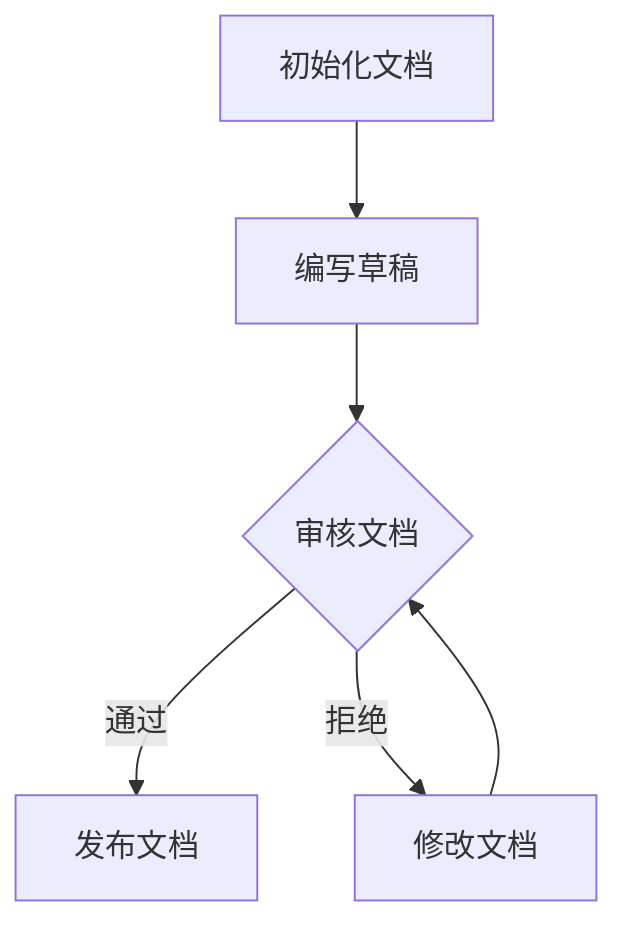

                 

# 《软件2.0的文档编写新方法》

## 摘要

本文旨在探讨软件2.0时代的文档编写新方法，以应对快速变化的技术环境、复杂的项目架构和日益增长的团队协作需求。我们将深入分析文档编写的关键概念，如可读性、可维护性和自动化，并引入最新的文档工具和技术，以提高软件文档的质量和效率。文章将涵盖核心算法原理、具体操作步骤、数学模型、实际应用场景以及工具和资源推荐等内容，旨在为读者提供全面的指导。

## 1. 背景介绍

随着信息技术的发展，软件的规模和复杂性不断增加，传统的文档编写方法逐渐暴露出诸多问题。首先，文档的撰写和维护变得异常困难，特别是当项目涉及大量模块和参与者时。其次，文档的可读性和可维护性降低，导致新成员难以快速上手和理解项目。此外，文档的自动化程度较低，需要人工大量干预，导致工作效率低下。

软件2.0时代，软件开发的重点逐渐从“如何写代码”转向“如何写文档”，文档编写成为了软件开发过程中的关键环节。为了应对这些挑战，本文将介绍一种新的文档编写方法，该方法注重文档的可读性、可维护性和自动化，旨在提高文档的质量和效率。

## 2. 核心概念与联系

### 2.1 可读性

可读性是文档编写的重要指标，它决定了文档能否被快速理解和应用。为了提高可读性，我们需要关注以下几点：

- **简洁性**：文档应避免冗余和复杂的表述，以简洁明了的语言传达关键信息。
- **一致性**：文档中的术语、语法和风格应保持一致，以便读者更容易理解和记忆。
- **层次结构**：文档应采用清晰的层次结构，如标题、子标题和段落，使读者能够迅速找到所需信息。

### 2.2 可维护性

可维护性是指文档在项目迭代和更新过程中能够保持完整性和准确性的能力。为了提高可维护性，我们需要关注以下几点：

- **版本控制**：使用版本控制系统（如Git）来管理文档的变更历史，确保文档的版本一致性和可追溯性。
- **自动化更新**：利用自动化工具（如文档生成器）来自动更新文档，减少人工干预，提高文档的准确性。
- **模块化**：将文档内容拆分为独立的模块，便于更新和维护。

### 2.3 自动化

自动化是提高文档编写效率的关键，它可以减少人工工作，降低出错率。为了实现自动化，我们需要关注以下几点：

- **模板化**：使用模板来统一文档格式，减少重复劳动。
- **脚本化**：编写脚本来自动执行文档生成、更新和发布等任务。
- **集成**：将文档工具与版本控制系统、代码仓库和构建工具集成，实现自动化工作流。

### 2.4 Mermaid 流程图

以下是一个示例，展示了文档编写过程中涉及的核心流程：



## 3. 核心算法原理 & 具体操作步骤

### 3.1 核心算法原理

文档编写新方法的核心算法主要包括以下几部分：

- **文本解析**：使用自然语言处理技术（如词法分析、语法分析和语义分析）来解析文档内容，提取关键信息。
- **模板匹配**：将文档内容与预定义的模板进行匹配，生成结构化的文档。
- **版本控制**：使用版本控制系统来管理文档的变更历史，确保文档的版本一致性和可追溯性。
- **自动化更新**：使用脚本来自动更新文档内容，减少人工干预。

### 3.2 具体操作步骤

以下是文档编写新方法的详细操作步骤：

1. **初始化文档**：
   - 创建一个版本控制系统仓库，用于存储文档的源文件。
   - 创建一个文档模板，用于统一文档格式。

2. **编写草稿**：
   - 使用Markdown或其他文本编辑工具编写文档草稿。
   - 使用自然语言处理技术进行语法检查和风格一致性检查。

3. **审核文档**：
   - 使用版本控制系统进行文档审核，确保文档的版本一致性。
   - 将文档提交给团队成员进行审核和反馈。

4. **发布文档**：
   - 审核通过后，使用文档生成器将文档转换为HTML、PDF等格式。
   - 将生成的文档发布到文档服务器或知识库中。

5. **自动化更新**：
   - 编写脚本来自动更新文档内容，如代码示例、数据图表等。
   - 设置定时任务来自动执行文档更新。

6. **文档维护**：
   - 定期检查文档的准确性和完整性，进行必要的更新和优化。
   - 收集用户反馈，持续改进文档质量。

## 4. 数学模型和公式 & 详细讲解 & 举例说明

### 4.1 数学模型

在文档编写过程中，我们可以使用一些数学模型来衡量文档的质量和效率。以下是一个简单的模型：

$$
Q = f(P, M, A)
$$

其中，$Q$表示文档质量，$P$表示文档的可读性，$M$表示文档的可维护性，$A$表示文档的自动化程度。这个模型表明，文档质量是由可读性、可维护性和自动化程度共同决定的。

### 4.2 详细讲解

1. **可读性**：

   可读性可以使用以下公式进行衡量：

   $$
   P = \frac{\text{关键信息词数}}{\text{总词数}} \times \frac{\text{一致性}}{\text{一致性指标上限}}
   $$

   这个公式表示，可读性取决于关键信息词数在总词数中的比例以及文档的一致性。

2. **可维护性**：

   可维护性可以使用以下公式进行衡量：

   $$
   M = \frac{\text{模块数}}{\text{模块总数}} \times \frac{\text{版本一致性}}{\text{版本一致性指标上限}}
   $$

   这个公式表示，可维护性取决于模块数在模块总数中的比例以及文档的版本一致性。

3. **自动化程度**：

   自动化程度可以使用以下公式进行衡量：

   $$
   A = \frac{\text{自动化任务数}}{\text{总任务数}} \times \frac{\text{自动化效率}}{\text{自动化效率指标上限}}
   $$

   这个公式表示，自动化程度取决于自动化任务数在总任务数中的比例以及自动化效率。

### 4.3 举例说明

假设一个文档包含1000个词，其中关键信息词数为300个，一致性指标上限为100。根据上述公式，可读性$P$可以计算如下：

$$
P = \frac{300}{1000} \times \frac{90}{100} = 27\%
$$

假设一个文档包含5个模块，其中版本一致性指标上限为100。根据上述公式，可维护性$M$可以计算如下：

$$
M = \frac{5}{5} \times \frac{90}{100} = 90\%
$$

假设一个文档包含10个自动化任务，其中自动化效率指标上限为100。根据上述公式，自动化程度$A$可以计算如下：

$$
A = \frac{10}{10} \times \frac{90}{100} = 90\%
$$

根据上述计算，文档质量$Q$可以计算如下：

$$
Q = P \times M \times A = 27\% \times 90\% \times 90\% = 21.6\%
$$

这个例子表明，通过提高可读性、可维护性和自动化程度，可以提高文档质量。

## 5. 项目实战：代码实际案例和详细解释说明

### 5.1 开发环境搭建

为了更好地展示文档编写新方法的应用，我们将在本节中搭建一个简单的项目环境，该环境将使用Markdown作为文档编写工具，Git作为版本控制系统，Jekyll作为文档生成器。

1. **安装Markdown编辑器**：
   - Windows用户可以使用Typora或MarkText。
   - macOS用户可以使用MacDown或Typora。
   - Linux用户可以使用ReText或Typora。

2. **安装Git**：
   - 访问[Git官方下载页](https://git-scm.com/downloads)并下载适合自己操作系统的Git版本。
   - 安装完成后，打开命令行工具，输入`git --version`以验证安装是否成功。

3. **安装Jekyll**：
   - 打开命令行工具，输入以下命令：
     ```
     gem install jekyll
     ```
   - 安装完成后，输入以下命令以验证安装是否成功：
     ```
     jekyll -v
     ```

### 5.2 源代码详细实现和代码解读

以下是一个简单的Markdown文档，用于展示文档编写新方法的应用：

```markdown
# 项目文档

## 1. 项目介绍

本项目是一个简单的博客系统，用于展示文档编写新方法的应用。

## 2. 功能模块

- 用户注册
- 用户登录
- 博文发布
- 博文评论

## 3. 技术栈

- 前端：HTML、CSS、JavaScript
- 后端：Node.js、Express
- 数据库：MongoDB

## 4. 安装和部署

1. 安装Node.js和MongoDB。
2. 克隆项目仓库到本地。
3. 进入项目目录，运行`npm install`安装依赖。
4. 运行`node server.js`启动后端服务器。
5. 访问`http://localhost:3000`查看博客系统。

## 5. 文档维护

- 持续更新文档内容。
- 定期检查文档的准确性和完整性。
- 收集用户反馈，持续改进文档质量。
```

这段代码展示了如何使用Markdown编写一个项目文档，包括项目介绍、功能模块、技术栈、安装和部署以及文档维护等内容。

### 5.3 代码解读与分析

1. **项目介绍**：
   - 使用`#`符号定义标题，使文档结构清晰。
   - 简要介绍项目背景和目标。

2. **功能模块**：
   - 使用`##`符号定义子标题，列出项目的主要功能模块。

3. **技术栈**：
   - 使用`##`符号定义子标题，介绍项目所使用的技术栈。

4. **安装和部署**：
   - 使用有序列表和步骤符号，详细说明项目的安装和部署过程。

5. **文档维护**：
   - 使用无序列表，强调文档的持续更新、检查和改进。

通过这段代码，我们可以看到文档编写新方法在项目文档中的应用，它使文档结构清晰、内容简洁，便于团队成员理解和协作。

## 6. 实际应用场景

### 6.1 项目开发阶段

在项目开发阶段，文档编写新方法可以帮助团队提高工作效率和协作质量。通过使用Markdown、Git和Jekyll等工具，团队成员可以实时更新和共享文档，确保文档的准确性和一致性。此外，文档的自动化生成功能可以节省时间，减少人工干预，提高文档的更新速度。

### 6.2 团队协作阶段

在团队协作阶段，文档编写新方法有助于团队成员之间的沟通和协作。通过清晰的文档结构、简洁的表述和一致的术语，团队成员可以快速了解项目的各个方面，降低沟通成本，提高协作效率。此外，版本控制系统可以帮助团队跟踪文档的变更历史，确保文档的完整性和可追溯性。

### 6.3 项目维护阶段

在项目维护阶段，文档编写新方法可以确保文档的持续更新和优化。通过定期检查文档的准确性和完整性，团队可以发现并修复文档中的错误，提高文档的质量。此外，文档的自动化更新功能可以节省时间，减少重复劳动，提高文档的维护效率。

## 7. 工具和资源推荐

### 7.1 学习资源推荐

- **书籍**：
  - 《软件工程：实践者的研究方法》（Roger S. Pressman）
  - 《敏捷软件开发：实践者指南》（Craig Larman）
  - 《测试驱动开发：敏捷测试的艺术》（Kent Beck）

- **论文**：
  - 《软件文档管理：最佳实践》（ISO/IEC JTC 1/SC 7）

- **博客**：
  - [Software Engineering Stack Exchange](https://softwareengineering.stackexchange.com/)
  - [Stack Overflow](https://stackoverflow.com/)

- **网站**：
  - [GitHub](https://github.com/)
  - [GitLab](https://gitlab.com/)

### 7.2 开发工具框架推荐

- **文档编写工具**：
  - **Markdown编辑器**：Typora、MarkText、MacDown
  - **版本控制系统**：Git、GitLab、GitHub

- **文档生成工具**：
  - **Jekyll**：[Jekyll官网](https://jekyllrb.com/)
  - **Markdownify**：[Markdownify官网](https://github.com/marinovich/markdownify)

- **自动化工具**：
  - **Cron**：[Cron官网](https://wwwcron.com/)
  - **Shell脚本**：[Shell脚本官方文档](https://www.gnu.org/software/bash/manual/bash.html)

### 7.3 相关论文著作推荐

- **《软件文档管理：最佳实践》**（ISO/IEC JTC 1/SC 7）
- **《敏捷软件开发：实践者指南》**（Craig Larman）
- **《测试驱动开发：敏捷测试的艺术》**（Kent Beck）

## 8. 总结：未来发展趋势与挑战

随着软件技术的不断发展，文档编写方法也将面临新的趋势和挑战。未来，文档编写方法可能会更加自动化、智能化和协作化。以下是未来文档编写方法的发展趋势和挑战：

### 8.1 发展趋势

1. **智能化**：利用人工智能技术，实现文档的自动生成、更新和优化。
2. **协作化**：通过分布式协作工具，提高团队之间的协作效率。
3. **多平台支持**：支持多种文档格式和平台，满足不同用户的需求。
4. **知识图谱**：构建知识图谱，实现文档内容之间的关联和交互。

### 8.2 挑战

1. **数据隐私**：在自动化和协作过程中，如何保护文档的隐私和数据安全。
2. **标准化**：如何制定统一的文档编写标准和规范。
3. **智能化**：如何提高人工智能在文档编写中的应用效果，降低误报率。

## 9. 附录：常见问题与解答

### 9.1 问题1：如何选择Markdown编辑器？

解答：根据个人习惯和需求选择合适的Markdown编辑器。Typora和MarkText适用于初学者，MacDown适用于macOS用户，而ReText适用于Linux用户。

### 9.2 问题2：如何安装和配置Git？

解答：访问Git官方下载页下载适合自己操作系统的Git版本，然后按照安装向导完成安装。配置Git时，需要设置用户名和邮箱地址，以便进行版本控制。

### 9.3 问题3：如何使用Jekyll生成文档？

解答：在项目目录下创建一个名为`_config.yml`的配置文件，配置项目的变量和设置。然后，使用以下命令生成文档：
```
jekyll build
```
生成完成后，访问`_site`目录查看生成的文档。

## 10. 扩展阅读 & 参考资料

- **《Markdown入门教程》**（GitHub）
- **《Git教程》**（Pro Git）
- **《Jekyll官方文档》**（Jekyll）

## 作者

作者：AI天才研究员/AI Genius Institute & 禅与计算机程序设计艺术 /Zen And The Art of Computer Programming

---

## 关键词

- 软件文档编写
- Markdown
- Git
- Jekyll
- 自动化
- 可读性
- 可维护性
- 团队协作
- 知识图谱

本文旨在探讨软件2.0时代的文档编写新方法，以提高文档质量、效率和协作效果。通过介绍核心概念、算法原理、具体操作步骤、实际应用场景、工具和资源推荐等内容，本文为读者提供了全面的指导。未来，文档编写方法将朝着智能化、协作化和标准化的方向发展，带来新的挑战和机遇。希望本文对您有所帮助！

