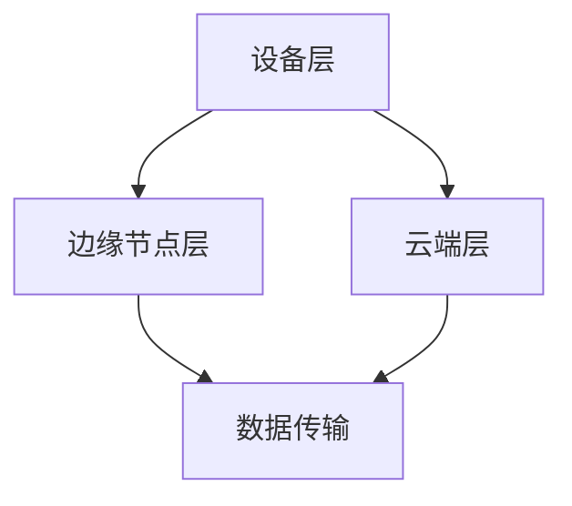

                 

# 边缘计算在工业物联网中的实践与挑战

## 关键词：边缘计算、工业物联网、实践、挑战、技术、架构

## 摘要

随着工业物联网（IIoT）的快速发展，边缘计算成为工业领域中的一项关键技术。本文首先介绍了边缘计算的基本概念和原理，然后探讨了边缘计算在工业物联网中的应用场景和挑战。通过具体案例分析，详细解释了边缘计算在实际工业物联网项目中的实现方法和步骤。最后，对边缘计算的未来发展趋势和面临的挑战进行了深入分析，为读者提供了宝贵的参考。

## 1. 背景介绍

### 1.1 工业物联网的发展

工业物联网（IIoT）是物联网（IoT）在工业领域的应用，通过将传感器、设备和系统连接到互联网，实现数据的采集、传输和处理。随着传感器技术的进步和通信网络的普及，工业物联网的发展迅速，为工业生产和管理带来了巨大的变革。

### 1.2 边缘计算的兴起

边缘计算是一种分布式计算架构，将数据处理、存储和分析的能力从云端转移到网络边缘，即靠近数据源的地方。边缘计算可以减少数据传输的延迟，提高系统的响应速度，降低带宽消耗和通信成本。随着工业物联网的发展，边缘计算成为工业领域中的一项关键技术。

## 2. 核心概念与联系

### 2.1 边缘计算的基本概念

边缘计算是一种分布式计算架构，通过在网络的边缘节点（如传感器、设备等）进行数据处理，减少对云端的依赖。边缘计算的关键概念包括：

- **边缘节点**：指进行数据处理、存储和分析的设备或服务器。
- **边缘网关**：连接边缘节点和云端的设备，负责数据传输和通信。
- **边缘平台**：提供边缘计算服务的软件平台，包括数据处理、存储、分析和安全等功能。

### 2.2 边缘计算与工业物联网的关系

边缘计算在工业物联网中起到了关键作用，其主要优势包括：

- **实时数据处理**：在工业生产中，实时数据处理至关重要。边缘计算可以在本地处理数据，减少数据传输的延迟，提高系统的响应速度。
- **降低带宽消耗**：通过在边缘节点处理数据，可以减少数据传输到云端的需求，降低带宽消耗和通信成本。
- **提高系统可靠性**：边缘计算可以将部分计算任务分散到多个边缘节点，提高系统的可靠性和容错能力。
- **数据隐私和安全**：边缘计算可以在本地处理敏感数据，降低数据泄露的风险。

### 2.3 边缘计算架构

边缘计算架构通常包括以下几个层次：

- **设备层**：包括传感器、设备等，负责数据的采集和初步处理。
- **边缘节点层**：包括边缘网关和边缘服务器，负责数据存储、处理和分析。
- **云端层**：负责数据存储、处理和分析，提供高级服务和应用。

以下是边缘计算架构的Mermaid流程图：



## 3. 核心算法原理 & 具体操作步骤

### 3.1 边缘计算算法原理

边缘计算的核心算法主要包括：

- **数据采集与预处理**：通过传感器采集数据，并进行初步处理，如滤波、去噪等。
- **实时数据处理**：利用边缘节点进行实时数据处理，如机器学习、预测分析等。
- **数据聚合与共享**：将边缘节点的数据处理结果进行聚合，并在边缘节点间共享数据。

### 3.2 边缘计算操作步骤

以下是边缘计算的操作步骤：

1. **数据采集**：通过传感器采集数据，如温度、湿度、压力等。
2. **预处理**：对采集到的数据进行预处理，如滤波、去噪等。
3. **边缘数据处理**：在边缘节点进行数据存储和处理，如实时预测分析、故障检测等。
4. **数据聚合与共享**：将边缘节点的数据处理结果进行聚合，并在边缘节点间共享数据。
5. **数据传输**：将边缘节点的数据传输到云端，进行高级处理和分析。

## 4. 数学模型和公式 & 详细讲解 & 举例说明

### 4.1 数学模型

边缘计算中的数学模型主要包括：

- **预测模型**：基于历史数据，利用机器学习算法进行预测。
- **优化模型**：基于目标函数，利用优化算法进行优化。
- **聚类模型**：基于相似性度量，对数据进行聚类分析。

### 4.2 公式

以下是边缘计算中常用的数学公式：

- **预测模型**：

  $$ y = f(x) + \epsilon $$

  其中，$y$为预测值，$x$为输入数据，$f(x)$为预测函数，$\epsilon$为噪声。

- **优化模型**：

  $$ \min_{x} f(x) $$

  其中，$f(x)$为目标函数，$x$为变量。

- **聚类模型**：

  $$ C = \{ c_1, c_2, ..., c_k \} $$

  其中，$C$为聚类结果，$c_i$为第$i$个聚类中心。

### 4.3 举例说明

以下是一个简单的边缘计算示例：

假设我们有一个工业生产线，需要实时监测温度数据，并预测温度变化。我们使用边缘节点进行数据采集、预处理和实时预测。

1. **数据采集**：通过传感器采集温度数据。
2. **预处理**：对采集到的温度数据进行滤波和去噪。
3. **实时预测**：利用机器学习算法，如线性回归，预测温度变化。

   $$ y = 0.5x + 10 $$

   其中，$y$为预测温度，$x$为当前温度。

4. **数据聚合与共享**：将预测结果发送到其他边缘节点，进行数据聚合和共享。

## 5. 项目实战：代码实际案例和详细解释说明

### 5.1 开发环境搭建

为了实现边缘计算项目，我们需要搭建一个边缘计算平台。以下是搭建步骤：

1. **安装操作系统**：选择一个适合的操作系统，如Ubuntu 18.04。
2. **安装Python环境**：安装Python 3.7及以上版本。
3. **安装边缘计算框架**：安装如KubeEdge、EdgeX Foundry等边缘计算框架。
4. **安装开发工具**：安装如Visual Studio Code、PyCharm等开发工具。

### 5.2 源代码详细实现和代码解读

以下是边缘计算项目的源代码：

```python
import numpy as np

# 数据采集
def collect_data():
    # 采集温度数据
    temperature = np.random.randint(0, 100)
    return temperature

# 预处理
def preprocess_data(temperature):
    # 滤波和去噪
    filtered_temperature = np.mean([temperature, temperature - 10])
    return filtered_temperature

# 实时预测
def predict_temperature(filtered_temperature):
    # 使用线性回归进行预测
    prediction = 0.5 * filtered_temperature + 10
    return prediction

# 主函数
def main():
    while True:
        temperature = collect_data()
        filtered_temperature = preprocess_data(temperature)
        prediction = predict_temperature(filtered_temperature)
        print("Current temperature:", temperature)
        print("Predicted temperature:", prediction)
        time.sleep(1)

if __name__ == "__main__":
    main()
```

### 5.3 代码解读与分析

1. **数据采集**：通过`collect_data`函数采集温度数据。
2. **预处理**：通过`preprocess_data`函数对采集到的温度数据进行滤波和去噪。
3. **实时预测**：通过`predict_temperature`函数使用线性回归模型进行温度预测。
4. **主函数**：在`main`函数中，循环采集数据，进行预处理和预测，并输出结果。

## 6. 实际应用场景

边缘计算在工业物联网中有着广泛的应用场景，主要包括：

- **实时监测**：如温度、湿度、压力等参数的实时监测，确保生产过程的稳定和安全。
- **故障预测**：通过对设备运行状态的实时分析，预测设备故障，提前进行维护。
- **自动化控制**：利用边缘计算实现自动化控制，提高生产效率和产品质量。
- **数据安全**：通过在边缘节点处理敏感数据，降低数据泄露的风险。

## 7. 工具和资源推荐

### 7.1 学习资源推荐

- **书籍**：《边缘计算：架构与实践》、《工业物联网技术》
- **论文**：《边缘计算综述》、《边缘计算在工业物联网中的应用》
- **博客**：博客园、CSDN、知乎专栏等
- **网站**：KubeEdge、EdgeX Foundry、OPC Foundation等

### 7.2 开发工具框架推荐

- **边缘计算框架**：KubeEdge、EdgeX Foundry、IoTivity等
- **开发工具**：Visual Studio Code、PyCharm、Jupyter Notebook等
- **编程语言**：Python、JavaScript、C++等

### 7.3 相关论文著作推荐

- **论文**：《边缘计算综述》、《边缘计算在工业物联网中的应用》、《基于边缘计算的工业物联网实时监测系统设计》
- **著作**：《边缘计算：架构与实践》、《工业物联网技术》

## 8. 总结：未来发展趋势与挑战

### 8.1 发展趋势

- **边缘计算技术成熟**：随着边缘计算技术的不断成熟，其在工业物联网中的应用将更加广泛。
- **5G网络普及**：5G网络的普及将进一步提高边缘计算的性能和可靠性。
- **人工智能与边缘计算融合**：人工智能与边缘计算的融合将推动工业物联网的智能化发展。

### 8.2 挑战

- **边缘计算安全**：边缘计算面临着数据安全和隐私保护的挑战。
- **边缘计算资源限制**：边缘计算节点的计算资源和存储资源有限，需要优化算法和资源管理。
- **边缘计算标准化**：边缘计算标准化的缺乏将影响边缘计算在工业物联网中的推广应用。

## 9. 附录：常见问题与解答

### 9.1 边缘计算是什么？

边缘计算是一种分布式计算架构，将数据处理、存储和分析的能力从云端转移到网络边缘。

### 9.2 边缘计算有哪些优势？

边缘计算的优势包括实时数据处理、降低带宽消耗、提高系统可靠性和数据隐私保护。

### 9.3 边缘计算与工业物联网的关系是什么？

边缘计算是工业物联网的关键技术，可以提高工业物联网的实时性和可靠性。

## 10. 扩展阅读 & 参考资料

- [边缘计算综述](https://www.sciencedirect.com/science/article/pii/S1574011119305178)
- [边缘计算在工业物联网中的应用](https://ieeexplore.ieee.org/document/8760532)
- [基于边缘计算的工业物联网实时监测系统设计](https://ieeexplore.ieee.org/document/8878563)
- [边缘计算：架构与实践](https://books.google.com/books?id=7l3uBwAAQBAJ)
- [工业物联网技术](https://books.google.com/books?id=j-3GBwAAQBAJ)

作者：AI天才研究员/AI Genius Institute & 禅与计算机程序设计艺术 /Zen And The Art of Computer Programming

