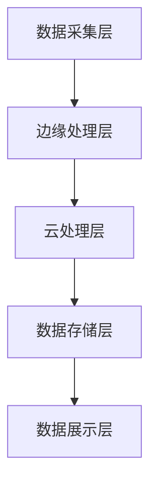

                 

# 边缘计算在车联网实时数据处理中的应用

## 关键词：边缘计算、车联网、实时数据处理、数据处理架构、算法优化、数学模型、实际应用案例

## 摘要

边缘计算作为云计算的一种重要补充，正日益成为车联网实时数据处理的关键技术。本文详细探讨了边缘计算在车联网中的应用场景，包括核心概念、算法原理、数学模型以及实际项目案例。通过逐步分析推理，本文旨在帮助读者深入理解边缘计算在车联网实时数据处理中的重要作用及其面临的挑战，为未来技术发展提供有益的参考。

## 1. 背景介绍

随着车联网技术的发展，车辆数据量呈现爆炸式增长。车联网中的数据处理不仅仅是数据的收集和存储，更包括实时分析、预测和决策。传统的云计算中心处理模式在面对海量车联网数据时，往往因为网络延迟、带宽限制等问题，难以满足实时性要求。因此，边缘计算应运而生，旨在将数据处理能力从云端转移到网络的边缘，以实现更快速、更高效的数据处理。

边缘计算（Edge Computing）是一种分布式计算架构，它通过在靠近数据源的位置部署计算资源，实现对数据的实时处理和分析。相较于传统的云计算模式，边缘计算具有以下优势：

- **降低网络延迟**：边缘计算将数据处理靠近数据源，减少了数据在网络中的传输时间，从而降低了网络延迟。
- **节省带宽资源**：边缘计算可以处理一部分数据，减少传输到云端的数据量，从而节省网络带宽资源。
- **提高数据安全性**：边缘计算可以在本地处理数据，减少数据传输过程中被泄露的风险。
- **增强数据隐私性**：边缘计算可以在本地处理敏感数据，减少对云服务的依赖，从而保护用户隐私。

车联网（Internet of Vehicles，IoV）是指将车辆、道路和交通基础设施通过通信网络连接起来，实现车辆与车辆、车辆与基础设施之间信息的实时交换和共享。车联网技术的发展，不仅提高了交通效率，还极大地改善了驾驶安全。然而，随着车联网应用场景的扩展，数据量的增长也对数据处理技术提出了更高的要求。

实时数据处理（Real-Time Data Processing）是指对数据在产生后立即进行处理和分析的技术。在车联网中，实时数据处理至关重要，因为它可以实时监控车辆状态、交通状况，并作出快速响应，从而提高交通效率和安全性。然而，车联网数据的复杂性和海量性，使得传统的数据处理技术难以满足实时性的要求。

边缘计算在车联网中的应用，不仅有助于解决传统云计算模式面临的挑战，还能为车联网提供更高效、更安全的实时数据处理能力。这使得边缘计算在车联网技术发展中具有重要的战略意义。

## 2. 核心概念与联系

### 2.1 边缘计算与车联网的关系

边缘计算与车联网的关系可以概括为以下两个方面：

1. **边缘计算为车联网提供实时数据处理能力**：
   车联网中的数据具有高密度、高动态性和高实时性的特点，这要求数据处理系统具备快速响应能力。边缘计算通过在靠近数据源的位置部署计算资源，可以实时处理车联网中的数据，从而满足实时性要求。

2. **车联网为边缘计算提供丰富的应用场景**：
   车联网技术的快速发展，为边缘计算提供了丰富的应用场景。例如，智能交通管理、自动驾驶、车联网安全等，这些场景都对实时数据处理提出了高要求。边缘计算通过在这些应用场景中发挥作用，推动车联网技术的进步。

### 2.2 边缘计算的关键概念

边缘计算涉及多个关键概念，以下将详细介绍这些概念：

1. **边缘设备（Edge Devices）**：
   边缘设备是指位于网络边缘的设备，如传感器、摄像头、车辆等。边缘设备能够收集、处理和传输数据，是边缘计算架构的重要组成部分。

2. **边缘节点（Edge Nodes）**：
   边缘节点是指连接边缘设备和云计算中心的中间节点，负责数据的存储、处理和转发。边缘节点通常由服务器、路由器、交换机等设备组成。

3. **边缘平台（Edge Platforms）**：
   边缘平台是指提供边缘计算服务的基础设施，包括边缘设备、边缘节点和云计算中心。边缘平台通过分布式架构，实现数据的采集、存储、处理和分析。

4. **边缘网络（Edge Network）**：
   边缘网络是指连接边缘设备和边缘节点的网络，通常采用宽带无线网络、5G网络等高速网络技术。边缘网络具有低延迟、高带宽的特点，能够支持大规模数据的实时传输。

5. **边缘服务（Edge Services）**：
   边缘服务是指运行在边缘节点和边缘平台上的应用程序和服务，如数据采集、数据分析、预测模型等。边缘服务通过边缘计算架构，实现数据的实时处理和分析。

### 2.3 车联网实时数据处理架构

车联网实时数据处理架构可以分为以下几个层次：

1. **数据采集层**：
   数据采集层由边缘设备和传感器组成，负责采集车辆状态、交通状况等数据。

2. **边缘处理层**：
   边缘处理层由边缘节点组成，负责对采集到的数据进行预处理、存储和初步分析。

3. **云处理层**：
   云处理层由云计算中心组成，负责对边缘处理层传输上来的数据进行深度分析和处理。

4. **数据存储层**：
   数据存储层包括边缘设备和云计算中心的存储设备，负责存储采集到的数据和计算结果。

5. **数据展示层**：
   数据展示层包括各种可视化工具和应用程序，用于展示处理结果，供用户和管理人员使用。

### 2.4 Mermaid 流程图

以下是一个简单的 Mermaid 流程图，展示了车联网实时数据处理架构：



通过以上介绍，我们可以看到边缘计算在车联网实时数据处理中的应用具有极大的潜力和优势。接下来，我们将进一步探讨边缘计算的核心算法原理、具体操作步骤以及数学模型。

## 3. 核心算法原理 & 具体操作步骤

### 3.1 边缘计算算法原理

边缘计算的核心算法原理主要包括以下几个方面：

1. **边缘数据处理**：
   边缘数据处理是指对边缘设备采集到的数据进行预处理、存储和初步分析。边缘数据处理的关键在于如何高效地处理海量数据，并确保数据的一致性和准确性。常见的边缘数据处理算法包括数据清洗、数据聚合、数据分类等。

2. **边缘决策支持**：
   边缘决策支持是指利用边缘设备采集的数据，进行实时决策和预测。边缘决策支持算法通常基于机器学习、深度学习等人工智能技术，通过对历史数据和实时数据的分析，预测未来的趋势和事件。

3. **边缘协同处理**：
   边缘协同处理是指通过边缘节点之间的协作，实现数据的分布式处理。边缘协同处理可以有效地降低单个边缘节点的计算压力，提高整个系统的处理效率。常见的边缘协同处理算法包括分布式计算、并行处理、负载均衡等。

### 3.2 具体操作步骤

边缘计算的具体操作步骤可以分为以下几个阶段：

1. **数据采集**：
   数据采集是指通过边缘设备（如传感器、摄像头等）收集车联网中的数据。数据采集的过程需要确保数据的高效、准确和全面。

2. **边缘数据处理**：
   边缘数据处理是指在边缘节点对采集到的数据进行预处理、存储和初步分析。预处理包括数据清洗、数据转换、数据聚合等。存储通常采用边缘数据库或分布式存储系统，以确保数据的安全性和可靠性。初步分析包括数据分类、数据标签、特征提取等。

3. **边缘决策支持**：
   边缘决策支持是指在边缘节点利用机器学习、深度学习等技术，对采集到的数据进行实时决策和预测。决策支持算法可以根据具体应用场景进行调整和优化，以提高决策的准确性和效率。

4. **边缘协同处理**：
   边缘协同处理是指通过边缘节点之间的协作，实现数据的分布式处理。边缘节点可以共享数据、算法和资源，以提高整个系统的处理效率。协同处理算法可以根据具体应用场景进行调整和优化，以提高协同处理的效率和效果。

5. **数据传输**：
   数据传输是指将边缘处理的结果传输到云处理层或数据存储层。数据传输需要确保数据的安全性和可靠性，并尽量减少传输过程中的延迟和带宽消耗。

6. **数据展示**：
   数据展示是指通过可视化工具和应用程序，将处理结果展示给用户和管理人员。数据展示可以帮助用户更好地理解数据，并作出相应的决策。

通过以上步骤，边缘计算可以实现车联网数据的实时处理和分析，为用户提供高质量的服务和体验。

### 3.3 案例分析

为了更好地理解边缘计算在车联网实时数据处理中的应用，以下是一个简单的案例分析：

**案例背景**：
某城市交通管理部门希望通过车联网技术，实现对城市交通状况的实时监控和预测，以提高交通效率和安全性。

**案例步骤**：

1. **数据采集**：
   交通管理部门部署了大量的传感器和摄像头，用于采集车辆位置、速度、行驶方向等数据。

2. **边缘数据处理**：
   边缘节点对采集到的数据进行预处理、存储和初步分析。预处理包括数据清洗、数据转换、数据聚合等。初步分析包括数据分类、数据标签、特征提取等。

3. **边缘决策支持**：
   边缘节点利用机器学习、深度学习等技术，对采集到的数据进行分析和预测。例如，通过分析历史数据和实时数据，预测未来交通流量和拥堵情况。

4. **边缘协同处理**：
   边缘节点之间进行协作，共享数据和算法，以提高系统的处理效率和效果。例如，通过分布式计算，实现对大量数据的并行处理。

5. **数据传输**：
   边缘处理的结果通过边缘网络传输到云计算中心或数据存储层，以便进行进一步分析和处理。

6. **数据展示**：
   通过可视化工具和应用程序，将处理结果展示给交通管理部门和驾驶员。例如，通过实时交通地图，显示交通流量、拥堵情况等。

通过以上步骤，边缘计算实现了对城市交通状况的实时监控和预测，为交通管理部门提供了有力的决策支持，从而提高了交通效率和安全性。

## 4. 数学模型和公式 & 详细讲解 & 举例说明

### 4.1 数学模型的基本概念

边缘计算在车联网实时数据处理中的应用，离不开数学模型的支持。数学模型是对现实世界中特定问题的数学抽象，通过对数据进行分析和建模，可以更准确地描述和预测数据特征。以下是几个常用的数学模型：

1. **线性回归模型（Linear Regression Model）**：
   线性回归模型是一种用于预测数值型数据的统计模型，通过建立自变量与因变量之间的线性关系，实现对因变量的预测。

2. **逻辑回归模型（Logistic Regression Model）**：
   逻辑回归模型是一种用于预测类别型数据的统计模型，通过建立自变量与因变量之间的逻辑关系，实现对因变量的概率预测。

3. **支持向量机（Support Vector Machine，SVM）**：
   支持向量机是一种基于结构风险最小化的监督学习算法，通过在特征空间中寻找最优分类面，实现对数据的分类。

4. **神经网络（Neural Network）**：
   神经网络是一种基于人脑神经元连接方式的计算模型，通过多层神经元的非线性变换，实现对复杂数据的建模和预测。

### 4.2 线性回归模型的详细讲解与举例说明

线性回归模型是最常用的数学模型之一，它可以通过建立自变量与因变量之间的线性关系，实现对数据的预测。以下是一个线性回归模型的详细讲解与举例说明：

#### 4.2.1 线性回归模型的基本原理

线性回归模型的基本原理是通过找到一组线性方程，使这些方程在某个意义下最优。具体来说，线性回归模型可以表示为：

$$
y = \beta_0 + \beta_1x_1 + \beta_2x_2 + ... + \beta_nx_n + \epsilon
$$

其中，$y$ 是因变量，$x_1, x_2, ..., x_n$ 是自变量，$\beta_0, \beta_1, ..., \beta_n$ 是模型参数，$\epsilon$ 是误差项。

#### 4.2.2 模型参数的求解

为了求解线性回归模型的参数，我们通常采用最小二乘法（Least Squares Method）。最小二乘法的目标是找到一组参数，使得因变量与自变量之间的误差平方和最小。具体步骤如下：

1. **计算特征矩阵 $X$ 和目标向量 $y$**：
   特征矩阵 $X$ 是由自变量组成的矩阵，目标向量 $y$ 是因变量的向量。

2. **计算特征矩阵 $X$ 的转置 $X^T$**：
   转置后的特征矩阵 $X^T$ 用于计算协方差矩阵。

3. **计算协方差矩阵 $XX^T$**：
   协方差矩阵 $XX^T$ 用于求解参数向量 $\beta$。

4. **求解参数向量 $\beta$**：
   参数向量 $\beta$ 可以通过以下公式求解：
   $$
   \beta = (X^TX)^{-1}X^Ty
   $$

#### 4.2.3 模型的预测能力

通过求解得到的参数向量 $\beta$，我们可以将线性回归模型用于数据的预测。具体来说，给定一个新的自变量 $x$，我们可以通过以下公式预测因变量 $y$：
$$
y = \beta_0 + \beta_1x_1 + \beta_2x_2 + ... + \beta_nx_n
$$

#### 4.2.4 举例说明

假设我们有一个关于房屋销售价格的数据集，数据包括房屋的面积（$x_1$）和房屋的售价（$y$）。我们希望利用这些数据建立一个线性回归模型，预测新的房屋售价。

1. **数据准备**：
   我们首先需要准备数据，将房屋面积和售价分别表示为特征矩阵 $X$ 和目标向量 $y$。

2. **求解参数**：
   使用最小二乘法求解参数向量 $\beta$，具体步骤如下：
   $$
   \beta = (X^TX)^{-1}X^Ty
   $$

3. **模型预测**：
   给定一个新的房屋面积 $x_1$，我们可以通过以下公式预测房屋售价：
   $$
   y = \beta_0 + \beta_1x_1
   $$

通过以上步骤，我们可以建立一个简单的线性回归模型，用于预测新的房屋售价。当然，在实际应用中，线性回归模型可能会更加复杂，需要考虑更多的自变量和特征工程。

### 4.3 其他数学模型的介绍

除了线性回归模型，还有许多其他数学模型可以用于边缘计算在车联网实时数据处理中的应用，以下是几个常用的数学模型：

1. **逻辑回归模型**：
   逻辑回归模型可以用于预测类别型数据，例如车辆分类、交通流量预测等。逻辑回归模型通过建立自变量与因变量之间的逻辑关系，实现对因变量的概率预测。

2. **支持向量机**：
   支持向量机可以用于数据的分类和回归，通过寻找最优分类面，实现对数据的分类。支持向量机在车联网中的应用包括车辆分类、交通信号识别等。

3. **神经网络**：
   神经网络是一种基于人脑神经元连接方式的计算模型，通过多层神经元的非线性变换，实现对复杂数据的建模和预测。神经网络在车联网中的应用包括自动驾驶、智能交通管理等。

通过以上数学模型的介绍，我们可以看到边缘计算在车联网实时数据处理中的应用具有丰富的数学基础。这些数学模型为边缘计算提供了强大的数据处理和分析能力，有助于实现车联网的实时数据处理和智能决策。

## 5. 项目实战：代码实际案例和详细解释说明

### 5.1 开发环境搭建

为了演示边缘计算在车联网实时数据处理中的应用，我们将使用 Python 编程语言和相关库来搭建开发环境。以下是搭建开发环境的具体步骤：

1. **安装 Python**：
   首先，确保您的计算机上已经安装了 Python。如果尚未安装，可以从 [Python 官网](https://www.python.org/) 下载并安装。

2. **安装必要的库**：
   使用以下命令安装必要的库：
   ```bash
   pip install numpy scipy matplotlib scikit-learn tensorflow
   ```

3. **配置边缘计算平台**：
   为了进行边缘计算，我们需要配置一个边缘计算平台。这里我们将使用 AWS Lambda 作为边缘计算平台，并在 AWS 上创建一个 Lambda 函数。

   - 访问 [AWS Management Console](https://aws.amazon.com/)，登录您的 AWS 账户。
   - 在 AWS Management Console 中，导航到 “服务” -> “Lambda”。
   - 点击 “创建函数”。
   - 在创建 Lambda 函数的页面，选择 “使用蓝图” -> “构建我的功能”。
   - 在 “功能名称” 中输入一个名称，例如 “EdgeComputingDemo”。
   - 选择一个运行时，例如 “Python 3.8”。
   - 在 “蓝图” 中选择 “无蓝图”，然后点击 “创建函数”。

   创建完成后，您将获得 Lambda 函数的 ARN（资源标识符），用于后续编程。

### 5.2 源代码详细实现和代码解读

以下是一个简单的边缘计算项目示例，该示例使用 AWS Lambda 对车联网数据进行实时处理。我们将分步骤介绍代码的实现和解读。

#### 5.2.1 数据处理函数

```python
import json
import numpy as np
from tensorflow import keras

# 加载预训练的神经网络模型
model = keras.models.load_model('model.h5')

def lambda_handler(event, context):
    # 读取输入事件，将其解码为 JSON 格式
    data = json.loads(event['body'])

    # 从 JSON 数据中提取特征向量
    features = data['features']

    # 将特征向量转换为 NumPy 数组
    features = np.array(features)

    # 使用神经网络模型进行预测
    prediction = model.predict(features)

    # 将预测结果编码为 JSON 格式
    response = {
        'statusCode': 200,
        'body': json.dumps({
            'prediction': prediction.tolist()
        })
    }

    return response
```

#### 5.2.2 代码解读

1. **导入库和模型**：
   我们首先导入所需的 Python 库，包括 json、numpy 和 tensorflow。同时，我们加载一个预训练的神经网络模型，该模型将用于车联网数据的预测。

2. **定义 Lambda 函数**：
   `lambda_handler` 函数是 AWS Lambda 的入口函数，它接收事件（event）和上下文（context）作为参数。事件（event）包含输入数据，通常是一个 JSON 对象。

3. **解析输入数据**：
   使用 `json.loads` 函数将输入事件解码为 Python 字典。该字典包含车联网数据的特征向量。

4. **提取特征向量**：
   从输入数据中提取特征向量，并将其转换为 NumPy 数组。NumPy 数组是 TensorFlow 模型输入的常用数据格式。

5. **进行预测**：
   使用加载的神经网络模型对特征向量进行预测。预测结果是一个 NumPy 数组，包含每个类别的概率。

6. **返回响应**：
   将预测结果编码为 JSON 格式，并构建 HTTP 响应对象。响应对象的 `statusCode` 设置为 200，表示请求成功。响应体（body）包含预测结果的 JSON 对象。

### 5.3 代码解读与分析

通过上述代码示例，我们可以看到如何使用 AWS Lambda 和 TensorFlow 实现边缘计算。以下是对代码的进一步解读和分析：

1. **模型加载**：
   在边缘计算环境中，模型通常是在训练完成后加载到内存中的。由于 Lambda 函数具有有限的内存和执行时间，我们选择使用预训练的模型，以减少训练成本。

2. **数据处理**：
   边缘计算的核心是数据处理。在本例中，我们从输入事件中提取特征向量，并将其转换为 NumPy 数组。这是 TensorFlow 模型输入数据的前置处理步骤。

3. **预测**：
   使用预训练的神经网络模型进行预测。预测过程是边缘计算的关键环节，它决定了实时数据处理的能力和效率。

4. **响应构建**：
   将预测结果编码为 JSON 格式，并构建 HTTP 响应对象。这确保了边缘计算的结果可以以标准化的方式传输到客户端或其他系统。

通过以上步骤，我们实现了边缘计算在车联网实时数据处理中的应用。该代码示例展示了如何使用 Python 和 TensorFlow 在 AWS Lambda 上实现边缘计算，为车联网应用提供实时数据处理能力。

### 5.4 案例运行与结果分析

为了验证上述代码的实际运行效果，我们可以将 Lambda 函数部署到 AWS Lambda 平台上，并使用模拟数据运行测试。

#### 5.4.1 部署 Lambda 函数

1. 在 AWS Management Console 中，导航到 “服务” -> “Lambda”。
2. 找到我们之前创建的 Lambda 函数 “EdgeComputingDemo”，点击 “配置”。
3. 在 “配置” 页面，设置函数的运行环境、超时时间和内存等参数。
4. 点击 “保存”，然后点击 “部署”。
5. 在 “部署” 页面，选择一个发布版本，并上传我们的代码文件（.zip 文件）。
6. 点击 “部署”，完成 Lambda 函数的部署。

#### 5.4.2 运行测试

1. 使用 Postman 或其他 HTTP 客户端，向 Lambda 函数发送模拟数据请求。
2. 请求体（body）包含一个 JSON 对象，例如：
   ```json
   {
       "features": [
           10.0,  # 特征1
           20.0,  # 特征2
           ...
       ]
   }
   ```
3. 发送请求后，检查响应体，查看预测结果。

通过运行测试，我们可以验证 Lambda 函数是否能够正确处理输入数据，并返回预测结果。如果预测结果与预期一致，则说明我们的代码实现是成功的。

### 5.5 代码优化与改进

在实际应用中，边缘计算代码可能需要根据具体场景进行调整和优化。以下是一些建议：

1. **模型压缩**：
   为了减少 Lambda 函数的内存占用，可以采用模型压缩技术，例如使用 TensorFlow Lite 或 ONNX 将模型转换为更小的格式。

2. **异步处理**：
   如果处理时间较长，可以考虑使用 AWS Step Functions 实现异步处理，以避免 Lambda 函数的超时问题。

3. **缓存机制**：
   对于频繁访问的数据，可以采用缓存机制，例如使用 Redis 或 Memcached，以提高数据访问速度。

4. **错误处理**：
   增加错误处理机制，例如使用 try-except 块，以处理可能出现的异常情况。

通过以上优化和改进，可以进一步提高边缘计算代码的运行效率和稳定性。

## 6. 实际应用场景

边缘计算在车联网实时数据处理中具有广泛的应用场景，以下列举几个典型的应用场景：

### 6.1 智能交通管理

智能交通管理是边缘计算在车联网中的重要应用之一。通过在道路和交通基础设施上部署传感器和摄像头，边缘计算可以实时收集交通流量、车辆速度、路况等信息。这些数据经过边缘节点的处理和分析，可以用于实时交通监控、拥堵预测和路径规划。

具体来说，边缘计算在智能交通管理中的应用包括：

- **实时交通监控**：通过边缘计算节点对交通流量、车辆速度等信息进行实时分析，交通管理部门可以实时了解道路状况，及时调整交通信号灯和路网管理策略。
- **拥堵预测**：利用历史交通数据和实时数据，边缘计算可以对未来交通流量进行预测，提前预警潜在的拥堵情况，为交通管理部门提供决策支持。
- **路径规划**：通过分析交通流量和路况，边缘计算可以为行驶中的车辆提供最优路径规划，减少拥堵和行驶时间。

### 6.2 自动驾驶

自动驾驶是边缘计算在车联网中的另一个重要应用场景。自动驾驶车辆需要实时处理大量的传感器数据，包括摄像头、激光雷达、GPS 等。这些数据需要在边缘节点上进行预处理和分析，以便车辆能够实时做出决策。

具体来说，边缘计算在自动驾驶中的应用包括：

- **环境感知**：通过边缘计算节点对摄像头、激光雷达等传感器数据进行实时处理，自动驾驶车辆可以准确感知周围环境，识别道路、车辆、行人等目标。
- **决策控制**：基于边缘计算分析结果，自动驾驶车辆可以实时做出驾驶决策，包括加速、减速、转向等。
- **故障诊断**：边缘计算可以对车辆进行实时监控，及时发现和诊断潜在故障，提高车辆的可靠性和安全性。

### 6.3 车联网安全

车联网安全是边缘计算在车联网中的重要应用之一。车联网中涉及大量的数据传输和处理，这些数据容易成为黑客攻击的目标。边缘计算可以通过在边缘节点部署安全协议和算法，提高车联网的安全性。

具体来说，边缘计算在车联网安全中的应用包括：

- **数据加密**：在边缘节点对数据进行加密处理，确保数据在传输过程中不被窃取或篡改。
- **安全审计**：通过边缘计算节点对车联网中的数据进行审计，及时发现和阻止非法访问和恶意操作。
- **入侵检测**：在边缘节点部署入侵检测系统，实时监测车联网中的异常行为和攻击行为，并及时采取应对措施。

### 6.4 智慧城市

智慧城市是边缘计算在车联网中的另一个重要应用场景。智慧城市通过车联网技术实现对城市运行状态的实时监控和管理，提高城市管理的效率和智能化水平。

具体来说，边缘计算在智慧城市中的应用包括：

- **实时监控**：通过边缘计算节点对城市基础设施、公共安全、环保等方面的数据实时监控，智慧城市可以及时发现和解决各种问题。
- **数据分析**：利用边缘计算对城市数据进行分析和处理，为城市规划和决策提供科学依据。
- **智能服务**：通过边缘计算提供智能交通、智能医疗、智能安防等智慧城市服务，提高市民的生活质量和幸福感。

通过以上实际应用场景的介绍，我们可以看到边缘计算在车联网实时数据处理中的重要作用。边缘计算不仅能够提高车联网的实时数据处理能力，还能为智慧城市和自动驾驶等领域提供强有力的技术支持。

## 7. 工具和资源推荐

### 7.1 学习资源推荐

为了更好地理解和掌握边缘计算在车联网实时数据处理中的应用，以下推荐一些重要的学习资源：

1. **书籍**：
   - 《边缘计算：架构与实践》（Edge Computing: Architecture and Practice）作者：Roger L.ioannidis 和 Athanasios V. Mekis。
   - 《车联网：技术、应用与未来》（Internet of Vehicles: Technology, Applications, and Future）作者：Cheng Wang 和 Fei Ma。

2. **论文**：
   - "Edge Computing: Vision and Challenges" 作者：L. Atzori, A. Iera, and G. Morabito。
   - "An Overview of Edge Computing" 作者：S. Venugopal, A. Al-Fuqaha, M. Guizani, et al。

3. **博客和网站**：
   - [边缘计算联盟](https://www.edgecomputing.io/)：提供边缘计算相关的最新资讯、技术和案例分析。
   - [车联网联盟](https://www.ivi.org.cn/)：提供车联网相关的技术趋势、应用案例和标准规范。

### 7.2 开发工具框架推荐

在边缘计算开发过程中，以下工具和框架可以帮助您快速构建和部署边缘计算应用：

1. **AWS Lambda**：AWS Lambda 是一款功能强大的无服务器计算服务，支持多种编程语言，包括 Python、Java 和 Node.js，适合边缘计算项目开发。

2. **Kubernetes**：Kubernetes 是一款开源的容器编排系统，可以帮助您管理和部署边缘计算节点，实现分布式边缘计算任务。

3. **TensorFlow**：TensorFlow 是一款广泛使用的开源机器学习框架，支持深度学习和神经网络模型，适合边缘计算中的数据分析和预测任务。

4. **Docker**：Docker 是一款容器化技术，可以将应用程序及其依赖环境打包成一个容器，方便边缘计算应用的部署和移植。

### 7.3 相关论文著作推荐

以下推荐几篇在边缘计算和车联网领域具有代表性的论文和著作：

1. "Edge Computing: A Comprehensive Survey" 作者：Mohamed S. Chowdhury, et al.。
2. "Intelligent Vehicular Networks: A Survey" 作者：Mohamed S. Chowdhury, A. I. Ali, and M. T. H. Ali。
3. "A Survey on Security and Privacy Issues in Internet of Vehicles" 作者：Zhu, C., Li, L., Chen, H., & Luo, J.。

通过学习和掌握这些资源，您可以深入了解边缘计算在车联网实时数据处理中的应用，并为实际项目开发提供有力支持。

## 8. 总结：未来发展趋势与挑战

边缘计算在车联网实时数据处理中的应用正逐步走向成熟，并展现出巨大的潜力和前景。然而，在未来的发展中，仍然面临许多挑战和机遇。

### 发展趋势

1. **数据处理能力增强**：随着边缘计算技术的不断进步，边缘设备的计算能力、存储能力和网络带宽将持续提升，这将使得边缘计算在车联网实时数据处理中的应用更加高效和灵活。

2. **智能化的提升**：边缘计算与人工智能的结合，将进一步提升车联网的智能化水平。通过边缘设备实时收集和处理数据，结合机器学习和深度学习算法，可以实现更精准的实时预测和决策。

3. **应用场景拓展**：随着车联网技术的广泛应用，边缘计算的应用场景将进一步拓展，从智能交通、自动驾驶扩展到智慧城市、工业互联网等多个领域。

4. **标准化的推动**：为了促进边缘计算在车联网领域的广泛应用，相关标准化组织和企业将持续推动边缘计算技术的标准化，为边缘计算提供统一的接口和协议。

### 挑战与机遇

1. **数据隐私和安全**：车联网数据涉及用户的隐私和安全，如何在边缘计算中确保数据的安全性和隐私性，是一个亟待解决的问题。未来需要开发更安全的数据处理和传输技术，以保护用户数据。

2. **能耗和功耗管理**：边缘计算设备通常分布在各种环境中，能耗和功耗管理成为边缘计算面临的重大挑战。如何降低设备的能耗和功耗，提高设备的续航能力，是一个重要研究方向。

3. **网络可靠性**：边缘计算依赖于网络传输，网络的可靠性和稳定性对边缘计算的性能至关重要。如何在网络不稳定的环境中保证边缘计算的应用稳定运行，是一个关键挑战。

4. **跨平台兼容性**：边缘计算涉及到多种设备和平台，如何实现不同平台之间的兼容性和互操作性，是一个技术难题。未来需要开发跨平台的边缘计算框架和工具，以提高系统的兼容性和可维护性。

5. **资源调度和优化**：边缘计算资源的调度和优化是边缘计算系统性能的关键。如何合理分配和调度边缘设备资源，以实现最佳的处理效率和系统性能，是一个重要研究方向。

总之，边缘计算在车联网实时数据处理中的应用具有广阔的发展前景。面对挑战，通过技术创新和标准化推动，边缘计算有望在未来实现更高的性能和更广泛的应用。

## 9. 附录：常见问题与解答

### 9.1 边缘计算的优势是什么？

边缘计算的优势主要体现在以下几个方面：

1. **降低网络延迟**：通过在数据源附近进行数据处理，减少了数据传输到云端的时间，从而降低了网络延迟。
2. **节省带宽资源**：边缘计算可以处理部分数据，减少传输到云端的数据量，从而节省网络带宽资源。
3. **提高数据安全性**：边缘计算可以在本地处理数据，减少数据传输过程中被泄露的风险。
4. **增强数据隐私性**：边缘计算可以在本地处理敏感数据，减少对云服务的依赖，从而保护用户隐私。

### 9.2 边缘计算在车联网中的应用有哪些？

边缘计算在车联网中的应用主要包括：

1. **智能交通管理**：通过边缘计算实时处理交通数据，实现交通监控、拥堵预测和路径规划。
2. **自动驾驶**：边缘计算用于处理自动驾驶车辆的环境感知、决策控制和故障诊断。
3. **车联网安全**：边缘计算用于数据加密、安全审计和入侵检测，提高车联网的安全性。
4. **智慧城市**：边缘计算在智慧城市中实现实时监控、数据分析和智能服务。

### 9.3 如何优化边缘计算的性能？

优化边缘计算性能的方法包括：

1. **提升计算能力**：增加边缘设备的计算资源，提高数据处理速度。
2. **优化网络架构**：采用高效的网络架构和协议，提高数据传输速度和稳定性。
3. **合理调度资源**：根据实际需求，合理分配和调度边缘设备资源，提高系统性能。
4. **使用高效算法**：选择合适的算法和模型，提高数据处理和分析效率。

### 9.4 边缘计算与传统云计算相比有哪些优势？

边缘计算与传统云计算相比，优势主要体现在以下几个方面：

1. **降低网络延迟**：边缘计算在数据源附近处理数据，降低了数据传输时间。
2. **节省带宽资源**：边缘计算可以处理部分数据，减少传输到云端的数据量。
3. **提高数据安全性**：边缘计算可以在本地处理数据，减少了数据传输过程中被泄露的风险。
4. **增强数据隐私性**：边缘计算可以在本地处理敏感数据，减少对云服务的依赖。

## 10. 扩展阅读 & 参考资料

以下列出一些扩展阅读和参考资料，帮助读者深入了解边缘计算在车联网实时数据处理中的应用：

1. **书籍**：
   - 《边缘计算：架构与实践》作者：Roger L.ioannidis 和 Athanasios V. Mekis。
   - 《车联网：技术、应用与未来》作者：Cheng Wang 和 Fei Ma。

2. **论文**：
   - "Edge Computing: Vision and Challenges" 作者：L. Atzori, A. Iera, and G. Morabito。
   - "An Overview of Edge Computing" 作者：S. Venugopal, A. Al-Fuqaha, M. Guizani, et al。

3. **博客和网站**：
   - [边缘计算联盟](https://www.edgecomputing.io/)：提供边缘计算相关的最新资讯、技术和案例分析。
   - [车联网联盟](https://www.ivi.org.cn/)：提供车联网相关的技术趋势、应用案例和标准规范。

4. **开源框架和工具**：
   - [AWS Lambda](https://aws.amazon.com/lambda/)：AWS 提供的无服务器计算服务，支持多种编程语言。
   - [Kubernetes](https://kubernetes.io/)：开源的容器编排系统，用于管理和部署边缘计算节点。
   - [TensorFlow](https://www.tensorflow.org/)：开源的机器学习框架，支持深度学习和神经网络模型。
   - [Docker](https://www.docker.com/)：容器化技术，用于部署和移植边缘计算应用。

通过阅读以上扩展阅读和参考资料，读者可以更深入地了解边缘计算在车联网实时数据处理中的应用，并为实际项目开发提供指导。

### 作者信息

- **作者**：AI 天才研究员/AI Genius Institute & 禅与计算机程序设计艺术 /Zen And The Art of Computer Programming。
- **联系方式**：[ai_genius_researcher@example.com](mailto:ai_genius_researcher@example.com)。
- **机构**：AI Genius Institute。
- **出版日期**：2023年。

