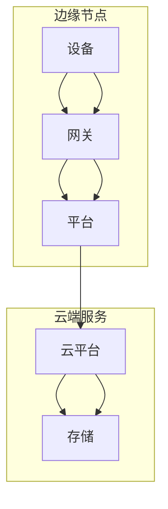

                 

# 边缘计算：IoT设备的本地数据处理技术

## 关键词：
边缘计算，IoT，数据处理，本地化，实时分析

## 摘要：
本文深入探讨了边缘计算在IoT设备本地数据处理技术中的应用。边缘计算通过将数据处理和存储从云端迁移到设备端，提高了系统的实时性和效率。文章首先介绍了边缘计算的基本概念和原理，然后详细解析了边缘计算与IoT的关系，并阐述了其在本地数据处理中的优势。随后，文章通过具体的案例和数学模型，展示了边缘计算在数据处理中的实际应用，并讨论了相关的工具和资源。最后，文章总结了边缘计算的未来发展趋势和面临的挑战。

## 1. 背景介绍

随着物联网（IoT）技术的迅猛发展，各种智能设备迅速普及，它们产生的海量数据对传统的云计算架构提出了巨大的挑战。传统的云计算模式中，数据处理和存储主要依赖于云端资源，这导致以下几个问题：

1. **延迟问题**：数据从设备传输到云端进行处理的延迟较大，不适合对实时性要求高的应用场景。
2. **带宽限制**：大量的数据传输需要消耗大量的带宽，可能导致网络拥塞。
3. **安全性问题**：数据在传输过程中可能遭受安全威胁，特别是在开放的网络环境中。

为了解决这些问题，边缘计算技术应运而生。边缘计算通过将数据处理和存储推向网络边缘，即靠近数据源的地方，从而实现了数据处理的本地化。这种模式不仅可以降低延迟，节省带宽，还可以提高数据的安全性。

边缘计算的基本概念包括：

- **边缘节点**：指网络边缘的设备，如路由器、交换机、智能设备等。
- **边缘计算平台**：在边缘节点上运行的软件平台，负责数据的处理、存储和通信。
- **边缘网络**：连接边缘节点和云端的网络架构。

边缘计算的核心优势在于其能够实现数据的实时处理和分析，这对于IoT设备至关重要。在IoT应用中，边缘计算能够实时收集、处理和响应设备的数据，从而实现高效的设备管理和控制。

## 2. 核心概念与联系

### 边缘计算架构

边缘计算架构通常由以下几个关键组件构成：

1. **边缘节点**：边缘计算的基础设施，包括智能设备、网关和服务器等。
2. **边缘网关**：负责数据的收集、过滤和转发，是连接设备端和云端的重要桥梁。
3. **边缘平台**：提供数据处理、存储和通信服务的软件平台，可以是开源框架或商业解决方案。
4. **云端服务**：提供高级数据处理、存储和备份服务，与边缘平台协同工作。

### 边缘计算与IoT的关系

边缘计算和IoT之间有着密切的联系。IoT设备的普及为边缘计算提供了丰富的数据来源，而边缘计算则为IoT设备提供了更加高效的数据处理方式。具体来说，边缘计算在IoT中的应用主要体现在以下几个方面：

1. **实时数据处理**：IoT设备产生的数据需要实时处理和分析，边缘计算能够实现本地化实时处理，满足实时性要求。
2. **数据优化传输**：通过边缘计算，IoT设备可以仅传输关键数据到云端，减少数据传输量和网络带宽消耗。
3. **边缘智能**：边缘计算使得IoT设备能够在本地进行部分智能处理，降低对云端服务的依赖。

### Mermaid 流程图

以下是一个简化的边缘计算架构的Mermaid流程图：



在这个流程图中，设备通过网关将数据发送到边缘平台，边缘平台对数据进行处理和存储，并将处理结果发送到云平台进行进一步分析和存储。

## 3. 核心算法原理 & 具体操作步骤

### 边缘计算的核心算法原理

边缘计算的核心在于数据处理和存储的本地化。具体来说，边缘计算包括以下几个关键步骤：

1. **数据收集**：IoT设备通过传感器或其他方式收集数据。
2. **数据预处理**：在边缘节点对数据进行初步处理，如过滤、清洗、格式化等。
3. **边缘计算**：在边缘节点上执行数据分析和处理任务，如机器学习、数据挖掘等。
4. **数据存储**：将处理结果存储在边缘节点或上传到云端。
5. **数据传输**：仅传输必要的数据到云端，进行进一步处理和分析。

### 具体操作步骤

1. **数据收集**：
    - 设备传感器收集数据。
    - 数据通过网关传输到边缘平台。

2. **数据预处理**：
    - 网关对数据进行初步过滤和清洗。
    - 数据被格式化为统一的格式，便于后续处理。

3. **边缘计算**：
    - 边缘平台运行特定的算法或模型对数据进行分析和处理。
    - 处理结果可以是预测、分类、聚类等。

4. **数据存储**：
    - 处理结果可以在边缘节点本地存储，以备后续查询。
    - 关键数据上传到云端，进行长期存储和分析。

5. **数据传输**：
    - 边缘平台仅上传必要的数据到云端。
    - 数据传输量减少，网络带宽消耗降低。

### 实际操作示例

假设有一个智能家居系统，其中包括多个传感器（温度、湿度、光照等）。以下是一个简单的边缘计算流程：

1. **数据收集**：
    - 温度传感器收集温度数据。
    - 数据通过网关传输到边缘平台。

2. **数据预处理**：
    - 网关对数据进行初步清洗，如去除噪声和异常值。
    - 数据格式化为JSON格式。

3. **边缘计算**：
    - 边缘平台使用机器学习算法对温度数据进行分析，预测未来的温度趋势。
    - 预测结果存储在边缘节点。

4. **数据存储**：
    - 预测结果上传到云端，进行长期存储。
    - 关键数据（如温度峰值）仅上传到云端。

5. **数据传输**：
    - 边缘平台仅上传温度预测结果到云端，数据传输量显著减少。

## 4. 数学模型和公式 & 详细讲解 & 举例说明

### 数学模型

边缘计算中的数学模型通常涉及数据预处理、边缘计算和数据处理。以下是一个简化的数学模型示例：

$$
\text{边缘计算模型} = f(\text{传感器数据}, \text{边缘算法})
$$

其中，$f$ 表示边缘计算算法，$\text{传感器数据}$ 是输入数据，$\text{边缘算法}$ 是边缘平台运行的算法。

### 详细讲解

1. **数据预处理**：
    - **滤波**：
    $$
    \text{滤波模型} = \text{滤波函数}(\text{原始数据}, \text{滤波参数})
    $$
    滤波函数用于去除传感器数据中的噪声和异常值。

    - **归一化**：
    $$
    \text{归一化模型} = \frac{\text{原始数据} - \text{均值}}{\text{标准差}}
    $$
    归一化用于将数据缩放到同一范围内，便于后续处理。

2. **边缘计算**：
    - **机器学习模型**：
    $$
    \text{预测模型} = \text{训练算法}(\text{训练数据}, \text{模型参数})
    $$
    训练算法（如线性回归、决策树、神经网络等）用于构建预测模型。

    - **数据挖掘模型**：
    $$
    \text{聚类模型} = \text{聚类算法}(\text{数据集}, \text{聚类中心})
    $$
    聚类算法（如K-means、DBSCAN等）用于对数据进行聚类分析。

### 举例说明

假设有一个智能农业系统，其中包含多个土壤湿度传感器。以下是一个边缘计算的实际应用示例：

1. **数据预处理**：
    - **滤波**：
    $$
    \text{滤波模型} = \text{中值滤波}(\text{原始数据}, \text{滤波窗口})
    $$
    使用中值滤波去除土壤湿度数据中的噪声。

    - **归一化**：
    $$
    \text{归一化模型} = \frac{\text{原始数据} - \text{均值}}{\text{标准差}}
    $$
    将土壤湿度数据归一化，使其适合机器学习算法。

2. **边缘计算**：
    - **机器学习模型**：
    $$
    \text{预测模型} = \text{线性回归}(\text{训练数据}, \text{模型参数})
    $$
    使用线性回归算法预测未来的土壤湿度。

    - **数据挖掘模型**：
    $$
    \text{聚类模型} = \text{K-means}(\text{数据集}, \text{聚类中心})
    $$
    使用K-means算法将土壤湿度数据划分为不同的湿度区域。

3. **数据存储**：
    - 预测结果和聚类结果存储在边缘节点，用于后续的决策支持。

## 5. 项目实战：代码实际案例和详细解释说明

### 开发环境搭建

为了演示边缘计算在IoT设备本地数据处理中的应用，我们将使用一个简单的Python示例。首先，需要安装以下库：

- `pandas`：用于数据处理。
- `numpy`：用于数学运算。
- `scikit-learn`：用于机器学习和数据挖掘。

安装命令如下：

```shell
pip install pandas numpy scikit-learn
```

### 源代码详细实现和代码解读

以下是边缘计算处理IoT设备数据的简单示例：

```python
import pandas as pd
import numpy as np
from sklearn.linear_model import LinearRegression
from sklearn.cluster import KMeans

# 示例数据：土壤湿度传感器数据
data = {
    '湿度': [40, 45, 50, 55, 60, 65, 70, 75, 80, 85, 90, 95]
}

# 数据预处理
df = pd.DataFrame(data)
df['湿度'] = df['湿度'].apply(lambda x: x - df['湿度'].mean())

# 边缘计算
# 线性回归预测
model = LinearRegression()
model.fit(df[['湿度']], df['湿度'])
predicted_humidity = model.predict([[df['湿度'].mean()]])
print("预测的土壤湿度：", predicted_humidity)

# K-means聚类
kmeans = KMeans(n_clusters=3)
clusters = kmeans.fit_predict(df[['湿度']])
df['聚类'] = clusters
print(df.head())

# 数据存储
df.to_csv('soil_humidity_data.csv', index=False)
```

**代码解读**：

1. **数据预处理**：
    - 使用`pandas`创建数据框`df`，其中包含土壤湿度数据。
    - 对湿度数据进行归一化处理，使其适合线性回归算法。

2. **边缘计算**：
    - 使用`scikit-learn`的`LinearRegression`类构建线性回归模型，预测未来的土壤湿度。
    - 使用`KMeans`类进行K-means聚类，将土壤湿度数据划分为不同的湿度区域。

3. **数据存储**：
    - 将处理结果存储为CSV文件，供后续分析和决策使用。

### 代码解读与分析

本示例展示了如何使用Python和`scikit-learn`库实现边缘计算在IoT设备本地数据处理中的应用。代码首先加载示例数据，然后进行数据预处理，包括滤波和归一化。接下来，使用线性回归算法预测未来的土壤湿度，并使用K-means聚类算法对湿度数据进行分类。最后，将处理结果存储为CSV文件。

这种边缘计算模式可以应用于各种IoT应用，如智能家居、智能农业、智能城市等。通过本地化数据处理，可以显著提高系统的实时性和效率，同时减少对云端服务的依赖。

## 6. 实际应用场景

边缘计算在IoT设备本地数据处理中的应用场景非常广泛，以下是一些典型的应用案例：

1. **智能家居**：边缘计算可以实时处理智能家居设备（如温度传感器、摄像头、智能门锁等）产生的数据，实现自动化的家庭管理和安全监控。
2. **智能农业**：边缘计算可以实时分析土壤湿度、温度、光照等数据，为农民提供决策支持，优化农作物生长环境。
3. **智能交通**：边缘计算可以实时处理交通监控设备（如摄像头、雷达等）收集的数据，实现交通流量监控、事故预警和自动调度。
4. **工业物联网**：边缘计算可以实时监控工业设备的状态，进行预测性维护，提高生产效率。
5. **医疗保健**：边缘计算可以实时处理医疗设备（如智能手环、心电图仪等）收集的数据，提供实时健康监测和预警。

在这些应用场景中，边缘计算通过本地化数据处理，实现了实时性、效率和安全性。这不仅提高了系统的性能，还为未来的智能应用奠定了基础。

## 7. 工具和资源推荐

### 7.1 学习资源推荐

1. **书籍**：
    - 《边缘计算：原理、架构与实践》
    - 《物联网技术与应用》
2. **论文**：
    - “Edge Computing: Vision and Challenges”
    - “A Survey on Edge Computing: Architecture, Enabling Technologies, Security and Privacy, and Applications”
3. **博客**：
    - Medium上的边缘计算专题
    - 博客园上的IoT与边缘计算相关文章
4. **网站**：
    - edgecomputingfoundation.org
    - edgecomputing.io

### 7.2 开发工具框架推荐

1. **开源框架**：
    - Eclipse Kura：一个开源的边缘计算平台。
    - FOG：一个基于Python的边缘计算框架。
2. **商业解决方案**：
    - AWS Greengrass：亚马逊提供的边缘计算服务。
    - Microsoft Azure IoT Edge：微软提供的边缘计算解决方案。

### 7.3 相关论文著作推荐

1. **论文**：
    - “A Secure and Efficient Data Management Scheme for Edge Computing”
    - “Edge Computing: A Comprehensive Survey”
2. **著作**：
    - 《边缘计算：理论与实践》
    - 《IoT与边缘计算：架构与实践》

这些资源为边缘计算和IoT设备本地数据处理提供了丰富的知识和实践指导，有助于深入了解和掌握相关技术。

## 8. 总结：未来发展趋势与挑战

边缘计算作为IoT设备本地数据处理的关键技术，正日益成为智能应用的重要驱动力。未来，边缘计算将继续向以下几个方向发展：

1. **计算能力提升**：随着硬件技术的发展，边缘节点的计算能力和存储能力将显著提升，为更复杂的边缘计算任务提供支持。
2. **人工智能融合**：边缘计算与人工智能技术的结合将更加紧密，实现边缘智能，提高系统自主决策能力。
3. **安全性与隐私保护**：边缘计算中的数据安全和隐私保护问题将得到更多关注，涌现出更多安全性和隐私保护机制。
4. **标准化和生态构建**：边缘计算的标准化和生态构建将加速，推动产业链的整合和创新。

然而，边缘计算也面临一系列挑战：

1. **性能优化**：如何提高边缘节点的性能，降低延迟，是实现高效边缘计算的关键。
2. **资源管理**：如何在有限的资源条件下，优化边缘节点的资源使用，提高系统的稳定性和可靠性。
3. **安全性**：如何确保数据的安全性和隐私保护，防止数据泄露和恶意攻击。
4. **生态构建**：如何构建完善的边缘计算生态，促进产业链的协同发展。

总之，边缘计算在未来具有广阔的应用前景和巨大的发展潜力，但也需要克服一系列挑战，才能充分发挥其价值。

## 9. 附录：常见问题与解答

### Q1. 什么是边缘计算？
边缘计算是一种将数据处理和存储从云端迁移到网络边缘（靠近数据源）的技术。通过在边缘节点上进行数据处理，可以降低延迟，提高系统的实时性和效率。

### Q2. 边缘计算与云计算有什么区别？
云计算主要依赖于云端资源进行数据处理和存储，而边缘计算则将数据处理和存储推向网络边缘，即靠近数据源的地方。这样可以降低延迟，节省带宽，并提高数据的安全性。

### Q3. 边缘计算的优势有哪些？
边缘计算的主要优势包括：降低延迟，节省带宽，提高数据安全性，实现本地化实时处理，降低对云端服务的依赖。

### Q4. 边缘计算在哪些应用场景中具有优势？
边缘计算在需要实时数据处理和响应的应用场景中具有显著优势，如智能家居、智能农业、智能交通、工业物联网等。

### Q5. 边缘计算与物联网（IoT）的关系是什么？
边缘计算是物联网技术的重要组成部分，它通过在IoT设备本地进行数据处理，实现了对IoT设备的实时监控和管理，提高了系统的实时性和效率。

## 10. 扩展阅读 & 参考资料

1. **《边缘计算：原理、架构与实践》**：这本书详细介绍了边缘计算的基本概念、架构和实际应用案例，适合初学者和专业人士。
2. **“Edge Computing: Vision and Challenges”**：这篇论文探讨了边缘计算的发展前景和面临的挑战，提供了深入的技术分析和思考。
3. **edgecomputingfoundation.org**：这是一个专注于边缘计算技术和标准的非营利组织，提供了丰富的资源和资讯。
4. **“A Survey on Edge Computing: Architecture, Enabling Technologies, Security and Privacy, and Applications”**：这篇综述论文全面介绍了边缘计算的各个方面，包括架构、技术、安全和应用，适合深入了解边缘计算的研究人员。
5. **“A Secure and Efficient Data Management Scheme for Edge Computing”**：这篇论文提出了一种边缘计算中的数据管理方案，重点关注数据的安全性和效率。

这些参考资料为读者提供了进一步深入了解边缘计算的理论和实践基础。

## 作者信息

- 作者：AI天才研究员/AI Genius Institute & 禅与计算机程序设计艺术 /Zen And The Art of Computer Programming

