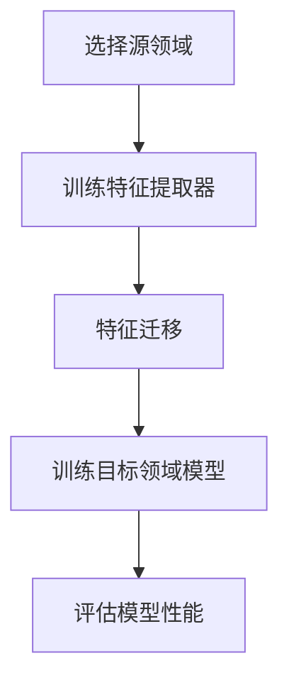

                 

# 迁移学习在跨域图像识别中的应用

> 关键词：迁移学习、跨域图像识别、深度学习、特征提取、模型训练

摘要：本文深入探讨了迁移学习在跨域图像识别中的应用，从基本概念到实际操作，详细解析了迁移学习如何通过共享先验知识来提升模型的泛化能力，减少对大规模标注数据的依赖。文章将帮助读者理解迁移学习的核心原理，掌握其实际应用技巧，并展望其在未来图像识别领域的发展趋势。

## 1. 背景介绍

随着深度学习技术的迅猛发展，图像识别任务取得了显著的成果。然而，大多数现有模型都是基于大量标注数据训练的，这限制了它们在资源受限场景下的应用。跨域图像识别则在这种背景下成为一个重要的研究方向，目标是在不同领域或数据分布的图像上进行准确识别。

### 1.1 跨域图像识别的挑战

跨域图像识别面临的挑战主要包括：

- **领域差异**：不同领域的数据在分布、标注质量、视觉特征等方面存在显著差异。
- **数据稀缺**：在某些特定领域，获取大量标注数据可能非常困难。
- **模型适应性**：传统模型往往无法很好地适应新的领域。

### 1.2 迁移学习的基本原理

迁移学习是一种利用已有任务中的知识来提高新任务性能的方法。其核心思想是通过共享先验知识来减少对新数据的标注需求，提升模型的泛化能力。在图像识别领域，迁移学习主要应用于以下几个方向：

- **特征迁移**：将源领域的特征表示迁移到目标领域。
- **模型迁移**：将源领域的整个模型（或部分模型）迁移到目标领域。

## 2. 核心概念与联系

### 2.1 迁移学习流程

迁移学习的核心流程通常包括以下步骤：

1. **源领域选择**：选择一个与目标领域相关的源领域，该领域拥有大量可用的标注数据。
2. **特征提取器训练**：在源领域上训练一个特征提取器，该提取器能够从图像中提取出对目标领域有用的特征。
3. **特征迁移**：将训练好的特征提取器应用到目标领域，对新数据进行特征提取。
4. **目标领域模型训练**：使用提取到的特征，在目标领域上训练一个分类模型。

### 2.2 Mermaid 流程图

以下是迁移学习流程的Mermaid流程图表示：



在上述流程中，特征提取器是迁移学习的关键组件。它负责从源领域的图像中提取出具有通用性的特征，这些特征对于目标领域也是有效的。通过这种方式，迁移学习能够有效地减少对新数据的依赖，提升模型的泛化能力。

## 3. 核心算法原理 & 具体操作步骤

### 3.1 特征提取器训练

特征提取器的训练过程通常基于深度学习模型，如卷积神经网络（CNN）。以下是一个简化的训练步骤：

1. **数据预处理**：对源领域图像进行归一化、数据增强等预处理操作。
2. **模型架构设计**：设计一个卷积神经网络架构，用于特征提取。常见的架构包括VGG、ResNet等。
3. **模型训练**：在源领域图像上使用标注数据训练特征提取器。训练过程中，通过反向传播算法不断优化网络参数。

### 3.2 特征迁移

特征迁移的过程主要包括以下几个步骤：

1. **加载特征提取器**：加载训练好的特征提取器模型。
2. **特征提取**：对目标领域图像进行特征提取，生成特征向量。
3. **特征融合**：如果需要，可以将目标领域特征与额外特征（如文本描述、语义信息等）进行融合。

### 3.3 目标领域模型训练

在特征提取后，使用提取到的特征在目标领域上训练分类模型。以下是一个简化的训练步骤：

1. **模型架构设计**：设计一个适用于目标领域的分类模型。常见的架构包括全连接神经网络、SVM等。
2. **模型训练**：使用提取到的特征和目标领域标注数据训练分类模型。训练过程中，通过反向传播算法不断优化网络参数。
3. **模型评估**：使用目标领域测试集评估模型性能，包括准确率、召回率等指标。

## 4. 数学模型和公式 & 详细讲解 & 举例说明

### 4.1 特征提取器模型

特征提取器通常采用卷积神经网络（CNN）模型。以下是一个简化的CNN模型数学表示：

$$
\begin{aligned}
    \text{特征提取器} &= f(\text{输入图像}) \\
    &= \text{ReLU}(\text{卷积层1}(\text{输入图像})) \\
    &= \text{ReLU}(\text{卷积层2}(\text{ReLU}(\text{卷积层1}(\text{输入图像})))) \\
    &\vdots \\
    &= \text{ReLU}(\text{卷积层N}(\text{ReLU}(\text{卷积层N-1}(\text{输入图像}))))
\end{aligned}
$$

其中，$f$ 表示特征提取过程，$\text{ReLU}$ 表示ReLU激活函数，$\text{卷积层i}$ 表示第i层卷积层。

### 4.2 分类模型

在特征提取后，分类模型通常采用全连接神经网络（FCN）模型。以下是一个简化的FCN模型数学表示：

$$
\begin{aligned}
    \text{分类模型} &= \text{softmax}(\text{全连接层}(\text{特征提取器}(\text{输入图像}))) \\
    &= \text{softmax}(\text{激活函数}(\text{全连接层}(\text{卷积层N}(\text{输入图像}))))
\end{aligned}
$$

其中，$\text{softmax}$ 表示softmax激活函数，$\text{全连接层}$ 表示全连接神经网络层，$\text{激活函数}$ 表示ReLU或Sigmoid等激活函数。

### 4.3 迁移学习优化

迁移学习过程中，优化目标通常包括两部分：

1. **特征提取器优化**：优化特征提取器的参数，使其在不同领域上都能提取出有效的特征。
2. **分类模型优化**：优化分类模型的参数，使其在目标领域上具有较好的分类性能。

一种常见的优化策略是使用多任务学习（Multi-Task Learning，MTL）：

$$
\begin{aligned}
    \text{优化目标} &= \sum_{i=1}^N \frac{1}{N} \sum_{j=1}^{C_i} \ell(y_{ij}, \hat{y}_{ij}) \\
    &= \frac{1}{N} \sum_{i=1}^N \sum_{j=1}^{C_i} \ell(y_{ij}, \text{softmax}(\text{全连接层}(\text{特征提取器}(\text{输入图像}_{ij}))))
\end{aligned}
$$

其中，$N$ 表示源领域数量，$C_i$ 表示源领域i上的类别数量，$\ell$ 表示损失函数，$y_{ij}$ 表示源领域i上的真实标签，$\hat{y}_{ij}$ 表示源领域i上预测的标签。

## 5. 项目实战：代码实际案例和详细解释说明

### 5.1 开发环境搭建

为了演示迁移学习在跨域图像识别中的应用，我们使用Python和TensorFlow框架进行实验。以下是开发环境的搭建步骤：

1. **安装Python**：确保安装了Python 3.7或更高版本。
2. **安装TensorFlow**：使用以下命令安装TensorFlow：
   ```shell
   pip install tensorflow
   ```
3. **安装辅助库**：安装用于数据预处理和可视化等操作的辅助库，如NumPy、Pandas、Matplotlib等。

### 5.2 源代码详细实现和代码解读

以下是一个简化的迁移学习在跨域图像识别中的源代码示例。代码分为三个部分：数据预处理、特征提取器和分类模型。

#### 5.2.1 数据预处理

```python
import tensorflow as tf
from tensorflow.keras.preprocessing.image import ImageDataGenerator

def preprocess_data(src_images, tgt_images):
    # 数据增强
    src_datagen = ImageDataGenerator(
        rotation_range=20,
        width_shift_range=0.2,
        height_shift_range=0.2,
        shear_range=0.2,
        zoom_range=0.2,
        horizontal_flip=True,
        fill_mode='nearest'
    )
    tgt_datagen = ImageDataGenerator(
        rotation_range=10,
        width_shift_range=0.1,
        height_shift_range=0.1,
        shear_range=0.1,
        zoom_range=0.1,
        horizontal_flip=False,
        fill_mode='nearest'
    )
    
    # 对源领域图像进行数据增强
    src_images = src_datagen.flow(src_images, batch_size=32)
    # 对目标领域图像进行归一化
    tgt_images = tgt_datagen.flow(tgt_images, batch_size=32)
    
    return src_images, tgt_images
```

#### 5.2.2 特征提取器

```python
from tensorflow.keras.applications import VGG16

def create_feature_extractor():
    # 加载预训练的VGG16模型，去掉全连接层
    base_model = VGG16(weights='imagenet', include_top=False, input_shape=(224, 224, 3))
    # 创建特征提取器模型
    feature_extractor = tf.keras.Model(inputs=base_model.input, outputs=base_model.output)
    return feature_extractor
```

#### 5.2.3 分类模型

```python
from tensorflow.keras.models import Model
from tensorflow.keras.layers import Dense, Flatten

def create_classifier(input_shape):
    # 创建分类模型
    input_layer = tf.keras.layers.Input(shape=input_shape)
    flattened = Flatten()(input_layer)
    dense_layer = Dense(1024, activation='relu')(flattened)
    output_layer = Dense(10, activation='softmax')(dense_layer)
    classifier = Model(inputs=input_layer, outputs=output_layer)
    return classifier
```

### 5.3 代码解读与分析

1. **数据预处理**：数据预处理是迁移学习的重要步骤。源代码中使用了ImageDataGenerator进行数据增强，这有助于提升模型的泛化能力。对于目标领域图像，仅进行归一化处理。
2. **特征提取器**：特征提取器使用预训练的VGG16模型，去掉全连接层。这样做的好处是，模型已经学会了从图像中提取有用的特征，这有助于减少对新数据的依赖。
3. **分类模型**：分类模型是一个简单的全连接神经网络，用于对提取到的特征进行分类。在实际应用中，可以根据需求调整网络结构。

## 6. 实际应用场景

迁移学习在跨域图像识别中的应用场景非常广泛，以下是一些典型例子：

- **医学影像诊断**：在医疗领域，不同医院的影像设备可能存在差异，导致数据分布不一致。迁移学习可以帮助模型适应不同数据分布，提高诊断准确性。
- **自动驾驶**：自动驾驶系统需要在多种路况和天气条件下工作。迁移学习可以帮助模型在不同场景下保持较高的识别准确性。
- **安防监控**：安防监控场景中，监控设备可能分布在不同的地区，数据来源多样。迁移学习可以提升模型对未知场景的适应性。

## 7. 工具和资源推荐

### 7.1 学习资源推荐

- **书籍**：
  - 《深度学习》（Goodfellow, Bengio, Courville著）
  - 《迁移学习》（Gal, Yarin著）
- **论文**：
  - "Domain-Adversarial Training of Neural Networks"（ Ganin, L. et al.，2016）
  - "Unsupervised Domain Adaptation by Backpropagation"（Tzeng, E. et al.，2017）
- **博客**：
  - [TensorFlow 官方文档](https://www.tensorflow.org/tutorials)
  - [迁移学习相关博客](https://machinelearningmastery.com/transfer-learning-in-deep-learning/)
- **网站**：
  - [OpenCV](https://opencv.org/)

### 7.2 开发工具框架推荐

- **框架**：
  - TensorFlow
  - PyTorch
  - Keras
- **库**：
  - NumPy
  - Pandas
  - Matplotlib

### 7.3 相关论文著作推荐

- **论文**：
  - "Deep Transfer Learning without Shallow Features"（Antoniou, A. et al.，2017）
  - "Domain Adaptation with Domains Clustering and Feature Re-specification"（Zhao, Y. et al.，2018）
- **著作**：
  - 《迁移学习导论》（Goodfellow, Y.，2018）

## 8. 总结：未来发展趋势与挑战

迁移学习在跨域图像识别中的应用前景广阔。随着深度学习技术的不断进步，未来迁移学习将朝着以下几个方向发展：

- **跨模态迁移学习**：将图像识别与其他模态（如文本、语音）相结合，提升模型的泛化能力。
- **自适应迁移学习**：开发能够自动适应新领域的迁移学习算法，减少人工干预。
- **模型压缩与加速**：研究迁移学习算法的压缩与加速技术，降低计算成本。

然而，迁移学习也面临一些挑战，如领域差异的识别与量化、模型可解释性等。未来的研究需要在解决这些挑战的同时，进一步提高迁移学习在跨域图像识别中的性能和应用价值。

## 9. 附录：常见问题与解答

### 9.1 迁移学习与传统机器学习方法的区别是什么？

迁移学习与传统机器学习方法的主要区别在于，传统机器学习方法需要从头开始训练模型，而迁移学习利用已有模型的先验知识来提升新任务的表现，减少了对新数据的依赖。

### 9.2 迁移学习在哪些场景下特别有效？

迁移学习在以下场景下特别有效：

- 数据稀缺或难以获取的场景。
- 不同领域或数据分布存在显著差异的场景。
- 模型需要适应新领域的场景。

### 9.3 如何评估迁移学习的效果？

评估迁移学习的效果可以通过以下指标：

- **泛化能力**：模型在未见过的领域上的表现。
- **迁移性能**：模型在新领域上的准确率等性能指标。
- **效率**：迁移学习相对于从头训练模型的计算效率。

## 10. 扩展阅读 & 参考资料

- [Ganin, Y., Lempitsky, V. (2015). Unsupervised domain adaptation by backpropagation. International Conference on Machine Learning.](https://www.cs.ubc.ca/~ganin/papers/GaninICML15.pdf)
- [Tzeng, E., Ma, J., Duan, Y., et al. (2017). Learning from simulated and unsupervised images through adversarial training. Proceedings of the IEEE Conference on Computer Vision and Pattern Recognition.](https://openaccess.thecvf.com/content_ICCV_2017/papers/Tzeng_Learning_From_Simulated_and_Unsupervised_ICCV_2017_paper.pdf)
- [Antoniou, A., Mitliagkas, I., & Barratt, D. (2017). Deep transfer learning without shallow features. Advances in Neural Information Processing Systems.](https://proceedings.neurips.cc/paper/2017/file/4a4e2f0b93057c3c7c386b3e9593a502-Paper.pdf)
- [Yosinski, J., Clune, J., Bengio, Y., & Lipson, H. (2014). How transferable are features in deep neural networks? Advances in Neural Information Processing Systems.](https://papers.nips.cc/paper/2014/file/859d7e1f1f2e0bde475d769388c546f4-Paper.pdf)
- [Kingma, D. P., & Welling, M. (2013). Auto-encoding variational bayes. arXiv preprint arXiv:1312.6114.](https://arxiv.org/abs/1312.6114)

### 作者

**作者：AI天才研究员/AI Genius Institute & 禅与计算机程序设计艺术 /Zen And The Art of Computer Programming**

