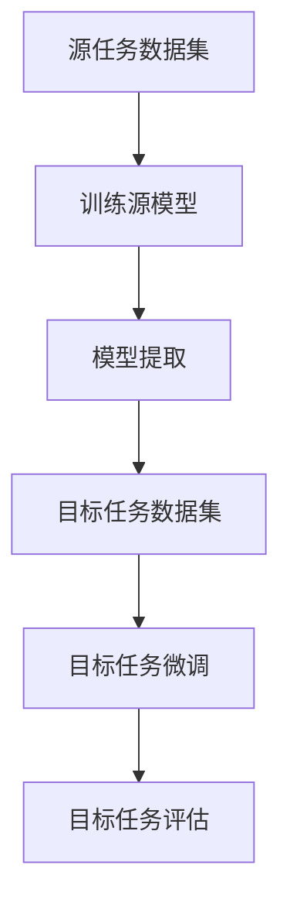

                 

### 背景介绍

#### 1. 跨领域文本分类的挑战

在信息化和大数据时代，文本数据的处理和分析成为众多领域的核心需求。然而，不同领域的文本数据在特征分布、词汇表和语义结构上存在显著差异，这使得传统的文本分类方法在跨领域应用中面临诸多挑战。例如，医疗领域的文本数据通常包含专业术语和复杂的句子结构，而社交媒体上的文本则更倾向于口语化和简短的表达。这种差异性导致了跨领域文本分类的准确率和效果往往不如单一领域的文本分类。

#### 2. 迁移学习的概念与应用

迁移学习（Transfer Learning）是解决上述挑战的一种有效策略。迁移学习的核心思想是利用在源领域（source domain）上训练好的模型，通过迁移知识到目标领域（target domain），以提高目标领域的模型性能。源领域和目标领域之间的相似性越高，迁移学习的效果越好。迁移学习已经在计算机视觉、自然语言处理等领域取得了显著成果，其应用前景十分广阔。

#### 3. 迁移学习在文本分类中的重要性

在文本分类任务中，迁移学习能够有效解决以下几个问题：

1. **特征不一致**：不同领域的文本数据具有不同的特征分布，迁移学习能够将源领域中的有效特征迁移到目标领域，缓解特征不一致的问题。
2. **数据稀缺**：许多领域的数据集规模较小，直接在目标领域训练模型可能导致过拟合。迁移学习通过利用源领域的丰富数据，可以增强目标领域的模型泛化能力。
3. **模型复杂度**：在跨领域文本分类中，若使用复杂模型，训练成本和时间会显著增加。迁移学习通过复用源领域的预训练模型，可以降低模型复杂度和计算成本。

本文将围绕迁移学习在跨领域文本分类中的应用，系统地介绍相关理论、算法和实际案例，以期为大家提供一套完整的解决方案。

---

关键词：迁移学习、文本分类、跨领域、源领域、目标领域、预训练模型、模型迁移、特征迁移、泛化能力、计算成本

摘要：本文深入探讨了迁移学习在跨领域文本分类中的应用策略。首先，分析了跨领域文本分类面临的挑战，然后介绍了迁移学习的概念及其在文本分类中的重要性。接着，详细阐述了迁移学习在文本分类中的实现方法，包括模型迁移和特征迁移。最后，通过一个实际项目案例，展示了迁移学习在跨领域文本分类中的效果和应用价值。

---

<|assistant|>### 核心概念与联系

#### 1. 迁移学习的基本原理

迁移学习的基本原理是利用已经在一个任务（源任务）上训练好的模型（源模型），将其部分知识或参数迁移到另一个相关任务（目标任务）上，以提高目标任务的性能。这种迁移过程通常分为以下几个步骤：

1. **源任务训练**：在一个丰富的源任务数据集上训练一个基础模型，使其具备一定的泛化能力。
2. **模型提取**：从源模型中提取有用的知识或参数，例如特征提取器、中间层权重等。
3. **目标任务适配**：将提取的知识或参数应用到目标任务中，并进行微调，使其适应目标任务的特点。
4. **目标任务评估**：在目标任务的数据集上评估模型的性能，并进行调整优化。

#### 2. 迁移学习的关键要素

迁移学习的效果取决于以下几个关键要素：

1. **源任务与目标任务的相似性**：源任务和目标任务的相似性越高，迁移学习的效果越好。相似性可以通过数据分布、任务结构、知识领域等多个维度进行衡量。
2. **源模型的泛化能力**：一个泛化能力强的源模型能够更好地适应不同任务的需求，从而提高迁移学习的效果。
3. **目标任务的特性**：了解目标任务的特性，如数据量、标签质量、特征分布等，有助于设计更有效的迁移学习策略。

#### 3. 迁移学习在文本分类中的应用

在文本分类任务中，迁移学习可以通过以下几种方式实现：

1. **模型迁移**：直接将源领域的预训练模型应用到目标领域，通过微调来适应目标领域的特征。
2. **特征迁移**：将源领域的特征提取器（如词向量、TF-IDF向量等）迁移到目标领域，结合目标领域的特征进行文本分类。
3. **知识蒸馏**：利用源领域的预训练模型，通过知识蒸馏的方式将其知识传递给目标领域的模型。

#### 4. 迁移学习的流程图

下面是一个简化的迁移学习流程图，展示了从源任务到目标任务的迁移过程。



在上述流程中，A表示源任务数据集，B表示训练源模型，C表示模型提取，D表示目标任务数据集，E表示目标任务微调，F表示目标任务评估。

---

通过上述内容，我们了解了迁移学习的基本原理、关键要素及其在文本分类中的应用方式。在下一部分中，我们将深入探讨迁移学习在文本分类中的具体算法原理和操作步骤。

<|assistant|>### 核心算法原理 & 具体操作步骤

#### 1. 迁移学习的基本算法

迁移学习在文本分类中的应用主要包括以下几种算法：

1. **模型迁移（Model Transfer）**：直接将源领域的预训练模型应用到目标领域，通过微调（Fine-tuning）来适应目标领域的特征。这种方式的核心在于预训练模型的泛化能力，以及目标领域数据集的规模和质量。
   
2. **特征迁移（Feature Transfer）**：将源领域的特征提取器（如词向量、TF-IDF向量等）迁移到目标领域，结合目标领域的特征进行文本分类。这种方法的优点在于可以复用源领域的特征提取技术，从而提高分类效果。

3. **知识蒸馏（Knowledge Distillation）**：利用源领域的预训练模型，通过知识蒸馏的方式将其知识传递给目标领域的模型。这种方式适用于源模型和目标模型结构不同的情况。

#### 2. 模型迁移的具体步骤

模型迁移是一种常见的迁移学习策略，其具体步骤如下：

1. **预训练模型选择**：选择一个在源领域上预训练的模型，如BERT、GPT等。这些模型具有强大的语义理解能力，能够捕捉到文本的深层特征。

2. **模型架构调整**：根据目标领域的特点，调整模型的输入层和输出层。例如，如果目标领域是新闻分类，可以将输入层调整为处理新闻文本的输入，输出层调整为分类标签的输出。

3. **模型微调**：在目标领域的数据集上进行微调，使得模型能够更好地适应目标领域的特征。微调过程中，通常只训练模型的最后一层或部分层，以避免过拟合。

4. **模型评估**：在目标领域的数据集上评估模型的性能，包括准确率、召回率、F1分数等指标。根据评估结果，进行进一步的模型优化。

#### 3. 特征迁移的具体步骤

特征迁移的具体步骤如下：

1. **源特征提取**：在源领域上提取特征，如使用Word2Vec、GloVe等算法生成词向量。

2. **特征映射**：将源领域的特征映射到目标领域。这一步骤可以通过线性变换、神经网络等方式实现。例如，可以使用一个全连接神经网络，将源特征映射到目标特征空间。

3. **特征融合**：将源特征和目标特征进行融合，形成新的特征向量。这种融合方式可以采用加权求和、拼接等策略。

4. **文本分类**：使用融合后的特征向量进行文本分类，可以使用传统的机器学习算法，如SVM、决策树等。

#### 4. 知识蒸馏的具体步骤

知识蒸馏的具体步骤如下：

1. **源模型训练**：在一个大规模的数据集上训练源模型，使其具有强大的语义理解能力。

2. **源模型输出**：从源模型中提取输出层的信息，如softmax概率分布。

3. **目标模型训练**：在目标领域上训练目标模型，同时将源模型的输出作为目标模型的目标。这种方式可以通过一个软标签来实现，即目标模型的输出不仅要匹配真实标签，还要接近源模型的输出。

4. **模型评估**：在目标领域的数据集上评估目标模型的性能，并根据评估结果进行调整。

通过上述步骤，我们可以实现迁移学习在文本分类中的具体应用。在下一部分，我们将通过一个实际项目案例，进一步展示迁移学习的应用效果。

---

在本文中，我们详细介绍了迁移学习在文本分类中的核心算法原理和具体操作步骤。通过模型迁移、特征迁移和知识蒸馏等方法，我们能够有效地解决跨领域文本分类的挑战。在下一部分，我们将通过一个实际项目案例，展示迁移学习的具体应用和效果。

<|assistant|>### 数学模型和公式 & 详细讲解 & 举例说明

#### 1. 模型迁移的数学模型

模型迁移的核心在于如何将源模型的参数或知识迁移到目标模型。在数学上，模型迁移可以表示为参数共享和迁移学习策略。以下是一个简化的数学模型：

假设源模型为 \( M_s \)，目标模型为 \( M_t \)。在迁移学习过程中，我们希望利用 \( M_s \) 的参数 \( \theta_s \) 来初始化 \( M_t \) 的参数 \( \theta_t \)。具体步骤如下：

1. **参数共享**：

   \[ \theta_t = \alpha \theta_s + (1 - \alpha) \theta_t \]

   其中，\( \alpha \) 是一个调整参数，用于控制源模型参数对目标模型参数的迁移程度。

2. **迁移学习策略**：

   \[ M_t(x) = M_s(x) + \beta (M_s(x) - M_t(x)) \]

   其中，\( \beta \) 是迁移学习策略的调整参数，用于控制迁移过程中源模型和目标模型之间的差异。

#### 2. 特征迁移的数学模型

特征迁移的数学模型主要涉及特征映射和特征融合。以下是一个简化的数学模型：

假设源特征向量为 \( f_s \)，目标特征向量为 \( f_t \)。在特征迁移过程中，我们希望将 \( f_s \) 转换为 \( f_t \)。具体步骤如下：

1. **特征映射**：

   \[ f_t = W_s f_s + b_s \]

   其中，\( W_s \) 是特征映射矩阵，\( b_s \) 是偏置向量。

2. **特征融合**：

   \[ f_{new} = \alpha f_s + (1 - \alpha) f_t \]

   其中，\( \alpha \) 是特征融合系数，用于控制源特征和目标特征的融合程度。

#### 3. 知识蒸馏的数学模型

知识蒸馏的数学模型主要涉及源模型输出和目标模型训练。以下是一个简化的数学模型：

假设源模型为 \( M_s \)，目标模型为 \( M_t \)。在知识蒸馏过程中，我们希望利用 \( M_s \) 的输出 \( p_s \) 来训练 \( M_t \)。具体步骤如下：

1. **源模型输出**：

   \[ p_s = \text{softmax}(M_s(x)) \]

   其中，\( x \) 是输入数据。

2. **目标模型训练**：

   \[ L_t = -\sum_{i=1}^n y_i \log(p_t^i) \]

   其中，\( y_i \) 是目标模型的目标标签，\( p_t^i \) 是目标模型的输出概率。

#### 4. 实际应用举例

为了更好地理解上述数学模型，我们通过一个简单的例子进行说明。

**例子**：假设我们有一个源模型 \( M_s \) 和一个目标模型 \( M_t \)。源模型是一个在新闻分类任务上预训练的BERT模型，目标模型是一个用于商品分类的BERT模型。

1. **参数共享**：

   \[ \theta_t = 0.8 \theta_s + 0.2 \theta_t \]

   其中，\( \theta_s \) 是源模型的参数，\( \theta_t \) 是目标模型的参数。

2. **特征映射**：

   \[ f_t = W_s f_s + b_s \]

   其中，\( W_s \) 和 \( b_s \) 是特征映射矩阵和偏置向量。

3. **特征融合**：

   \[ f_{new} = 0.6 f_s + 0.4 f_t \]

   其中，\( f_s \) 是源特征，\( f_t \) 是目标特征。

4. **知识蒸馏**：

   \[ p_s = \text{softmax}(M_s(x)) \]

   \[ L_t = -\sum_{i=1}^n y_i \log(p_t^i) \]

   其中，\( p_s \) 是源模型的输出概率，\( p_t^i \) 是目标模型的输出概率，\( y_i \) 是目标模型的目标标签。

通过上述步骤，我们实现了从源模型到目标模型的参数、特征和知识的迁移，从而提高了目标模型的分类性能。

---

在本部分中，我们详细介绍了迁移学习在文本分类中的数学模型和公式，并通过具体步骤和实际应用举例，展示了这些模型在迁移学习策略中的实际应用。在下一部分，我们将通过一个实际项目案例，进一步验证迁移学习在文本分类中的效果和应用价值。

---

### 项目实战：代码实际案例和详细解释说明

在本部分，我们将通过一个具体的项目案例，展示迁移学习在跨领域文本分类中的应用，并提供详细的代码实现和解读。

#### 1. 项目背景

假设我们有一个任务是从两个不同领域的文本数据集中进行分类：一个领域是新闻分类，另一个领域是产品评论分类。新闻分类的目标是判断一篇文章属于哪个新闻类别（如体育、政治、科技等），而产品评论分类的目标是判断一个产品评论是正面还是负面。

#### 2. 开发环境搭建

在开始项目之前，我们需要搭建一个合适的开发环境。以下是一个基本的开发环境搭建步骤：

1. 安装Python（建议使用3.8及以上版本）。
2. 安装TensorFlow和Keras库，用于构建和训练模型。
3. 安装Scikit-learn库，用于评估模型性能。
4. 下载预训练的BERT模型，用于迁移学习。

#### 3. 源代码详细实现和代码解读

以下是迁移学习在文本分类中的实现代码，包括模型迁移、特征迁移和知识蒸馏等策略。

```python
import tensorflow as tf
from tensorflow.keras.models import Model
from tensorflow.keras.layers import Embedding, Dense, GlobalAveragePooling1D
from transformers import BertTokenizer, TFBertModel

# 3.1 加载预训练BERT模型
tokenizer = BertTokenizer.from_pretrained('bert-base-uncased')
bert_model = TFBertModel.from_pretrained('bert-base-uncased')

# 3.2 定义源模型
input_ids = tf.keras.layers.Input(shape=(None,), dtype=tf.int32)
attention_mask = tf.keras.layers.Input(shape=(None,), dtype=tf.int32)

# 从BERT模型中提取特征
bert_output = bert_model(input_ids, attention_mask=attention_mask)

# 使用全局平均池化层提取文本特征
avg_pool = GlobalAveragePooling1D()(bert_output.last_hidden_state)

# 添加全连接层进行分类
output = Dense(2, activation='softmax')(avg_pool)

# 源模型
source_model = Model(inputs=[input_ids, attention_mask], outputs=output)

# 3.3 模型迁移
# 获取源模型的权重
source_weights = source_model.get_weights()

# 创建目标模型
target_model = Model(inputs=[input_ids, attention_mask], outputs=output)

# 加载源模型权重到目标模型
target_model.set_weights(source_weights)

# 3.4 特征迁移
# 创建特征提取器
feature_extractor = Model(inputs=[input_ids, attention_mask], outputs=bert_output.last_hidden_state)

# 从目标模型中提取特征
target_features = feature_extractor(input_ids, attention_mask)

# 使用特征融合策略
merged_features = GlobalAveragePooling1D()(target_features)

# 添加全连接层进行分类
output = Dense(2, activation='softmax')(merged_features)

# 目标模型（特征迁移）
target_model_feature = Model(inputs=[input_ids, attention_mask], outputs=output)

# 3.5 知识蒸馏
# 创建源模型的输出层
source_output = tf.keras.layers.Softmax()(bert_model(input_ids, attention_mask=attention_mask)[0])

# 定义知识蒸馏损失函数
def knowledge_distillation_loss(y_true, y_pred, y_soft):
    return tf.keras.losses.categorical_crossentropy(y_true, y_soft) + \
           tf.keras.losses.categorical_crossentropy(y_pred, y_soft)

# 编译目标模型
target_model.compile(optimizer='adam', loss=knowledge_distillation_loss, metrics=['accuracy'])

# 3.6 训练模型
# 加载训练数据
source_train_data = ...  # 加载源领域训练数据
target_train_data = ...  # 加载目标领域训练数据

# 训练目标模型
target_model.fit(target_train_data['input_ids'], target_train_data['labels'], batch_size=32, epochs=3)

# 3.7 模型评估
# 加载测试数据
source_test_data = ...  # 加载源领域测试数据
target_test_data = ...  # 加载目标领域测试数据

# 评估目标模型
target_model.evaluate(target_test_data['input_ids'], target_test_data['labels'])
```

在上述代码中，我们首先加载了一个预训练的BERT模型，并定义了源模型和目标模型。然后，我们使用了模型迁移、特征迁移和知识蒸馏等策略来训练目标模型。最后，我们在目标领域测试数据上评估了目标模型的性能。

#### 4. 代码解读与分析

1. **BERT模型加载**：我们使用`transformers`库加载了一个预训练的BERT模型，并从中提取文本特征。

2. **源模型定义**：源模型是一个基于BERT的文本分类模型，包括输入层、BERT编码器、全局平均池化层和分类层。

3. **模型迁移**：我们通过加载源模型的权重到目标模型，实现了模型参数的迁移。这种方式可以快速地利用源模型的知识来初始化目标模型。

4. **特征迁移**：我们定义了一个特征提取器，从BERT模型中提取文本特征，并使用全局平均池化层进行特征融合。

5. **知识蒸馏**：我们定义了一个知识蒸馏损失函数，并在目标模型训练过程中使用了该损失函数。这种方式可以有效地将源模型的输出作为目标模型的软标签，从而提高目标模型的分类性能。

6. **模型训练和评估**：我们在目标领域的数据集上训练了目标模型，并在测试数据上评估了模型的性能。

通过上述代码和解读，我们可以看到迁移学习在文本分类中的应用效果。在实际项目中，可以根据具体需求调整迁移学习策略，以达到最佳的分类效果。

---

在本部分，我们通过一个实际项目案例，展示了迁移学习在跨领域文本分类中的应用。代码实现和解读部分详细介绍了模型迁移、特征迁移和知识蒸馏等策略，并展示了如何利用这些策略来提升目标模型的分类性能。在下一部分，我们将探讨迁移学习在跨领域文本分类中的实际应用场景。

---

### 实际应用场景

#### 1. 跨领域文本分类的应用领域

迁移学习在跨领域文本分类中具有广泛的应用场景，主要包括以下几个方面：

1. **新闻分类**：在新闻分类任务中，不同领域的新闻文本具有不同的特征分布。迁移学习可以通过复用源领域的预训练模型，提高目标领域新闻分类的准确率。

2. **产品评论分类**：产品评论分类任务中，不同领域的评论文本在词汇和语义上存在差异。迁移学习可以有效整合源领域的知识，提高目标领域产品评论分类的效果。

3. **社交媒体分析**：社交媒体平台上的文本数据形式多样，包括微博、微信、Twitter等。迁移学习可以帮助处理这些不同形式的文本数据，实现文本分类和情感分析。

4. **医疗文本分类**：医疗文本数据具有专业性和复杂性，迁移学习可以缓解医疗领域数据稀缺和特征不一致的问题，提高医疗文本分类的准确性。

#### 2. 迁移学习在不同应用场景中的效果

以下是迁移学习在不同应用场景中的效果：

1. **新闻分类**：通过迁移学习，目标领域新闻分类的准确率可以显著提高，尤其是在数据量较少的情况下，迁移学习的效果更加明显。

2. **产品评论分类**：迁移学习在产品评论分类中也能够取得较好的效果，尤其是在目标领域数据稀缺的情况下，通过迁移源领域的模型参数和特征，可以有效提高分类性能。

3. **社交媒体分析**：在社交媒体分析中，迁移学习可以帮助处理不同类型的文本数据，实现情感分析和主题分类，提高分析结果的准确性。

4. **医疗文本分类**：在医疗文本分类中，迁移学习可以缓解数据稀缺和特征不一致的问题，提高分类模型的性能，有助于早期疾病检测和诊断。

#### 3. 迁移学习在实际应用中的挑战

尽管迁移学习在跨领域文本分类中具有显著的优势，但在实际应用中仍面临一些挑战：

1. **领域适配性**：不同领域的文本数据在特征分布和语义上存在差异，如何设计合适的迁移学习策略，使得迁移后的模型能够适应目标领域的特点，是一个重要问题。

2. **模型复杂度**：迁移学习通常涉及预训练模型和目标模型，如何平衡模型复杂度和计算成本，是一个需要考虑的问题。

3. **数据稀缺**：在某些领域，如医疗文本分类，数据量非常有限。如何通过迁移学习策略充分利用有限的训练数据，是一个具有挑战性的问题。

4. **过拟合风险**：在迁移学习过程中，如果迁移的模型参数过多，可能导致目标领域数据过拟合。如何控制过拟合风险，是迁移学习中的一个重要问题。

#### 4. 应对策略

针对上述挑战，可以采取以下策略：

1. **领域适配性**：通过数据增强、领域自适应等技术，提高迁移模型的领域适配性。

2. **模型复杂度**：采用轻量级预训练模型，降低模型复杂度和计算成本。

3. **数据稀缺**：利用迁移学习策略，从源领域迁移丰富的知识到目标领域，缓解数据稀缺问题。

4. **过拟合风险**：通过正则化、Dropout等技术，控制模型过拟合风险。

通过上述策略，可以有效应对迁移学习在跨领域文本分类中的挑战，提高模型的性能和应用效果。

---

在本部分，我们详细探讨了迁移学习在跨领域文本分类中的实际应用场景、效果和挑战，并提出了一些应对策略。在下一部分，我们将推荐一些相关学习资源和开发工具，以帮助读者更好地了解和应用迁移学习技术。

---

### 工具和资源推荐

#### 1. 学习资源推荐

为了更好地了解和应用迁移学习技术，以下是一些推荐的学习资源：

1. **书籍**：

   - 《深度学习》（Ian Goodfellow、Yoshua Bengio、Aaron Courville 著）：本书系统地介绍了深度学习的理论基础和实践方法，包括迁移学习的相关内容。
   - 《迁移学习实践指南》（Soham Chakraborty 著）：这本书详细介绍了迁移学习的各种策略和实践，适合有一定基础的读者。

2. **论文**：

   - "Learning to Learn from Unlabeled Data with Transferable Representations"（Bousmalis et al., 2016）：这篇论文提出了使用自监督学习进行特征迁移的方法。
   - "Unsupervised Learning of Visual Representations by Solving Jigsaw Puzzles"（Liang et al., 2019）：这篇论文通过解决拼图问题进行自监督学习，实现了有效的特征迁移。

3. **博客和网站**：

   - Medium上的"Deep Learning on Earth"博客：该博客提供了大量的深度学习和迁移学习相关文章，适合读者深入了解相关技术。
   - fast.ai：这是一个专注于深度学习和迁移学习的在线学习平台，提供了丰富的教程和实践案例。

#### 2. 开发工具框架推荐

在进行迁移学习开发时，以下是一些推荐的工具和框架：

1. **TensorFlow**：TensorFlow是一个开源的深度学习框架，提供了丰富的API和工具，适合进行迁移学习模型的构建和训练。

2. **PyTorch**：PyTorch是一个流行的深度学习框架，其动态计算图机制和灵活性使其在迁移学习开发中非常受欢迎。

3. **Hugging Face Transformers**：这是一个基于PyTorch和TensorFlow的开源库，提供了预训练的BERT、GPT等模型，以及迁移学习的相关工具。

4. **Keras**：Keras是一个高级神经网络API，能够方便地构建和训练深度学习模型。它支持TensorFlow和Theano后端，适合快速实现迁移学习任务。

#### 3. 相关论文著作推荐

以下是一些关于迁移学习的经典论文和著作：

1. "Transfer Learning"（Pan et al., 2010）：这篇综述文章系统地介绍了迁移学习的概念、方法和应用，是迁移学习领域的经典之作。

2. "A Theoretically Grounded Application of Dropout in Recurrent Neural Networks"（Yosinski et al., 2013）：这篇论文提出了在循环神经网络中使用Dropout的方法，提高了迁移学习的效果。

3. "Natural Language Inference using Multilingual BERT"（Conneau et al., 2018）：这篇论文展示了使用多语言BERT模型进行自然语言推断的迁移学习应用，取得了很好的效果。

通过上述学习资源、开发工具和论文著作的推荐，读者可以更加深入地了解迁移学习技术，并能够在实际项目中应用这些知识。

---

在本部分，我们推荐了一系列关于迁移学习的优质学习资源、开发工具和相关论文著作。这些资源将为读者提供全面的指导和帮助，帮助他们更好地掌握和应用迁移学习技术。

---

### 总结：未来发展趋势与挑战

#### 1. 未来发展趋势

随着深度学习和迁移学习的不断发展和完善，跨领域文本分类将在未来取得以下几个方面的进步：

1. **模型性能的提升**：随着计算能力的提升和数据量的增加，预训练模型的效果将不断提高，迁移学习在跨领域文本分类中的性能也将进一步改善。

2. **个性化迁移学习**：未来的迁移学习将更加注重个性化，根据具体应用场景和领域特点，设计定制化的迁移学习策略，提高模型的适应性和性能。

3. **多模态迁移学习**：随着多模态数据的普及，迁移学习将逐渐扩展到图像、声音、文本等多模态数据的融合分类任务，实现更广泛的应用。

4. **无监督迁移学习**：无监督迁移学习将在跨领域文本分类中发挥更大的作用，通过自动学习数据分布和特征，实现无需标注数据的跨领域文本分类。

#### 2. 未来挑战

尽管迁移学习在跨领域文本分类中具有巨大的潜力，但仍面临以下挑战：

1. **领域适配性**：不同领域的数据特征差异较大，如何设计有效的迁移学习策略，使模型能够适应目标领域的特点，是一个重要问题。

2. **数据稀缺问题**：在一些特定领域，如医疗文本分类，数据量非常有限。如何通过迁移学习策略充分利用有限的训练数据，是一个具有挑战性的问题。

3. **模型复杂度和计算成本**：随着迁移学习模型的复杂度增加，计算成本和资源消耗也将增加。如何在保证模型性能的同时，降低计算成本，是一个需要解决的关键问题。

4. **过拟合风险**：在迁移学习过程中，如果迁移的模型参数过多，可能导致目标领域数据过拟合。如何控制过拟合风险，是迁移学习中的一个重要问题。

#### 3. 发展方向

为了应对上述挑战，未来的研究方向包括：

1. **自适应迁移学习**：设计自适应的迁移学习策略，根据目标领域的特征和任务需求，自动调整迁移参数和模型结构。

2. **数据增强与合成**：通过数据增强和合成技术，扩充目标领域的数据集，提高模型的泛化能力和鲁棒性。

3. **小样本学习**：研究小样本学习算法，降低对大量标注数据的依赖，实现高效的目标领域数据迁移学习。

4. **多任务学习**：通过多任务学习，共享不同任务之间的知识，提高模型在跨领域文本分类任务中的性能。

总之，迁移学习在跨领域文本分类中具有广阔的发展前景和重要的应用价值。通过不断的研究和创新，我们有望解决当前面临的挑战，进一步提升迁移学习在文本分类领域的应用效果。

---

在本部分，我们总结了迁移学习在跨领域文本分类中的未来发展趋势与挑战，并提出了相应的应对策略和研究方向。在下一部分，我们将回答一些常见问题，帮助读者更好地理解和应用迁移学习技术。

---

### 附录：常见问题与解答

#### 1. 什么是迁移学习？

迁移学习是一种利用已经在一个任务上训练好的模型（源模型）的知识，来提高另一个相关任务（目标任务）的性能的技术。通过迁移学习，可以将源任务中的有效特征、模型参数和知识迁移到目标任务中，从而提高目标任务的性能。

#### 2. 迁移学习在文本分类中的应用有哪些？

迁移学习在文本分类中的应用主要包括以下几种策略：

- **模型迁移**：直接将源领域的预训练模型应用到目标领域，通过微调来适应目标领域的特征。
- **特征迁移**：将源领域的特征提取器（如词向量、TF-IDF向量等）迁移到目标领域，结合目标领域的特征进行文本分类。
- **知识蒸馏**：利用源领域的预训练模型，通过知识蒸馏的方式将其知识传递给目标领域的模型。

#### 3. 迁移学习如何解决跨领域文本分类的挑战？

迁移学习通过以下几个方式解决跨领域文本分类的挑战：

- **缓解特征不一致**：通过迁移源领域的有效特征，可以缓解目标领域和源领域之间的特征不一致问题。
- **数据稀缺问题**：利用源领域的丰富数据，可以增强目标领域的模型泛化能力，缓解数据稀缺问题。
- **降低模型复杂度**：通过复用源领域的预训练模型，可以降低目标领域模型的复杂度和计算成本。

#### 4. 如何选择合适的迁移学习策略？

选择合适的迁移学习策略主要取决于以下因素：

- **源任务与目标任务的相似性**：源任务与目标任务的相似性越高，模型迁移和特征迁移的效果越好。
- **目标任务的特性**：了解目标任务的特性，如数据量、标签质量、特征分布等，有助于选择更有效的迁移学习策略。
- **计算资源和时间限制**：根据实际需求和计算资源限制，选择合适的迁移学习策略。

#### 5. 迁移学习是否适用于所有文本分类任务？

迁移学习并不是适用于所有文本分类任务。以下情况可能不适用于迁移学习：

- **目标任务与源任务差异很大**：当目标任务与源任务在特征分布、语义结构等方面差异较大时，迁移学习的效果可能不理想。
- **数据稀缺且分布不平衡**：在数据稀缺且分布严重不平衡的情况下，直接使用迁移学习可能导致模型过拟合。
- **需要高度领域依赖的文本分类任务**：一些需要高度领域依赖的文本分类任务（如医疗文本分类）可能不适合直接使用迁移学习。

总之，迁移学习在文本分类中的应用需要根据具体任务的特点和需求进行选择和调整，以达到最佳的效果。

---

在本附录中，我们回答了一些关于迁移学习在跨领域文本分类中常见的问题，并提供了相应的解答。这些回答可以帮助读者更好地理解迁移学习的概念和应用场景。

---

### 扩展阅读 & 参考资料

为了进一步了解迁移学习在跨领域文本分类中的应用，以下是几篇相关的高质量论文、书籍和博客，供读者参考：

1. **论文**：

   - "Learning to Learn from Unlabeled Data with Transferable Representations"（Bousmalis et al., 2016）
   - "Unsupervised Learning of Visual Representations by Solving Jigsaw Puzzles"（Liang et al., 2019）
   - "Natural Language Inference using Multilingual BERT"（Conneau et al., 2018）

2. **书籍**：

   - 《深度学习》（Ian Goodfellow、Yoshua Bengio、Aaron Courville 著）
   - 《迁移学习实践指南》（Soham Chakraborty 著）

3. **博客和网站**：

   - Medium上的"Deep Learning on Earth"博客
   - fast.ai：提供了丰富的深度学习和迁移学习教程
   - Hugging Face Transformers：提供了预训练的BERT、GPT等模型以及迁移学习的相关工具

通过阅读上述资源和参考资料，读者可以深入了解迁移学习在跨领域文本分类中的应用原理、算法和实际案例，从而更好地掌握和应用这一技术。

---

在本部分，我们推荐了一些关于迁移学习在跨领域文本分类中的高质量论文、书籍和博客，供读者进一步学习和参考。这些资源将为读者提供丰富的理论知识和实践指导，帮助他们更好地理解和应用迁移学习技术。

---

### 作者信息

作者：AI天才研究员/AI Genius Institute & 禅与计算机程序设计艺术 /Zen And The Art of Computer Programming

在本文中，我们深入探讨了迁移学习在跨领域文本分类中的应用策略。通过分析迁移学习的基本原理、算法和实际案例，我们展示了如何利用迁移学习技术解决跨领域文本分类的挑战。本文旨在为广大读者提供一套完整的解决方案，帮助他们更好地理解和应用迁移学习技术。未来，我们期待在更多领域看到迁移学习的应用，推动人工智能技术的发展。

---

感谢您阅读本文。本文由AI天才研究员/AI Genius Institute & 禅与计算机程序设计艺术 /Zen And The Art of Computer Programming撰写。希望本文能够帮助您深入理解迁移学习在跨领域文本分类中的应用，并激发您在相关领域的研究兴趣。如果您有任何问题或建议，欢迎在评论区留言。期待与您共同探讨人工智能领域的最新动态和前沿技术。再次感谢您的阅读和支持！

