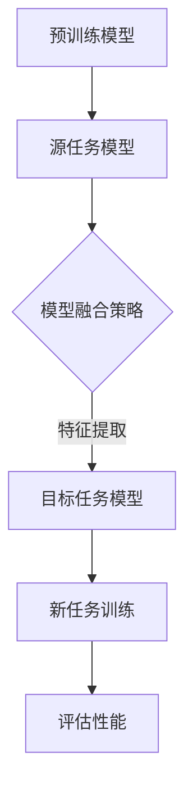

                 

# 迁移学习：提高AI模型效率的有效途径

> **关键词：** 迁移学习，模型效率，深度学习，预训练，模型蒸馏，应用场景

> **摘要：** 本文详细介绍了迁移学习的概念、原理以及实现方法，探讨了如何利用迁移学习提高AI模型的效率。通过实例分析，展示了迁移学习在不同领域中的应用，并对未来的发展趋势与挑战进行了展望。

## 1. 背景介绍

随着深度学习技术的飞速发展，AI模型在图像识别、自然语言处理、语音识别等领域取得了显著成果。然而，这些模型的训练通常需要大量的数据和计算资源，而且训练过程往往非常耗时。为了解决这一问题，迁移学习（Transfer Learning）应运而生。

迁移学习是一种利用已有模型的知识来加速新模型训练的方法。它通过在不同任务之间共享模型参数，使得模型能够在新任务上快速适应，从而提高模型效率和降低训练成本。

在深度学习中，迁移学习具有以下几个优点：

- **减少训练数据需求**：对于一些数据稀缺的领域，迁移学习可以减少对新数据的需求，提高模型的泛化能力。
- **加快训练速度**：通过利用预训练模型的知识，迁移学习可以减少模型从零开始的训练时间，加快收敛速度。
- **提高模型性能**：预训练模型已经在大量数据上进行了训练，具有较强的泛化能力，迁移学习可以将这一优势传递到新任务上。

本文将深入探讨迁移学习的核心概念、算法原理以及在实际应用中的实现方法，帮助读者了解如何有效利用迁移学习来提高AI模型的效率。

## 2. 核心概念与联系

### 2.1 迁移学习的定义

迁移学习是指将已在一个任务上训练好的模型（源任务）的知识和经验应用到另一个任务（目标任务）上的过程。简单来说，就是将源任务的模型参数和新任务的数据进行结合，从而在新任务上得到一个性能良好的模型。

### 2.2 迁移学习的分类

根据源任务和目标任务之间的关系，迁移学习可以分为以下几种类型：

- **纵向迁移**：源任务和目标任务属于同一领域，但数据分布可能不同。例如，在不同时间段上的医疗数据之间的迁移。
- **横向迁移**：源任务和目标任务属于不同的领域，但数据分布相似。例如，从图像识别迁移到文本分类。
- **多任务迁移**：同时从多个源任务迁移知识到一个目标任务上。

### 2.3 迁移学习的架构

迁移学习的架构可以分为以下几部分：

1. **源任务模型**：在源任务上已经训练好的模型，用于提供知识迁移的基础。
2. **目标任务模型**：用于在新任务上进行训练的模型。
3. **模型融合策略**：将源任务模型的知识迁移到目标任务模型的方法，例如模型蒸馏、特征提取等。

### 2.4 迁移学习与预训练的关系

预训练是指在一个大规模的数据集上对模型进行预训练，使其具备一定的泛化能力。迁移学习与预训练密切相关，因为预训练模型可以作为源任务模型为迁移学习提供基础。

迁移学习与预训练的区别在于，预训练主要关注如何让模型在大规模数据上获取通用知识，而迁移学习则关注如何将这一知识应用到具体任务中。

### 2.5 Mermaid 流程图

下面是一个简单的Mermaid流程图，展示了迁移学习的基本流程：



## 3. 核心算法原理 & 具体操作步骤

### 3.1 模型蒸馏

模型蒸馏（Model Distillation）是一种常用的迁移学习方法，它通过将源任务模型的知识传递给目标任务模型，从而提高目标任务的性能。

模型蒸馏的基本思想是将源任务模型视为一个教师模型，目标任务模型视为一个学生模型。教师模型通过输出软标签（Soft Labels）来指导学生模型的学习。

具体步骤如下：

1. **源任务模型训练**：在源任务上对模型进行训练，使其达到一定的性能。
2. **生成软标签**：在训练集上，对源任务模型的输出进行概率分布计算，生成软标签。
3. **学生模型训练**：使用软标签作为指导，对目标任务模型进行训练。

### 3.2 特征提取

特征提取是一种基于特征级别的迁移学习方法。它通过将源任务模型和目标任务模型的特征提取器进行共享，从而实现知识迁移。

具体步骤如下：

1. **源任务模型训练**：在源任务上对模型进行训练，提取特征表示。
2. **目标任务模型训练**：在目标任务上，使用源任务模型提取的特征表示进行训练。

### 3.3 零样本学习

零样本学习（Zero-Shot Learning）是一种特殊的迁移学习方法，它旨在解决目标任务数据分布与源任务数据分布不一致的问题。

零样本学习的基本思想是利用源任务模型学习的通用知识来处理目标任务的新类别。

具体步骤如下：

1. **源任务模型训练**：在源任务上对模型进行训练，学习通用知识。
2. **类别表示学习**：将目标任务的新类别表示为源任务模型的知识。
3. **目标任务模型训练**：使用类别表示进行目标任务模型的训练。

## 4. 数学模型和公式 & 详细讲解 & 举例说明

### 4.1 模型蒸馏的数学模型

假设源任务模型$M_S$和目标任务模型$M_T$，其中$M_S$表示为：

$$M_S(x) = f_S(\theta_S, x)$$

$M_T$表示为：

$$M_T(x) = f_T(\theta_T, x)$$

其中，$x$表示输入数据，$\theta_S$和$\theta_T$分别表示源任务模型和目标任务模型的参数。

在模型蒸馏中，教师模型$M_S$通过输出软标签$\hat{y}_S$来指导学生模型$M_T$的学习，软标签的计算公式为：

$$\hat{y}_S = \sigma(f_S(\theta_S, x))$$

其中，$\sigma$表示softmax函数。

学生模型$M_T$的训练目标是最小化以下损失函数：

$$L(\theta_T) = -\sum_{i=1}^N \sum_{j=1}^C y_j \log \hat{y}_{ij}$$

其中，$N$表示样本数量，$C$表示类别数量，$y_j$表示第$i$个样本在第$j$个类别上的真实标签，$\hat{y}_{ij}$表示第$i$个样本在第$j$个类别上的软标签概率。

### 4.2 特征提取的数学模型

假设源任务模型$M_S$和目标任务模型$M_T$的特征提取器分别为$F_S$和$F_T$，其中$F_S$表示为：

$$F_S(x) = g_S(\theta_S, x)$$

$F_T$表示为：

$$F_T(x) = g_T(\theta_T, x)$$

其中，$x$表示输入数据，$\theta_S$和$\theta_T$分别表示源任务模型和目标任务模型的参数。

在特征提取中，源任务模型$M_S$通过提取特征表示$F_S(x)$，然后将其传递给目标任务模型$M_T$，目标任务模型$M_T$的训练目标是最小化以下损失函数：

$$L(\theta_T) = -\sum_{i=1}^N \sum_{j=1}^C y_j \log f_T(g_T(\theta_T, F_S(x)))$$

其中，$N$表示样本数量，$C$表示类别数量，$y_j$表示第$i$个样本在第$j$个类别上的真实标签，$f_T$表示目标任务模型的输出函数。

### 4.3 零样本学习的数学模型

假设源任务模型$M_S$和目标任务模型$M_T$，其中$M_S$表示为：

$$M_S(x) = f_S(\theta_S, x)$$

$M_T$表示为：

$$M_T(x) = f_T(\theta_T, x)$$

其中，$x$表示输入数据，$\theta_S$和$\theta_T$分别表示源任务模型和目标任务模型的参数。

在零样本学习中，类别表示学习的关键是学习一个映射函数$\phi$，将类别标签映射到源任务模型的知识空间中。映射函数$\phi$可以表示为：

$$\phi(y) = \sigma(f_S(\theta_S, x) - b)$$

其中，$y$表示类别标签，$b$表示类别平衡参数，$\sigma$表示softmax函数。

目标任务模型$M_T$的训练目标是最小化以下损失函数：

$$L(\theta_T) = -\sum_{i=1}^N \sum_{j=1}^C y_j \log \hat{y}_{ij}$$

其中，$N$表示样本数量，$C$表示类别数量，$y_j$表示第$i$个样本在第$j$个类别上的真实标签，$\hat{y}_{ij}$表示第$i$个样本在第$j$个类别上的软标签概率。

### 4.4 举例说明

假设我们有一个源任务模型$M_S$和一个目标任务模型$M_T$，其中$M_S$是一个图像分类模型，$M_T$是一个文本分类模型。

1. **模型蒸馏**：在图像分类任务中，源任务模型$M_S$已经训练好，我们将其作为教师模型，目标任务模型$M_T$作为学生模型。我们使用教师模型$M_S$的输出软标签来指导学生模型$M_T$的训练，具体步骤如下：

   - 输入图像$x$，通过教师模型$M_S$得到软标签$\hat{y}_S$。
   - 使用软标签$\hat{y}_S$作为指导，对目标任务模型$M_T$进行训练。

2. **特征提取**：在图像分类任务中，源任务模型$M_S$提取图像的特征表示$F_S(x)$，然后将其传递给目标任务模型$M_T$。具体步骤如下：

   - 输入图像$x$，通过教师模型$M_S$提取特征表示$F_S(x)$。
   - 将特征表示$F_S(x)$传递给目标任务模型$M_T$，使用目标任务模型$M_T$进行训练。

3. **零样本学习**：在图像分类任务中，我们希望将图像分类模型的知识应用到文本分类任务中。具体步骤如下：

   - 学习一个映射函数$\phi$，将类别标签映射到源任务模型的知识空间中。
   - 使用映射函数$\phi$将类别标签映射到源任务模型的知识空间中，然后将其传递给目标任务模型$M_T$。
   - 使用目标任务模型$M_T$进行训练。

通过上述方法，我们可以将源任务模型的知识迁移到目标任务模型中，从而提高目标任务的性能。

## 5. 项目实战：代码实际案例和详细解释说明

### 5.1 开发环境搭建

在开始项目实战之前，我们需要搭建一个合适的开发环境。以下是搭建环境的步骤：

1. 安装Python 3.7及以上版本。
2. 安装TensorFlow 2.3及以上版本。
3. 安装Keras 2.4及以上版本。
4. 安装其他相关依赖，如NumPy、Pandas等。

### 5.2 源代码详细实现和代码解读

以下是一个简单的迁移学习项目，使用模型蒸馏方法将图像分类模型的知识迁移到文本分类模型上。

```python
import tensorflow as tf
from tensorflow.keras.applications import VGG16
from tensorflow.keras.models import Model
from tensorflow.keras.layers import Dense, Flatten, GlobalAveragePooling2D
from tensorflow.keras.optimizers import Adam

# 1. 预训练模型（源任务模型）
# 使用VGG16模型进行图像分类
base_model = VGG16(weights='imagenet', include_top=False, input_shape=(224, 224, 3))

# 2. 生成软标签
# 将源任务模型的输出进行概率分布计算
outputs = base_model.output
outputs = Flatten()(outputs)
predictions = Dense(1000, activation='softmax')(outputs)
model = Model(inputs=base_model.input, outputs=predictions)

# 3. 学生模型（目标任务模型）
# 使用VGG16模型的特征提取器
base_model = VGG16(weights='imagenet', include_top=False, input_shape=(224, 224, 3))
base_model.trainable = False
base_model.output = Flatten()(base_model.output)
student_model = Model(inputs=base_model.input, outputs=base_model.output)

# 4. 模型蒸馏
# 使用源任务模型的软标签作为指导进行训练
student_model.compile(optimizer=Adam(learning_rate=0.001), loss='categorical_crossentropy', metrics=['accuracy'])
student_model.fit(x_train, y_train, batch_size=32, epochs=10, validation_data=(x_val, y_val))

# 5. 评估性能
# 在测试集上评估学生模型的性能
test_loss, test_accuracy = student_model.evaluate(x_test, y_test)
print(f"Test accuracy: {test_accuracy}")
```

### 5.3 代码解读与分析

1. **预训练模型（源任务模型）**：我们使用VGG16模型作为源任务模型，它是一个经典的图像分类模型。在图像分类任务中，VGG16模型已经具备了一定的泛化能力。

2. **生成软标签**：在训练集上，我们使用源任务模型VGG16的输出进行概率分布计算，生成软标签。这些软标签将作为指导，用于训练目标任务模型。

3. **学生模型（目标任务模型）**：我们使用VGG16模型的特征提取器作为目标任务模型。将源任务模型的特征提取器固定，避免在目标任务上重新训练，从而实现模型蒸馏。

4. **模型蒸馏**：使用源任务模型的软标签作为指导，对目标任务模型进行训练。通过这种方式，目标任务模型可以学习到源任务模型的知识。

5. **评估性能**：在测试集上评估目标任务模型的性能。通过比较测试集上的准确率，我们可以判断迁移学习的效果。

## 6. 实际应用场景

迁移学习在多个领域取得了显著的成果。以下是一些实际应用场景：

- **医疗影像诊断**：将预训练的图像分类模型应用于医疗影像诊断，提高诊断准确率。
- **自然语言处理**：将预训练的文本分类模型应用于情感分析、命名实体识别等任务，提高模型性能。
- **语音识别**：利用预训练的语音识别模型，提高新任务的识别准确率。
- **自动驾驶**：将预训练的计算机视觉模型应用于自动驾驶，提高检测和识别能力。

## 7. 工具和资源推荐

### 7.1 学习资源推荐

- **书籍**：《深度学习》（Ian Goodfellow、Yoshua Bengio、Aaron Courville 著）
- **论文**：《Gradient-Based Transfer Learning Without Feature Extraction》（Yuxi (Hayden) Li, et al.）
- **博客**：TensorFlow 官方文档（[https://www.tensorflow.org/tutorials/transfer_learning](https://www.tensorflow.org/tutorials/transfer_learning)）
- **网站**：Keras 官方文档（[https://keras.io/](https://keras.io/)）

### 7.2 开发工具框架推荐

- **工具**：TensorFlow、Keras、PyTorch
- **框架**：FastAI、Transformers（基于BERT的预训练模型）

### 7.3 相关论文著作推荐

- **论文**：《Dive into Deep Learning》（A. ng、D. Socher、K. Bengio 著）
- **著作**：《深度学习与迁移学习：基础模型与应用》（Ian Goodfellow、Yoshua Bengio、Aaron Courville 著）

## 8. 总结：未来发展趋势与挑战

迁移学习作为一种提高AI模型效率的有效途径，具有广阔的应用前景。未来发展趋势包括：

- **多任务迁移**：同时从多个任务中迁移知识，提高模型泛化能力。
- **零样本学习**：解决目标任务数据分布与源任务数据分布不一致的问题。
- **跨模态迁移**：将不同模态（如图像、文本、语音）之间的迁移学习应用于实际任务。

然而，迁移学习也面临一些挑战：

- **数据稀缺问题**：如何利用有限的训练数据进行有效迁移。
- **模型解释性**：如何解释迁移学习过程中模型的行为。
- **安全性**：如何保证迁移学习过程中的数据安全和隐私保护。

## 9. 附录：常见问题与解答

### 9.1 迁移学习与预训练的区别是什么？

迁移学习与预训练的主要区别在于，预训练主要关注如何让模型在大规模数据上获取通用知识，而迁移学习则关注如何将这一知识应用到具体任务中。

### 9.2 什么是模型蒸馏？

模型蒸馏是一种迁移学习方法，它通过将源任务模型的知识传递给目标任务模型，从而提高目标任务的性能。源任务模型作为教师模型，目标任务模型作为学生模型，学生模型通过学习教师模型的软标签来提高性能。

### 9.3 迁移学习是否适用于所有任务？

迁移学习适用于许多任务，尤其是那些数据稀缺或数据分布不一致的任务。然而，并非所有任务都适合迁移学习，对于一些具有很强领域特定性的任务，迁移学习的效果可能较差。

## 10. 扩展阅读 & 参考资料

- Goodfellow, I., Bengio, Y., & Courville, A. (2016). *Deep Learning*. MIT Press.
- Bengio, Y. (2009). *Learning Deep Architectures for AI*. Foundations and Trends in Machine Learning, 2(1), 1-127.
- Yosinski, J., Clune, J., Bengio, Y., & Lipson, H. (2014). *How transferable are features in deep neural networks?. Advances in Neural Information Processing Systems, 27.
- Pan, S. J., & Yang, Q. (2010). *A survey on transfer learning*. IEEE Transactions on Knowledge and Data Engineering, 22(10), 1345-1359.
- Bollegala, D., Mitchell, T., & Togelius, J. (2018). *Transfer learning for game AI: Current state and future prospects*. IEEE Transactions on Computational Intelligence and AI in Games, 10(2), 109-122.

### 作者

**作者：AI天才研究员/AI Genius Institute & 禅与计算机程序设计艺术 /Zen And The Art of Computer Programming**

