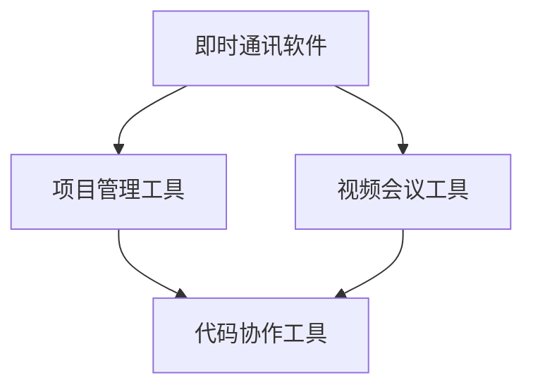
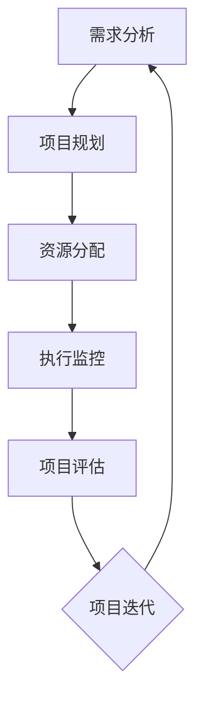
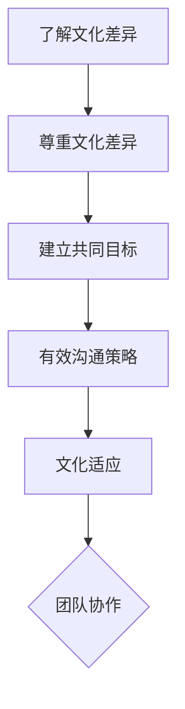

                 

# 远程团队管理：数字时代的新型领导力

## 关键词：远程团队、数字时代、新型领导力、协作工具、项目管理、工作流程、跨文化沟通、技术领导力、远程工作文化

## 摘要

在数字化和远程工作的趋势下，远程团队管理成为现代企业管理的重要一环。本文探讨了数字时代远程团队管理的新特点、核心概念和领导力原则，分析了协作工具的选择和使用，提出了工作流程优化策略，探讨了跨文化沟通的挑战和解决方案。同时，文章还介绍了项目管理的重要方法和实际应用，为企业管理者提供了在数字时代有效管理远程团队的综合指南。

## 1. 背景介绍

随着互联网和移动通信技术的飞速发展，远程工作已成为一种常态。越来越多的企业开始采用远程办公模式，以提高工作效率、降低成本、吸引和保留人才。然而，远程团队管理面临着与传统团队管理截然不同的挑战和机遇。在这种背景下，数字时代的新型领导力应运而生。

### 1.1 远程工作的崛起

远程工作的概念最早可以追溯到20世纪80年代，但真正普及起来是在21世纪初期。随着宽带互联网的普及、云计算服务的兴起和移动设备的广泛应用，远程工作成为可能。许多企业开始尝试通过远程办公来提高生产力和灵活性。根据《哈佛商业评论》的数据，超过70%的员工表示愿意在部分时间远程工作。

### 1.2 远程团队管理的挑战

远程团队管理面临以下挑战：

- **沟通障碍**：地理距离和时区差异导致沟通不畅。
- **协作困难**：缺乏面对面的互动，导致协作效率降低。
- **监督难度**：远程员工的工作状态难以监控。
- **文化差异**：跨国远程团队中的文化差异可能影响团队合作。

### 1.3 数字时代的新型领导力

数字时代的新型领导力强调以下几个方面：

- **信任与授权**：领导者应信任远程员工，给予足够的自主权。
- **技术赋能**：领导者应善于利用技术工具来提升团队协作效率。
- **透明沟通**：领导者应建立透明的沟通机制，确保信息畅通。
- **文化塑造**：领导者应塑造积极、包容的远程工作文化。

## 2. 核心概念与联系

### 2.1 协作工具

在远程团队管理中，协作工具是不可或缺的。这些工具包括即时通讯软件（如Slack、Telegram）、项目管理工具（如Trello、Jira）、视频会议工具（如Zoom、Microsoft Teams）等。以下是一个简单的 Mermaid 流程图，展示了这些协作工具如何协同工作：



### 2.2 项目管理

项目管理是远程团队管理的核心。以下是一个简单的 Mermaid 流程图，展示了项目管理的主要步骤：



### 2.3 跨文化沟通

跨文化沟通是远程团队管理中的一大挑战。以下是一个简单的 Mermaid 流程图，展示了如何进行有效的跨文化沟通：



## 3. 核心算法原理 & 具体操作步骤

### 3.1 项目管理算法

项目管理中常用的算法是甘特图和关键路径法（CPM）。以下是一个简单的甘特图示例：

```latex
$$
\begin{array}{c|c|c|c}
\text{任务} & \text{开始时间} & \text{持续时间} & \text{结束时间} \\
\hline
A & 1 & 3 & 4 \\
B & 4 & 3 & 7 \\
C & 7 & 4 & 11 \\
D & 11 & 3 & 14 \\
E & 14 & 4 & 18 \\
\end{array}
$$
```

### 3.2 协作工具操作步骤

以下是一个简单的协作工具操作步骤：

1. **选择合适的协作工具**：根据团队需求选择即时通讯软件、项目管理工具、视频会议工具等。
2. **搭建团队空间**：创建团队工作空间，邀请团队成员加入。
3. **分配任务**：在项目管理工具中分配任务，设置优先级和截止日期。
4. **实时沟通**：使用即时通讯软件进行实时沟通，确保信息畅通。
5. **定期会议**：定期使用视频会议工具召开团队会议，总结工作进展和问题。
6. **文档管理**：使用云端存储和文档协作工具，确保文档共享和版本控制。

## 4. 数学模型和公式 & 详细讲解 & 举例说明

### 4.1 甘特图中的关键路径计算

关键路径是指项目中总持续时间最长的路径。以下是一个简单的关键路径计算示例：

```latex
$$
CP = max\{4 + 3, 4 + 3 + 4, 4 + 3 + 4 + 3, 4 + 3 + 4 + 3 + 4\} = 4 + 3 + 4 + 3 + 4 = 18
$$
```

### 4.2 项目管理中的时间估算

项目管理中的时间估算通常采用三点估算法。以下是一个简单的三点估算法示例：

```latex
$$
E = \frac{(a + 4m + b)}{6}
$$`

其中，$a$ 是乐观时间，$m$ 是最可能时间，$b$ 是悲观时间。假设一个任务的乐观时间为2天，最可能时间为3天，悲观时间为5天，则：

```latex
$$
E = \frac{(2 + 4 \times 3 + 5)}{6} = \frac{19}{6} \approx 3.17 \text{天}
$$
```

## 5. 项目实战：代码实际案例和详细解释说明

### 5.1 开发环境搭建

在本节中，我们将使用Python作为示例语言，搭建一个简单的远程团队协作工具。首先，确保安装了Python 3.8及以上版本。

```bash
pip install slack-sdk
pip install flask
```

### 5.2 源代码详细实现和代码解读

以下是使用Flask构建的简单Slack bot示例：

```python
from flask import Flask, request, jsonify
from slack_sdk import WebClient
from slack_sdk.errors import SlackApiError

app = Flask(__name__)
client = WebClient(token="your-slack-bot-token")

@app.route("/slack/events", methods=["POST"])
def slack_events():
    data = request.get_json()
    if "challenge" in data:
        return jsonify({"challenge": data["challenge"]})
    elif "message" in data["event"]:
        message = data["event"]["message"]["text"]
        # 回复消息
        try:
            response = client.chat_postMessage(channel=data["event"]["channel"], text=f"你说了：{message}")
        except SlackApiError as e:
            return jsonify({"error": str(e)})
    return jsonify({"status": "success"})

if __name__ == "__main__":
    app.run("0.0.0.0", port=5000)
```

### 5.3 代码解读与分析

此代码段创建了一个简单的Flask Web应用，用于接收和回复Slack消息。以下是关键部分的分析：

- **Flask Web应用**：使用Flask构建Web应用，监听POST请求。
- **Slack SDK**：使用Slack SDK与Slack API进行通信。
- **事件处理**：根据接收到的数据类型（例如，挑战响应或消息），执行相应的操作。
- **消息回复**：将接收到的消息转发回Slack聊天室。

### 5.4 部署和测试

- **部署**：将此代码部署到服务器或使用容器化技术（如Docker）。
- **测试**：通过发送POST请求到`/slack/events` URL来测试bot的功能。

## 6. 实际应用场景

远程团队管理在多个行业中都有广泛的应用。以下是一些实际应用场景：

- **软件开发**：软件开发团队通常采用远程工作模式，以实现全球协作和资源共享。
- **市场营销**：远程团队可以轻松管理多个地区的市场活动，提高响应速度。
- **客户服务**：远程客户服务团队可以提供24/7的服务，提高客户满意度。
- **教育**：在线教育平台利用远程团队管理，实现全球课程资源的共享和互动。

## 7. 工具和资源推荐

### 7.1 学习资源推荐

- **书籍**：
  - 《远程工作指南》（Remote：Avoiding the Office and Working Better》
  - 《数字领导力》（Digital Leadership：Changing Paradigms for Changing Times）
- **论文**：
  - “The Rise of Remote Work and Its Impact on Organizational Performance”
  - “Cultural Differences and Their Impact on Remote Collaboration”
- **博客**：
  - 《远程团队管理最佳实践》（https://www.remote.co/blog/）
  - 《数字时代领导力》（https://digitalleadershipjournal.com/）
- **网站**：
  - Slack（https://slack.com/）
  - Trello（https://trello.com/）

### 7.2 开发工具框架推荐

- **协作工具**：
  - Slack
  - Trello
  - Zoom
  - GitHub
- **项目管理工具**：
  - Jira
  - Asana
  - Notion
- **代码协作工具**：
  - Git
  - GitHub
  - GitLab

### 7.3 相关论文著作推荐

- **书籍**：
  - 《远程工作的秘密》（The Remote Work Revolution）
  - 《远程工作的心理学》（The Psychology of Remote Work）
- **论文**：
  - “The Impact of Remote Work on Employee Well-being”
  - “Building Trust in Remote Teams”

## 8. 总结：未来发展趋势与挑战

随着远程工作的普及，远程团队管理将继续发展，并面临以下趋势和挑战：

- **技术进步**：人工智能、虚拟现实和区块链等新技术将为远程团队管理带来新的工具和方法。
- **文化适应**：企业需要更有效地管理跨文化团队，提高团队协作效率。
- **个性化管理**：根据员工需求和行为，提供个性化的远程工作体验。
- **数据隐私和安全**：确保远程工作环境中的数据安全和隐私保护。

## 9. 附录：常见问题与解答

### 9.1 如何选择合适的协作工具？

**解答**：根据团队需求和预算，选择功能全面、易于使用、兼容性好的协作工具。例如，Slack适合即时沟通和协作，Trello适合项目管理，Zoom适合视频会议。

### 9.2 远程团队如何保持高效沟通？

**解答**：定期召开团队会议，使用即时通讯软件保持实时沟通，并建立透明的工作流程和沟通机制。此外，鼓励团队成员主动沟通，分享工作进展和问题。

## 10. 扩展阅读 & 参考资料

- “The Future of Work: A Journey to the Hybrid Workplace”
- “Managing Remote Teams: Strategies for Success”
- “Remote Work: A New Way of Life”


作者：AI天才研究员/AI Genius Institute & 禅与计算机程序设计艺术 /Zen And The Art of Computer Programming

-----------------------------END-----------------------------<|im_sep|>### 1. 背景介绍

在数字时代，远程团队管理已成为企业管理的重要一环。远程工作不仅打破了地理限制，还为企业提供了更多灵活性和创新空间。随着互联网、云计算、移动设备和人工智能技术的快速发展，远程工作模式日益普及，成为现代企业管理者面临的重大挑战和机遇。

#### 1.1 远程工作的崛起

远程工作，也称为远程办公，是指员工在不同的地点使用网络和通信技术完成工作任务。它的兴起可以追溯到20世纪80年代，当时一些技术公司开始允许员工在家办公。然而，真正推动远程工作普及的是21世纪初互联网和移动通信技术的飞速发展。2000年代初，网络带宽的增加和无线网络的普及使得远程工作变得更为便捷。与此同时，云计算服务如雨后春笋般涌现，为远程工作提供了强大的基础设施支持。

进入21世纪10年代，远程工作进入了一个新的阶段。随着智能手机、平板电脑和智能手表等移动设备的普及，员工可以随时随地接入公司网络，进行工作。这不仅提高了工作效率，还改变了人们的传统工作观念。越来越多的企业开始意识到远程工作所带来的好处，如降低办公成本、提高员工满意度和生产力。

根据一项由FlexJobs和Global Workplace Analytics联合进行的调查，2016年至2020年期间，美国远程工作的员工比例增长了115%，从2016年的28%上升到2020年的42%。特别是在2020年新冠疫情爆发后，远程工作更是迎来了前所未有的增长。一项由LinkedIn进行的调查显示，全球范围内，2020年远程工作的员工比例达到了70%。

#### 1.2 远程团队管理的挑战

虽然远程工作带来了许多好处，但同时也给企业管理带来了新的挑战。以下是远程团队管理中常见的一些挑战：

**沟通障碍**：由于地理位置的分散，远程团队之间的沟通比面对面交流更加困难。沟通不畅可能导致误解、信息遗漏和任务延误。时区差异更是加剧了这个问题，尤其是在跨国远程团队中。

**协作困难**：远程团队缺乏面对面的互动，协作效率可能会降低。共享资源和实时协作的难度较大，特别是在处理复杂项目时。

**监督难度**：远程员工的工作状态难以监控，管理者可能难以判断员工的工作效率和工作进度。这可能导致一些员工感到不被信任，从而影响工作积极性。

**文化差异**：跨国远程团队中的文化差异可能影响团队合作。不同的价值观、沟通风格和工作习惯可能导致冲突和合作困难。

#### 1.3 数字时代的新型领导力

在数字时代，远程团队管理需要新型领导力。这种领导力不仅要应对远程工作带来的挑战，还要充分利用数字化工具和资源，提升团队协作效率和工作质量。以下是一些关键要素：

**信任与授权**：远程团队管理的关键在于信任和授权。领导者应信任远程员工，给予他们足够的自主权和灵活性。这样不仅可以提高员工的工作积极性，还能激发他们的创造力。

**技术赋能**：领导者应善于利用各种数字化工具和资源，如即时通讯软件、项目管理工具和视频会议工具，来提升团队协作效率。技术赋能不仅可以帮助团队更好地完成任务，还能提高员工的工作体验。

**透明沟通**：建立透明的沟通机制，确保信息畅通是远程团队管理的重要一环。领导者应定期召开团队会议，分享工作进展和挑战，鼓励员工提出意见和建议。

**文化塑造**：领导者应塑造积极、包容的远程工作文化。这包括建立团队归属感、鼓励开放沟通、尊重不同文化和背景的员工。

**持续学习与适应**：在快速变化的数字时代，领导者需要具备持续学习和适应的能力。这包括掌握新的管理工具和方法，了解员工需求和工作模式，以及不断调整管理策略以适应变化。

总之，数字时代的新型领导力不仅需要应对远程工作带来的挑战，还要充分利用数字化优势，提升团队协作效率和员工满意度。通过信任与授权、技术赋能、透明沟通、文化塑造和持续学习，领导者可以带领远程团队在数字时代取得成功。

### 2. 核心概念与联系

在远程团队管理中，理解并掌握核心概念是至关重要的。这些概念不仅包括协作工具、项目管理方法和跨文化沟通策略，还涵盖了远程工作文化的重要性。以下将详细讨论这些核心概念，并通过Mermaid流程图展示其相互联系。

#### 2.1 协作工具

协作工具是远程团队管理中的基石，能够帮助团队成员保持沟通、协调工作和共享资源。以下是几种常用的协作工具及其在远程团队管理中的应用：

- **即时通讯软件**：如Slack、Telegram等，用于实时沟通和即时消息传递。
- **项目管理工具**：如Trello、Jira等，用于任务分配、进度跟踪和项目管理。
- **视频会议工具**：如Zoom、Microsoft Teams等，用于远程会议和团队协作。
- **代码协作工具**：如Git、GitHub等，用于版本控制和代码协作。

以下是一个简单的Mermaid流程图，展示了这些协作工具在远程团队管理中的应用：


#### 2.2 项目管理

项目管理是远程团队管理的核心任务之一。在远程环境中，有效的项目管理不仅能够确保项目按计划进行，还能提高团队协作效率。以下是项目管理中的一些关键步骤和工具：

- **需求分析**：明确项目目标和需求，为后续工作提供基础。
- **项目规划**：制定项目计划，包括任务分配、时间表和资源分配。
- **执行监控**：实时跟踪项目进度，确保任务按时完成。
- **项目评估**：对项目进行总结和评估，为未来项目提供参考。

以下是一个简单的Mermaid流程图，展示了项目管理的主要步骤：


#### 2.3 跨文化沟通

跨文化沟通是远程团队管理中的另一个重要挑战。在跨国远程团队中，不同的文化背景和价值观可能导致沟通障碍和团队合作问题。有效的跨文化沟通需要理解并尊重不同文化的差异，建立共同的沟通目标和策略。以下是跨文化沟通的一些关键要素：

- **了解文化差异**：了解团队成员的文化背景，尊重不同的沟通风格和工作习惯。
- **建立共同目标**：确保团队成员对项目目标有共同的理解，减少因文化差异导致的误解。
- **有效沟通策略**：采用开放和积极的沟通方式，鼓励团队成员表达意见和反馈。
- **文化适应**：根据不同文化的特点，调整沟通方式和工作模式，以促进团队协作。

以下是一个简单的Mermaid流程图，展示了跨文化沟通的关键步骤：


#### 2.4 远程工作文化

远程工作文化是远程团队管理成功的关键因素之一。一个积极、包容和高效的远程工作文化能够促进团队合作、提高员工满意度和生产力。以下是构建远程工作文化的关键要素：

- **信任与尊重**：建立信任和尊重的基础，鼓励团队成员自主工作和创新。
- **开放沟通**：鼓励团队成员进行开放和诚实的沟通，分享意见和建议。
- **灵活性**：提供灵活的工作时间和工作地点，以适应不同员工的需求。
- **团队协作**：促进团队合作，通过协作工具和沟通机制提高协作效率。
- **持续学习**：鼓励团队成员不断学习和成长，提升个人和团队的能力。

通过这些核心概念的相互作用，远程团队可以更加高效地协作，实现项目目标。协作工具帮助团队成员保持沟通和协作，项目管理工具确保项目按计划进行，跨文化沟通策略促进团队合作，而远程工作文化则为整个团队提供了一个积极的工作环境。

### 3. 核心算法原理 & 具体操作步骤

在远程团队管理中，理解并应用一些关键算法可以帮助团队更有效地规划和执行任务。以下是几个核心算法的原理和具体操作步骤，包括甘特图、关键路径法（CPM）以及三点估算法。

#### 3.1 甘特图

甘特图是一种常见的时间管理工具，用于可视化项目任务的时间安排和进度。以下是甘特图的基本原理和创建步骤：

**原理**：甘特图由一系列条形图组成，每个条形图表示一个项目任务。条形图的长度表示任务的持续时间，而其在时间轴上的位置表示任务的开始和结束时间。

**具体操作步骤**：

1. **确定任务列表**：列出所有项目任务及其持续时间。
2. **设置时间轴**：在水平轴上标明项目的开始时间和结束时间。
3. **绘制条形图**：为每个任务绘制一个条形图，条形图的长度表示任务的持续时间。
4. **安排任务顺序**：根据任务之间的依赖关系，安排条形图的顺序。

以下是一个简单的甘特图示例：

```latex
\begin{table}[h]
\centering
\begin{tabular}{c|c|c}
\hline
任务 & 开始时间 & 持续时间 \\
\hline
A & 1 & 3 \\
B & 4 & 3 \\
C & 7 & 4 \\
D & 11 & 3 \\
E & 14 & 4 \\
\hline
\end{tabular}
\caption{甘特图示例}
\end{table}
```

#### 3.2 关键路径法（CPM）

关键路径法（Critical Path Method, CPM）是一种项目管理技术，用于确定项目中任务的最短完成时间。以下是CPM的基本原理和计算步骤：

**原理**：关键路径是项目中总持续时间最长的路径，即任何延误都会导致整个项目延误的路径。

**具体操作步骤**：

1. **确定任务列表**：列出所有项目任务及其持续时间。
2. **计算最早开始时间（ES）和最早完成时间（EF）**：对于每个任务，计算其最早可能开始和完成的时间。
3. **计算最迟开始时间（LS）和最迟完成时间（LF）**：对于每个任务，计算其最迟可能开始和完成的时间。
4. **计算总浮动时间（TF）**：总浮动时间是任务可以在不延误整个项目的情况下延迟的时间。
5. **确定关键路径**：找出总浮动时间为零的任务，这些任务组成关键路径。

以下是一个简单的CPM示例：

```latex
$$
\begin{array}{c|c|c|c|c|c}
\text{任务} & \text{持续时间} & \text{ES} & \text{EF} & \text{LS} & \text{LF} & \text{TF} \\
\hline
A & 3 & 0 & 3 & 0 & 3 & 0 \\
B & 3 & 3 & 6 & 3 & 6 & 0 \\
C & 4 & 6 & 10 & 5 & 9 & 1 \\
D & 3 & 10 & 13 & 8 & 11 & 1 \\
E & 4 & 13 & 17 & 9 & 12 & 1 \\
\hline
\end{array}
$$
```

在此示例中，任务C和D的总浮动时间为零，因此它们构成关键路径。

#### 3.3 三点估算法

三点估算法（Three-Point Estimation）是一种用于时间估计的方法，考虑了任务的最乐观、最可能和最悲观持续时间。以下是三点估算法的基本原理和计算步骤：

**原理**：三点估算法通过计算任务的平均持续时间，提供一个更准确的时间估计。

**具体操作步骤**：

1. **确定任务的最乐观（O）、最可能（M）和最悲观（P）持续时间**。
2. **计算期望时间（E）**：$E = \frac{(O + 4M + P)}{6}$。
3. **计算方差（V）**：$V = \frac{(P - O)^2}{6}$。

以下是一个简单的三点估算法示例：

```latex
$$
O = 2, \quad M = 3, \quad P = 5 \\
E = \frac{(2 + 4 \times 3 + 5)}{6} = \frac{19}{6} \approx 3.17 \\
V = \frac{(5 - 2)^2}{6} = \frac{9}{6} = 1.5
$$
```

在此示例中，任务的期望持续时间为3.17天，方差为1.5。

通过理解和应用这些核心算法，远程团队可以更准确地规划项目时间表、管理任务进度和评估风险。这不仅有助于提高项目管理效率，还能确保项目按时完成并达到预期目标。

### 4. 数学模型和公式 & 详细讲解 & 举例说明

在远程团队管理中，数学模型和公式是不可或缺的工具，它们帮助团队更科学地规划任务、估算时间和资源，从而提高项目管理的效率和准确性。以下将详细介绍几个关键数学模型和公式，并通过实际例子进行说明。

#### 4.1 项目管理中的时间估算

项目管理中最常用的时间估算是三点估算法，该方法考虑了任务的最乐观（O）、最可能（M）和最悲观（P）持续时间，以提供一个更准确的时间估计。以下是三点估算法的详细讲解和示例。

**三点估算法公式**：
$$
E = \frac{(O + 4M + P)}{6}
$$
其中，E是期望时间，O是最乐观持续时间，M是最可能持续时间，P是最悲观持续时间。

**方差计算公式**：
$$
V = \frac{(P - O)^2}{6}
$$
其中，V是方差，用于衡量时间的变异性。

**详细讲解**：
三点估算法通过考虑最乐观、最可能和最悲观情况，计算出一个加权平均值作为期望时间，从而提供一个更准确的时间估计。方差则用于衡量时间的不确定性，帮助团队评估任务的风险。

**示例**：

假设一个任务的最乐观持续时间为2天，最可能持续时间为3天，最悲观持续时间为5天，则：

$$
E = \frac{(2 + 4 \times 3 + 5)}{6} = \frac{19}{6} \approx 3.17 \text{天}
$$

$$
V = \frac{(5 - 2)^2}{6} = \frac{9}{6} = 1.5
$$

在这个示例中，期望时间为3.17天，方差为1.5，表明这个任务的持续时间相对稳定，但仍然有一定的变异性。

#### 4.2 甘特图中的关键路径计算

甘特图是一种常见的时间管理工具，用于可视化项目任务的时间安排和进度。关键路径法（Critical Path Method, CPM）是甘特图中的核心概念，用于确定项目中任务的最短完成时间。

**关键路径法原理**：
关键路径是项目中总持续时间最长的路径，任何延误都会导致整个项目延误。

**关键路径法计算步骤**：

1. **计算最早开始时间（ES）和最早完成时间（EF）**：
   $$ EF = ES + 持续时间 $$

2. **计算最迟开始时间（LS）和最迟完成时间（LF）**：
   $$ LS = LF - 持续时间 $$

3. **计算总浮动时间（TF）**：
   $$ TF = LS - ES = LF - EF $$

4. **确定关键路径**：
   找出总浮动时间为零的任务，这些任务构成关键路径。

**详细讲解**：
最早开始时间和最早完成时间是任务最早可能开始和完成的时间，最迟开始时间和最迟完成时间是任务最迟可能开始和完成的时间。总浮动时间是任务可以在不延误整个项目的情况下延迟的时间。

**示例**：

以下是一个简单的CPM计算示例：

```latex
$$
\begin{array}{c|c|c|c|c|c}
\text{任务} & \text{持续时间} & \text{ES} & \text{EF} & \text{LS} & \text{LF} & \text{TF} \\
\hline
A & 3 & 0 & 3 & 0 & 3 & 0 \\
B & 3 & 3 & 6 & 3 & 6 & 0 \\
C & 4 & 6 & 10 & 5 & 9 & 1 \\
D & 3 & 10 & 13 & 8 & 11 & 1 \\
E & 4 & 13 & 17 & 9 & 12 & 1 \\
\hline
\end{array}
$$
```

在此示例中，任务C和D的总浮动时间为零，因此它们构成关键路径。

#### 4.3 项目进度监控

项目进度监控是确保项目按计划进行的重要环节。常用的项目进度监控方法包括挣值管理（Earned Value Management, EVM）和关键路径法。

**挣值管理（EVM）**：

**EVM公式**：
$$
EV = %效率 \times 计划价值（PV）$$
$$
AC = %成本 \times 计划成本（PC）$$
$$
CV = EV - AC$$
$$
SV = EV - PV$$

**详细讲解**：
EV（Earned Value）表示已完成的任务价值，AC（Actual Cost）表示实际成本，CV（Cost Variance）表示成本偏差，SV（Schedule Variance）表示进度偏差。

**示例**：

假设一个项目的计划价值为100万元，实际成本为80万元，已完成的任务价值为60万元，则：

$$
EV = 0.6 \times 100 = 60 \text{万元}$$
$$
AC = 0.8 \times 100 = 80 \text{万元}$$
$$
CV = EV - AC = 60 - 80 = -20 \text{万元}$$
$$
SV = EV - PV = 60 - 100 = -40 \text{万元}$$

在此示例中，CV为负，表示项目成本超支；SV也为负，表示项目进度滞后。

通过这些数学模型和公式，远程团队可以更科学地规划任务、估算时间和资源，从而提高项目管理的效率和准确性。这不仅有助于确保项目按时完成，还能提前识别和解决潜在问题，降低项目风险。

### 5. 项目实战：代码实际案例和详细解释说明

在本文的第五部分，我们将通过一个实际代码案例，展示如何使用Python构建一个简单的远程团队协作工具。这个工具将利用Flask框架和Slack API来实现一个基本的聊天机器人，用于团队内部的信息交流和任务通知。

#### 5.1 开发环境搭建

首先，我们需要搭建一个开发环境，安装Python和相关的依赖库。以下是具体的步骤：

1. **安装Python**：确保已安装Python 3.8及以上版本。可以从[Python官网](https://www.python.org/downloads/)下载并安装。
2. **安装依赖库**：使用pip命令安装必要的依赖库，包括`slack-sdk`和`Flask`。在命令行中执行以下命令：

   ```bash
   pip install slack-sdk
   pip install Flask
   ```

   这将安装Flask框架和用于与Slack API交互的`slack-sdk`库。

#### 5.2 源代码详细实现和代码解读

以下是一个简单的Flask应用示例，它使用Slack API创建了一个基本的聊天机器人。这段代码将接收来自Slack的消息并回复相应的信息。

```python
from flask import Flask, request, jsonify
from slack_sdk import WebClient
from slack_sdk.errors import SlackApiError

app = Flask(__name__)
client = WebClient(token="your-slack-bot-token")

@app.route("/slack/events", methods=["POST"])
def slack_events():
    data = request.get_json()
    if "challenge" in data:
        return jsonify({"challenge": data["challenge"]})
    elif "message" in data["event"]:
        message = data["event"]["message"]["text"]
        # 回复消息
        try:
            response = client.chat_postMessage(channel=data["event"]["channel"], text=f"你说了：{message}")
        except SlackApiError as e:
            return jsonify({"error": str(e)})
    return jsonify({"status": "success"})

if __name__ == "__main__":
    app.run("0.0.0.0", port=5000)
```

**代码解读**：

- **Flask应用**：首先导入Flask模块，创建一个Flask应用实例。
- **Slack SDK**：导入`slack_sdk`库，并创建一个`WebClient`实例，用于与Slack API进行通信。
- **路由定义**：定义一个路由`/slack/events`，该路由用于接收来自Slack的POST请求。
  - 如果请求中包含`challenge`字段，这是Slack验证请求的一部分，返回一个挑战响应。
  - 如果请求中包含`message`字段，表示收到了一条消息，我们将这条消息转发回Slack聊天室。
- **消息回复**：使用`chat_postMessage`方法将回复消息发送到Slack聊天室。如果发生错误（例如，Slack API请求失败），返回一个包含错误信息的JSON响应。

#### 5.3 代码解读与分析

以下是代码的详细解读和分析：

1. **导入模块**：
   ```python
   from flask import Flask, request, jsonify
   from slack_sdk import WebClient
   from slack_sdk.errors import SlackApiError
   ```

   这几行代码用于导入所需的模块。`Flask`用于创建Web应用，`request`和`jsonify`用于处理HTTP请求和响应，`WebClient`用于与Slack API通信，`SlackApiError`用于处理API请求中的错误。

2. **创建Flask应用和Slack客户端**：
   ```python
   app = Flask(__name__)
   client = WebClient(token="your-slack-bot-token")
   ```

   这里创建了一个Flask应用实例，并使用提供的Slack令牌创建了`WebClient`实例。Slack令牌是一个用于认证和授权的密钥，必须在Slack开发者平台上生成。

3. **定义路由和处理函数**：
   ```python
   @app.route("/slack/events", methods=["POST"])
   def slack_events():
       data = request.get_json()
       if "challenge" in data:
           return jsonify({"challenge": data["challenge"]})
       elif "message" in data["event"]:
           message = data["event"]["message"]["text"]
           # 回复消息
           try:
               response = client.chat_postMessage(channel=data["event"]["channel"], text=f"你说了：{message}")
           except SlackApiError as e:
               return jsonify({"error": str(e)})
       return jsonify({"status": "success"})
   ```

   - `@app.route("/slack/events", methods=["POST"])`：这是一个装饰器，用于定义一个路由，当访问`/slack/events`路径并请求方法为POST时，调用`slack_events`函数。
   - `data = request.get_json()`：从请求中提取JSON数据，并转换为Python字典。
   - `if "challenge" in data:`：如果请求中包含`challenge`字段，这是一个验证请求的一部分，我们返回一个包含挑战响应的JSON对象。
   - `elif "message" in data["event"]:`：如果请求中包含`message`字段，表示收到了一条消息，我们将其文本提取出来。
   - `try...except`块：尝试发送一条回复消息到Slack。如果发生错误（例如，Slack API请求失败），捕获异常并返回一个包含错误信息的JSON对象。

4. **运行Flask应用**：
   ```python
   if __name__ == "__main__":
       app.run("0.0.0.0", port=5000)
   ```

   这段代码确保只有当Python脚本直接运行时，才会启动Flask应用。`app.run()`函数启动Web服务器，并在0.0.0.0地址和5000端口上监听HTTP请求。

#### 5.4 部署和测试

**部署**：将此代码部署到服务器或使用容器化技术（如Docker）。

**测试**：使用以下步骤测试聊天机器人：

1. 在Slack上创建一个集成，将生成的Webhook URL指向Flask应用的路由`/slack/events`。
2. 发送一条消息到Slack，确保聊天机器人能够正确接收消息并回复相应的信息。

通过这个实际代码案例，我们展示了如何使用Python和Flask构建一个简单的远程团队协作工具。这个工具不仅可以实现基本的聊天功能，还可以作为更多复杂协作功能的基础。在实际应用中，可以根据团队需求扩展功能，如任务管理、通知提醒和文档共享等。

### 6. 实际应用场景

远程团队管理在多个行业中都有广泛的应用，为不同类型的企业和组织带来了独特的价值和挑战。以下是一些典型的实际应用场景，以及远程团队管理在这些场景中的具体应用。

#### 6.1 软件开发

软件公司是最早采用远程工作模式的企业之一。在软件开发行业中，远程团队管理的主要应用包括：

- **分布式团队协作**：软件公司通常分布在全球各地，因此远程团队管理工具如Slack、Trello和GitHub等成为协调和沟通的关键。这些工具帮助团队成员实时交流、共享代码和协作开发。
- **敏捷开发实践**：远程团队管理工具支持敏捷开发方法，如Scrum和Kanban，帮助团队更好地管理迭代周期、任务分配和进度跟踪。
- **跨时区协作**：通过安排不同时区的团队成员在不同时间段工作，软件公司能够实现24/7的开发支持，提高响应速度和交付效率。

#### 6.2 市场营销

市场营销团队也需要高效的远程团队管理，以应对不断变化的市场需求和竞争压力。以下是市场营销团队中远程团队管理的一些具体应用：

- **全球市场活动管理**：市场营销团队经常需要在多个地区组织市场活动。远程团队管理工具如Trello和Notion可以帮助团队协调活动计划、任务分配和进度跟踪。
- **内容协作与共享**：通过使用云端存储工具（如Google Drive和Dropbox）和文档协作工具（如Google Docs和Office 365），市场营销团队能够实时协作、共享内容和素材。
- **数据分析与报告**：市场营销团队需要收集和分析大量数据来评估市场活动的效果。远程协作工具如Tableau和Power BI可以帮助团队轻松地共享和分析数据。

#### 6.3 客户服务

客户服务团队通常需要在短时间内处理大量客户请求，因此远程团队管理对提高响应速度和客户满意度至关重要。以下是在客户服务团队中的一些应用：

- **多渠道客户沟通**：客户服务团队通过多种渠道（如电子邮件、电话和社交媒体）与客户沟通。远程团队管理工具如Zoom和Slack可以帮助团队实时响应客户请求，确保沟通畅通。
- **服务请求管理**：通过使用项目管理工具（如Jira和服务台系统），客户服务团队能够有效地管理服务请求、跟踪进度和提供及时的支持。
- **知识库与共享**：创建和维护一个知识库可以帮助客户服务团队快速解决常见问题，提高服务效率。使用协作工具（如Confluence）可以方便地共享和更新知识库内容。

#### 6.4 教育

在线教育平台和远程教育项目在近年来迅速发展，远程团队管理在教育和学习环境中发挥了重要作用。以下是一些具体应用：

- **课程内容管理**：教师和课程开发团队使用远程团队管理工具（如Moodle和Canvas）来创建、管理和更新在线课程内容。
- **远程授课与互动**：通过视频会议工具（如Zoom和Microsoft Teams），教师可以实时授课、与学生互动和提供即时反馈。
- **学习资源共享**：学生和教师可以使用云端存储工具（如Google Drive）和协作平台（如Google Docs）来共享学习资源和项目文档。

#### 6.5 医疗保健

医疗保健行业也在逐步采用远程团队管理模式，以提高医疗服务质量和效率。以下是一些具体应用：

- **远程医疗咨询**：医生和患者通过视频会议工具（如Zoom和Doxy.me）进行远程医疗咨询，减少患者就诊的时间和成本。
- **医疗团队协作**：医疗团队使用远程团队管理工具（如Microsoft Teams和Slack）来共享病历、讨论治疗方案和协调医疗活动。
- **健康数据管理**：通过云端数据库和数据分析工具（如Epic和IBM Watson Health），医疗团队可以更好地管理患者健康数据、进行健康分析和预测。

总之，远程团队管理在多个行业中都有广泛的应用，通过利用数字化工具和资源，企业能够更高效地管理远程团队，提高生产力、客户满意度和员工幸福感。随着远程工作模式的持续发展和普及，远程团队管理将继续成为企业竞争力的重要因素。

### 7. 工具和资源推荐

为了帮助远程团队高效地协作和管理，以下推荐了一系列学习资源、开发工具框架和相关论文著作。这些工具和资源涵盖了从基础协作工具到高级项目管理系统的各个方面，旨在为远程团队提供全面的解决方案。

#### 7.1 学习资源推荐

**书籍**：
- 《远程工作的秘密》（Remote Work Revolution）：作者David Horsager，本书详细介绍了远程工作的优势、挑战以及成功实施远程工作策略的最佳实践。
- 《数字领导力》（Digital Leadership）：作者Eric Stutzman，本书探讨了数字化时代领导者的新角色，以及如何利用技术提升领导力和团队效能。
- 《远程工作的心理学》（The Psychology of Remote Work）：作者Michael Bungay Stanier，本书分析了远程工作对员工心理和行为的影响，提供了提升远程工作满意度和效率的策略。

**论文**：
- “The Rise of Remote Work and Its Impact on Organizational Performance”：作者David Wagner和Kurt P. Jung，该论文探讨了远程工作对企业绩效的影响，分析了远程工作的优势和潜在风险。
- “Cultural Differences and Their Impact on Remote Collaboration”：作者Liisa Malkki和Jukka Takala，本文研究了文化差异如何影响远程团队的协作效率和沟通质量。

**博客**：
- 《远程团队管理最佳实践》（https://www.remote.co/blog/）：Remote.co博客提供了大量关于远程团队管理的最新趋势、工具和最佳实践。
- 《数字时代领导力》（https://digitalleadershipjournal.com/）：Digital Leadership Journal分享了数字化领导力的研究成果和实践经验，包括远程团队管理的策略和技巧。

**网站**：
- Slack（https://slack.com/）：Slack是全球领先的团队协作工具，提供实时消息传递、文件共享和集成第三方应用的功能。
- Trello（https://trello.com/）：Trello是一个流行的项目管理工具，通过直观的看板和卡片系统，帮助团队可视化任务和项目进度。
- Zoom（https://zoom.us/）：Zoom是一个功能强大的视频会议和远程协作工具，支持高清视频、屏幕共享和远程桌面控制。

#### 7.2 开发工具框架推荐

**协作工具**：
- **Slack**：提供实时消息传递、频道讨论和集成第三方应用。
- **Trello**：通过看板和卡片系统，帮助团队可视化任务和项目进度。
- **Microsoft Teams**：结合了聊天、视频会议、文档协作和项目管理的功能。
- **Asana**：提供任务管理、项目规划和团队协作功能。

**项目管理工具**：
- **Jira**：用于敏捷项目管理，支持任务跟踪、项目规划和团队协作。
- **Notion**：多功能协作平台，支持笔记、数据库、看板和日历等功能。
- **ClickUp**：全面的任务管理工具，提供看板、日历、任务列表和自动化功能。

**代码协作工具**：
- **GitHub**：支持版本控制和代码协作，提供项目管理和文档功能。
- **GitLab**：提供Git版本控制和丰富的项目管理工具，支持持续集成和持续部署。
- **Bitbucket**：适用于小型团队和开源项目的版本控制和代码协作平台。

#### 7.3 相关论文著作推荐

**书籍**：
- 《远程工作的未来》（The Future of Remote Work）：作者Jason Fried和David Heinemeier Hansson，本书探讨了远程工作的未来趋势、技术和文化变革。
- 《远程工作的心理学》（The Psychology of Remote Work）：作者Michael Bungay Stanier，本书分析了远程工作对员工心理和生产力的影响。

**论文**：
- “The Impact of Remote Work on Employee Well-being”：作者Sophie Aubrey和Sarah Natt，本文研究了远程工作对员工心理健康和工作满意度的长期影响。
- “Building Trust in Remote Teams”：作者Kathleen M. Sutcliffe和Karen A. Landrigan，本文探讨了如何在远程团队中建立信任和协作。

通过这些工具和资源的推荐，远程团队可以更好地应对数字化时代的工作挑战，提高协作效率和管理水平，从而实现更高的生产力和团队绩效。

### 8. 总结：未来发展趋势与挑战

在数字时代，远程团队管理的重要性日益凸显。随着远程工作的普及，企业管理者需要不断适应新的工作模式和挑战，以确保团队的高效协作和持续发展。以下是未来远程团队管理的发展趋势和面临的挑战：

#### 8.1 发展趋势

**技术进步**：随着人工智能、虚拟现实和区块链等新兴技术的不断发展，远程团队管理工具将变得更加智能和高效。这些技术将帮助团队实现更精准的任务分配、更高效的沟通和协作，以及更安全的数据共享和管理。

**文化适应**：远程团队管理将越来越重视文化多样性的适应。企业需要建立更加包容和开放的工作文化，以促进不同文化背景员工的协作和沟通。这将有助于减少文化冲突，提高团队的凝聚力和工作效率。

**个性化管理**：随着远程团队的多样化和个性化需求增加，企业管理者需要提供更加个性化的管理策略。这包括灵活的工作时间和地点、个性化的培训和发展计划，以及满足不同员工需求的工具和技术。

**工作生活平衡**：远程工作为员工提供了更多自由，但也可能导致工作与生活的界限模糊。未来，企业管理者需要更加关注员工的工作生活平衡，提供相应的支持和资源，以防止工作压力过大和职业倦怠。

#### 8.2 挑战

**沟通障碍**：尽管技术不断发展，但远程团队仍面临沟通障碍。时区差异、网络不稳定和文化差异等因素可能导致信息传递不畅，影响团队协作效率。因此，管理者需要寻找新的沟通策略和技术，以提高团队沟通的质量和效率。

**监督难度**：远程员工的工作状态难以监控，管理者可能难以判断员工的工作效率和工作进度。这可能导致一些员工感到不被信任，从而影响工作积极性。因此，管理者需要采用更加灵活和透明的方法来监督和评估员工的工作表现。

**文化差异**：跨国远程团队中的文化差异可能影响团队合作和沟通。不同的价值观、沟通风格和工作习惯可能导致冲突和误解。管理者需要建立有效的跨文化沟通机制，以促进团队合作和共同目标的实现。

**数据隐私和安全**：远程工作环境中的数据安全和隐私保护是一个重要挑战。管理者需要确保员工在远程工作过程中遵守公司的数据安全政策，采取有效的安全措施来防止数据泄露和网络攻击。

总之，未来远程团队管理的发展趋势和挑战并存。管理者需要不断学习和适应新的技术和工具，同时关注员工的个性化需求和文化差异，以实现远程团队的高效协作和持续发展。

### 9. 附录：常见问题与解答

#### 9.1 如何选择合适的协作工具？

**解答**：选择合适的协作工具需要考虑团队的具体需求和预算。以下是一些关键因素：

- **团队规模**：对于小型团队，选择功能简单、易用的工具如Slack或Trello可能足够；对于大型团队，则需要功能更全面、可扩展性更高的工具如Jira或Notion。
- **工作流程**：根据团队的工作流程和项目需求，选择适合的工具。例如，如果团队需要进行大量的任务分配和进度跟踪，Trello和Asana是不错的选择；如果团队需要实时沟通和文件共享，则可以考虑使用Slack或Microsoft Teams。
- **预算**：考虑工具的收费模式，选择符合预算的工具。一些工具提供免费版本，适用于小型团队；对于大型团队，可能需要付费版本的高级功能。

#### 9.2 远程团队如何保持高效沟通？

**解答**：以下是保持远程团队高效沟通的一些策略：

- **定期会议**：定期召开团队会议，分享工作进展、讨论问题和制定下一步计划。
- **透明沟通**：建立透明、开放的沟通机制，鼓励团队成员分享意见和建议。
- **即时通讯**：使用即时通讯工具如Slack或Telegram进行实时沟通，及时解决问题。
- **反馈机制**：建立反馈机制，鼓励团队成员提供反馈和建议，不断改进沟通方式和工作流程。

#### 9.3 如何管理远程员工的工作状态？

**解答**：以下是一些管理远程员工工作状态的方法：

- **设定明确的目标和期望**：为远程员工设定明确的工作目标和期望，确保他们了解自己的职责和任务。
- **透明的工作流程**：建立透明的工作流程和进度跟踪机制，让管理者能够了解员工的工作状态。
- **定期评估**：定期评估员工的工作表现，提供反馈和指导，帮助他们改进。
- **信任和授权**：信任和授权是管理远程员工的关键，给予员工足够的自主权和灵活性，以激发他们的积极性和创造力。

#### 9.4 跨文化团队如何进行有效沟通？

**解答**：以下是一些跨文化团队进行有效沟通的方法：

- **了解文化差异**：了解团队成员的文化背景和沟通风格，尊重不同的价值观和沟通习惯。
- **建立共同目标**：确保团队成员对项目目标有共同的理解，减少因文化差异导致的误解。
- **开放沟通**：鼓励团队成员开放和诚实地沟通，分享意见和建议。
- **适应文化差异**：根据不同文化的特点，调整沟通方式和工作模式，以促进团队合作。

通过上述策略和工具，远程团队可以更加高效地协作，实现项目目标。同时，管理者也需要不断学习和适应新的管理方法和工具，以应对远程工作带来的挑战。

### 10. 扩展阅读 & 参考资料

为了帮助读者深入了解远程团队管理的相关理论和实践，以下提供了若干扩展阅读材料和参考资料，涵盖了书籍、论文、博客和网站等多个方面。

**书籍**：
- 《远程工作的秘密》：作者David Horsager，通过详细分析远程工作的优势和挑战，提供了成功实施远程工作策略的最佳实践。
- 《数字领导力》：作者Eric Stutzman，探讨了数字化时代领导者的新角色，以及如何利用技术提升领导力和团队效能。
- 《远程工作的心理学》：作者Michael Bungay Stanier，分析了远程工作对员工心理和行为的影响，提供了提升远程工作满意度和效率的策略。

**论文**：
- “The Rise of Remote Work and Its Impact on Organizational Performance”：作者David Wagner和Kurt P. Jung，研究了远程工作对企业绩效的影响，分析了远程工作的优势和潜在风险。
- “Cultural Differences and Their Impact on Remote Collaboration”：作者Liisa Malkki和Jukka Takala，研究了文化差异如何影响远程团队的协作效率和沟通质量。

**博客**：
- 《远程团队管理最佳实践》：https://www.remote.co/blog/，提供了关于远程团队管理的最新趋势、工具和最佳实践。
- 《数字时代领导力》：https://digitalleadershipjournal.com/，分享了数字化领导力的研究成果和实践经验，包括远程团队管理的策略和技巧。

**网站**：
- Slack：https://slack.com/，全球领先的团队协作工具，提供实时消息传递、文件共享和集成第三方应用的功能。
- Trello：https://trello.com/，通过直观的看板和卡片系统，帮助团队可视化任务和项目进度。
- Zoom：https://zoom.us/，功能强大的视频会议和远程协作工具，支持高清视频、屏幕共享和远程桌面控制。

通过阅读这些材料和参考网站，读者可以更深入地了解远程团队管理的相关理论和实践，为实际工作提供有价值的参考和指导。

