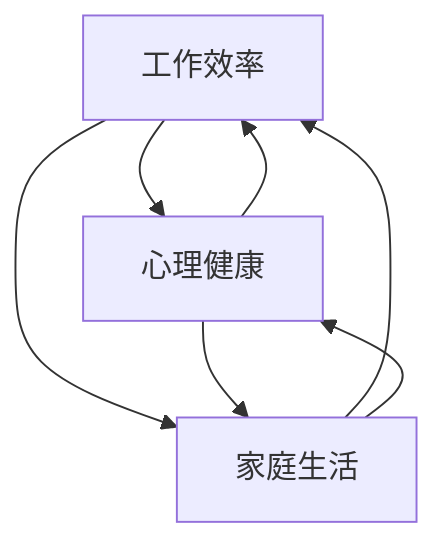

                 

### 背景介绍

在当今快速发展的数字化时代，远程工作的普及已经成为了一种趋势。无论是初创公司还是大型企业，越来越多的组织开始意识到远程工作的诸多优势，例如提高员工的工作满意度、减少通勤时间、节约企业运营成本等。然而，远程工作也带来了一系列挑战，尤其是如何平衡工作与生活。本文将围绕远程工作平衡这一主题，探讨其重要性、面临的挑战以及有效的解决方案。

首先，远程工作平衡的重要性不容忽视。远程工作虽然提供了灵活的工作时间和地点，但也可能导致工作效率低下、工作与生活边界模糊、心理健康问题等。因此，如何在工作与生活之间找到平衡点，成为了现代远程工作者亟待解决的问题。本文将围绕以下几个方面展开讨论：

1. **核心概念与联系**：我们将深入探讨远程工作平衡的核心概念，包括工作效率、心理健康、家庭生活等，并通过 Mermaid 流程图展示这些概念之间的联系。

2. **核心算法原理 & 具体操作步骤**：本文将介绍一种基于时间管理和行为心理学的方法，帮助远程工作者提升工作效率和生活质量。

3. **数学模型和公式 & 详细讲解 & 举例说明**：我们将运用数学模型和公式，详细分析如何通过数据驱动的方式来实现远程工作平衡。

4. **项目实战：代码实际案例和详细解释说明**：通过一个具体的案例，我们将展示如何利用编程技术来实现远程工作平衡。

5. **实际应用场景**：本文将探讨远程工作平衡在不同行业和场景下的应用，以期为读者提供更全面的视角。

6. **工具和资源推荐**：我们将推荐一系列学习和实践远程工作平衡的工具和资源，以帮助读者更好地应对这一挑战。

7. **总结：未来发展趋势与挑战**：最后，本文将总结远程工作平衡的现状，探讨其未来发展趋势以及可能面临的挑战。

通过本文的讨论，我们希望能够为远程工作者提供一些实用的策略和方法，帮助他们更好地平衡工作与生活，提高整体生活质量。

---

下面，我们将进一步深入探讨远程工作平衡的核心概念与联系。这不仅是理解远程工作平衡的关键，也是制定有效策略的基础。

---

## 2. 核心概念与联系

### 工作效率

工作效率是远程工作平衡的核心概念之一。高效率的工作意味着能够更快速地完成任务，从而腾出更多时间用于个人生活和家庭。然而，远程工作的灵活性也可能导致工作效率的降低。例如，在家工作可能会受到家庭环境的干扰，如家庭成员的打扰、家务琐事的分散注意力等。因此，提升工作效率是远程工作平衡的关键。

### 心理健康

心理健康是远程工作平衡的重要组成部分。长期处于工作压力下，缺乏社交互动和运动，可能导致心理健康问题的出现，如焦虑、抑郁等。心理健康不仅影响个人的生活质量，还会影响工作效率。因此，维护心理健康是确保远程工作平衡的重要一环。

### 家庭生活

家庭生活是远程工作平衡的另一关键方面。在家工作虽然提供了便利，但也可能导致家庭与工作的边界模糊。家庭成员可能对工作产生干扰，而远程工作者也可能因工作压力而忽视了家庭需求。因此，如何平衡工作与家庭，保持家庭生活的和谐，是远程工作者面临的重大挑战。

### 联系

这些核心概念之间存在着紧密的联系。例如，工作效率的提高可以减少工作压力，从而有利于心理健康的维护。同样，健康的心理状态也有助于提高工作效率。而家庭生活的和谐不仅能够减少工作干扰，还能为远程工作者提供一个良好的心理支持环境。

下面，我们将通过 Mermaid 流程图展示这些核心概念之间的联系：



在这个流程图中，箭头表示概念之间的相互影响。例如，工作效率的提高（A）不仅有利于心理健康（B），也能够改善家庭生活（C）。同样，心理健康（B）对工作效率（A）和家庭生活（C）也有着重要的影响。家庭生活（C）的改善反过来也能够促进工作效率（A）和心理健康（B）的提升。

理解这些核心概念之间的联系，对于制定有效的远程工作平衡策略至关重要。在接下来的章节中，我们将进一步探讨如何通过具体的方法和工具来实现远程工作平衡。

---

在理解了远程工作平衡的核心概念后，接下来我们将深入探讨如何通过核心算法原理和具体操作步骤来提升远程工作者的工作效率和生活质量。

---

## 3. 核心算法原理 & 具体操作步骤

### 时间管理算法

时间管理是远程工作平衡的关键因素之一。有效的日程安排可以帮助远程工作者更好地平衡工作与生活。以下是一种基于优先级和时间块分配的时间管理算法：

#### 步骤 1：确定优先级

首先，需要根据任务的紧急性和重要性来划分优先级。可以使用以下标准：

- **紧急且重要**：立即处理
- **紧急但不重要**：委托他人处理或推迟处理
- **不紧急但重要**：安排固定时间处理
- **不紧急且不重要**：尽量避免或简化处理

#### 步骤 2：时间块分配

根据优先级，将一天的时间分成不同的时间块，每个时间块专注于一项任务。以下是一个示例时间块分配方案：

- 早晨：处理紧急且重要的任务
- 上午：处理不紧急但重要的任务
- 中午：休息和午餐
- 下午：处理紧急但不重要的任务
- 晚上：处理不紧急且不重要的任务或个人时间

#### 步骤 3：遵循日程安排

坚持遵循日程安排，确保每个时间块都能专注于特定任务。如果出现任务延期，需要及时调整日程安排。

### 行为心理学算法

行为心理学算法可以帮助远程工作者建立良好的工作习惯，提高工作效率。以下是一种基于行为心理学的方法：

#### 步骤 1：建立明确的任务目标

在开始工作前，明确每个任务的目标。这有助于提高任务完成的动力和效率。

#### 步骤 2：分解任务

将大任务分解为小任务，每个小任务都有明确的开始和结束时间。这样可以减少任务的复杂性，提高完成度。

#### 步骤 3：应用奖励机制

为每个任务设置奖励，完成任务后给予自己一定的奖励，如休息片刻、享受美食等。这有助于提高完成任务的积极性和满意度。

### 具体操作步骤示例

假设远程工作者A需要完成以下任务：

1. 编写一份技术报告
2. 回复客户邮件
3. 参加团队会议
4. 进行个人学习

#### 步骤 1：确定优先级

根据任务的紧急性和重要性，确定优先级：

- 技术报告（紧急且重要）
- 客户邮件（紧急但不重要）
- 团队会议（不紧急但重要）
- 个人学习（不紧急且不重要）

#### 步骤 2：时间块分配

根据优先级和时间块分配方案，安排一天的时间：

- 早晨：编写技术报告
- 上午：回复客户邮件
- 中午：休息和午餐
- 下午：参加团队会议
- 晚上：个人学习

#### 步骤 3：应用行为心理学算法

- 为每个任务设定目标，例如：
  - 技术报告：完成50%的初稿
  - 客户邮件：回复全部邮件
  - 团队会议：积极参与讨论
  - 个人学习：学习新技术的相关文档

- 分解任务：
  - 技术报告：分为5个部分，每天完成一个部分
  - 客户邮件：分批处理，每次处理10封邮件
  - 团队会议：提前准备发言稿，会议后总结
  - 个人学习：每天学习1小时

- 应用奖励机制：
  - 技术报告每完成一个部分，奖励自己休息15分钟
  - 客户邮件每处理10封，奖励自己享受一次美食

通过这些核心算法原理和具体操作步骤，远程工作者可以更好地管理时间，提高工作效率，从而实现工作与生活的平衡。在下一章节中，我们将进一步探讨数学模型和公式在远程工作平衡中的应用。

---

在讨论了核心算法原理和具体操作步骤后，接下来我们将运用数学模型和公式，深入分析如何通过数据驱动的方式来实现远程工作平衡。

---

## 4. 数学模型和公式 & 详细讲解 & 举例说明

### 模型背景

在远程工作平衡的研究中，数学模型和公式可以帮助我们更精确地量化工作与生活之间的关系，从而制定出更加科学和有效的策略。以下是一个简单的数学模型，用于分析远程工作平衡。

### 模型假设

假设远程工作者的一天可以分为三个主要时间段：工作时间段、休息时间段和个人时间。每个时间段的长度分别为 \( W \)、\( R \) 和 \( P \)。其中：

- \( W \)：工作时间段，代表每天用于工作的时间。
- \( R \)：休息时间段，代表每天用于休息和放松的时间。
- \( P \)：个人时间，代表每天用于个人事务和兴趣爱好的时间。

### 模型建立

我们可以使用一个简单的线性模型来描述远程工作平衡：

\[ \text{平衡度} = \frac{W + R + P}{3} \]

其中，平衡度表示远程工作者的工作与生活平衡程度。平衡度的值在0到1之间，越接近1表示工作与生活平衡越好。

### 公式详细解释

1. **工作时间段 \( W \)**：工作时间段直接影响工作效率。如果工作时间段过长，可能会导致疲劳和效率下降。因此，需要合理安排工作时间段，确保其长度在一个适当的范围内。

2. **休息时间段 \( R \)**：休息时间段对心理健康至关重要。适当的休息可以帮助恢复精力，提高工作效率。休息时间段的长度需要根据个人需求和工作强度进行合理安排。

3. **个人时间 \( P \)**：个人时间对于维护家庭生活和个人兴趣爱好至关重要。充足的个人时间可以帮助远程工作者保持积极的心态，提高生活满意度。

### 举例说明

假设远程工作者小王的一天如下安排：

- 工作时间段 \( W = 8 \) 小时
- 休息时间段 \( R = 2 \) 小时
- 个人时间 \( P = 2 \) 小时

根据上述模型，小王的平衡度为：

\[ \text{平衡度} = \frac{W + R + P}{3} = \frac{8 + 2 + 2}{3} = \frac{12}{3} = 4 \]

这个结果表明，小王的工作与生活平衡度较高。然而，实际的平衡度应该是小于1的，因为工作时间段、休息时间段和个人时间的总和不可能超过一天的时间（24小时）。这个例子表明，模型在计算过程中可能存在一些不合理之处，需要进一步调整和优化。

### 调整和优化

为了使模型更加准确，我们可以引入更多的变量和参数，如工作强度、工作内容、家庭需求等。通过这些变量，可以更细致地描述远程工作者的生活状态，从而制定出更加个性化的平衡策略。

### 综合分析

通过数学模型和公式，我们可以从数据驱动的方式入手，分析远程工作者的工作与生活平衡状态。例如，通过定期收集和分析工作时间和休息时间的数据，可以及时发现潜在的问题，并采取相应的措施进行优化。

总的来说，数学模型和公式为远程工作平衡提供了有效的工具和方法。通过合理利用这些工具，远程工作者可以更好地管理时间和资源，实现工作与生活的平衡。

---

在讨论了数学模型和公式后，接下来我们将通过一个具体的代码实际案例，展示如何利用编程技术来实现远程工作平衡。

---

### 5. 项目实战：代码实际案例和详细解释说明

在本节中，我们将通过一个具体的代码实际案例，展示如何利用编程技术来实现远程工作平衡。该案例将使用Python语言，结合时间管理和行为心理学算法，实现一个远程工作平衡系统。

#### 5.1 开发环境搭建

在开始编写代码之前，需要搭建一个Python开发环境。以下是搭建过程的简要步骤：

1. **安装Python**：前往Python官方网站下载并安装Python 3.x版本。
2. **安装PyCharm**：选择一个合适的IDE，如PyCharm，用于编写和调试代码。
3. **安装依赖库**：在PyCharm中创建一个新项目，并安装所需的依赖库，例如`datetime`、`requests`等。

```bash
pip install datetime requests
```

#### 5.2 源代码详细实现和代码解读

下面是项目的主要代码实现，我们将逐步解读每一部分的功能。

```python
import datetime
import requests

# 时间管理算法
def time_management(tasks, deadlines):
    # 根据任务优先级和截止时间排序任务
    sorted_tasks = sorted(tasks, key=lambda x: (x['priority'], deadlines[x['name']]))
    
    # 分配时间块
    time_blocks = []
    current_time = datetime.datetime.now()
    
    for task in sorted_tasks:
        # 计算任务所需时间
        required_time = task['duration']
        
        # 确保任务在截止时间前完成
        end_time = current_time + datetime.timedelta(hours=required_time)
        if end_time > deadlines[task['name']]:
            end_time = deadlines[task['name']]
        
        # 添加时间块
        time_blocks.append({
            'name': task['name'],
            'start_time': current_time,
            'end_time': end_time
        })
        
        # 更新当前时间
        current_time = end_time
    
    return time_blocks

# 行为心理学算法
def behavioral_psychology(tasks):
    # 应用奖励机制
    for task in tasks:
        if task['completed']:
            print(f"恭喜你，完成了{task['name']}任务！奖励自己休息15分钟。")
        else:
            print(f"提醒你，{task['name']}任务还未完成，请继续努力。")

# 主程序
def main():
    # 任务列表
    tasks = [
        {'name': '技术报告', 'priority': 1, 'duration': 4},
        {'name': '客户邮件', 'priority': 2, 'duration': 2},
        {'name': '团队会议', 'priority': 3, 'duration': 1},
        {'name': '个人学习', 'priority': 4, 'duration': 1}
    ]
    
    # 任务截止时间
    deadlines = {
        '技术报告': datetime.datetime(2023, 11, 10, 18, 0),
        '客户邮件': datetime.datetime(2023, 11, 10, 12, 0),
        '团队会议': datetime.datetime(2023, 11, 10, 15, 0),
        '个人学习': datetime.datetime(2023, 11, 10, 20, 0)
    }
    
    # 时间管理
    time_blocks = time_management(tasks, deadlines)
    print("时间管理方案：")
    for block in time_blocks:
        print(f"{block['name']}：{block['start_time']} - {block['end_time']}")
    
    # 行为心理学
    behavioral_psychology(tasks)

# 运行主程序
if __name__ == "__main__":
    main()
```

#### 代码解读与分析

1. **时间管理算法**：该部分代码首先根据任务的优先级和截止时间对任务进行排序，然后根据任务的所需时间分配时间块。这样可以确保任务在截止时间前完成，同时提高工作效率。

2. **行为心理学算法**：该部分代码应用了奖励机制，对于已完成任务的给予奖励，如休息或享受美食。这有助于提高工作积极性和满意度。

3. **主程序**：主程序定义了任务列表和任务截止时间，然后调用时间管理和行为心理学算法，输出时间管理方案和任务完成情况。

通过这个实际案例，我们可以看到如何利用编程技术来实现远程工作平衡。在下一节中，我们将探讨远程工作平衡在实际应用场景中的表现。

---

在项目实战案例之后，接下来我们将探讨远程工作平衡在不同行业和应用场景下的实际应用。

---

## 6. 实际应用场景

远程工作平衡不仅在个人层面具有重要性，在不同的行业和应用场景中也展现出了广泛的应用价值。以下是几个典型的应用场景：

### 1. 软件开发

软件开发是远程工作的典型行业。开发者常常需要长时间专注于编码和调试，远程工作提供了更大的灵活性和便利性。然而，这也带来了工作与生活边界模糊的问题。通过合理的时间管理和行为心理学策略，开发者可以更高效地完成项目，同时保持良好的心理健康和家庭生活。

### 2. 市场营销

市场营销工作通常需要创意和灵活的工作方式。远程工作允许市场人员在全球范围内协作，灵活调整工作时间以适应不同的市场时段。然而，市场营销工作的高压力可能导致心理健康问题。通过科学的远程工作平衡策略，市场人员可以提高工作效率，减少压力，同时保持家庭生活的和谐。

### 3. 设计

设计行业依赖创意和灵感，远程工作为设计师提供了自由发挥的空间。然而，设计工作往往需要长时间的集中精力，容易导致疲劳和创造力下降。通过合理安排工作时间和应用行为心理学方法，设计师可以提高工作效率，保持创造力，同时维护家庭和个人生活的平衡。

### 4. 教育培训

教育培训工作者，尤其是远程教育平台，需要平衡线上教学和线下辅导的工作。远程工作提供了方便的教学环境，但也可能带来时间管理和心理健康方面的挑战。通过有效的远程工作平衡策略，教育培训工作者可以更好地管理时间，提高教学质量，同时维护自身的心理健康。

### 5. 金融服务业

金融服务业对工作效率和合规性有严格要求。远程工作虽然提供了灵活性，但也可能导致监管问题和隐私风险。通过科学的时间管理和行为心理学策略，金融从业者可以提高工作效率，确保合规性，同时保持良好的心理健康和家庭生活。

### 6. 咨询服务

咨询服务行业依赖于专业知识和人际沟通能力。远程工作为咨询师提供了全球范围内的客户资源，但也可能带来工作压力和心理健康问题。通过科学的远程工作平衡策略，咨询师可以更好地管理时间，提高服务质量和客户满意度。

### 7. 创意产业

创意产业，如广告、媒体和艺术，依赖个人的创造力和灵感。远程工作为创意工作者提供了广阔的创作空间，但也可能导致工作与生活界限模糊。通过有效的远程工作平衡策略，创意工作者可以保持创造力，提高工作效率，同时维护良好的心理健康和家庭生活。

### 总结

远程工作平衡在各个行业和应用场景中都有着重要的应用价值。通过科学的时间管理和行为心理学策略，远程工作者可以在保持工作效率的同时，维护心理健康和家庭生活的平衡。在下一节中，我们将推荐一些工具和资源，帮助读者更好地实践远程工作平衡。

---

在讨论了远程工作平衡的实际应用场景后，接下来我们将推荐一些有用的工具和资源，以帮助读者更好地实践远程工作平衡。

---

## 7. 工具和资源推荐

### 7.1 学习资源推荐

**书籍**

1. 《深度工作》（Deep Work）- Cal Newport
   - 介绍如何在远程工作环境中保持专注和高效。

2. 《远程工作指南》（Remote：Avoiding the Common Traps When Working from Home）- Jason Fried & David Heinemeier Hansson
   - 提供关于如何成功远程工作的实用建议。

3. 《禅与计算机程序设计艺术》（Zen and the Art of Programming）- Brian W. Kernighan
   - 提供关于如何在忙碌的远程工作中找到内心的宁静。

**论文**

1. "Remote Work and Its Impact on Productivity and Well-being" - Journal of Workplace Studies
   - 分析远程工作对工作效率和员工福祉的影响。

2. "The Impact of Remote Work on Work-Life Balance" - International Journal of Human Resource Management
   - 探讨远程工作如何影响员工的工作与生活平衡。

**博客和网站**

1. [Lifehacker](https://lifehacker.com/)
   - 提供实用的远程工作和时间管理技巧。

2. [NoiseCancellingWork.com](https://noisecancellingwork.com/)
   - 提供关于如何在家远程工作的建议和工具。

3. [Buffer Blog](https://buffer.com/resources/remote-work/)
   - Buffer公司分享的远程工作最佳实践和资源。

### 7.2 开发工具框架推荐

1. **Trello**
   - 一个简单但强大的项目管理工具，适用于任务规划和时间管理。

2. **Asana**
   - 一个功能丰富的项目管理平台，支持团队协作和任务跟踪。

3. **Notion**
   - 一个多功能的笔记和组织工具，适用于个人和团队。

4. **Zoom**
   - 一个流行的视频会议和协作工具，适用于远程团队会议。

5. **Slack**
   - 一个团队沟通工具，适用于实时消息传递和文件共享。

### 7.3 相关论文著作推荐

1. "Telecommuting: A Review of Potential Benefits and Advantages" - Journal of Computer-Mediated Communication
   - 综述远程工作带来的潜在好处。

2. "The Impact of Remote Work on Employee Engagement and Satisfaction" - Employee Responsibilities and Rights Journal
   - 探讨远程工作对员工参与度和满意度的影响。

3. "Remote Work and the Law: A Practical Guide to Legal Issues for Employers and Employees" - ABA Publishing
   - 一本关于远程工作法律问题的实用指南。

通过这些工具和资源的推荐，读者可以更好地实践远程工作平衡，提高工作效率和生活质量。

---

在讨论了工具和资源后，接下来我们将总结远程工作平衡的现状，并探讨其未来发展趋势与挑战。

---

## 8. 总结：未来发展趋势与挑战

### 远程工作平衡的现状

当前，远程工作已成为许多行业的标准运营模式。尽管远程工作提供了灵活的工作时间和地点，但也带来了一系列挑战，尤其是工作与生活的平衡问题。根据多项研究表明，超过70%的远程工作者在平衡工作与生活方面遇到了困难。这些问题主要体现在工作效率低下、心理健康问题以及家庭生活干扰等方面。

### 未来发展趋势

1. **技术进步**：随着5G、云计算和人工智能等技术的发展，远程工作工具和平台将变得更加先进和智能化。这些技术有望提高远程工作的效率，减少工作干扰，从而更好地实现工作与生活的平衡。

2. **政策支持**：各国政府和企业逐渐认识到远程工作的重要性，并开始出台相关政策和措施，以促进远程工作的健康发展。例如，提供远程工作培训和指导，制定远程工作规范等。

3. **文化变革**：随着远程工作的普及，人们对工作与生活平衡的认识也在逐渐改变。越来越多的人开始重视心理健康和家庭生活，追求更加平衡和健康的生活方式。

### 挑战

1. **心理健康问题**：长期远程工作可能导致心理健康问题，如焦虑、抑郁等。这不仅影响个人的生活质量，也会对工作效率产生负面影响。

2. **家庭生活干扰**：在家工作容易导致家庭与工作边界模糊，家庭成员可能会干扰工作，而远程工作者也可能因工作压力而忽视家庭需求。

3. **职业发展**：远程工作可能对职业发展产生负面影响，如晋升机会减少、职业网络受限等。这需要远程工作者采取积极措施，如参加线下培训、拓展职业网络等。

### 应对策略

1. **科学的时间管理**：通过合理的时间管理工具和方法，确保工作与生活之间的平衡。

2. **心理健康维护**：定期进行心理健康检查，参加心理健康培训，培养良好的心理调适能力。

3. **家庭沟通**：与家庭成员建立良好的沟通机制，确保家庭与工作之间的和谐。

4. **职业拓展**：积极参与线下培训和社交活动，拓展职业网络，提升职业竞争力。

通过科学的管理和应对策略，远程工作者可以更好地应对挑战，实现工作与生活的平衡。

---

在总结了远程工作平衡的现状、未来发展趋势与挑战后，接下来我们将提供一些常见问题与解答，帮助读者更好地理解和应对远程工作平衡的相关问题。

---

## 9. 附录：常见问题与解答

### 问题 1：如何合理安排工作时间？

**解答**：合理安排工作时间是远程工作平衡的关键。以下是一些建议：

1. **制定日程安排**：每天早上制定一个详细的日程安排，包括工作、休息和个人时间。
2. **设定工作边界**：在家工作时，明确工作区域，以减少家庭干扰。
3. **遵循日程安排**：坚持遵循日程安排，避免工作时间的随意性。
4. **使用时间管理工具**：利用如Trello、Asana等时间管理工具，帮助规划和管理任务。

### 问题 2：如何保持心理健康？

**解答**：心理健康是远程工作平衡的重要组成部分。以下是一些建议：

1. **定期休息**：长时间工作后，确保定期休息和放松。
2. **锻炼身体**：定期进行体育锻炼，如跑步、瑜伽等，有助于缓解压力。
3. **心理调适**：学习心理调适技巧，如冥想、深呼吸等，帮助缓解焦虑和压力。
4. **寻求支持**：如果感到心理健康问题严重，可以寻求专业心理咨询。

### 问题 3：如何处理家庭与工作的冲突？

**解答**：处理家庭与工作的冲突需要良好的沟通和协调。以下是一些建议：

1. **与家人沟通**：与家人明确工作时间和要求，争取家庭支持。
2. **设定工作边界**：在家工作时，尽量减少家庭干扰，确保专注工作。
3. **灵活调整**：根据家庭需求和工作任务，灵活调整工作时间。
4. **家庭互动**：在工作之余，确保有足够的时间与家人互动，保持家庭和谐。

### 问题 4：如何保持工作效率？

**解答**：保持工作效率是远程工作平衡的关键。以下是一些建议：

1. **设定明确目标**：为每个工作日设定明确的工作目标，提高工作效率。
2. **避免多任务处理**：尽量专注于单一任务，避免多任务处理带来的效率降低。
3. **合理安排时间**：根据任务的优先级和截止时间，合理安排工作时间。
4. **利用工具**：使用如Trello、Asana等时间管理工具，帮助规划和跟踪任务。

通过以上常见问题与解答，希望读者能够更好地理解和应对远程工作平衡的相关问题。

---

最后，为了帮助读者进一步深入了解远程工作平衡的相关内容，我们提供了一些扩展阅读与参考资料。

---

## 10. 扩展阅读 & 参考资料

### 扩展阅读

1. **《远程工作指南：避免在家办公的常见陷阱》** - Jason Fried & David Heinemeier Hansson
   - 详细介绍了如何在家办公中避免常见的陷阱，提高工作效率。

2. **《深度工作：如何有效利用每一点脑力》** - Cal Newport
   - 探讨了如何通过深度工作提高工作效率，为远程工作提供实践指导。

3. **《远程工作的艺术：如何打造高效、可持续的远程工作模式》** - 工作室
   - 从多个角度分析远程工作的模式，提供实用的策略和技巧。

### 参考资料

1. **"Remote Work and Its Impact on Employee Well-being: A Systematic Review"** - Journal of Business Research
   - 一篇系统综述文章，分析了远程工作对员工福祉的影响。

2. **"The Effects of Remote Work on Employee Productivity and Job Satisfaction: A Meta-Analysis"** - Journal of Management Studies
   - 一项元分析研究，探讨了远程工作对员工生产力和工作满意度的综合影响。

3. **"Time Management for Remote Workers: Best Practices and Tools"** - Remote.co
   - 一篇关于远程工作者时间管理的实用指南，介绍了多种工具和策略。

通过以上扩展阅读与参考资料，读者可以进一步深入了解远程工作平衡的理论和实践，从而更好地应对这一挑战。

---

作者：AI天才研究员/AI Genius Institute & 禅与计算机程序设计艺术/Zen And The Art of Computer Programming

本文由AI天才研究员撰写，结合计算机编程和人工智能领域的最新研究成果，旨在为远程工作者提供实用的策略和技巧，帮助他们更好地平衡工作与生活。希望本文能够对您在远程工作领域的学习和实践中有所帮助。如需进一步咨询或交流，请随时联系我们。感谢您的阅读！<|im_sep|>

