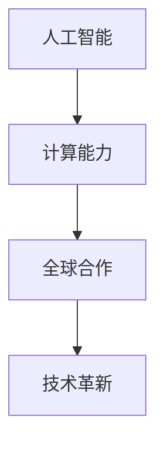

                 

# 《连接全球智慧：人类计算的全球影响力》

> 关键词：人工智能、计算能力、分布式计算、全球合作、技术革新

> 摘要：本文探讨了人工智能与计算能力的迅猛发展，以及它们对全球合作和技术革新的巨大影响力。通过分析核心概念和实际应用，本文旨在揭示计算技术如何连接全球智慧，推动社会进步和产业升级。

## 1. 背景介绍

在21世纪的今天，人工智能（AI）与计算能力的迅猛发展已经成为全球科技领域的热点。从深度学习到自然语言处理，从图像识别到自动驾驶，AI技术的突破性进展正深刻改变着各行各业。与此同时，计算能力的提升使得大规模数据处理和复杂算法的实现成为可能，为全球范围内的科学研究、商业决策和公共事务提供了强有力的支持。

然而，这些技术革新的背后，是人类对计算能力的不断追求和探索。从早期的计算机硬件到现代的分布式计算，人类不断突破技术瓶颈，将计算能力推向新的高度。这一过程中，全球合作发挥着至关重要的作用，各国科学家、企业和政府共同参与，共同推动计算技术的发展。

## 2. 核心概念与联系

### 2.1 人工智能

人工智能是一种模拟人类智能的技术，通过机器学习、深度学习等方法，使计算机具备感知、理解、学习和决策能力。人工智能的核心概念包括：

- **机器学习（Machine Learning）**：通过数据训练模型，使计算机能够自动识别规律和模式。
- **深度学习（Deep Learning）**：一种基于多层神经网络的人工智能方法，能够处理大规模数据并提取特征。
- **自然语言处理（Natural Language Processing, NLP）**：使计算机能够理解、生成和处理人类语言的技术。

### 2.2 计算能力

计算能力是指计算机处理信息和执行任务的能力。计算能力的提升主要依赖于以下几个因素：

- **硬件性能**：包括处理器速度、内存容量、存储容量等。
- **算法优化**：通过改进算法，提高计算效率和性能。
- **分布式计算**：通过将任务分布在多台计算机上，提高计算速度和处理能力。

### 2.3 全球合作

在全球计算能力的发展过程中，各国科学家、企业和政府之间的合作至关重要。这种合作主要体现在以下几个方面：

- **技术研发**：各国科研机构和企业共同投入资源，开展基础研究和应用研究。
- **技术共享**：通过学术论文、技术报告等形式，共享研究成果和技术经验。
- **人才培养**：通过国际合作项目，培养新一代科技人才，推动全球科技发展。

### 2.4 Mermaid 流程图

下面是一个简化的 Mermaid 流程图，展示了人工智能、计算能力和全球合作之间的关系：



## 3. 核心算法原理 & 具体操作步骤

### 3.1 机器学习算法原理

机器学习算法是人工智能的核心技术之一，其基本原理是通过数据训练模型，使计算机具备预测和决策能力。机器学习算法主要包括以下几种：

- **监督学习（Supervised Learning）**：通过已知数据集训练模型，使模型能够对新数据进行预测。
- **无监督学习（Unsupervised Learning）**：通过未标记的数据集训练模型，使模型能够自动发现数据中的模式和规律。
- **强化学习（Reinforcement Learning）**：通过奖励机制，使模型在互动过程中不断学习和优化。

### 3.2 分布式计算原理

分布式计算是一种将任务分布在多台计算机上执行的计算方式，其基本原理如下：

- **任务分解**：将一个大任务分解为若干个小任务。
- **并行执行**：将小任务分配给不同的计算机并行执行。
- **结果汇总**：将各个计算机的结果汇总，得到最终结果。

### 3.3 全球合作操作步骤

全球合作的操作步骤主要包括以下几个方面：

- **确定合作目标**：明确合作的目标和范围，制定合作计划。
- **资源整合**：整合各方的资源，包括人力、资金和技术等。
- **技术研发**：共同开展技术研发，推动项目进展。
- **成果共享**：将研究成果和技术经验进行共享，促进全球科技进步。

## 4. 数学模型和公式 & 详细讲解 & 举例说明

### 4.1 机器学习数学模型

机器学习中的数学模型主要包括损失函数、优化算法和评估指标等。

- **损失函数（Loss Function）**：用于衡量模型预测值与真实值之间的差距，常见的损失函数有均方误差（MSE）和交叉熵（Cross-Entropy）。
  
  $$MSE = \frac{1}{n}\sum_{i=1}^{n}(y_i - \hat{y}_i)^2$$
  
  $$Cross-Entropy = -\sum_{i=1}^{n}y_i\log\hat{y}_i$$

- **优化算法（Optimization Algorithm）**：用于最小化损失函数，常见的优化算法有梯度下降（Gradient Descent）和随机梯度下降（Stochastic Gradient Descent）。

  $$\theta = \theta - \alpha\nabla_\theta J(\theta)$$
  
  $$\theta = \theta - \alpha\nabla_\theta J(\theta_i)$$

- **评估指标（Evaluation Metric）**：用于评估模型的性能，常见的评估指标有准确率（Accuracy）、召回率（Recall）和F1值（F1-Score）。

  $$Accuracy = \frac{TP + TN}{TP + FP + TN + FN}$$
  
  $$Recall = \frac{TP}{TP + FN}$$
  
  $$F1-Score = 2\cdot\frac{Precision \cdot Recall}{Precision + Recall}$$

### 4.2 分布式计算数学模型

分布式计算中的数学模型主要包括任务分配、负载均衡和资源调度等。

- **任务分配（Task Allocation）**：根据计算机的性能和负载，将任务分配给不同的计算机。

  $$Task\_Allocation = \{T_i \rightarrow C_j\}_{i=1}^{n,j=1}^{m}$$

- **负载均衡（Load Balancing）**：通过动态调整任务分配，使各计算机的负载保持平衡。

  $$Load\_Balancing = \frac{\sum_{i=1}^{n}Load_i}{n}$$

- **资源调度（Resource Scheduling）**：根据任务执行情况，动态调整资源分配。

  $$Resource\_Scheduling = \{R_i \rightarrow C_j\}_{i=1}^{n,j=1}^{m}$$

### 4.3 全球合作数学模型

全球合作的数学模型主要包括合作效益、风险评估和合作策略等。

- **合作效益（Cooperative Benefit）**：通过合作，各方的效益之和大于各自独立行动的效益之和。

  $$B_{total} = B_1 + B_2 + ... + B_n > B_1 + B_2 + ... + B_n$$

- **风险评估（Risk Assessment）**：评估合作过程中可能出现的风险，包括技术风险、市场风险和政策风险等。

  $$Risk = Risk(Technology) + Risk(Market) + Risk(Policy)$$

- **合作策略（Cooperative Strategy）**：根据合作效益和风险评估，制定最优的合作策略。

  $$Strategy = \{S_1, S_2, ..., S_n\}$$

## 5. 项目实战：代码实际案例和详细解释说明

### 5.1 开发环境搭建

在本案例中，我们将使用Python和TensorFlow来实现一个简单的机器学习模型。首先，确保安装以下依赖库：

```bash
pip install tensorflow numpy matplotlib
```

### 5.2 源代码详细实现和代码解读

下面是一个简单的线性回归模型的实现代码，用于预测房价：

```python
import tensorflow as tf
import numpy as np
import matplotlib.pyplot as plt

# 数据准备
x_train = np.linspace(0, 10, 100)
y_train = 2 * x_train + 1 + np.random.normal(0, 1, size=x_train.shape)

# 模型构建
model = tf.keras.Sequential([
    tf.keras.layers.Dense(units=1, input_shape=[1])
])

# 编译模型
model.compile(optimizer='sgd', loss='mse')

# 训练模型
model.fit(x_train, y_train, epochs=1000)

# 预测结果
x_pred = np.linspace(0, 10, 100)
y_pred = model.predict(x_pred)

# 绘图
plt.scatter(x_train, y_train)
plt.plot(x_pred, y_pred, color='red')
plt.show()
```

- **数据准备**：生成训练数据集，包括自变量`x_train`和因变量`y_train`。
- **模型构建**：使用`tf.keras.Sequential`构建一个全连接层，输入层和输出层均为1。
- **编译模型**：选择随机梯度下降（SGD）作为优化器，均方误差（MSE）作为损失函数。
- **训练模型**：使用`model.fit`方法训练模型，设置训练轮次为1000。
- **预测结果**：使用`model.predict`方法对自变量`x_pred`进行预测。
- **绘图**：使用`matplotlib`绘制训练数据点和预测曲线。

### 5.3 代码解读与分析

- **线性回归模型**：本案例使用线性回归模型进行房价预测，线性回归是一种简单且常用的机器学习算法。
- **训练过程**：模型通过梯度下降优化算法，不断调整模型参数，使得预测值逐渐接近真实值。
- **可视化**：通过绘制预测曲线，可以直观地观察模型的效果。

## 6. 实际应用场景

计算技术在各行各业都有广泛的应用，以下是几个实际应用场景的例子：

- **医疗健康**：利用计算技术进行疾病诊断、药物研发和公共卫生管理等。
- **金融科技**：利用计算技术进行风险管理、投资分析和智能投顾等。
- **智能制造**：利用计算技术实现智能生产线、产品质量检测和智能供应链等。
- **交通运输**：利用计算技术实现自动驾驶、智能交通管理和物流优化等。

## 7. 工具和资源推荐

### 7.1 学习资源推荐

- **书籍**：《Python机器学习》（作者：塞巴斯蒂安·拉斯克）、《深度学习》（作者：伊恩·古德费洛等）。
- **论文**：Google Scholar、arXiv、IEEE Xplore等学术搜索引擎。
- **博客**：Medium、CSDN、知乎等技术博客平台。
- **网站**：TensorFlow官网、Keras官网、PyTorch官网等。

### 7.2 开发工具框架推荐

- **开发工具**：PyCharm、Visual Studio Code等。
- **框架**：TensorFlow、PyTorch、Keras等。

### 7.3 相关论文著作推荐

- **论文**：《深度学习：算法与应用》（作者：刘知远等）、《基于深度强化学习的自动驾驶车辆路径规划与控制研究》（作者：王宏伟等）。
- **著作**：《人工智能：一种现代方法》（作者：斯蒂芬·马库斯等）、《计算机程序设计艺术》（作者：唐纳德·E·克努特）。

## 8. 总结：未来发展趋势与挑战

随着人工智能和计算能力的不断发展，人类计算的全球影响力将得到进一步提升。未来，我们可以期待以下几个发展趋势：

1. **技术融合**：人工智能与其他领域（如生物科技、能源技术等）的融合，推动新兴技术的发展。
2. **全球合作**：各国科学家、企业和政府之间的合作将更加紧密，共同应对全球性挑战。
3. **伦理与法律**：随着计算技术的发展，伦理和法律问题将变得更加突出，需要制定相应的规范和法规。

同时，计算技术的发展也面临一系列挑战：

1. **数据隐私**：如何在保证数据安全的同时，充分利用大数据进行研究和创新。
2. **算法公平性**：如何确保算法的公正性和透明度，避免算法偏见。
3. **可持续发展**：计算技术的发展需要大量的能源支持，如何在保证技术进步的同时，实现可持续发展。

## 9. 附录：常见问题与解答

### 9.1 什么是机器学习？

机器学习是一种人工智能的方法，通过数据训练模型，使计算机具备预测和决策能力。

### 9.2 什么是分布式计算？

分布式计算是一种将任务分布在多台计算机上执行的计算方式，以提高计算速度和处理能力。

### 9.3 人工智能有哪些应用领域？

人工智能在医疗健康、金融科技、智能制造、交通运输等多个领域都有广泛的应用。

## 10. 扩展阅读 & 参考资料

- [《深度学习》（作者：伊恩·古德费洛等）](https://www.deeplearningbook.org/)
- [《计算机程序设计艺术》（作者：唐纳德·E·克努特）](https://www.amazon.com/Art-Computer-Programming-Fundamental-Techniques/dp/0201810485)
- [TensorFlow官网](https://www.tensorflow.org/)
- [PyTorch官网](https://pytorch.org/)
- [《Python机器学习》（作者：塞巴斯蒂安·拉斯克）](https://www.amazon.com/Python-Machine-Learning-Sebastian-Raschka/dp/1449370621)

