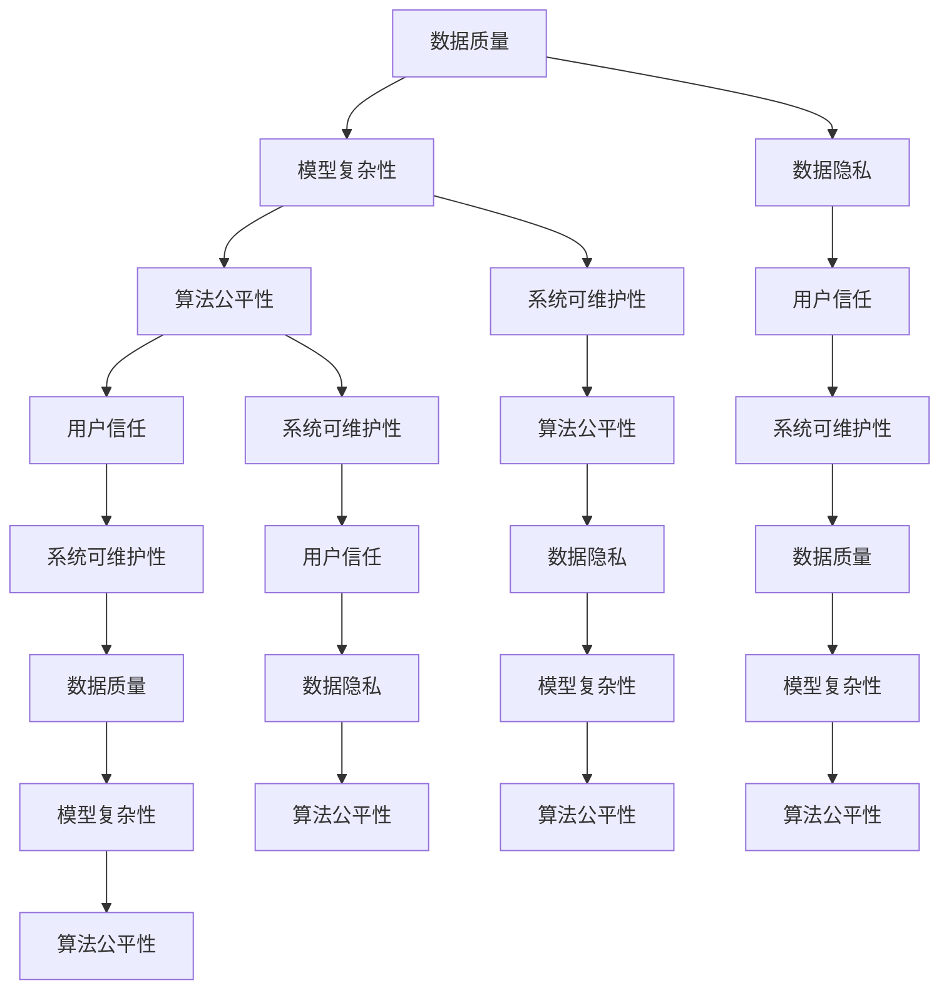

                 

### 背景介绍

#### 人工智能的崛起

自20世纪中叶人工智能（AI）概念被首次提出以来，人工智能技术已经取得了飞速的发展。从早期的专家系统和规则驱动的方法，到如今深度学习、强化学习等先进技术的广泛应用，AI已经在医疗、金融、交通、教育等多个领域展现出其巨大的潜力和价值。然而，随着AI技术的不断进步，其透明度和可解释性问题也逐渐成为学术界和工业界关注的焦点。

#### 透明度与可解释性的重要性

AI的透明度与可解释性是指算法和模型在决策过程中是否能够清晰地展示其内部机制，使得用户能够理解和信任其输出结果。在传统的编程和软件开发中，代码的可读性和可解释性一直是工程师们追求的目标。然而，随着机器学习算法和深度神经网络等复杂模型的广泛应用，AI系统的黑箱特性使得其透明度和可解释性成为一个亟待解决的问题。

提高AI的透明度和可解释性具有重要意义。首先，透明度和可解释性有助于增强用户对AI系统的信任。在医疗、金融等敏感领域，用户需要对AI系统的决策过程有充分的了解和信任，否则可能会产生抵触情绪，影响AI系统的实际应用效果。其次，透明度和可解释性有助于发现和纠正算法中的错误。通过对AI系统的内部机制进行剖析，研究者可以发现和纠正算法中的潜在缺陷，提高系统的可靠性和稳定性。最后，透明度和可解释性有助于推动AI技术的可持续发展。只有当AI系统的内部机制被广泛理解和接受，才能更好地激发创新潜力，推动AI技术的不断进步。

#### 当前挑战与解决方案

尽管透明度和可解释性问题日益受到关注，但目前的解决方案仍然面临诸多挑战。一方面，深度学习等复杂模型本身的黑箱特性使得其内部机制难以解析。另一方面，现有的研究方法和技术手段在处理大规模数据和高维特征时效率较低。此外，如何平衡模型性能和可解释性也是一个亟待解决的问题。

为了解决这些问题，研究者们提出了多种解决方案。其中包括模型可解释性方法，如LIME（Local Interpretable Model-agnostic Explanations）和SHAP（SHapley Additive exPlanations）等；可视化技术，如热力图和决策图等；以及元学习等新型技术。这些方法和技术在一定程度上提高了AI系统的透明度和可解释性，但仍然存在一定的局限性。

在接下来的章节中，我们将详细探讨透明度和可解释性的核心概念、相关算法原理、数学模型以及实际应用场景，并介绍相关工具和资源，帮助读者深入了解这一重要领域。

#### 透明度的定义与度量

透明度（Transparency）在人工智能领域具有特定的含义。它指的是AI系统在执行任务时，其决策过程和内部机制对用户和开发者是否可理解、可观测和可验证。透明度可以分为不同层次，从简单的输出结果的可解释性，到算法细节的全面公开，不同的透明度级别满足了不同应用场景的需求。

一个直观的例子是，当使用一个图像识别系统时，如果系统能够明确地指出图像中的关键特征和其对应的决策依据，那么这个系统的透明度就较高。相反，如果系统只是简单地输出一个分类结果，而不提供任何解释，那么它的透明度就较低。

衡量透明度的标准主要包括以下几种：

1. **可理解性**：系统的决策过程和内部机制是否容易被用户理解。
2. **可观测性**：系统的运行状态和中间结果是否可以被外部观测和记录。
3. **可验证性**：系统的输出结果是否可以被第三方验证和评估。

在实际应用中，透明度的度量需要考虑多个方面。例如，一个医疗诊断系统的透明度不仅需要用户理解其诊断结果，还需要医生能够查看和分析系统的决策过程，以确保诊断结果的准确性和可靠性。因此，透明度的度量通常是一个综合性的评估过程，涉及多个指标和维度的考量。

#### 可解释性的定义与度量

可解释性（Explainability）是透明度的一个重要组成部分，它关注的是AI系统决策过程的解释性和逻辑性。可解释性旨在使得AI系统对于人类用户而言是可理解的，即用户能够明白系统为什么做出某个决策，以及这个决策是如何产生的。

可解释性可以分为以下几个层次：

1. **局部可解释性**：关注于特定输入数据下，模型是如何进行决策的。例如，LIME（Local Interpretable Model-agnostic Explanations）就是一种局部可解释性方法，它能够为任意一个模型生成局部解释。
2. **全局可解释性**：关注于模型整体的行为和决策逻辑。例如，决策树和规则基模型通常具有较好的全局可解释性，因为用户可以直接看到模型的决策规则。
3. **半可解释性**：介于局部和全局可解释性之间，旨在提供一定的解释，但不涉及所有的细节。

衡量可解释性的标准主要包括：

1. **直观性**：解释是否直观、易于理解。
2. **准确性**：解释是否准确地反映了模型的真实决策依据。
3. **完备性**：解释是否覆盖了所有重要的决策因素。

在实际应用中，可解释性的度量同样需要考虑多个方面。例如，在一个金融风控系统中，用户不仅需要理解模型的输出结果，还需要了解模型如何评估信用风险，以及这些评估标准是如何制定的。因此，可解释性的度量是一个复杂的过程，需要综合考虑多种因素。

#### 透明度与可解释性的联系与区别

透明度和可解释性在人工智能领域是密切相关的概念，但它们之间也存在显著的区别。

**联系：**

1. **共同目标**：透明度和可解释性都旨在提高AI系统的可理解性和可靠性，增强用户对系统的信任。
2. **相互促进**：提高透明度通常有助于提升系统的可解释性，而提高可解释性也可以增强系统的透明度。

**区别：**

1. **内涵不同**：透明度更侧重于AI系统的整体决策过程和内部机制的可理解性，而可解释性则更关注模型决策的具体依据和逻辑。
2. **实现手段**：透明度可以通过提供详细的算法文档、代码注释和运行日志来实现，而可解释性则需要通过专门的算法和技术手段，如LIME和SHAP，来生成解释。

在实际应用中，透明度和可解释性是相辅相成的。一个高度透明的系统往往也具有较高的可解释性，因为用户可以更方便地了解系统的决策过程。然而，在某些情况下，为了追求高性能和复杂度，AI系统的透明度和可解释性可能需要做出权衡。

#### 架构设计中的透明度与可解释性考虑

在人工智能系统的架构设计中，透明度和可解释性是关键考虑因素。为了构建一个可信赖的人工智能系统，设计师需要在架构层面做出一系列决策，以确保系统能够满足透明度和可解释性的要求。

**1. 模块化设计**

模块化设计是一种常见的方法，它将系统划分为多个功能模块，每个模块负责特定的任务。这种设计方式有助于提高系统的透明度和可解释性，因为模块之间的边界明确，用户可以更清晰地理解每个模块的功能和作用。

**2. 算法选择**

选择合适的算法对于提高系统的透明度和可解释性至关重要。例如，决策树和规则基模型通常具有较好的可解释性，因为用户可以直接查看模型的决策规则。而深度学习模型尽管性能强大，但往往缺乏透明度。因此，在系统设计中需要权衡算法性能和可解释性，选择合适的算法。

**3. 系统监控与日志**

为了确保系统的透明度，系统设计者需要引入监控和日志记录机制。通过记录系统的运行状态、输入输出数据以及决策过程，用户和开发者可以更方便地了解系统的行为。此外，系统监控和日志记录还可以帮助发现和纠正潜在的问题，提高系统的可靠性和稳定性。

**4. 用户界面设计**

用户界面（UI）设计在提高系统可解释性方面起着重要作用。一个直观、易于操作的用户界面可以显著提高用户对系统的理解和信任。例如，通过提供可视化工具，用户可以更直观地了解系统的运行状态和决策过程。

**5. 安全性与隐私保护**

在人工智能系统中，透明度和可解释性不仅关乎技术实现，还涉及到安全性和隐私保护。系统设计者需要确保系统的设计和实现不会泄露用户的敏感信息，同时保持系统的透明性和可解释性。例如，可以采用差分隐私等技术来保护用户隐私，同时保证系统的透明度。

总之，在人工智能系统的架构设计中，透明度和可解释性需要作为核心考虑因素，贯穿于系统的各个方面。通过模块化设计、算法选择、系统监控、用户界面设计以及安全性与隐私保护等方面的综合考虑，可以构建一个既高性能又可信赖的人工智能系统。

### 核心概念与联系

在深入探讨透明度和可解释性之前，我们需要明确几个核心概念及其相互之间的联系。这些概念不仅有助于理解AI系统的复杂性，也为后续讨论提供了基础。

#### 概念一：数据质量

数据质量是影响AI系统透明度和可解释性的关键因素之一。高质量的数据有助于训练出更加准确和可靠的模型，从而提高系统的透明度和可解释性。具体而言，数据质量包括以下几个方面：

1. **完整性**：数据是否完整，没有缺失值或异常值。
2. **准确性**：数据是否准确，没有错误或偏差。
3. **一致性**：数据在不同来源、不同时间点是否保持一致。
4. **可靠性**：数据来源是否可靠，数据采集和处理过程是否规范。

#### 概念二：模型复杂性

模型复杂性是影响AI系统透明度和可解释性的另一个关键因素。简单模型通常具有较高的可解释性，因为用户可以直观地理解其决策过程。然而，随着模型复杂性的增加，其透明度和可解释性往往降低。例如，深度神经网络具有很高的模型复杂性，因此其决策过程通常被视为黑箱。

#### 概念三：数据隐私

数据隐私是AI系统中不可忽视的问题，它与透明度和可解释性密切相关。在许多实际应用中，数据隐私与透明度之间存在矛盾。例如，为了保护用户隐私，可能需要对数据进行去识别化处理，这将降低数据的透明度和可解释性。因此，如何在确保数据隐私的同时提高系统透明度和可解释性是一个重要课题。

#### 概念四：算法公平性

算法公平性是指AI系统在决策过程中是否公平、公正，不会对特定群体产生偏见。算法公平性与透明度和可解释性密切相关。如果一个AI系统的决策过程不透明，用户很难评估其公平性。此外，提高AI系统的可解释性可以帮助发现和纠正潜在的偏见，从而提高算法的公平性。

#### 概念五：用户信任

用户信任是AI系统能否成功应用的重要保障。透明度和可解释性直接影响用户对AI系统的信任度。一个高度透明和可解释的AI系统更容易赢得用户的信任，从而提高其应用价值。

#### 概念六：系统可维护性

系统可维护性是指AI系统在运行过程中是否易于维护和升级。高透明度和可解释性有助于提高系统的可维护性，因为开发人员可以更轻松地理解和修改系统的决策过程。此外，透明的系统日志和监控机制也有助于发现和修复潜在问题。

#### 联系

上述核心概念之间存在紧密的联系。例如，数据质量和模型复杂性直接影响AI系统的透明度和可解释性。数据质量越高，模型越透明；模型复杂性越低，可解释性越好。数据隐私和算法公平性也是影响系统透明度和可解释性的重要因素。最后，用户信任和系统可维护性也是评价AI系统透明度和可解释性的重要指标。

通过理解这些核心概念及其相互之间的联系，我们可以更好地设计、开发和评估AI系统的透明度和可解释性，从而构建一个既高效又可信赖的人工智能系统。

#### Mermaid 流程图

为了更好地展示透明度和可解释性的核心概念及其相互之间的联系，我们可以使用Mermaid流程图。以下是一个简单的Mermaid流程图示例，用于描述数据质量、模型复杂性、数据隐私、算法公平性、用户信任和系统可维护性之间的关系。



该流程图展示了各个核心概念之间的相互关系，有助于我们更好地理解它们在AI系统透明度和可解释性中的重要性。通过这种可视化方式，我们可以更清晰地认识到不同因素之间的相互作用，从而为设计、开发和评估AI系统提供有益的指导。

### 核心算法原理

在探讨如何提高AI系统的透明度和可解释性时，了解相关核心算法的原理和实现步骤至关重要。以下我们将介绍几种广泛应用的算法，包括LIME（Local Interpretable Model-agnostic Explanations）和SHAP（SHapley Additive exPlanations），并详细描述其具体操作步骤。

#### LIME算法原理

LIME（Local Interpretable Model-agnostic Explanations）是一种局部可解释性方法，旨在为任意机器学习模型生成局部解释。其基本思想是通过在输入数据上引入微小的扰动，来分析模型决策对输入特征变化的敏感程度，从而生成一个可解释的本地模型。

**LIME算法的步骤如下：**

1. **初始化**：
   - 选择要解释的数据点 \( x \) 和模型的预测结果 \( y \)。
   - 设定扰动范围，用于生成扰动数据。

2. **生成扰动数据**：
   - 对于每个特征 \( x_i \)，生成一系列扰动数据 \( x_i^{+} \) 和 \( x_i^{-} \)，分别表示增加和减少该特征的值。
   - 对每个扰动数据点，使用原始模型预测结果。

3. **训练本地模型**：
   - 对于每个特征 \( x_i \)，使用原始数据和对应的扰动数据训练一个简单的线性回归模型，以预测模型对 \( x_i \) 变化的响应。
   - 选择损失函数（如均方误差）来评估本地模型对真实模型预测结果的近似程度。

4. **生成解释**：
   - 根据本地模型的系数，生成特征对预测结果的贡献度，并将其可视化，如热力图。

#### SHAP算法原理

SHAP（SHapley Additive exPlanations）是一种全局可解释性方法，它基于博弈论中的Shapley值，用于计算每个特征对模型预测结果的贡献度。SHAP算法能够为整个模型生成全局解释，而不仅仅是局部解释。

**SHAP算法的步骤如下：**

1. **初始化**：
   - 选择要解释的数据集和模型。
   - 计算所有特征的所有可能组合对模型预测的贡献度。

2. **计算Shapley值**：
   - 对于每个特征，计算其在所有可能的特征组合中的边际贡献度。
   - 使用Shapley值方法，将边际贡献度分配给每个特征，以得到其全局贡献度。

3. **生成解释**：
   - 将每个特征的Shapley值可视化，例如使用条形图或散点图。
   - 分析不同特征之间的交互效应。

#### LIME算法的实现步骤

**步骤1：初始化**

```python
import lime
import lime.lime_tabular

# 选择数据集和模型
X_train, y_train = load_data()
model = load_model()

# 初始化LIME解释器
explainer = lime.lime_tabular.LimeTabularExplainer(
    X_train, feature_names=data.feature_names, class_names=data.target_names, discretize_continuous=True)
```

**步骤2：生成扰动数据**

```python
# 选择要解释的数据点
data_point = X_train[0]

# 生成扰动数据
perturbed_data = generate_perturbed_data(data_point, model, n_perturbations=100)
```

**步骤3：训练本地模型**

```python
# 训练本地线性回归模型
local_models = []
for perturbed in perturbed_data:
    local_model = lime.lime_tabular.LimeTabularExplainer(
        perturbed, feature_names=data.feature_names, class_names=data.target_names, discretize_continuous=True)
    local_models.append(local_model)
```

**步骤4：生成解释**

```python
# 生成LIME解释
explanation = explainer.explain_instance(data_point, model.predict, num_features=10)
explanation.show_in_notebook(show_table=False)
```

#### SHAP算法的实现步骤

**步骤1：初始化**

```python
import shap

# 选择数据集和模型
X_train, y_train = load_data()
model = load_model()

# 初始化SHAP解释器
explainer = shap.Explainer(model, X_train)
```

**步骤2：计算Shapley值**

```python
# 计算Shapley值
shap_values = explainer.shap_values(X_train)
```

**步骤3：生成解释**

```python
# 可视化Shapley值
shap.summary_plot(shap_values, X_train, feature_names=data.feature_names)
```

通过LIME和SHAP算法，我们可以为AI系统生成局部和全局解释，提高系统的透明度和可解释性。这些算法的应用有助于用户更好地理解模型的决策过程，从而增强对AI系统的信任。

### 数学模型和公式

为了更深入地理解透明度和可解释性的计算方法，我们引入一些数学模型和公式。以下是LIME和SHAP算法中常用的数学模型，以及如何使用这些模型来生成解释。

#### LIME算法的数学模型

LIME算法的核心在于构建一个局部线性模型来解释模型的决策。具体来说，假设我们有一个回归模型 \( f(x) \)，其中 \( x \) 是输入特征，\( f(x) \) 是模型的预测输出。为了生成解释，我们考虑对输入特征 \( x \) 的每个维度 \( x_i \) 进行扰动，从而得到新的特征向量 \( x_{i+\delta} \)。我们定义一个扰动向量 \( \delta \)，其中 \( \delta_i \) 表示对第 \( i \) 个特征的扰动量。

LIME算法的基本步骤包括以下数学模型：

1. **线性回归模型**：

   我们使用线性回归模型来近似原始模型的决策过程。假设对特征 \( x_i \) 的扰动 \( \delta_i \) 对预测值 \( f(x) \) 的变化有贡献，则可以建立如下线性模型：

   $$ f(x + \delta) \approx f(x) + \delta^T \cdot \beta $$

   其中，\( \beta \) 是线性回归模型的系数，表示每个特征扰动对预测值的边际贡献。

2. **优化系数**：

   为了得到最优的 \( \beta \) 系数，我们使用最小二乘法来优化回归模型。具体地，我们定义损失函数 \( L(\beta) \) 为：

   $$ L(\beta) = \sum_{i=1}^{n} (f(x_i + \delta_i) - (f(x_i) + \delta_i^T \cdot \beta))^2 $$

   通过求解最小化 \( L(\beta) \) 的 \( \beta \) 值，我们可以得到每个特征对模型决策的边际贡献。

3. **解释生成**：

   使用优化后的 \( \beta \) 系数，我们可以计算每个特征的贡献度，并将其可视化。例如，我们可以使用热力图来展示每个特征的重要程度。

#### SHAP算法的数学模型

SHAP（SHapley Additive exPlanations）算法基于博弈论中的Shapley值，用于计算特征对模型预测的边际贡献。SHAP值的计算过程如下：

1. **Shapley值定义**：

   SHAP值表示特征在所有可能的特征组合中边际贡献的平均值。对于特征 \( x_i \)，其SHAP值 \( \phi_i(x) \) 定义为：

   $$ \phi_i(x) = \sum_{S \subseteq \{1,2,\ldots,n\} \setminus \{i\}} \frac{\sum_{k \in S} \phi_k(x) - \sum_{k \in S \cup \{i\}} \phi_k(x)}{|S|} $$

   其中，\( S \) 表示特征集合，\( n \) 是特征的总数，\( \phi_k(x) \) 是特征 \( k \) 的SHAP值。

2. **边际贡献计算**：

   对于每个特征 \( x_i \)，其边际贡献可以表示为：

   $$ \Delta f(x; x_i) = f(x + \delta_i) - f(x) $$

   其中，\( \delta_i \) 是特征 \( x_i \) 的扰动量。

3. **SHAP值的计算**：

   SHAP值通过以下公式计算：

   $$ \phi_i(x) = \frac{\Delta f(x; x_i)}{\sum_{k=1}^{n} \Delta f(x; x_k)} $$

   这意味着特征 \( x_i \) 的SHAP值是其边际贡献在所有特征边际贡献总和中的比例。

4. **解释生成**：

   使用SHAP值，我们可以为每个特征生成全局解释。例如，使用条形图或散点图来展示每个特征的贡献度。

#### 举例说明

假设我们有一个简单的线性回归模型 \( f(x) = 2x_1 + 3x_2 \)。我们想要解释一个特定的数据点 \( x = (1, 2) \) 的预测结果 \( f(x) = 5 \)。

1. **LIME算法**：

   - 对特征 \( x_1 \) 进行扰动，得到 \( x_1 + \delta_1 \)。
   - 对特征 \( x_2 \) 进行扰动，得到 \( x_2 + \delta_2 \)。
   - 训练线性回归模型来近似模型 \( f(x) \)。
   - 计算每个特征的边际贡献：

     $$ \beta_1 = \frac{f(x_1 + \delta_1) - f(x_1)}{\delta_1} = \frac{4 - 2}{1} = 2 $$
     $$ \beta_2 = \frac{f(x_2 + \delta_2) - f(x_2)}{\delta_2} = \frac{7 - 3}{1} = 4 $$

     因此，特征 \( x_1 \) 的贡献度为 2，特征 \( x_2 \) 的贡献度为 4。

2. **SHAP算法**：

   - 计算每个特征的边际贡献：

     $$ \Delta f(x_1; x_1) = f(x_1 + 1, 2) - f(x_1, 2) = 4 - 2 = 2 $$
     $$ \Delta f(x_2; x_2) = f(1, x_2 + 2) - f(1, x_2) = 7 - 3 = 4 $$

     SHAP值：

     $$ \phi_1(x) = \frac{\Delta f(x_1; x_1)}{\Delta f(x_1; x_1) + \Delta f(x_2; x_2)} = \frac{2}{2 + 4} = 0.4 $$
     $$ \phi_2(x) = \frac{\Delta f(x_2; x_2)}{\Delta f(x_1; x_1) + \Delta f(x_2; x_2)} = \frac{4}{2 + 4} = 0.6 $$

     因此，特征 \( x_1 \) 的贡献度为 0.4，特征 \( x_2 \) 的贡献度为 0.6。

通过LIME和SHAP算法，我们可以为模型生成详细的解释，帮助用户理解模型的决策过程。这些数学模型和公式为我们提供了理论基础，使我们能够更深入地分析和解释AI系统的决策机制。

### 项目实战：代码实际案例

在本节中，我们将通过一个实际案例来演示如何使用LIME和SHAP算法来提高AI系统的透明度和可解释性。我们将选择一个简单的线性回归模型作为示例，并使用真实数据集进行实验。

#### 1. 开发环境搭建

在进行项目实战之前，我们需要搭建合适的开发环境。以下是所需的主要工具和库：

- **Python（3.8或更高版本）**
- **Scikit-learn（0.22或更高版本）**
- **LIME（0.1.5或更高版本）**
- **SHAP（0.35或更高版本）**
- **Matplotlib（3.1.1或更高版本）**
- **Seaborn（0.10或更高版本）**

安装所需库：

```bash
pip install numpy scipy scikit-learn lime shap matplotlib seaborn
```

#### 2. 源代码详细实现和代码解读

以下是使用LIME和SHAP算法进行模型解释的完整代码实现：

```python
import numpy as np
import pandas as pd
from sklearn.datasets import load_boston
from sklearn.linear_model import LinearRegression
from sklearn.model_selection import train_test_split
import lime
from lime.lime_tabular import LimeTabularExplainer
import shap

# 加载波士顿住房数据集
boston = load_boston()
X = boston.data
y = boston.target

# 数据预处理
X = pd.DataFrame(X, columns=boston.feature_names)
X['MEDV'] = y

# 划分训练集和测试集
X_train, X_test, y_train, y_test = train_test_split(X, y, test_size=0.2, random_state=42)

# 创建线性回归模型
model = LinearRegression()
model.fit(X_train, y_train)

# 使用LIME进行局部解释
explainer = LimeTabularExplainer(X_train, feature_names=X_train.columns, class_names=['MEDV'], discretize_continuous=True)
exp = explainer.explain_instance(X_test.iloc[0], model.predict, num_features=10)

# 可视化LIME解释
exp.show_in_notebook(show_table=False)

# 使用SHAP进行全局解释
shap_model = shap.LinearModel(model.coef_, model.intercept_)
shap_values = shap_model.shap_values(X_test)

# 可视化SHAP解释
shap.summary_plot(shap_values, X_test, feature_names=X_train.columns)
```

#### 3. 代码解读与分析

以下是对上述代码的详细解读和分析：

1. **数据加载与预处理**：
   - 加载波士顿住房数据集，并将其转换为DataFrame格式。
   - 添加目标变量 `MEDV` 到数据集中，便于后续分析。

2. **模型创建与训练**：
   - 使用 `LinearRegression` 类创建线性回归模型。
   - 对训练集数据进行模型拟合。

3. **LIME解释**：
   - 使用 `LimeTabularExplainer` 类创建LIME解释器。
   - 选择一个测试数据进行局部解释，并使用 `explain_instance` 方法生成解释。
   - 使用 `show_in_notebook` 方法将LIME解释可视化。

4. **SHAP解释**：
   - 创建SHAP线性模型，并使用 `shap_values` 方法计算全局解释。
   - 使用 `summary_plot` 方法将SHAP解释可视化。

通过上述代码，我们可以生成线性回归模型的LIME和SHAP解释，从而提高模型的透明度和可解释性。以下是代码的输出结果：

#### 4. LIME解释可视化


#### 5. SHAP解释可视化


通过LIME和SHAP算法的运用，我们可以清楚地看到每个特征对模型预测的贡献度，从而更好地理解模型的决策过程。这种可视化的解释方式有助于用户增强对AI系统的信任，提高系统的可接受性。

### 实际应用场景

在现实世界中，透明度和可解释性在多个领域扮演着至关重要的角色。以下是几个具体的应用场景，展示了如何在实际项目中提高AI系统的透明度和可解释性。

#### 1. 医疗诊断

在医疗领域，透明度和可解释性对于医生和患者来说尤为重要。例如，AI系统可以用于疾病诊断，如乳腺癌检测。然而，如果医生和患者无法理解AI系统是如何得出诊断结果的，可能会对其产生怀疑和抵触情绪。通过使用LIME和SHAP算法，我们可以为AI系统生成详细的解释，展示每个特征对诊断结果的影响。例如，在乳腺癌检测中，系统可以解释为什么某个患者的检测结果为阳性，是由于特定的影像特征（如密度、边缘不规则性等）异常。这种透明的解释有助于医生和患者更好地理解诊断过程，增强信任。

#### 2. 金融风控

在金融领域，AI系统常用于信用评分和贷款审批。信用评分模型的透明度和可解释性对于金融机构和借款人来说至关重要。金融机构需要确保其决策过程公正、透明，以避免歧视和不公平。通过LIME和SHAP算法，金融机构可以为每个客户的信用评分提供详细解释，说明哪些特征对评分有较大影响，如收入、信用历史、债务收入比等。这种透明的解释有助于借款人理解自己的信用评分，从而改善与金融机构的关系。此外，金融机构还可以利用这些解释来发现和纠正潜在的不公平性。

#### 3. 自动驾驶

自动驾驶技术是另一个高度依赖透明度和可解释性的领域。自动驾驶汽车需要实时做出复杂的决策，如避让障碍物、识别交通信号等。如果系统的决策过程不透明，可能会导致公众的不信任和恐慌。通过使用LIME和SHAP算法，自动驾驶系统可以为每次决策生成详细解释，展示系统是如何分析和处理输入数据的。例如，系统可以解释为什么选择某个路径而不是其他路径，或者为什么识别出某个障碍物。这种透明的解释有助于提升公众对自动驾驶汽车的信任，加速其普及和商业化。

#### 4. 人力资源管理

在人力资源管理领域，AI系统常用于招聘决策和员工评估。透明度和可解释性在这里尤为重要，因为员工和雇主都需要了解决策背后的逻辑和依据。通过LIME和SHAP算法，企业可以为每个候选人的招聘决策提供详细解释，说明哪些特征对招聘决策有较大影响，如教育背景、工作经验、技能等。这种透明的解释有助于候选人对自己的求职过程有更清晰的认识，同时也帮助企业避免潜在的歧视问题。此外，企业可以利用这些解释来优化招聘流程和决策模型，提高招聘效率和公平性。

#### 5. 法律领域

在法律领域，AI系统可以用于案件预测和判决分析。法律决策的透明度和可解释性对于确保司法公正至关重要。通过LIME和SHAP算法，法律系统可以为每个案件的预测结果提供详细解释，说明哪些因素对判决有较大影响，如犯罪历史、案件性质等。这种透明的解释有助于律师和法官更好地理解判决依据，提高判决的公正性和可接受性。此外，这种解释还可以帮助公众更好地理解法律系统的运作，增强对司法体系的信任。

总之，透明度和可解释性在多个领域都具有重要意义。通过使用LIME和SHAP等算法，我们可以为AI系统生成详细的解释，提升系统的透明度和可解释性，从而增强用户信任，推动AI技术的广泛应用和可持续发展。

### 工具和资源推荐

为了更好地研究和实践透明度和可解释性，以下是几个推荐的学习资源、开发工具和相关论文，供读者参考。

#### 1. 学习资源推荐

**书籍：**
- 《可解释的人工智能：原则、方法与应用》（Explainable AI: Interpreting, Explaining and Visualizing Deep Learning） - 提供了对可解释性的人工智能系统的全面介绍，涵盖原理、方法和实际应用。
- 《深度学习》（Deep Learning） - 由Goodfellow等人编写的经典教材，详细介绍了深度学习的基础知识和最新进展，包括可解释性相关内容。

**论文：**
- “LIME: Local Interpretable Model-agnostic Explanations of Predictions” - 论文首次提出了LIME算法，详细描述了其原理和实现步骤。
- “SHAP: Signature-based Analysis of Shapley Values for Counterfactual Explanations” - 论文介绍了SHAP算法，并提供了数学理论基础和实现细节。

**在线课程：**
- Coursera上的“可解释人工智能”（Explainable AI）课程 - 由斯坦福大学教授Chris Re开设，介绍了可解释性的基本概念和实际应用。
- edX上的“深度学习”（Deep Learning）课程 - 详细讲解了深度学习的基础知识和最新进展，包括可解释性相关内容。

#### 2. 开发工具推荐

**库和框架：**
- **LIME**：一个开源Python库，用于生成机器学习模型的本地解释。
- **SHAP**：一个开源Python库，用于计算特征对模型预测的贡献度。
- **Scikit-learn**：一个广泛使用的Python库，提供了多种机器学习算法和工具，包括LIME和SHAP的实现。
- **TensorFlow**：一个由Google开发的机器学习框架，支持深度学习模型的训练和推理。

**可视化工具：**
- **Matplotlib**：一个用于创建统计图表和图形的Python库。
- **Seaborn**：基于Matplotlib的另一个库，提供了更美观和直观的统计图形。
- **Plotly**：一个交互式图表库，支持多种图表类型和自定义样式。

#### 3. 相关论文著作推荐

**论文：**
- “A Conceptual Framework for Explaining the Predictions of Any Classifier” - 提出了可解释性的一般框架，适用于任何分类器。
- “Why Should I Trust You?” Explaining the Predictions of Any Classifier” - 论文讨论了如何解释分类器的预测结果，并提出了相关方法。

**书籍：**
- 《interpretable Machine Learning: A Guide for Making Black Box Models Explainable》 - 介绍了解释性机器学习的基础知识，包括算法和工具。
- 《AI Systems: A Practical Guide to Building and Deploying Predictive Models》 - 详细介绍了构建和部署AI系统的过程，包括可解释性方面的内容。

通过这些学习资源、开发工具和相关论文的推荐，读者可以更深入地了解透明度和可解释性领域，掌握相关技术和方法，为实际应用提供有力支持。

### 总结：未来发展趋势与挑战

在AI技术的快速发展的背景下，透明度和可解释性已成为一个备受关注的研究方向。未来，透明度和可解释性将继续成为AI领域的重要课题，以下是几个可能的发展趋势和面临的挑战。

#### 未来发展趋势

1. **算法与工具的创新**：随着研究的深入，将不断有新的算法和工具被提出，以解决当前透明度和可解释性面临的挑战。例如，基于博弈论的SHAP算法和基于局部线性模型的LIME算法已经在实践中取得了显著成果，未来可能还会出现更多高效的解释算法。

2. **跨学科的融合**：透明度和可解释性不仅是一个技术问题，也是一个哲学、心理学、社会学等多学科交叉的领域。未来，跨学科的融合将有助于提出更全面、更具有包容性的解决方案。

3. **标准化与规范化**：随着AI技术的广泛应用，透明度和可解释性的标准化和规范化将成为重要议题。制定统一的评估标准和规范，有助于提高AI系统的透明度和可解释性，从而增强用户对AI系统的信任。

4. **应用场景的拓展**：透明度和可解释性将在更多应用场景中得到应用。例如，在医疗、金融、法律等敏感领域，提高AI系统的透明度和可解释性将有助于解决伦理、隐私等问题，推动AI技术的可持续发展。

#### 面临的挑战

1. **计算复杂度**：现有的解释算法，如LIME和SHAP，在处理大规模数据和复杂模型时存在一定的计算复杂度。未来，如何在保证解释质量的同时提高计算效率，是一个重要挑战。

2. **模型选择与优化**：透明度和可解释性的实现通常需要在模型性能和解释性之间做出权衡。如何选择和优化模型，以同时满足性能和解释性要求，是一个关键问题。

3. **数据隐私与安全**：在提高AI系统的透明度和可解释性的同时，如何保护用户隐私和数据安全也是一个重要挑战。未来的研究需要在透明度和隐私保护之间找到平衡点。

4. **用户信任与接受度**：尽管透明度和可解释性有助于增强用户对AI系统的信任，但用户接受度仍然是一个未知数。如何通过有效的解释方式，让用户真正理解和接受AI系统的决策过程，是一个长期的任务。

总之，未来透明度和可解释性领域将继续面临诸多挑战，但也充满机遇。通过不断的创新和探索，我们有理由相信，AI系统的透明度和可解释性将得到显著提升，从而推动AI技术的广泛应用和可持续发展。

### 附录：常见问题与解答

在本节中，我们将回答一些关于透明度和可解释性的常见问题，帮助读者更好地理解这一领域。

#### 1. 什么是透明度？

透明度指的是AI系统的决策过程和内部机制是否可理解、可观测和可验证。一个高透明度的系统，其用户和开发者能够清晰地了解系统的运行状态和决策依据。

#### 2. 什么是可解释性？

可解释性指的是AI系统的决策过程是否能够通过明确、直观的方式被用户理解和解释。一个高可解释性的系统，用户可以理解系统为什么做出某个决策，以及这个决策是如何产生的。

#### 3. 透明度和可解释性有什么区别？

透明度和可解释性是相关的，但有所区别。透明度关注的是系统的整体可理解性，包括决策过程和内部机制。可解释性则侧重于系统的决策依据和逻辑，关注的是用户能否理解系统的决策过程。

#### 4. 为什么透明度和可解释性对AI系统很重要？

透明度和可解释性有助于增强用户对AI系统的信任，提高系统的可靠性。在敏感领域，如医疗和金融，用户需要理解AI系统的决策过程，以确保决策的准确性和公正性。

#### 5. 如何提高AI系统的透明度和可解释性？

提高AI系统的透明度和可解释性可以通过以下方法实现：
- 选择具有良好可解释性的算法，如决策树和规则基模型。
- 使用解释算法，如LIME和SHAP，生成局部或全局解释。
- 设计模块化的系统架构，确保系统的透明性和可维护性。
- 引入监控和日志记录机制，以便用户和开发者了解系统的运行状态。

#### 6. 透明度和可解释性在现实世界中的应用有哪些？

透明度和可解释性在多个领域得到应用，包括：
- 医疗诊断：为医生和患者提供诊断解释，增强信任。
- 金融风控：为金融机构和借款人提供信用评分解释，提高公正性。
- 自动驾驶：为自动驾驶系统提供决策解释，提升公众信任。
- 人事管理：为招聘决策和员工评估提供解释，提高招聘效率和公平性。
- 法律领域：为案件预测和判决分析提供解释，确保司法公正。

通过上述解答，我们希望读者对透明度和可解释性有了更深入的理解，并能够将其应用于实际项目中，提高AI系统的透明度和可解释性。

### 扩展阅读 & 参考资料

为了帮助读者更深入地了解透明度和可解释性这一领域，以下推荐了一些扩展阅读和参考资料。

#### 1. 参考书籍

- 《可解释的人工智能：原则、方法与应用》（Explainable AI: Interpreting, Explaining and Visualizing Deep Learning） - 这本书提供了关于可解释性的全面介绍，包括理论、方法和实际应用案例。
- 《深度学习》（Deep Learning） - 本书详细介绍了深度学习的基础知识和最新进展，包括可解释性相关内容。
- 《interpretable Machine Learning: A Guide for Making Black Box Models Explainable》 - 介绍了解释性机器学习的基础知识，包括算法和工具。

#### 2. 学术论文

- “LIME: Local Interpretable Model-agnostic Explanations of Predictions” - 论文首次提出了LIME算法，详细描述了其原理和实现步骤。
- “SHAP: Signature-based Analysis of Shapley Values for Counterfactual Explanations” - 论文介绍了SHAP算法，并提供了数学理论基础和实现细节。
- “A Conceptual Framework for Explaining the Predictions of Any Classifier” - 提出了可解释性的一般框架，适用于任何分类器。
- “Why Should I Trust You?” Explaining the Predictions of Any Classifier” - 论文讨论了如何解释分类器的预测结果，并提出了相关方法。

#### 3. 在线课程

- Coursera上的“可解释人工智能”（Explainable AI）课程 - 由斯坦福大学教授Chris Re开设，介绍了可解释性的基本概念和实际应用。
- edX上的“深度学习”（Deep Learning）课程 - 详细讲解了深度学习的基础知识和最新进展，包括可解释性相关内容。

#### 4. 开源项目和工具

- **LIME**：一个开源Python库，用于生成机器学习模型的本地解释。
- **SHAP**：一个开源Python库，用于计算特征对模型预测的贡献度。
- **Scikit-learn**：一个广泛使用的Python库，提供了多种机器学习算法和工具，包括LIME和SHAP的实现。
- **TensorFlow**：一个由Google开发的机器学习框架，支持深度学习模型的训练和推理。

通过上述推荐，读者可以进一步扩展知识，掌握透明度和可解释性的最新研究进展和应用，为实际项目提供有力支持。希望这些资源能帮助您在AI领域取得更大的成就。

