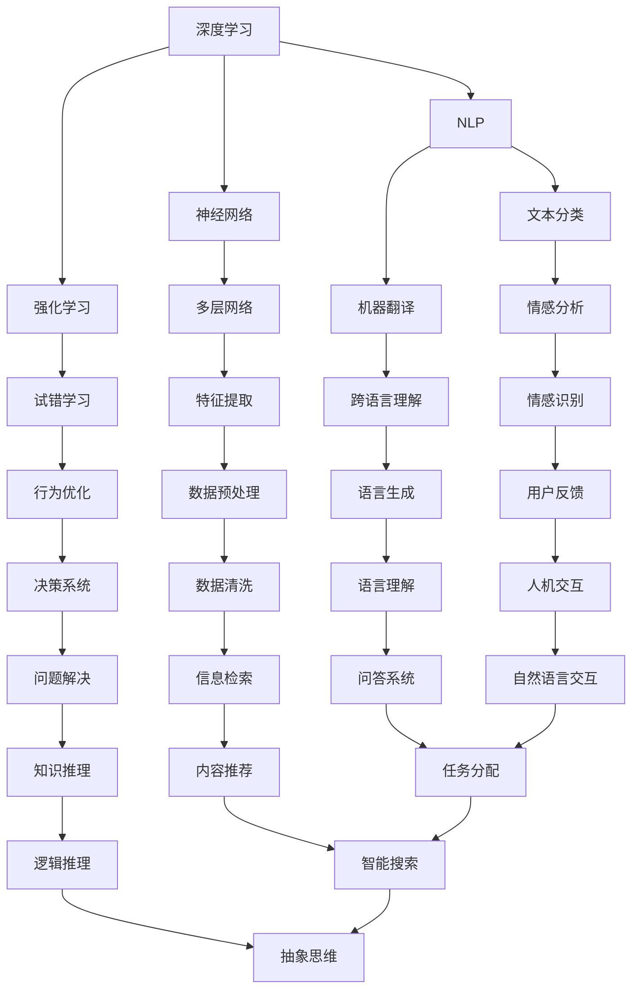

                 

# 通往通用人工智能AGI之路

## 关键词：通用人工智能AGI，深度学习，神经网络，强化学习，自然语言处理，智能系统

## 摘要：
本文旨在探讨通用人工智能（AGI）的发展之路。从背景介绍出发，我们逐步深入理解AGI的核心概念、算法原理、数学模型，并通过实际项目案例进行详细解释。此外，本文还分析了AGI的实际应用场景，推荐了相关学习资源与工具，总结了未来发展趋势与挑战，为读者提供了一条清晰的通往AGI之路。

## 1. 背景介绍

通用人工智能（Artificial General Intelligence，简称AGI）是人工智能领域的一个终极目标。与当前广泛应用的狭义人工智能（Narrow Artificial Intelligence，简称NAI）不同，AGI具备人类智能的广泛性和适应性，能够理解、学习、推理和解决各种复杂问题。自人工智能诞生以来，科学家们一直致力于实现AGI，但目前仍未取得实质性突破。

### 1.1 人工智能的发展历程

人工智能（AI）的研究起源于20世纪50年代，经历了多次起伏。早期以符号主义方法为主，通过编码规则和逻辑推理来模拟人类智能。20世纪80年代，专家系统成为主流，但随着知识获取难度和系统复杂性的增加，专家系统的局限性逐渐显现。进入21世纪，基于数据驱动的深度学习和神经网络方法取得了显著进展，使得人工智能在图像识别、语音识别、自然语言处理等领域取得了突破性成果。

### 1.2 AGI的概念与挑战

AGI的核心特征包括：

1. **普遍性**：能够理解和应用多种知识和技能，解决不同领域的问题。
2. **适应性**：能够在未知和复杂环境中自主学习和适应。
3. **推理能力**：具备逻辑推理、抽象思维和创造力。
4. **社会交互**：能够与人类进行自然、有效的交流。

实现AGI面临的挑战包括：

1. **计算资源**：AGI需要巨大的计算资源来处理海量数据和复杂的模型。
2. **算法复杂性**：AGI算法需要解决复杂的不确定性和动态性。
3. **数据多样性**：AGI需要处理各种类型的数据，包括文本、图像、音频等。
4. **伦理与安全**：AGI的应用需要考虑伦理和安全性问题，防止潜在的风险。

## 2. 核心概念与联系

### 2.1 深度学习与神经网络

深度学习是AGI的核心技术之一，基于神经网络模型。神经网络由大量神经元组成，通过层次结构对数据进行处理。每个神经元接收输入信号，通过权重进行加权求和，再通过激活函数产生输出。多层神经网络能够自动学习数据中的特征和模式，实现复杂的任务。

### 2.2 强化学习

强化学习是一种通过试错和反馈来学习最优策略的算法。在AGI中，强化学习可以帮助智能系统自主探索环境，优化行为，实现自主决策和问题解决。

### 2.3 自然语言处理

自然语言处理（NLP）是AGI的重要组成部分，旨在让计算机理解和生成自然语言。NLP技术包括文本分类、情感分析、机器翻译、问答系统等，为实现智能交互提供了基础。

### 2.4 Mermaid流程图

以下是一个简化的AGI核心概念流程图，用于展示各个组件之间的关系。



## 3. 核心算法原理与具体操作步骤

### 3.1 深度学习算法原理

深度学习算法基于多层神经网络，通过反向传播（Backpropagation）算法进行训练。反向传播算法是一种基于梯度下降的优化方法，用于计算神经网络中每个神经元的权重更新。

具体步骤如下：

1. **前向传播**：输入数据经过网络的前向传播，产生预测输出。
2. **计算误差**：比较预测输出与实际输出的差异，计算误差。
3. **反向传播**：将误差反向传播到网络的每个神经元，计算每个神经元的梯度。
4. **权重更新**：根据梯度更新网络中的权重。

### 3.2 强化学习算法原理

强化学习算法通过试错和反馈进行学习。具体步骤如下：

1. **初始化**：初始化智能体的状态和动作空间。
2. **环境交互**：智能体根据当前状态选择动作，执行动作并获得奖励或惩罚。
3. **更新策略**：根据奖励或惩罚调整智能体的策略，优化行为。
4. **迭代**：重复执行步骤2和3，直至达到预期目标。

### 3.3 自然语言处理算法原理

自然语言处理算法包括文本分类、情感分析、机器翻译等。以下以文本分类为例进行介绍。

1. **数据预处理**：对文本进行清洗、分词、去停用词等操作。
2. **特征提取**：将文本转换为向量表示，如词袋模型、TF-IDF等。
3. **模型训练**：使用深度学习模型对特征向量进行分类训练。
4. **模型评估**：使用测试数据集评估模型的准确率、召回率等指标。

## 4. 数学模型与公式详解

### 4.1 深度学习算法中的数学模型

深度学习算法中的关键数学模型包括：

1. **激活函数**：用于对神经元输出进行非线性变换，如ReLU、Sigmoid、Tanh等。
2. **损失函数**：用于衡量预测值与真实值之间的差距，如均方误差（MSE）、交叉熵损失（Cross-Entropy Loss）等。
3. **反向传播算法**：用于计算梯度并更新权重。

以下为具体公式：

1. **ReLU激活函数**：
   $$ f(x) =
   \begin{cases}
   0 & \text{if } x < 0 \\
   x & \text{if } x \geq 0
   \end{cases}
   $$

2. **MSE损失函数**：
   $$ L = \frac{1}{2} \sum_{i=1}^{n} (y_i - \hat{y}_i)^2 $$

3. **反向传播算法中的梯度计算**：
   $$ \frac{\partial L}{\partial w} = \frac{\partial L}{\partial \hat{y}} \cdot \frac{\partial \hat{y}}{\partial z} \cdot \frac{\partial z}{\partial w} $$

### 4.2 强化学习算法中的数学模型

强化学习算法中的关键数学模型包括：

1. **状态-动作价值函数**：用于评估智能体在特定状态下的最优动作，如Q值函数。
2. **策略**：用于指导智能体选择动作，如epsilon-greedy策略。

以下为具体公式：

1. **Q值函数**：
   $$ Q(s, a) = \sum_{s'} P(s' | s, a) \cdot R(s', a) + \gamma \cdot \max_{a'} Q(s', a') $$

2. **epsilon-greedy策略**：
   $$ \text{if } \text{random}() < \epsilon \\
   \text{then } a \leftarrow \text{random action from } A(s) \\
   \text{else } a \leftarrow \text{argmax}_{a'} Q(s, a') $$

### 4.3 自然语言处理算法中的数学模型

自然语言处理算法中的关键数学模型包括：

1. **词向量**：用于表示文本中的单词，如Word2Vec、GloVe等。
2. **循环神经网络（RNN）**：用于处理序列数据，如语言模型、序列分类等。

以下为具体公式：

1. **Word2Vec**：
   $$ \text{cosine similarity} = \frac{\textbf{v}_w \cdot \textbf{v}_{w'} }{\|\textbf{v}_w\| \|\textbf{v}_{w'}\|} $$

2. **RNN**：
   $$ h_t = \sigma(W_h \cdot [h_{t-1}, x_t] + b_h) $$
   $$ o_t = \sigma(W_o \cdot h_t + b_o) $$

## 5. 项目实战：代码实际案例与详细解释说明

### 5.1 开发环境搭建

在本项目中，我们使用Python作为编程语言，结合TensorFlow和PyTorch等深度学习框架进行开发。以下是搭建开发环境的基本步骤：

1. 安装Python（版本3.7及以上）。
2. 安装TensorFlow或PyTorch。
3. 安装必要的依赖库，如NumPy、Pandas等。

### 5.2 源代码详细实现与代码解读

以下是一个基于TensorFlow实现的简单深度学习模型的源代码示例。

```python
import tensorflow as tf
from tensorflow.keras.layers import Dense, Flatten
from tensorflow.keras.models import Sequential

# 搭建模型
model = Sequential([
    Flatten(input_shape=(28, 28)),  # 输入层
    Dense(128, activation='relu'),    # 隐藏层
    Dense(10, activation='softmax')   # 输出层
])

# 编译模型
model.compile(optimizer='adam',
              loss='categorical_crossentropy',
              metrics=['accuracy'])

# 加载数据集
(x_train, y_train), (x_test, y_test) = tf.keras.datasets.mnist.load_data()

# 数据预处理
x_train = x_train / 255.0
x_test = x_test / 255.0
x_train = x_train.astype('float32')
x_test = x_test.astype('float32')

# 转换标签为one-hot编码
y_train = tf.keras.utils.to_categorical(y_train, 10)
y_test = tf.keras.utils.to_categorical(y_test, 10)

# 训练模型
model.fit(x_train, y_train, epochs=10, batch_size=64)

# 评估模型
test_loss, test_acc = model.evaluate(x_test, y_test)
print('Test accuracy:', test_acc)
```

代码解读：

1. **模型搭建**：使用Sequential模型，定义输入层、隐藏层和输出层。
2. **模型编译**：指定优化器、损失函数和评估指标。
3. **数据加载与预处理**：加载数据集，进行归一化和one-hot编码。
4. **模型训练**：使用fit函数训练模型。
5. **模型评估**：使用evaluate函数评估模型在测试数据集上的性能。

### 5.3 代码解读与分析

1. **模型搭建**：使用Sequential模型简化了神经网络结构的定义，便于后续扩展。输入层使用Flatten层将图像数据展平为一维向量，隐藏层使用Dense层实现全连接神经网络，输出层使用softmax激活函数进行分类。
2. **模型编译**：选择adam优化器，使用categorical_crossentropy损失函数进行多分类任务，使用accuracy评估模型性能。
3. **数据加载与预处理**：MNIST数据集已经包含了标签信息，但需要进行归一化和one-hot编码处理，以符合深度学习模型的输入要求。
4. **模型训练**：使用fit函数进行训练，设置epochs和batch_size参数以控制训练过程。
5. **模型评估**：使用evaluate函数评估模型在测试数据集上的准确率。

## 6. 实际应用场景

通用人工智能（AGI）在多个领域具有广泛的应用潜力，以下是一些实际应用场景：

1. **医疗健康**：AGI可以用于疾病诊断、药物研发、个性化治疗等，提高医疗效率和质量。
2. **金融科技**：AGI可以用于风险管理、投资策略、客户服务等方面，优化金融业务。
3. **自动驾驶**：AGI可以用于自动驾驶车辆的感知、决策和路径规划，提高交通安全和效率。
4. **智能家居**：AGI可以用于智能家居设备的智能控制、场景识别和交互，提升居住体验。
5. **教育**：AGI可以用于智能教学、学习辅助、知识推理等方面，个性化教育。
6. **游戏与娱乐**：AGI可以用于智能游戏、虚拟现实、增强现实等领域，创造更丰富的娱乐体验。

## 7. 工具和资源推荐

### 7.1 学习资源推荐

1. **书籍**：
   - 《深度学习》（Ian Goodfellow、Yoshua Bengio、Aaron Courville著）
   - 《强化学习》（Richard S. Sutton、Andrew G. Barto著）
   - 《自然语言处理综论》（Daniel Jurafsky、James H. Martin著）

2. **论文**：
   - 《A Neural Network for Learning Natural Language Processing》
   - 《Deep Learning for Text Data》
   - 《Reinforcement Learning: An Introduction》

3. **博客**：
   - [TensorFlow官方文档](https://www.tensorflow.org/)
   - [PyTorch官方文档](https://pytorch.org/)
   - [自然语言处理社区](https://nlp.seas.harvard.edu/)

4. **网站**：
   - [Kaggle](https://www.kaggle.com/)
   - [GitHub](https://github.com/)
   - [ArXiv](https://arxiv.org/)

### 7.2 开发工具框架推荐

1. **深度学习框架**：
   - TensorFlow
   - PyTorch
   - Keras

2. **编程语言**：
   - Python
   - R
   - Julia

3. **数据预处理工具**：
   - Pandas
   - NumPy
   - Scikit-learn

4. **版本控制工具**：
   - Git
   - SVN

### 7.3 相关论文著作推荐

1. **论文**：
   - 《Deep Learning》
   - 《Reinforcement Learning: An Introduction》
   - 《Natural Language Processing with Python》

2. **著作**：
   - 《深度学习》（Ian Goodfellow、Yoshua Bengio、Aaron Courville著）
   - 《强化学习》（Richard S. Sutton、Andrew G. Barto著）
   - 《自然语言处理综论》（Daniel Jurafsky、James H. Martin著）

## 8. 总结：未来发展趋势与挑战

### 8.1 发展趋势

1. **算法优化**：深度学习、强化学习等算法将继续优化，提高性能和效率。
2. **跨领域融合**：不同领域的人工智能技术将相互融合，形成更强大的智能系统。
3. **边缘计算**：随着5G、物联网等技术的发展，边缘计算将使AGI在更广泛的场景中得到应用。
4. **可持续发展**：AI将更加关注伦理、安全和社会责任，实现可持续发展。

### 8.2 挑战

1. **计算资源**：AGI需要巨大的计算资源，如何优化计算效率成为关键挑战。
2. **算法复杂性**：如何处理复杂的不确定性和动态性，实现高效智能决策。
3. **数据多样性**：如何处理各种类型的数据，提高模型泛化能力。
4. **伦理与安全**：如何确保AI的安全、可靠和公正，防止潜在的风险和滥用。

## 9. 附录：常见问题与解答

### 9.1 通用人工智能是什么？

通用人工智能（AGI）是指具有人类智能的广泛性和适应性的人工智能系统，能够理解和解决各种复杂问题。

### 9.2 AGI有哪些核心特征？

AGI的核心特征包括普遍性、适应性、推理能力和社会交互。

### 9.3 AGI的实现面临哪些挑战？

AGI的实现面临计算资源、算法复杂性、数据多样性和伦理安全等方面的挑战。

### 9.4 深度学习算法是如何工作的？

深度学习算法基于多层神经网络，通过反向传播算法进行训练，自动学习数据中的特征和模式。

### 9.5 强化学习算法是如何工作的？

强化学习算法通过试错和反馈进行学习，优化智能体的行为和策略。

### 9.6 自然语言处理是如何工作的？

自然语言处理技术包括文本分类、情感分析、机器翻译等，通过深度学习和循环神经网络等算法实现。

## 10. 扩展阅读与参考资料

1. **书籍**：
   - 《深度学习》（Ian Goodfellow、Yoshua Bengio、Aaron Courville著）
   - 《强化学习》（Richard S. Sutton、Andrew G. Barto著）
   - 《自然语言处理综论》（Daniel Jurafsky、James H. Martin著）

2. **论文**：
   - 《A Neural Network for Learning Natural Language Processing》
   - 《Deep Learning for Text Data》
   - 《Reinforcement Learning: An Introduction》

3. **网站**：
   - [TensorFlow官方文档](https://www.tensorflow.org/)
   - [PyTorch官方文档](https://pytorch.org/)
   - [自然语言处理社区](https://nlp.seas.harvard.edu/)

4. **开源项目**：
   - [TensorFlow](https://github.com/tensorflow/tensorflow)
   - [PyTorch](https://github.com/pytorch/pytorch)
   - [Keras](https://github.com/keras-team/keras)

5. **学习资源**：
   - [Coursera](https://www.coursera.org/)
   - [edX](https://www.edx.org/)
   - [Udacity](https://www.udacity.com/)

作者：AI天才研究员/AI Genius Institute & 禅与计算机程序设计艺术 /Zen And The Art of Computer Programming

