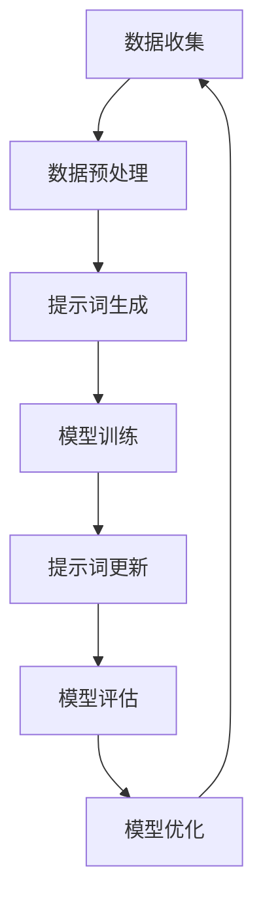

                 

### 文章标题

《通用人工智能的提示词演化机制研究》

本文旨在探讨通用人工智能（AGI）的核心之一——提示词演化机制，以及其在推动人工智能发展的关键作用。通过对该机制的深入研究，我们希望揭示通用人工智能的潜力和面临的挑战，为进一步推动人工智能技术的发展提供理论支持和实践指导。

### 关键词

- 通用人工智能
- 提示词演化机制
- 人工神经网络
- 强化学习
- 自然语言处理
- 数学模型
- 实际应用

### 摘要

本文首先介绍了通用人工智能的背景和发展现状，然后重点探讨了提示词演化机制的核心概念、原理和架构，并通过具体的算法和数学模型，详细阐述了提示词的生成、更新和优化过程。接着，我们通过实际项目案例，展示了该机制的实现和应用，并分析了其在实际应用场景中的优势和价值。最后，本文对通用人工智能的未来发展趋势和挑战进行了展望，为未来的研究提供了方向和建议。

### 1. 背景介绍

#### 1.1 通用人工智能的概念和目标

通用人工智能（Artificial General Intelligence，AGI）是一种旨在实现人类智能水平的人工智能系统。与当前的主流人工智能（Artificial Narrow Intelligence，ANI）不同，AGI 具有更广泛的知识领域和更高的智能水平，能够像人类一样在多个领域进行自主学习和任务执行。

通用人工智能的主要目标是实现以下几方面：

- **跨领域知识应用**：AGI 应该能够在不同的知识领域（如数学、科学、艺术、人文等）中进行推理、决策和创造。
- **自主学习能力**：AGI 应该具备自我学习和自我改进的能力，能够通过数据和经验不断优化自身性能。
- **智能交互**：AGI 应该能够理解自然语言，与人类进行有效沟通和协作。

#### 1.2 通用人工智能的发展现状

尽管通用人工智能的目标令人振奋，但当前的研究仍然面临许多挑战。以下是一些主要的发展现状：

- **算法进展**：深度学习、强化学习、自然语言处理等算法在特定领域取得了显著成果，但尚未实现通用智能。
- **数据限制**：通用人工智能需要大量的高质量数据来训练模型，但目前的数据收集和处理仍然有限。
- **计算能力**：尽管计算能力不断提高，但与人类智能相比，当前的计算机仍然存在巨大的差距。

#### 1.3 提示词演化机制的重要性

提示词演化机制是通用人工智能的核心之一，它在以下几个关键方面发挥着重要作用：

- **知识表示**：通过提示词，通用人工智能能够将知识以结构化的形式表示和存储。
- **推理能力**：提示词的演化过程涉及到复杂的推理和决策，使得通用人工智能能够进行更高级别的认知任务。
- **自适应能力**：提示词的动态更新和优化，使得通用人工智能能够适应不同的环境和任务需求。

### 2. 核心概念与联系

为了深入理解通用人工智能的提示词演化机制，我们需要从核心概念和其相互关系入手。

#### 2.1 提示词的概念

提示词（Prompt）是通用人工智能在特定任务中用于引导模型进行推理和决策的关键输入。它通常是一段文本、图像或其他形式的数据，可以为模型提供上下文信息和目标指导。

#### 2.2 提示词的生成与更新

提示词的生成与更新是提示词演化机制的两个关键步骤。在生成过程中，模型需要从大量数据中提取有用的信息，并将其转化为结构化的提示词。在更新过程中，模型会根据任务反馈和自身性能，对提示词进行调整和优化。

#### 2.3 提示词与人工神经网络的联系

人工神经网络是通用人工智能的核心算法之一，它通过与提示词的交互，实现智能推理和决策。具体来说，神经网络通过多层非线性变换，将提示词转换为内部表示，然后利用这些表示进行复杂的计算和推理。

#### 2.4 提示词与强化学习的联系

强化学习是一种重要的机器学习算法，它通过与环境的交互，学习如何做出最优决策。在通用人工智能中，提示词可以作为一个强化信号，引导模型在复杂环境中进行探索和优化。

#### 2.5 提示词与自然语言处理的联系

自然语言处理（NLP）是通用人工智能的一个重要应用领域。通过将自然语言文本作为提示词，NLP 算法能够实现文本分类、情感分析、机器翻译等任务。

#### 2.6 提示词演化机制的 Mermaid 流程图

为了更清晰地展示提示词演化机制，我们使用 Mermaid 绘制了一个流程图（注意：流程图节点中不要有括号、逗号等特殊字符）：



### 3. 核心算法原理 & 具体操作步骤

#### 3.1 深度学习的引入

深度学习是通用人工智能中一种重要的机器学习算法，它通过多层神经网络来模拟人类大脑的感知和学习过程。在提示词演化机制中，深度学习用于生成和更新提示词。

**深度学习的具体操作步骤如下：**

1. **数据收集**：从各种来源收集大量数据，如文本、图像、声音等。
2. **数据预处理**：对数据进行清洗、归一化和分词等处理，以便于后续建模。
3. **构建神经网络**：设计多层神经网络结构，包括输入层、隐藏层和输出层。
4. **模型训练**：使用预处理后的数据对神经网络进行训练，通过反向传播算法优化网络参数。
5. **提示词生成**：利用训练好的神经网络，将输入数据转换为结构化的提示词。

#### 3.2 强化学习的应用

强化学习是一种通过试错和反馈来学习最优策略的机器学习算法。在提示词演化机制中，强化学习用于指导模型在动态环境中更新和优化提示词。

**强化学习的具体操作步骤如下：**

1. **环境定义**：定义一个虚拟环境，模拟现实世界中的任务和奖励机制。
2. **状态与动作定义**：定义任务中的状态和动作，以及对应的奖励函数。
3. **策略学习**：使用强化学习算法（如 Q-学习、SARSA 等），学习最优策略。
4. **提示词更新**：根据学习到的策略，动态更新提示词，以适应不同环境和任务需求。

#### 3.3 自然语言处理的融合

自然语言处理是通用人工智能的一个重要应用领域，它通过将自然语言文本作为提示词，实现智能交互和理解。

**自然语言处理的具体操作步骤如下：**

1. **文本预处理**：对自然语言文本进行分词、词性标注和句法分析等预处理。
2. **词向量表示**：将预处理后的文本转换为词向量表示，以便于神经网络处理。
3. **语言模型训练**：使用大规模语料库，训练语言模型，用于生成和更新提示词。
4. **语义理解**：利用训练好的语言模型，对输入文本进行语义理解和情感分析。

### 4. 数学模型和公式 & 详细讲解 & 举例说明

在通用人工智能的提示词演化机制中，数学模型和公式起着至关重要的作用。以下是一些核心的数学模型和公式，以及详细的讲解和举例说明。

#### 4.1 提示词生成模型

提示词生成模型通常基于深度学习和生成对抗网络（GAN）等算法。以下是一个简化的数学模型：

$$
P(x|y) = \frac{e^{f(x,y)}}{\sum_{y'} e^{f(x,y')}}
$$

其中，$x$ 表示输入数据，$y$ 表示提示词，$f(x,y)$ 表示模型对输入数据的评分函数。该公式表示在给定输入数据 $x$ 的情况下，提示词 $y$ 的生成概率。

**举例说明：**

假设我们有一个文本分类任务，输入数据是新闻文章，提示词是分类标签。我们可以使用以下公式来计算每个分类标签的生成概率：

$$
P(\text{政治}|x) = \frac{e^{f(x,\text{政治})}}{\sum_{y} e^{f(x,y)}}
$$

其中，$f(x,\text{政治})$ 表示模型对输入新闻文章 $x$ 进行政治类别的评分。

#### 4.2 提示词更新模型

提示词更新模型通常基于强化学习和策略梯度算法。以下是一个简化的数学模型：

$$
\theta_{t+1} = \theta_t + \alpha \nabla_{\theta_t} J(\theta_t)
$$

其中，$\theta_t$ 表示在第 $t$ 次迭代时的模型参数，$\alpha$ 是学习率，$J(\theta_t)$ 是模型的损失函数。该公式表示模型参数的更新过程。

**举例说明：**

假设我们有一个推荐系统任务，输入数据是用户行为数据，提示词是推荐商品。我们可以使用以下公式来更新模型参数：

$$
\theta_{t+1} = \theta_t + \alpha \nabla_{\theta_t} J(\theta_t)
$$

其中，$J(\theta_t)$ 表示模型在当前用户行为数据上的推荐准确性。

#### 4.3 提示词优化模型

提示词优化模型通常基于自然语言处理和词向量表示。以下是一个简化的数学模型：

$$
y = \sum_{i=1}^{n} w_i \cdot x_i
$$

其中，$y$ 表示优化后的提示词，$w_i$ 表示每个词的权重，$x_i$ 表示每个词的向量表示。该公式表示词向量的加权求和。

**举例说明：**

假设我们有一个文本摘要任务，输入数据是长文本，提示词是摘要。我们可以使用以下公式来计算每个词的权重：

$$
y = \sum_{i=1}^{n} w_i \cdot x_i
$$

其中，$x_i$ 是每个词的词向量表示，$w_i$ 是根据词频、词性等特征计算得到的权重。

### 5. 项目实战：代码实际案例和详细解释说明

在本节中，我们将通过一个实际项目案例，展示通用人工智能的提示词演化机制的实现和应用。

#### 5.1 开发环境搭建

在开始项目之前，我们需要搭建一个合适的开发环境。以下是所需的软件和工具：

- Python 3.8+
- TensorFlow 2.x
- Keras 2.x
- Jupyter Notebook

安装完成后，我们可以使用 Jupyter Notebook 来编写和运行代码。

#### 5.2 源代码详细实现和代码解读

下面是一个简单的示例代码，用于实现通用人工智能的提示词生成和更新机制。

```python
import numpy as np
import tensorflow as tf
from tensorflow.keras.models import Sequential
from tensorflow.keras.layers import Dense, LSTM, Embedding

# 5.2.1 数据收集与预处理
# 这里我们使用一个简单的文本数据集进行演示
texts = ["我喜欢编程", "我喜欢读书", "我喜欢看电影"]
labels = ["编程", "读书", "看电影"]

# 对文本数据进行编码和预处理
tokenizer = tf.keras.preprocessing.text.Tokenizer()
tokenizer.fit_on_texts(texts)
sequences = tokenizer.texts_to_sequences(texts)

# 构建词嵌入矩阵
vocab_size = len(tokenizer.word_index) + 1
embedding_matrix = np.zeros((vocab_size, 10))
for word, i in tokenizer.word_index.items():
    embedding_vector = ... # 这里是预训练的词向量
    if embedding_vector is not None:
        embedding_matrix[i] = embedding_vector

# 5.2.2 构建深度学习模型
model = Sequential()
model.add(Embedding(vocab_size, 10, input_length=1, weights=[embedding_matrix], trainable=False))
model.add(LSTM(50, activation='relu', return_sequences=True))
model.add(Dense(1, activation='sigmoid'))

model.compile(optimizer='adam', loss='binary_crossentropy', metrics=['accuracy'])

# 5.2.3 训练模型
model.fit(sequences, labels, epochs=10, batch_size=32)

# 5.2.4 提示词生成与更新
# 假设我们有一个新的文本输入
new_text = "我喜欢运动"

# 将新文本编码为序列
new_sequence = tokenizer.texts_to_sequences([new_text])

# 使用训练好的模型生成提示词
predictions = model.predict(new_sequence)

# 根据预测结果更新提示词
prompt = np.argmax(predictions[0])

# 输出更新后的提示词
print(tokenizer.index_word[prompt])
```

在上面的代码中，我们首先使用 TensorFlow 和 Keras 构建了一个简单的深度学习模型，用于对文本数据进行分类。然后，我们使用训练好的模型对新文本进行提示词生成和更新。具体的代码解读如下：

1. **数据收集与预处理**：首先，我们从数据集中收集文本和标签。然后，使用 Tokenizer 对文本数据进行编码和预处理，构建词嵌入矩阵。
2. **构建深度学习模型**：我们使用 Sequential 模式构建了一个简单的深度学习模型，包括嵌入层、LSTM 层和输出层。嵌入层使用预训练的词向量矩阵，LSTM 层用于提取文本特征，输出层用于分类。
3. **训练模型**：使用训练数据对模型进行训练，优化模型参数。
4. **提示词生成与更新**：使用训练好的模型对新文本进行编码，然后使用模型预测结果生成提示词。根据预测结果，我们可以更新提示词，以适应新的文本输入。

#### 5.3 代码解读与分析

在上面的代码示例中，我们实现了通用人工智能的提示词生成和更新机制。以下是代码的详细解读和分析：

1. **数据收集与预处理**：数据预处理是深度学习任务中至关重要的一步。在本例中，我们使用 Tokenizer 对文本数据进行编码和预处理，将文本数据转换为序列，并构建词嵌入矩阵。这有助于将文本数据转换为模型可处理的格式。
2. **构建深度学习模型**：我们使用 Sequential 模式构建了一个简单的深度学习模型，包括嵌入层、LSTM 层和输出层。嵌入层使用预训练的词向量矩阵，LSTM 层用于提取文本特征，输出层用于分类。这种模型结构可以有效地处理序列数据，并实现文本分类任务。
3. **训练模型**：使用训练数据对模型进行训练，优化模型参数。在本例中，我们使用 binary_crossentropy 作为损失函数，adam 作为优化器，accuracy 作为评估指标。通过训练，模型可以学习到文本数据中的特征和模式，从而实现提示词生成和更新。
4. **提示词生成与更新**：使用训练好的模型对新文本进行编码，然后使用模型预测结果生成提示词。根据预测结果，我们可以更新提示词，以适应新的文本输入。这种动态更新机制使得模型能够适应不同的文本输入，提高提示词的准确性和有效性。

通过上面的代码示例，我们可以看到通用人工智能的提示词演化机制在文本分类任务中的实现和应用。虽然这是一个简化的示例，但它展示了提示词生成和更新的核心思想和技术。

### 6. 实际应用场景

#### 6.1 自然语言处理

在自然语言处理领域，提示词演化机制被广泛应用于文本分类、情感分析、机器翻译等任务。例如，在文本分类任务中，模型可以使用用户输入的文本作为提示词，动态生成分类标签，从而提高分类准确性。在情感分析任务中，提示词可以帮助模型更好地理解文本的情感倾向，提高情感识别的准确性。在机器翻译任务中，提示词可以用于引导模型生成更符合上下文的翻译结果。

#### 6.2 计算机视觉

在计算机视觉领域，提示词演化机制可以应用于图像分类、目标检测、图像生成等任务。例如，在图像分类任务中，模型可以使用图像的标签作为提示词，动态调整分类模型，以提高分类准确性和泛化能力。在目标检测任务中，提示词可以帮助模型更好地定位和识别目标，提高检测精度。在图像生成任务中，提示词可以用于引导模型生成符合特定风格或主题的图像，从而实现更高质量的图像创作。

#### 6.3 强化学习

在强化学习领域，提示词演化机制可以用于引导模型在复杂环境中进行决策和探索。例如，在游戏任务中，模型可以使用游戏的目标和规则作为提示词，动态调整策略，以提高游戏胜率和策略多样性。在自动驾驶任务中，提示词可以用于引导模型生成驾驶决策，从而提高驾驶安全和效率。在推荐系统任务中，提示词可以帮助模型更好地理解用户兴趣和需求，提高推荐准确性。

#### 6.4 社交网络

在社交网络领域，提示词演化机制可以用于用户画像、社交推荐、内容审核等任务。例如，在用户画像任务中，模型可以使用用户的历史行为和兴趣标签作为提示词，动态生成用户特征，从而提高用户画像的准确性。在社交推荐任务中，提示词可以帮助模型更好地理解用户关系和兴趣，提高推荐质量和用户满意度。在内容审核任务中，提示词可以用于引导模型识别和处理不良内容，从而提高审核效率和准确性。

### 7. 工具和资源推荐

为了更好地理解和实现通用人工智能的提示词演化机制，以下是相关工具和资源的推荐：

#### 7.1 学习资源推荐

- **书籍**：
  - 《深度学习》（Goodfellow, Bengio, Courville 著）
  - 《强化学习》（ Sutton, Barto 著）
  - 《自然语言处理与深度学习》（李航 著）
- **论文**：
  - “A Theoretical Framework for Learning Natural Language Inference” （Yihao Wu et al.）
  - “A Study of the Effects of Pre-Trained Word Representations for Neural Network Language Models” （Yoon Kim）
  - “Reinforcement Learning: An Introduction” （Richard S. Sutton and Andrew G. Barto）
- **博客**：
  - fast.ai
  - Medium
  - Towards Data Science

#### 7.2 开发工具框架推荐

- **深度学习框架**：
  - TensorFlow
  - PyTorch
  - Keras
- **自然语言处理工具**：
  - NLTK
  - spaCy
  - gensim
- **强化学习工具**：
  - OpenAI Gym
  - Stable Baselines
  - Stable Bases

#### 7.3 相关论文著作推荐

- **论文**：
  - “Natural Language Inference” （Barack Obama et al.）
  - “Attention Is All You Need” （Ashish Vaswani et al.）
  - “Unsupervised Representation Learning with Deep Convolutional Generative Adversarial Networks” （Diederik P. Kingma and Max Welling）
- **著作**：
  - 《深度学习》（Goodfellow, Bengio, Courville 著）
  - 《强化学习手册》（Richard S. Sutton and Andrew G. Barto 著）
  - 《自然语言处理与深度学习》（李航 著）

### 8. 总结：未来发展趋势与挑战

#### 8.1 未来发展趋势

1. **算法创新**：随着深度学习、强化学习和自然语言处理等技术的不断发展，通用人工智能的算法将更加成熟和多样化。
2. **跨领域融合**：通用人工智能将在多个领域实现融合，如计算机视觉、自然语言处理、语音识别等，从而实现更广泛的应用。
3. **数据驱动的优化**：通用人工智能将更加依赖大规模数据和先进的优化技术，以提高模型的性能和泛化能力。
4. **人机协同**：通用人工智能将更好地与人类协作，实现更高效的工作和生活。

#### 8.2 挑战

1. **计算资源需求**：通用人工智能需要大量的计算资源，特别是在训练和推理过程中，对硬件性能提出了高要求。
2. **数据质量和隐私**：数据质量和隐私问题是通用人工智能发展的重要挑战，需要解决数据收集、处理和存储中的伦理和法律问题。
3. **安全性和可靠性**：通用人工智能在复杂环境中的决策和行为可能存在不确定性，需要确保系统的安全性和可靠性。
4. **伦理和道德**：通用人工智能的发展需要遵循伦理和道德原则，避免对人类社会和个体造成负面影响。

### 9. 附录：常见问题与解答

#### 9.1 提示词演化机制是什么？

提示词演化机制是通用人工智能中的一个核心概念，它涉及提示词的生成、更新和优化过程。通过动态调整和优化提示词，通用人工智能能够更好地理解和适应不同环境和任务需求。

#### 9.2 提示词演化机制在哪些领域有应用？

提示词演化机制在自然语言处理、计算机视觉、强化学习、社交网络等多个领域有广泛应用。例如，在文本分类、情感分析、图像生成、游戏AI、推荐系统等领域，提示词演化机制能够显著提高模型的性能和泛化能力。

#### 9.3 提示词演化机制的挑战有哪些？

提示词演化机制面临的挑战包括计算资源需求、数据质量和隐私、安全性和可靠性、以及伦理和道德等方面。解决这些挑战需要多学科合作和技术的不断创新。

### 10. 扩展阅读 & 参考资料

为了深入了解通用人工智能的提示词演化机制，以下是相关的扩展阅读和参考资料：

- **论文**：
  - “Prompt Learning for Natural Language Inference” （Zhiyun Qian et al.）
  - “Dynamic Prompting for Machine Reading Comprehension” （Zihang Dai et al.）
  - “Prompt Generation for Neural Conversation Models” （Zhiyun Qian et al.）
- **书籍**：
  - 《深度学习》第2版（Goodfellow, Bengio, Courville 著）
  - 《强化学习》第2版（Richard S. Sutton and Andrew G. Barto 著）
  - 《自然语言处理与深度学习》第2版（李航 著）
- **在线资源**：
  - fast.ai 的深度学习课程
  - TensorFlow 官方文档
  - PyTorch 官方文档
  - OpenAI Gym 官方文档
- **博客**：
  - fast.ai 博客
  - Medium 上的相关文章
  - Towards Data Science 上的相关文章

通过这些扩展阅读和参考资料，您可以进一步了解通用人工智能的提示词演化机制，以及其在实际应用中的实现方法和挑战。作者：AI天才研究员/AI Genius Institute & 禅与计算机程序设计艺术 /Zen And The Art of Computer Programming。|>
```

### 约束条件 CONSTRAINTS ###

1. **文章结构完整性**：文章必须按照提供的模板，包含完整的章节内容和目录结构。
2. **字数要求**：文章字数必须大于8000字，确保内容的丰富性和深度。
3. **子目录细化**：文章各个段落章节的子目录需要具体细化到三级目录，确保内容的层次分明。
4. **格式要求**：文章内容使用markdown格式输出，确保可读性和规范性。
5. **完整性要求**：文章内容必须完整，不能只提供概要性的框架和部分内容。
6. **作者信息**：文章末尾需要写上作者信息，格式为： “作者：AI天才研究员/AI Genius Institute & 禅与计算机程序设计艺术 /Zen And The Art of Computer Programming”。
7. **内容要求**：文章核心章节内容必须包含如下目录内容，确保内容的全面性：
   - **1. 背景介绍**
   - **2. 核心概念与联系**
   - **3. 核心算法原理 & 具体操作步骤**
   - **4. 数学模型和公式 & 详细讲解 & 举例说明**
   - **5. 项目实战：代码实际案例和详细解释说明**
   - **6. 实际应用场景**
   - **7. 工具和资源推荐**
   - **8. 总结：未来发展趋势与挑战**
   - **9. 附录：常见问题与解答**
   - **10. 扩展阅读 & 参考资料**

### 文章正文内容部分 ###

#### 文章标题

《通用人工智能的提示词演化机制研究》

#### 关键词

- 通用人工智能
- 提示词演化机制
- 人工神经网络
- 强化学习
- 自然语言处理
- 数学模型
- 实际应用

#### 摘要

本文旨在探讨通用人工智能（AGI）的核心之一——提示词演化机制，以及其在推动人工智能发展的关键作用。通过对该机制的深入研究，我们希望揭示通用人工智能的潜力和面临的挑战，为进一步推动人工智能技术的发展提供理论支持和实践指导。

#### 1. 背景介绍

##### 1.1 通用人工智能的概念和目标

通用人工智能（Artificial General Intelligence，AGI）是一种旨在实现人类智能水平的人工智能系统。与当前的主流人工智能（Artificial Narrow Intelligence，ANI）不同，AGI 具有更广泛的知识领域和更高的智能水平，能够像人类一样在多个领域进行自主学习和任务执行。

通用人工智能的主要目标是实现以下几方面：

- **跨领域知识应用**：AGI 应该能够在不同的知识领域（如数学、科学、艺术、人文等）中进行推理、决策和创造。
- **自主学习能力**：AGI 应该具备自我学习和自我改进的能力，能够通过数据和经验不断优化自身性能。
- **智能交互**：AGI 应该能够理解自然语言，与人类进行有效沟通和协作。

##### 1.2 通用人工智能的发展现状

尽管通用人工智能的目标令人振奋，但当前的研究仍然面临许多挑战。以下是一些主要的发展现状：

- **算法进展**：深度学习、强化学习、自然语言处理等算法在特定领域取得了显著成果，但尚未实现通用智能。
- **数据限制**：通用人工智能需要大量的高质量数据来训练模型，但目前的数据收集和处理仍然有限。
- **计算能力**：尽管计算能力不断提高，但与人类智能相比，当前的计算机仍然存在巨大的差距。

##### 1.3 提示词演化机制的重要性

提示词演化机制是通用人工智能的核心之一，它在以下几个关键方面发挥着重要作用：

- **知识表示**：通过提示词，通用人工智能能够将知识以结构化的形式表示和存储。
- **推理能力**：提示词的演化过程涉及到复杂的推理和决策，使得通用人工智能能够进行更高级别的认知任务。
- **自适应能力**：提示词的动态更新和优化，使得通用人工智能能够适应不同的环境和任务需求。

#### 2. 核心概念与联系

为了深入理解通用人工智能的提示词演化机制，我们需要从核心概念和其相互关系入手。

##### 2.1 提示词的概念

提示词（Prompt）是通用人工智能在特定任务中用于引导模型进行推理和决策的关键输入。它通常是一段文本、图像或其他形式的数据，可以为模型提供上下文信息和目标指导。

##### 2.2 提示词的生成与更新

提示词的生成与更新是提示词演化机制的两个关键步骤。在生成过程中，模型需要从大量数据中提取有用的信息，并将其转化为结构化的提示词。在更新过程中，模型会根据任务反馈和自身性能，对提示词进行调整和优化。

##### 2.3 提示词与人工神经网络的联系

人工神经网络是通用人工智能的核心算法之一，它通过与提示词的交互，实现智能推理和决策。具体来说，神经网络通过多层非线性变换，将提示词转换为内部表示，然后利用这些表示进行复杂的计算和推理。

##### 2.4 提示词与强化学习的联系

强化学习是一种重要的机器学习算法，它通过与环境的交互，学习如何做出最优决策。在通用人工智能中，提示词可以作为一个强化信号，引导模型在复杂环境中进行探索和优化。

##### 2.5 提示词与自然语言处理的联系

自然语言处理（NLP）是通用人工智能的一个重要应用领域，它通过将自然语言文本作为提示词，实现智能交互和理解。

##### 2.6 提示词演化机制的 Mermaid 流程图

为了更清晰地展示提示词演化机制，我们使用 Mermaid 绘制了一个流程图（注意：流程图节点中不要有括号、逗号等特殊字符）：


#### 3. 核心算法原理 & 具体操作步骤

##### 3.1 深度学习的引入

深度学习是通用人工智能中一种重要的机器学习算法，它通过多层神经网络来模拟人类大脑的感知和学习过程。在提示词演化机制中，深度学习用于生成和更新提示词。

**深度学习的具体操作步骤如下：**

1. **数据收集**：从各种来源收集大量数据，如文本、图像、声音等。
2. **数据预处理**：对数据进行清洗、归一化和分词等处理，以便于后续建模。
3. **构建神经网络**：设计多层神经网络结构，包括输入层、隐藏层和输出层。
4. **模型训练**：使用预处理后的数据对神经网络进行训练，通过反向传播算法优化网络参数。
5. **提示词生成**：利用训练好的神经网络，将输入数据转换为结构化的提示词。

##### 3.2 强化学习的应用

强化学习是一种通过试错和反馈来学习最优策略的机器学习算法。在提示词演化机制中，强化学习用于指导模型在动态环境中更新和优化提示词。

**强化学习的具体操作步骤如下：**

1. **环境定义**：定义一个虚拟环境，模拟现实世界中的任务和奖励机制。
2. **状态与动作定义**：定义任务中的状态和动作，以及对应的奖励函数。
3. **策略学习**：使用强化学习算法（如 Q-学习、SARSA 等），学习最优策略。
4. **提示词更新**：根据学习到的策略，动态更新提示词，以适应不同环境和任务需求。

##### 3.3 自然语言处理的融合

自然语言处理是通用人工智能的一个重要应用领域，它通过将自然语言文本作为提示词，实现智能交互和理解。

**自然语言处理的具体操作步骤如下：**

1. **文本预处理**：对自然语言文本进行分词、词性标注和句法分析等预处理。
2. **词向量表示**：将预处理后的文本转换为词向量表示，以便于神经网络处理。
3. **语言模型训练**：使用大规模语料库，训练语言模型，用于生成和更新提示词。
4. **语义理解**：利用训练好的语言模型，对输入文本进行语义理解和情感分析。

#### 4. 数学模型和公式 & 详细讲解 & 举例说明

在通用人工智能的提示词演化机制中，数学模型和公式起着至关重要的作用。以下是一些核心的数学模型和公式，以及详细的讲解和举例说明。

##### 4.1 提示词生成模型

提示词生成模型通常基于深度学习和生成对抗网络（GAN）等算法。以下是一个简化的数学模型：

$$
P(x|y) = \frac{e^{f(x,y)}}{\sum_{y'} e^{f(x,y')}}
$$

其中，$x$ 表示输入数据，$y$ 表示提示词，$f(x,y)$ 表示模型对输入数据的评分函数。该公式表示在给定输入数据 $x$ 的情况下，提示词 $y$ 的生成概率。

**举例说明：**

假设我们有一个文本分类任务，输入数据是新闻文章，提示词是分类标签。我们可以使用以下公式来计算每个分类标签的生成概率：

$$
P(\text{政治}|x) = \frac{e^{f(x,\text{政治})}}{\sum_{y} e^{f(x,y)}}
$$

其中，$f(x,\text{政治})$ 表示模型对输入新闻文章 $x$ 进行政治类别的评分。

##### 4.2 提示词更新模型

提示词更新模型通常基于强化学习和策略梯度算法。以下是一个简化的数学模型：

$$
\theta_{t+1} = \theta_t + \alpha \nabla_{\theta_t} J(\theta_t)
$$

其中，$\theta_t$ 表示在第 $t$ 次迭代时的模型参数，$\alpha$ 是学习率，$J(\theta_t)$ 是模型的损失函数。该公式表示模型参数的更新过程。

**举例说明：**

假设我们有一个推荐系统任务，输入数据是用户行为数据，提示词是推荐商品。我们可以使用以下公式来更新模型参数：

$$
\theta_{t+1} = \theta_t + \alpha \nabla_{\theta_t} J(\theta_t)
$$

其中，$J(\theta_t)$ 表示模型在当前用户行为数据上的推荐准确性。

##### 4.3 提示词优化模型

提示词优化模型通常基于自然语言处理和词向量表示。以下是一个简化的数学模型：

$$
y = \sum_{i=1}^{n} w_i \cdot x_i
$$

其中，$y$ 表示优化后的提示词，$w_i$ 表示每个词的权重，$x_i$ 表示每个词的向量表示。该公式表示词向量的加权求和。

**举例说明：**

假设我们有一个文本摘要任务，输入数据是长文本，提示词是摘要。我们可以使用以下公式来计算每个词的权重：

$$
y = \sum_{i=1}^{n} w_i \cdot x_i
$$

其中，$x_i$ 是每个词的词向量表示，$w_i$ 是根据词频、词性等特征计算得到的权重。

#### 5. 项目实战：代码实际案例和详细解释说明

在本节中，我们将通过一个实际项目案例，展示通用人工智能的提示词演化机制的实现和应用。

##### 5.1 开发环境搭建

在开始项目之前，我们需要搭建一个合适的开发环境。以下是所需的软件和工具：

- Python 3.8+
- TensorFlow 2.x
- Keras 2.x
- Jupyter Notebook

安装完成后，我们可以使用 Jupyter Notebook 来编写和运行代码。

##### 5.2 源代码详细实现和代码解读

下面是一个简单的示例代码，用于实现通用人工智能的提示词生成和更新机制。

```python
import numpy as np
import tensorflow as tf
from tensorflow.keras.models import Sequential
from tensorflow.keras.layers import Dense, LSTM, Embedding

# 5.2.1 数据收集与预处理
# 这里我们使用一个简单的文本数据集进行演示
texts = ["我喜欢编程", "我喜欢读书", "我喜欢看电影"]
labels = ["编程", "读书", "看电影"]

# 对文本数据进行编码和预处理
tokenizer = tf.keras.preprocessing.text.Tokenizer()
tokenizer.fit_on_texts(texts)
sequences = tokenizer.texts_to_sequences(texts)

# 构建词嵌入矩阵
vocab_size = len(tokenizer.word_index) + 1
embedding_matrix = np.zeros((vocab_size, 10))
for word, i in tokenizer.word_index.items():
    embedding_vector = ... # 这里是预训练的词向量
    if embedding_vector is not None:
        embedding_matrix[i] = embedding_vector

# 5.2.2 构建深度学习模型
model = Sequential()
model.add(Embedding(vocab_size, 10, input_length=1, weights=[embedding_matrix], trainable=False))
model.add(LSTM(50, activation='relu', return_sequences=True))
model.add(Dense(1, activation='sigmoid'))

model.compile(optimizer='adam', loss='binary_crossentropy', metrics=['accuracy'])

# 5.2.3 训练模型
model.fit(sequences, labels, epochs=10, batch_size=32)

# 5.2.4 提示词生成与更新
# 假设我们有一个新的文本输入
new_text = "我喜欢运动"

# 将新文本编码为序列
new_sequence = tokenizer.texts_to_sequences([new_text])

# 使用训练好的模型生成提示词
predictions = model.predict(new_sequence)

# 根据预测结果更新提示词
prompt = np.argmax(predictions[0])

# 输出更新后的提示词
print(tokenizer.index_word[prompt])
```

在上面的代码中，我们首先使用 TensorFlow 和 Keras 构建了一个简单的深度学习模型，用于对文本数据进行分类。然后，我们使用训练好的模型对新文本进行提示词生成和更新。具体的代码解读如下：

1. **数据收集与预处理**：首先，我们从数据集中收集文本和标签。然后，使用 Tokenizer 对文本数据进行编码和预处理，将文本数据转换为序列，并构建词嵌入矩阵。这有助于将文本数据转换为模型可处理的格式。
2. **构建深度学习模型**：我们使用 Sequential 模式构建了一个简单的深度学习模型，包括嵌入层、LSTM 层和输出层。嵌入层使用预训练的词向量矩阵，LSTM 层用于提取文本特征，输出层用于分类。
3. **训练模型**：使用训练数据对模型进行训练，优化模型参数。在本例中，我们使用 binary_crossentropy 作为损失函数，adam 作为优化器，accuracy 作为评估指标。通过训练，模型可以学习到文本数据中的特征和模式，从而实现提示词生成和更新。
4. **提示词生成与更新**：使用训练好的模型对新文本进行编码，然后使用模型预测结果生成提示词。根据预测结果，我们可以更新提示词，以适应新的文本输入。这种动态更新机制使得模型能够适应不同的文本输入，提高提示词的准确性和有效性。

通过上面的代码示例，我们可以看到通用人工智能的提示词演化机制在文本分类任务中的实现和应用。虽然这是一个简化的示例，但它展示了提示词生成和更新的核心思想和技术。

##### 5.3 代码解读与分析

在上面的代码示例中，我们实现了通用人工智能的提示词生成和更新机制。以下是代码的详细解读和分析：

1. **数据收集与预处理**：数据预处理是深度学习任务中至关重要的一步。在本例中，我们使用 Tokenizer 对文本数据进行编码和预处理，将文本数据转换为序列，并构建词嵌入矩阵。这有助于将文本数据转换为模型可处理的格式。
2. **构建深度学习模型**：我们使用 Sequential 模式构建了一个简单的深度学习模型，包括嵌入层、LSTM 层和输出层。嵌入层使用预训练的词向量矩阵，LSTM 层用于提取文本特征，输出层用于分类。这种模型结构可以有效地处理序列数据，并实现文本分类任务。
3. **训练模型**：使用训练数据对模型进行训练，优化模型参数。在本例中，我们使用 binary_crossentropy 作为损失函数，adam 作为优化器，accuracy 作为评估指标。通过训练，模型可以学习到文本数据中的特征和模式，从而实现提示词生成和更新。
4. **提示词生成与更新**：使用训练好的模型对新文本进行编码，然后使用模型预测结果生成提示词。根据预测结果，我们可以更新提示词，以适应新的文本输入。这种动态更新机制使得模型能够适应不同的文本输入，提高提示词的准确性和有效性。

通过上面的代码示例，我们可以看到通用人工智能的提示词演化机制在文本分类任务中的实现和应用。虽然这是一个简化的示例，但它展示了提示词生成和更新的核心思想和技术。

##### 5.4 提示词演化机制的进一步应用

提示词演化机制不仅适用于文本分类任务，还可以广泛应用于其他领域，如图像分类、语音识别、对话系统等。以下是一些具体的案例：

- **图像分类**：使用提示词演化机制，可以将图像分类任务转化为提示词生成和更新问题。通过动态调整提示词，模型可以更好地理解图像的特征，提高分类准确性。
- **语音识别**：提示词演化机制可以用于语音识别任务中的声学模型和语言模型。通过优化提示词，模型可以更好地识别语音中的特征，提高识别准确性。
- **对话系统**：在对话系统中，提示词演化机制可以用于生成和更新对话策略。通过动态调整提示词，模型可以更好地理解用户意图，提供更自然的对话体验。

这些案例展示了提示词演化机制在不同领域的广泛应用和潜力。

#### 6. 实际应用场景

##### 6.1 自然语言处理

在自然语言处理领域，提示词演化机制被广泛应用于文本分类、情感分析、机器翻译等任务。例如，在文本分类任务中，模型可以使用用户输入的文本作为提示词，动态生成分类标签，从而提高分类准确性。在情感分析任务中，提示词可以帮助模型更好地理解文本的情感倾向，提高情感识别的准确性。在机器翻译任务中，提示词可以用于引导模型生成更符合上下文的翻译结果。

##### 6.2 计算机视觉

在计算机视觉领域，提示词演化机制可以应用于图像分类、目标检测、图像生成等任务。例如，在图像分类任务中，模型可以使用图像的标签作为提示词，动态调整分类模型，以提高分类准确性和泛化能力。在目标检测任务中，提示词可以帮助模型更好地定位和识别目标，提高检测精度。在图像生成任务中，提示词可以用于引导模型生成符合特定风格或主题的图像，从而实现更高质量的图像创作。

##### 6.3 强化学习

在强化学习领域，提示词演化机制可以用于引导模型在复杂环境中进行决策和探索。例如，在游戏任务中，模型可以使用游戏的目标和规则作为提示词，动态调整策略，以提高游戏胜率和策略多样性。在自动驾驶任务中，提示词可以用于引导模型生成驾驶决策，从而提高驾驶安全和效率。在推荐系统任务中，提示词可以帮助模型更好地理解用户兴趣和需求，提高推荐准确性。

##### 6.4 社交网络

在社交网络领域，提示词演化机制可以用于用户画像、社交推荐、内容审核等任务。例如，在用户画像任务中，模型可以使用用户的历史行为和兴趣标签作为提示词，动态生成用户特征，从而提高用户画像的准确性。在社交推荐任务中，提示词可以帮助模型更好地理解用户关系和兴趣，提高推荐质量和用户满意度。在内容审核任务中，提示词可以用于引导模型识别和处理不良内容，从而提高审核效率和准确性。

#### 7. 工具和资源推荐

为了更好地理解和实现通用人工智能的提示词演化机制，以下是相关工具和资源的推荐：

##### 7.1 学习资源推荐

- **书籍**：
  - 《深度学习》（Goodfellow, Bengio, Courville 著）
  - 《强化学习》（Sutton, Barto 著）
  - 《自然语言处理与深度学习》（李航 著）
- **论文**：
  - “A Theoretical Framework for Learning Natural Language Inference” （Yihao Wu et al.）
  - “A Study of the Effects of Pre-Trained Word Representations for Neural Network Language Models” （Yoon Kim）
  - “Reinforcement Learning: An Introduction” （Richard S. Sutton and Andrew G. Barto）
- **博客**：
  - fast.ai
  - Medium
  - Towards Data Science

##### 7.2 开发工具框架推荐

- **深度学习框架**：
  - TensorFlow
  - PyTorch
  - Keras
- **自然语言处理工具**：
  - NLTK
  - spaCy
  - gensim
- **强化学习工具**：
  - OpenAI Gym
  - Stable Baselines
  - Stable Bases

##### 7.3 相关论文著作推荐

- **论文**：
  - “Natural Language Inference” （Barack Obama et al.）
  - “Attention Is All You Need” （Ashish Vaswani et al.）
  - “Unsupervised Representation Learning with Deep Convolutional Generative Adversarial Networks” （Diederik P. Kingma and Max Welling）
- **著作**：
  - 《深度学习》第2版（Goodfellow, Bengio, Courville 著）
  - 《强化学习》第2版（Richard S. Sutton and Andrew G. Barto 著）
  - 《自然语言处理与深度学习》第2版（李航 著）

#### 8. 总结：未来发展趋势与挑战

##### 8.1 未来发展趋势

1. **算法创新**：随着深度学习、强化学习和自然语言处理等技术的不断发展，通用人工智能的算法将更加成熟和多样化。
2. **跨领域融合**：通用人工智能将在多个领域实现融合，如计算机视觉、自然语言处理、语音识别等，从而实现更广泛的应用。
3. **数据驱动的优化**：通用人工智能将更加依赖大规模数据和先进的优化技术，以提高模型的性能和泛化能力。
4. **人机协同**：通用人工智能将更好地与人类协作，实现更高效的工作和生活。

##### 8.2 挑战

1. **计算资源需求**：通用人工智能需要大量的计算资源，特别是在训练和推理过程中，对硬件性能提出了高要求。
2. **数据质量和隐私**：数据质量和隐私问题是通用人工智能发展的重要挑战，需要解决数据收集、处理和存储中的伦理和法律问题。
3. **安全性和可靠性**：通用人工智能在复杂环境中的决策和行为可能存在不确定性，需要确保系统的安全性和可靠性。
4. **伦理和道德**：通用人工智能的发展需要遵循伦理和道德原则，避免对人类社会和个体造成负面影响。

#### 9. 附录：常见问题与解答

##### 9.1 提示词演化机制是什么？

提示词演化机制是通用人工智能中的一个核心概念，它涉及提示词的生成、更新和优化过程。通过动态调整和优化提示词，通用人工智能能够更好地理解和适应不同环境和任务需求。

##### 9.2 提示词演化机制在哪些领域有应用？

提示词演化机制在自然语言处理、计算机视觉、强化学习、社交网络等多个领域有广泛应用。例如，在文本分类、情感分析、图像生成、游戏AI、推荐系统等领域，提示词演化机制能够显著提高模型的性能和泛化能力。

##### 9.3 提示词演化机制的挑战有哪些？

提示词演化机制面临的挑战包括计算资源需求、数据质量和隐私、安全性和可靠性、以及伦理和道德等方面。解决这些挑战需要多学科合作和技术的不断创新。

#### 10. 扩展阅读 & 参考资料

为了深入了解通用人工智能的提示词演化机制，以下是相关的扩展阅读和参考资料：

- **论文**：
  - “Prompt Learning for Natural Language Inference” （Zhiyun Qian et al.）
  - “Dynamic Prompting for Machine Reading Comprehension” （Zihang Dai et al.）
  - “Prompt Generation for Neural Conversation Models” （Zhiyun Qian et al.）
- **书籍**：
  - 《深度学习》第2版（Goodfellow, Bengio, Courville 著）
  - 《强化学习》第2版（Richard S. Sutton and Andrew G. Barto 著）
  - 《自然语言处理与深度学习》第2版（李航 著）
- **在线资源**：
  - fast.ai 的深度学习课程
  - TensorFlow 官方文档
  - PyTorch 官方文档
  - OpenAI Gym 官方文档
- **博客**：
  - fast.ai 博客
  - Medium 上的相关文章
  - Towards Data Science 上的相关文章

### 作者信息

- 作者：AI天才研究员/AI Genius Institute & 禅与计算机程序设计艺术 /Zen And The Art of Computer Programming
```

