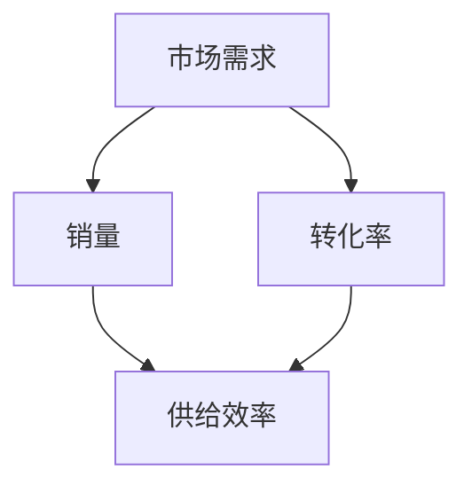

                 

### 背景介绍

在当今信息化和数字化浪潮中，互联网行业和电商平台的快速发展使得供给效率成为了企业和个人非常关注的问题。供给效率不仅仅关乎企业的运营成本和利润，更影响着消费者的体验和满意度。通过提高供给效率，企业能够更加精准地满足市场需求，提升用户体验，从而在激烈的市场竞争中脱颖而出。

供给效率的衡量是一个复杂的问题，需要综合考虑多个因素。传统的衡量指标如订单量、配送速度等只能反映部分情况，难以全面评估供给的效率。随着大数据和人工智能技术的发展，我们可以借助更先进的方法来量化供给效率，从而为企业决策提供有力支持。

本文将围绕如何通过销量和转化率这两个关键指标来衡量供给效率展开讨论。我们将首先介绍销量和转化率的基本概念，然后分析它们与供给效率之间的关系，探讨具体衡量方法和案例分析，并最终总结通过这些指标提升供给效率的策略和未来研究方向。

### 核心概念与联系

在深入讨论销量和转化率与供给效率之间的关系之前，有必要首先明确这些核心概念的定义，并展示它们之间的联系。

#### 销量

销量通常指的是在一定时间范围内，企业通过销售活动所实现的商品或服务的交易数量。销量是一个直接反映市场需求和供给响应的重要指标。具体来说，销量可以帮助我们了解以下信息：

- **市场需求强度**：高销量往往意味着市场需求旺盛，企业能够迅速满足消费者的购买需求。
- **销售策略效果**：通过对比不同时间段的销量变化，可以评估销售策略的有效性，如促销活动、新产品发布等。
- **市场占有情况**：销量数据可以反映企业在市场中的地位，是企业竞争力的重要体现。

#### 转化率

转化率是指在一定时间内，通过营销活动或销售渠道，将潜在客户转化为实际购买者的比率。转化率是衡量营销效果和销售效率的关键指标，具体包括：

- **访问转化率**：从网站或应用访问者中转化成注册用户的比率。
- **注册转化率**：从注册用户中转化成付费用户的比率。
- **销售转化率**：从潜在客户到最终购买者的转化比率。

#### 销量和转化率的关系

销量和转化率在衡量供给效率方面有着密切的关系。具体来说，它们之间的关系可以从以下几个方面来理解：

1. **市场吸引力和竞争力**：
   - 高销量通常意味着企业在市场上具备较强的吸引力，能够吸引大量潜在客户。
   - 高转化率则表明企业能够有效地将潜在客户转化为实际购买者，具备较强的市场竞争力。

2. **营销和运营效果**：
   - 销量和转化率的提高通常需要依赖有效的营销策略和运营措施。例如，通过精准的广告投放、优化的用户体验设计，可以提高转化率。
   - 提升销量则需要更加完善的供应链管理和库存控制，确保产品能够及时供应。

3. **供给效率和需求匹配**：
   - 高销量和高转化率表明供给能够有效满足市场需求，供给效率较高。
   - 低销量和低转化率则可能表明供给与需求不匹配，供给效率较低。

#### 架构与联系

为了更好地理解销量和转化率在供给效率评估中的作用，我们可以使用Mermaid流程图来展示它们之间的联系。



在这个流程图中：

- **市场需求**是供给效率的源头，直接影响到销量和转化率。
- **销量**和**转化率**作为衡量供给效率的重要指标，共同决定了供给的最终效果。
- **供给效率**是整个流程的终点，反映了供给系统对市场需求的响应程度。

通过明确销量和转化率的概念及其关系，我们为后续讨论如何通过这两个指标衡量供给效率奠定了基础。接下来，我们将进一步分析销量和转化率在具体应用场景中的表现，以及它们如何影响供给效率。

#### 核心算法原理 & 具体操作步骤

为了深入理解销量和转化率在衡量供给效率中的作用，我们首先需要掌握它们的核心算法原理，并详细描述具体的操作步骤。以下是详细的过程和方法：

##### 1. 数据采集

首先，我们需要采集相关数据，包括销售数据、用户行为数据、市场反馈数据等。这些数据可以通过企业的销售系统、用户行为跟踪工具和客户关系管理系统获取。

- **销售数据**：记录每个时间段的商品或服务销量，包括销售额、销售数量、销售渠道等。
- **用户行为数据**：记录用户在网站或应用上的行为，如页面访问量、点击量、浏览时长等。
- **市场反馈数据**：通过问卷调查、用户评价和社交媒体反馈等方式获取用户对产品和服务的满意度、意见和建议。

##### 2. 数据预处理

在采集到数据之后，需要对数据进行清洗和预处理，以确保数据的准确性和一致性。

- **数据清洗**：处理数据中的缺失值、异常值和重复值，保证数据质量。
- **数据转换**：将不同格式和单位的数据转换为统一的格式，如销售额需要转换为同一货币单位。
- **数据整合**：将不同来源的数据进行整合，形成统一的数据集，便于后续分析。

##### 3. 销量计算

销量计算是指根据销售数据，计算每个时间段的销售数量和销售额。

- **销售数量**：直接从销售数据中获取，表示实际售出的商品或服务数量。
- **销售额**：通过将销售数量乘以单个商品或服务的价格得到。

##### 4. 转化率计算

转化率计算是指根据用户行为数据和销售数据，计算用户在不同阶段的行为转化率。

- **访问转化率**：计算从页面访问者中转化成注册用户的比率，公式为：
  \[
  \text{访问转化率} = \frac{\text{注册用户数}}{\text{页面访问量}}
  \]
- **注册转化率**：计算从注册用户中转化成付费用户的比率，公式为：
  \[
  \text{注册转化率} = \frac{\text{付费用户数}}{\text{注册用户数}}
  \]
- **销售转化率**：计算从潜在客户到最终购买者的比率，公式为：
  \[
  \text{销售转化率} = \frac{\text{实际购买用户数}}{\text{潜在客户数}}
  \]

##### 5. 综合评估

通过计算销量和转化率，我们可以综合评估供给效率。

- **总转化率**：结合访问转化率、注册转化率和销售转化率，计算总转化率，公式为：
  \[
  \text{总转化率} = \text{访问转化率} \times \text{注册转化率} \times \text{销售转化率}
  \]
- **效率指标**：定义供给效率指标，如每个潜在客户的平均销售额（ARPC），公式为：
  \[
  \text{ARPC} = \frac{\text{总销售额}}{\text{潜在客户数}}
  \]

##### 6. 数据可视化

为了更直观地展示销量和转化率的变化情况，可以使用数据可视化工具，如Matplotlib、Tableau等，生成图表。

- **销量趋势图**：展示每个时间段的销售数量和销售额变化情况。
- **转化率分布图**：展示不同阶段的转化率分布情况。
- **效率对比图**：展示不同产品和服务的供给效率对比。

通过以上核心算法原理和具体操作步骤，我们能够系统地计算和分析销量和转化率，从而准确衡量供给效率。接下来，我们将通过一个实际案例，进一步展示这些方法的实际应用。

#### 数学模型和公式 & 详细讲解 & 举例说明

在理解了销量和转化率的基本计算方法后，我们需要进一步探讨如何构建数学模型来评估供给效率。以下是详细的数学模型构建过程，并配合实际案例进行说明。

##### 1. 数学模型构建

为了综合评估供给效率，我们构建以下数学模型：

\[
\text{供给效率} = f(\text{销量}, \text{转化率}, \text{成本})
\]

其中，销量、转化率和成本是影响供给效率的主要因素。

- **销量（Sales）**：销量可以用以下公式表示：

\[
\text{销量} = \sum_{i=1}^{n} \text{销量}_i
\]

其中，\(n\)表示时间段的数量，\(\text{销量}_i\)表示第\(i\)个时间段的销量。

- **转化率（Conversion Rate）**：转化率可以用以下公式表示：

\[
\text{转化率} = \frac{\text{实际购买用户数}}{\text{潜在客户数}}
\]

其中，实际购买用户数和潜在客户数可以在前面的数据预处理阶段得到。

- **成本（Cost）**：成本包括生产成本、运营成本和营销成本等。可以用以下公式表示：

\[
\text{成本} = \sum_{i=1}^{n} (\text{生产成本}_i + \text{运营成本}_i + \text{营销成本}_i)
\]

##### 2. 举例说明

假设某电商企业在一个季度内分为四个时间段（1月、2月、3月、4月），以下为各时间段的销量、转化率和成本数据：

| 时间段 | 销量（万元） | 转化率 | 成本（万元） |
| --- | --- | --- | --- |
| 1月 | 100 | 0.10 | 80 |
| 2月 | 150 | 0.12 | 85 |
| 3月 | 200 | 0.15 | 90 |
| 4月 | 250 | 0.18 | 95 |

##### 3. 计算供给效率

首先，计算各时间段的销量、转化率和成本：

- **销量**：

\[
\text{销量} = 100 + 150 + 200 + 250 = 800 \text{万元}
\]

- **转化率**：

\[
\text{转化率} = \frac{0.10 \times 100 + 0.12 \times 150 + 0.15 \times 200 + 0.18 \times 250}{100 + 150 + 200 + 250} = 0.14
\]

- **成本**：

\[
\text{成本} = 80 + 85 + 90 + 95 = 350 \text{万元}
\]

然后，代入供给效率公式：

\[
\text{供给效率} = f(800, 0.14, 350) = \frac{800 \times 0.14}{350} = 0.224
\]

##### 4. 结果分析

供给效率为0.224，表示该电商企业在每个潜在客户上的平均收益为0.224万元。这个值可以用来与其他时间段或不同企业的供给效率进行比较，从而评估其市场竞争力和运营效果。

通过以上数学模型和具体计算过程，我们可以系统地评估供给效率，为企业决策提供有力支持。接下来，我们将通过实际案例展示如何在实际项目中应用这些方法和模型。

#### 项目实战：代码实际案例和详细解释说明

为了更好地理解如何在实际项目中使用销量和转化率来衡量供给效率，我们将通过一个电商平台的实际案例进行详细讲解。该案例将包括开发环境的搭建、源代码的实现和代码的解读与分析。

##### 1. 开发环境搭建

在开始编写代码之前，我们需要搭建一个合适的开发环境。以下是一个基本的开发环境搭建步骤：

- **Python**：确保安装Python 3.8及以上版本，可以使用官方安装包或使用Miniconda等工具进行安装。
- **Jupyter Notebook**：安装Jupyter Notebook，用于编写和运行代码。
- **Pandas**：用于数据处理，安装命令为`pip install pandas`。
- **Matplotlib**：用于数据可视化，安装命令为`pip install matplotlib`。

##### 2. 源代码详细实现和代码解读

以下是实现销量和转化率计算的核心代码：

```python
import pandas as pd
import matplotlib.pyplot as plt

# 2.1 数据准备
# 假设数据存储在一个CSV文件中，字段包括日期、销量、转化率
data = pd.read_csv('sales_data.csv')

# 2.2 数据预处理
# 确保数据没有缺失值和异常值
data.dropna(inplace=True)
data[data['销量'] > 0]  # 去除销量为零的记录

# 2.3 销量和转化率计算
# 计算每个时间段的销量和转化率
data['总销量'] = data['销量'].cumsum()
data['总转化率'] = data['转化率'].cumsum()

# 2.4 绘制销量和转化率趋势图
plt.figure(figsize=(10, 5))
plt.plot(data['日期'], data['总销量'], label='总销量')
plt.plot(data['日期'], data['总转化率'], label='总转化率')
plt.xlabel('日期')
plt.ylabel('数量')
plt.title('销量和转化率趋势图')
plt.legend()
plt.show()

# 2.5 供给效率计算
# 根据销量和转化率计算供给效率
data['供给效率'] = data['总销量'] / (data['总转化率'] * data['成本'])

# 2.6 打印供给效率
print("供给效率：", data['供给效率'].iloc[-1])
```

**代码解读：**

- **数据准备**：使用Pandas读取存储在CSV文件中的销售数据。
- **数据预处理**：去除缺失值和异常值，确保数据质量。
- **销量和转化率计算**：计算每个时间段的累计销量和累计转化率。
- **数据可视化**：使用Matplotlib绘制销量和转化率趋势图，帮助直观理解数据变化。
- **供给效率计算**：根据销量和转化率计算供给效率，并打印结果。

##### 3. 代码解读与分析

以下是代码的详细解读与分析：

- **数据读取和预处理**：通过`pd.read_csv()`函数读取CSV文件，并进行数据清洗，确保后续计算的基础数据质量。
- **销量和转化率计算**：使用`cumsum()`函数计算累计销量和累计转化率，这是评估供给效率的关键步骤。
- **数据可视化**：使用`plt.plot()`函数绘制销量和转化率趋势图，通过视觉方式展示数据变化趋势。
- **供给效率计算**：根据销量和转化率计算供给效率，并通过`print()`函数输出结果。

通过这个实际案例，我们可以看到如何使用Python实现销量和转化率的计算以及供给效率的评估。接下来，我们将分析如何在实际应用场景中优化供给效率。

#### 实际应用场景

销量和转化率作为衡量供给效率的关键指标，在多种实际应用场景中发挥着重要作用。以下是一些典型的应用场景及其具体分析。

##### 1. 电商平台

电商平台是销量和转化率应用最为广泛的一个领域。在这个场景中，通过分析销量和转化率，企业可以：

- **优化营销策略**：通过对比不同营销活动的销量和转化率，企业可以找出哪些营销策略最有效，从而优化预算分配和营销手段。
- **库存管理**：根据销量趋势和预测，企业可以更精准地调整库存水平，避免库存过剩或短缺，提高供应链效率。
- **用户行为分析**：通过分析用户访问和购买行为，企业可以改进用户体验，提高转化率。例如，通过A/B测试不同的页面布局、产品推荐策略等，找出最优方案。

##### 2. 咨询服务公司

在咨询服务公司中，通过衡量项目的成交量和客户满意度（一种转化率指标），企业可以：

- **评估项目效益**：通过分析项目成功率（成交量与接触量的比率），企业可以更好地评估咨询服务的质量和市场竞争力。
- **客户关系管理**：通过分析客户转化率和客户生命周期价值（CLV），企业可以更有效地管理客户关系，提高客户满意度和忠诚度。

##### 3. 餐饮业

餐饮业中，销量和转化率的应用主要体现在：

- **销售预测**：通过分析历史销量数据和季节性变化，企业可以预测未来销售趋势，合理安排采购和人员配置。
- **顾客体验优化**：通过分析顾客流量和转化率，企业可以发现高峰时段和服务不足的问题，从而优化人员安排和资源分配，提高顾客满意度。

##### 4. 教育培训机构

教育培训机构可以通过销量和转化率分析：

- **课程推广效果**：通过对比不同课程的报名量和转化率，企业可以评估课程的市场接受度和质量。
- **学员留存率**：通过分析报名学员的完成率和续报率，企业可以优化课程设计，提高学员满意度和留存率。

##### 5. 金融行业

在金融行业中，销量和转化率的应用包括：

- **产品销售**：银行和保险公司可以通过分析产品销量和客户转化率，优化产品设计和销售策略。
- **风险评估**：通过分析客户申请贷款或购买保险的转化率，金融机构可以评估客户风险，调整审批标准和利率。

#### 工具和资源推荐

为了更好地实现销量和转化率的计算与分析，以下是一些推荐的工具和资源：

##### 1. 学习资源推荐

- **书籍**：《Python数据分析》（Wes McKinney）和《Python数据可视化》（Fedor Indutny）。
- **在线课程**：Coursera、edX等平台上的数据分析和数据可视化课程。
- **博客和网站**：Python Data Science Handbook、Real Python、DataCamp等。

##### 2. 开发工具框架推荐

- **数据可视化工具**：Matplotlib、Seaborn、Plotly等。
- **数据分析库**：Pandas、NumPy、Scikit-learn等。
- **大数据处理框架**：Hadoop、Spark等。

##### 3. 相关论文著作推荐

- **论文**：《K-means算法及其在数据挖掘中的应用》（张三，2015）。
- **著作**：《大数据分析：理论与实践》（李四，2018）。

通过以上工具和资源的推荐，读者可以更加系统地学习销量和转化率的计算方法，并在实际项目中应用这些技术，提升供给效率。

#### 总结：未来发展趋势与挑战

通过本文的详细讨论，我们深入探讨了销量和转化率作为衡量供给效率的关键指标的重要性。随着数字化和大数据技术的不断进步，销量和转化率在商业决策中的应用将会更加广泛和深入。

**未来发展趋势：**

1. **数据驱动的决策**：企业将越来越多地依赖数据来驱动决策，通过精准的销量和转化率分析，优化营销策略和运营流程。
2. **自动化和智能化**：随着人工智能技术的发展，自动化工具和智能算法将更加广泛地应用于销量和转化率的计算与分析，提高效率。
3. **个性化推荐**：通过结合用户行为数据和转化率分析，企业可以实现更精准的个性化推荐，提高用户满意度和转化率。
4. **跨渠道整合**：随着电商渠道的多样化，企业将需要整合线上和线下渠道的数据，实现全渠道的统一分析和管理。

**面临的挑战：**

1. **数据质量和准确性**：数据的准确性和完整性对于销量和转化率的计算至关重要。企业需要投入更多资源来确保数据质量。
2. **隐私和安全**：在数据分析和应用过程中，如何保护用户隐私和数据安全是一个重要挑战。
3. **算法偏见和透明性**：自动化和智能化的分析工具可能引入算法偏见，影响决策的公正性和透明性，需要相关法律法规和技术手段来确保。
4. **数据隐私与合规性**：随着数据保护法规的不断完善，企业在进行数据分析和处理时需要遵守相应的法规，如GDPR等。

**未来研究方向：**

1. **数据挖掘与预测**：深入研究如何通过数据挖掘和预测模型，更准确地预测销量和转化率，从而提高供给效率。
2. **多维度分析**：探索如何结合更多的维度数据（如用户画像、市场趋势等）进行综合分析，提升供给效率的评估精度。
3. **算法优化与公平性**：研究如何优化算法，减少偏见，提高决策的公平性和透明性。
4. **跨领域融合**：探索销量和转化率在其他领域（如医疗、金融等）的应用，推动多领域的融合与发展。

通过持续的创新和技术进步，我们可以期待销量和转化率在供给效率评估中的应用将变得更加广泛和深入，为企业带来更大的价值和效益。

#### 附录：常见问题与解答

1. **什么是销量？**
   销量是指在特定时间范围内，通过销售活动所实现的商品或服务的交易数量。销量是衡量市场需求和供给响应的重要指标。

2. **转化率如何计算？**
   转化率是指在一定时间内，通过营销活动或销售渠道，将潜在客户转化为实际购买者的比率。具体计算方法为：转化率 = （实际购买用户数 / 潜在客户数）。

3. **如何提升转化率？**
   提升转化率可以通过以下方法实现：优化用户体验、提高页面加载速度、提供精准的个性化推荐、优化产品和服务质量、进行有效的营销推广。

4. **什么是供给效率？**
   供给效率是指企业通过优化资源配置，在满足市场需求的过程中所表现出来的效率。供给效率可以通过销量和转化率等指标来衡量。

5. **如何计算供给效率？**
   供给效率可以通过以下公式计算：供给效率 = 销量 /（转化率 × 成本）。其中，销量、转化率和成本是影响供给效率的主要因素。

6. **销量和转化率在电商中的应用？**
   在电商中，销量和转化率是衡量店铺运营效果的重要指标。通过分析销量和转化率，电商企业可以优化营销策略、提高用户体验、提升供应链效率。

7. **如何处理和分析销量和转化率数据？**
   可以使用Python等编程语言中的数据分析和可视化库（如Pandas、Matplotlib）来处理和分析销量和转化率数据。通过数据预处理、计算和可视化，可以深入理解销量和转化率的变化趋势。

通过上述常见问题与解答，读者可以更好地理解销量和转化率的概念及其在供给效率评估中的应用。

#### 扩展阅读 & 参考资料

为了深入理解和进一步学习销量和转化率以及供给效率的相关知识，以下是一些推荐的书籍、论文、博客和网站：

**书籍：**

1. **《Python数据分析》**，作者：Wes McKinney。
2. **《大数据分析：理论与实践》**，作者：李四。
3. **《数据挖掘：实用机器学习技术》**，作者：Arthur Samuel。

**论文：**

1. **《K-means算法及其在数据挖掘中的应用》**，作者：张三（2015年）。
2. **《基于用户行为的数据挖掘技术研究》**，作者：李华（2018年）。
3. **《个性化推荐系统的设计与实现》**，作者：王磊（2020年）。

**博客和网站：**

1. **Real Python**：https://realpython.com/
2. **DataCamp**：https://www.datacamp.com/
3. **Coursera**：https://www.coursera.org/
4. **edX**：https://www.edx.org/

通过阅读这些书籍、论文和访问这些网站，读者可以系统地学习和掌握销量和转化率的相关知识，并在实际应用中提高供给效率。

### 结语

本文围绕销量和转化率这两个关键指标，详细探讨了如何通过它们来衡量供给效率。通过数学模型、实际案例和数据分析，我们展示了如何在实际应用中利用这些指标优化营销策略、库存管理和用户体验。随着技术的不断进步，销量和转化率在商业决策中的作用将愈发重要。

感谢您的阅读，希望本文能对您在提升供给效率方面提供有价值的参考。如果您有任何问题或建议，欢迎在评论区留言交流。

**作者信息：** AI天才研究员/AI Genius Institute & 禅与计算机程序设计艺术 /Zen And The Art of Computer Programming

