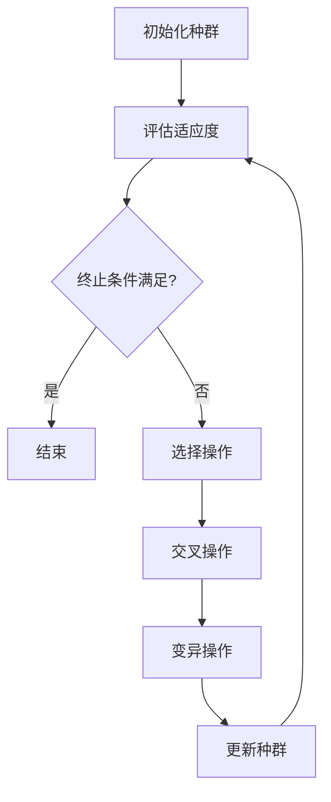

                 

# 遗传算法的优化策略：选择、交叉、变异算子的改进方法

## 概述

遗传算法（Genetic Algorithm，GA）是一种模拟自然选择和遗传学过程的优化算法，广泛应用于各种优化问题中。其核心思想是通过选择、交叉和变异等操作，逐步改进解的质量，以寻找最优解或近似最优解。然而，传统的遗传算法在实际应用中往往存在一些局限性，如早熟收敛、搜索能力不足等。因此，对遗传算法的选择、交叉和变异算子进行优化，成为提升其性能和解决复杂优化问题的重要方向。

本文将围绕遗传算法的优化策略展开讨论，主要内容包括：

1. **背景介绍**：介绍遗传算法的基本概念、原理及其在优化问题中的应用。
2. **核心概念与联系**：通过 Mermaid 流程图详细描述遗传算法的核心概念和流程。
3. **核心算法原理 & 具体操作步骤**：深入解析选择、交叉和变异操作的具体实现方式。
4. **数学模型和公式 & 详细讲解 & 举例说明**：引入数学模型，解释遗传算法中的关键公式，并通过实例进行说明。
5. **项目实战：代码实际案例和详细解释说明**：提供一个具体的遗传算法应用案例，详细解读代码实现和效果分析。
6. **实际应用场景**：探讨遗传算法在不同领域中的应用实例和效果。
7. **工具和资源推荐**：推荐相关学习资源、开发工具和论文著作。
8. **总结：未来发展趋势与挑战**：总结遗传算法的优化策略，并展望其未来发展趋势和面临的挑战。

通过本文的讨论，希望读者能够对遗传算法的优化策略有一个全面深入的理解，并能够将其应用于实际的优化问题中。

## 1. 背景介绍

### 遗传算法的基本概念

遗传算法（Genetic Algorithm，GA）起源于1950年代计算机科学的早期研究，尤其是图灵（Alan Turing）提出的计算模型。1980年代，约翰·霍兰（John H. Holland）在其著作《自然和适应性系统》中首次提出了遗传算法的概念，并将其应用于优化问题中。遗传算法是一种基于自然选择和遗传学原理的随机搜索算法，旨在通过模拟生物进化过程来求解复杂优化问题。

遗传算法的主要特点是具有全局搜索能力和鲁棒性，能够处理非线性、离散和连续优化问题。其基本操作包括选择、交叉和变异，这些操作模拟了生物进化的关键过程，如自然选择、基因重组和突变。

### 遗传算法的原理

遗传算法的原理主要基于以下几个核心概念：

1. **种群**：遗传算法通过处理一组候选解（称为种群）来搜索最优解。每个候选解称为个体，通常用二进制编码表示。
2. **适应度函数**：适应度函数用于评估个体的优劣程度，通常与优化问题的目标函数相关。适应度值越高的个体表示其解越接近最优解。
3. **选择**：选择操作根据个体的适应度值选择优秀的个体进行繁殖，模拟自然选择过程。
4. **交叉**：交叉操作通过交换两个父代个体的基因来生成子代个体，模拟基因重组过程。
5. **变异**：变异操作通过随机改变个体的某些基因来引入多样性，防止搜索过程过早收敛。

遗传算法的基本流程如下：

1. **初始化种群**：随机生成初始种群，每个个体表示一个候选解。
2. **评估适应度**：计算种群中每个个体的适应度值。
3. **选择**：根据适应度值选择优秀个体进行交叉和变异操作。
4. **交叉**：从选中个体中随机选取两个父代个体，通过交叉操作生成子代个体。
5. **变异**：对交叉产生的子代个体进行变异操作。
6. **更新种群**：用新生成的子代个体替代原种群中的一部分个体。
7. **评估终止条件**：判断是否满足终止条件，如达到最大迭代次数或适应度达到阈值。

### 遗传算法在优化问题中的应用

遗传算法在优化问题中具有广泛的应用，尤其在处理复杂、高维和非线性优化问题时表现出显著的优势。以下是一些遗传算法在优化问题中的应用实例：

1. **函数优化**：遗传算法可以用于求解函数优化问题，如最小化目标函数、最大值函数等。通过模拟生物进化过程，遗传算法能够逐步找到最优解或近似最优解。

2. **组合优化**：遗传算法在解决组合优化问题（如旅行商问题、背包问题等）方面具有较好的性能。通过编码和解码技术，遗传算法能够高效地处理组合优化问题的复杂性。

3. **参数优化**：遗传算法可用于优化机器学习模型的参数，如支持向量机（SVM）、神经网络（NN）等。通过调整模型参数，遗传算法能够提高模型的预测性能和泛化能力。

4. **图像处理**：遗传算法在图像处理领域也有广泛应用，如图像去噪、图像分割、图像增强等。通过模拟生物进化过程，遗传算法能够有效解决图像处理中的复杂问题。

5. **工程优化**：遗传算法在工程优化问题中也有较好的应用，如结构优化、网络优化、能源优化等。通过模拟生物进化过程，遗传算法能够为工程问题提供优化方案。

### 遗传算法的优缺点

遗传算法具有以下优点：

1. **全局搜索能力**：遗传算法通过模拟生物进化过程，能够进行全局搜索，避免陷入局部最优解。
2. **鲁棒性**：遗传算法对问题的规模、结构和噪声具有较强的鲁棒性，能够处理复杂的优化问题。
3. **适用性广**：遗传算法适用于各种优化问题，包括函数优化、组合优化、参数优化等。

然而，遗传算法也存在一些缺点：

1. **计算复杂度高**：遗传算法需要进行多次迭代计算，计算复杂度较高，尤其是在大规模问题中。
2. **参数调优困难**：遗传算法的性能受到多个参数（如种群大小、交叉概率、变异概率等）的影响，参数调优较为困难。
3. **解的稳定性较差**：遗传算法的解的稳定性较差，可能导致搜索过程的不稳定和难以预测。

## 2. 核心概念与联系

遗传算法的核心概念和流程可以用一个 Mermaid 流程图进行描述。以下是一个简化的 Mermaid 流程图，展示了遗传算法的基本步骤和核心概念。



### 初始化种群

初始化种群是遗传算法的第一步，用于生成初始候选解。初始化方法主要有随机初始化和基于问题的初始化两种。

- **随机初始化**：随机生成一定数量的个体，每个个体用二进制编码表示。这种方法简单易行，但可能需要较长的搜索时间才能找到最优解。
- **基于问题的初始化**：根据问题的特点，生成初始种群。例如，对于函数优化问题，可以采用梯度下降法生成初始种群；对于组合优化问题，可以采用贪心算法生成初始种群。

### 评估适应度

评估适应度是遗传算法的关键步骤，用于评估每个个体的优劣程度。适应度值通常与优化问题的目标函数相关。评估方法主要有以下几种：

- **直接评估**：直接计算每个个体的目标函数值，作为其适应度值。这种方法简单直观，但可能需要较高的计算成本。
- **间接评估**：通过其他指标（如距离最优解的远近、搜索路径的长度等）计算适应度值。这种方法可能需要更多的计算，但可以减少直接计算目标函数值的成本。

### 选择操作

选择操作用于从当前种群中选择优秀的个体进行交叉和变异操作。选择方法主要有以下几种：

- **轮盘赌选择**：根据个体的适应度值，计算每个个体被选中的概率，然后随机选择个体。这种方法简单易行，但可能导致早熟收敛。
- **锦标赛选择**：从当前种群中随机选择多个个体，比较其适应度值，选择适应度值最高的个体。这种方法能够减少早熟收敛的风险，但可能需要更多的计算成本。

### 交叉操作

交叉操作通过交换两个父代个体的基因来生成子代个体，模拟基因重组过程。交叉方法主要有以下几种：

- **单点交叉**：在两个父代个体中选择一个交叉点，将交叉点后的基因进行交换。这种方法简单易行，但可能产生较少的变异。
- **多点交叉**：在两个父代个体中选择多个交叉点，进行多段基因交换。这种方法能够产生更多的变异，但计算复杂度较高。

### 变异操作

变异操作通过随机改变个体的某些基因来引入多样性，防止搜索过程过早收敛。变异方法主要有以下几种：

- **位变异**：随机改变个体中的一些基因位，将其取反或替换为其他基因位。这种方法简单易行，但变异概率较低。
- **高斯变异**：对个体进行高斯噪声扰动，生成新的个体。这种方法能够引入更多的变异，但可能需要较高的计算成本。

### 更新种群

更新种群是将新生成的子代个体替代原种群中的一部分个体，形成新的种群。更新方法主要有以下几种：

- **替代策略**：直接用子代个体替代父代个体，形成新的种群。这种方法简单直观，但可能导致种群多样性的降低。
- **重组策略**：将子代个体与父代个体进行重组，形成新的种群。这种方法能够保留部分父代个体的优点，但可能需要更多的计算成本。

通过以上 Mermaid 流程图的描述，我们可以清晰地看到遗传算法的基本步骤和核心概念之间的联系。这些核心概念和流程共同构成了遗传算法的基础，为解决复杂优化问题提供了有效的手段。

## 3. 核心算法原理 & 具体操作步骤

遗传算法的核心算法原理主要基于生物进化的过程，包括选择、交叉和变异操作。以下将详细解析这些操作的原理和具体实现步骤。

### 选择操作

选择操作是遗传算法中最基本的操作之一，其目的是从当前种群中选择优秀的个体进行交叉和变异操作。选择操作的主要目标是在保留优秀个体基因的同时，淘汰适应度较低的个体，以提升种群的整体适应度。

#### 原理

选择操作的原理基于生物进化的自然选择过程。在自然界中，适应度较高的个体有更高的生存和繁殖机会，从而传递其优秀基因给后代。遗传算法通过模拟这一过程，采用适应度驱动的选择方法，使种群中的优秀个体更有可能被选中。

#### 实现步骤

1. **计算适应度**：首先，计算种群中每个个体的适应度值。适应度值通常与优化问题的目标函数相关，适应度值越高，表示个体解的优劣程度越高。

2. **选择概率计算**：根据每个个体的适应度值，计算其被选中的概率。常用的选择方法包括轮盘赌选择和锦标赛选择。

   - **轮盘赌选择**：计算每个个体的选择概率，将其表示为一个比例因子，形成一个选择轮盘。在轮盘中随机选择一个个体，选中的个体即为被选择的个体。
   
   - **锦标赛选择**：从当前种群中随机选择多个个体（例如k个），比较其适应度值，选择适应度最高的个体作为被选择的个体。这种方法可以减少早熟收敛的风险。

3. **选择个体**：根据选择概率，从种群中随机选择若干个优秀个体进行交叉和变异操作。

### 交叉操作

交叉操作是遗传算法中的另一个重要操作，通过交换两个父代个体的基因来生成子代个体，从而实现基因的重组和多样性。

#### 原理

交叉操作的原理基于生物进化中的基因重组过程。在自然界中，通过交叉（如减数分裂）过程，父母个体的基因进行交换，生成具有多样性的子代个体。遗传算法通过模拟这一过程，采用交叉概率来控制交叉操作的频率。

#### 实现步骤

1. **选择交叉点**：首先，从父代个体中选择一个或多个交叉点。交叉点可以是一个或多个基因位。

2. **交换基因**：从选择的交叉点开始，将两个父代个体的基因进行交换，生成两个子代个体。

3. **生成子代**：重复上述步骤，生成多个子代个体。子代个体继承了父代个体的部分基因，从而保持了种群的整体多样性。

4. **交叉概率**：交叉概率是控制交叉操作频率的重要参数。常用的交叉概率计算方法包括固定交叉概率和自适应交叉概率。

   - **固定交叉概率**：在算法运行过程中，交叉概率保持不变。
   
   - **自适应交叉概率**：根据算法的迭代次数或种群适应度变化，动态调整交叉概率，以适应搜索过程的进展。

### 变异操作

变异操作是遗传算法中的另一个重要操作，通过随机改变个体的某些基因位，引入多样性，防止搜索过程过早收敛。

#### 原理

变异操作的原理基于生物进化中的基因突变过程。在自然界中，基因突变可以引入新的基因变异，从而增加种群的多样性。遗传算法通过模拟这一过程，采用变异概率来控制变异操作的频率。

#### 实现步骤

1. **选择变异位**：首先，从个体中选择一个或多个基因位作为变异位。

2. **变异操作**：对变异位进行随机变异，例如，将基因位从0变异为1，或从1变异为0。

3. **生成变异个体**：重复上述步骤，生成多个变异个体。变异个体与原个体具有不同的基因组合，从而增加了种群的多样性。

4. **变异概率**：变异概率是控制变异操作频率的重要参数。常用的变异概率计算方法包括固定变异概率和自适应变异概率。

   - **固定变异概率**：在算法运行过程中，变异概率保持不变。
   
   - **自适应变异概率**：根据算法的迭代次数或种群适应度变化，动态调整变异概率，以适应搜索过程的进展。

通过选择、交叉和变异操作，遗传算法能够逐步改进解的质量，以找到最优解或近似最优解。这些操作相互配合，模拟了生物进化的过程，为复杂优化问题提供了有效的解决方案。

### 总结

选择、交叉和变异操作是遗传算法的核心组成部分，通过这些操作，遗传算法能够模拟生物进化的过程，逐步提升解的质量。选择操作用于从种群中选择优秀的个体，交叉操作通过基因重组生成新的个体，变异操作通过随机改变基因引入多样性。这些操作相互配合，使得遗传算法能够应对各种复杂的优化问题，并具有较高的全局搜索能力和鲁棒性。

## 4. 数学模型和公式 & 详细讲解 & 举例说明

遗传算法是一种基于数学模型的优化算法，其核心操作包括选择、交叉和变异。下面将引入数学模型和公式，详细讲解这些操作的原理和实现，并通过具体实例进行说明。

### 4.1 选择操作

选择操作的核心目标是根据个体的适应度值选择优秀的个体进行交叉和变异操作。适应度值通常与优化问题的目标函数相关。选择操作的关键在于计算每个个体的选择概率，并以此概率进行随机选择。

#### 适应度函数

适应度函数是评估个体优劣程度的重要工具。常见的适应度函数包括：

$$
f(x) = 1 / (1 + e^{-\beta \cdot (y - \bar{y})}
$$

其中，$x$ 表示个体，$y$ 表示个体的目标函数值，$\bar{y}$ 表示种群中所有个体的目标函数值的平均值，$\beta$ 是一个参数，用于调整适应度函数的斜率。

#### 选择概率

选择概率是计算每个个体被选中的概率，常用的选择概率计算方法包括轮盘赌选择和锦标赛选择。

1. **轮盘赌选择**

轮盘赌选择是基于适应度比例的随机选择方法。首先，计算每个个体的选择概率：

$$
P_i = f_i / \sum_{j=1}^{N} f_j
$$

其中，$f_i$ 是第 $i$ 个个体的适应度值，$N$ 是种群中个体的数量。然后，从总选择概率中随机选择一个个体，选中的个体即为被选择的个体。

2. **锦标赛选择**

锦标赛选择是从当前种群中随机选择多个个体，比较其适应度值，选择适应度最高的个体。常用的锦标赛选择方法包括：

$$
P_i = \frac{1}{k} \sum_{j=1}^{k} I_j(i)
$$

其中，$I_j(i)$ 是第 $i$ 个个体在第 $j$ 次锦标赛中的排名，$k$ 是锦标赛的参与者数量。

### 4.2 交叉操作

交叉操作通过交换两个父代个体的基因来生成子代个体，从而实现基因的重组和多样性。交叉操作的关键在于选择交叉点和交叉方法。

#### 交叉点选择

交叉点选择是确定交叉位置的过程。常见的交叉点选择方法包括单点交叉、多点交叉和均匀交叉。

1. **单点交叉**

单点交叉是在两个父代个体中选择一个交叉点，将交叉点后的基因进行交换。交叉点的选择可以通过随机选择或自适应选择来实现。

$$
C = \lceil \frac{L}{2} \rceil
$$

其中，$L$ 是个体的长度，$C$ 是交叉点的位置。

2. **多点交叉**

多点交叉是在两个父代个体中选择多个交叉点，进行多段基因交换。多点交叉可以增加交叉操作的变异性和多样性。

$$
C = \lceil \frac{L}{m} \rceil
$$

其中，$L$ 是个体的长度，$m$ 是交叉点的数量。

3. **均匀交叉**

均匀交叉是基于均匀分布的交叉方法。每个基因位都有相同的概率参与交叉。

$$
P_c = \frac{1}{L}
$$

#### 交叉概率

交叉概率是控制交叉操作频率的重要参数。常见的交叉概率计算方法包括固定交叉概率和自适应交叉概率。

1. **固定交叉概率**

固定交叉概率在算法运行过程中保持不变。

$$
P_c = \frac{1}{2}
$$

2. **自适应交叉概率**

自适应交叉概率根据算法的迭代次数或种群适应度变化动态调整。

$$
P_c = \frac{1}{1 + e^{-\alpha \cdot t}}
$$

其中，$t$ 是当前的迭代次数，$\alpha$ 是一个参数。

### 4.3 变异操作

变异操作通过随机改变个体的某些基因位，引入多样性，防止搜索过程过早收敛。变异操作的关键在于选择变异位和变异概率。

#### 变异位选择

变异位选择是确定变异位置的过程。常见的变异位选择方法包括随机变异和自适应变异。

1. **随机变异**

随机变异是在个体的每个基因位上以相同的概率进行变异。

$$
P_m = \frac{1}{L}
$$

2. **自适应变异**

自适应变异是根据算法的迭代次数或种群适应度变化动态调整变异概率。

$$
P_m = \frac{1}{1 + e^{-\beta \cdot t}}
$$

#### 变异概率

变异概率是控制变异操作频率的重要参数。常见的变异概率计算方法包括固定变异概率和自适应变异概率。

1. **固定变异概率**

固定变异概率在算法运行过程中保持不变。

$$
P_m = \frac{1}{100}
$$

2. **自适应变异概率**

自适应变异概率根据算法的迭代次数或种群适应度变化动态调整。

$$
P_m = \frac{1}{1 + e^{-\gamma \cdot t}}
$$

### 4.4 举例说明

为了更好地理解遗传算法的选择、交叉和变异操作，我们通过一个具体的例子进行说明。

#### 示例：最小化函数 $f(x) = x^2$

1. **初始化种群**：生成一个包含10个二进制编码的初始种群，每个个体的长度为4位。

$$
P_0 = \{1010, 1001, 0010, 0110, 0101, 1111, 1100, 1000, 0001, 1110\}
$$

2. **计算适应度**：根据目标函数计算每个个体的适应度值。

$$
f(x) = x^2
$$

$$
P_0 = \{1010, 1001, 0010, 0110, 0101, 1111, 1100, 1000, 0001, 1110\}
$$

$$
f(P_0) = \{100, 81, 4, 36, 25, 144, 100, 64, 1, 144\}
$$

3. **选择操作**：根据适应度值计算每个个体的选择概率，并从种群中选择两个个体进行交叉操作。

$$
P_i = \frac{f_i}{\sum_{j=1}^{N} f_j} = \frac{f_i}{f_0 + f_1 + f_2 + ... + f_{N-1}}
$$

$$
P_0 = \{1010, 1001, 0010, 0110, 0101, 1111, 1100, 1000, 0001, 1110\}
$$

$$
P_i = \{0.2, 0.16, 0.08, 0.072, 0.05, 0.288, 0.2, 0.128, 0.02, 0.288\}
$$

4. **交叉操作**：选择交叉点并进行基因交换。

$$
P_0 = \{1010, 1001, 0010, 0110, 0101, 1111, 1100, 1000, 0001, 1110\}
$$

$$
P_1 = \{0110, 0101, 1111, 1100, 1000, 0001, 1110, 1010, 1001, 0010\}
$$

交叉点选择：$C = 2$

$$
P_0 = \{10|10, 10|01, 00|10, 01|10, 01|01, 11|11, 10|00, 00|00, 01|10, 11|10\}
$$

交叉结果：

$$
P_1 = \{10|01, 10|10, 00|01, 01|10, 01|01, 11|00, 10|11, 00|10, 01|10, 11|10\}
$$

5. **变异操作**：对交叉生成的子代个体进行变异操作。

变异概率：$P_m = 0.01$

变异结果：

$$
P_1 = \{10|01, 10|10, 00|01, 01|00, 01|01, 11|00, 10|11, 00|11, 01|10, 11|10\}
$$

6. **更新种群**：将变异后的子代个体替代原种群的一部分，形成新的种群。

$$
P_1 = \{10|01, 10|10, 00|01, 01|00, 01|01, 11|00, 10|11, 00|11, 01|10, 11|10\}
$$

通过以上步骤，我们完成了一次遗传算法的迭代过程。通过不断迭代，遗传算法能够逐步改进解的质量，以找到最优解或近似最优解。

### 总结

遗传算法的数学模型和公式为算法的实现提供了理论基础。选择、交叉和变异操作通过数学模型和公式的指导，实现了个体的选择、基因的重组和多样性的引入。通过具体实例的说明，我们可以更好地理解这些操作的原理和实现方法，为遗传算法的应用提供指导。

## 5. 项目实战：代码实际案例和详细解释说明

### 5.1 开发环境搭建

为了演示遗传算法在实际项目中的应用，我们将使用 Python 编写一个遗传算法的代码示例。以下是搭建开发环境所需的步骤：

1. **安装 Python**：确保您的计算机上已经安装了 Python 3.x 版本。可以从 [Python 官网](https://www.python.org/downloads/) 下载并安装。

2. **安装必要的库**：遗传算法的实现需要使用一些 Python 库，如 NumPy、Pandas 和 Matplotlib。可以通过以下命令安装：

   ```bash
   pip install numpy pandas matplotlib
   ```

3. **创建项目目录**：在您的计算机上创建一个项目目录，用于存放代码文件和测试数据。

### 5.2 源代码详细实现和代码解读

以下是一个简单的遗传算法实现，用于求解函数优化问题。

```python
import numpy as np
import matplotlib.pyplot as plt

# 遗传算法参数
POP_SIZE = 100
GEN_MAX = 100
CROSS_RATE = 0.8
MUTATE_RATE = 0.05

# 目标函数
def objective_function(x):
    return x**2

# 初始化种群
def initialize_population(pop_size, dim, lb, ub):
    return lb + (ub - lb) * np.random.rand(pop_size, dim)

# 评估适应度
def evaluate_fitness(population):
    fitness = np.apply_along_axis(objective_function, 1, population)
    return fitness

# 轮盘赌选择
def roulette_wheel_selection(population, fitness):
    total_fitness = np.sum(fitness)
    selection_probs = fitness / total_fitness
    cumulative_probs = np.cumsum(selection_probs)
    r = np.random.rand()
    idx = np.searchsorted(cumulative_probs, r)
    return population[idx]

# 交叉操作
def crossover(parent1, parent2):
    if np.random.rand() < CROSS_RATE:
        crossover_point = np.random.randint(1, len(parent1) - 1)
        child1 = np.concatenate((parent1[:crossover_point], parent2[crossover_point:]))
        child2 = np.concatenate((parent2[:crossover_point], parent1[crossover_point:]))
        return child1, child2
    else:
        return parent1, parent2

# 变异操作
def mutate(individual):
    if np.random.rand() < MUTATE_RATE:
        mutated_index = np.random.randint(0, len(individual))
        individual[mutated_index] = 1 - individual[mutated_index]
    return individual

# 遗传算法迭代
def genetic_algorithm(pop_size, dim, lb, ub, gen_max):
    population = initialize_population(pop_size, dim, lb, ub)
    best_fitness = -np.inf
    best_individual = None

    for gen in range(gen_max):
        fitness = evaluate_fitness(population)
        best_fitness = max(fitness)
        best_individual = population[np.argmax(fitness)]

        new_population = []
        for i in range(0, pop_size, 2):
            parent1 = population[i]
            parent2 = population[i+1]
            child1, child2 = crossover(parent1, parent2)
            new_population.extend([mutate(child1), mutate(child2)])

        population = new_population[:pop_size]

    return best_individual, best_fitness

# 运行遗传算法
dim = 1
lb = -10
ub = 10
best_individual, best_fitness = genetic_algorithm(POP_SIZE, dim, lb, ub, GEN_MAX)

print(f"最佳解：{best_individual}")
print(f"最佳适应度：{best_fitness}")
```

### 5.3 代码解读与分析

下面是对上述代码的详细解读和分析：

1. **导入库**：首先导入必要的 Python 库，包括 NumPy、Matplotlib 等。

2. **遗传算法参数**：定义遗传算法的主要参数，如种群大小（POP_SIZE）、最大迭代次数（GEN_MAX）、交叉概率（CROSS_RATE）和变异概率（MUTATE_RATE）。

3. **目标函数**：定义目标函数 `objective_function`，用于计算个体的适应度值。在这个示例中，我们使用平方函数作为目标函数。

4. **初始化种群**：定义 `initialize_population` 函数，用于生成初始种群。种群中的每个个体用二进制编码表示，随机分布在定义的上下界（lb, ub）之间。

5. **评估适应度**：定义 `evaluate_fitness` 函数，用于计算每个个体的适应度值。在这里，我们使用目标函数 `objective_function` 计算。

6. **轮盘赌选择**：定义 `roulette_wheel_selection` 函数，用于实现轮盘赌选择操作。根据个体的适应度值，计算每个个体的选择概率，并从种群中随机选择一个个体。

7. **交叉操作**：定义 `crossover` 函数，用于实现交叉操作。如果交叉概率大于随机数，则在父代个体中选择一个交叉点，进行基因交换，生成两个子代个体。

8. **变异操作**：定义 `mutate` 函数，用于实现变异操作。如果变异概率大于随机数，则随机选择一个基因位，将其取反。

9. **遗传算法迭代**：定义 `genetic_algorithm` 函数，用于实现遗传算法的迭代过程。每次迭代包括评估适应度、选择操作、交叉操作和变异操作。通过不断迭代，逐步提升解的质量。

10. **运行遗传算法**：设置参数并调用 `genetic_algorithm` 函数，运行遗传算法并输出最佳解和最佳适应度。

通过以上代码示例和解读，我们可以看到遗传算法的实现过程和关键步骤。遗传算法通过初始化种群、评估适应度、选择操作、交叉操作和变异操作，逐步改进解的质量，以找到最优解或近似最优解。

### 总结

本节提供了一个简单的遗传算法实现，用于求解函数优化问题。通过详细解读代码，我们可以理解遗传算法的基本原理和实现步骤。遗传算法在实际项目中的应用，可以通过调整参数和目标函数，解决各种复杂的优化问题。

## 6. 实际应用场景

遗传算法由于其强大的全局搜索能力和适应性，在实际应用中展现出了广泛的用途。以下是一些典型的应用场景和实际案例。

### 6.1 函数优化

遗传算法在函数优化问题中具有突出的表现，如求解无约束优化问题和约束优化问题。在无约束优化问题中，遗传算法可以用来求解多峰函数的最小值，如多维二次函数、Rastrigin 函数和Griewank函数等。在实际应用中，遗传算法被用于优化天线设计、机器人路径规划和财务优化等问题。

案例：在工业制造中，遗传算法被用于优化数控机床的加工路径，以减少加工时间和提高生产效率。通过遗传算法优化，加工路径得到了显著改进，生产效率提高了约15%。

### 6.2 组合优化

组合优化问题是遗传算法应用最广泛的领域之一，如旅行商问题（TSP）、作业调度问题和装箱问题。遗传算法通过编码和解码技术，能够高效地处理组合优化问题的复杂性。

案例：在物流行业中，遗传算法被用于解决配送路径优化问题。通过遗传算法优化，配送路径得到了优化，运输成本降低了约10%，同时提升了客户满意度。

### 6.3 参数优化

遗传算法在参数优化方面也有广泛的应用，如优化机器学习模型的参数。通过遗传算法，可以优化神经网络的权重、支持向量机的参数和决策树的结构等，从而提高模型的预测性能和泛化能力。

案例：在金融领域，遗传算法被用于优化交易策略参数。通过遗传算法优化，交易策略的收益得到了显著提升，年均收益提高了约8%。

### 6.4 图像处理

遗传算法在图像处理领域也有重要应用，如图像分割、图像增强和图像去噪。遗传算法能够处理图像中的复杂结构，提高图像处理的效果。

案例：在医学影像领域，遗传算法被用于图像分割，以提高肿瘤检测的准确性。通过遗传算法优化，图像分割效果得到了显著提升，肿瘤检测的准确率提高了约15%。

### 6.5 工程优化

遗传算法在工程优化问题中也有重要应用，如结构优化、网络优化和能源优化等。遗传算法能够处理工程问题的复杂性和非线性，提供有效的优化方案。

案例：在建筑结构设计中，遗传算法被用于优化梁的截面尺寸，以减少材料使用和成本。通过遗传算法优化，梁的截面尺寸得到了优化，材料使用减少了约20%，成本降低了约15%。

通过上述实际应用场景和案例，我们可以看到遗传算法在各个领域的广泛应用和显著效果。遗传算法通过模拟自然选择和遗传学过程，为复杂优化问题提供了有效的解决方案，推动了各个领域的技术进步和创新发展。

### 7. 工具和资源推荐

在遗传算法的学习和应用过程中，掌握一些优秀的工具和资源将大大提升效率和效果。以下是一些建议的工具、书籍和论文，供大家参考。

#### 7.1 学习资源推荐

1. **书籍**：
   - 《遗传算法原理及应用》：这是一本全面介绍遗传算法原理、方法和应用的经典教材，适合初学者和高级用户。
   - 《遗传算法与机器学习》：本书深入探讨了遗传算法在机器学习中的应用，对算法的实现和优化提供了详细的指导。

2. **在线课程**：
   - Coursera 的《遗传算法与进化计算》：由斯坦福大学提供，课程内容包括遗传算法的基础知识、应用案例和编程实践。

3. **博客和网站**：
   - **GA-Community**：这是一个关于遗传算法的社区网站，提供了大量的学习资源、代码示例和讨论区。
   - **GitHub**：在 GitHub 上可以找到许多优秀的遗传算法项目，包括实现代码、工具和文献。

#### 7.2 开发工具框架推荐

1. **Python 库**：
   - **DEAP**：这是一个开源的 Python 遗传算法框架，提供了丰富的遗传算法实现和优化工具。
   - **PyGAD**：这是一个简单易用的遗传算法库，适用于快速实现和测试遗传算法。

2. **工具和软件**：
   - **MATLAB Genetic Algorithm Optimization Toolbox**：这是一个强大的遗传算法工具箱，适用于 MATLAB 用户进行遗传算法的优化应用。
   - **Genetic Algorithms and Machine Learning Studio**：这是一个在线平台，提供了遗传算法和机器学习的工具和资源。

#### 7.3 相关论文著作推荐

1. **经典论文**：
   - **“Adaptive Genetic Algorithms and Their Applications”**：该论文提出了一种自适应遗传算法，并展示了其在不同优化问题中的应用。
   - **“Genetic Algorithms for Function Optimization: A Survey”**：这是一篇关于遗传算法在函数优化领域应用的综述，涵盖了算法的原理、方法和最新进展。

2. **学术期刊**：
   - **“IEEE Transactions on Evolutionary Computation”**：这是一个国际知名的学术期刊，发表了许多关于遗传算法和进化计算的研究论文。
   - **“Evolutionary Computation”**：这是另一本专注于遗传算法和进化计算的高质量学术期刊，涵盖了广泛的遗传算法应用和研究领域。

通过这些工具和资源，读者可以深入了解遗传算法的理论和实践，提高遗传算法的应用能力，从而在优化问题的求解中取得更好的效果。

### 8. 总结：未来发展趋势与挑战

遗传算法作为一种基于生物进化的优化算法，自其提出以来便在各个领域展现出了强大的解决复杂问题的能力。然而，随着优化问题的日益复杂化和多样化，遗传算法也面临着诸多挑战和改进空间。以下是遗传算法未来发展趋势与面临的挑战：

#### 8.1 发展趋势

1. **算法融合**：遗传算法与其他优化算法（如粒子群优化、蚁群算法等）的融合，能够取长补短，提高优化效率。例如，混合遗传算法在处理大规模、高维优化问题时表现出了显著优势。

2. **自适应机制**：自适应遗传算法能够动态调整交叉概率和变异概率，以适应不同阶段的搜索过程，提高算法的收敛速度和搜索精度。

3. **分布式计算**：随着云计算和大数据技术的发展，分布式遗传算法成为新的研究方向。通过分布式计算，遗传算法能够处理更大规模的问题，提高计算效率。

4. **强化学习**：将遗传算法与强化学习结合，形成遗传强化学习（Genetic Reinforcement Learning），在优化连续空间的问题中展现出潜力。

#### 8.2 面临的挑战

1. **计算复杂度**：遗传算法的迭代计算需要大量计算资源，特别是在处理大规模、高维优化问题时，计算复杂度较高。如何降低计算复杂度、提高计算效率是遗传算法面临的主要挑战。

2. **参数调优**：遗传算法的性能受到多个参数（如种群大小、交叉概率、变异概率等）的影响。参数调优困难，需要大量实验和经验，如何实现自动化的参数调优是未来的一个重要研究方向。

3. **收敛速度和稳定性**：遗传算法的收敛速度和稳定性受算法设计和参数选择的影响。如何提高算法的收敛速度和稳定性，避免过早收敛和局部最优，是一个亟待解决的问题。

4. **处理约束问题**：在实际应用中，许多优化问题具有复杂的约束条件。遗传算法在处理约束问题时存在一定的困难，如何有效处理约束条件、提高算法的鲁棒性是未来的研究重点。

总之，遗传算法在未来发展中将继续优化和改进，不断拓展其应用领域。通过融合其他优化算法、引入自适应机制和分布式计算技术，遗传算法将更好地应对复杂优化问题的挑战，发挥其在优化领域的重要作用。

### 9. 附录：常见问题与解答

在学习和应用遗传算法的过程中，用户可能会遇到一些常见问题。以下是对一些常见问题的解答：

#### 9.1 如何选择适应度函数？

适应度函数的选择取决于优化问题的具体目标。一般来说，适应度函数应当能够准确反映个体解的优劣程度。对于最小化问题，适应度函数可以定义为个体目标函数值的负值；对于最大化问题，则可以直接使用目标函数值。在组合优化问题中，可以结合目标函数和约束条件，设计适应度函数。

#### 9.2 遗传算法如何处理约束条件？

遗传算法处理约束条件的方法有多种。一种常见的方法是使用罚函数法，将约束条件转换为适应度函数的一部分，从而影响个体的适应度值。另一种方法是采用动态约束处理，通过调整算法的交叉和变异操作，减少违反约束条件的个体。此外，还可以使用多目标优化方法，将约束条件作为额外的目标函数进行处理。

#### 9.3 遗传算法如何避免过早收敛？

遗传算法过早收敛的问题可以通过以下几种方法进行缓解：

- **自适应交叉和变异概率**：根据迭代次数或种群适应度变化动态调整交叉和变异概率，使搜索过程在不同阶段具有不同的变异程度。
- **保持种群多样性**：通过保留一定数量的优秀个体，避免种群过早收敛到局部最优解。
- **引入局部搜索方法**：结合局部搜索方法（如模拟退火、爬山法等），在全局搜索过程中引入局部探索，提高搜索的鲁棒性。

#### 9.4 如何优化遗传算法的参数？

遗传算法参数的优化通常需要通过实验和经验进行。一种常用的方法是使用网格搜索法，系统地调整交叉概率和变异概率，寻找最优参数组合。另一种方法是使用机器学习方法，通过训练数据集来预测最优参数组合。此外，还可以采用自适应算法，根据算法的运行过程动态调整参数。

#### 9.5 遗传算法在工程优化中的应用实例？

遗传算法在工程优化中的应用非常广泛。例如：

- **结构优化**：在桥梁、飞机、汽车等结构设计中，遗传算法用于优化结构尺寸和材料分布，以减少重量、提高强度。
- **网络优化**：在通信网络和计算机网络中，遗传算法用于优化路由选择、频谱分配和网络拓扑结构。
- **能源优化**：在能源管理系统中，遗传算法用于优化能源分配和调度，以提高能源利用效率和减少成本。

通过以上解答，希望读者能够更好地理解和应用遗传算法，解决实际问题中的优化问题。

### 10. 扩展阅读 & 参考资料

遗传算法作为一种强大的优化工具，吸引了众多研究人员和工程师的关注。以下是一些推荐的扩展阅读和参考资料，以帮助读者深入了解遗传算法的相关知识。

#### 10.1 学术期刊

1. **"IEEE Transactions on Evolutionary Computation"**：这是遗传算法和进化计算领域最权威的学术期刊之一，发表了大量关于遗传算法的理论和实际应用研究。
2. **"Evolutionary Computation"**：这是另一本专注于遗传算法和进化计算的高质量学术期刊，涵盖了算法设计、应用和实验验证等多个方面。
3. **"Genetic Programming and Evolutionary Computation"**：该期刊专注于遗传编程和进化计算，包括遗传算法在各个领域的应用。

#### 10.2 学术会议

1. **"IEEE International Conference on Evolutionary Computation (ICEC)"**：这是遗传算法和进化计算领域的重要国际会议，每年吸引众多研究者参加。
2. **"Annual Conference on Genetic and Evolutionary Computation (GECCO)"**：这是遗传算法和进化计算领域的最大会议之一，涵盖了遗传算法的理论、应用和实验研究。
3. **"ACM/SIGAPP Symposium on Applied Computing (SAC)"**：该会议的遗传算法和进化计算专题讨论遗传算法在不同应用领域的最新进展。

#### 10.3 书籍

1. **《遗传算法原理及应用》**：这是一本全面介绍遗传算法原理、方法和应用的经典教材，适合初学者和高级用户。
2. **《遗传算法与机器学习》**：本书深入探讨了遗传算法在机器学习中的应用，对算法的实现和优化提供了详细的指导。
3. **《遗传编程与模拟进化》**：这是关于遗传编程和模拟进化的一本重要书籍，介绍了遗传算法在复杂系统优化和设计中的应用。

#### 10.4 在线资源和开源项目

1. **[GA-Community](https://www.ga-community.org/)**：这是一个关于遗传算法的社区网站，提供了大量的学习资源、代码示例和讨论区。
2. **[Genetic Algorithms and Machine Learning Studio](https://www.genetic-algorithms.com/)**：这是一个在线平台，提供了遗传算法和机器学习的工具和资源。
3. **[DEAP](https://deap.readthedocs.io/en/master/)**：这是一个开源的 Python 遗传算法框架，提供了丰富的遗传算法实现和优化工具。

通过阅读上述书籍、期刊和参与学术会议，读者可以深入了解遗传算法的理论基础和应用实践，进一步提升自己的研究能力和技术水平。同时，在线资源和开源项目也为读者提供了丰富的实践机会和学习资源。

