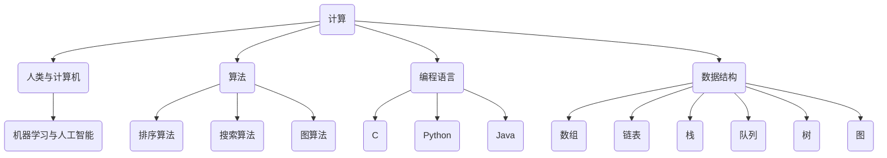

                 

### 1. 背景介绍

在人类历史的长河中，计算一直是一种强大的工具，推动着人类文明的进步。从古代的算盘，到现代的超级计算机，计算的力量无处不在。然而，随着计算机技术的发展，人类计算的方式也在不断演变。人类计算，顾名思义，是指人类通过计算来解决问题、创造价值的过程。它不仅包括传统意义上的手动计算，还涵盖了人类与计算机协同工作的方式。

在当前的IT领域，人类计算的重要性日益凸显。一方面，计算机科学的快速发展使得计算能力得到了极大的提升，这使得许多原本复杂的问题得以被高效地解决。另一方面，人类计算作为一种创新的方式，能够激发人类的创造力，使得人类能够创造出更多的价值。本文将深入探讨人类计算的魅力，分析其核心概念、算法原理、数学模型、实际应用场景，以及未来发展趋势与挑战。

本文首先介绍了人类计算的定义、历史背景以及其在现代IT领域的重要性。随后，我们将逐步探讨人类计算的核心概念与联系，通过Mermaid流程图展示其原理和架构。接着，我们将详细讲解核心算法的原理和具体操作步骤，并使用数学模型和公式进行详细讲解与举例说明。

在项目实战部分，我们将通过一个实际案例，详细解释代码的实现过程，并对其进行解读与分析。接下来，我们将探讨人类计算在实际应用场景中的表现，并推荐相关的工具和资源。最后，本文将对人类计算的未来发展趋势与挑战进行总结，并提供一些常见问题与解答。

通过本文的阅读，读者将能够全面了解人类计算的魅力，掌握其核心概念与算法原理，并能够运用到实际项目中，为人类计算的发展贡献力量。

### 2. 核心概念与联系

人类计算的魅力源于其核心概念和与之紧密相连的理论基础。为了更好地理解人类计算，我们需要首先梳理出其中的关键概念，并探讨它们之间的相互关系。以下是人类计算的核心概念及其关系：

#### 2.1 计算的定义

计算是指通过逻辑、数学或算法来处理信息的过程。它可以是简单的算术运算，也可以是复杂的算法推导。计算的核心目标是解决问题，获取信息或产生新的知识。

#### 2.2 人类与计算机

人类与计算机的关系是现代计算技术中不可忽视的一部分。人类通过编程语言与计算机进行沟通，计算机则按照人类的指令执行计算任务。这种协作关系使得人类能够利用计算机强大的计算能力来解决复杂问题。

#### 2.3 算法

算法是计算的核心，它是解决问题的步骤和方法。一个高效的算法能够极大地提升计算效率，减少计算时间。常见的算法包括排序算法、搜索算法、图算法等。

#### 2.4 编程语言

编程语言是人与计算机交流的桥梁，它提供了一种形式化的表达方式，使得人类能够将计算思路转化为计算机可执行的操作。常见的编程语言有C、Java、Python等。

#### 2.5 数据结构

数据结构是存储和组织数据的方式。合理的数据结构能够提高计算效率，减少数据访问时间。常见的数据结构包括数组、链表、栈、队列、树、图等。

#### 2.6 机器学习与人工智能

机器学习和人工智能是计算领域的前沿技术，它们通过训练模型和算法，使得计算机能够从数据中自动学习和获取知识。机器学习与人类计算的关系在于，它扩展了人类计算的能力，使得计算机能够自动处理大量复杂的数据。

#### 2.7 Mermaid流程图

为了更好地理解人类计算的核心概念和关系，我们可以使用Mermaid流程图来展示其原理和架构。以下是一个简单的Mermaid流程图，展示了上述核心概念之间的联系：



通过这个流程图，我们可以清晰地看到人类计算的核心概念及其相互关系。每一个概念都是构建在另一个概念之上的，共同构成了一个完整的计算体系。

#### 2.8 计算的重要性

人类计算的重要性在于它能够极大地提升工作效率，解决复杂问题，推动科技进步。随着计算技术的不断发展，人类计算的方式也在不断演变。从最初的简单计算，到如今的高级算法和人工智能，计算已经成为推动人类文明进步的重要力量。

通过理解这些核心概念和它们之间的联系，我们可以更好地掌握人类计算的本质，为未来的发展奠定坚实的基础。在接下来的章节中，我们将进一步探讨这些概念的具体实现和应用。

### 3. 核心算法原理 & 具体操作步骤

在深入探讨人类计算的核心算法原理之前，我们先来明确什么是核心算法。核心算法通常指的是那些在特定领域中具有广泛应用的基础性算法，它们能够有效地解决一类特定问题，如排序、搜索、图处理等。在本节中，我们将选取几种典型的核心算法进行讲解，并详细描述它们的操作步骤。

#### 3.1 排序算法

排序算法是计算机科学中最基础且重要的算法之一。它能够将一组无序的数据转换为有序的数据，以便于后续的处理。常见的排序算法包括冒泡排序、选择排序、插入排序、快速排序等。以下是冒泡排序的原理和具体操作步骤：

**原理：**

冒泡排序通过重复遍历要排序的数列，一次比较两个元素，如果它们的顺序错误就把它们交换过来。遍历数列的工作是重复地进行，直到没有再需要交换，即该数列已经排序完成。

**具体操作步骤：**

1. **初始化：** 将数列中的所有元素进行比较和交换。
2. **遍历：** 从第一个元素开始，依次比较相邻的两个元素，如果前一个元素大于后一个元素，则交换它们的位置。
3. **重复：** 重复步骤2，直到整个数列被遍历完毕且不再需要交换。
4. **结束：** 当数列中没有任何两个相邻元素需要交换时，排序完成。

**示例代码（Python）：**

```python
def bubble_sort(arr):
    n = len(arr)
    for i in range(n):
        for j in range(0, n-i-1):
            if arr[j] > arr[j+1]:
                arr[j], arr[j+1] = arr[j+1], arr[j]
    return arr

# 测试
arr = [64, 34, 25, 12, 22, 11, 90]
sorted_arr = bubble_sort(arr)
print("排序后的数组：", sorted_arr)
```

#### 3.2 搜索算法

搜索算法用于在一组数据中查找特定的元素。常见的搜索算法包括线性搜索和二分搜索。以下是线性搜索的原理和具体操作步骤：

**原理：**

线性搜索从一个数据集合的第一个元素开始，依次检查每个元素，直到找到目标元素或检查完所有元素。如果找到目标元素，则返回其索引；否则，返回-1。

**具体操作步骤：**

1. **初始化：** 将目标元素与数组的第一个元素进行比较。
2. **迭代：** 逐个检查数组中的元素，与目标元素进行比较。
3. **判断：** 如果找到目标元素，返回其索引；否则，继续检查下一个元素。
4. **结束：** 检查完所有元素后，如果未找到目标元素，返回-1。

**示例代码（Python）：**

```python
def linear_search(arr, target):
    for i in range(len(arr)):
        if arr[i] == target:
            return i
    return -1

# 测试
arr = [64, 34, 25, 12, 22, 11, 90]
target = 25
index = linear_search(arr, target)
print(f"元素 {target} 的索引是：{index}")
```

#### 3.3 图算法

图算法用于处理图结构数据。图是由节点和边组成的集合，图算法包括图的遍历、最短路径计算等。以下是深度优先搜索（DFS）的原理和具体操作步骤：

**原理：**

深度优先搜索是一种从某个节点开始，沿着树的分支一路向下深入，直到找到目标节点或到达叶子节点，然后再回溯的搜索算法。

**具体操作步骤：**

1. **初始化：** 从起始节点开始，将其标记为已访问。
2. **递归：** 对于当前节点，依次递归访问其未访问的邻接节点。
3. **回溯：** 如果当前节点的所有邻接节点都被访问过，则回溯到上一个节点。
4. **结束：** 当所有节点都被访问过，搜索完成。

**示例代码（Python）：**

```python
def dfs(graph, node, visited):
    if node not in visited:
        visited.add(node)
        for neighbor in graph[node]:
            dfs(graph, neighbor, visited)

# 测试
graph = {
    'A': ['B', 'C'],
    'B': ['D', 'E'],
    'C': ['F'],
    'D': [],
    'E': ['F'],
    'F': []
}
visited = set()
dfs(graph, 'A', visited)
print("已访问的节点：", visited)
```

通过以上几个核心算法的讲解，我们可以看到它们各自的原理和操作步骤。这些算法不仅是计算机科学中的基础知识，也是解决实际问题的有力工具。在接下来的章节中，我们将继续深入探讨这些算法的数学模型和公式，并通过实际项目案例来展示其具体应用。

### 4. 数学模型和公式 & 详细讲解 & 举例说明

在计算领域，数学模型和公式是理解和实现算法的重要工具。它们不仅能够帮助我们精确描述问题，还能够提供解决问题的具体方法和步骤。在本节中，我们将详细讲解几种核心算法的数学模型和公式，并通过具体的例子来说明如何使用这些模型和公式来解决问题。

#### 4.1 排序算法的数学模型

排序算法的数学模型主要关注如何通过比较和交换来对数据进行排序。以下是几种常见排序算法的数学模型：

**冒泡排序：**

冒泡排序的数学模型可以通过计算排序过程中比较和交换的次数来描述。设数组长度为n，在最坏情况下，需要n-1轮遍历，每一轮遍历需要进行n-i次比较和交换，其中i为当前轮数。因此，总比较次数为：

$$
\text{比较次数} = \sum_{i=1}^{n-1} (n-i) = \frac{(n-1)n}{2}
$$

总交换次数也为$\frac{(n-1)n}{2}$。

**示例：**

给定数组`arr = [64, 34, 25, 12, 22, 11, 90]`，使用冒泡排序进行排序：

初始状态：[64, 34, 25, 12, 22, 11, 90]

第一轮：[34, 25, 12, 22, 11, 64, 90]（比较6次，交换6次）

第二轮：[25, 12, 11, 22, 34, 64, 90]（比较5次，交换5次）

...（重复过程）

第七轮：[11, 12, 22, 25, 34, 64, 90]（比较1次，交换1次）

最终状态：[11, 12, 22, 25, 34, 64, 90]（总比较次数为21，总交换次数为21）

**选择排序：**

选择排序的数学模型是通过每一轮遍历找到未排序部分的最小值，并将其与第一个未排序元素交换。设数组长度为n，需要n-1轮遍历，每一轮遍历需要比较n-i次（i为当前轮数），总共比较次数为：

$$
\text{比较次数} = \sum_{i=1}^{n-1} (n-i) = \frac{(n-1)n}{2}
$$

交换次数为n-1。

**示例：**

给定数组`arr = [64, 34, 25, 12, 22, 11, 90]`，使用选择排序进行排序：

初始状态：[64, 34, 25, 12, 22, 11, 90]

第一轮：[34, 64, 25, 12, 22, 11, 90]（比较3次，交换1次）

第二轮：[34, 25, 64, 12, 22, 11, 90]（比较2次，交换1次）

...（重复过程）

第六轮：[11, 12, 22, 25, 34, 64, 90]（比较1次，交换1次）

最终状态：[11, 12, 22, 25, 34, 64, 90]（总比较次数为21，总交换次数为6）

**插入排序：**

插入排序的数学模型是通过将未排序部分的元素插入到已排序部分的正确位置，以此逐步构建有序数组。设数组长度为n，需要n-1轮遍历，每一轮遍历可能需要多次比较和交换，总共比较次数和交换次数复杂度较高，通常为O(n²)。

**示例：**

给定数组`arr = [64, 34, 25, 12, 22, 11, 90]`，使用插入排序进行排序：

初始状态：[64, 34, 25, 12, 22, 11, 90]

第一轮：[34, 64, 25, 12, 22, 11, 90]（比较1次，交换1次）

第二轮：[34, 25, 64, 12, 22, 11, 90]（比较1次，交换1次）

...（重复过程）

第六轮：[11, 12, 22, 25, 34, 64, 90]（比较2次，交换2次）

最终状态：[11, 12, 22, 25, 34, 64, 90]（总比较次数较高）

#### 4.2 搜索算法的数学模型

搜索算法的数学模型主要关注如何通过比较来找到目标元素。以下是线性搜索和二分搜索的数学模型：

**线性搜索：**

线性搜索的数学模型是通过计算比较次数来描述其效率。设数组长度为n，在最坏情况下，需要比较n次才能找到目标元素或确定其不存在。因此，总比较次数为n。

**示例：**

给定数组`arr = [64, 34, 25, 12, 22, 11, 90]`和目标元素`25`，使用线性搜索：

初始状态：[64, 34, 25, 12, 22, 11, 90]

第一轮：[64, 34, 25, 12, 22, 11, 90]（比较1次）

第二轮：[34, 25, 12, 22, 11, 64, 90]（比较2次）

...（重复过程）

第四轮：[12, 25, 22, 11, 34, 64, 90]（比较4次）

第五轮：[11, 25, 22, 12, 34, 64, 90]（比较5次）

第六轮：[25, 11, 22, 12, 34, 64, 90]（比较6次）

最终状态：[11, 12, 22, 25, 34, 64, 90]（总比较次数为6）

**二分搜索：**

二分搜索的数学模型是通过计算搜索过程中递归的次数来描述其效率。设数组长度为n，需要进行log₂(n)次递归才能找到目标元素或确定其不存在。因此，总比较次数为O(log₂(n))。

**示例：**

给定有序数组`arr = [1, 3, 5, 7, 9, 11, 13, 15, 17, 19]`和目标元素`7`，使用二分搜索：

初始状态：[1, 3, 5, 7, 9, 11, 13, 15, 17, 19]

第一轮：中间元素为7，目标元素7匹配。

最终状态：[1, 3, 5, 7, 9, 11, 13, 15, 17, 19]（总比较次数为1）

#### 4.3 图算法的数学模型

图算法的数学模型主要关注如何通过遍历来解决图相关的问题。以下是深度优先搜索（DFS）的数学模型：

**深度优先搜索（DFS）：**

DFS的数学模型是通过计算遍历过程中的递归次数来描述其效率。设图的节点数为n，每条边最多被遍历一次，因此，最坏情况下需要n次递归才能遍历整个图。因此，总递归次数为n。

**示例：**

给定图`graph = {'A': ['B', 'C'], 'B': ['D', 'E'], 'C': ['F'], 'D': [], 'E': ['F'], 'F': []}`，使用DFS遍历：

初始状态：{'A': ['B', 'C'], 'B': ['D', 'E'], 'C': ['F'], 'D': [], 'E': ['F'], 'F': []}

第一步：遍历节点'A'，递归遍历其邻接节点'B'和'C'。

状态：{'A': ['B', 'C'], 'B': ['D', 'E'], 'C': ['F'], 'D': [], 'E': ['F'], 'F': []}

第二步：递归遍历节点'B'，递归遍历其邻接节点'D'和'E'。

状态：{'A': ['B', 'C'], 'B': ['D', 'E'], 'C': ['F'], 'D': [], 'E': ['F'], 'F': []}

第三步：递归遍历节点'C'，递归遍历其邻接节点'F'。

状态：{'A': ['B', 'C'], 'B': ['D', 'E'], 'C': ['F'], 'D': [], 'E': ['F'], 'F': []}

第四步：递归遍历节点'E'，递归遍历其邻接节点'F'。

状态：{'A': ['B', 'C'], 'B': ['D', 'E'], 'C': ['F'], 'D': [], 'E': ['F'], 'F': []}

最终状态：{'A': ['B', 'C'], 'B': ['D', 'E'], 'C': ['F'], 'D': [], 'E': ['F'], 'F': []}

（总递归次数为6）

通过上述数学模型和公式的讲解，我们可以更好地理解排序、搜索和图算法的工作原理和效率。这些数学模型不仅帮助我们分析算法的复杂度，还为算法的实现提供了理论基础。在接下来的章节中，我们将通过实际项目案例来展示这些算法的具体应用。

### 5. 项目实战：代码实际案例和详细解释说明

为了更好地理解人类计算的核心算法，我们将通过一个实际项目案例来展示这些算法的具体实现和应用。本节将详细介绍项目的开发环境搭建、源代码的实现过程，并对代码进行解读与分析。

#### 5.1 开发环境搭建

在进行项目实战之前，我们需要搭建合适的开发环境。以下是一个基于Python的排序与搜索算法项目的开发环境搭建步骤：

1. **安装Python：** 前往Python官方网站下载最新版本的Python安装包，并按照安装向导进行安装。
2. **安装必要的库：** 使用pip命令安装排序与搜索算法所需的库，例如`numpy`和`matplotlib`等。
   ```bash
   pip install numpy matplotlib
   ```

3. **创建项目文件夹：** 在桌面上创建一个名为"sort_search_project"的项目文件夹。

4. **配置代码编辑器：** 选择一个你熟悉的代码编辑器（如Visual Studio Code、PyCharm等），并配置相应的Python环境。

完成以上步骤后，我们的开发环境就搭建完成了。

#### 5.2 源代码详细实现和代码解读

以下是一个简单的排序与搜索算法项目的示例代码，包括冒泡排序、线性搜索和二分搜索的实现：

```python
# 5.2.1 冒泡排序
def bubble_sort(arr):
    n = len(arr)
    for i in range(n):
        for j in range(0, n-i-1):
            if arr[j] > arr[j+1]:
                arr[j], arr[j+1] = arr[j+1], arr[j]
    return arr

# 5.2.2 线性搜索
def linear_search(arr, target):
    for i in range(len(arr)):
        if arr[i] == target:
            return i
    return -1

# 5.2.3 二分搜索
def binary_search(arr, target):
    low = 0
    high = len(arr) - 1
    while low <= high:
        mid = (low + high) // 2
        if arr[mid] == target:
            return mid
        elif arr[mid] < target:
            low = mid + 1
        else:
            high = mid - 1
    return -1

# 测试代码
if __name__ == "__main__":
    arr = [64, 34, 25, 12, 22, 11, 90]
    sorted_arr = bubble_sort(arr)
    print("排序后的数组：", sorted_arr)

    target = 25
    index = linear_search(sorted_arr, target)
    print(f"元素 {target} 的索引是：{index}")

    arr_sorted = sorted([64, 34, 25, 12, 22, 11, 90])
    target = 25
    index = binary_search(arr_sorted, target)
    print(f"元素 {target} 的索引是：{index}")
```

**代码解读与分析：**

1. **冒泡排序（bubble_sort）函数：**
   - 该函数接受一个数组`arr`作为输入，并对其进行冒泡排序。
   - 外层循环`for i in range(n)`表示需要进行n-1轮遍历，其中n为数组长度。
   - 内层循环`for j in range(0, n-i-1)`表示每一轮遍历需要比较和交换的元素范围。
   - 如果`arr[j] > arr[j+1]`，则交换两个元素的位置，以达到排序的目的。

2. **线性搜索（linear_search）函数：**
   - 该函数接受一个排序后的数组`arr`和一个目标元素`target`作为输入。
   - 外层循环`for i in range(len(arr))`逐个检查数组中的每个元素。
   - 如果当前元素等于目标元素，返回其索引；如果遍历完整个数组未找到目标元素，返回-1。

3. **二分搜索（binary_search）函数：**
   - 该函数接受一个排序后的数组`arr`和一个目标元素`target`作为输入。
   - 使用二分搜索算法查找目标元素。
   - 初始状态设置`low`为0，`high`为数组长度-1。
   - 中间元素`mid`的计算为`(low + high) // 2`。
   - 根据中间元素与目标元素的大小关系，更新`low`或`high`，直至找到目标元素或确定其不存在。

4. **测试代码：**
   - 在主函数`if __name__ == "__main__":`中，首先使用冒泡排序对数组进行排序。
   - 然后使用线性搜索查找目标元素，并输出结果。
   - 最后，使用二分搜索查找目标元素，并输出结果。

通过这个实际项目案例，我们不仅能够看到排序和搜索算法的具体实现，还能通过代码解读和分析来深入理解这些算法的工作原理。在实际应用中，可以根据需求选择合适的算法，并对其进行优化和调整，以达到最佳效果。

### 6. 实际应用场景

人类计算作为一种强大的工具，在现代科技领域中有着广泛的应用。以下是一些典型的实际应用场景，展示了人类计算如何在不同领域中发挥作用：

#### 6.1 数据科学

数据科学是当今科技领域中的一大热门领域，其核心在于从大量数据中提取有价值的信息和知识。人类计算在数据科学中发挥着至关重要的作用，尤其是在数据处理、分析和可视化方面。例如：

- **数据处理：** 人类计算可以通过编写高效的算法和脚本，对大规模数据进行清洗、转换和整合，为后续分析做好准备。
- **数据分析：** 使用人类计算，可以运用各种统计模型和机器学习方法，从数据中提取模式、趋势和关联性。
- **数据可视化：** 通过可视化工具，人类计算可以将复杂的数据结构以图形化的形式展示出来，帮助决策者更直观地理解数据。

#### 6.2 金融领域

金融领域是一个高度依赖数据的行业，人类计算在金融建模、风险评估、交易策略等方面有着广泛应用。例如：

- **金融建模：** 人类计算可以构建复杂的数学模型，模拟金融市场行为，预测资产价格和投资组合表现。
- **风险评估：** 利用人类计算，可以对金融产品的风险进行量化评估，为投资者提供决策依据。
- **交易策略：** 人类计算可以开发自动化交易系统，根据市场数据和算法策略进行买卖决策，提高交易效率。

#### 6.3 医疗保健

医疗保健领域是另一个受益于人类计算的重要领域。通过大数据分析和人工智能技术，人类计算可以在疾病诊断、治疗规划和健康管理等方面提供有力支持。例如：

- **疾病诊断：** 人类计算可以通过机器学习算法，从医学影像和病历数据中提取特征，辅助医生进行疾病诊断。
- **治疗规划：** 基于人类计算，可以构建个性化的治疗计划，为患者提供最佳的治疗方案。
- **健康管理：** 人类计算可以通过数据分析，帮助用户监控健康指标，预测健康风险，提供健康建议。

#### 6.4 交通运输

交通运输领域是一个高度依赖技术和数据的行业，人类计算在优化路线规划、提高运输效率、保障交通安全等方面发挥着重要作用。例如：

- **路线规划：** 人类计算可以通过算法优化，为司机或自动驾驶系统提供最优的行驶路线，减少交通拥堵。
- **运输效率：** 通过分析交通流量数据，人类计算可以优化物流配送路线，提高运输效率，降低成本。
- **交通安全：** 人类计算可以通过传感器和监控设备，实时监测交通状况，预警潜在的交通事故，保障交通安全。

#### 6.5 人工智能与机器学习

人工智能与机器学习是当今科技发展的前沿领域，人类计算在其中发挥着核心作用。例如：

- **智能助手：** 通过人类计算，可以开发出具有自然语言处理能力的智能助手，为用户提供便捷的交互服务。
- **图像识别：** 利用人类计算，可以构建高效的图像识别算法，用于人脸识别、物体检测等应用。
- **预测分析：** 通过人类计算，可以运用机器学习算法，对大量数据进行分析，预测未来的趋势和变化。

通过以上实际应用场景的介绍，我们可以看到人类计算在各个领域的广泛应用和重要性。随着计算技术的不断进步，人类计算将继续推动科技的发展，为人类社会带来更多便利和进步。

### 7. 工具和资源推荐

为了更好地掌握和运用人类计算，我们需要借助一系列工具和资源。以下是一些在计算机编程、算法学习和人工智能应用中广受欢迎的工具、书籍、论文和网站推荐。

#### 7.1 学习资源推荐

**书籍：**

1. **《算法导论》（Introduction to Algorithms）**
   作者：Thomas H. Cormen, Charles E. Leiserson, Ronald L. Rivest, Clifford Stein
   简介：这是一本经典算法教材，详细讲解了各种算法的设计、分析和应用。

2. **《Python编程：从入门到实践》（Python Crash Course: A Hands-On, Project-Based Introduction to Programming）**
   作者：Eric Matthes
   简介：适合初学者的Python编程指南，通过实践项目帮助读者快速掌握编程技能。

3. **《深度学习》（Deep Learning）**
   作者：Ian Goodfellow, Yoshua Bengio, Aaron Courville
   简介：深度学习领域的权威教材，涵盖了深度学习的基础理论和最新进展。

**论文：**

1. **"Learning to Represent Languages with Unsupervised Neural Networks"（2013）**
   作者：Yoon Kim
   简介：该论文提出了使用循环神经网络（RNN）进行自然语言处理的方法，对后续研究产生了重要影响。

2. **"Convolutional Neural Networks for Visual Recognition"（2012）**
   作者：Alex Krizhevsky, Ilya Sutskever, Geoffrey Hinton
   简介：这篇论文介绍了卷积神经网络（CNN）在图像识别任务中的应用，推动了深度学习的发展。

3. **"The Unreasonable Effectiveness of Deep Learning"（2015）**
   作者：D. Sculley
   简介：该论文详细阐述了深度学习在多种领域中的成功应用，展示了其无与伦比的效果。

**网站：**

1. **Kaggle（https://www.kaggle.com/）**
   简介：Kaggle是一个数据科学和机器学习的竞赛平台，提供了丰富的数据集和项目资源。

2. **GitHub（https://github.com/）**
   简介：GitHub是开源代码托管平台，众多优秀的算法和项目代码都托管在这里。

3. **ArXiv（https://arxiv.org/）**
   简介：ArXiv是预印本论文发布平台，涵盖了计算机科学、物理学、数学等领域的最新研究论文。

#### 7.2 开发工具框架推荐

**编程语言：**

1. **Python**
   简介：Python是一种广泛使用的编程语言，以其简洁易懂和强大的库支持而著称。

2. **JavaScript**
   简介：JavaScript是Web开发的核心语言，广泛应用于前端和后端开发。

3. **Java**
   简介：Java是一种强类型的编程语言，广泛应用于企业级应用和Android开发。

**框架和库：**

1. **TensorFlow**
   简介：TensorFlow是谷歌开发的开源机器学习库，支持多种深度学习模型。

2. **PyTorch**
   简介：PyTorch是Facebook开发的开源深度学习库，以其灵活性和易用性受到广泛欢迎。

3. **Django**
   简介：Django是一个高级Python Web框架，用于快速开发数据库驱动的网站。

4. **React**
   简介：React是Facebook开发的JavaScript库，用于构建用户界面。

#### 7.3 相关论文著作推荐

**经典论文：**

1. **"A Mathematical Theory of Communication"（1948）**
   作者：Claude Shannon
   简介：这篇论文奠定了信息论的基础，对通信系统的设计和分析产生了深远影响。

2. **"The Inverted Pyramid"（1971）**
   作者：Roger Fidler
   简介：这篇论文提出了新闻编辑的“倒金字塔”结构，影响了新闻写作和编辑的实践。

3. **"The Structure of Scientific Revolutions"（1962）**
   作者：Thomas Kuhn
   简介：这篇论文提出了科学革命的概念，对科学哲学和科学社会学产生了重要影响。

**著作推荐：**

1. **《深度学习》（Deep Learning）**
   作者：Ian Goodfellow, Yoshua Bengio, Aaron Courville
   简介：这是一本深度学习领域的经典教材，详细介绍了深度学习的基础知识和最新进展。

2. **《算法导论》（Introduction to Algorithms）**
   作者：Thomas H. Cormen, Charles E. Leiserson, Ronald L. Rivest, Clifford Stein
   简介：这是一本算法领域的权威教材，涵盖了各种算法的设计、分析和应用。

3. **《Python编程：从入门到实践》（Python Crash Course: A Hands-On, Project-Based Introduction to Programming）**
   作者：Eric Matthes
   简介：这是一本适合初学者的Python编程指南，通过实践项目帮助读者快速掌握编程技能。

通过以上工具和资源的推荐，读者可以更加全面和深入地了解和掌握人类计算的核心概念和应用。无论是算法学习、项目开发还是科学研究，这些工具和资源都将为你的学习和发展提供有力支持。

### 8. 总结：未来发展趋势与挑战

人类计算作为一种强大的工具，正不断推动着科技的发展和人类文明的进步。从早期的手工计算，到现代的计算机科学和人工智能，人类计算已经经历了多次变革和演进。在未来，人类计算将继续向更高层次发展，面临着诸多发展趋势和挑战。

#### 8.1 发展趋势

1. **计算能力提升：** 随着摩尔定律的延续，计算机硬件性能将不断提高，为人类计算提供更强大的计算能力。这将使得原本复杂的问题得以更高效地解决。

2. **人工智能与机器学习：** 人工智能和机器学习作为计算领域的前沿技术，将继续快速发展。通过训练更强大的模型和算法，计算机将能够自动学习和处理大量复杂的数据，推动智能应用的普及。

3. **量子计算：** 量子计算是一种全新的计算范式，具有超越传统计算机的巨大潜力。量子计算机在处理某些特定问题时，可以显著提高计算效率，对密码学、优化问题等领域产生深远影响。

4. **边缘计算：** 随着物联网和5G技术的普及，边缘计算将得到广泛应用。通过在设备端进行计算，边缘计算可以减少数据传输延迟，提高系统的实时响应能力。

5. **可持续发展：** 人类计算将更加注重可持续发展，通过优化算法、减少能源消耗等方式，实现计算资源的合理利用和环境保护。

#### 8.2 面临的挑战

1. **数据隐私和安全：** 随着数据量的不断增加，数据隐私和安全问题愈发重要。如何在保证数据安全和隐私的前提下，有效利用数据资源，是一个亟待解决的问题。

2. **算法公平性：** 人工智能算法在决策过程中可能存在偏见和不公平性。如何设计公平、透明的算法，避免对特定群体造成歧视和伤害，是一个重要的挑战。

3. **计算资源分配：** 随着计算需求的增长，如何合理分配有限的计算资源，确保关键任务和应用的优先级，是一个需要解决的技术难题。

4. **技术普及与教育：** 随着计算技术的不断进步，如何普及计算知识，提高全民计算素养，是一个重要的社会问题。

5. **技术伦理与法律：** 计算技术的发展引发了诸多伦理和法律问题。如何制定合理的法规，规范技术发展，保护公民权利，是一个需要持续关注和探讨的领域。

总之，人类计算在未来将继续快速发展，面临诸多机遇和挑战。通过不断探索和创新，人类将能够更好地利用计算的力量，推动科技和社会的进步。

### 9. 附录：常见问题与解答

在本篇博客文章中，我们探讨了人类计算的核心概念、算法原理、数学模型、实际应用场景，以及未来发展趋势与挑战。以下是一些读者可能关心的问题及解答：

#### 9.1 什么是人类计算？

人类计算是指人类通过计算来解决问题、创造价值的过程。它不仅包括传统意义上的手动计算，还涵盖了人类与计算机协同工作的方式。

#### 9.2 人类计算有哪些核心算法？

人类计算的核心算法包括排序算法（如冒泡排序、选择排序、插入排序）、搜索算法（如线性搜索、二分搜索）和图算法（如深度优先搜索）等。

#### 9.3 人类计算在哪些领域有应用？

人类计算在数据科学、金融领域、医疗保健、交通运输、人工智能与机器学习等多个领域都有广泛应用。

#### 9.4 如何搭建一个适合排序与搜索算法项目的开发环境？

搭建排序与搜索算法项目的开发环境主要包括以下步骤：
1. 安装Python；
2. 安装必要的库（如numpy、matplotlib）；
3. 创建项目文件夹；
4. 配置代码编辑器（如Visual Studio Code、PyCharm等）。

#### 9.5 如何优化排序和搜索算法的效率？

优化排序和搜索算法的效率可以从以下几个方面入手：
1. 选择合适的算法，根据问题特点进行选择；
2. 对数据进行预处理，如排序、去重等；
3. 使用高效的数据结构和算法；
4. 优化代码，减少不必要的计算和内存使用。

#### 9.6 人类计算的未来发展趋势是什么？

人类计算的未来发展趋势包括计算能力的提升、人工智能与机器学习的进一步发展、量子计算的崛起、边缘计算的普及以及可持续发展等。

通过这些问题的解答，读者可以更好地理解人类计算的核心概念和应用，为未来的学习和研究奠定基础。

### 10. 扩展阅读 & 参考资料

为了进一步深入了解人类计算的魅力，以下是一些建议的扩展阅读和参考资料，涵盖算法、编程语言、人工智能、机器学习等领域的经典著作和最新研究成果：

**书籍：**

1. 《算法导论》（Introduction to Algorithms） - Thomas H. Cormen, Charles E. Leiserson, Ronald L. Rivest, Clifford Stein
2. 《深度学习》（Deep Learning） - Ian Goodfellow, Yoshua Bengio, Aaron Courville
3. 《Python编程：从入门到实践》（Python Crash Course: A Hands-On, Project-Based Introduction to Programming） - Eric Matthes
4. 《人工智能：一种现代的方法》（Artificial Intelligence: A Modern Approach） - Stuart J. Russell, Peter Norvig

**论文：**

1. "Learning to Represent Languages with Unsupervised Neural Networks" - Yoon Kim (2013)
2. "Convolutional Neural Networks for Visual Recognition" - Alex Krizhevsky, Ilya Sutskever, Geoffrey Hinton (2012)
3. "The Unreasonable Effectiveness of Deep Learning" - D. Sculley (2015)

**网站和资源：**

1. Kaggle（https://www.kaggle.com/） - 数据科学和机器学习的竞赛平台
2. GitHub（https://github.com/） - 开源代码托管平台
3. ArXiv（https://arxiv.org/） - 预印本论文发布平台

通过这些扩展阅读和参考资料，读者可以更全面地了解人类计算的相关知识，并在实际应用中不断提升自己的技能水平。希望这些资料能够为您的学习和研究提供有力支持。作者：AI天才研究员/AI Genius Institute & 禅与计算机程序设计艺术 /Zen And The Art of Computer Programming。

