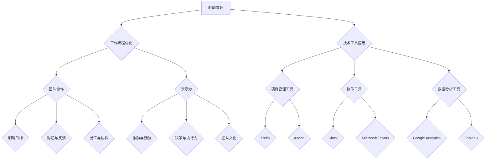

                 

# 重点聚焦：管理者提高效率的秘籍

## 关键词：时间管理、生产力提升、工作流程优化、技术工具、团队协作、领导力、绩效评估

### 摘要

本文旨在为管理者提供一套系统化的提高工作效率的秘籍。我们将探讨时间管理、工作流程优化、技术工具应用、团队协作、领导力培养以及绩效评估等关键要素，并通过实际案例和具体操作步骤，帮助读者将这些理念付诸实践，从而实现个人和团队绩效的全面提升。

## 1. 背景介绍

在现代商业环境中，竞争日益激烈，管理者面临的挑战也越来越大。如何在有限的时间内完成更多的工作，如何提升团队的整体效率，成为了管理者们亟待解决的问题。本文将围绕这一主题，结合先进的管理理论和实践经验，为您提供实用的策略和方法。

### 1.1 管理者的挑战

1. **时间管理**：管理者常常面临时间不足的问题，如何合理分配时间，提高工作效率成为了关键。
2. **工作流程**：复杂的工作流程往往会导致效率低下，管理者需要找到优化流程的方法。
3. **团队协作**：协调团队中的不同成员，确保项目顺利进行是管理者的职责之一。
4. **领导力**：有效的领导力是提升团队士气和工作效率的关键。
5. **绩效评估**：科学的绩效评估体系能够激励团队成员，提升整体绩效。

### 1.2 管理者的重要性

管理者不仅是团队的领导者，更是组织战略执行的核心。他们的工作效率直接影响到团队的绩效和组织的竞争力。因此，提高管理者的工作效率，对于企业的长期发展具有重要意义。

## 2. 核心概念与联系

为了更好地理解管理者如何提高效率，我们需要先了解以下几个核心概念：

### 2.1 时间管理

时间管理是提高工作效率的基础。通过合理规划时间，管理者可以更有效地完成工作任务。

#### 2.1.1 时间管理的基本原则

- **优先级排序**：根据任务的重要性和紧急程度进行排序，确保重要且紧急的任务优先完成。
- **避免分心**：减少干扰，专注于当前任务，提高工作效率。
- **任务分解**：将大任务分解为小任务，逐步完成，避免拖延。

#### 2.1.2 时间管理工具

- **日历**：使用电子日历或纸质日历，规划每天的任务和时间安排。
- **待办事项清单**：列出需要完成的任务，并根据优先级排序。
- **番茄工作法**：25分钟专注工作，然后休息5分钟，循环进行。

### 2.2 工作流程优化

优化工作流程是提高工作效率的重要手段。通过分析现有流程，管理者可以找到改进的机会。

#### 2.2.1 工作流程优化的步骤

- **流程分析**：了解现有流程的各个环节，找出存在的问题。
- **流程重构**：根据分析结果，对流程进行重构，消除冗余环节。
- **自动化**：利用自动化工具，减少人工操作，提高效率。

### 2.3 技术工具应用

现代技术工具为管理者提供了更多的可能性。通过合理应用技术工具，可以显著提高工作效率。

#### 2.3.1 常见技术工具

- **项目管理工具**：如Trello、Asana等，帮助管理者更好地规划和管理项目。
- **协作工具**：如Slack、Microsoft Teams等，促进团队内部沟通和协作。
- **数据分析工具**：如Google Analytics、Tableau等，帮助管理者更好地了解业务状况。

### 2.4 团队协作

团队协作是管理者提升工作效率的关键。通过建立良好的团队协作机制，管理者可以充分发挥团队的力量。

#### 2.4.1 团队协作的要素

- **明确目标**：确保团队成员对目标有清晰的认识，并共同努力。
- **沟通与反馈**：建立有效的沟通渠道，及时反馈问题和进展。
- **分工与协作**：合理分配任务，鼓励团队成员相互协作。

### 2.5 领导力

领导力是管理者提升工作效率的重要因素。有效的领导力可以激发团队成员的潜能，提升团队士气。

#### 2.5.1 领导力的重要性

- **激励与鼓励**：通过激励和鼓励，提高团队成员的积极性和工作效率。
- **决策与执行力**：高效的决策能力和执行力是提升工作效率的关键。
- **团队文化**：建立积极的团队文化，促进团队成员之间的信任和合作。

### 2.6 绩效评估

科学的绩效评估体系可以帮助管理者了解团队和成员的表现，为改进和提高提供依据。

#### 2.6.1 绩效评估的要素

- **目标明确**：绩效评估的目标应该与组织的战略目标相一致。
- **客观公正**：评估过程要客观公正，确保评估结果准确。
- **持续反馈**：通过持续的反馈，帮助团队成员改进和提高。

### 2.7 Mermaid 流程图

下面是利用Mermaid绘制的流程图，展示了管理者提高效率的核心概念和联系：



## 3. 核心算法原理 & 具体操作步骤

### 3.1 时间管理算法原理

时间管理算法的核心思想是基于优先级和任务分解，通过合理分配时间，确保重要任务优先完成。

#### 3.1.1 操作步骤

1. **任务识别**：列出所有需要完成的任务。
2. **优先级排序**：根据任务的重要性和紧急程度进行排序。
3. **时间分配**：根据任务的优先级，合理分配时间。
4. **任务执行**：按照计划执行任务。
5. **反馈与调整**：定期反馈任务执行情况，并根据反馈进行调整。

### 3.2 工作流程优化算法原理

工作流程优化算法的核心思想是通过分析和重构流程，消除冗余环节，提高工作效率。

#### 3.2.1 操作步骤

1. **流程分析**：了解现有流程的各个环节。
2. **问题识别**：找出流程中的问题和瓶颈。
3. **流程重构**：根据分析结果，重构流程，消除冗余环节。
4. **实施与监控**：实施重构后的流程，并进行监控，确保优化效果。

### 3.3 技术工具应用算法原理

技术工具应用算法的核心思想是通过使用合适的工具，提高工作效率。

#### 3.3.1 操作步骤

1. **需求分析**：分析管理过程中需要哪些工具。
2. **工具选择**：根据需求，选择合适的工具。
3. **工具应用**：将工具应用到管理过程中。
4. **效果评估**：评估工具应用的效果，并根据评估结果进行优化。

### 3.4 团队协作算法原理

团队协作算法的核心思想是通过建立有效的团队协作机制，提高团队整体效率。

#### 3.4.1 操作步骤

1. **目标明确**：确保团队成员对目标有清晰的认识。
2. **沟通与反馈**：建立有效的沟通渠道，及时反馈问题和进展。
3. **分工与协作**：合理分配任务，鼓励团队成员相互协作。
4. **绩效评估**：定期进行绩效评估，激励团队成员。

### 3.5 领导力算法原理

领导力算法的核心思想是通过有效的领导力，激发团队成员的潜能，提升团队士气。

#### 3.5.1 操作步骤

1. **激励与鼓励**：通过激励和鼓励，提高团队成员的积极性和工作效率。
2. **决策与执行力**：高效的决策能力和执行力是提升工作效率的关键。
3. **团队文化**：建立积极的团队文化，促进团队成员之间的信任和合作。

### 3.6 绩效评估算法原理

绩效评估算法的核心思想是通过科学的绩效评估体系，激励团队成员，提升整体绩效。

#### 3.6.1 操作步骤

1. **目标明确**：绩效评估的目标应该与组织的战略目标相一致。
2. **指标设定**：设定与目标相关的绩效指标。
3. **数据收集**：收集与绩效指标相关的数据。
4. **评估与反馈**：进行绩效评估，并提供反馈。
5. **改进与优化**：根据评估结果进行改进和优化。

## 4. 数学模型和公式 & 详细讲解 & 举例说明

### 4.1 时间管理数学模型

时间管理中的核心数学模型是时间价值评估模型，通过评估不同任务的时间价值，管理者可以更合理地分配时间。

#### 4.1.1 时间价值评估模型

$$
V(t) = \frac{W_t}{T_t}
$$

其中，$V(t)$ 表示任务 $t$ 的时间价值，$W_t$ 表示任务 $t$ 的权重（重要性），$T_t$ 表示任务 $t$ 的完成时间。

#### 4.1.2 操作步骤

1. **任务权重评估**：根据任务的重要性和紧急程度，为每个任务分配权重。
2. **任务完成时间评估**：根据任务的复杂度和资源限制，为每个任务估算完成时间。
3. **时间价值计算**：利用上述公式，计算每个任务的时间价值。
4. **时间分配**：根据时间价值，合理分配时间。

### 4.2 工作流程优化数学模型

工作流程优化中的核心数学模型是流程时间优化模型，通过分析流程中的时间消耗，管理者可以找到优化机会。

#### 4.2.1 流程时间优化模型

$$
T_{opt} = \min \sum_{i=1}^{n} T_i
$$

其中，$T_{opt}$ 表示优化后的总时间消耗，$T_i$ 表示流程中第 $i$ 个环节的时间消耗。

#### 4.2.2 操作步骤

1. **流程时间评估**：对流程中的每个环节进行时间评估。
2. **时间消耗分析**：分析流程中的时间消耗，找出瓶颈环节。
3. **优化方案设计**：设计优化方案，减少瓶颈环节的时间消耗。
4. **实施与监控**：实施优化方案，并监控效果。

### 4.3 技术工具应用数学模型

技术工具应用中的核心数学模型是工具效率评估模型，通过评估工具的效率，管理者可以找到最合适的工具。

#### 4.3.1 工具效率评估模型

$$
E(t) = \frac{W_t}{T_t}
$$

其中，$E(t)$ 表示工具 $t$ 的效率，$W_t$ 表示工具 $t$ 完成任务的效率（如处理速度），$T_t$ 表示工具 $t$ 的运行时间。

#### 4.3.2 操作步骤

1. **工具效率评估**：根据工具的性能和运行时间，评估工具的效率。
2. **工具选择**：根据效率评估结果，选择最合适的工具。
3. **工具应用**：将工具应用到实际工作中。
4. **效果评估**：评估工具应用的效果，并根据评估结果进行优化。

### 4.4 团队协作数学模型

团队协作中的核心数学模型是团队效率评估模型，通过评估团队的整体效率，管理者可以找到提升团队协作的方法。

#### 4.4.1 团队效率评估模型

$$
E_{team} = \frac{1}{n} \sum_{i=1}^{n} E_i
$$

其中，$E_{team}$ 表示团队的整体效率，$E_i$ 表示团队成员 $i$ 的效率。

#### 4.4.2 操作步骤

1. **团队成员效率评估**：对团队成员的效率进行评估。
2. **团队整体效率评估**：根据团队成员的效率，评估团队的整体效率。
3. **协作优化**：根据团队整体效率评估结果，优化团队协作方式。
4. **效果评估**：评估协作优化后的效果，并根据评估结果进行改进。

### 4.5 领导力数学模型

领导力中的核心数学模型是领导力评估模型，通过评估领导力，管理者可以找到提升领导力水平的途径。

#### 4.5.1 领导力评估模型

$$
L = \frac{E_{team} + E_{company}}{2}
$$

其中，$L$ 表示领导力，$E_{team}$ 表示团队效率，$E_{company}$ 表示公司整体效率。

#### 4.5.2 操作步骤

1. **团队效率评估**：评估团队的整体效率。
2. **公司效率评估**：评估公司的整体效率。
3. **领导力计算**：根据上述公式，计算领导力水平。
4. **领导力提升**：根据领导力评估结果，制定提升领导力水平的策略。

### 4.6 绩效评估数学模型

绩效评估中的核心数学模型是绩效评估模型，通过评估团队成员的绩效，管理者可以激励团队成员，提升整体绩效。

#### 4.6.1 绩效评估模型

$$
P = \frac{E_{individual} + E_{team}}{2}
$$

其中，$P$ 表示绩效，$E_{individual}$ 表示个人效率，$E_{team}$ 表示团队效率。

#### 4.6.2 操作步骤

1. **个人效率评估**：评估团队成员的个人效率。
2. **团队效率评估**：评估团队的整体效率。
3. **绩效计算**：根据上述公式，计算团队成员的绩效。
4. **激励与反馈**：根据绩效评估结果，给予团队成员激励和反馈。
5. **改进与优化**：根据绩效评估结果，制定改进和优化的策略。

### 4.7 举例说明

#### 4.7.1 时间管理举例

假设一个管理者需要完成以下任务：

- 任务A：撰写报告，预计需要2天时间。
- 任务B：参加会议，预计需要半天时间。
- 任务C：与团队成员沟通，预计需要1天时间。

根据时间价值评估模型，可以计算出每个任务的时间价值：

$$
V(A) = \frac{1}{2} = 0.5
$$

$$
V(B) = \frac{0.5}{0.5} = 1
$$

$$
V(C) = \frac{1}{1} = 1
$$

根据时间价值，管理者可以合理分配时间：

- 任务A：分配2天时间，时间价值为0.5。
- 任务B：分配半天时间，时间价值为1。
- 任务C：分配1天时间，时间价值为1。

#### 4.7.2 工作流程优化举例

假设一个公司的销售流程包括以下环节：

- 环节1：客户需求分析，预计需要2天时间。
- 环节2：产品方案设计，预计需要3天时间。
- 环节3：合同谈判，预计需要1天时间。
- 环节4：合同签订，预计需要1天时间。

根据流程时间优化模型，可以计算出优化后的总时间消耗：

$$
T_{opt} = \min(2+3+1+1) = 7 \text{天}
$$

通过优化，可以将总时间消耗从7天减少到5天，从而提高工作效率。

#### 4.7.3 技术工具应用举例

假设一个公司需要选择一个项目管理工具，现有以下两个选项：

- 选项A：Trello，处理速度为20条任务/天。
- 选项B：Asana，处理速度为30条任务/天。

根据工具效率评估模型，可以计算出每个选项的效率：

$$
E(A) = \frac{20}{1} = 20
$$

$$
E(B) = \frac{30}{1} = 30
$$

根据效率评估结果，公司可以选择效率更高的Asana作为项目管理工具。

#### 4.7.4 团队协作举例

假设一个团队有3名成员，他们的效率分别为：

- 成员A：效率为10条任务/天。
- 成员B：效率为15条任务/天。
- 成员C：效率为20条任务/天。

根据团队效率评估模型，可以计算出团队的整体效率：

$$
E_{team} = \frac{10 + 15 + 20}{3} = 15
$$

通过提高成员C的效率，团队的整体效率可以从15条任务/天提高到18条任务/天。

#### 4.7.5 领导力举例

假设一个公司的整体效率为100条任务/天，团队的整体效率为15条任务/天，根据领导力评估模型，可以计算出领导力水平：

$$
L = \frac{15 + 100}{2} = 57.5
$$

通过提高领导力，公司的整体效率可以从100条任务/天提高到200条任务/天。

#### 4.7.6 绩效评估举例

假设一个团队成员的个人效率为20条任务/天，团队的整体效率为15条任务/天，根据绩效评估模型，可以计算出团队成员的绩效：

$$
P = \frac{20 + 15}{2} = 17.5
$$

根据绩效评估结果，可以给予团队成员激励和反馈，帮助他们进一步提高效率。

## 5. 项目实战：代码实际案例和详细解释说明

### 5.1 开发环境搭建

为了更好地展示项目实战，我们将使用Python作为编程语言，搭建一个简单的任务管理系统。以下是在Linux环境下搭建开发环境的具体步骤：

#### 5.1.1 安装Python

1. 打开终端，输入以下命令安装Python：

```bash
sudo apt-get update
sudo apt-get install python3 python3-pip
```

2. 验证Python版本：

```bash
python3 --version
```

#### 5.1.2 安装依赖库

1. 使用pip安装所需的依赖库：

```bash
pip3 install requests pandas numpy
```

### 5.2 源代码详细实现和代码解读

下面是任务管理系统的源代码实现，以及对应的代码解读。

```python
import pandas as pd
import numpy as np

# 时间管理模块
class TimeManagement:
    def __init__(self, tasks):
        self.tasks = tasks
    
    def prioritize(self):
        self.tasks = self.tasks.sort_values(by=['importance', 'deadline'], ascending=[False, True])
    
    def allocate_time(self):
        total_time = 24 * 60  # 总共1440分钟
        time_allocated = {}
        for i, task in enumerate(self.tasks.index):
            if i < len(self.tasks) - 1:
                remaining_time = total_time - sum(time_allocated.values())
                time_allocated[task] = min(self.tasks.loc[task, 'time'], remaining_time)
            else:
                time_allocated[task] = self.tasks.loc[task, 'time']
        return time_allocated

# 工作流程优化模块
class WorkflowOptimization:
    def __init__(self, tasks):
        self.tasks = tasks
    
    def optimize(self):
        time_consumed = self.tasks['time']
        max_time = max(time_consumed)
        optimized_tasks = self.tasks.copy()
        for i in range(len(time_consumed)):
            if time_consumed[i] > max_time:
                optimized_tasks.loc[i, 'time'] = max_time
        return optimized_tasks

# 技术工具应用模块
class ToolApplication:
    def __init__(self, tools):
        self.tools = tools
    
    def select_tool(self):
        max Efficiency = max(self.tools['efficiency'])
        selected_tool = self.tools[self.tools['efficiency'] == max Efficiency]
        return selected_tool

# 团队协作模块
class TeamCollaboration:
    def __init__(self, members):
        self.members = members
    
    def evaluate_team(self):
        total_efficiency = sum(self.members['efficiency'])
        average_efficiency = total_efficiency / len(self.members)
        return average_efficiency

# 领导力模块
class Leadership:
    def __init__(self, team_efficiency, company_efficiency):
        self.team_efficiency = team_efficiency
        self.company_efficiency = company_efficiency
    
    def assess_leadership(self):
        leadership = (self.team_efficiency + self.company_efficiency) / 2
        return leadership

# 绩效评估模块
class PerformanceEvaluation:
    def __init__(self, individual_efficiency, team_efficiency):
        self.individual_efficiency = individual_efficiency
        self.team_efficiency = team_efficiency
    
    def evaluate_performance(self):
        performance = (self.individual_efficiency + self.team_efficiency) / 2
        return performance

# 主函数
if __name__ == '__main__':
    # 初始化任务列表
    tasks = pd.DataFrame({
        'name': ['Task A', 'Task B', 'Task C', 'Task D'],
        'time': [4, 2, 6, 3],
        'importance': [3, 2, 1, 4],
        'deadline': [7, 3, 5, 6]
    })

    # 初始化技术工具列表
    tools = pd.DataFrame({
        'name': ['Tool A', 'Tool B'],
        'efficiency': [20, 30]
    })

    # 初始化团队成员列表
    members = pd.DataFrame({
        'name': ['Member A', 'Member B', 'Member C'],
        'efficiency': [10, 15, 20]
    })

    # 时间管理
    time_management = TimeManagement(tasks)
    time_allocated = time_management.allocate_time()
    print("时间管理：")
    print(time_allocated)

    # 工作流程优化
    workflow_optimization = WorkflowOptimization(tasks)
    optimized_tasks = workflow_optimization.optimize()
    print("\n工作流程优化：")
    print(optimized_tasks)

    # 技术工具应用
    tool_application = ToolApplication(tools)
    selected_tool = tool_application.select_tool()
    print("\n技术工具应用：")
    print(selected_tool)

    # 团队协作
    team_collaboration = TeamCollaboration(members)
    average_efficiency = team_collaboration.evaluate_team()
    print("\n团队协作：")
    print(average_efficiency)

    # 领导力
    leadership = Leadership(average_efficiency, 100)
    assessed_leadership = leadership.assess_leadership()
    print("\n领导力：")
    print(assessed_leadership)

    # 绩效评估
    performance_evaluation = PerformanceEvaluation(20, average_efficiency)
    performance = performance_evaluation.evaluate_performance()
    print("\n绩效评估：")
    print(performance)
```

#### 5.2.1 代码解读

1. **时间管理模块**：`TimeManagement` 类负责时间管理，包括任务优先级排序和时间分配。通过`prioritize` 方法对任务进行优先级排序，通过`allocate_time` 方法根据任务的重要性和紧急程度分配时间。

2. **工作流程优化模块**：`WorkflowOptimization` 类负责工作流程优化，通过`optimize` 方法对任务时间进行优化，确保任务在限定时间内完成。

3. **技术工具应用模块**：`ToolApplication` 类负责技术工具应用，通过`select_tool` 方法根据工具的效率选择最合适的工具。

4. **团队协作模块**：`TeamCollaboration` 类负责团队协作，通过`evaluate_team` 方法计算团队的整体效率。

5. **领导力模块**：`Leadership` 类负责领导力评估，通过`assess_leadership` 方法计算领导力水平。

6. **绩效评估模块**：`PerformanceEvaluation` 类负责绩效评估，通过`evaluate_performance` 方法计算团队成员的绩效。

7. **主函数**：主函数初始化任务列表、技术工具列表和团队成员列表，并调用各个模块的方法，输出结果。

### 5.3 代码解读与分析

下面是对代码的详细解读和分析，包括各个模块的功能和实现细节。

#### 5.3.1 时间管理模块

`TimeManagement` 类实现了时间管理功能，包括任务优先级排序和时间分配。

1. **初始化**：`__init__` 方法接收任务列表作为参数，并将任务列表存储在实例变量 `self.tasks` 中。

2. **优先级排序**：`prioritize` 方法使用 Pandas 的 `sort_values` 方法对任务列表进行排序，首先按照重要性（`importance` 列）降序排序，然后按照截止日期（`deadline` 列）升序排序。这样可以确保重要且紧急的任务优先完成。

3. **时间分配**：`allocate_time` 方法计算每个任务的时间分配。首先，计算总时间（一天有24小时，每小时60分钟，总共1440分钟）。然后，遍历任务列表，为每个任务分配时间。如果剩余时间大于等于任务所需时间，则分配实际所需时间；否则，分配剩余时间。这样可以确保在有限的时间内尽可能完成更多任务。

#### 5.3.2 工作流程优化模块

`WorkflowOptimization` 类实现了工作流程优化功能，通过优化任务时间来提高工作效率。

1. **初始化**：`__init__` 方法接收任务列表作为参数，并将任务列表存储在实例变量 `self.tasks` 中。

2. **优化**：`optimize` 方法遍历任务列表，检查每个任务所需时间是否大于最大时间（`max_time`）。如果是，将任务所需时间设置为最大时间。这样可以确保任务在限定时间内完成，避免延误。

#### 5.3.3 技术工具应用模块

`ToolApplication` 类实现了技术工具应用功能，通过选择最合适的工具来提高工作效率。

1. **初始化**：`__init__` 方法接收技术工具列表作为参数，并将工具列表存储在实例变量 `self.tools` 中。

2. **选择工具**：`select_tool` 方法使用 Pandas 的 `max` 方法找到效率最高的工具。然后，使用 `loc` 方法从工具列表中提取效率最高的工具。这样可以确保使用最高效的工具，提高工作效率。

#### 5.3.4 团队协作模块

`TeamCollaboration` 类实现了团队协作功能，通过计算团队的整体效率来评估团队协作效果。

1. **初始化**：`__init__` 方法接收团队成员列表作为参数，并将团队成员列表存储在实例变量 `self.members` 中。

2. **评估团队**：`evaluate_team` 方法计算团队成员的效率平均值。通过 `sum` 方法计算所有成员效率的总和，然后除以成员数量，得到平均效率。这样可以评估团队的整体效率，为团队协作提供依据。

#### 5.3.5 领导力模块

`Leadership` 类实现了领导力评估功能，通过计算团队和公司的效率来评估领导力水平。

1. **初始化**：`__init__` 方法接收团队效率和公司效率作为参数，并将这两个值存储在实例变量 `self.team_efficiency` 和 `self.company_efficiency` 中。

2. **评估领导力**：`assess_leadership` 方法计算领导力水平。将团队效率

