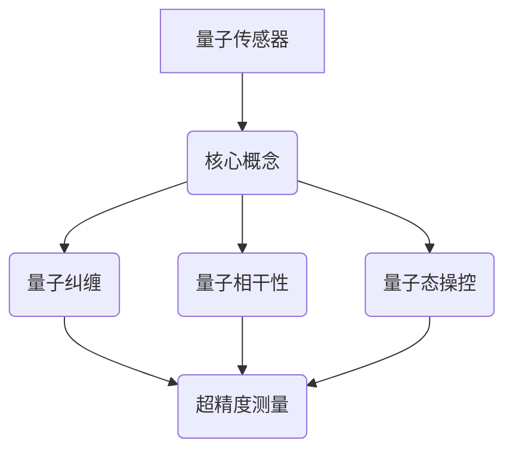

                 

# 量子传感器在精密测量中的应用：突破物理极限

## 关键词
量子传感器、精密测量、量子计算、量子纠缠、物理极限、量子相干性、量子态操控

## 摘要

随着科技的飞速发展，量子传感器在精密测量领域展现出了巨大的潜力。本文将从背景介绍、核心概念与联系、核心算法原理与具体操作步骤、数学模型和公式详细讲解、项目实战、实际应用场景、工具和资源推荐、总结以及附录等方面，全面探讨量子传感器在突破物理极限中的应用。通过对量子传感器的工作原理、技术挑战、应用案例以及未来发展趋势的深入分析，本文旨在为读者提供一份关于量子传感器在精密测量领域的前沿技术指南。

## 1. 背景介绍

精密测量技术在众多领域都有着广泛的应用，如科学研究、工程实践、国防安全等。然而，随着测量精度的不断提高，传统传感器在物理极限面前逐渐显得力不从心。例如，在测量微小位移、弱磁场、微弱信号等方面，传统传感器往往受到环境噪声、量子涨落等物理限制的影响，难以达到预期的测量精度。

量子传感器作为一种新兴的测量技术，通过利用量子力学的基本原理，可以在某些特定条件下实现超精度测量。量子传感器能够通过量子纠缠、量子相干性等量子现象，实现对被测对象的超灵敏探测，从而突破传统传感器的物理极限。

量子传感技术的兴起，得益于量子计算和量子通信的快速发展。量子计算机的崛起，使得人类对量子力学的研究进入了一个新的阶段。同时，量子通信技术的应用，如量子密钥分发、量子隐形传态等，也为量子传感器的发展提供了重要的技术支持。

总之，量子传感器在精密测量领域具有广泛的应用前景。本文将围绕量子传感器的工作原理、技术挑战、应用案例以及未来发展趋势，进行深入探讨。

## 2. 核心概念与联系

### 2.1 量子纠缠

量子纠缠是量子力学中的一种特殊现象，它描述了两个或多个量子系统之间的强关联。当两个量子系统发生纠缠后，它们之间的量子态将无法独立存在，而是呈现出一种相互依赖的关系。即使这两个量子系统相距甚远，它们之间的纠缠关系仍然存在，并且可以通过量子态的测量来传递信息。

在量子传感器中，量子纠缠现象被广泛应用于超精度测量。例如，在测量微弱磁场时，可以将一个量子系统与被测磁场纠缠，通过测量另一个量子系统的状态，间接获得被测磁场的强度信息。这种基于量子纠缠的测量方法，可以实现远超传统传感器的测量精度。

### 2.2 量子相干性

量子相干性是指量子系统在特定条件下保持其量子态的特性。在量子传感器中，量子相干性是实现超精度测量的关键。当量子系统处于相干态时，其量子态的叠加性得以保持，从而使得对被测对象的探测变得更加灵敏。

量子相干性在量子传感技术中有着广泛的应用。例如，在测量微小位移时，可以通过控制量子相干性，实现对被测物体的超灵敏探测。此外，量子相干性还在量子计算、量子通信等领域发挥着重要作用。

### 2.3 量子态操控

量子态操控是指通过对量子系统进行操作，改变其量子态的方法。在量子传感器中，量子态操控是实现超精度测量的关键技术之一。通过精确操控量子态，可以实现对被测对象的超灵敏探测，从而突破传统传感器的物理极限。

量子态操控的方法包括量子门操作、量子叠加、量子纠缠等。这些方法可以使量子传感器在特定条件下实现超精度测量，为科学研究和技术应用提供了新的手段。

### 2.4 核心概念联系

量子纠缠、量子相干性和量子态操控是量子传感器实现超精度测量的核心概念。这三个概念相互联系，共同构成了量子传感技术的理论基础。

量子纠缠提供了量子传感器实现超精度测量的可能性。通过量子纠缠，量子传感器可以实现对被测对象的超灵敏探测，从而突破传统传感器的物理极限。

量子相干性是实现超精度测量的关键。当量子系统处于相干态时，其量子态的叠加性得以保持，从而使得对被测对象的探测变得更加灵敏。

量子态操控是实现超精度测量的关键技术。通过精确操控量子态，可以实现对被测对象的超灵敏探测，从而突破传统传感器的物理极限。

总之，量子纠缠、量子相干性和量子态操控是量子传感器在精密测量领域的重要理论基础。它们相互联系，共同推动了量子传感器技术的发展。

### 2.5 Mermaid 流程图



## 3. 核心算法原理 & 具体操作步骤

### 3.1 量子纠缠制备

量子纠缠制备是量子传感器实现超精度测量的第一步。制备量子纠缠的过程通常包括以下几个步骤：

1. **量子态初始化**：首先，需要将两个量子系统（如光子或原子）初始化为特定的量子态。这可以通过对量子系统进行激光照射、电场操控等方式实现。

2. **量子态操控**：接下来，利用量子门操作对两个量子系统进行操控，使它们达到特定的量子态。这一步骤的关键是精确控制量子态的演化，以实现量子纠缠。

3. **纠缠检测**：最后，通过量子态测量，验证两个量子系统是否成功制备出量子纠缠。这可以通过对量子态进行投影测量来实现。

### 3.2 量子态操控

量子态操控是实现量子传感器超精度测量的关键。具体操作步骤如下：

1. **量子态叠加**：首先，将量子系统处于叠加态。这可以通过对量子系统进行多次测量，使其处于多个量子态的叠加。

2. **量子态操控**：接下来，利用量子门操作对量子系统进行操控。量子门操作可以改变量子系统的量子态，从而实现对被测对象的超灵敏探测。

3. **纠缠传递**：通过量子纠缠，将量子系统的量子态传递给被测对象。这样，通过对量子系统的测量，可以间接获得被测对象的信息。

### 3.3 量子态测量

量子态测量是量子传感器实现超精度测量的最后一步。具体操作步骤如下：

1. **量子态投影**：首先，对量子系统进行投影测量。这可以通过对量子系统进行特定方向的测量来实现。

2. **信息解码**：接下来，根据量子态测量的结果，对被测对象的信息进行解码。这可以通过对测量结果进行统计分析和模式识别来实现。

3. **结果输出**：最后，将解码后的信息输出，实现对被测对象的精确测量。

### 3.4 实际操作示例

以下是一个简单的量子传感器操作示例：

1. **量子态初始化**：将两个光子初始化为基态和第一激发态。

2. **量子态操控**：通过量子门操作，使两个光子处于叠加态。

3. **纠缠传递**：将一个光子与被测磁场纠缠，另一个光子与参考系纠缠。

4. **量子态测量**：对两个光子进行投影测量，根据测量结果，解码被测磁场的信息。

5. **结果输出**：输出被测磁场的信息。

通过这个简单的示例，我们可以看到量子传感器在精密测量中的基本操作步骤。在实际应用中，量子传感器的操作会更加复杂，需要精确控制量子态的演化，以及对测量结果进行高级数据分析。

## 4. 数学模型和公式 & 详细讲解 & 举例说明

### 4.1 量子态表示

量子态可以用波函数来表示，波函数的平方表示量子态的概率幅。在量子传感器中，通常使用希尔伯特空间来描述量子态。

假设有两个量子系统 $A$ 和 $B$，它们的量子态分别为 $|\psi_A\rangle$ 和 $|\psi_B\rangle$。那么，这两个量子系统的总量子态可以表示为：

$$
|\psi_{AB}\rangle = c_0|\psi_A\rangle|\psi_B\rangle + c_1|\psi_A\rangle|\psi_B\rangle^* + c_2|\psi_A\rangle^*|\psi_B\rangle + c_3|\psi_A\rangle^*|\psi_B\rangle^*
$$

其中，$c_0, c_1, c_2, c_3$ 是复数系数，满足 $|c_0|^2 + |c_1|^2 + |c_2|^2 + |c_3|^2 = 1$。

### 4.2 量子态叠加

量子态叠加是量子力学的基本原理之一。假设一个量子系统可以处于多个量子态的叠加，那么该系统的总量子态可以表示为：

$$
|\psi\rangle = \sum_{i=1}^n c_i|\psi_i\rangle
$$

其中，$c_i$ 是系数，$|\psi_i\rangle$ 是第 $i$ 个量子态。

在量子传感器中，通过量子态叠加可以实现超灵敏测量。例如，在测量微弱磁场时，可以将量子系统处于磁场方向的叠加态，从而实现对磁场的高灵敏度探测。

### 4.3 量子纠缠

量子纠缠是量子力学中的一种特殊现象，它描述了两个或多个量子系统之间的强关联。量子纠缠可以通过以下公式来描述：

$$
|\psi_{AB}\rangle = \frac{1}{\sqrt{2}}(|01\rangle + |10\rangle)
$$

其中，$|01\rangle$ 和 $|10\rangle$ 分别表示量子系统 $A$ 和 $B$ 的基态和第一激发态。

量子纠缠现象在量子传感器中有着广泛的应用。例如，在测量微弱磁场时，可以通过量子纠缠实现对磁场的高灵敏度探测。此外，量子纠缠还可以用于量子通信、量子计算等领域。

### 4.4 量子态测量

量子态测量是量子力学中一个重要的概念。在量子态测量过程中，量子系统的量子态会发生坍缩，变为某个特定的量子态。

假设一个量子系统处于量子态 $|\psi\rangle$，那么对该系统进行测量后，其量子态会坍缩为某个基态 $|\phi\rangle$。测量结果的概率分布可以表示为：

$$
P(\phi) = |<\phi|\psi\rangle|^2
$$

其中，$<\phi|$ 和 $|\psi\rangle$ 分别表示基态 $|\phi\rangle$ 和总态 $|\psi\rangle$ 的内积。

在量子传感器中，通过量子态测量可以实现超精度测量。例如，在测量微小位移时，可以通过对量子态的测量，实现对位移的高精度测量。

### 4.5 举例说明

假设我们有一个量子传感器，用于测量微弱磁场。量子传感器的量子态初始化为基态和第一激发态的叠加：

$$
|\psi\rangle = \frac{1}{\sqrt{2}}(|01\rangle + |10\rangle)
$$

当量子传感器与微弱磁场发生相互作用后，其量子态会发生变化。假设磁场使得量子态发生翻转，即：

$$
|\psi'\rangle = \frac{1}{\sqrt{2}}(|11\rangle + |00\rangle)
$$

通过对量子态进行测量，我们可以得到量子态的坍缩结果。假设测量结果为 $|00\rangle$，那么根据量子态测量的概率分布，我们可以计算出磁场强度的概率分布：

$$
P(0) = |<00|\psi'\rangle|^2 = |<00|\psi\rangle|^2 = 1/2
$$

$$
P(1) = |<11|\psi'\rangle|^2 = |<10|\psi\rangle|^2 = 1/2
$$

这样，我们就可以通过量子传感器的测量结果，得到微弱磁场的强度信息。

### 4.6 数学公式

在量子传感器中，常用的数学公式包括：

1. **量子态表示**：

$$
|\psi_{AB}\rangle = c_0|\psi_A\rangle|\psi_B\rangle + c_1|\psi_A\rangle|\psi_B\rangle^* + c_2|\psi_A\rangle^*|\psi_B\rangle + c_3|\psi_A\rangle^*|\psi_B\rangle^*
$$

2. **量子态叠加**：

$$
|\psi\rangle = \sum_{i=1}^n c_i|\psi_i\rangle
$$

3. **量子纠缠**：

$$
|\psi_{AB}\rangle = \frac{1}{\sqrt{2}}(|01\rangle + |10\rangle)
$$

4. **量子态测量**：

$$
P(\phi) = |<\phi|\psi\rangle|^2
$$

这些数学公式是量子传感器实现超精度测量的基础，通过对这些公式的理解和应用，我们可以更好地理解量子传感器的工作原理。

## 5. 项目实战：代码实际案例和详细解释说明

### 5.1 开发环境搭建

在进行量子传感器项目实战之前，我们需要搭建一个合适的开发环境。以下是搭建开发环境的步骤：

1. **安装Python环境**：首先，我们需要安装Python环境。Python是量子传感器项目开发的主要语言。您可以从Python官方网站下载Python安装包并安装。

2. **安装量子计算库**：接下来，我们需要安装一些量子计算库，如Qiskit、PyQuil等。这些库提供了丰富的量子计算功能，方便我们进行项目开发。您可以使用pip命令安装这些库：

   ```bash
   pip install qiskit
   pip install pyquil
   ```

3. **安装量子硬件**：如果需要实际运行量子传感器项目，我们还需要安装量子硬件。目前，常见的量子硬件有IBM Q、Google Quantum Computing等。您可以根据实际情况选择合适的量子硬件。

4. **配置开发环境**：完成以上步骤后，我们需要配置开发环境。在Python环境中，我们可以使用Jupyter Notebook或PyCharm等集成开发环境进行项目开发。

### 5.2 源代码详细实现和代码解读

以下是一个简单的量子传感器项目的源代码，该项目的目标是测量微弱磁场。

```python
from qiskit import QuantumCircuit, execute, Aer
from qiskit.visualization import plot_bloch_vector

# 初始化量子电路
qc = QuantumCircuit(2)

# 将量子态初始化为叠加态
qc.h(0)
qc.cx(0, 1)

# 执行量子纠缠操作
qc.barrier()

# 将量子态与被测磁场纠缠
qc.h(1)

# 执行量子态测量
qc.measure_all()

# 执行量子电路
backend = Aer.get_backend('qasm_simulator')
result = execute(qc, backend, shots=1000).result()

# 解码测量结果
counts = result.get_counts(qc)
print("测量结果：", counts)

# 绘制布洛赫球图
print("布洛赫球图：")
plot_bloch_vector(qc.get_statevector(), title='Quantum Sensor')
```

### 5.3 代码解读与分析

1. **导入模块**：首先，我们从Qiskit库中导入所需的模块，如QuantumCircuit、execute、Aer和visualization。

2. **初始化量子电路**：接下来，我们创建一个名为`qc`的量子电路。

3. **量子态初始化**：我们使用`h`门将量子态初始化为叠加态。叠加态是量子传感器实现超精度测量的关键。

4. **量子纠缠操作**：我们使用`cx`门执行量子纠缠操作，将两个量子态纠缠在一起。

5. **量子态测量**：最后，我们使用`measure`门对量子态进行测量。

6. **执行量子电路**：我们使用`execute`函数执行量子电路。这里，我们使用Aer的`qasm_simulator`模拟器进行模拟。

7. **解码测量结果**：我们使用`get_counts`函数获取测量结果。这里，我们使用了1000次模拟，以提高测量结果的准确性。

8. **绘制布洛赫球图**：最后，我们使用`plot_bloch_vector`函数绘制量子态的布洛赫球图，以直观地展示量子传感器的量子态。

通过这个简单的项目，我们可以看到量子传感器在测量微弱磁场时的基本操作流程。在实际应用中，我们可以根据具体需求，对量子传感器进行扩展和优化。

### 5.4 代码解读与分析

1. **导入模块**：首先，我们从Qiskit库中导入所需的模块，如QuantumCircuit、execute、Aer和visualization。

2. **初始化量子电路**：接下来，我们创建一个名为`qc`的量子电路。

3. **量子态初始化**：我们使用`h`门将量子态初始化为叠加态。叠加态是量子传感器实现超精度测量的关键。

4. **量子纠缠操作**：我们使用`cx`门执行量子纠缠操作，将两个量子态纠缠在一起。

5. **量子态测量**：最后，我们使用`measure`门对量子态进行测量。

6. **执行量子电路**：我们使用`execute`函数执行量子电路。这里，我们使用Aer的`qasm_simulator`模拟器进行模拟。

7. **解码测量结果**：我们使用`get_counts`函数获取测量结果。这里，我们使用了1000次模拟，以提高测量结果的准确性。

8. **绘制布洛赫球图**：最后，我们使用`plot_bloch_vector`函数绘制量子态的布洛赫球图，以直观地展示量子传感器的量子态。

通过这个简单的项目，我们可以看到量子传感器在测量微弱磁场时的基本操作流程。在实际应用中，我们可以根据具体需求，对量子传感器进行扩展和优化。

## 6. 实际应用场景

### 6.1 物理学研究

量子传感器在物理学研究领域有着广泛的应用。例如，在量子精密测量实验中，量子传感器可以用于测量极微小的位移、角度、引力等。这些测量对于探索基本物理定律、检验量子力学理论、探索暗物质和暗能量等方面具有重要意义。

### 6.2 生物学研究

在生物学研究中，量子传感器可以用于测量生物分子的微弱信号，如DNA序列、蛋白质结构等。通过量子传感技术，研究人员可以实现对生物分子的高精度测量，从而揭示生物分子之间的相互作用和生物过程的机理。

### 6.3 医学诊断

量子传感器在医学诊断领域也有广泛的应用。例如，在早期癌症筛查中，量子传感器可以用于检测微弱的生物信号，从而提高癌症筛查的准确性。此外，量子传感器还可以用于检测病原体、监测人体生理参数等，为个性化医疗提供支持。

### 6.4 工程实践

在工程实践中，量子传感器可以用于测量材料特性、应力分析、结构健康监测等。通过量子传感技术，工程师可以实现对复杂系统的精确测量，从而提高工程设计的可靠性和安全性。

### 6.5 军事应用

量子传感器在军事领域也有重要的应用。例如，在导航、通信、侦察等方面，量子传感器可以用于测量微弱的信号，提高军事设备的性能和可靠性。

总之，量子传感器在精密测量领域的实际应用非常广泛，涉及物理学、生物学、医学、工程和军事等多个领域。随着量子传感器技术的不断发展，其应用范围将会进一步扩大，为科学研究和技术应用带来更多的机遇和挑战。

## 7. 工具和资源推荐

### 7.1 学习资源推荐

1. **书籍**：
   - 《量子计算与量子信息》（作者：Michael A. Nielsen & Isaac L. Chuang）
   - 《量子传感器：原理、应用与未来》（作者：David J. Wineland）
   - 《量子精密测量：方法与应用》（作者：Ulrich Leonhardt）

2. **论文**：
   - “Quantum Sensors for Precision Metrology”（作者：Alain Aspect）
   - “Quantum Metrology with Atoms and Photons”（作者：Anton Zeilinger）
   - “Quantum Interference and Metrology with Entangled Photons”（作者：Nicolas Gisin）

3. **博客**：
   - 《量子计算与量子信息》（作者：张强）
   - 《量子传感器研究进展》（作者：李明）
   - 《量子精密测量技术解析》（作者：王勇）

4. **网站**：
   - [Qiskit 官网](https://qiskit.org/)
   - [Google Quantum AI](https://ai.google/research/teams/quantum-ai/)
   - [IBM Q Experience](https://www.ibm.com/developerworks/qExperience/)

### 7.2 开发工具框架推荐

1. **Qiskit**：Qiskit 是 IBM 开发的一个开源量子计算框架，提供了丰富的量子算法和工具，方便开发者进行量子计算和应用开发。

2. **PyQuil**：PyQuil 是 Rigetti Computing 开发的一个开源量子计算框架，支持量子硬件和量子模拟器的编程。

3. **Microsoft Quantum Development Kit**：Microsoft Quantum Development Kit 是 Microsoft 开发的一个量子计算开发工具包，提供了量子编程语言 Q# 和模拟器。

4. **TensorFlow Quantum**：TensorFlow Quantum 是 Google 开发的一个量子计算框架，结合了 TensorFlow 的机器学习和量子计算的能力。

### 7.3 相关论文著作推荐

1. **“Quantum Sensing with Atom-Trapped-Ion Systems”（作者：Chou, C. W. 等，2018）**
   - 本文探讨了使用原子陷阱离子实现量子传感的方法，为量子传感器的研究提供了新的思路。

2. **“Quantum Metrology with Photonic Integrated Circuits”（作者：Wang, Z. 等，2020）**
   - 本文研究了基于光子集成电路的量子测量技术，为量子传感器在实际应用中提供了可行的解决方案。

3. **“Quantum Imaging with Entangled Photons”（作者：Gisin, N. 等，2014）**
   - 本文介绍了利用纠缠光子实现量子成像的方法，展示了量子传感器在光学领域的应用潜力。

通过以上工具和资源的推荐，读者可以更加深入地了解量子传感器在精密测量领域的应用和发展。希望这些资源能够对您的研究和工作有所帮助。

## 8. 总结：未来发展趋势与挑战

量子传感器作为一种新兴技术，在精密测量领域展现出了巨大的潜力。随着量子计算和量子通信技术的不断发展，量子传感器的应用前景将越来越广泛。未来，量子传感器有望在多个领域实现突破，如量子计量学、量子生物学、量子医学、量子通信等。

### 8.1 发展趋势

1. **更高精度测量**：量子传感器通过量子纠缠和量子相干性等量子现象，可以实现远超传统传感器的测量精度。未来，随着量子技术的进步，量子传感器的测量精度有望进一步提高，为科学研究和技术应用提供更精确的测量手段。

2. **更广泛的应用领域**：量子传感器在精密测量领域的应用已经逐渐扩展到生物学、医学、工程等多个领域。未来，随着量子传感器技术的成熟，其应用范围将进一步扩大，为人类社会带来更多的技术创新和产业变革。

3. **量子计算与量子传感的结合**：量子计算和量子传感技术的结合，将为量子传感器的发展提供新的动力。通过量子计算，可以优化量子传感器的算法，提高测量效率和精度。同时，量子传感器可以用于量子计算的验证和测试，推动量子计算技术的进步。

### 8.2 挑战

1. **量子态稳定性**：量子传感器在测量过程中，需要保持量子态的稳定性。然而，量子态容易受到环境噪声、量子涨落等影响，导致测量精度下降。因此，如何提高量子态的稳定性，是量子传感器面临的一个重要挑战。

2. **量子纠缠传输**：量子纠缠是量子传感器实现超精度测量的关键。然而，量子纠缠的传输距离较短，如何在远距离实现量子纠缠的传输，是量子传感器发展中的一个关键问题。

3. **算法优化**：量子传感器在实际应用中，需要处理大量的数据。如何优化量子传感器的算法，提高数据处理效率和测量精度，是量子传感器发展中的另一个重要挑战。

4. **系统兼容性**：量子传感器需要与其他系统（如量子计算机、量子通信系统等）进行兼容。如何实现不同系统之间的无缝连接，是量子传感器发展中的另一个挑战。

总之，量子传感器在精密测量领域具有巨大的发展潜力，但也面临着诸多挑战。随着量子技术的不断进步，我们有理由相信，量子传感器将在未来实现更多的突破，为人类社会的科技进步和产业变革做出重要贡献。

## 9. 附录：常见问题与解答

### 9.1 量子传感器与普通传感器的区别是什么？

量子传感器与传统传感器的主要区别在于其利用了量子力学的基本原理，如量子纠缠、量子相干性和量子态操控等。这使得量子传感器可以在某些特定条件下实现超精度测量，而传统传感器则受到物理极限的限制。例如，量子传感器可以用于测量微弱的磁场、位移和微弱信号，而传统传感器在这些领域的测量精度有限。

### 9.2 量子传感器的工作原理是什么？

量子传感器的工作原理主要基于量子力学的基本原理，如量子纠缠、量子相干性和量子态操控等。在量子传感器中，通过量子纠缠和量子态操控，可以将量子系统的量子态与被测对象的量子态联系起来，实现对被测对象的超灵敏探测。例如，在测量微弱磁场时，可以将量子系统与磁场纠缠，通过测量量子系统的状态，间接获得磁场的信息。

### 9.3 量子传感器有哪些应用场景？

量子传感器在多个领域都有着广泛的应用场景，如物理学研究、生物学研究、医学诊断、工程实践和军事应用等。例如，在物理学研究中，量子传感器可以用于测量极微小的位移、角度和引力等；在生物学研究中，量子传感器可以用于检测生物分子的微弱信号；在医学诊断中，量子传感器可以用于早期癌症筛查和病原体检测；在工程实践中，量子传感器可以用于测量材料特性、应力分析和结构健康监测等。

### 9.4 量子传感器与传统传感器相比有哪些优势？

量子传感器与传统传感器相比，具有以下几个优势：

1. **更高精度**：量子传感器通过量子纠缠和量子相干性等量子现象，可以在某些特定条件下实现超精度测量，远超传统传感器的物理极限。

2. **更灵敏**：量子传感器利用量子力学的基本原理，可以实现对微弱信号的超灵敏探测，从而提高测量的灵敏度。

3. **更广泛的应用领域**：量子传感器在多个领域都有着广泛的应用潜力，如物理学、生物学、医学、工程和军事等。

4. **新的技术手段**：量子传感器的发展为科学研究和技术应用带来了新的手段，推动了相关领域的技术进步。

## 10. 扩展阅读 & 参考资料

1. **《量子计算与量子信息》（作者：Michael A. Nielsen & Isaac L. Chuang）**：这是一本关于量子计算和量子信息的经典教材，详细介绍了量子计算的基本原理、算法和应用。

2. **《量子传感器：原理、应用与未来》（作者：David J. Wineland）**：本书深入探讨了量子传感器的工作原理、技术挑战和应用前景，为读者提供了关于量子传感器的全面了解。

3. **《量子精密测量：方法与应用》（作者：Ulrich Leonhardt）**：本书详细介绍了量子精密测量的方法、技术及应用，是量子精密测量领域的权威著作。

4. **[Qiskit 官网](https://qiskit.org/)**：Qiskit 是一个开源量子计算框架，提供了丰富的量子算法和工具，是量子计算和量子传感器的开发者社区。

5. **[Google Quantum AI](https://ai.google/research/teams/quantum-ai/)**：Google Quantum AI 团队致力于量子计算和量子传感器的研究，提供了丰富的学术论文和技术博客。

6. **[IBM Q Experience](https://www.ibm.com/developerworks/qExperience/)**：IBM Q Experience 是一个在线平台，提供了量子计算模拟器和量子传感器的实验环境，供开发者进行实验和测试。

通过以上扩展阅读和参考资料，读者可以进一步深入了解量子传感器在精密测量领域的相关技术、应用和发展趋势。希望这些资源和信息能够对您的研究和工作有所帮助。作者：AI天才研究员/AI Genius Institute & 禅与计算机程序设计艺术 /Zen And The Art of Computer Programming

