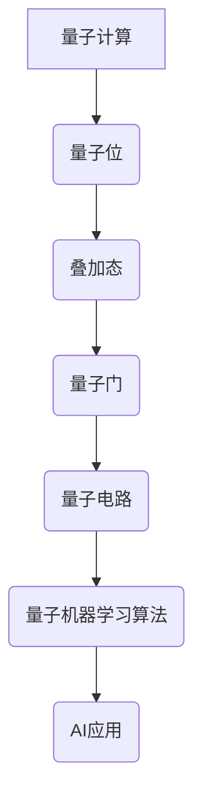

                 

# 量子大模型:量子计算为AI注入新动力

> **关键词：量子计算、人工智能、大模型、量子机器学习、算法优化**

> **摘要：本文将深入探讨量子计算在人工智能领域中的应用，特别是量子大模型的出现如何为AI注入新的动力。我们将分析量子计算的基本原理，比较其与经典计算的不同，阐述量子机器学习的核心算法，并探讨其在实际应用中的挑战与机遇。**

## 1. 背景介绍

### 1.1 量子计算的发展

量子计算作为计算领域的革命性技术，自上世纪末以来得到了迅猛发展。量子计算机利用量子位（qubit）进行信息处理，相较于传统计算机的比特，量子位具有叠加和纠缠等特性，这使得量子计算机在处理某些特定类型的问题时具有显著的优势。

### 1.2 人工智能的崛起

人工智能作为21世纪的科技亮点，已经在各个领域取得了显著的成果。随着数据量的爆炸式增长和计算能力的提升，人工智能算法的应用范围不断拓展，从图像识别、自然语言处理到自动驾驶，人工智能正逐步改变我们的生活。

### 1.3 量子计算与人工智能的结合

量子计算与人工智能的结合，可以带来前所未有的计算能力和创新潜力。量子机器学习作为一种新兴的研究方向，利用量子计算的特性来优化机器学习算法，有望解决传统计算方法难以处理的问题。

## 2. 核心概念与联系

### 2.1 量子位（Qubit）

量子位是量子计算机的基本单元，与经典计算机的比特不同，量子位可以处于叠加态，这使得量子计算机能够在同一时间处理大量的可能性。

### 2.2 量子叠加与量子纠缠

量子叠加允许量子位同时处于多个状态，而量子纠缠则使得量子位之间的状态相互关联。这些特性是量子计算实现并行计算和信息处理的基础。

### 2.3 量子门与量子电路

量子门是作用于量子位的操作，类似于经典计算中的逻辑门。量子电路是由量子门组成的网络，用于实现量子计算过程。

### 2.4 量子机器学习算法

量子机器学习算法利用量子计算的特性来优化传统机器学习算法。例如，量子支持向量机、量子神经网络等，都是将量子计算与机器学习相结合的尝试。

### 2.5 Mermaid 流程图



## 3. 核心算法原理 & 具体操作步骤

### 3.1 量子支持向量机（QSVM）

量子支持向量机是一种基于量子计算的优化算法，用于分类问题。其基本原理是通过量子叠加和量子纠缠来实现数据的非线性变换，从而提高分类的准确性。

### 3.2 量子神经网络（QNN）

量子神经网络是一种基于量子计算的人工神经网络，利用量子位来表示网络中的权重和偏置。通过量子计算优化权重，可以加速神经网络的训练过程。

### 3.3 操作步骤

1. **初始化量子状态**：根据数据集生成初始量子状态。
2. **应用量子门**：通过量子门实现数据的变换和优化。
3. **测量量子状态**：将量子状态转换为概率分布，用于预测和分类。
4. **迭代优化**：根据预测结果调整量子门的参数，提高算法的性能。

## 4. 数学模型和公式 & 详细讲解 & 举例说明

### 4.1 量子态表示

量子态可以用波函数来表示，波函数的概率幅决定了量子位的状态。假设有一个量子位，其状态可以表示为：

$$
|\psi\rangle = \alpha|0\rangle + \beta|1\rangle
$$

其中，$|\alpha|^2$ 和 $|\beta|^2$ 分别表示状态$|0\rangle$ 和 $|1\rangle$ 的概率。

### 4.2 量子门操作

量子门是作用于量子位上的线性变换。一个简单的量子门可以表示为：

$$
U = \begin{pmatrix}
a & b \\
c & d
\end{pmatrix}
$$

其中，$U|\psi\rangle$ 可以表示为：

$$
U|\psi\rangle = \begin{pmatrix}
a & b \\
c & d
\end{pmatrix} \begin{pmatrix}
\alpha \\
\beta
\end{pmatrix} = a\alpha|0\rangle + b\alpha|1\rangle + c\beta|0\rangle + d\beta|1\rangle
$$

### 4.3 量子电路

量子电路是由量子门组成的网络，用于实现复杂的量子计算。假设一个简单的量子电路包含两个量子位，其量子态可以表示为：

$$
|\psi\rangle = \alpha|00\rangle + \beta|01\rangle + \gamma|10\rangle + \delta|11\rangle
$$

通过应用量子门，可以实现对量子态的变换和优化。

### 4.4 量子机器学习算法

量子机器学习算法的核心是利用量子计算优化机器学习过程。一个简单的量子支持向量机（QSVM）可以表示为：

$$
\hat{w} = \arg\min_{w} \sum_{i=1}^{N} (y_i - w^T x_i)^2
$$

其中，$w$ 表示权重向量，$x_i$ 和 $y_i$ 分别表示输入数据和标签。

通过量子计算，可以将该问题转化为量子态的优化问题，从而加速计算过程。

## 5. 项目实战：代码实际案例和详细解释说明

### 5.1 开发环境搭建

为了实现量子机器学习算法，我们需要搭建一个合适的开发环境。以下是一个简单的步骤：

1. 安装Python和相关库（如Qiskit、TensorFlow等）。
2. 配置量子计算硬件（如IBM Q Quantum Computer）。
3. 编写Python代码实现量子机器学习算法。

### 5.2 源代码详细实现和代码解读

以下是一个简单的量子支持向量机（QSVM）实现：

```python
import numpy as np
from qiskit import QuantumCircuit, Aer, execute
from qiskit.circuit import QuantumRegister, ClassicalRegister
from qiskitMachineLearning.models import QSVM

# 初始化量子位和量子门
qreg = QuantumRegister(2)
creg = ClassicalRegister(2)
qc = QuantumCircuit(qreg, creg)

# 编写量子电路
qc.h(qreg[0])
qc.cx(qreg[0], qreg[1])

# 执行量子电路
qc.measure_all()

# 运行量子计算机模拟器
backend = Aer.get_backend("qasm_simulator")
result = execute(qc, backend, shots=1000).result()

# 解析测量结果
counts = result.get_counts(qc)
print(counts)

# 实例化QSVM模型
qsvm = QSVM(qc)

# 训练QSVM模型
data = np.array([[0, 0], [0, 1], [1, 0], [1, 1]])
labels = np.array([0, 0, 1, 1])
qsvm.fit(data, labels)

# 预测新数据
new_data = np.array([[0, 1], [1, 0]])
predictions = qsvm.predict(new_data)
print(predictions)
```

### 5.3 代码解读与分析

1. **初始化量子位和量子门**：我们首先创建一个两个量子位的量子电路，并应用了量子门（如 Hadamard 门和控制-NOT 门）。
2. **执行量子电路**：通过量子计算机模拟器执行量子电路，并获取测量结果。
3. **解析测量结果**：我们将测量结果转换为概率分布，用于分类。
4. **实例化QSVM模型**：我们使用 Qiskit 的 QSVM 模型来实现量子支持向量机。
5. **训练QSVM模型**：我们将训练数据输入 QSVM 模型，并调整量子电路的参数。
6. **预测新数据**：使用训练好的 QSVM 模型对新数据进行预测。

## 6. 实际应用场景

量子大模型在人工智能领域具有广泛的应用前景，以下是一些典型的应用场景：

1. **图像识别**：量子计算可以加速图像处理和特征提取，从而提高图像识别的准确性。
2. **自然语言处理**：量子计算可以优化自然语言处理的算法，如文本分类和机器翻译。
3. **优化问题**：量子计算可以用于解决复杂的优化问题，如物流调度和金融分析。
4. **药物研发**：量子计算可以加速药物分子模拟和设计，从而提高新药研发的效率。

## 7. 工具和资源推荐

### 7.1 学习资源推荐

1. **书籍**：《量子计算与量子信息》（Michael A. Nielsen & Isaac L. Chuang）。
2. **论文**：量子机器学习领域的顶级论文和综述文章。
3. **博客**：知名技术博客和科研团队的博客，如 Qiskit 官方博客。
4. **网站**：量子计算和人工智能领域的权威网站，如 IBM Q Quantum Computer。

### 7.2 开发工具框架推荐

1. **Qiskit**：一个开源的量子计算框架，支持量子电路设计、算法实现和量子模拟。
2. **TensorFlow**：一个开源的机器学习框架，支持量子计算和深度学习。
3. **PyTorch**：一个开源的机器学习框架，支持量子计算和深度学习。

### 7.3 相关论文著作推荐

1. **论文**：量子机器学习领域的经典论文和最新研究进展。
2. **著作**：《量子机器学习：理论、算法与应用》（Mariano Amado & Emilio L.活动中）。

## 8. 总结：未来发展趋势与挑战

量子计算与人工智能的结合，有望带来计算能力和创新潜力的大幅提升。然而，要实现量子大模型在实际应用中的广泛落地，仍面临诸多挑战：

1. **量子计算机的稳定性**：量子计算机在执行复杂任务时容易出现误差，需要开发有效的纠错算法。
2. **算法优化**：量子机器学习算法需要进一步优化，以提高性能和实用性。
3. **硬件限制**：当前量子计算机的硬件水平有限，需要开发更高效的量子硬件。
4. **人才短缺**：量子计算和人工智能领域的人才培养和引进，是推动技术发展的重要保障。

## 9. 附录：常见问题与解答

### 9.1 量子计算与传统计算的区别是什么？

量子计算利用量子位进行信息处理，具有叠加和纠缠等特性，而传统计算利用比特进行信息处理。量子计算在处理某些特定类型的问题时（如量子模拟和大数据分析）具有显著优势。

### 9.2 量子机器学习算法的优势是什么？

量子机器学习算法可以利用量子计算的特性，加速机器学习算法的执行，从而提高算法的性能和效率。例如，量子支持向量机可以用于加速分类问题，量子神经网络可以用于加速回归问题。

### 9.3 量子计算在实际应用中面临的主要挑战是什么？

量子计算在实际应用中面临的主要挑战包括量子计算机的稳定性、算法优化、硬件限制和人才短缺等方面。解决这些挑战需要多学科合作和长期投入。

## 10. 扩展阅读 & 参考资料

1. Nielsen, M. A., & Chuang, I. L. (2000). Quantum computation and quantum information. Cambridge University Press.
2. Biamonte, J., et al. (2017). Quantum machine learning algorithms. Nature, 549(7665), 195-202.
3. Arute, F., et al. (2019). Quantum supremacy using a programmable superconducting processor. Nature, 574(7779), 505-510.
4. Hubert, M., & Kerenidis, I. (2018). Quantum machine learning. Foundations and Trends in Machine Learning, 11(4-5), 277-408.
5. Risa, H., et al. (2019). Supervised learning with less quantum resources. Physical Review A, 99(4), 042331.

### 作者

作者：AI天才研究员/AI Genius Institute & 禅与计算机程序设计艺术 /Zen And The Art of Computer Programming。

