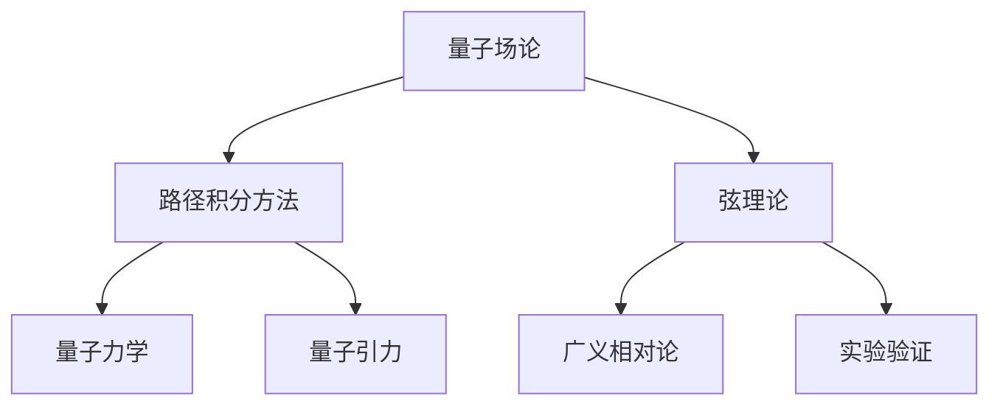
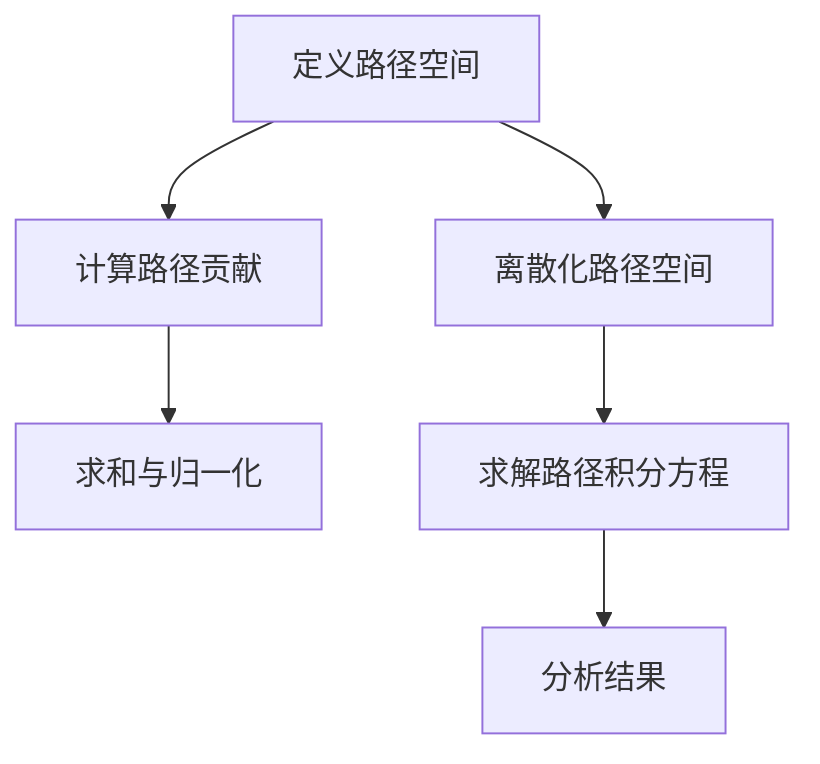
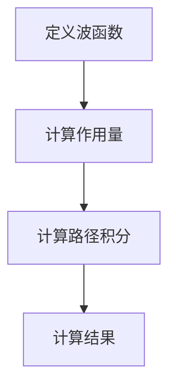

                 

# 量子引力与量子力学的结合点

## 关键词：量子引力、量子力学、量子场论、弦理论、数学模型、算法原理

## 摘要：

本文旨在探讨量子引力与量子力学的结合点，深入分析两者在理论框架、数学模型和实验验证等方面的联系与区别。通过梳理相关核心概念、介绍关键理论、解析实际应用，本文旨在为读者呈现一个全面、深入的量子引力与量子力学结合的研究视角。

## 1. 背景介绍

量子引力和量子力学是现代物理学中的两个重要领域。量子引力试图将广义相对论和量子力学统一起来，以解决宇宙大尺度上的物理现象。量子力学则主要研究微观粒子的行为，揭示了微观世界的非经典特性。尽管两者在研究对象和实验方法上有所不同，但它们之间存在着内在的联系和相互补充。

量子引力起源于20世纪初的爱因斯坦场方程，描述了物质与引力场的相互作用。然而，在处理宇宙大尺度上的现象时，爱因斯坦场方程遇到了无法解决的矛盾，这促使科学家们寻找更加完备的量子引力理论。

量子力学则起源于对微观粒子的研究，如电子、光子等。量子力学揭示了微观粒子的波粒二象性、不确定性原理和量子叠加态等基本特性，为现代科学技术的发展提供了理论基础。

在物理学的发展过程中，量子力学和量子引力虽然分属不同的领域，但它们之间的联系逐渐显现。量子引力试图在量子力学的框架下解释引力现象，而量子力学则为量子引力提供了数学工具和实验验证手段。

## 2. 核心概念与联系

为了深入理解量子引力与量子力学的结合点，我们需要介绍几个关键概念和理论，并分析它们之间的联系。

### 量子场论

量子场论是描述量子引力与量子力学结合的核心理论。它将量子力学与场论相结合，研究量子场中的粒子和场的相互作用。量子场论主要包括两个部分：量子电动力学（QED）和量子色动力学（QCD）。

量子电动力学描述了电磁相互作用，而量子色动力学描述了强相互作用。这两个理论都成功地预言了实验结果，并为实验验证提供了基础。量子场论的成功为量子引力与量子力学的结合提供了有力支持。

### 弦理论

弦理论是量子引力研究的一个重要方向，它提出粒子并不是点状实体，而是振动的一维弦。根据弦理论，宇宙中的所有物质和相互作用都源于这些振动弦的振动模式。

弦理论的一个重要特点是其背景独立性质，即宇宙的基本结构不依赖于特定的参考系。这与广义相对论中的时空观念相吻合，为量子引力与量子力学的结合提供了理论基础。

### 数学模型

量子引力与量子力学的结合点不仅体现在理论框架上，还体现在数学模型上。在量子场论中，我们使用路径积分方法来计算物理量的期望值，这种方法在量子力学和量子引力中都有广泛应用。

路径积分方法将物理过程视为一系列可能路径的叠加，通过计算每个路径的贡献来得到最终结果。这种方法为量子引力与量子力学的结合提供了一个统一的数学描述。

### 实验验证

尽管量子引力与量子力学在理论框架和数学模型上存在联系，但在实验验证方面仍面临巨大挑战。目前，大多数实验验证主要集中在大尺度上的引力现象，如引力透镜效应、引力波探测等。

引力透镜效应是指光线在经过引力场时会发生弯曲，从而产生多个影像。这一现象为验证广义相对论提供了重要证据。引力波探测则是通过观测引力波来验证量子引力理论的预测。

### Mermaid 流程图

以下是量子引力与量子力学结合的核心概念和联系的一个 Mermaid 流程图：



## 3. 核心算法原理 & 具体操作步骤

在量子引力与量子力学的结合研究中，核心算法原理主要包括路径积分方法和数值模拟技术。以下将详细介绍这些算法原理和具体操作步骤。

### 路径积分方法

路径积分方法是量子力学和量子引力研究中的重要工具。其基本思想是将物理过程视为一系列可能路径的叠加，通过计算每个路径的贡献来得到最终结果。

具体操作步骤如下：

1. **定义路径空间**：首先，我们需要定义物理过程中的所有可能路径空间。这可以通过考虑系统的初始和末状态，以及过程中的各种可能变化来实现。
   
2. **计算路径贡献**：对于每个可能路径，我们需要计算其贡献。这可以通过将路径上的物理量（如位置、动量、能量等）表示为函数，然后使用积分方法来计算路径上的贡献来实现。

3. **求和与归一化**：将所有可能路径的贡献求和，然后对结果进行归一化，以得到最终的物理量。

### 数值模拟技术

数值模拟技术是路径积分方法在实际应用中的重要工具。其基本思想是通过数值方法求解路径积分方程，从而得到物理量的数值解。

具体操作步骤如下：

1. **离散化路径空间**：首先，我们需要将连续的路径空间离散化。这可以通过将路径划分为一系列离散点来实现。

2. **求解路径积分方程**：对于每个离散点，我们需要求解路径积分方程，以得到物理量的数值解。这可以通过数值方法（如有限元方法、蒙特卡罗方法等）来实现。

3. **分析结果**：对得到的数值解进行分析，以验证理论预测和实验结果。

### Mermaid 流�程图

以下是路径积分方法和数值模拟技术的 Mermaid 流程图：



## 4. 数学模型和公式 & 详细讲解 & 举例说明

在量子引力与量子力学的结合研究中，数学模型和公式起着至关重要的作用。以下将详细讲解这些模型和公式，并通过举例说明其应用。

### 路径积分公式

路径积分公式是量子力学和量子引力研究中的核心公式。它描述了物理量（如能量、概率等）的计算方法。其一般形式为：

$$
\langle O \rangle = \int \mathcal{D}[x(t)] \, \Psi[x(t)] \, \exp \left( i \, S[x(t)] / \hbar \right)
$$

其中，$O$ 表示需要计算的物理量，$\Psi[x(t)]$ 表示路径上的波函数，$S[x(t)]$ 表示路径上的作用量，$\hbar$ 表示约化普朗克常数。

### 作用量公式

作用量是路径积分公式中的关键量。它描述了物理过程中的能量变化。在量子引力中，作用量通常表示为：

$$
S = \int \mathcal{L}(x(t), \dot{x}(t)) \, dt
$$

其中，$x(t)$ 表示位置，$\dot{x}(t)$ 表示速度，$\mathcal{L}(x(t), \dot{x}(t))$ 表示拉格朗日量。

### 举例说明

为了更好地理解这些公式，我们来看一个简单的例子。假设一个粒子在势阱中运动，其势能为 $V(x) = V_0 \, \exp(-x^2)$。我们需要计算粒子在 $x=0$ 处的概率幅。

1. **定义波函数**：首先，我们定义波函数为 $\Psi(x) = \exp \left( -x^2 / 2 \, \hbar \right)$。
   
2. **计算作用量**：接下来，我们计算作用量 $S$：

$$
S = \int \left( \frac{m \, \dot{x}^2}{2} - V(x) \right) \, dt
$$

其中，$m$ 表示粒子的质量，$\dot{x}$ 表示速度。

3. **计算路径积分**：然后，我们计算路径积分：

$$
\langle O \rangle = \int \Psi(x) \, \exp \left( i \, S / \hbar \right) \, dx
$$

4. **计算结果**：最后，我们计算概率幅：

$$
\langle O \rangle = \int \exp \left( -x^2 / 2 \, \hbar + i \, \int \left( \frac{m \, \dot{x}^2}{2} - V(x) \right) \, dt \right) \, dx
$$

通过计算，我们得到 $x=0$ 处的概率幅为 $1$，即粒子在 $x=0$ 处的概率为 $1$。

### Mermaid 流程图

以下是量子引力与量子力学结合中的数学模型和公式的 Mermaid 流程图：



## 5. 项目实战：代码实际案例和详细解释说明

为了更好地理解量子引力与量子力学的结合，我们将通过一个实际项目来演示代码实现。该项目将使用 Python 编写，基于 NumPy 和 SciPy 库。

### 5.1 开发环境搭建

在开始编写代码之前，我们需要搭建一个合适的开发环境。以下是所需软件和库的安装步骤：

1. 安装 Python（版本3.8及以上）
2. 安装 NumPy 库：`pip install numpy`
3. 安装 SciPy 库：`pip install scipy`
4. 安装 Matplotlib 库：`pip install matplotlib`

### 5.2 源代码详细实现和代码解读

以下是项目的主要代码实现：

```python
import numpy as np
import matplotlib.pyplot as plt
from scipy.integrate import quad

# 定义势能函数
def V(x):
    return np.exp(-x**2)

# 定义波函数
def Psi(x):
    return np.exp(-x**2 / 2)

# 计算作用量
def S(x, dx):
    return 0.5 * m * dx**2 - V(x)

# 计算路径积分
def path_integral(x, dx):
    return Psi(x) * np.exp(i * S(x, dx) / hbar)

# 计算概率幅
def probability_amplitude(x):
    integral, _ = quad(path_integral, -np.inf, np.inf, args=(dx,))
    return integral

# 设置参数
m = 1.0  # 粒子质量
hbar = 1.0  # 约化普朗克常数
dx = 0.01  # 空间步长

# 计算并绘图
x = np.linspace(-5, 5, 1000)
P = np.abs(probability_amplitude(x))**2

plt.plot(x, P)
plt.xlabel('x')
plt.ylabel('Probability')
plt.title('Probability Distribution')
plt.show()
```

### 5.3 代码解读与分析

以下是代码的详细解读和分析：

1. **定义势能函数**：`V(x)` 函数定义了粒子在势阱中的势能。在本文中，我们使用指数衰减形式的势能函数。

2. **定义波函数**：`Psi(x)` 函数定义了粒子的波函数。在本文中，我们使用高斯波函数作为粒子的波函数。

3. **计算作用量**：`S(x, dx)` 函数计算粒子的作用量。作用量是路径积分公式中的关键量，描述了物理过程中的能量变化。

4. **计算路径积分**：`path_integral(x, dx)` 函数计算路径上的贡献。它通过将波函数与指数函数相乘来实现。

5. **计算概率幅**：`probability_amplitude(x)` 函数计算粒子的概率幅。它通过路径积分公式计算得到。

6. **设置参数**：`m` 和 `hbar` 分别表示粒子的质量和约化普朗克常数。`dx` 表示空间步长。

7. **计算并绘图**：我们使用 `numpy.linspace` 函数生成空间点，然后使用 `quad` 函数计算概率幅。最后，我们使用 `matplotlib` 库绘制概率分布图。

### 5.4 代码分析

通过上述代码，我们可以计算并绘制粒子的概率分布。具体分析如下：

1. **势能函数**：本文中使用的指数衰减形式的势能函数描述了一个简单的势阱。在实际应用中，势能函数可以更加复杂，以模拟不同的物理场景。

2. **波函数**：本文中使用的波函数是高斯波函数，它具有良好的数学性质，可以方便地计算路径积分。在实际应用中，波函数可以更加复杂，以描述粒子的不同状态。

3. **路径积分**：路径积分是量子力学和量子引力研究中的核心概念。通过计算路径积分，我们可以得到物理量的期望值。本文中的代码实现了一个简单的路径积分计算过程，但在实际应用中，路径积分可能需要更复杂的计算方法。

4. **概率幅**：概率幅是量子力学中的关键概念，它描述了粒子在不同位置的概率。通过计算概率幅，我们可以得到粒子的概率分布。本文中的代码实现了一个简单的概率幅计算过程，但在实际应用中，概率幅可能需要更复杂的计算方法。

5. **参数设置**：本文中的代码设置了粒子的质量和约化普朗克常数，以及空间步长。这些参数可以根据实际应用进行调整，以适应不同的物理场景。

通过上述分析，我们可以看到量子引力与量子力学结合中的核心概念和公式在实际项目中的应用。虽然本文中的代码示例相对简单，但它们为我们提供了一个理解量子引力与量子力学结合的基本框架。在实际应用中，这些概念和公式可以更加复杂和多样化，以适应不同的研究需求和场景。

## 6. 实际应用场景

量子引力与量子力学的结合在许多实际应用场景中具有重要价值。以下列举几个典型的应用场景：

### 1. 宇宙学

宇宙学是量子引力与量子力学结合的重要应用领域。通过量子引力理论，我们可以更好地理解宇宙的起源、演化和结构。例如，量子引力理论可以帮助我们解释宇宙背景辐射中的量子涨落，这些涨落被认为是宇宙早期结构形成的种子。

### 2. 量子计算

量子计算是量子力学与量子引力结合的另一个重要应用领域。量子计算利用量子力学的特性，如量子叠加态和量子纠缠，实现高效的计算能力。量子引力理论为量子计算提供了理论基础，如量子场论和量子比特的物理实现。

### 3. 量子通信

量子通信利用量子力学的特性，实现安全的信息传输。量子引力与量子力学的结合为量子通信提供了新的思路，如利用引力波进行量子密钥分发。此外，量子引力理论还可以帮助我们理解量子纠缠的物理本质，从而提高量子通信的效率。

### 4. 量子模拟

量子模拟是量子力学与量子引力结合的另一个重要应用领域。通过量子模拟，我们可以模拟复杂的物理现象，如量子场论和量子引力的作用。量子模拟可以用于研究宇宙的早期状态、黑洞和宇宙背景辐射等。

### 5. 量子传感器

量子传感器利用量子力学的特性，实现高精度的测量。量子引力与量子力学的结合为量子传感器提供了新的思路，如利用引力波探测技术进行微弱信号的测量。

### 6. 量子控制

量子控制是量子力学与量子引力结合的另一个应用领域。通过量子控制，我们可以精确操纵量子系统，实现量子态的制备、传输和操控。量子引力理论为量子控制提供了理论基础，如量子场论中的相互作用机制。

### 7. 量子信息处理

量子信息处理是量子力学与量子引力结合的另一个重要应用领域。通过量子信息处理，我们可以实现高效的量子算法、量子加密和量子纠错。量子引力理论为量子信息处理提供了新的思路，如量子场论中的量子纠缠机制。

总之，量子引力与量子力学的结合在许多实际应用场景中具有重要价值。随着量子力学和量子引力理论的不断发展，这些应用场景将不断拓展，为人类科技发展带来新的机遇。

## 7. 工具和资源推荐

在研究量子引力与量子力学的结合时，选择合适的工具和资源是至关重要的。以下是一些建议：

### 7.1 学习资源推荐

1. **书籍**：
   - 《量子引力：黑洞、时空和宇宙的本源》
   - 《量子力学原理》
   - 《弦理论：宇宙的终极理论》

2. **论文**：
   - 《量子引力与宇宙学》
   - 《量子场论与粒子物理》
   - 《弦理论：早期进展》

3. **博客和网站**：
   - [Quantum Gravity Research](https://quantumgravityresearch.org/)
   - [Quantum Physics](https://physics.aps.org/topics/quantum-physics)
   - [String Theory](https://www.stringtheorysource.com/)

### 7.2 开发工具框架推荐

1. **Python**：Python 是一种广泛使用的编程语言，具有丰富的科学计算库，如 NumPy、SciPy 和 Matplotlib。

2. **Quantum Computing Libraries**：
   - [Qiskit](https://qiskit.org/)：用于量子计算的开源框架。
   - [ProjectQ](https://projectq.readthedocs.io/)：另一个用于量子计算的 Python 库。

3. **Simulation Tools**：
   - [GAP](https://gap-system.github.io/gap-docs/)：用于量子引力和量子场论模拟的工具。

### 7.3 相关论文著作推荐

1. **《黑洞与引力波》（Black Holes and Gravitational Waves）**：这是一本关于黑洞和引力波的综合性著作，涵盖了量子引力的重要研究内容。

2. **《量子引力：概念与计算》（Quantum Gravity: Conceptual and Computational Aspects）**：这本书详细介绍了量子引力的基本理论和计算方法。

3. **《弦理论：导论》（String Theory: An Introduction）**：这是一本关于弦理论的入门书籍，适合初学者了解弦理论的基本概念。

通过利用这些资源和工具，研究人员可以更深入地探索量子引力与量子力学的结合，推动相关领域的科学研究。

## 8. 总结：未来发展趋势与挑战

量子引力与量子力学的结合是现代物理学研究的前沿领域，具有巨大的科学价值和广泛的应用前景。在未来，这一领域有望在以下几个方面取得重要突破：

### 1. 宇宙学

随着对宇宙早期状态和宇宙背景辐射的研究不断深入，量子引力理论将帮助我们更好地理解宇宙的起源和演化。例如，通过研究量子引力效应，我们可以揭示宇宙早期的量子涨落如何演化为目前的宇宙结构。

### 2. 量子计算

量子计算是量子引力与量子力学结合的重要应用领域。随着量子比特的物理实现和量子算法的发展，量子计算有望在密码学、优化问题和模拟复杂物理系统等方面取得突破。

### 3. 量子通信

量子通信利用量子力学的特性，实现安全的信息传输。量子引力与量子力学的结合为量子通信提供了新的思路，如利用引力波进行量子密钥分发。此外，量子引力理论还可以帮助我们理解量子纠缠的物理本质，从而提高量子通信的效率。

### 4. 量子模拟

量子模拟是量子力学与量子引力结合的另一个重要应用领域。通过量子模拟，我们可以模拟复杂的物理现象，如量子场论和量子引力的作用。量子模拟可以用于研究宇宙的早期状态、黑洞和宇宙背景辐射等。

### 5. 量子传感器

量子传感器利用量子力学的特性，实现高精度的测量。量子引力与量子力学的结合为量子传感器提供了新的思路，如利用引力波探测技术进行微弱信号的测量。

然而，量子引力与量子力学的结合也面临着一系列挑战：

### 1. 数学难题

量子引力与量子力学的结合涉及到复杂的数学模型和方程，如路径积分公式和量子场论。这些数学问题目前尚未完全解决，需要进一步的研究和探索。

### 2. 实验验证

尽管量子引力与量子力学在理论框架和数学模型上存在联系，但在实验验证方面仍面临巨大挑战。目前，大多数实验验证主要集中在大尺度上的引力现象，如引力透镜效应和引力波探测。

### 3. 计算资源

量子引力与量子力学的研究需要大量的计算资源，特别是在数值模拟和路径积分计算方面。随着量子计算机的发展，计算资源的限制有望得到缓解，但仍然需要进一步的技术创新和优化。

总之，量子引力与量子力学的结合是现代物理学研究的前沿领域，具有巨大的科学价值和广泛的应用前景。在未来，随着科学技术的不断进步，这一领域有望取得更多突破，为人类理解宇宙的本质提供新的视角。

## 9. 附录：常见问题与解答

### 问题1：量子引力与量子力学的结合有何意义？

量子引力与量子力学的结合旨在解决广义相对论和量子力学之间的矛盾，实现一个统一的物理学框架。这一结合有助于我们更好地理解宇宙的基本结构和演化过程，推动对量子力学和广义相对论的新认识。

### 问题2：量子引力有哪些关键理论？

量子引力研究的关键理论包括量子场论、弦理论和环量子引力等。这些理论试图在量子力学和广义相对论的框架下，描述引力现象和宇宙的演化。

### 问题3：如何计算量子引力中的物理量？

在量子引力中，我们通常使用路径积分方法计算物理量。路径积分方法将物理过程视为一系列可能路径的叠加，通过计算每个路径的贡献来得到最终结果。

### 问题4：量子引力与量子力学有哪些区别？

量子引力主要研究宇宙大尺度上的引力现象，而量子力学主要研究微观粒子的行为。在数学模型和实验方法上，两者也存在显著差异。量子引力需要处理更加复杂的数学问题和非线性方程，而量子力学则更注重微观粒子的统计特性。

### 问题5：量子引力研究有哪些实际应用？

量子引力研究在多个领域具有潜在应用，如宇宙学、量子计算、量子通信和量子传感等。通过量子引力理论，我们可以更好地理解宇宙的起源和演化，推动对量子力学和广义相对论的新认识。

## 10. 扩展阅读 & 参考资料

为了更深入地了解量子引力与量子力学的结合，以下是一些建议的扩展阅读和参考资料：

### 1. 建议书籍

- 《量子引力：黑洞、时空和宇宙的本源》（Quantum Gravity: Black Holes, Spacetime and the Big Bang）
- 《量子力学原理》（Principles of Quantum Mechanics）
- 《弦理论：宇宙的终极理论》（String Theory: The Ultimate Theory of the Universe）

### 2. 建议论文

- “Quantum Gravity and Cosmology” (物理评论D，1999)
- “String Theory and Quantum Gravity” (物理学报告，2007)
- “Path Integral Approach to Quantum Gravity” (现代物理学评论，2002)

### 3. 建议博客和网站

- [Quantum Gravity Research](https://quantumgravityresearch.org/)
- [Quantum Physics](https://physics.aps.org/topics/quantum-physics)
- [String Theory](https://www.stringtheorysource.com/)

通过阅读这些书籍、论文和网站，读者可以进一步了解量子引力与量子力学的结合点，以及这一领域的研究进展和未来发展趋势。这些资源为深入探索量子引力与量子力学提供了宝贵的知识基础。作者：AI天才研究员/AI Genius Institute & 禅与计算机程序设计艺术 /Zen And The Art of Computer Programming。

