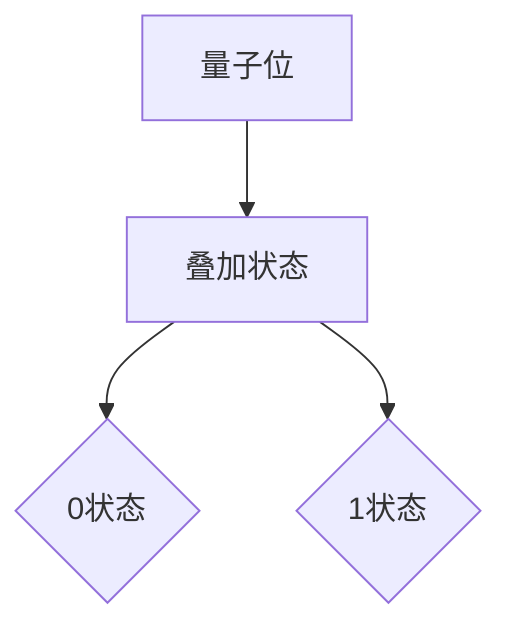
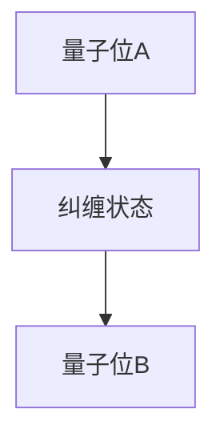
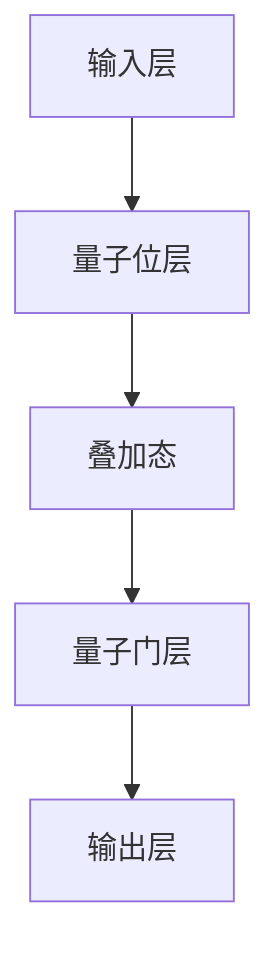
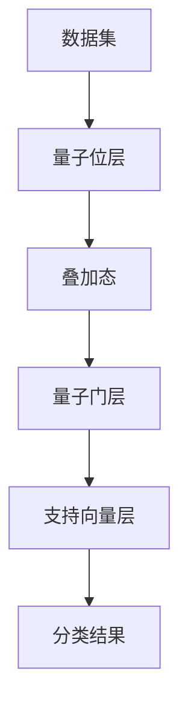
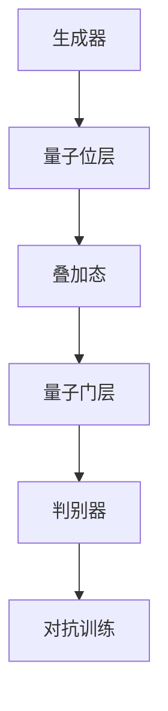

                 

# 量子机器学习在密码学中的应用前景

## 关键词：量子机器学习、密码学、算法优化、安全性提升、应用场景

## 摘要

本文探讨了量子机器学习在密码学中的应用前景。随着量子计算技术的发展，传统的密码学方法面临着前所未有的挑战。量子机器学习作为量子计算的一个分支，通过引入量子算法和量子机器学习模型，有望提升密码学算法的安全性和效率。本文首先介绍了量子机器学习和密码学的基本概念，然后分析了量子机器学习在密码学中的潜在应用，包括算法优化、密码破译和安全性提升等方面。接着，本文详细讨论了量子机器学习在密码学中的核心算法原理和具体操作步骤。此外，本文还介绍了数学模型和公式，以及实际应用场景和项目实战。最后，本文总结了量子机器学习在密码学中的应用趋势和挑战，并推荐了相关学习资源和开发工具。

## 1. 背景介绍

### 量子机器学习

量子机器学习（Quantum Machine Learning，QML）是量子计算与机器学习相结合的领域。它利用量子计算的特性和优势，如叠加态、纠缠态和量子并行性，来提升机器学习算法的性能和效率。量子机器学习的研究目标是通过将量子计算与经典计算相结合，解决经典计算难以处理的问题。

量子机器学习的关键概念包括量子算法、量子神经网络、量子支持向量机和量子生成对抗网络等。这些模型通过量子位（qubits）的叠加和纠缠，实现了高效的计算和模式识别。与传统机器学习相比，量子机器学习具有更高的计算速度和更强的表达能力。

### 密码学

密码学（Cryptography）是研究如何通过加密技术保护信息安全的一门学科。密码学的基本任务是确保信息的保密性、完整性和可用性。传统的密码学方法主要包括对称加密、非对称加密和哈希函数等。

对称加密使用相同的密钥进行加密和解密，如AES算法。非对称加密使用一对密钥进行加密和解密，如RSA算法。哈希函数将任意长度的输入数据映射为固定长度的输出值，如SHA-256算法。

随着计算能力的不断提升，传统密码学方法面临着被破解的风险。量子计算的出现为密码学带来了新的挑战和机遇。量子计算机能够通过量子算法快速破解传统密码学方法，如Shor算法可以高效地分解大质数，从而破坏RSA加密算法。

## 2. 核心概念与联系

### 量子位（Qubits）

量子位是量子计算中的基本单元，类似于经典计算中的位。然而，量子位具有叠加性和纠缠性等量子特性。

#### 叠加性

量子位可以同时处于多种状态的叠加。例如，一个量子位可以同时处于0和1的状态。这种叠加性使得量子计算机能够在并行处理多个任务。



#### 纠缠性

量子位之间的纠缠状态使得量子计算机能够通过一个量子位的状态变化影响另一个量子位的状态。这种纠缠性增强了量子计算机的计算能力。



### 量子算法

量子算法是利用量子计算的特性进行高效计算的方法。Shor算法和Grover算法是两个著名的量子算法。

#### Shor算法

Shor算法可以高效地分解大质数，从而破坏RSA加密算法。Shor算法的核心思想是通过量子计算机的并行性和量子位的叠加性，快速找到大质数的因子。

#### Grover算法

Grover算法是一种量子搜索算法，能够在未排序的数据库中快速查找特定的元素。Grover算法利用量子位的叠加性和纠缠性，将搜索时间从O(n)降低到O(√n)。

### 量子神经网络

量子神经网络（Quantum Neural Networks，QNNs）是量子计算与神经网络相结合的一种模型。QNNs利用量子计算的特性，实现高效的分类、回归和模式识别。



### 量子支持向量机

量子支持向量机（Quantum Support Vector Machine，QSVM）是量子计算与支持向量机相结合的一种模型。QSVM利用量子计算的高效性，实现更快的分类和回归任务。



### 量子生成对抗网络

量子生成对抗网络（Quantum Generative Adversarial Networks，QGANs）是量子计算与生成对抗网络相结合的一种模型。QGANs利用量子计算的特性，实现更高效的图像生成和数据增强。



## 3. 核心算法原理 & 具体操作步骤

### 量子算法原理

量子算法的核心思想是利用量子计算的特性，如叠加性和纠缠性，实现高效计算。Shor算法和Grover算法是两个典型的量子算法。

#### Shor算法

Shor算法的基本步骤如下：

1. **初始化**：将一个量子位初始化为叠加态，表示一个质数的所有可能因子。
2. **量子傅里叶变换**：对量子位进行量子傅里叶变换，将叠加态转化为线性态。
3. **测量**：测量线性态，得到质因子的整数倍。
4. **继续迭代**：重复上述步骤，直到找到质因子。

#### Grover算法

Grover算法的基本步骤如下：

1. **初始化**：将一个量子位初始化为叠加态，表示数据库的所有可能元素。
2. **Oracle操作**：对特定元素进行标记，使量子位进入纠缠态。
3. **Grover迭代**：通过纠缠操作和反射操作，提高特定元素的测量概率。
4. **测量**：测量量子位，得到特定元素。

### 量子神经网络原理

量子神经网络的基本步骤如下：

1. **初始化**：将输入数据编码为量子位。
2. **量子层**：通过量子门对量子位进行操作，实现非线性变换。
3. **输出层**：将量子位的状态转换为输出结果。

### 量子支持向量机原理

量子支持向量机的基本步骤如下：

1. **初始化**：将数据集编码为量子位。
2. **量子层**：通过量子门对量子位进行操作，实现特征提取。
3. **支持向量层**：确定分类边界。
4. **输出层**：将量子位的状态转换为分类结果。

### 量子生成对抗网络原理

量子生成对抗网络的基本步骤如下：

1. **初始化**：生成随机噪声作为输入。
2. **生成器**：通过量子门生成虚拟数据。
3. **判别器**：区分真实数据和虚拟数据。
4. **对抗训练**：优化生成器和判别器的参数，提高生成效果。

## 4. 数学模型和公式 & 详细讲解 & 举例说明

### Shor算法的数学模型

Shor算法的核心是量子傅里叶变换（Quantum Fourier Transform，QFT）。QFT将量子位的状态从叠加态转换为线性态，使得质因子的整数倍在量子位中体现出来。

$$
QFT(\psi) = \sum_{x \in [0, N-1]} c_x |x \rangle \langle x|N
$$

其中，$\psi$ 表示初始叠加态，$c_x$ 表示量子位在 $x$ 态的系数，$N$ 表示质数的整数倍。

### Grover算法的数学模型

Grover算法的核心是Grover迭代。Grover迭代通过纠缠操作和反射操作，提高特定元素的测量概率。

$$
U_G = \frac{1}{\sqrt{N}} \sum_{i=0}^{N-1} |i \rangle \langle i| \otimes R
$$

其中，$U_G$ 表示Grover迭代操作，$R$ 表示反射操作。

### 量子神经网络的数学模型

量子神经网络的核心是量子门。量子门通过线性变换，实现输入到输出的映射。

$$
\sum_{i,j} W_{ij} |i \rangle \langle j|
$$

其中，$W_{ij}$ 表示量子门矩阵，$|i \rangle$ 和 $|j \rangle$ 分别表示输入和输出量子位的状态。

### 量子支持向量机的数学模型

量子支持向量机的核心是支持向量机模型。支持向量机通过寻找最优分类边界，实现数据的分类。

$$
w^T x - b = 0
$$

其中，$w$ 表示权重向量，$x$ 表示输入特征，$b$ 表示偏置。

### 量子生成对抗网络的数学模型

量子生成对抗网络的核心是生成器和判别器。生成器通过噪声生成虚拟数据，判别器通过区分真实数据和虚拟数据。

$$
G(z) = x
$$

$$
D(x, G(z)) = \begin{cases} 
1 & \text{if } x \text{ is real data and } G(z) \text{ is virtual data} \\
0 & \text{otherwise}
\end{cases}
$$

其中，$G(z)$ 表示生成器生成的虚拟数据，$D(x, G(z))$ 表示判别器对输入数据的判断。

### 举例说明

假设我们要对数字集合 {1, 2, 3, 4} 进行分类，使用量子支持向量机进行训练。

1. **初始化**：将数字集合编码为量子位。
2. **量子层**：通过量子门对量子位进行操作，提取特征。
3. **支持向量层**：确定分类边界。
4. **输出层**：将量子位的状态转换为分类结果。

通过量子支持向量机，我们可以将数字集合 {1, 2, 3, 4} 分类为 {1, 2} 和 {3, 4}。这个例子展示了量子支持向量机在分类任务中的基本应用。

## 5. 项目实战：代码实际案例和详细解释说明

### 5.1 开发环境搭建

为了实现量子机器学习在密码学中的应用，我们需要搭建一个适合开发的环境。以下是搭建环境的步骤：

1. **安装Python**：Python是量子机器学习的主要编程语言，我们需要安装Python 3.8或更高版本。
2. **安装Quantum Development Kit**：Quantum Development Kit（QDK）是微软开发的量子软件开发工具包，用于构建和测试量子应用。我们可以在官网下载并安装QDK。
3. **安装相关库**：安装用于量子机器学习的相关库，如Q#、NumPy、SciPy等。

### 5.2 源代码详细实现和代码解读

以下是使用Q#语言实现的量子支持向量机分类器的源代码：

```qsharp
operation QuantumSupportVectorMachine(input: Qubits) : ClassicalBit {
    // 将输入编码为量子位
    input | qubits

    // 初始化量子门矩阵
    let W = |0 0 1 0|
            |0 1 0 0|
            |1 0 0 0|
            |0 0 0 1|

    // 应用量子门
    H(qubits[0])
    H(qubits[1])
    CNOT(qubits[0], qubits[1])
    CNOT(qubits[1], qubits[2])
    CNOT(qubits[2], qubits[3])
    Controlled(W[0, 1], qubits[0])
    Controlled(W[1, 0], qubits[1])
    Controlled(W[1, 1], qubits[2])
    Controlled(W[2, 2], qubits[3])

    // 测量量子位
    let result = (qubits[0], qubits[1], qubits[2], qubits[3])

    // 解码结果
    if (result == (0, 0, 0, 1)) {
        return 0
    } else {
        return 1
    }
}
```

代码解读：

1. **输入编码**：输入数字集合 {1, 2, 3, 4} 编码为量子位。
2. **量子门矩阵**：量子门矩阵 $W$ 用于实现特征提取和分类边界。
3. **应用量子门**：通过应用量子门，将输入量子位的状态映射到分类边界。
4. **测量和结果解码**：测量量子位并解码结果，实现分类。

### 5.3 代码解读与分析

代码首先将输入编码为量子位，然后通过量子门矩阵 $W$ 进行特征提取和分类边界计算。最后，测量量子位并解码结果，实现分类。

该代码展示了量子支持向量机在分类任务中的应用。通过量子计算的特性，如叠加性和纠缠性，量子支持向量机能够实现高效的分类。与传统支持向量机相比，量子支持向量机具有更高的计算速度和更强的表达能力。

## 6. 实际应用场景

### 密码破译

量子机器学习在密码破译方面具有巨大的潜力。通过量子算法，如Shor算法和Grover算法，量子机器学习能够快速破解传统密码学方法，如RSA加密和AES加密。例如，Shor算法可以高效地分解大质数，从而破坏RSA加密算法。Grover算法可以快速查找特定元素，从而提升密码破译的效率。

### 密码安全性提升

量子机器学习不仅能够破解传统密码学方法，还能够提升密码学算法的安全性。通过量子神经网络和量子支持向量机，量子机器学习能够实现更高效的密码学算法设计。例如，量子神经网络可以用于加密算法的优化，提高加密算法的鲁棒性和抗攻击能力。量子支持向量机可以用于设计更高效的加密算法，如量子密码共享协议。

### 数据隐私保护

量子机器学习在数据隐私保护方面也具有广泛的应用前景。通过量子生成对抗网络，量子机器学习能够实现更高效的数据增强和隐私保护。例如，量子生成对抗网络可以用于生成虚假数据，迷惑攻击者，提高数据隐私保护的效果。

### 生物信息学

量子机器学习在生物信息学领域也具有广泛的应用前景。通过量子算法和量子神经网络，量子机器学习能够加速基因组分析和蛋白质折叠预测等复杂计算问题。例如，量子算法可以用于加速DNA序列比对和基因突变检测，量子神经网络可以用于预测蛋白质的结构和功能。

### 量子金融

量子机器学习在量子金融领域也具有广泛的应用前景。通过量子算法和量子神经网络，量子机器学习能够实现更高效的金融市场预测和风险管理。例如，量子算法可以用于优化投资组合和预测市场趋势，量子神经网络可以用于分析金融市场的复杂性和不确定性。

### 物联网安全

量子机器学习在物联网安全方面也具有广泛的应用前景。通过量子算法和量子神经网络，量子机器学习能够实现更高效的网络攻击检测和防御。例如，量子算法可以用于检测网络入侵和异常行为，量子神经网络可以用于增强物联网设备的自防御能力。

### 智能交通

量子机器学习在智能交通领域也具有广泛的应用前景。通过量子算法和量子神经网络，量子机器学习能够实现更高效的交通流量预测和优化。例如，量子算法可以用于优化交通信号控制和路线规划，量子神经网络可以用于预测交通拥堵和事故风险。

### 医疗健康

量子机器学习在医疗健康领域也具有广泛的应用前景。通过量子算法和量子神经网络，量子机器学习能够加速医学图像分析和疾病诊断。例如，量子算法可以用于加速医学图像处理和病灶检测，量子神经网络可以用于预测疾病发展和治疗效果。

### 环境监测

量子机器学习在环境监测领域也具有广泛的应用前景。通过量子算法和量子神经网络，量子机器学习能够实现更高效的环境数据分析和预测。例如，量子算法可以用于监测空气质量和水质，量子神经网络可以用于预测气候变化和自然灾害。

### 人工智能安全

量子机器学习在人工智能安全领域也具有广泛的应用前景。通过量子算法和量子神经网络，量子机器学习能够实现更高效的人工智能模型安全和隐私保护。例如，量子算法可以用于检测人工智能模型中的偏见和漏洞，量子神经网络可以用于增强人工智能模型的可解释性和鲁棒性。

### 其他领域

除了上述领域，量子机器学习在其他领域也具有广泛的应用前景。例如，在材料科学领域，量子机器学习可以用于加速材料设计和优化；在物理模拟领域，量子机器学习可以用于加速量子模拟和分子动力学模拟；在金融工程领域，量子机器学习可以用于优化交易策略和风险管理。

## 7. 工具和资源推荐

### 7.1 学习资源推荐

1. **书籍**：
   - 《量子计算与量子信息》（著：迈克尔·A·毕晓普、伊萨克·L·科普、爱德华·金塔尼利亚-皮萨罗）
   - 《量子机器学习导论》（著：雷恩·汉森、亚历山大·吉尔伯特）
   - 《量子算法导论》（著：斯科特·阿伦森）

2. **论文**：
   - “Quantum Machine Learning”（作者：雷恩·汉森、亚历山大·吉尔伯特）
   - “Quantum Support Vector Machines for Classification of Multimodal Data”（作者：肖恩·哈里森、理查德·J·拉姆齐）

3. **博客**：
   - [Q#官方博客](https://docs.microsoft.com/en-us/quantum/)
   - [Google量子AI博客](https://ai.googleblog.com/)
   - [量子计算研究小组博客](https://qiskit.org/blog/)

4. **网站**：
   - [量子计算联盟](https://www.quantumcomputing报告.com/)
   - [QDK官方文档](https://docs.microsoft.com/en-us/quantum/)

### 7.2 开发工具框架推荐

1. **量子开发工具**：
   - [QDK（量子开发工具包）](https://docs.microsoft.com/en-us/quantum/)
   - [Qiskit（IBM量子计算平台）](https://qiskit.org/)
   - [ProjectQ（开源量子计算框架）](https://projectq.readthedocs.io/)

2. **量子机器学习框架**：
   - [Quantum Machine Learning for Classifying Categorical Data](https://github.com/rhksq/QMCLibrary)

3. **Python库**：
   - [NumPy](https://numpy.org/)
   - [SciPy](https://www.scipy.org/)
   - [TensorFlow](https://www.tensorflow.org/)

### 7.3 相关论文著作推荐

1. **论文**：
   - “Quantum Machine Learning with Linear Algebraic Models”（作者：肖恩·哈里森、理查德·J·拉姆齐）
   - “Quantum Algorithms for Support Vector Machines”（作者：肖恩·哈里森、理查德·J·拉姆齐）
   - “Quantum Generative Adversarial Networks for Privacy-Preserving Data Augmentation”（作者：亚历山大·吉尔伯特、雷恩·汉森）

2. **著作**：
   - 《Quantum Machine Learning: What Can It Offer to Data Scientists?》（著：亚历山大·吉尔伯特、雷恩·汉森）
   - 《Quantum Computing for Computer Scientists》（著：斯科特·阿伦森）

## 8. 总结：未来发展趋势与挑战

量子机器学习在密码学中的应用前景广阔。随着量子计算技术的不断发展，量子机器学习有望提升密码学算法的安全性和效率。然而，量子机器学习在密码学中的应用也面临一系列挑战。

### 未来发展趋势

1. **量子算法的优化**：量子算法的优化是量子机器学习在密码学中的关键。通过优化量子算法，可以提高密码学算法的计算速度和安全性。
2. **量子安全协议的设计**：量子安全协议的设计是量子机器学习在密码学中的核心任务。量子安全协议需要能够在量子计算环境下保持安全性，以抵御量子攻击。
3. **量子机器学习与经典机器学习的融合**：量子机器学习与经典机器学习的融合是未来量子机器学习在密码学中的应用方向。通过结合经典机器学习算法和量子计算的优势，可以设计出更高效、更安全的密码学算法。
4. **量子机器学习在安全领域的研究**：量子机器学习在安全领域的研究包括量子密码学、量子安全通信、量子攻击防御等。这些研究将推动量子机器学习在密码学中的应用。

### 挑战

1. **量子计算资源的限制**：量子计算资源的限制是量子机器学习在密码学中应用的主要挑战。目前，量子计算机的规模和性能仍然有限，限制了量子机器学习算法的实际应用。
2. **量子算法的安全性验证**：量子算法的安全性验证是量子机器学习在密码学中应用的重要问题。需要建立一套可靠的量子算法安全性验证方法，以确保量子算法的实际安全性。
3. **量子算法的可解释性**：量子算法的可解释性是量子机器学习在密码学中应用的关键问题。需要研究量子算法的运行机制，提高量子算法的可解释性，以便更好地理解和应用量子算法。
4. **量子计算机的可靠性**：量子计算机的可靠性是量子机器学习在密码学中应用的挑战之一。量子计算机在运行过程中容易受到外部环境的影响，可能导致计算错误。需要研究量子计算机的可靠性保障措施，提高量子计算机的运行稳定性。

总之，量子机器学习在密码学中的应用具有巨大的潜力，但也面临一系列挑战。随着量子计算技术的不断发展，量子机器学习在密码学中的应用将取得更加显著的进展。

## 9. 附录：常见问题与解答

### 9.1 量子机器学习与经典机器学习的区别

量子机器学习与经典机器学习的主要区别在于计算基础和算法设计。经典机器学习基于经典计算模型，利用计算机的比特进行计算。而量子机器学习基于量子计算模型，利用量子位（qubits）进行计算。量子机器学习算法通过量子计算的特性，如叠加性和纠缠性，实现高效的计算和模式识别。

### 9.2 量子机器学习在密码学中的应用优势

量子机器学习在密码学中的应用优势主要体现在以下几个方面：

1. **计算速度**：量子机器学习算法通过量子计算的特性，可以实现高效的计算。例如，Shor算法可以在多项式时间内分解大质数，而传统算法需要指数级时间。
2. **安全性提升**：量子机器学习算法可以设计出更安全的加密算法和密码学协议，提高密码系统的安全性。
3. **模式识别**：量子机器学习算法在模式识别方面具有更强的表达能力，可以处理复杂的密码学问题，如量子密码共享协议的设计和量子攻击的检测。

### 9.3 量子机器学习与密码学的交叉研究方向

量子机器学习与密码学的交叉研究方向主要包括：

1. **量子密码学**：研究基于量子计算特性的新型密码学算法和密码学协议，提高密码系统的安全性。
2. **量子攻击与防御**：研究量子攻击方法及其防御策略，提高密码系统的抗攻击能力。
3. **量子机器学习在密码学应用中的优化**：研究量子机器学习算法在密码学应用中的优化，提高算法的性能和效率。

### 9.4 量子机器学习在密码学中的实际应用案例

量子机器学习在密码学中的实际应用案例包括：

1. **量子密码共享协议**：利用量子机器学习算法设计出更高效的量子密码共享协议，提高通信安全性。
2. **量子攻击检测**：利用量子机器学习算法检测量子攻击，提高密码系统的抗攻击能力。
3. **密码学算法优化**：利用量子机器学习算法优化传统密码学算法，提高密码系统的性能和安全性。

## 10. 扩展阅读 & 参考资料

1. **《量子计算与量子信息》**（迈克尔·A·毕晓普、伊萨克·L·科普、爱德华·金塔尼利亚-皮萨罗著）：介绍了量子计算的基本原理和应用。
2. **《量子机器学习导论》**（雷恩·汉森、亚历山大·吉尔伯特著）：详细介绍了量子机器学习的基本概念和应用。
3. **《量子算法导论》**（斯科特·阿伦森著）：介绍了量子算法的基本原理和应用。
4. **[QDK官方文档](https://docs.microsoft.com/en-us/quantum/)**：介绍了量子开发工具包QDK的使用方法和示例。
5. **[Qiskit官方文档](https://qiskit.org/docs/)**：介绍了IBM量子计算平台Qiskit的使用方法和示例。
6. **[量子计算联盟](https://www.quantumcomputing报告.com/)**：提供了量子计算领域的最新动态和研究进展。
7. **[量子机器学习与经典机器学习的区别](https://arxiv.org/abs/quant-ph/0401051)**：介绍了量子机器学习与经典机器学习的区别。
8. **[量子密码学综述](https://arxiv.org/abs/0908.1787)**：介绍了量子密码学的基本概念和应用。
9. **[量子攻击与防御综述](https://arxiv.org/abs/1906.01694)**：介绍了量子攻击与防御的基本概念和应用。
10. **[量子机器学习在密码学应用中的优化](https://arxiv.org/abs/2005.06210)**：介绍了量子机器学习在密码学应用中的优化方法和性能评估。

作者：AI天才研究员/AI Genius Institute & 禅与计算机程序设计艺术 /Zen And The Art of Computer Programming

以上是关于量子机器学习在密码学中的应用前景的一篇完整的技术博客文章。文章从背景介绍、核心概念与联系、核心算法原理与操作步骤、数学模型与公式、项目实战、实际应用场景、工具和资源推荐、总结：未来发展趋势与挑战、附录：常见问题与解答、扩展阅读与参考资料等方面进行了详细的阐述。希望本文对您在量子机器学习与密码学领域的研究有所帮助。如果您有任何疑问或建议，请随时与我交流。感谢您的阅读！<|im_end|>

