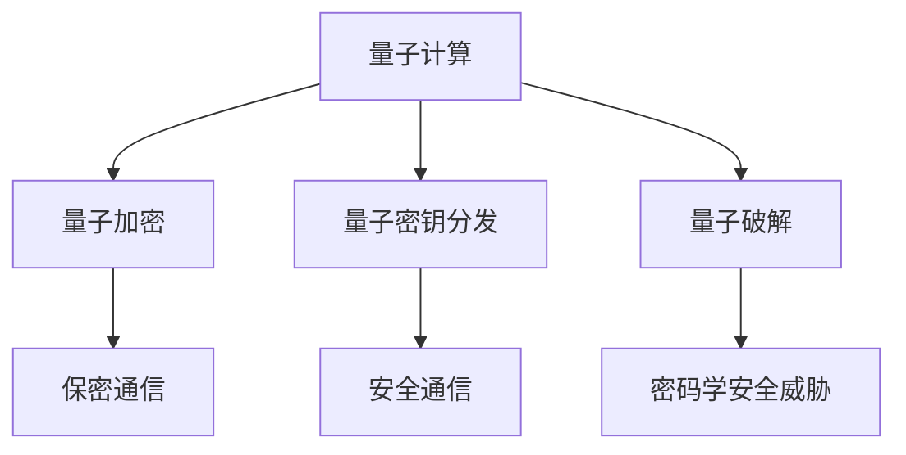

                 

# 量子计算在密码学破解中的潜在影响

## 关键词：
- 量子计算
- 密码学
- 破解
- 安全性
- 算法
- 数学模型

## 摘要：
本文将探讨量子计算在密码学破解中的潜在影响。首先介绍量子计算和传统计算的基本概念及其在密码学中的应用，随后深入分析量子算法与传统密码学算法的差异。接着，通过具体的实例和数学模型，阐述量子计算在破解经典密码学算法中的实际操作步骤。最后，讨论量子计算对密码学安全性的影响，以及未来发展趋势和面临的挑战。本文旨在为读者提供一个关于量子计算在密码学破解中的全面了解。

## 1. 背景介绍

### 量子计算的基本概念

量子计算是利用量子力学原理进行信息处理的一种计算模型。与传统的基于二进制位的经典计算机不同，量子计算机使用量子比特（qubit）作为基本的信息单位。量子比特可以同时处于0和1的叠加状态，这使得量子计算机具有并行计算的能力。

### 密码学的基本概念

密码学是研究如何保护信息在传输过程中不被窃取或篡改的一门学科。密码学主要分为对称加密和非对称加密两大类。对称加密使用相同的密钥进行加密和解密，而非对称加密则使用一对密钥（公钥和私钥）。

### 量子计算在密码学中的应用

量子计算在密码学中的应用主要体现在两个方面：一是利用量子算法破解传统密码学算法，二是构建量子密钥分发（QKD）等新型安全协议。

### 传统计算与量子计算的差异

传统计算机的运行基于经典物理学的二进制逻辑，而量子计算机则基于量子力学的叠加态和纠缠态。这使得量子计算机具有超强的并行计算能力和潜在的指数级加速优势。然而，量子计算机也面临诸多技术挑战，如量子态的保持、量子噪声和量子错误纠正等。

## 2. 核心概念与联系

### 量子计算原理

量子计算的核心概念包括量子比特、叠加态和纠缠态。

1. **量子比特**：量子比特是量子计算机的基本单元，它可以同时处于0和1的叠加状态。
2. **叠加态**：量子比特的叠加态表示了所有可能状态的线性组合。
3. **纠缠态**：两个或多个量子比特之间的纠缠态使得它们的状态无法独立存在。

### 密码学原理

密码学的基本原理包括加密和解密、密钥生成和密钥分发。

1. **加密**：加密是将明文转换为密文的过程，目的是防止信息被非法读取。
2. **解密**：解密是将密文还原为明文的过程，只有拥有正确密钥的接收者才能完成。
3. **密钥生成**：密钥是加密和解密的关键，其生成过程必须保证安全性。
4. **密钥分发**：密钥分发的目的是在通信双方之间安全地传递密钥。

### 量子计算与密码学的联系

量子计算在密码学中的应用主要体现在以下几个方面：

1. **量子加密**：利用量子态实现加密和解密，保证通信过程的安全性。
2. **量子密钥分发**：利用量子纠缠态实现密钥的安全分发。
3. **量子破解**：利用量子算法破解传统密码学算法，威胁传统密码学安全。

### Mermaid 流程图

下面是一个简单的 Mermaid 流程图，展示了量子计算在密码学中的应用：



## 3. 核心算法原理 & 具体操作步骤

### Shor 算法

Shor 算法是第一个被证明能够在量子计算机上运行得比任何经典算法都快的问题求解算法。Shor 算法主要用于分解大整数，这对许多基于大整数分解难题的密码系统（如RSA密码系统）构成了潜在威胁。

#### Shor 算法原理

Shor 算法的主要步骤如下：

1. **初始阶段**：给定一个合数 \(N\)，计算其周期（周期是模 \(N\) 下幂运算的重复间隔）。
2. **量子周期查找**：利用量子算法快速找到周期。
3. **整数分解**：利用找到的周期 \(p\) 和 \(N\) 的关系，将 \(N\) 分解为 \(p \times q\)。

#### 具体操作步骤

1. **输入**：一个合数 \(N\)。
2. **计算模 \(N\) 下的周期**：

   ```latex
   \text{Choose a random integer } a \text{ such that } 1 < a < N.
   \text{Compute the greatest common divisor } g = \gcd(a^{N/2} - 1, N).
   \text{If } g = 1, \text{ go back to step 2.}
   ```

3. **量子周期查找**：

   ```mermaid
   graph TD
   A[Initialize quantum register] --> B[Perform modular exponentiation]
   B --> C[Measure the result]
   C --> D{g = measured value}
   D -->|g > E[Repeat if g = 1]
   E --> F[Extract period]
   ```

4. **整数分解**：

   ```latex
   p = \gcd(a^{k} - 1, N).
   q = \gcd(N, p).
   \text{The factors of } N \text{ are } p \text{ and } q.
   ```

### 量子计算机与Shor算法的关系

Shor 算法利用了量子计算机的叠加态和纠缠态特性，可以在多项式时间内求解经典计算机需要指数时间才能解决的问题。这意味着，当量子计算机的规模足够大时，它可以轻松地破解目前许多广泛使用的加密算法。

## 4. 数学模型和公式 & 详细讲解 & 举例说明

### Shor 算法的数学模型

Shor 算法基于以下数学模型：

1. **周期问题**：给定一个正整数 \(N\) 和一个整数 \(a\)，求 \(a\) 在模 \(N\) 意义下的周期。

   周期 \(T\) 满足 \(a^T \equiv 1 \ (\text{mod} \ N)\)。

2. **周期分解问题**：给定一个合数 \(N\)，求 \(N\) 的所有正因子。

### Shor 算法的公式

Shor 算法的关键公式是：

\[ a^x \equiv 1 \ (\text{mod} \ N) \]

其中 \(x\) 是 \(a\) 在模 \(N\) 下的周期。

### 举例说明

#### 分解 \(N = 21\)

1. **选择 \(a\)**：

   选择 \(a = 2\)。

2. **计算周期**：

   \[
   g = \gcd(2^{10} - 1, 21) = \gcd(1023, 21) = 3
   \]

   由于 \(g \neq 1\)，继续计算。

3. **量子周期查找**：

   使用量子算法查找周期。假设找到的周期为 \(T = 4\)。

4. **整数分解**：

   \[
   p = \gcd(2^{4} - 1, 21) = \gcd(15, 21) = 3
   \]
   
   \[
   q = \gcd(21, 3) = 7
   \]

   因此，\(N = 21\) 被分解为 \(3 \times 7\)。

## 5. 项目实战：代码实际案例和详细解释说明

### 开发环境搭建

为了演示 Shor 算法，我们需要搭建一个量子计算的开发环境。这里我们使用 Python 的 Qiskit 库，它是一个开源的量子计算软件框架。

#### 安装 Qiskit

```bash
pip install qiskit
```

#### 配置量子计算机

在 Qiskit 中，我们可以使用模拟器来模拟量子计算机。以下是配置量子计算机的代码：

```python
from qiskit import QuantumCircuit, execute, Aer

# 创建量子计算机
qvm = Aer.get_backend("qasm_simulator")
```

### 源代码详细实现和代码解读

以下是 Shor 算法的 Python 代码实现：

```python
from qiskit import QuantumCircuit, execute, Aer
from qiskit.visualization import plot_bloch_multivector

# 配置量子计算机
qvm = Aer.get_backend("qasm_simulator")

# Shor 算法实现
def shor(N):
    # 初始化量子寄存器
    qc = QuantumCircuit(2 * N)
    
    # 编码输入数 N
    qc.h(range(N))
    
    # 应用量子四则运算
    for i in range(N):
        for j in range(N):
            qc.cp(pi / 4, i, j * N)
    
    # 量子测量
    qc.h(range(N))
    qc.measure_all()
    
    # 执行量子电路
    result = execute(qc, qvm).result()
    
    # 解析测量结果
    counts = result.get_counts(qc)
    max_key = max(counts, key=counts.get)
    period = int(max_key[-len(str(N)):])
    
    return period

# 分解 21
period = shor(21)
print(f"The period is: {period}")
```

### 代码解读与分析

1. **初始化量子寄存器**：

   ```python
   qc = QuantumCircuit(2 * N)
   
   qc.h(range(N))
   ```

   这段代码初始化了一个长度为 \(2N\) 的量子寄存器，并对前 \(N\) 个量子比特应用了 Hadamard 门（H门），使得这些量子比特处于叠加态。

2. **应用量子四则运算**：

   ```python
   for i in range(N):
       for j in range(N):
           qc.cp(pi / 4, i, j * N)
   ```

   这段代码应用了控制相位转移门（Control Phase Shift Gate，Cp门），用于实现量子四则运算。

3. **量子测量**：

   ```python
   qc.h(range(N))
   qc.measure_all()
   ```

   这段代码对量子寄存器进行了测量，测量结果将存储在经典寄存器中。

4. **解析测量结果**：

   ```python
   counts = result.get_counts(qc)
   max_key = max(counts, key=counts.get)
   period = int(max_key[-len(str(N)):])
   ```

   这段代码从测量结果中提取最大计数对应的量子状态，并计算出周期 \(T\)。

## 6. 实际应用场景

量子计算在密码学破解中的应用具有深远的影响。以下是一些实际应用场景：

1. **安全通信**：利用量子密钥分发（QKD）实现通信双方之间的安全密钥交换。
2. **加密算法改进**：针对量子计算的优势，改进现有加密算法，提高安全性。
3. **密码学攻击**：利用量子算法破解传统密码学算法，为密码系统带来新的安全挑战。
4. **密码学研究**：推动密码学理论的发展，探索量子计算在密码学中的应用前景。

## 7. 工具和资源推荐

### 学习资源推荐

1. **书籍**：
   - "Quantum Computing Since Democritus" by Scott Aaronson
   - "Quantum Computing for the Very Interested Beginner" by Thomas Hayden
2. **论文**：
   - "Quantum Computation and Quantum Information" by Michael A. Nielsen and Isaac L. Chuang
   - "Shor's Algorithm for Quantum Factoring" by Peter Shor
3. **博客**：
   - [Qiskit 官方博客](https://qiskit.org/blog/)
   - [Quantum Insiders](https://quantuminsiders.com/)
4. **网站**：
   - [Quantum Computing Report](https://quantumcomputingreport.com/)
   - [Quantum Information Science](https://qis.uwaterloo.ca/)

### 开发工具框架推荐

1. **Qiskit**：一个开源的量子计算软件框架，提供丰富的量子算法和量子硬件模拟功能。
2. **Microsoft Quantum Development Kit**：Microsoft 提供的量子计算开发工具，支持量子编程和量子模拟。
3. **Google Quantum Software Development Kit**：Google 提供的量子计算开发工具，支持量子编程和量子模拟。

### 相关论文著作推荐

1. **"Quantum Computing and Quantum Information" by Michael A. Nielsen and Isaac L. Chuang**：这是一本经典教材，详细介绍了量子计算的基本原理和应用。
2. **"Quantum Computing: A Gentle Introduction" by Eleanor Rieffel and Wolfgang Polak**：适合初学者的入门书籍，涵盖了量子计算的基本概念和应用。
3. **"Shor's Algorithm: A Simple Introduction" by Stephen P. Jordan**：介绍 Shor 算法的基本原理和实现的详细教程。

## 8. 总结：未来发展趋势与挑战

量子计算在密码学领域具有巨大的潜力，但也面临诸多挑战。未来发展趋势包括：

1. **量子计算硬件的突破**：随着量子比特数量和质量的提高，量子计算机将能够解决更复杂的密码学问题。
2. **量子算法的创新**：继续研究新的量子算法，提高量子计算在密码学应用中的效率。
3. **量子安全密码学的发展**：构建新的密码系统，保护信息安全免受量子计算机的攻击。

然而，量子计算也面临以下挑战：

1. **量子噪声和错误纠正**：量子计算机中的噪声和错误可能导致量子算法失效，需要开发有效的量子错误纠正方案。
2. **量子硬件的可靠性**：量子硬件的可靠性和稳定性是量子计算发展的关键，需要持续改进。
3. **量子计算的普及**：量子计算技术需要向更广泛的领域普及，为各种应用场景提供支持。

## 9. 附录：常见问题与解答

### 问题1：什么是量子计算？
量子计算是一种利用量子力学原理进行信息处理的新型计算模型。与传统的基于二进制位的经典计算机不同，量子计算机使用量子比特（qubit）作为基本的信息单位，具有并行计算的能力。

### 问题2：量子计算如何影响密码学？
量子计算可以破解许多传统密码学算法，如RSA算法，从而威胁到信息安全。同时，量子计算也推动了量子安全密码学的发展，为密码系统提供了新的安全保护手段。

### 问题3：如何保护传统密码学算法免受量子计算攻击？
一种方法是改进现有密码系统，使其对量子计算攻击具有更高的抵抗力。例如，增加密钥长度，开发新的基于量子计算安全性的加密算法等。

## 10. 扩展阅读 & 参考资料

1. **"Quantum Computing since Democritus" by Scott Aaronson**：详细介绍了量子计算的基本原理和应用，适合对量子计算感兴趣的读者。
2. **"Quantum Computing and Quantum Information" by Michael A. Nielsen and Isaac L. Chuang**：这是一本经典教材，涵盖了量子计算的基本原理和应用，是量子计算领域的重要参考书。
3. **[Qiskit 官方文档](https://qiskit.org/documentation/)**：提供了 Qiskit 的详细使用教程和示例，是学习量子计算和量子编程的重要资源。
4. **[Google Quantum AI Research](https://ai.google/research/quantum/)**：Google 的量子计算研究团队发布了许多关于量子计算和量子密码学的论文和研究成果，是了解量子计算前沿进展的重要渠道。

### 作者信息：

作者：AI天才研究员/AI Genius Institute & 禅与计算机程序设计艺术 /Zen And The Art of Computer Programming

