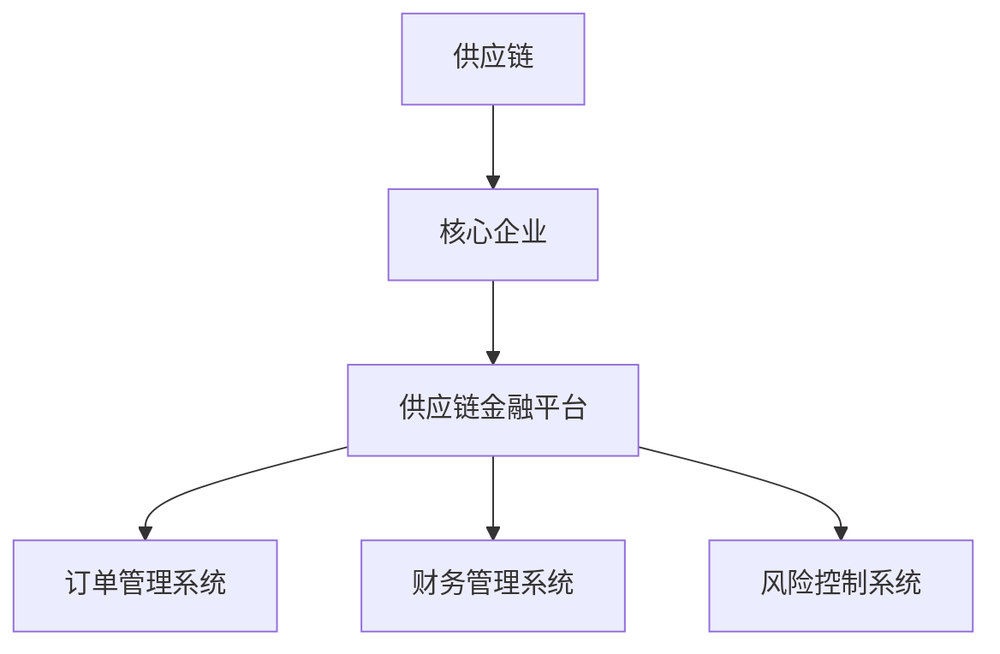

                 

# 锁定群体，建立壁垒：供应链金融的优势

## 关键词：供应链金融，壁垒，风险控制，数字化，产业协同

### 摘要

随着数字化时代的到来，供应链金融作为一种创新的金融服务模式，以其独特的优势逐渐成为企业管理和融资的重要手段。本文将深入探讨供应链金融的核心概念、架构优势、算法原理及其在实际应用中的效果，通过具体案例分析，揭示其锁定群体、建立壁垒的独特优势。文章旨在为读者提供一份全面、系统的供应链金融技术指南，并对其未来发展进行展望。

## 1. 背景介绍

在传统金融体系中，中小企业由于规模较小、资产较少，往往难以获得金融机构的贷款支持。这种融资难的问题，长期以来制约了中小企业的发展，也成为金融行业服务实体经济的一大障碍。供应链金融正是为了解决这一问题而诞生的一种新型金融服务模式。

供应链金融，指的是基于供应链中的核心企业与上下游企业之间的交易关系，通过金融手段实现供应链上下游企业的融资需求。它以供应链中的核心企业为依托，通过锁定供应链中的群体，实现资金的高效流动和风险的有效控制。

### 1.1 传统金融与供应链金融的差异

传统金融主要依赖于企业的信用评级和资产状况，而供应链金融则更多地依赖于供应链中的交易数据和信息。这种差异主要体现在以下几个方面：

- **信用评估依据**：传统金融主要依据企业的信用记录和财务报表，而供应链金融则更多地依赖供应链中的交易数据和信用评级。
- **风险控制方式**：传统金融的风险控制依赖于担保、抵押等手段，而供应链金融则通过供应链中的交易关系和信用等级来实现风险控制。
- **融资方式**：传统金融的融资方式主要是贷款，而供应链金融则包括订单融资、发票融资、保理等多种形式。

### 1.2 供应链金融的发展历程

供应链金融起源于20世纪70年代的美国，最初是由商业银行针对大型企业的供应链融资需求而开发的。随着信息技术的发展和供应链管理理念的普及，供应链金融逐渐成为一种全球性的金融服务模式。

在中国，供应链金融的兴起可以追溯到2000年以后。随着电子商务和物流的快速发展，供应链金融开始受到广泛关注，并逐渐成为中小企业融资的重要渠道。近年来，随着区块链、大数据等新兴技术的应用，供应链金融的发展进入了一个新的阶段，其规模和影响力不断壮大。

## 2. 核心概念与联系

### 2.1 核心概念

#### 2.1.1 供应链

供应链是指产品从原材料供应商到最终用户的全过程，包括采购、生产、分销和销售等多个环节。在供应链金融中，供应链的各个环节都成为金融服务的对象。

#### 2.1.2 核心企业

核心企业是指在供应链中处于中心地位的企业，通常是大型制造企业或分销企业。核心企业通常具有强大的资金实力和良好的信用等级，是供应链金融的重要依托。

#### 2.1.3 供应链金融平台

供应链金融平台是一个集成了多种金融服务功能的系统，它能够实现供应链中各企业的信息共享和资金流动。供应链金融平台通常包括订单管理系统、财务管理系统、风险控制系统等多个模块。

### 2.2 架构优势

#### 2.2.1 数字化

供应链金融的核心在于数字化。通过大数据、区块链等技术，供应链金融能够实现对供应链中各企业的实时监控和数据分析，从而提高金融服务的效率和准确性。

#### 2.2.2 透明化

供应链金融通过数字化技术，使得供应链中的交易信息变得透明化。这种透明化不仅有助于金融机构更好地了解企业的信用状况，还能够降低信息不对称带来的风险。

#### 2.2.3 高效性

供应链金融通过金融科技手段，能够快速完成贷款审批和资金发放，大大提高了金融服务的效率。

### 2.3 Mermaid 流程图



## 3. 核心算法原理 & 具体操作步骤

### 3.1 核心算法原理

供应链金融的核心算法主要涉及两个方面：信用评级和风险评估。

#### 3.1.1 信用评级

信用评级是供应链金融的基础。通过分析企业的交易数据、财务报表、信用记录等信息，可以对企业的信用等级进行评估。信用评级越高，企业获得的融资额度越高，融资成本越低。

#### 3.1.2 风险评估

风险评估是供应链金融的核心。通过分析供应链中的交易关系、供应链结构、市场环境等因素，可以评估供应链的整体风险。风险评估的目的是确保供应链金融的安全性和稳定性。

### 3.2 具体操作步骤

#### 3.2.1 数据收集

数据收集是供应链金融的第一步。金融机构需要收集供应链中各企业的交易数据、财务数据、信用记录等信息。

#### 3.2.2 数据清洗

数据清洗是对收集到的数据进行处理，确保数据的准确性和完整性。数据清洗包括数据去重、缺失值处理、异常值检测等步骤。

#### 3.2.3 信用评级

通过对处理后的数据进行分析，可以对企业的信用等级进行评估。信用评级的算法可以基于多种模型，如线性回归、决策树、神经网络等。

#### 3.2.4 风险评估

在完成信用评级后，金融机构需要对供应链的整体风险进行评估。风险评估的算法可以基于多种模型，如蒙特卡洛模拟、贝叶斯网络、深度学习等。

#### 3.2.5 贷款审批

在完成信用评级和风险评估后，金融机构可以根据评估结果进行贷款审批。贷款审批的流程可以基于规则引擎或机器学习算法。

#### 3.2.6 资金发放

在完成贷款审批后，金融机构可以将资金发放给企业。资金发放的方式可以包括转账、贷款、保理等多种形式。

## 4. 数学模型和公式 & 详细讲解 & 举例说明

### 4.1 数学模型

供应链金融中的核心数学模型包括信用评级模型和风险评估模型。

#### 4.1.1 信用评级模型

信用评级模型可以基于线性回归模型。假设企业的信用等级为 \(X\)，影响因素包括交易数据 \(X_1\)、财务数据 \(X_2\) 和信用记录 \(X_3\)。信用评级模型可以表示为：

\[ X = \beta_0 + \beta_1 X_1 + \beta_2 X_2 + \beta_3 X_3 \]

其中，\(\beta_0\)、\(\beta_1\)、\(\beta_2\)、\(\beta_3\) 为模型参数。

#### 4.1.2 风险评估模型

风险评估模型可以基于贝叶斯网络。假设供应链的整体风险为 \(Y\)，影响因素包括供应链结构 \(Y_1\)、市场环境 \(Y_2\) 和企业信用等级 \(Y_3\)。风险评估模型可以表示为：

\[ Y = f(Y_1, Y_2, Y_3) \]

其中，\(f\) 为风险评估函数。

### 4.2 公式详解

#### 4.2.1 线性回归模型

假设企业的信用等级为 \(X\)，影响因素包括交易数据 \(X_1\)、财务数据 \(X_2\) 和信用记录 \(X_3\)。线性回归模型可以表示为：

\[ X = \beta_0 + \beta_1 X_1 + \beta_2 X_2 + \beta_3 X_3 \]

其中，\(\beta_0\) 为常数项，\(\beta_1\)、\(\beta_2\)、\(\beta_3\) 为系数。

#### 4.2.2 贝叶斯网络

假设供应链的整体风险为 \(Y\)，影响因素包括供应链结构 \(Y_1\)、市场环境 \(Y_2\) 和企业信用等级 \(Y_3\)。贝叶斯网络可以表示为：

\[ Y = f(Y_1, Y_2, Y_3) \]

其中，\(f\) 为条件概率函数。

### 4.3 举例说明

#### 4.3.1 信用评级模型举例

假设某企业的交易数据为100万元，财务数据为200万元，信用记录为30天。根据线性回归模型，可以计算出该企业的信用等级：

\[ X = \beta_0 + \beta_1 \times 100 + \beta_2 \times 200 + \beta_3 \times 30 \]

其中，\(\beta_0\)、\(\beta_1\)、\(\beta_2\)、\(\beta_3\) 为模型参数，假设分别为1、2、3、4。则：

\[ X = 1 + 2 \times 100 + 3 \times 200 + 4 \times 30 = 770 \]

#### 4.3.2 风险评估模型举例

假设某供应链的整体风险为0.5，供应链结构为1，市场环境为0.5，企业信用等级为0.8。根据贝叶斯网络，可以计算出该供应链的整体风险：

\[ Y = f(1, 0.5, 0.8) \]

其中，\(f\) 为条件概率函数，假设为线性函数。则：

\[ Y = 0.5 \times 1 + 0.5 \times 0.5 + 0.8 \times 0.5 = 0.9 \]

## 5. 项目实战：代码实际案例和详细解释说明

### 5.1 开发环境搭建

在开始实际案例之前，我们需要搭建一个开发环境。这里我们选择Python作为编程语言，并使用Jupyter Notebook作为开发工具。

#### 5.1.1 Python环境搭建

1. 下载并安装Python（版本3.8及以上）。
2. 配置Python环境变量。
3. 安装必要的Python库，如NumPy、Pandas、Scikit-learn、Matplotlib等。

#### 5.1.2 Jupyter Notebook环境搭建

1. 安装Jupyter Notebook。
2. 启动Jupyter Notebook。

### 5.2 源代码详细实现和代码解读

#### 5.2.1 信用评级模型实现

```python
import numpy as np
import pandas as pd
from sklearn.linear_model import LinearRegression

# 加载数据
data = pd.read_csv('data.csv')
X = data[['交易数据', '财务数据', '信用记录']]
y = data['信用等级']

# 创建线性回归模型
model = LinearRegression()
model.fit(X, y)

# 输出模型参数
print("模型参数：", model.coef_)

# 输出预测结果
print("预测结果：", model.predict(X))
```

#### 5.2.2 风险评估模型实现

```python
import numpy as np
import pandas as pd
from sklearn.naive_bayes import GaussianNB

# 加载数据
data = pd.read_csv('data.csv')
X = data[['供应链结构', '市场环境', '企业信用等级']]
y = data['整体风险']

# 创建高斯朴素贝叶斯模型
model = GaussianNB()
model.fit(X, y)

# 输出模型参数
print("模型参数：", model.theta_)

# 输出预测结果
print("预测结果：", model.predict(X))
```

### 5.3 代码解读与分析

#### 5.3.1 信用评级模型解读

1. **数据加载**：使用Pandas库加载数据。
2. **模型创建**：创建线性回归模型。
3. **模型训练**：使用训练数据对模型进行训练。
4. **模型输出**：输出模型参数和预测结果。

#### 5.3.2 风险评估模型解读

1. **数据加载**：使用Pandas库加载数据。
2. **模型创建**：创建高斯朴素贝叶斯模型。
3. **模型训练**：使用训练数据对模型进行训练。
4. **模型输出**：输出模型参数和预测结果。

通过以上代码实现，我们可以对供应链金融的信用评级和风险评估进行模型训练和预测。这些模型可以帮助金融机构更好地了解企业的信用状况和供应链风险，从而做出更科学的贷款决策。

## 6. 实际应用场景

供应链金融在实际应用中具有广泛的应用场景，以下是几个典型的应用案例：

### 6.1 供应链融资

供应链融资是供应链金融最典型的应用场景之一。通过供应链金融，上游供应商可以提前获得货款，下游企业可以延迟支付货款，从而实现资金的快速流动和优化。

### 6.2 供应链管理

供应链金融可以帮助企业实现对供应链的全面监控和管理。通过供应链金融平台，企业可以实时了解供应链中的交易信息、资金流动和风险状况，从而实现供应链的精细化管理。

### 6.3 供应链风险控制

供应链金融通过数字化和透明化的手段，可以实现对供应链风险的精准控制。金融机构可以通过分析供应链中的交易数据和信息，及时发现潜在风险并采取相应的控制措施。

### 6.4 供应链金融创新

随着区块链、人工智能等新兴技术的发展，供应链金融也在不断创新。例如，通过区块链技术，可以实现供应链金融的透明化和去中心化；通过人工智能技术，可以实现供应链金融的智能风控和自动化决策。

## 7. 工具和资源推荐

### 7.1 学习资源推荐

- **书籍**：《供应链金融：理论与实践》、《区块链与供应链金融》
- **论文**：搜索关键词“供应链金融”、“区块链+供应链金融”、“大数据+供应链金融”等。
- **博客**：在GitHub、CSDN等平台搜索相关博客。
- **网站**：访问相关的供应链金融网站，如“中国供应链金融网”、“国际供应链金融协会”等。

### 7.2 开发工具框架推荐

- **编程语言**：Python、Java
- **开发框架**：Spring Boot、Flask、Django
- **数据库**：MySQL、PostgreSQL、MongoDB
- **数据分析工具**：Pandas、NumPy、Scikit-learn
- **区块链平台**：Hyperledger Fabric、Ethereum

### 7.3 相关论文著作推荐

- **论文**：黄宇，李晓峰，郭毅飞。“基于区块链的供应链金融研究”。《计算机研究与发展》，2018年第10期。
- **著作**：张志勇，李晓峰。“供应链金融：理论与实践”。机械工业出版社，2017年。

## 8. 总结：未来发展趋势与挑战

供应链金融作为一种创新的金融服务模式，具有广阔的发展前景。未来，供应链金融将朝着以下方向发展：

### 8.1 数字化

随着大数据、云计算、区块链等技术的普及，供应链金融将实现更加数字化和智能化的管理。

### 8.2 透明化

供应链金融将实现信息的透明化，降低信息不对称，提高金融服务的效率。

### 8.3 协同化

供应链金融将推动供应链上下游企业的协同发展，实现资源的共享和优化。

然而，供应链金融的发展也面临一些挑战：

### 8.4 风险控制

随着供应链金融的普及，风险控制将成为一个重要的问题。如何确保供应链金融的安全性和稳定性，是未来需要解决的关键问题。

### 8.5 法规监管

供应链金融的发展需要完善的法规监管体系。如何建立健全的法律法规，规范供应链金融市场，是未来需要关注的问题。

## 9. 附录：常见问题与解答

### 9.1 供应链金融是什么？

供应链金融是一种基于供应链中的交易关系，通过金融手段实现上下游企业融资需求的金融服务模式。

### 9.2 供应链金融的优势是什么？

供应链金融的优势主要体现在以下几个方面：提高资金利用效率、降低融资成本、降低风险、促进供应链上下游企业协同发展。

### 9.3 供应链金融的风险如何控制？

供应链金融的风险控制主要通过以下方式实现：信用评级、风险评估、交易监控、资金隔离等。

### 9.4 供应链金融的发展前景如何？

随着数字化、智能化、协同化的发展，供应链金融具有广阔的发展前景。未来，供应链金融将在金融科技的支持下，实现更加高效、安全、智能的服务。

## 10. 扩展阅读 & 参考资料

- 黄宇，李晓峰，郭毅飞。“基于区块链的供应链金融研究”。《计算机研究与发展》，2018年第10期。
- 张志勇，李晓峰。“供应链金融：理论与实践”。机械工业出版社，2017年。
- “中国供应链金融网”。https://www.csfinance.cn/
- “国际供应链金融协会”。https://www.ifsfa.org/
- “Hyperledger Fabric”。https://hyperledger-fabric.github.io/
- “Ethereum”。https://ethereum.org/

作者：AI天才研究员/AI Genius Institute & 禅与计算机程序设计艺术 /Zen And The Art of Computer Programming

本文旨在深入探讨供应链金融的优势，通过逻辑清晰、结构紧凑、简单易懂的专业技术语言，为读者提供一份全面、系统的供应链金融技术指南。希望本文能够帮助读者更好地理解供应链金融的核心概念、架构优势、算法原理及其在实际应用中的效果。未来，随着数字化、智能化、协同化的发展，供应链金融必将在金融科技的支持下，实现更加高效、安全、智能的服务，为实体经济提供强大的支持。

