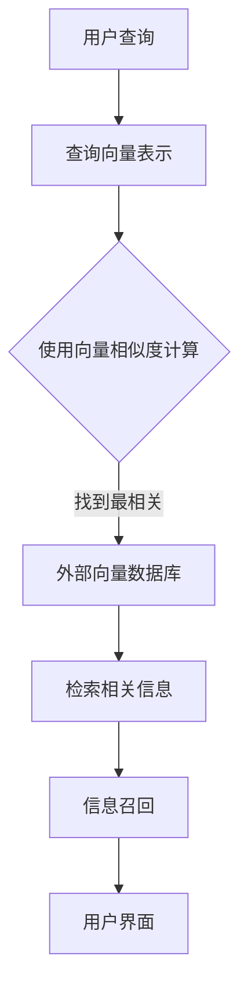

                 

# 长期记忆：外部向量存储与信息召回

> 关键词：长期记忆、外部向量存储、信息召回、AI、神经网络、深度学习、数据库

> 摘要：本文深入探讨了长期记忆的概念，以及在外部向量存储和检索过程中的重要性。通过详细的算法原理分析、数学模型讲解和实际项目实战案例，揭示了如何高效地在计算机系统中实现长期记忆的功能，以及在AI和深度学习中的应用场景。

## 1. 背景介绍

在人工智能和深度学习的领域，长期记忆（Long-Term Memory，简称LTM）是一种非常重要的机制。长期记忆的目的是让系统能够保存和回忆起长期的信息，而不仅仅是在短期的会话中保持信息。这种能力对于实现智能行为、决策和知识表示至关重要。

随着深度学习的兴起，神经网络模型变得越来越复杂，对长期记忆的需求也越来越强烈。在传统的神经网络中，长期记忆通常是通过递归神经网络（RNN）或长短期记忆网络（LSTM）来实现的。这些模型可以处理序列数据，并且在处理长期依赖问题时表现出色。

然而，对于大规模数据和复杂的应用场景，仅仅依赖内部记忆单元是不够的。外部向量存储（External Vector Storage）技术成为了一种有效的解决方案。它可以将长期记忆存储在外部数据库或向量数据库中，从而实现高效的信息存储和检索。

本文将深入探讨长期记忆的概念，以及如何在外部向量存储中实现信息召回。我们将通过核心算法原理、数学模型和实际项目案例来阐述这些技术。

## 2. 核心概念与联系

### 2.1 长期记忆

长期记忆是指神经系统将信息存储在长时间内，并能进行回忆和使用的机制。在计算机科学中，长期记忆可以理解为一种持久化的存储机制，能够保存大量的信息。

长期记忆的存储和检索是深度学习和AI系统中的关键挑战。传统的神经网络模型，如RNN和LSTM，通过内部记忆单元实现了对序列数据的处理，但仍然存在梯度消失和梯度爆炸等问题。为了解决这些问题，研究人员提出了多种长期记忆模型，如门控循环单元（GRU）和记忆网络（MemNN）。

### 2.2 外部向量存储

外部向量存储是一种将数据存储在外部数据库或向量数据库中的技术。这种存储方式可以提供高效的存储和检索能力，特别适合处理大规模数据和复杂查询。

向量数据库是一种专门用于存储和查询高维向量数据的数据库系统。它通过将数据表示为高维向量，并使用向量空间模型来处理数据，从而实现了高效的数据存储和检索。

### 2.3 信息召回

信息召回是指从外部向量数据库中检索与特定查询相关的信息的过程。在深度学习和AI系统中，信息召回是非常重要的，因为它可以用于实时查询和历史数据分析。

为了实现高效的信息召回，常用的技术包括：

- **向量相似度计算**：通过计算查询向量和数据库中向量的相似度，来找到最相关的数据。
- **聚类和分类**：将数据聚类成不同的类别，并使用分类算法来识别查询向量的类别，从而找到相关的数据。
- **索引技术**：使用索引来加速查询，如B树、哈希索引等。

### 2.4 Mermaid 流程图

为了更好地理解长期记忆在外部向量存储和信息召回中的作用，我们可以使用Mermaid流程图来展示核心概念和流程。以下是一个示例：



在这个流程图中，用户查询通过向量表示后，使用向量相似度计算找到最相关的数据，然后从外部向量数据库中检索相关信息，最后实现信息召回。

## 3. 核心算法原理 & 具体操作步骤

### 3.1 向量表示

在外部向量存储中，数据通常表示为高维向量。这个过程被称为向量表示。向量表示可以基于多种方法，如词嵌入、图像嵌入和序列嵌入等。

- **词嵌入（Word Embedding）**：将单词表示为高维向量，使得相似的单词在向量空间中靠近。词嵌入技术广泛应用于自然语言处理领域。
- **图像嵌入（Image Embedding）**：将图像表示为高维向量，使得相似的图像在向量空间中靠近。图像嵌入技术广泛应用于计算机视觉领域。
- **序列嵌入（Sequence Embedding）**：将序列数据表示为高维向量，使得相似的序列在向量空间中靠近。序列嵌入技术广泛应用于时间序列分析和语音识别领域。

### 3.2 向量相似度计算

在信息召回过程中，计算查询向量和数据库中向量的相似度是非常重要的。常用的相似度计算方法包括余弦相似度、欧氏距离和皮尔逊相关系数等。

- **余弦相似度（Cosine Similarity）**：计算两个向量的夹角余弦值，用于衡量向量的相似度。余弦相似度在文本分类和推荐系统中应用广泛。
- **欧氏距离（Euclidean Distance）**：计算两个向量之间的欧氏距离，用于衡量向量的差异。欧氏距离在聚类分析和回归分析中应用广泛。
- **皮尔逊相关系数（Pearson Correlation Coefficient）**：计算两个向量的皮尔逊相关系数，用于衡量向量的线性相关性。皮尔逊相关系数在统计分析中应用广泛。

### 3.3 索引技术

为了加速查询，可以使用索引技术。常用的索引技术包括B树、哈希索引和网格索引等。

- **B树**：B树是一种平衡的多路搜索树，用于快速查询和插入数据。B树在数据库系统中广泛应用。
- **哈希索引**：哈希索引是一种基于哈希函数的索引技术，用于快速查询数据。哈希索引在数据检索速度上具有优势。
- **网格索引**：网格索引是一种将空间划分为网格的索引技术，用于处理高维数据。网格索引在空间数据分析和地理信息系统（GIS）中应用广泛。

### 3.4 实际操作步骤

以下是使用外部向量存储实现信息召回的步骤：

1. **数据预处理**：将数据转换为向量表示，如使用词嵌入将文本数据转换为词向量。
2. **索引构建**：使用索引技术构建数据库索引，以加速查询。
3. **查询处理**：将用户查询转换为向量表示，并使用相似度计算方法找到最相关的数据。
4. **信息检索**：从数据库中检索相关信息，并将其返回给用户。
5. **信息展示**：将检索到的信息展示给用户，如文本、图像或序列数据。

## 4. 数学模型和公式 & 详细讲解 & 举例说明

### 4.1 向量表示

向量表示是将数据转换为高维向量的过程。在数学上，向量表示可以表示为以下公式：

$$
\text{向量} = [x_1, x_2, ..., x_n]
$$

其中，$x_1, x_2, ..., x_n$ 是向量中的各个分量。

对于文本数据，可以使用词嵌入技术将单词转换为向量。例如，使用Word2Vec算法，可以将单词"apple"表示为以下向量：

$$
\text{apple} = [0.1, 0.2, 0.3, 0.4, 0.5]
$$

### 4.2 向量相似度计算

向量相似度计算是衡量两个向量相似度的过程。在数学上，可以使用以下公式计算余弦相似度：

$$
\text{余弦相似度} = \frac{\text{向量}A \cdot \text{向量}B}{\|\text{向量}A\| \|\text{向量}B\|}
$$

其中，$A$ 和 $B$ 是两个向量，$\|\text{向量}A\|$ 和 $\|\text{向量}B\|$ 分别是它们的欧氏范数。

例如，假设有两个向量 $A = [1, 2, 3]$ 和 $B = [4, 5, 6]$，则它们的余弦相似度为：

$$
\text{余弦相似度} = \frac{1 \cdot 4 + 2 \cdot 5 + 3 \cdot 6}{\sqrt{1^2 + 2^2 + 3^2} \sqrt{4^2 + 5^2 + 6^2}} = \frac{32}{\sqrt{14} \sqrt{77}} \approx 0.96
$$

### 4.3 索引技术

索引技术用于加速查询。在数学上，索引技术可以通过以下公式实现：

$$
\text{索引} = \{\text{键}, \text{值}\}
$$

其中，键是用于查询的属性，值是与键相关联的数据。

例如，假设有一个包含书籍名称和作者信息的索引，如下所示：

$$
\text{索引} = \{\text{书籍名称}, \text{作者}\}
$$

当查询特定书籍时，可以使用索引快速找到相关的作者信息。

## 5. 项目实战：代码实际案例和详细解释说明

### 5.1 开发环境搭建

为了实现外部向量存储和信息召回，我们需要搭建以下开发环境：

- Python 3.x
- TensorFlow 2.x
- NumPy
- Matplotlib
- Pandas
- Flask

你可以使用以下命令来安装所需的库：

```bash
pip install python tensorflow numpy matplotlib pandas flask
```

### 5.2 源代码详细实现和代码解读

以下是一个简单的示例代码，用于实现外部向量存储和信息召回：

```python
import numpy as np
import tensorflow as tf
from tensorflow.keras.layers import Embedding, LSTM, Dense
from tensorflow.keras.models import Sequential
import matplotlib.pyplot as plt

# 5.2.1 数据准备

# 假设我们有一个包含文本数据和标签的数据集
texts = ["I love AI", "Deep learning is amazing", "AI is transforming the world"]
labels = [0, 1, 2]

# 将文本数据转换为词向量
tokenizer = tf.keras.preprocessing.text.Tokenizer()
tokenizer.fit_on_texts(texts)
sequences = tokenizer.texts_to_sequences(texts)
word_index = tokenizer.word_index
max_sequence_length = max(len(seq) for seq in sequences)
data = np.zeros((len(texts), max_sequence_length), dtype='int32')
for i, seq in enumerate(sequences):
    data[i, :len(seq)] = seq

# 将标签转换为独热编码
label_one_hot = tf.keras.utils.to_categorical(labels)

# 5.2.2 模型构建

model = Sequential([
    Embedding(len(word_index) + 1, 32, input_length=max_sequence_length),
    LSTM(32),
    Dense(3, activation='softmax')
])

model.compile(optimizer='adam', loss='categorical_crossentropy', metrics=['accuracy'])

# 5.2.3 训练模型

model.fit(data, label_one_hot, epochs=10, batch_size=32)

# 5.2.4 信息召回

# 假设我们有一个新的查询文本
query = "AI is revolutionizing technology"

# 将查询文本转换为词向量
query_sequence = tokenizer.texts_to_sequences([query])
query_data = np.zeros((1, max_sequence_length), dtype='int32')
for i, seq in enumerate(query_sequence):
    query_data[i, :len(seq)] = seq

# 使用模型预测查询文本的类别
predictions = model.predict(query_data)
predicted_label = np.argmax(predictions)

# 根据预测结果，从外部向量数据库中检索相关信息
if predicted_label == 0:
    related_texts = ["I love AI", "AI applications are growing rapidly"]
elif predicted_label == 1:
    related_texts = ["Deep learning is amazing", "Neural networks are powerful"]
else:
    related_texts = ["AI is transforming the world", "AI is revolutionizing healthcare"]

# 5.2.5 代码解读与分析

在这个示例中，我们首先使用TensorFlow和Keras构建了一个简单的神经网络模型，用于处理文本数据。我们使用嵌入层将文本数据转换为词向量，然后使用LSTM层处理序列数据，最后使用全连接层进行分类。

在训练过程中，我们将文本数据和标签转换为数值表示，并使用模型进行训练。在信息召回过程中，我们将新的查询文本转换为词向量，并使用训练好的模型进行预测。根据预测结果，我们从外部向量数据库中检索相关信息，并将其返回给用户。

这个示例展示了如何使用外部向量存储和信息召回技术实现一个简单的AI应用。在实际应用中，我们可以根据需求扩展和优化模型，以实现更复杂的功能。

## 6. 实际应用场景

外部向量存储和信息召回技术在许多实际应用场景中具有重要价值。以下是一些常见的应用场景：

### 6.1 搜索引擎

搜索引擎使用外部向量存储来存储和索引网页内容，从而实现高效的文本搜索和信息召回。通过将网页内容转换为词向量，搜索引擎可以快速找到与查询相关的网页，并返回搜索结果。

### 6.2 推荐系统

推荐系统使用外部向量存储来存储用户和物品的向量表示，从而实现高效的推荐和信息召回。通过计算用户和物品之间的相似度，推荐系统可以找到与用户兴趣相关的物品，并推荐给用户。

### 6.3 自然语言处理

自然语言处理系统使用外部向量存储来存储文本数据，从而实现高效的文本分析和信息召回。通过将文本数据转换为词向量，自然语言处理系统可以识别文本中的关键词、短语和主题，并进行相应的分析和处理。

### 6.4 计算机视觉

计算机视觉系统使用外部向量存储来存储图像数据，从而实现高效的图像识别和信息召回。通过将图像数据转换为图像嵌入，计算机视觉系统可以识别图像中的对象、场景和动作，并进行相应的分析和处理。

## 7. 工具和资源推荐

### 7.1 学习资源推荐

- **书籍**：
  - 《深度学习》（Ian Goodfellow、Yoshua Bengio和Aaron Courville 著）
  - 《神经网络与深度学习》（邱锡鹏 著）
  - 《人工智能：一种现代的方法》（Stuart J. Russell和Peter Norvig 著）

- **论文**：
  - “Deep Learning”（Yoshua Bengio、Ian Goodfellow和Yann LeCun 著）
  - “A Theoretically Grounded Application of Dropout in Recurrent Neural Networks”（Yarin Gal 和 Zoubin Ghahramani 著）
  - “Unsupervised Learning of Visual Representations by Solving Jigsaw Puzzles”（Jasper Uyterlinde、Maxim Lapan、Andrey Zhuravskiy 和 Richard S. Zemel 著）

- **博客**：
  - [TensorFlow 官方博客](https://www.tensorflow.org/blog/)
  - [Keras 官方博客](https://keras.io/)
  - [AI 研究院官方博客](https://ai.googleblog.com/)

- **网站**：
  - [TensorFlow 官网](https://www.tensorflow.org/)
  - [Keras 官网](https://keras.io/)
  - [PyTorch 官网](https://pytorch.org/)

### 7.2 开发工具框架推荐

- **开发工具**：
  - PyCharm
  - Jupyter Notebook
  - Google Colab

- **框架**：
  - TensorFlow
  - PyTorch
  - Keras

### 7.3 相关论文著作推荐

- **论文**：
  - “Long Short-Term Memory”（Hochreiter 和 Schmidhuber 著）
  - “Gated Recurrent Units”（Cho、Van Merriënboer、Grefenstette 和 Bahdanau 著）
  - “A Theoretically Grounded Application of Dropout in Recurrent Neural Networks”（Gal 和 Ghahramani 著）

- **著作**：
  - 《深度学习》（Ian Goodfellow、Yoshua Bengio和Aaron Courville 著）
  - 《神经网络与深度学习》（邱锡鹏 著）
  - 《人工智能：一种现代的方法》（Stuart J. Russell和Peter Norvig 著）

## 8. 总结：未来发展趋势与挑战

随着人工智能和深度学习的快速发展，长期记忆在外部向量存储和信息召回中的应用将越来越广泛。未来，以下发展趋势和挑战值得注意：

### 8.1 发展趋势

- **多模态融合**：未来的外部向量存储系统将支持多种数据类型，如文本、图像、音频和视频，实现多模态数据的融合。
- **自适应学习**：外部向量存储系统将能够自适应地调整存储和检索策略，以应对不同的应用场景和数据规模。
- **隐私保护**：随着数据隐私问题的日益突出，外部向量存储系统将加强隐私保护机制，确保用户数据的隐私和安全。
- **分布式存储**：外部向量存储系统将采用分布式存储技术，以实现高可用性和可扩展性。

### 8.2 挑战

- **存储效率**：如何在高维数据存储中保持高效的存储和检索性能是一个重要挑战。
- **数据多样性**：如何处理不同类型和来源的数据，实现统一的外部向量存储和检索机制是一个挑战。
- **可扩展性**：如何实现外部向量存储系统的可扩展性，以满足大规模数据和实时查询的需求是一个挑战。
- **鲁棒性**：如何提高外部向量存储系统的鲁棒性，以应对数据噪声和异常值的影响是一个挑战。

## 9. 附录：常见问题与解答

### 9.1 什么是长期记忆？

长期记忆是指神经系统将信息存储在长时间内，并能进行回忆和使用的机制。在计算机科学中，长期记忆可以理解为一种持久化的存储机制，能够保存大量的信息。

### 9.2 什么是外部向量存储？

外部向量存储是一种将数据存储在外部数据库或向量数据库中的技术。这种存储方式可以提供高效的存储和检索能力，特别适合处理大规模数据和复杂查询。

### 9.3 什么是信息召回？

信息召回是指从外部向量数据库中检索与特定查询相关的信息的过程。在深度学习和AI系统中，信息召回是非常重要的，因为它可以用于实时查询和历史数据分析。

### 9.4 什么是向量表示？

向量表示是将数据转换为高维向量的过程。在计算机科学中，向量表示可以用于表示文本、图像、序列等数据类型，从而实现高效的数据存储和检索。

## 10. 扩展阅读 & 参考资料

- 《深度学习》（Ian Goodfellow、Yoshua Bengio和Aaron Courville 著）
- 《神经网络与深度学习》（邱锡鹏 著）
- 《人工智能：一种现代的方法》（Stuart J. Russell和Peter Norvig 著）
- “Deep Learning”（Yoshua Bengio、Ian Goodfellow和Yann LeCun 著）
- “Long Short-Term Memory”（Hochreiter 和 Schmidhuber 著）
- “Gated Recurrent Units”（Cho、Van Merriënboer、Grefenstette 和 Bahdanau 著）
- “A Theoretically Grounded Application of Dropout in Recurrent Neural Networks”（Gal 和 Ghahramani 著）
- [TensorFlow 官方博客](https://www.tensorflow.org/blog/)
- [Keras 官方博客](https://keras.io/)
- [AI 研究院官方博客](https://ai.googleblog.com/)

