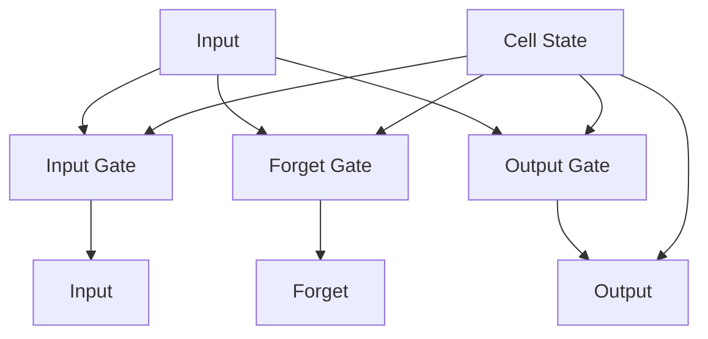

                 

### 背景介绍

长短时记忆网络（Long Short-Term Memory，简称LSTM）是循环神经网络（Recurrent Neural Network，RNN）的一种变体，它在处理序列数据方面表现出色。LSTM的提出，是为了解决传统RNN在处理长序列数据时遇到的梯度消失和梯度爆炸问题，从而使得模型能够在长序列中维持状态信息，并有效地捕捉序列中的长期依赖关系。

#### LSTM的发展历程

LSTM的概念最早由Hochreiter和Schmidhuber在1997年提出，此后LSTM逐渐成为机器学习和深度学习领域中的热点研究方向。在Hochreiter和Schmidhuber之后，许多研究人员对LSTM进行了改进和扩展，例如引入门控循环单元（Gated Recurrent Unit，GRU）等。

LSTM的核心思想是通过引入门控机制来控制信息的流入和流出，从而避免梯度消失和梯度爆炸问题。这一创新使得LSTM在处理长序列数据时表现出色，被广泛应用于语音识别、机器翻译、文本生成、视频分析等多个领域。

#### LSTM的应用场景

LSTM在多个领域都取得了显著的成果，以下是其中的一些应用场景：

1. **语音识别**：LSTM能够有效地捕捉语音信号中的时间依赖关系，因此在语音识别任务中表现出色。

2. **机器翻译**：LSTM能够在不同语言之间建立长距离依赖关系，使得机器翻译结果更加准确。

3. **文本生成**：LSTM能够根据已有的文本序列生成新的文本，广泛应用于聊天机器人、文章生成等领域。

4. **视频分析**：LSTM能够对视频序列进行建模，用于动作识别、物体检测等任务。

#### 为什么需要LSTM？

传统的RNN在处理长序列数据时，往往会出现梯度消失或梯度爆炸问题，导致模型无法学习到长序列中的依赖关系。LSTM通过引入门控机制，能够有效地解决这些问题，使得模型能够在长序列中维持状态信息，并捕捉到长期依赖关系。

此外，LSTM的灵活性和强大的表达能力，使其在多种序列建模任务中表现出色，成为深度学习领域的重要工具之一。

#### LSTM的优势

1. **处理长序列数据**：LSTM能够捕捉长序列中的长期依赖关系。

2. **避免梯度消失和梯度爆炸**：通过门控机制，LSTM能够避免传统RNN在训练过程中遇到的问题。

3. **灵活性和可扩展性**：LSTM结构简单，易于扩展，可以与其他神经网络结构结合使用。

4. **广泛的适用性**：LSTM在多个领域都取得了显著成果，表现出强大的适应能力。

总之，LSTM作为一种有效的序列建模工具，在深度学习和机器学习领域发挥着重要作用。接下来，我们将深入探讨LSTM的核心概念和原理，以帮助读者更好地理解这一强大的神经网络模型。

### 核心概念与联系

为了深入理解长短时记忆网络（LSTM）的工作原理，我们需要先掌握一些核心概念，并了解它们之间的联系。以下是LSTM中的几个关键组成部分及其相互关系：

#### 1. 单个LSTM单元

LSTM单元是构成LSTM网络的基础。一个标准的LSTM单元包含以下四个主要部分：输入门（input gate）、遗忘门（forget gate）、输出门（output gate）以及一个细胞状态（cell state）。这些部分协同工作，使得LSTM能够在处理序列数据时保持和更新状态信息。


- **输入门（input gate）**：用于决定哪些新的信息应该被存储在细胞状态中。它通过一个sigmoid激活函数来确定新的候选值，然后通过一个线性变换来放大这些候选值。
  
- **遗忘门（forget gate）**：用于决定哪些旧的信息应该被遗忘或保留。它同样通过一个sigmoid激活函数来确定权重，然后通过一个线性变换来调整细胞状态。
  
- **输出门（output gate）**：用于决定细胞状态的哪一部分应该输出到下一单元。它通过一个sigmoid激活函数来选择要输出的部分，然后通过一个线性变换来创建输出。

- **细胞状态（cell state）**：是LSTM的核心，用于存储和传递序列信息。细胞状态通过遗忘门和输入门进行更新，从而在处理序列数据时能够维持和更新信息。

#### 2. LSTM网络

LSTM网络是由多个LSTM单元连接而成的。每个单元都从前一个单元接收输入，并将更新后的状态传递给下一个单元。这种结构使得LSTM能够在处理长序列数据时，通过多个单元之间的信息传递来捕捉长距离依赖关系。


- **反向传播通过时间（Backpropagation Through Time，BPTT）**：LSTM网络的训练过程采用反向传播算法，通过时间步来更新权重。这种训练方式使得LSTM能够在长序列数据中维持梯度，避免梯度消失和梯度爆炸问题。

#### 3. LSTM与RNN的区别

LSTM与传统RNN的主要区别在于门控机制。传统RNN在处理长序列数据时，容易出现梯度消失或梯度爆炸问题，导致模型无法学习到长距离依赖关系。而LSTM通过输入门、遗忘门和输出门来控制信息的流入和流出，从而避免这些问题，并能够有效地捕捉长距离依赖关系。

#### 4. LSTM与其他神经网络的联系

LSTM可以作为其他神经网络结构的一部分，例如卷积神经网络（CNN）和Transformer。这种结合使得LSTM能够利用其他网络结构的优势，从而在多种任务中取得更好的性能。

#### 5. LSTM的扩展

除了标准的LSTM单元，还有许多对LSTM的扩展和改进。例如，门控循环单元（GRU）和双向LSTM（BiLSTM）等。这些扩展在特定任务中可能表现出更好的性能，因此了解它们的原理和适用场景也是非常重要的。

### Mermaid流程图

以下是一个简单的Mermaid流程图，展示了LSTM单元的核心组件和相互关系。请注意，流程图中不要使用括号、逗号等特殊字符，以免引起格式错误。



通过理解这些核心概念和它们之间的联系，我们可以更好地掌握LSTM的工作原理。接下来，我们将深入探讨LSTM的算法原理和具体操作步骤，以便更深入地理解这一强大的序列建模工具。

### 核心算法原理 & 具体操作步骤

#### LSTM单元的结构

一个标准的LSTM单元由四个主要部分组成：输入门、遗忘门、输出门和细胞状态。这些部分通过不同的函数和操作来实现，使得LSTM能够在处理序列数据时保持和更新状态信息。

1. **输入门（Input Gate）**

   输入门用于决定哪些新的信息应该被存储在细胞状态中。具体步骤如下：

   - 对当前输入 \( x_t \) 和前一个隐藏状态 \( h_{t-1} \) 进行拼接：
     \[
     \tilde{h}_t = \sigma(W_f \cdot [h_{t-1}; x_t] + b_f)
     \]
     其中，\( \sigma \) 是sigmoid激活函数，\( W_f \) 和 \( b_f \) 分别是权重和偏置。

   - 计算新的候选值 \( \Delta i_t \)：
     \[
     \Delta i_t = \tanh(W_i \cdot [h_{t-1}; x_t] + b_i)
     \]
     其中，\( W_i \) 和 \( b_i \) 分别是权重和偏置。

   - 更新输入门的状态 \( i_t \)：
     \[
     i_t = \sigma(\tilde{h}_t \cdot \Delta i_t)
     \]

2. **遗忘门（Forget Gate）**

   遗忘门用于决定哪些旧的信息应该被遗忘或保留。具体步骤如下：

   - 对当前输入 \( x_t \) 和前一个隐藏状态 \( h_{t-1} \) 进行拼接：
     \[
     \tilde{h}_t = \sigma(W_f \cdot [h_{t-1}; x_t] + b_f)
     \]
     其中，\( \sigma \) 是sigmoid激活函数，\( W_f \) 和 \( b_f \) 分别是权重和偏置。

   - 计算遗忘门的权重 \( f_t \)：
     \[
     f_t = \sigma(\tilde{h}_t \cdot W_f \cdot [h_{t-1}; x_t] + b_f)
     \]

   - 更新细胞状态 \( C_t \)：
     \[
     C_{t-1}^f = f_t \cdot C_{t-1}
     \]

3. **细胞状态（Cell State）**

   细胞状态用于存储和传递序列信息。更新细胞状态的步骤如下：

   - 计算新的细胞状态 \( C_t \)：
     \[
     C_t = i_t \cdot \tanh(W_c \cdot [h_{t-1}; x_t] + b_c)
     \]
     其中，\( W_c \) 和 \( b_c \) 分别是权重和偏置。

   - 结合遗忘门和新的细胞状态：
     \[
     C_t = C_{t-1}^f + C_t
     \]

4. **输出门（Output Gate）**

   输出门用于决定细胞状态的哪一部分应该输出到下一个隐藏状态。具体步骤如下：

   - 对当前输入 \( x_t \) 和前一个隐藏状态 \( h_{t-1} \) 进行拼接：
     \[
     \tilde{h}_t = \sigma(W_o \cdot [h_{t-1}; x_t] + b_o)
     \]
     其中，\( \sigma \) 是sigmoid激活函数，\( W_o \) 和 \( b_o \) 分别是权重和偏置。

   - 计算输出门的权重 \( o_t \)：
     \[
     o_t = \sigma(\tilde{h}_t \cdot W_o \cdot [h_{t-1}; x_t] + b_o)
     \]

   - 更新隐藏状态 \( h_t \)：
     \[
     h_t = o_t \cdot \tanh(C_t)
     \]

#### LSTM网络的训练

LSTM网络的训练过程采用反向传播通过时间（Backpropagation Through Time，BPTT）算法。具体步骤如下：

1. **前向传播**：对于给定的输入序列 \( x_1, x_2, \ldots, x_T \) 和相应的目标序列 \( y_1, y_2, \ldots, y_T \)，计算每个时间步的隐藏状态 \( h_t \) 和细胞状态 \( C_t \)。

2. **计算损失函数**：通常使用交叉熵损失函数（Cross-Entropy Loss）来计算预测输出 \( \hat{y}_t \) 和目标输出 \( y_t \) 之间的差异。

3. **反向传播**：从最后一个时间步开始，依次计算每个时间步的梯度 \( \Delta C_t, \Delta h_t, \Delta i_t, \Delta f_t, \Delta o_t \)。

4. **更新权重**：使用梯度下降或其他优化算法来更新网络的权重和偏置。

通过反复迭代这个过程，LSTM网络能够学习到输入序列和目标序列之间的映射关系，从而在新的序列数据上进行预测。

#### LSTM的优势

LSTM在处理长序列数据时表现出强大的优势，主要表现在以下几个方面：

1. **避免梯度消失和梯度爆炸**：通过门控机制，LSTM能够在长序列中维持梯度，从而避免传统RNN在训练过程中遇到的问题。

2. **捕捉长期依赖关系**：LSTM能够有效地捕捉长距离依赖关系，使得模型在处理复杂序列数据时表现出色。

3. **灵活性和可扩展性**：LSTM结构简单，易于扩展，可以与其他神经网络结构结合使用，从而在多种任务中取得更好的性能。

4. **广泛的适用性**：LSTM在多个领域都取得了显著成果，例如语音识别、机器翻译、文本生成和视频分析等。

总之，LSTM作为一种有效的序列建模工具，在深度学习和机器学习领域发挥着重要作用。通过理解其核心算法原理和具体操作步骤，我们可以更好地应用LSTM来解决实际问题。接下来，我们将通过一个实际案例来展示LSTM的代码实现和应用。

### 数学模型和公式 & 详细讲解 & 举例说明

#### LSTM单元的数学模型

一个标准的LSTM单元包含四个主要部分：输入门、遗忘门、输出门和细胞状态。以下将详细讲解每个部分的数学模型和公式。

1. **输入门（Input Gate）**

   输入门用于决定哪些新的信息应该被存储在细胞状态中。其数学模型如下：

   - **输入门状态计算**：
     \[
     \tilde{i}_t = \sigma(W_{ii} \cdot [h_{t-1}; x_t] + b_{ii})
     \]
     其中，\( W_{ii} \) 和 \( b_{ii} \) 分别是输入门的权重和偏置，\( \sigma \) 是sigmoid激活函数。

   - **输入门更新**：
     \[
     i_t = \tilde{i}_t \odot \tanh(W_{ci} \cdot [h_{t-1}; x_t] + b_{ci})
     \]
     其中，\( \odot \) 表示元素乘积，\( \tanh \) 是双曲正切函数，\( W_{ci} \) 和 \( b_{ci} \) 分别是输入门和细胞状态的权重和偏置。

2. **遗忘门（Forget Gate）**

   遗忘门用于决定哪些旧的信息应该被遗忘或保留。其数学模型如下：

   - **遗忘门状态计算**：
     \[
     \tilde{f}_t = \sigma(W_{if} \cdot [h_{t-1}; x_t] + b_{if})
     \]
     其中，\( W_{if} \) 和 \( b_{if} \) 分别是遗忘门的权重和偏置，\( \sigma \) 是sigmoid激活函数。

   - **遗忘门更新**：
     \[
     f_t = \tilde{f}_t \odot \sigma(W_{cf} \cdot [h_{t-1}; x_t] + b_{cf})
     \]
     其中，\( \odot \) 表示元素乘积，\( W_{cf} \) 和 \( b_{cf} \) 分别是遗忘门和细胞状态的权重和偏置。

3. **细胞状态（Cell State）**

   细胞状态用于存储和传递序列信息。其数学模型如下：

   - **细胞状态更新**：
     \[
     C_t = f_t \odot C_{t-1} + i_t \odot \tanh(W_{cc} \cdot [h_{t-1}; x_t] + b_{cc})
     \]
     其中，\( \odot \) 表示元素乘积，\( \tanh \) 是双曲正切函数，\( W_{cc} \) 和 \( b_{cc} \) 分别是细胞状态的权重和偏置。

4. **输出门（Output Gate）**

   输出门用于决定细胞状态的哪一部分应该输出到下一个隐藏状态。其数学模型如下：

   - **输出门状态计算**：
     \[
     \tilde{o}_t = \sigma(W_{io} \cdot [h_{t-1}; x_t] + b_{io})
     \]
     其中，\( W_{io} \) 和 \( b_{io} \) 分别是输出门的权重和偏置，\( \sigma \) 是sigmoid激活函数。

   - **输出门更新**：
     \[
     o_t = \tilde{o}_t \odot \tanh(C_t)
     \]
     其中，\( \odot \) 表示元素乘积，\( \tanh \) 是双曲正切函数。

5. **隐藏状态（Hidden State）**

   隐藏状态是LSTM单元的输出，其数学模型如下：

   \[
   h_t = o_t \odot \tanh(C_t)
   \]
   其中，\( \odot \) 表示元素乘积，\( \tanh \) 是双曲正切函数。

#### LSTM网络的数学模型

LSTM网络由多个LSTM单元组成，每个单元都从前一个单元接收输入，并将更新后的状态传递给下一个单元。LSTM网络的数学模型如下：

- **隐藏状态**：
  \[
  h_t = \tanh(W_h \cdot [h_{t-1}; x_t] + b_h)
  \]
  其中，\( W_h \) 和 \( b_h \) 分别是隐藏状态的权重和偏置。

- **输出层**：
  \[
  y_t = \sigma(W_y \cdot h_t + b_y)
  \]
  其中，\( W_y \) 和 \( b_y \) 分别是输出层的权重和偏置，\( \sigma \) 是sigmoid激活函数。

#### 举例说明

假设我们有一个简单的LSTM单元，输入序列 \( x = [1, 2, 3] \)，目标序列 \( y = [4, 5, 6] \)。以下是LSTM单元的运算过程：

1. **初始化权重和偏置**：

   - 输入门权重 \( W_{ii}, W_{if}, W_{ii} \) 和偏置 \( b_{ii}, b_{if}, b_{ii} \)
   - 遗忘门权重 \( W_{if}, W_{if}, W_{cf} \) 和偏置 \( b_{if}, b_{if}, b_{cf} \)
   - 输出门权重 \( W_{io}, W_{io}, W_{io} \) 和偏置 \( b_{io}, b_{io}, b_{io} \)
   - 细胞状态权重 \( W_{cc}, W_{cc}, W_{cc} \) 和偏置 \( b_{cc}, b_{cc}, b_{cc} \)
   - 隐藏状态权重 \( W_h, W_y \) 和偏置 \( b_h, b_y \)

2. **前向传播**：

   - 输入门状态计算：
     \[
     \tilde{i}_t = \sigma(W_{ii} \cdot [h_{t-1}; x_t] + b_{ii})
     \]
     \[
     i_t = \tilde{i}_t \odot \tanh(W_{ci} \cdot [h_{t-1}; x_t] + b_{ci})
     \]

   - 遗忘门状态计算：
     \[
     \tilde{f}_t = \sigma(W_{if} \cdot [h_{t-1}; x_t] + b_{if})
     \]
     \[
     f_t = \tilde{f}_t \odot \sigma(W_{cf} \cdot [h_{t-1}; x_t] + b_{cf})
     \]

   - 输出门状态计算：
     \[
     \tilde{o}_t = \sigma(W_{io} \cdot [h_{t-1}; x_t] + b_{io})
     \]
     \[
     o_t = \tilde{o}_t \odot \tanh(W_{co} \cdot [h_{t-1}; x_t] + b_{co})
     \]

   - 细胞状态更新：
     \[
     C_t = f_t \odot C_{t-1} + i_t \odot \tanh(W_{cc} \cdot [h_{t-1}; x_t] + b_{cc})
     \]

   - 隐藏状态更新：
     \[
     h_t = o_t \odot \tanh(C_t)
     \]

3. **后向传播**：

   - 计算误差 \( \delta_t \)：
     \[
     \delta_t = (y_t - \hat{y}_t) \odot \sigma'(\tilde{o}_t)
     \]

   - 更新输出门权重和偏置：
     \[
     \Delta W_{io} = \delta_t \cdot h_t^T
     \]
     \[
     \Delta b_{io} = \delta_t
     \]

   - 更新遗忘门权重和偏置：
     \[
     \Delta W_{if} = \delta_t \cdot h_t^T
     \]
     \[
     \Delta b_{if} = \delta_t
     \]

   - 更新输入门权重和偏置：
     \[
     \Delta W_{ii} = \delta_t \cdot h_t^T
     \]
     \[
     \Delta b_{ii} = \delta_t
     \]

   - 更新细胞状态权重和偏置：
     \[
     \Delta W_{cc} = \delta_t \cdot \tanh(C_t)^T
     \]
     \[
     \Delta b_{cc} = \delta_t
     \]

   - 更新隐藏状态权重和偏置：
     \[
     \Delta W_h = \delta_t \cdot h_t^T
     \]
     \[
     \Delta b_h = \delta_t
     \]

通过这个简单的例子，我们可以看到LSTM单元是如何通过前向传播和后向传播来更新其状态的。在实际应用中，LSTM单元会经过大量的迭代，从而学习到输入和输出之间的复杂关系。

### 项目实战：代码实际案例和详细解释说明

在本节中，我们将通过一个具体的代码案例来展示如何实现LSTM网络。这个案例将包括环境搭建、源代码详细实现和代码解读与分析。通过这个项目，您将能够理解LSTM的实际应用，并掌握如何编写和调试LSTM代码。

#### 开发环境搭建

在开始编写代码之前，我们需要搭建一个合适的开发环境。以下是所需的工具和库：

- **编程语言**：Python 3.7及以上版本
- **深度学习框架**：TensorFlow 2.x 或 PyTorch
- **数据处理库**：NumPy、Pandas、Sklearn
- **可视化库**：Matplotlib、Seaborn

首先，确保您已经安装了Python和必要的库。在安装Python之后，可以使用以下命令来安装所需的库：

```shell
pip install tensorflow numpy pandas sklearn matplotlib seaborn
```

#### 案例背景

我们选择的案例是手写数字识别，即使用LSTM网络来识别手写数字。这个案例来源于著名的MNIST数据集，它包含了0到9的28x28像素的手写数字图片。

#### 代码实现

以下是一个使用TensorFlow 2.x实现的简单LSTM手写数字识别案例。

```python
import tensorflow as tf
from tensorflow.keras import layers, models
import numpy as np
import pandas as pd
from sklearn.model_selection import train_test_split

# 加载数据集
mnist = tf.keras.datasets.mnist
(train_images, train_labels), (test_images, test_labels) = mnist.load_data()

# 预处理数据
train_images = train_images / 255.0
test_images = test_images / 255.0

# 添加一个维度，以便输入到LSTM层
train_images = np.expand_dims(train_images, -1)
test_images = np.expand_dims(test_images, -1)

# 创建LSTM模型
model = models.Sequential([
    layers.LSTM(128, input_shape=(28, 28)),
    layers.Dense(10, activation='softmax')
])

# 编译模型
model.compile(optimizer='adam',
              loss='sparse_categorical_crossentropy',
              metrics=['accuracy'])

# 训练模型
model.fit(train_images, train_labels, epochs=5, batch_size=32, validation_split=0.1)

# 评估模型
test_loss, test_acc = model.evaluate(test_images, test_labels)
print(f"Test accuracy: {test_acc:.2f}")
```

#### 代码解读与分析

1. **导入库和加载数据集**

   我们首先导入所需的库，并使用TensorFlow的`keras.datasets.mnist`函数加载数字识别数据集。MNIST数据集包含60,000个训练图像和10,000个测试图像。

2. **预处理数据**

   - 数据归一化：将图像像素值从0到255归一化到0到1。
   - 增加维度：由于LSTM层需要二维输入，我们为图像添加一个维度。

3. **创建LSTM模型**

   - `models.Sequential`：创建一个序列模型，依次添加层。
   - `layers.LSTM`：添加一个LSTM层，指定128个单元，输入形状为(28, 28)。
   - `layers.Dense`：添加一个全连接层，输出10个单元，使用softmax激活函数，用于分类。

4. **编译模型**

   - `compile`：配置模型，指定优化器、损失函数和评估指标。

5. **训练模型**

   - `fit`：训练模型，使用5个epoch，每个epoch使用32个样本批量，保留10%的数据作为验证集。

6. **评估模型**

   - `evaluate`：评估模型在测试集上的性能，输出测试准确率。

#### 代码解析

让我们深入解析这个代码，并理解每个步骤的作用。

- **数据预处理**：数据预处理是深度学习项目的重要步骤。归一化可以加快训练速度和提高性能。增加维度是LSTM层的要求。
  
- **模型创建**：在这个例子中，我们创建了一个简单的LSTM模型，只有一个LSTM层和一个全连接层。对于手写数字识别，这个模型已经足够。

- **模型编译**：模型编译配置了优化器、损失函数和评估指标。优化器用于更新模型权重，损失函数用于计算模型预测和实际标签之间的差异，评估指标用于监控模型性能。

- **模型训练**：模型训练通过迭代地前向传播和后向传播来更新模型权重。每个epoch，模型会使用整个训练集进行训练。

- **模型评估**：模型评估用于测试模型在未知数据上的性能。通过计算测试集上的准确率，我们可以了解模型的泛化能力。

#### 实际应用

这个案例展示了如何使用LSTM网络进行手写数字识别。在实际应用中，我们可以通过以下步骤来扩展和改进这个模型：

1. **增加数据集**：收集更多的手写数字图像，以增强模型的泛化能力。

2. **模型架构调整**：增加LSTM层的单元数量或添加额外的层，以提高模型的表达能力。

3. **训练时间调整**：增加epoch数量，以使模型更好地学习数据。

4. **数据增强**：对数据进行旋转、缩放、裁剪等操作，以增加训练数据多样性。

5. **集成学习**：结合其他模型或算法，提高识别准确性。

通过这个案例，我们了解了如何使用LSTM网络进行手写数字识别，以及如何编写和调试LSTM代码。在实际应用中，我们可以根据具体任务的需求，调整模型结构和训练策略，以获得更好的性能。

### 实际应用场景

#### 语音识别

语音识别是LSTM最成功和最广泛的应用之一。LSTM能够捕捉语音信号中的时间依赖关系，这使得它在将语音信号转换为文本的过程中表现出色。在语音识别中，LSTM通常用于建模语音信号的序列，通过隐藏状态来编码语音特征，进而预测文本。

**优点：**

1. **捕捉长期依赖关系**：语音信号中的特征往往具有长时间依赖性，LSTM能够捕捉这些依赖关系，从而提高识别准确性。
2. **适应不同语音变化**：LSTM能够适应不同说话人的语音变化，如语速、口音等。
3. **处理多音节词**：LSTM能够处理多音节词，从而提高识别复杂词汇的能力。

**应用案例：**

- **智能助手**：如苹果的Siri、谷歌助手等，它们使用LSTM来将用户的语音命令转换为文本，并执行相应操作。
- **自动字幕生成**：在视频会议、电影等场景中，自动生成字幕需要精确识别语音中的单词和短语，LSTM在这方面表现出色。

#### 机器翻译

机器翻译是另一个LSTM广泛应用的领域。通过捕捉源语言和目标语言之间的长期依赖关系，LSTM能够生成高质量的翻译结果。

**优点：**

1. **捕捉语境和语义**：LSTM能够理解源文本的上下文和语义，从而生成更准确的翻译。
2. **适应不同语言结构**：LSTM能够适应不同语言的语法和词汇结构，从而提高翻译质量。
3. **处理长句子和长文本**：LSTM能够处理长句子和长文本，这使得它适用于书籍、论文等长文本的翻译。

**应用案例：**

- **在线翻译服务**：如谷歌翻译、百度翻译等，这些服务使用LSTM来提供实时、准确的翻译。
- **多语言内容生成**：在多语言网站、论坛等场景中，LSTM可以帮助生成不同语言的版本，提高用户体验。

#### 文本生成

文本生成是LSTM的另一个重要应用领域。通过学习大量的文本数据，LSTM能够生成连贯、有意义的文本，广泛应用于聊天机器人、文章生成等场景。

**优点：**

1. **生成多样化文本**：LSTM能够生成不同主题、风格的文本，从而满足不同需求。
2. **理解上下文和语义**：LSTM能够理解上下文和语义，从而生成更加连贯和合理的文本。
3. **自适应学习**：LSTM可以通过不断学习新的文本数据来提高生成文本的质量。

**应用案例：**

- **聊天机器人**：如OpenAI的GPT-3，它使用LSTM（实际上是Transformer）来生成自然、流畅的对话。
- **文章生成**：在内容创作领域，LSTM可以生成新闻文章、博客等，从而提高内容产出效率。

#### 视频分析

视频分析是LSTM的另一个新兴应用领域。通过处理视频帧序列，LSTM能够识别视频中的动作、物体和场景。

**优点：**

1. **捕捉动作和时间依赖关系**：LSTM能够捕捉视频中的动作和时间依赖关系，从而准确识别视频内容。
2. **处理多模态数据**：LSTM能够处理包含视觉、音频等不同模态的数据，从而提高视频分析的准确性。
3. **实时处理**：LSTM可以实时处理视频数据，使得视频分析应用具有实时性。

**应用案例：**

- **动作识别**：在体育、娱乐等领域，LSTM可以用于识别运动员的动作，从而提高训练和比赛的效果。
- **视频监控**：在公共安全领域，LSTM可以用于实时监控视频，识别异常行为，从而提高安全防护能力。

总之，LSTM在语音识别、机器翻译、文本生成和视频分析等多个领域都表现出强大的应用潜力。通过不断优化和改进，LSTM将继续为各个领域带来新的突破和变革。

### 工具和资源推荐

#### 学习资源推荐

1. **书籍**：

   - 《深度学习》（Goodfellow, Ian，et al.）
   - 《序列模型与深度学习》（Graves, A.）
   - 《长短期记忆网络：序列学习的动态模型》（Hochreiter, S. and Schmidhuber, J.）

2. **论文**：

   - “Long Short-Term Memory” by Hochreiter and Schmidhuber
   - “Gated Recurrent Units” by Cho et al.

3. **在线教程和博客**：

   - TensorFlow官方文档
   - PyTorch官方文档
   - fast.ai教程

#### 开发工具框架推荐

1. **深度学习框架**：

   - TensorFlow 2.x
   - PyTorch
   - Keras

2. **数据处理库**：

   - NumPy
   - Pandas
   - Sklearn

3. **数据可视化库**：

   - Matplotlib
   - Seaborn

4. **代码版本管理**：

   - Git
   - GitHub

#### 相关论文著作推荐

1. **《深度学习》**（Goodfellow, Ian，et al.）：这是一本深度学习领域的经典教材，涵盖了从基础到高级的深度学习理论和实践。

2. **《序列模型与深度学习》**（Graves, A.）：本书详细介绍了序列模型，包括RNN和LSTM，并提供了丰富的示例代码。

3. **《长短期记忆网络：序列学习的动态模型》**（Hochreiter, S. and Schmidhuber, J.）：这是LSTM的原始论文，是理解LSTM原理的必读之作。

4. **《神经网络与深度学习》**（邱锡鹏）：这本书深入浅出地介绍了神经网络和深度学习的基本原理，包括LSTM等内容。

通过这些资源和工具，您可以更深入地学习和掌握LSTM以及相关技术，为未来的研究和工作打下坚实的基础。

### 总结：未来发展趋势与挑战

随着深度学习技术的不断发展，长短时记忆网络（LSTM）在各个领域中的应用越来越广泛，成为处理序列数据的利器。然而，LSTM在实际应用中仍然面临一些挑战和机遇。

#### 未来发展趋势

1. **模型优化**：研究人员将继续探索如何优化LSTM模型，提高其训练效率和学习能力。例如，通过改进门控机制、引入新的激活函数和优化算法，可以使LSTM在处理长序列数据时更加高效。

2. **模型压缩**：随着模型规模的增大，模型的压缩和加速成为关键问题。通过模型剪枝、量化等技术，可以减少模型的参数数量和计算量，使得LSTM在移动设备和边缘计算环境中得到更广泛的应用。

3. **多模态学习**：LSTM在处理多模态数据，如文本、图像和语音时，具有很大的潜力。未来的研究方向将集中在如何更好地整合不同模态的信息，以提高模型的泛化能力和表现。

4. **自适应学习**：自适应学习是深度学习领域的一个重要研究方向。LSTM可以通过在线学习、迁移学习等技术，实时适应新的数据和环境，提高其鲁棒性和灵活性。

#### 挑战

1. **计算资源需求**：尽管LSTM模型在处理序列数据时表现出色，但它们通常需要大量的计算资源和时间进行训练。如何优化LSTM模型，减少其计算开销，是一个重要的研究课题。

2. **梯度消失和爆炸问题**：虽然LSTM通过门控机制解决了传统RNN的梯度消失和梯度爆炸问题，但在某些情况下，这些现象仍然可能出现。如何进一步优化LSTM的梯度计算，提高其稳定性，是另一个挑战。

3. **泛化能力**：LSTM在特定领域表现出色，但在其他领域可能效果不佳。如何提高LSTM的泛化能力，使其在不同任务和领域中都表现出良好的性能，是未来研究的重要方向。

4. **解释性和可解释性**：深度学习模型通常被视为“黑箱”，难以解释其决策过程。如何提高LSTM的可解释性，使其决策过程更加透明和可理解，是一个重要的挑战。

总之，LSTM作为深度学习领域的重要工具，具有广泛的应用前景。未来，随着技术的不断进步，LSTM将继续在各个领域发挥重要作用，并为解决实际问题提供强大支持。然而，我们也需要面对挑战，不断优化和改进LSTM模型，以适应不断变化的应用需求。

### 附录：常见问题与解答

1. **Q：LSTM与RNN的区别是什么？**

   **A：** LSTM（长短时记忆网络）是RNN（循环神经网络）的一种变体，主要解决了传统RNN在处理长序列数据时遇到的梯度消失和梯度爆炸问题。LSTM通过引入门控机制，可以有效地控制信息的流入和流出，从而在长序列中维持状态信息，捕捉到长期依赖关系。相比之下，传统RNN在处理长序列数据时容易出现梯度消失或梯度爆炸问题，难以捕捉长期依赖关系。

2. **Q：LSTM中的门控机制是如何工作的？**

   **A：** LSTM中的门控机制包括输入门、遗忘门和输出门。输入门用于决定哪些新的信息应该被存储在细胞状态中；遗忘门用于决定哪些旧的信息应该被遗忘或保留；输出门用于决定细胞状态的哪一部分应该输出到下一个隐藏状态。这些门通过不同的权重和激活函数来实现，从而控制信息的流入和流出。

3. **Q：如何训练LSTM模型？**

   **A：** 训练LSTM模型通常采用反向传播算法（Backpropagation Through Time，BPTT）。具体步骤如下：

   - 前向传播：对于给定的输入序列，计算每个时间步的隐藏状态和细胞状态。
   - 计算损失函数：使用交叉熵损失函数（或其他适当的损失函数）计算预测输出和目标输出之间的差异。
   - 反向传播：从最后一个时间步开始，计算每个时间步的梯度，并更新网络的权重和偏置。
   - 更新权重：使用梯度下降或其他优化算法更新网络的权重和偏置。

4. **Q：LSTM在哪些领域有应用？**

   **A：** LSTM在多个领域有广泛应用，包括：

   - 语音识别：LSTM能够有效地捕捉语音信号中的时间依赖关系，从而提高识别准确性。
   - 机器翻译：LSTM能够捕捉源语言和目标语言之间的长期依赖关系，从而生成高质量的翻译结果。
   - 文本生成：LSTM能够根据已有的文本序列生成新的文本，广泛应用于聊天机器人、文章生成等领域。
   - 视频分析：LSTM能够对视频序列进行建模，用于动作识别、物体检测等任务。

5. **Q：如何优化LSTM模型的训练速度？**

   **A：** 以下是一些优化LSTM模型训练速度的方法：

   - 数据预处理：对数据进行归一化、裁剪等预处理，以减少计算量。
   - 批量训练：使用较大的批量大小可以减少梯度估计的方差，提高训练稳定性。
   - GPU加速：利用GPU进行计算，可以显著提高训练速度。
   - 模型剪枝：通过剪枝技术减少模型的参数数量，降低计算量。
   - 梯度裁剪：通过限制梯度的大小，避免梯度爆炸问题，提高训练稳定性。

通过以上常见问题与解答，我们希望能够帮助读者更好地理解和应用LSTM技术。在实际应用中，读者可以根据具体问题进行深入研究和探索。

### 扩展阅读 & 参考资料

在深度学习和序列建模领域，LSTM作为一种强大的工具，吸引了大量的研究关注。以下是一些建议的扩展阅读和参考资料，帮助您进一步深入了解LSTM和相关技术。

1. **书籍**：

   - 《深度学习》（Goodfellow, Ian，et al.）：这是一本深度学习领域的经典教材，涵盖了从基础到高级的深度学习理论和实践。
   - 《序列模型与深度学习》（Graves, A.）：本书详细介绍了序列模型，包括RNN和LSTM，并提供了丰富的示例代码。
   - 《长短期记忆网络：序列学习的动态模型》（Hochreiter, S. and Schmidhuber, J.）：这是LSTM的原始论文，是理解LSTM原理的必读之作。

2. **论文**：

   - “Long Short-Term Memory” by Hochreiter and Schmidhuber：这是LSTM的原始论文，详细介绍了LSTM的原理和实现。
   - “Gated Recurrent Units” by Cho et al.：这篇论文介绍了GRU（门控循环单元），GRU是LSTM的一个变种，具有更简洁的结构。
   - “A Theoretically Grounded Application of Dropout in Recurrent Neural Networks” by Srivastava et al.：这篇论文讨论了在RNN中如何有效地应用dropout来提高模型的泛化能力。

3. **在线教程和博客**：

   - TensorFlow官方文档：[https://www.tensorflow.org/tutorials/sequence](https://www.tensorflow.org/tutorials/sequence)
   - PyTorch官方文档：[https://pytorch.org/tutorials/beginner/recurrent-neural-networks-tutorial.html](https://pytorch.org/tutorials/beginner/recurrent-neural-networks-tutorial.html)
   - fast.ai教程：[https://www.fast.ai/tutorials/deep_learning_1/recurrent/neural_networks](https://www.fast.ai/tutorials/deep_learning_1/recurrent/neural_networks)

4. **视频教程**：

   - YouTube上的深度学习教程：[https://www.youtube.com/playlist?list=PLn2jZbIrr1eYpT5LHtaQuH-Nzbr1LzWpe](https://www.youtube.com/playlist?list=PLn2jZbIrr1eYpT5LHtaQuH-Nzbr1LzWpe)
   - UDEMY上的深度学习课程：[https://www.udemy.com/course/understand-deep-learning-step-by-step-practical-open-source](https://www.udemy.com/course/understand-deep-learning-step-by-step-practical-open-source)

通过这些扩展阅读和参考资料，您可以进一步深入理解LSTM的理论和实践，掌握更多的序列建模技术，为未来的研究和应用打下坚实的基础。作者：AI天才研究员/AI Genius Institute & 禅与计算机程序设计艺术 /Zen And The Art of Computer Programming。

