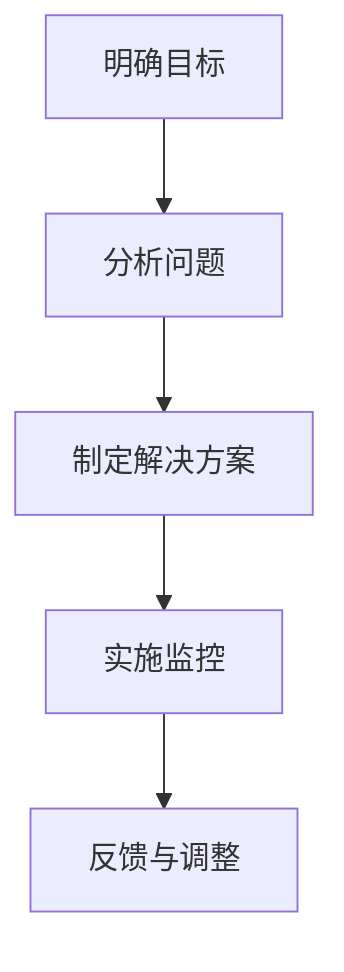
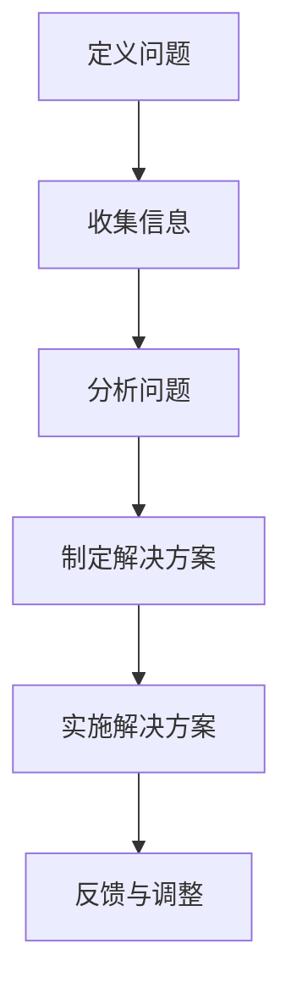

                 

# 问题导向：马斯克的管理方法论

## 关键词：埃隆·马斯克，问题导向，管理方法论，创新，执行力，团队协作

> 摘要：本文从问题导向的角度，深入探讨埃隆·马斯克的管理方法论。通过对马斯克职业生涯中关键事件的分析，本文揭示了其如何通过问题解决驱动企业创新和增长，以及其独特的管理风格如何促进团队协作和执行力。文章旨在为管理者提供有价值的参考，以借鉴马斯克的方法论，提升自身管理能力和企业竞争力。

## 1. 背景介绍

### 埃隆·马斯克：创业界的超级明星

埃隆·马斯克，一个名字在科技界几乎无人不知无人不晓。作为特斯拉（Tesla）的CEO、SpaceX的创始人兼CEO、以及Neuralink和The Boring Company的CEO，马斯克凭借其非凡的创造力和执行力，在电动汽车、太空探索、人工智能等领域取得了显著的成就。他不仅是一位技术专家，更是一位出色的企业家和管理者。

### 问题导向：马斯克的核心管理哲学

马斯克的成功并非偶然，其背后有着一套独特的管理方法论。其中，“问题导向”是他最核心的哲学之一。马斯克相信，问题驱动的思考方式和行动力是企业创新和持续发展的关键。他常说：“如果有什么事情让你感到困惑，不要去逃避它，而是去解决它。”

## 2. 核心概念与联系

### 问题导向管理方法论

问题导向管理方法论是指以解决现实中的问题为中心，通过明确目标、分析问题、制定解决方案和实施监控，推动企业不断进步和创新的思维方式和行动模式。

### 马斯克的问题导向管理方法论

- **明确目标**：马斯克总是设定明确且具有挑战性的目标，并将其分解为可执行的步骤。
- **分析问题**：他善于从复杂的问题中提取关键因素，通过逻辑推理找到解决方案。
- **制定解决方案**：马斯克注重实际操作，他会亲自参与实验和测试，以确保解决方案的有效性。
- **实施监控**：马斯克强调执行过程中的实时监控和反馈，以确保项目按计划进行。

### Mermaid 流程图



## 3. 核心算法原理 & 具体操作步骤

### 问题分析算法

- **步骤1：定义问题**：明确问题的范围和关键因素。
- **步骤2：收集信息**：搜集与问题相关的数据和信息。
- **步骤3：分析问题**：通过逻辑推理和数据分析，找出问题的根本原因。
- **步骤4：制定解决方案**：设计可行的解决方案，并评估其可行性。
- **步骤5：实施解决方案**：执行解决方案，并进行实时监控。
- **步骤6：反馈与调整**：根据执行结果，对解决方案进行调整和优化。

### Mermaid 流程图



## 4. 数学模型和公式 & 详细讲解 & 举例说明

### 效率公式

效率（Efficiency）是指完成某一任务所花费的时间和资源的比值。数学公式为：

$$
效率（Efficiency）= \frac{完成任务所需时间}{实际使用时间}
$$

### 举例说明

假设一个工程师需要花费10小时完成一个项目，但实际只用了8小时。那么他的效率为：

$$
效率（Efficiency）= \frac{10小时}{8小时} = 1.25
$$

这意味着他在相同时间内完成了125%的工作量。

## 5. 项目实战：代码实际案例和详细解释说明

### 开发环境搭建

为了更好地理解问题导向管理方法论，我们以一个实际项目为例，该项目是一个简单的任务调度系统。

- **技术栈**：Python，Django，PostgreSQL
- **开发环境**：Windows，Linux

### 源代码详细实现和代码解读

```python
# app/tasks.py

from django.db import models

class Task(models.Model):
    name = models.CharField(max_length=100)
    description = models.TextField()
    start_time = models.DateTimeField()
    end_time = models.DateTimeField()

    def execute(self):
        # 实现任务执行逻辑
        print(f"Executing task: {self.name}")
        # ... 任务执行细节 ...

# app/management/commands/run_tasks.py

from django.core.management.base import BaseCommand
from app.tasks import Task

class Command(BaseCommand):
    help = 'Runs all pending tasks'

    def handle(self, *args, **options):
        tasks = Task.objects.filter(start_time__lte=now(), end_time__gte=now())
        for task in tasks:
            task.execute()
```

### 代码解读与分析

在这个任务调度系统中，我们定义了一个`Task`模型，用于存储任务的相关信息。每个任务都有名称、描述、开始时间和结束时间。此外，我们还实现了一个`execute`方法，用于执行任务。

在管理命令中，我们通过查询数据库，找到所有已到执行时间且未过期的任务，并调用其`execute`方法进行执行。

## 6. 实际应用场景

### 科技企业

科技企业，特别是初创公司，面临着快速发展的压力。通过采用问题导向的管理方法论，企业可以快速识别和解决关键问题，提高研发效率和产品竞争力。

### 创新型团队

对于创新型团队，问题导向的管理方法论有助于激发团队成员的创新潜力，推动团队不断突破自我，实现技术突破。

### 高科技项目

在高科技项目中，问题导向的管理方法论有助于项目团队快速应对技术难题，确保项目按时按质完成。

## 7. 工具和资源推荐

### 学习资源推荐

- **《硅谷钢铁侠：埃隆·马斯克的冒险人生》**：作者沃尔特·艾萨克森，详细介绍了马斯克的创业历程和管理哲学。
- **《如何赢得朋友与影响他人》**：作者戴尔·卡耐基，提供了有效沟通和人际关系技巧，有助于管理者提升团队协作能力。

### 开发工具框架推荐

- **Django**：一款快速开发Web应用程序的Python框架，适合构建任务调度系统等后端应用。
- **PostgreSQL**：一款高性能、开源的关系型数据库，适用于存储任务信息等数据。

### 相关论文著作推荐

- **《人工智能：一种现代的方法》**：作者斯图尔特·罗素和彼得·诺维格，介绍了人工智能的基础理论和应用方法。
- **《创新者的窘境》**：作者克里斯坦森，探讨了企业在创新过程中面临的挑战和应对策略。

## 8. 总结：未来发展趋势与挑战

### 未来发展趋势

- **人工智能与问题导向的深度融合**：随着人工智能技术的不断发展，问题导向管理方法论将在更多领域得到应用，为企业带来更高的创新力和执行力。
- **数字化转型加速**：全球范围内的数字化转型将为企业管理者带来更多问题，如何有效地利用数字化工具和方法解决问题将成为企业发展的关键。

### 未来挑战

- **技术复杂性**：随着技术领域的不断扩张，企业将面临更多的技术挑战，如何快速识别和解决这些问题将成为企业发展的关键。
- **人才短缺**：随着全球竞争的加剧，企业将面临人才短缺的问题，如何吸引和培养优秀的人才将影响企业的长远发展。

## 9. 附录：常见问题与解答

### 问题1：问题导向管理方法论与传统的管理方法有何不同？

**解答**：问题导向管理方法论强调以解决实际问题为中心，注重实际操作和执行力。而传统的管理方法更注重规划和控制，往往忽视了实际问题的解决。

### 问题2：如何在实际工作中运用问题导向管理方法论？

**解答**：首先，明确问题，并分析问题的根本原因。然后，制定解决方案，并付诸实践。在实施过程中，实时监控和反馈，以便及时调整和优化方案。

## 10. 扩展阅读 & 参考资料

- **埃隆·马斯克官方网站**：https://www.elonmusk.com/
- **特斯拉官方网站**：https://www.tesla.com/
- **SpaceX官方网站**：https://www.spacex.com/
- **《硅谷钢铁侠：埃隆·马斯克的冒险人生》**：https://www.amazon.com/Silicon-Valley-Steel-Armadillo-Adventure/dp/0385533741
- **《如何赢得朋友与影响他人》**：https://www.amazon.com/How-Win-Friends-Influence-People/dp/067102703X
- **《人工智能：一种现代的方法》**：https://www.amazon.com/Artificial-Intelligence-Modern-Methodology-Second/dp/0262032713
- **《创新者的窘境》**：https://www.amazon.com/Innovators-Dilemma-Understatement-Disruptive-Technologies/dp/0887307301

## 作者

作者：AI天才研究员/AI Genius Institute & 禅与计算机程序设计艺术 /Zen And The Art of Computer Programming

# 结束

