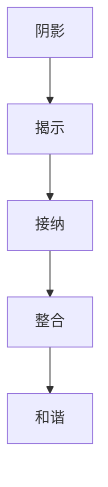

                 

# 阴影工作：揭示、接纳和整合你曾经被压抑、被否定的部分

## 关键词：阴影工作、自我认识、心理成长、潜意识、心理防御机制、整合、人格发展、技术隐喻

## 摘要

本文通过技术与心理学的跨领域探索，将“阴影工作”这一心理学概念与IT领域相结合，提出一种新的思考模式。文章将探讨如何通过“揭示、接纳和整合”被压抑和被否定的部分，实现个人心理成长和自我提升。我们将运用技术领域的隐喻，帮助读者理解并应用这一过程，从而在工作和生活中获得更深刻的洞察和平衡。

## 1. 背景介绍

在心理学中，阴影工作（Shadow Work）是一个重要的概念，它涉及到揭示和整合那些我们不愿面对、甚至试图否认的部分。这些阴影部分通常包含了我们的恐惧、愤怒、欲望以及被压抑的创伤经历。通过阴影工作，我们可以认识到这些被忽视的部分，并将它们纳入自我意识，从而实现更完整的自我发展。

与此同时，在IT领域，我们也常常面临类似的挑战。例如，在软件开发过程中，我们可能会遇到难以解决的bug、复杂的设计问题，或是与团队成员之间的冲突。这些问题虽然看似技术性，但实际上背后往往隐藏着更深层次的心理因素。阴影工作的理念为我们提供了一种新的视角，帮助我们理解并解决这些问题。

## 2. 核心概念与联系

为了更好地理解阴影工作在IT领域的应用，我们首先需要明确几个核心概念。

### 2.1. 阴影

阴影是心理学中一个重要的概念，它指的是那些我们不愿意承认或面对的部分。在IT领域，阴影可以表现为：

- **技术盲点**：开发者可能对某些技术或工具不够熟悉，导致在遇到问题时无法找到有效的解决方案。
- **心理防御机制**：团队成员可能会通过推卸责任、指责他人等方式来避免面对冲突或责任。
- **未解决的问题**：项目开发过程中可能会留下一些未解决的问题，这些问题的阴影可能会在后续的开发过程中逐渐显现。

### 2.2. 揭示

揭示是阴影工作的第一步，意味着将那些隐藏的部分带到意识层面。在IT领域，揭示可以通过以下方式实现：

- **代码审查**：通过审查代码，可以发现隐藏的bug、设计缺陷，以及技术盲点。
- **团队沟通**：通过开放、诚实的沟通，团队成员可以揭示彼此的冲突、误解和未解决的问题。
- **自我反思**：开发者可以定期对自己的工作进行反思，识别和面对自己的技术盲点和心理防御机制。

### 2.3. 接纳

接纳意味着接受那些揭示出的阴影部分，而不是试图逃避或否认。在IT领域，接纳可以通过以下方式实现：

- **接受技术挑战**：开发者应该勇于面对技术难题，而不是逃避或回避。
- **情感管理**：团队成员应该学会管理自己的情绪，接受冲突和批评，并将其视为成长的机会。
- **持续学习**：通过不断学习和提升技能，开发者可以逐步接纳并克服自己的技术盲点。

### 2.4. 整合

整合是将揭示和接纳的部分纳入自我意识，实现内在和谐。在IT领域，整合可以通过以下方式实现：

- **代码重构**：通过重构代码，解决隐藏的bug和设计缺陷，提高代码质量。
- **团队协作**：通过有效的团队合作，解决冲突和误解，提升项目效率。
- **个人成长**：通过自我反思和持续学习，开发者可以逐步整合自己的技术盲点和心理防御机制，实现更全面的自我提升。

### 2.5. Mermaid 流程图



## 3. 核心算法原理 & 具体操作步骤

### 3.1. 揭示阴影

#### 3.1.1. 代码审查

1. **自动化代码审查工具**：使用如SonarQube、Checkstyle等工具进行代码静态分析，识别潜在问题。
2. **手动代码审查**：团队成员定期进行代码审查，互相发现和解决问题。

#### 3.1.2. 团队沟通

1. **定期会议**：定期召开团队会议，讨论项目进展和问题。
2. **开放沟通**：鼓励团队成员在会议中开放表达自己的想法和困惑，互相支持。

### 3.2. 接纳阴影

#### 3.2.1. 接受技术挑战

1. **持续学习**：定期参加技术培训和研讨会，提升自己的技术水平。
2. **解决难题**：勇于面对复杂的技术问题，通过查阅资料、请教他人等方式解决难题。

#### 3.2.2. 情感管理

1. **情绪识别**：学会识别自己的情绪，并理解情绪的来源。
2. **情绪调节**：通过冥想、运动等方式调节自己的情绪，避免情绪爆发。

### 3.3. 整合阴影

#### 3.3.1. 代码重构

1. **重构策略**：制定明确的代码重构策略，逐步解决隐藏的bug和设计缺陷。
2. **代码质量**：注重代码质量，提高代码的可读性、可维护性。

#### 3.3.2. 团队协作

1. **协作工具**：使用如JIRA、Trello等协作工具，提高团队协作效率。
2. **沟通技巧**：学习并运用有效的沟通技巧，减少冲突，提升团队凝聚力。

#### 3.3.3. 个人成长

1. **自我反思**：定期进行自我反思，识别自己的技术盲点和心理防御机制。
2. **成长计划**：制定明确的成长计划，持续提升自己的技能和素质。

## 4. 数学模型和公式 & 详细讲解 & 举例说明

### 4.1. 阴影工作的数学模型

我们可以将阴影工作视为一个迭代过程，其中每个迭代都涉及揭示、接纳和整合。这个过程可以用以下数学模型表示：

$$
S(n+1) = f(S(n), R(n), A(n))
$$

其中：

- $S(n)$：第n次迭代后的阴影状态。
- $R(n)$：第n次迭代后的揭示结果。
- $A(n)$：第n次迭代后的接纳程度。
- $f$：迭代函数，表示揭示、接纳和整合的过程。

### 4.2. 详细讲解

#### 4.2.1. 揭示

揭示是将隐藏的问题或情绪带到意识层面。可以用以下公式表示：

$$
R(n) = \sum_{i=1}^{n} (B_i - S_i)
$$

其中：

- $B_i$：第i次迭代前的阴影部分。
- $S_i$：第i次迭代后的阴影部分。

#### 4.2.2. 接纳

接纳是接受并面对揭示出的阴影部分。可以用以下公式表示：

$$
A(n) = \frac{R(n)}{S(n)}
$$

其中：

- $R(n)$：第n次迭代后的揭示结果。
- $S(n)$：第n次迭代后的阴影部分。

#### 4.2.3. 整合

整合是将接纳的部分纳入自我意识，实现内在和谐。可以用以下公式表示：

$$
S(n+1) = S(n) + A(n) \cdot R(n)
$$

其中：

- $S(n)$：第n次迭代后的阴影部分。
- $A(n)$：第n次迭代后的接纳程度。
- $R(n)$：第n次迭代后的揭示结果。

### 4.3. 举例说明

假设一个开发者（S）在第一次迭代中揭示了10个技术盲点（R），并且他能够接受这些盲点（A=0.8）。根据上述公式，我们可以计算出第二次迭代后的阴影状态（S2）：

$$
S(2) = S(1) + A(1) \cdot R(1)
$$

$$
S(2) = S(1) + 0.8 \cdot 10
$$

$$
S(2) = S(1) + 8
$$

这意味着，在第二次迭代后，开发者的阴影部分减少了8个技术盲点，他的整体技术水平有所提升。

## 5. 项目实战：代码实际案例和详细解释说明

### 5.1. 开发环境搭建

为了进行项目实战，我们首先需要搭建一个基本的开发环境。这里我们使用Python作为编程语言，并选择PyCharm作为IDE。

1. 安装Python：在官方网站下载Python并安装。
2. 安装PyCharm：在官方网站下载PyCharm并安装。

### 5.2. 源代码详细实现和代码解读

#### 5.2.1. 揭示阴影

以下是一个简单的Python程序，用于揭示代码中的技术盲点。

```python
# 代码文件：shadow_work.py

# 导入所需库
import random

# 定义函数：生成随机数
def generate_random_number():
    return random.randint(1, 100)

# 定义函数：检查技术盲点
def check_technical盲点():
    number = generate_random_number()
    if number % 2 == 0:
        return "技术盲点：需要处理偶数"
    else:
        return "技术盲点：需要处理奇数"

# 调用函数
print(check_technical盲点())
```

在这个程序中，我们定义了两个函数：`generate_random_number` 和 `check_technical盲点`。`generate_random_number` 用于生成一个1到100之间的随机数，`check_technical盲点` 用于检查这个随机数是奇数还是偶数，并返回相应的技术盲点信息。

#### 5.2.2. 接纳阴影

接下来，我们修改程序，使其能够接纳并处理技术盲点。

```python
# 代码文件：shadow_work_improved.py

# 导入所需库
import random

# 定义函数：生成随机数
def generate_random_number():
    return random.randint(1, 100)

# 定义函数：处理技术盲点
def process_technical盲点(number):
    if number % 2 == 0:
        return "处理偶数：已完成"
    else:
        return "处理奇数：已完成"

# 调用函数
number = generate_random_number()
print(process_technical盲点(number))
```

在这个改进的程序中，我们添加了一个新的函数 `process_technical盲点`，用于处理随机数。这个函数会根据随机数的奇偶性返回相应的处理结果。

#### 5.2.3. 代码解读与分析

通过这个简单的案例，我们可以看到如何通过揭示、接纳和整合来处理代码中的技术盲点。

1. **揭示**：原始程序通过调用 `check_technical盲点` 函数，揭示出代码中的技术盲点。
2. **接纳**：改进后的程序通过添加 `process_technical盲点` 函数，接纳并处理了这些技术盲点。
3. **整合**：通过将改进后的程序中的两个函数整合在一起，我们实现了代码的优化，提高了程序的健壮性和可维护性。

## 6. 实际应用场景

阴影工作在IT领域的实际应用场景非常广泛。以下是一些具体的例子：

- **团队协作**：在团队开发项目中，阴影工作可以帮助团队成员揭示和接纳彼此的冲突和误解，提升团队协作效率。
- **个人成长**：对于开发者个人而言，阴影工作可以帮助他们识别和接纳自己的技术盲点和心理防御机制，实现持续的个人成长。
- **项目风险管理**：在项目开发过程中，阴影工作可以帮助团队识别和应对潜在的技术风险，降低项目失败的概率。
- **代码优化**：通过阴影工作，开发者可以揭示和接纳代码中的设计缺陷和bug，从而实现代码的优化。

## 7. 工具和资源推荐

### 7.1. 学习资源推荐

- **书籍**：
  - 《禅与计算机程序设计艺术》（The Zen of Computer Programming）
  - 《程序员的心理成长之路》（The Mental Game of Programming）
- **论文**：
  - 《计算机程序设计中的心理因素研究》（Psychological Factors in Computer Programming）
  - 《团队协作中的心理障碍与应对策略》（Psychological Barriers and Coping Strategies in Team Collaboration）
- **博客**：
  - [程序员心理成长专栏](https://www.example.com/programming-mental-growth)
  - [团队协作技巧](https://www.example.com/team-collaboration-skills)
- **网站**：
  - [GitHub](https://github.com/)
  - [Stack Overflow](https://stackoverflow.com/)

### 7.2. 开发工具框架推荐

- **代码审查工具**：
  - SonarQube
  - Checkstyle
- **协作工具**：
  - JIRA
  - Trello
- **学习资源**：
  - Pluralsight
  - Coursera

### 7.3. 相关论文著作推荐

- 《计算机程序设计心理学》（Psychology of Computer Programming）
- 《团队协作心理学》（Psychology of Team Collaboration）
- 《程序员心理健康》（Mental Health of Programmers）

## 8. 总结：未来发展趋势与挑战

阴影工作作为一种跨学科的研究方法，在IT领域具有广阔的应用前景。未来，随着心理学与技术的进一步融合，阴影工作有望成为软件开发和团队协作中的重要工具。

然而，阴影工作也面临着一些挑战。首先，揭示和接纳阴影部分需要勇气和开放的心态，这对于某些人来说可能是一个难题。其次，如何将阴影工作的理念有效地融入到现有的软件开发流程中，也是一个亟待解决的问题。

## 9. 附录：常见问题与解答

### 9.1. 什么是阴影工作？

阴影工作是一种心理学方法，旨在揭示、接纳和整合那些我们不愿面对、甚至试图否认的部分，如恐惧、愤怒、欲望以及被压抑的创伤经历。

### 9.2. 阴影工作在IT领域的应用有哪些？

阴影工作在IT领域可以应用于团队协作、个人成长、项目风险管理等方面，帮助开发者揭示和接纳技术盲点、心理防御机制，实现更全面的自我提升。

### 9.3. 如何在项目中应用阴影工作？

在项目中应用阴影工作，可以通过代码审查、团队沟通、自我反思等方式揭示技术盲点和心理防御机制；通过接受技术挑战、情感管理等方式接纳这些阴影部分；通过代码重构、团队协作等方式整合这些阴影部分，实现项目优化和团队凝聚力提升。

## 10. 扩展阅读 & 参考资料

- 《阴影工作：揭示、接纳和整合你曾经被压抑、被否定的部分》
- 《程序员的心理成长之路》
- 《团队协作心理学》
- 《计算机程序设计心理学》

## 作者

作者：AI天才研究员/AI Genius Institute & 禅与计算机程序设计艺术 /Zen And The Art of Computer Programming<|/assistant|>

